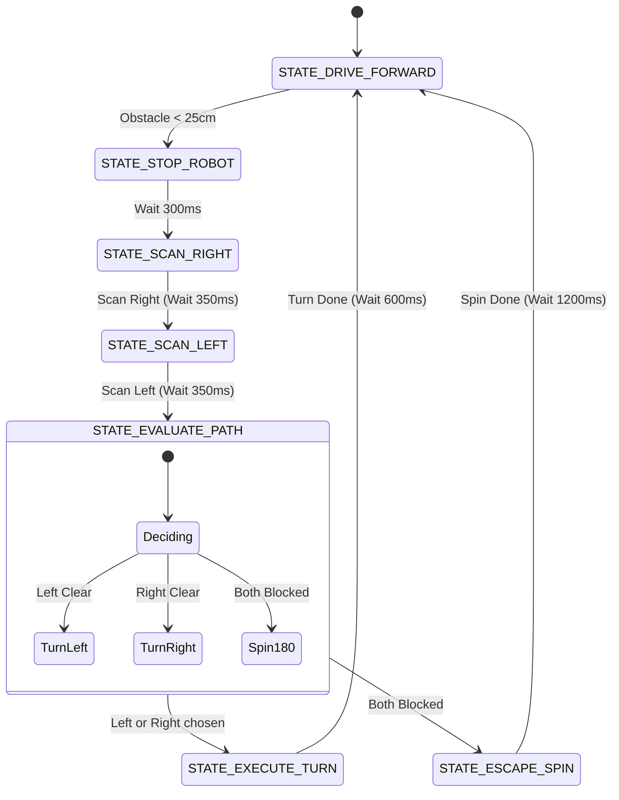
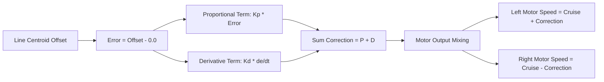
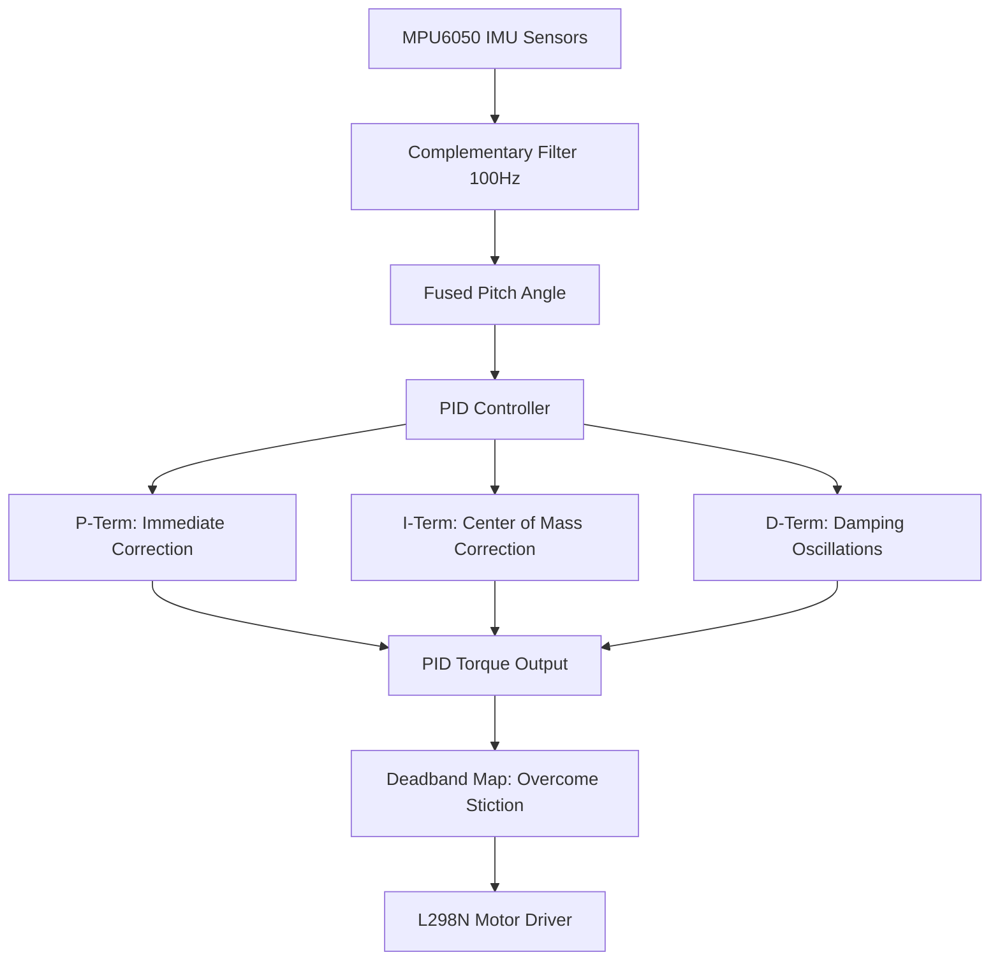
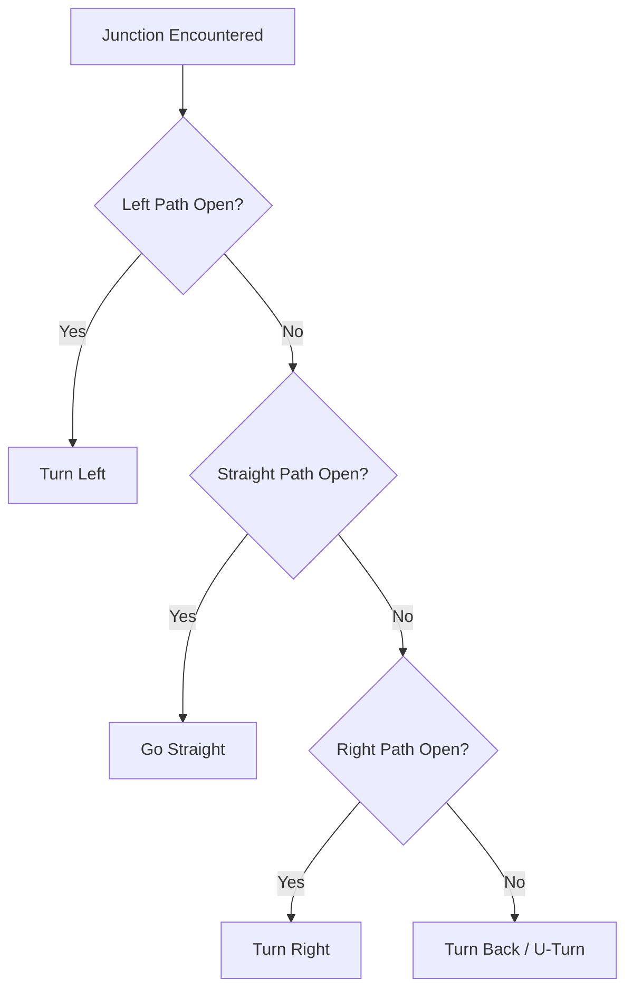
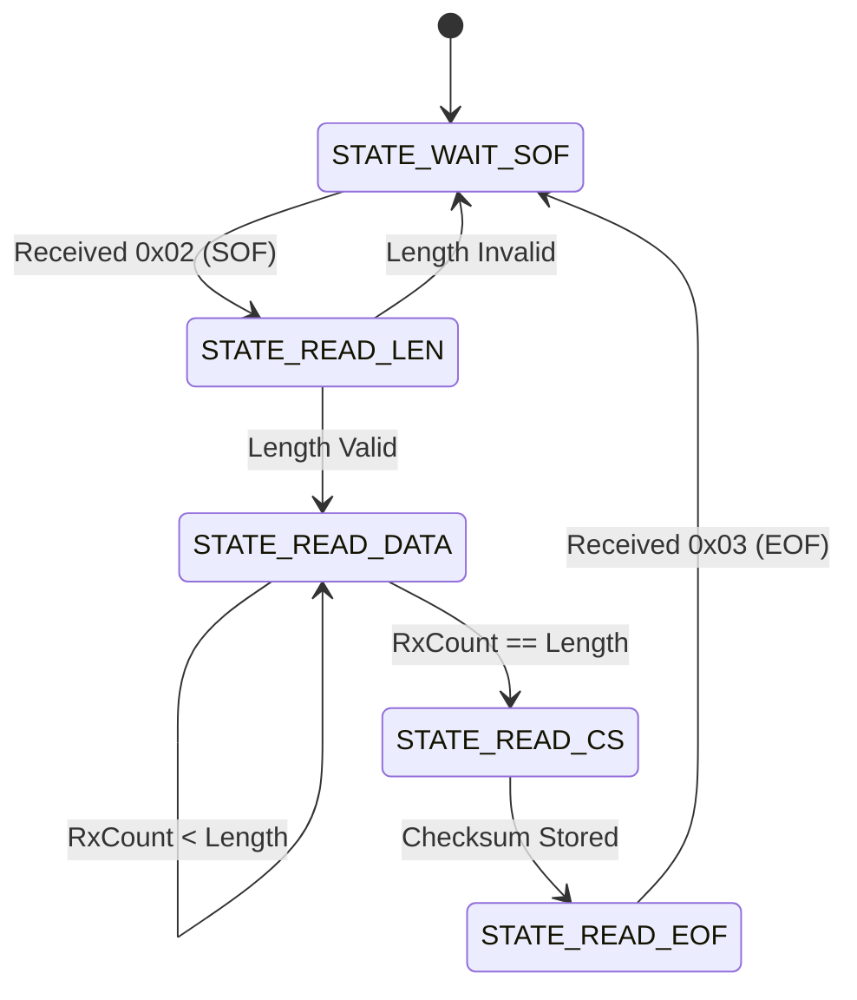

# 100 Days of Arduino Masterclass

*Compiled dynamically from the master repository*

---

# Part 1: Arduino Theory & Foundations

# Chapter 1: What is Arduino?

Welcome to Chapter 1! Before we start wiring things up and writing code, it's crucial to understand what exactly we are dealing with. 

## So, what *is* Arduino?

When people say "Arduino", they are usually talking about three things at once:

1. **The Hardware:** A physical circuit board (microcontroller board) that you can connect sensors, motors, and lights to.
2. **The Software:** The Arduino IDE (Integrated Development Environment), a program you install on your computer to write and upload code to the physical board.
3. **The Company/Community:** Arduino is an open-source hardware and software company, backed by a massive community of makers, engineers, and hobbyists who share code, designs, and tutorials.

In short, **Arduino is a platform that allows you to read inputs (like a finger on a button, or light on a sensor) and turn it into an output (like activating a motor, turning on an LED, or publishing something online).**


## Anatomy of the Arduino Uno

The Arduino Uno is the quintessential beginner board. Let's look at its different parts so you know what you are holding.


Here is what all those components do:

### 1. Power connections
- **USB Port:** This is how you connect the Arduino to your computer. It provides both power (5 Volts) and a data connection to upload your code.
- **Barrel Jack:** If you want your Arduino to run away from a computer (e.g., on a robot), you can plug a battery or wall adapter (7-12V) in here. The board will regulate it down to the 5V it needs.

### 2. The Pins
Pins are the places where you connect wires to build circuits.
- **Power Pins (3.3V, 5V, GND, Vin):** These provide power to your sensors and breadboard. `GND` stands for Ground (0V), which is essential to complete any electrical circuit.
- **Analog Pins (A0 to A5):** These pins can read continuous ranges of voltages (like a volume knob or a temperature sensor). They read values from 0 to 1023.
- **Digital Pins (0 to 13):** These pins can either be `HIGH` (ON, 5V) or `LOW` (OFF, 0V). You use these for things that are either on or off, like an LED or a simple push-button.
  - *Note: Pins with a tilde `~` next to them (like 3, 5, 6, 9, 10, 11) can simulate analog outputs using something called PWM (Pulse Width Modulation). We'll cover this later!*

### 3. The Microcontroller Chip
The large black chip with metal legs in the center of the board. As mentioned earlier, this is the ATmega328P—the actual "brain" that stores and executes your code.

### 4. Reset Button
Pushing this button momentarily connects the reset pin to ground, restarting whatever code is currently loaded on the Arduino. It does *not* erase your code.

### 5. TX and RX LEDs
TX stands for Transmit, and RX stands for Receive. These tiny lights flash whenever your Arduino is communicating with your computer over USB (like when you upload a new program).

### 6. The Built-in LED (Pin 13)
The Arduino has a tiny LED built right onto the board, connected internally to Digital Pin 13. This is incredibly useful for testing if your board is alive without having to wire up a single thing.


Now that you know what an Arduino is and what its parts are, it's time to look at the different types of boards available.

**[Next Chapter: The Arduino Family ->](./Chapter_02_The_Arduino_Family.md)**

---

# Chapter 2: The Arduino Family

While the Arduino Uno is the most famous board, it is far from the only one. Depending on your project's size, power requirements, and necessary features, you might need a different flavor of Arduino.

Here is a breakdown of the most common boards in the Arduino ecosystem.

## 1. Arduino Uno (The Classic)
**Best for:** Beginners, prototyping, general learning.

The Uno is the board you will use for 90% of your initial learning. Almost all tutorials and libraries are written with the Uno in mind. It has female headers that make it extremely easy to plug in jumper wires for a breadboard.

- **Microcontroller:** ATmega328P
- **Operating Voltage:** 5V
- **Digital I/O Pins:** 14 (6 PWM)
- **Analog Input Pins:** 6

## 2. Arduino Nano (The Small Fry)
**Best for:** Permanent installations, putting inside small enclosures, breadboard-friendly prototyping.


The Nano is essentially an Arduino Uno shrunk down to the size of your thumb. It has almost the exact same specifications as the Uno, but instead of female headers, it usually comes with male pins so you can plug it directly into a breadboard or solder it to a custom PCB.

- **Microcontroller:** ATmega328P
- **Operating Voltage:** 5V
- **Digital I/O Pins:** 14 (6 PWM)
- **Analog Input Pins:** 8 (2 more than the Uno!)

## 3. Arduino Mega 2560 (The Heavy Lifter)
**Best for:** 3D Printers, robotics, projects requiring lots of sensors and outputs.


If you run out of pins on your Uno, you upgrade to the Mega. It is significantly larger and is packed with I/O pins and memory. It is heavily used in complex DIY robotics and custom CNC machines.

- **Microcontroller:** ATmega2560
- **Operating Voltage:** 5V
- **Digital I/O Pins:** 54 (15 PWM)
- **Analog Input Pins:** 16

## 4. Arduino Micro / Leonardo (The Keyboard Mimic)
**Best for:** Custom game controllers, macro pads, simulating a mouse or keyboard.


These boards use a different chip (the ATmega32U4). The special feature of this chip is that it has built-in USB communication. This means your computer can recognize it as a standard USB Keyboard or Mouse! We use the Leonardo in Day 90-92 of the 100 Days of Arduino to build custom HID devices.

- **Microcontroller:** ATmega32U4
- **Operating Voltage:** 5V

## 5. The Advanced Alternatives: ESP8266 & ESP32
**Best for:** IoT (Internet of Things), Wi-Fi and Bluetooth projects, processing-heavy tasks.


While technically not official "Arduino" boards, these microcontrollers by Espressif can be programmed using the Arduino IDE. They are incredibly cheap, massively more powerful than an Arduino Uno, and feature built-in Wi-Fi (and Bluetooth for the ESP32). Once you master the basics on an Uno, the ESP32 is usually the next logical step for a modern maker.

- **Microcontroller:** Xtensa Dual-Core 32-bit (ESP32)
- **Operating Voltage:** 3.3V (Warning: applying 5V to an ESP32 pin will kill it!)
- **Features:** Built-in Wi-Fi & Bluetooth

---

## Which one should you use right now?

For learning the basics and progressing through the 100 Days of Arduino challenge, **you should use the Arduino Uno.**

Its layout is the easiest to work with, it's robust (it takes a lot of abuse before dying), and every single component in a standard starter kit is designed to plug right into it.

Once your projects outgrow the Uno, you'll know exactly which board to grab next.

**[Next Chapter: Setting Up Your Environment ->](./Chapter_03_Setting_Up_Your_Environment.md)**

---

# Chapter 3: Setting Up Your Environment

You have your Arduino board, and a USB cable. Now what? You need a way to write code and send it to the board. 

For this, we use the **Arduino IDE** (Integrated Development Environment).

## Step 1: Download the Arduino IDE


1. Go to the official Arduino Software page: [https://www.arduino.cc/en/software](https://www.arduino.cc/en/software)
2. Download the **Arduino IDE 2.x** for your operating system (Windows, Mac, or Linux). 
3. Run the installer and follow the default prompts.

> [!TIP]
> **Why IDE 2.x?**
> The older Arduino IDE 1.8 is still available and very stable, but the 2.x version introduces modern features like autocompletion (IntelliSense) and a dark mode, which makes writing code much easier!

## Step 2: Connect your Arduino

Plug your Arduino Uno into your computer using the USB cable. 
You should see a green LED on the board light up (indicating it has power). You might also see an orange LED blinking.

## Step 3: Dealing with Drivers (CH340)

If you bought a genuine Arduino board, it should be recognized by your computer instantly.
However, if you bought a cheap clone from Amazon/AliExpress (which is totally fine!), it likely uses a different USB-to-Serial chip called the **CH340**.

**If your computer does not recognize the Arduino:**
You will need to download and install the CH340 driver. 
1. Search online for "CH340 Driver Download" (SparkFun has a great guide and safe download links for this).
2. Install the driver and restart your computer.

## Step 4: Configure the IDE

Open the Arduino IDE. Before you can upload code, you must tell the IDE **what** board you are using and **where** it is plugged in.

1. **Select the Board:** In the top menu bar, there is a dropdown. Click it and click "Select other board and port...". Type "Arduino Uno" in the board search bar and select it.
2. **Select the Port:** In the same menu, select the COM port (Windows) or `/dev/cu.usbserial` (Mac) that your Arduino is plugged into.
   - *How do I know which port is my Arduino?* If you see `COM1`, that is usually your computer's internal hardware. Look for a higher number like `COM3`, `COM4`, or `COM7`. If you aren't sure, unplug the Arduino, see which COM port disappears from the list, plug it back in, and select that one!

## Step 5: Your First Code - Blink

It is tradition in programming that your first program is called "Hello World." In the hardware world, the equivalent is making an LED blink.

The Arduino IDE comes with built-in examples. Let's load the blink example!

1. Go to **File > Examples > 01.Basics > Blink**.
2. A new window will open with some code.
3. Click the **Upload** button (the arrow pointing right `→` at the top left of the IDE).

### What is happening?
1. The IDE "Compiles" the code (translates human-readable C++ into machine code the microcontroller can understand).
2. The TX and RX LEDs on your Arduino board will flash rapidly. This means the code is being transferred over the USB cable.
3. The IDE will say "Done uploading."

**Look at your board!** The built-in LED (next to pin 13) should now be turning on for one second, and off for one second, in a continuous loop.

Congratulations! You have just programmed a microcontroller.

---

Before we start modifying that code, we need to understand a tiny bit of electronics so we don't accidentally blow anything up.

**[Next Chapter: Basic Electronics Crash Course ->](./Chapter_04_Basic_Electronics_Crash_Course.md)**

---

# Chapter 4: Basic Electronics Crash Course

Before we start plugging wires into the Arduino, we need to understand the fundamental laws of electricity. Don't worry, we're not getting a degree in electrical engineering today—just the absolute basics to keep our Arduino from letting out the "magic smoke" (burning up).

## The Big Three: Voltage, Current, and Resistance

Electricity is often compared to water flowing through pipes.

1. **Voltage (V) - Measured in Volts:** This is the water pressure. It is the force pushing the electricity through the wire. Your Arduino Uno operates at **5 Volts (5V)**.
2. **Current (I) - Measured in Amperes (Amps/mA):** This is the flow rate of the water. How much electricity is actually moving through the wire. Microcontrollers deal in very small amounts of current, usually measured in milliamperes (mA) (1/1000th of an Amp).
3. **Resistance (R) - Measured in Ohms (Ω):** This is a kink in the pipe. It restricts the flow of current.

### Ohm's Law
These three properties are mathematically linked by Ohm's Law: **V = I × R** (Voltage = Current × Resistance). 
If you have a 5V supply, and you want to lower the current (I), you must increase the resistance (R).

> [!CAUTION]  
> **The Golden Rule of Electronics:**
> Electricity MUST have a complete path from a power source (Voltage) back to the ground (GND) to flow. If there is no complete path, nothing happens.
> **BUT**, if that path has **ZERO resistance**, infinite current will try to flow instantly, causing a **Short Circuit**. This will fry your Arduino or start a fire. Never connect 5V directly to GND with just a wire!


## Basic Components

### 1. Jumper Wires

These are just wires with pins on the end. The color doesn't matter electrically, but for your own sanity, try to establish a color code!
- Red = Power (5V)
- Black/Brown = Ground (GND)
- Yellow/Green/Blue = Signal wires

### 2. Resistors

Resistors restrict the flow of current. They are not polarized, meaning you can plug them in backwards and they work the same.
You can tell the value of a resistor by looking at the colored bands painted on it. For beginners, a simple multimeter is much easier than memorizing the color codes!

### 3. LEDs (Light Emitting Diodes)

LEDs turn electricity into light. 
- **They are Polarized!** Electricity can only flow through an LED in one direction. 
- The long leg is the **Anode (+)**.
- The short leg is the **Cathode (-)** (often next to a flat edge on the plastic bulb).

> [!WARNING]  
> **Never connect an LED directly to 5V and GND!** 
> An LED has almost no internal resistance. If you connect it directly to 5V, it will draw too much current and instantly explode/burn out.
> **Always put a resistor in series with an LED.** For a 5V Arduino, a 220Ω or 330Ω resistor is perfect.

---

## Your First Real Circuit

Take your Arduino, a breadboard, an LED, a 220 Ohm resistor, and two jumper wires.

1. Connect a wire from the Arduino's `GND` pin to the blue rail on the breadboard.
2. Connect a wire from the Arduino's `5V` pin to the red rail on the breadboard.
3. Plug the resistor into the breadboard so one leg is in the red rail (5V), and the other leg is in a random row in the middle (e.g., row 10).
4. Plug the LED into the breadboard. The **Long Leg (+)** goes into the same row as the resistor (row 10).
5. Plug the **Short Leg (-)** of the LED into the blue rail (GND).

The LED should instantly light up! 
You just completed a circuit: `5V -> Resistor -> LED -> GND`.

Now that we understand how to safely power components, let's learn how to control them with code.

**[Next Chapter: Arduino Programming Basics ->](./Chapter_05_Arduino_Programming_Basics.md)**

---

# Chapter 5: Arduino Programming Basics

Arduino is programmed using a language heavily based on **C++**. 

If you have never coded before, C++ can look a little intimidating. It requires strict formatting. Forgetting a single semicolon `;` will break the whole program! Let's break down the anatomy of an Arduino sketch.

## The Anatomy of a Sketch

Every Arduino program (called a "sketch") MUST have two specific functions: `setup()` and `loop()`.

```cpp
void setup() {
  // put your setup code here, to run once:

}

void loop() {
  // put your main code here, to run repeatedly:

}
```

### 1. `setup()`
When you power on the Arduino (or press the reset button), the microcontroller reads the code inside the `{ }` brackets of the `setup()` function exactly **one time**.
We use this area to configure the Arduino. (e.g., "Set pin 13 as an output", "Start communicating with the computer").

### 2. `loop()`
Immediately after `setup()` finishes, the Arduino jumps into the `loop()` function. It reads the code line by line, top to bottom. When it reaches the bottom `}`, it immediately jumps back to the top and does it again. 
It will do this millions of times a second until you unplug the power.


## Variables and Data Types

A variable is a named bucket where you can store data in the Arduino's memory. 
Because C++ is "strongly typed," you have to tell the Arduino exactly what *kind* of bucket you are making before you can put data in it.

Here are the most common data types you will use:

1. **`int` (Integer):** Whole numbers (e.g., -5, 0, 10, 400).
2. **`float` (Floating-point):** Numbers with decimals (e.g., 3.14, -0.5).
3. **`boolean` or `bool`:** Can only hold two values: `true` or `false` (or `HIGH`/`LOW`, `1`/`0`).
4. **`char`:** A single character, enclosed in single quotes (e.g., `'A'`, `'z'`).
5. **`String`:** Text, enclosed in double quotes (e.g., `"Hello World"`).

### How to use variables:

```cpp
int myAge = 25;       // Created an integer named myAge, set it to 25
float temperature = 72.5; // Created a float named temperature
bool isLightOn = false;   // Created a boolean set to false

void setup() {
  // You can change the value of variables later!
  myAge = 26; 
}
```

---

## Global vs. Local Scope

Where you create your variable matters!

If you create a variable **outside** of all functions (usually at the very top of your file), it is a **Global Variable**. Any function can see it and change it.

If you create a variable **inside** the curly braces `{ }` of a function (like inside `loop()`), it is a **Local Variable**. It only exists inside those braces. Once the function ends, the variable is destroyed and forgotten.

```cpp
int counter = 0; // GLOBAL variable. setup() and loop() can both see this.

void loop() {
  int tempValue = 5; // LOCAL variable. Only loop() can see this.
  
  counter = counter + 1; // This works!
}
```

Now that we know how to write basic code and store data, let's learn how to make the Arduino interact with the physical world!

**[Next Chapter: Digital and Analog I/O ->](./Chapter_06_Digital_and_Analog_IO.md)**

---

# Chapter 6: Digital and Analog I/O

I/O stands for Input / Output. 
This is how your Arduino interacts with the world. Inputs are how it *listens* (reading sensors, buttons), and Outputs are how it *speaks* (turning on motors, LEDs, buzzers).

The Arduino Uno operates purely on electrical voltage. 

## Digital vs. Analog

Before writing code, we need to understand the difference between Digital and Analog signals.

- **Digital:** Think of a simple light switch. It is either completely ON or completely OFF. There is no in-between. In Arduino terms, this is `HIGH` (5V) or `LOW` (0V).
- **Analog:** Think of a volume knob or a dimmer switch. It can be anywhere from 0 to 100%. In Arduino terms, it can read a smooth curve of voltages anywhere between 0V and 5V.


## 2. Digital Output: `digitalWrite()`

Use this to turn things fully ON or fully OFF.

```cpp
void loop() {
  digitalWrite(13, HIGH); // Send 5V out of pin 13 (LED turns ON)
  delay(1000);            // Wait for 1000 milliseconds (1 second)
  digitalWrite(13, LOW);  // Send 0V out of pin 13 (LED turns OFF)
  delay(1000);
}
```
*Note: `delay()` stops the Arduino from doing anything else for that amount of time. In the 100 Days of Arduino challenge, you will learn why professionals rarely use `delay()`!*


## 4. Analog Input: `analogRead()`

The Arduino Uno has 6 dedicated Analog pins (A0 through A5).
When you read these pins, they have a 10-bit resolution. This means instead of `HIGH` or `LOW`, they return a number from **0 to 1023**.
0 = 0 Volts.
1023 = 5 Volts.
512 = ~2.5 Volts.


```cpp
void setup() {
  // Analog pins do not technically need pinMode declared, but it's good practice.
}

void loop() {
  int sensorValue = analogRead(A0); // Read a potentiometer or light sensor
}
```

---

## 5. Analog Output (Faking it): `analogWrite()`

Microcontrollers can't actually output a true analog voltage (like 2.5V). They can only output 5V or 0V.
So how do we dim an LED or slow down a motor? We cheat using **PWM (Pulse Width Modulation)**.

PWM turns the 5V pin ON and OFF incredibly fast. If it's ON 50% of the time and OFF 50% of the time, the LED looks like it is at 50% brightness.

You can only use `analogWrite()` on pins that have a tilde `~` next to them on the board (Pins 3, 5, 6, 9, 10, 11).
Unlike `analogRead()` which goes up to 1023, `analogWrite()` only goes from **0 to 255**.

```cpp
void setup() {
  pinMode(9, OUTPUT);
}

void loop() {
  analogWrite(9, 127); // 127 is exactly half of 255. The LED will be at 50% brightness.
}
```

Now you know how to read and write to the outside world. But how do we tell the Arduino to make decisions based on what it reads?

**[Next Chapter: Control Flow ->](./Chapter_07_Control_Flow.md)**

---

# Chapter 06: Troubleshooting

Even the most experienced engineers encounter bugs, compilation failures, and hardware issues. When you are working with microcontrollers, problems usually fall into one of three categories: **Code**, **Hardware/Wiring**, or **The Toolchain (USB/Drivers)**.

This guide covers the most common errors you will see during your 100-day journey and how to solve them permanently.


## 2. Missing COM Ports / CH340 Driver Issues

If you plug in your Arduino and absolutely nothing shows up in the Port menu, your computer doesn't recognize the USB-to-Serial chip on the board.

Most cheap, third-party Arduino clones use the **CH340** serial chip instead of the standard FTDI chip. Windows and Mac do not always have this driver pre-installed.

### The Fix:
- **Windows:** Download and install the [CH340 Driver](https://sparks.gogo.co.nz/ch340.html). Restart your IDE.
- **Mac:** Install the CH340 driver for macOS. On modern macOS versions, this is often handled automatically, but you may need to allow the extension in System Settings -> Privacy & Security.


## 4. I2C Devices Not Responding

You wired up an LCD or an OLED screen, but it's completely blank, or the code hangs at `Wire.begin()`.

### The Fix:
1. **Check the Wiring:** I2C requires SDA and SCL. On an Arduino Uno/Nano, **SDA is A4** and **SCL is A5**. Do not mix them up!
2. **Check the Address:** Not all I2C devices use the same address. Your LCD might be `0x27` or `0x3F`. Your OLED might be `0x3C` or `0x3D`.
3. **Run an I2C Scanner:** If you aren't sure, run an I2C Scanner sketch (like the one we build in Day 24). It will ping every address and print the correct one to the Serial Monitor.


## Keep Going!
Hardware debugging can be frustrating, but every error you solve makes you a better engineer. If you get stuck, take a break, double-check your jumper wires, and read the error message carefully!

---

# Chapter 7: Control Flow

Code normally executes linearly—top to bottom, line by line. 
But a smart robot needs to make decisions. If the temperature is too hot, turn on a fan. If an obstacle is detected, turn left. 

We change the path of our code using **Control Flow**.

## 1. The `if` Statement

This is the most basic decision-making tool. The code inside the `{ }` only runs if the condition inside the `( )` is true.

```cpp
int temp = 80;

void loop() {
  if (temp > 75) {
    // This code ONLY runs if temp is greater than 75
    digitalWrite(13, HIGH); 
  }
}
```

### Comparison Operators
How do we compare things inside the `if` statement?
- `==` : Equal to (Notice it is TWO equals signs! One `=` assigns a value, two `==` compares values).
- `!=` : Not equal to
- `<` : Less than
- `>` : Greater than
- `<=` : Less than or equal to
- `>=` : Greater than or equal to

## 2. `else` and `else if`

What if you want to do something else when the condition is false? 

```cpp
int buttonState = digitalRead(2);

if (buttonState == LOW) {
  // The button is being pressed
  digitalWrite(13, HIGH); // Turn LED on
} else {
  // The button is NOT being pressed
  digitalWrite(13, LOW);  // Turn LED off
}
```

You can chain multiple conditions together using `else if`:

```cpp
int analogSensor = analogRead(A0);

if (analogSensor > 800) {
  // Do something for high values
} else if (analogSensor > 400) {
  // Do something for medium values
} else {
  // Do something for low values
}
```

## 3. The `for` Loop

If you want to repeat a specific block of code a certain number of times, use a `for` loop. It's great for fading LEDs or stepping motors.

A `for` loop has three parts:
1. **Initialization:** Make a counter variable (usually `i`).
2. **Condition:** Keep looping as long as this is true.
3. **Increment:** What to do to `i` after every loop.

```cpp
// This loop runs 10 times. i goes from 0 to 9.
for (int i = 0; i < 10; i++) {
  // i++ means "add 1 to i"
  digitalWrite(13, HIGH);
  delay(100);
  digitalWrite(13, LOW);
  delay(100);
}
```

## 4. The `while` Loop

A `while` loop runs continuously as long as its condition remains true.

> [!WARNING]  
> **Infinite Loops!**
> If the condition never becomes false, the Arduino gets trapped in the `while` loop forever and stops responding. Always make sure the condition can eventually be met!

```cpp
int count = 0;

while (count < 5) {
  digitalWrite(13, HIGH);
  delay(500);
  digitalWrite(13, LOW);
  delay(500);
  
  count = count + 1; // If we didn't do this, it would loop forever!
}
```

## 5. The `switch...case` Statement

If you have a variable that can have many specific values (like a menu state, or a button press), writing 10 `if / else if` statements gets messy. `switch` is cleaner.

```cpp
int myState = 2;

switch (myState) {
  case 1:
    // Do thing 1
    break; // You MUST put break, or it will fall through to case 2!
  case 2:
    // Do thing 2
    break;
  default:
    // If it doesn't match any case, do this
    break;
}
```
State Machines (which you will see a lot in the 100 Days of Arduino) rely heavily on `switch...case` statements.

We know how to make the Arduino think. But how do we know what it's thinking? We need it to talk to us!

**[Next Chapter: Serial Communication ->](./Chapter_08_Serial_Communication.md)**

---

# Chapter 8: Serial Communication

When your Arduino is running on a battery in a robot, you can't easily tell what numbers the sensors are reading, or if it's stuck in an infinite loop. 
To look inside the "brain" of the Arduino, we use **Serial Communication** over the USB cable.

## Opening the Line of Communication

Before the Arduino can talk to your PC, you have to tell it how fast to talk. We do this in the `setup()` function using `Serial.begin()`.

```cpp
void setup() {
  // 9600 is the Baud Rate (bits per second). 
  // Both the Arduino and the PC must agree on this speed!
  Serial.begin(9600); 
}
```

## Talking to the PC

We have two main commands to send data back to the computer:

1. **`Serial.print()`:** Prints the text/data.
2. **`Serial.println()`:** Prints the text/data, and then hits "Enter" to move to a new line.

```cpp
void loop() {
  Serial.print("The temperature is: ");
  Serial.println(75);
  delay(1000);
}
```
If you upload this code, nothing happens on the board itself. You need to open the **Serial Monitor**.

## The Serial Monitor

In the top right corner of your Arduino IDE, click the icon that looks like a magnifying glass (or go to `Tools > Serial Monitor`).


A window will open at the bottom of the screen. 
Make sure the dropdown menu in the corner of the Serial Monitor says **"9600 baud"**. If it says something else, you will just see random garbage characters like `⸮⸮$!` because the PC is listening at the wrong speed!

If set correctly, you will see:
```text
The temperature is: 75
The temperature is: 75
The temperature is: 75
```

## Debugging with Serial

The greatest use of Serial communication for beginners is **Debugging** (finding out why your code doesn't work).

If your robot isn't turning left when it hits a wall, how do you know if the motor is broken, or if the ultrasonic sensor isn't reading the wall properly?

Print the sensor value!

```cpp
void loop() {
  int distance = analogRead(A0);
  
  // This helps you see exactly what the Arduino is "seeing"
  Serial.print("Distance Sensor = ");
  Serial.println(distance);

  if (distance < 100) {
    turnLeft();
  }
}
```

By looking at the Serial Monitor, you can instantly tell if the sensor is outputting 50, 900, or just staying at 0.

---

Serial communication is powerful. You can even use `Serial.read()` to send commands *from* your PC keyboard *to* the Arduino to control things manually! (You'll see this in Day 39: Bluetooth Control).

Now, let's look at how to expand your Arduino's capabilities without writing millions of lines of code.

**[Next Chapter: Libraries and Sensors ->](./Chapter_09_Libraries_and_Sensors.md)**

---

# Chapter 9: Libraries and Sensors

So far, we've used basic functions like `digitalWrite()` and `analogRead()`. But what happens when you buy a complex sensor, like an OLED screen, or a GPS module?

These devices communicate using complex protocols (like I2C or SPI). Writing the raw code to tell an OLED screen "turn on pixel at X: 10, Y: 40" would take hundreds of lines of extremely confusing math and timing logic.

This is where **Libraries** come in.

## What is a Library?

A library is a package of pre-written code created by other developers. It abstracts away the insanely complex hardware math and gives you simple, easy-to-use commands.

Instead of writing 500 lines of code to initialize an OLED screen, a library lets you just write:
`display.print("Hello");`

## How to Install Libraries

The Arduino IDE has a built-in "app store" for libraries called the **Library Manager**.

1. In the Arduino IDE, go to the left-hand sidebar and click the icon that looks like a stack of books (or go to `Sketch > Include Library > Manage Libraries...`).
2. Search for the component you are using. For example, search "DHT11" if you have a temperature sensor.
3. You will see several options. Look for the one made by "Adafruit" or the community standard.
4. Click **Install**. (If it asks to install dependencies, always click "Install All").

## Including a Library in your Code

Once installed, you must tell your sketch to use it. You do this at the very top of your file using the `#include` directive.


*(Placeholder image for DHT11)*

```cpp
#include <DHT.h> // We are telling the Arduino to load the DHT code

// Now we can use the special objects and functions the library provides!
DHT mySensor(2, DHT11); 

void setup() {
  Serial.begin(9600);
  mySensor.begin(); // Complex startup logic hidden behind one word!
}

void loop() {
  float temp = mySensor.readTemperature(); // Easy!
  Serial.println(temp);
  delay(2000);
}
```

## Finding the Examples

How do you know what commands a library gives you? You don't have to guess!

Almost every good library comes with example sketches. 
After installing a library, go to **File > Examples**. Scroll down to the section "Examples from Custom Libraries". 
Find the folder for your new library and open the "Basic" or "Hello World" example. 

This is the absolute best way to learn how to use a new sensor. Read their example code, see how they set it up, and then copy/paste the parts you need into your own project.


*(Placeholder image for Ultrasonic Sensor)*

---

You now possess the knowledge to read inputs, write outputs, make decisions, debug, and use complex sensors. You are officially ready to start building. 

But before you dive into the 100 Days of Arduino, let's cover some critical best practices that separate beginners from experts.

**[Next Chapter: Best Practices ->](./Chapter_10_Best_Practices.md)**

---

# Chapter 10: Best Practices

Congratulations on making it to the final chapter of the beginner's guide! 
You now have the foundation required to start building. But before you dive into **Day 1 of the 100 Days of Arduino**, there are a few architectural rules you need to know.

If you follow these rules, you will write professional-level code. If you ignore them, your projects will eventually become buggy, tangled messes.


## 2. Magic Numbers are Bad

If you have an LED on pin 13, do not write `digitalWrite(13, HIGH);` everywhere in your code. 
Why? Because if you later decide to move the LED to pin 9, you have to hunt down every single `13` in your code and change it.

**The Solution: Use Constants**

At the very top of your file, declare a constant variable. 

```cpp
const int LED_PIN = 13;

void setup() {
  pinMode(LED_PIN, OUTPUT);
}

void loop() {
  digitalWrite(LED_PIN, HIGH);
}
```
Now, if you move the LED, you only have to change the number in **one place**.


## 4. State Machines

As your projects get complex (like a digital clock with a setting menu), using hundreds of `if` statements will break your brain.

Get used to the concept of **Finite State Machines (FSM)**. You use an integer (or an `enum`) to track what "State" the machine is in, and a `switch...case` to only run the code for that state.

```cpp
int robotState = 0; // 0 = idle, 1 = driving, 2 = turning

void loop() {
  switch (robotState) {
    case 0:
      // Code to wait for a button press
      break;
    case 1:
      // Code to drive forward
      break;
    case 2:
      // Code to turn
      break;
  }
}
```
You will see State Machines frequently from **Day 15** onward.

---

# You Are Ready.

You have completed the **Learn Arduino** guide. 
You know the hardware, the physics, the programming grammar, and the architecture.

It is time to begin the journey. 
Head back to the main repository, open the **Day 1** folder, and start building!

[<-- Back to Main Repository](../README.md)

---

# Chapter 11: Component Visual Glossary

The 100 Days of Arduino challenge uses dozens of different sensors, modules, and actuators. 
Before you start the challenge, familiarize yourself with these components so that when you read "Day 14: Membrane Keypad", you have an exact picture in your mind of what you are working with!

## Sensors (Inputs)

### 1. PIR Motion Sensor

Detects motion by measuring changes in the infrared levels emitted by surrounding objects (like humans). Used in burglar alarms and automated lighting.

### 2. IR Receiver (Infrared)

Receives infrared signals from standard TV remotes. Used to decode remote control button presses.

### 3. Rotary Encoder

A knob that you can spin endlessly in either direction. It outputs pulses that tell the Arduino which way it is turning. Often has a built-in push button.

### 4. Joystick Module

Similar to a PlayStation or Xbox controller thumbstick. It contains two potentiometers (for X and Y axis) and a push button.

### 5. Ultrasonic Sensor (HC-SR04)

Measures distance by sending out a burst of ultrasonic sound and timing how long the echo takes to return. Looks like two little silver "eyes".

### 6. MPU6050 (IMU)

An Inertial Measurement Unit. It contains a 3-axis accelerometer and a 3-axis gyroscope. Used to measure tilt, rotation, and balance for drones and self-balancing robots.

### 7. GPS Module (NEO-6M)

Receives signals from satellites to determine exact latitude, longitude, and global time.

## Actuators (Outputs)

### 8. Servo Motor

A specialized motor that can accurately rotate to a specific angle (usually between 0 and 180 degrees). Used for robotic arms and steering.

### 9. DC Motor

A standard motor that spins continuously when power is applied. Reversing the polarity reverses the direction.

### 10. Stepper Motor

A motor that moves in discrete, precise "steps" rather than spinning continuously. Excellent for 3D printers and precise machinery.

### 11. Piezo Buzzer

Converts electrical signals into sound. Active buzzers beep when power is applied, while Passive buzzers require the Arduino to send specific frequencies to play melodies.

### 12. Relay Module

An electrically operated switch. It allows your 5V Arduino to safely turn on and off high-voltage appliances (like a 120V/240V lamp or a heavy pump).

## Displays

### 13. 16x2 LCD Display

A simple, classic screen that can display 2 rows of 16 text characters.

### 14. OLED Display (SSD1306)

A tiny, high-contrast, pixel-perfect screen capable of rendering smooth graphics, animations, and custom fonts.

### 15. Seven-Segment Display

Used for digital clocks and counters. It consists of 7 LEDs arranged in a figure-8 pattern to display numbers.

## Modules & Communication

### 16. Membrane Keypad (4x4)

A flat 16-button matrix used for password locks and calculator interfaces.

### 17. L298N Motor Driver

An H-Bridge module that sits between the Arduino and DC motors, providing them with the heavy power they need to move.

### 18. Bluetooth Module (HC-05)

Allows your Arduino to communicate wirelessly with a smartphone or laptop.

### 19. RFID Reader (MFRC522)

Reads wireless ID cards and keyfobs, like the ones used to unlock office doors or hotel rooms.

### 20. MicroSD Card Module

Allows the Arduino to save vast amounts of data (like temperature logs or GPS paths) to a standard SD card.

---

[<-- Back to Main Guide](./README.md)

---

# Chapter 12: Troubleshooting & Common Errors

When you are learning Arduino, you *will* encounter errors. Your code won't compile, your board won't upload, or your lights won't turn on. **Do not panic.** Every single expert has faced these exact same errors.

Here is a guide to the most common issues and how to fix them.

## 1. Upload Errors

### Error: `avrdude: stk500_recv(): programmer is not responding`
This is the most famous Arduino error. It means the IDE cannot talk to your board.
**How to fix:**
1. **Check your COM Port:** Go to `Tools > Port` and ensure your Arduino is selected. If the port menu is grayed out, your computer doesn't see the board.
2. **Check your USB Cable:** Are you using a "Charge-Only" cable? Many cheap cables (like the ones that come with cheap power banks) do not have data wires inside them. Try a different cable.
3. **Check the Board Type:** Go to `Tools > Board` and ensure you have the correct board selected (e.g., "Arduino Uno").
4. **Bootloader Issue:** If you are using an Arduino Nano clone, you often need to select `Tools > Processor > ATmega328P (Old Bootloader)`.

### Error: `avrdude: ser_open(): can't open device "\\.\COM3": Access is denied.`
**How to fix:**
This means another program is already using the COM port. 
1. Close your Serial Monitor if it's open in another window.
2. Close any other software that might be trying to talk to the Arduino (like a slicer software for a 3D printer).

## 2. Compilation Errors (Code Errors)

### Error: `expected ';' before '}' token`
**How to fix:**
You forgot a semicolon! Look at the line number highlighted in red, and check the line *above* it. Every command in C++ must end with a semicolon `;`.

### Error: `'ledPin' was not declared in this scope`
**How to fix:**
The Arduino doesn't know what `ledPin` is.
1. Did you spell it correctly? C++ is case-sensitive! `ledpin` is not the same as `ledPin`.
2. Did you declare the variable? You must write `int ledPin = 13;` before you try to use it.

### Error: `expected ')' before '{' token`
**How to fix:**
You have a mismatch in your parentheses or curly braces. Make sure every opened `(` has a closed `)` and every `{` has a `}`.

## 3. Hardware / Circuit Issues

### Issue: "My LED isn't turning on!"
1. **Check Polarity:** LEDs only work in one direction. Try flipping it around. The longer leg goes to the positive signal, the shorter leg goes to Ground (GND).
2. **Check the Pin:** Did you connect it to pin 13, but your code says `digitalWrite(8, HIGH);`? Ensure the hardware matches the code.
3. **Check the Resistor:** Did you accidentally use a 100k Ohm resistor instead of a 220 Ohm resistor? A resistor that is too strong will block all the light.

### Issue: "My sensor readings are all random!" (Floating Pins)
If you read a digital pin that isn't connected to anything, it will randomly fluctuate between HIGH and LOW due to electromagnetic noise in the room.
**How to fix:**
If you are using a button, ensure you are using a **pull-up or pull-down resistor**. The easiest way is to use the Arduino's built-in pull-up resistor in your code:
`pinMode(buttonPin, INPUT_PULLUP);`

## 4. The Golden Rule of Debugging

When your code doesn't work, don't try to rewrite the whole thing. **Use the Serial Monitor!**

Put `Serial.println("I am here");` at different points in your code to see exactly how far the Arduino gets before it crashes or skips a step. Print out the values of your variables to see if they are what you expect them to be.

---

[<-- Back to Main Guide](./README.md)

---

# Chapter 13: Powering Your Projects

When you are just blinking an LED, the power provided by your computer's USB port is plenty. But what happens when you want to run 4 motors, a bright LCD screen, and a heavy-duty servo? Your Arduino will instantly shut down or reset, or worse, your computer's USB port might shut off to protect itself!

Understanding how to safely power your Arduino and its components is critical.

## 1. How much power can an Arduino provide?

The Arduino is a **brain**, not a **battery**. 

The 5V pin on the Arduino Uno can safely supply roughly **400mA to 500mA** of current when plugged into USB.
- A standard LED uses ~20mA. (Safe!)
- A tiny micro-servo uses ~200mA. (Safe, barely!)
- A DC motor can pull 500mA to 1000mA+ when it starts spinning. (**DANGEROUS!**)

If you pull more current than the Arduino can provide, the voltage will drop, the Arduino will reset, and the 5V voltage regulator on the board might physically overheat and permanently break.

## 2. The 3 Ways to Power an Arduino

### Method A: The USB Cable (5 Volts)
The easiest way. Plug it into your computer or a standard USB phone charger.
**Best for:** Programming, debugging, and simple sensor circuits.

### Method B: The Barrel Jack (7 to 12 Volts)
You can plug a wall adapter or a battery pack (like a 9V battery or a 6xAA battery pack) into the round black port on the Uno.
The Arduino has a built-in "Voltage Regulator" that converts this higher voltage down to the 5V the brain needs.
**Warning:** Do not supply more than 12V. The regulator will get too hot and fry the board!

### Method C: The VIN Pin (7 to 12 Volts)
The VIN (Voltage In) pin does the exact same thing as the Barrel Jack. It connects directly to the voltage regulator. You can connect the positive wire of a 9V battery to VIN, and the negative wire to GND.

> ⚠️ **CRITICAL WARNING:** NEVER connect a 9V or 12V battery directly to the `5V` pin. The `5V` pin bypasses the voltage regulator. If you put 9V into the 5V pin, your Arduino will instantly die in a puff of smoke.

## 3. Powering Heavy Components (Motors, Strips of LEDs)

When you need to run heavy components, you must **separate the power supplies**.

1. Power the Arduino using USB or a 9V battery.
2. Power the motors using a completely separate battery pack (e.g., a 4xAA battery pack providing 6V).
3. **The Most Important Rule in Electronics:** You MUST connect the grounds together! The GND pin of the Arduino must be connected to the negative terminal of the motor's battery pack. If the grounds are not connected, the signals will not make sense and the circuit will not work.

### Example Wiring for a Heavy Load:
- **Arduino GND** connected to **Battery GND**
- **Motor Driver GND** connected to **Battery GND**
- **Motor Driver VCC** connected to **Battery Positive (+)**
- **Arduino 5V** connected to *Nothing* (Let the Arduino run on its own USB power)

By following these rules, your Arduino will stay safe, cool, and happy!

---

[<-- Back to Main Guide](./README.md)

---

# Chapter 14: Reading Schematics and Wiring Diagrams

When you build Arduino projects, you will follow instructions from other makers. These instructions will show you how to connect your wires using one of two methods: a **Breadboard Diagram** (like Fritzing) or a **Circuit Schematic**. 

You need to know how to read both!

## 1. Breadboard Diagrams (Fritzing)

Breadboard diagrams are colorful, literal representations of the circuit. They look exactly like the physical components on your desk.

**How to read them:**
- Simply look at where the colored wires go! 
- If a red wire goes from the `5V` pin on the Arduino to the red rail on the breadboard, you do exactly that in real life.
- **Pros:** Extremely beginner-friendly. Zero guesswork.
- **Cons:** Very messy for complex circuits. When you have 20 wires overlapping, it becomes impossible to see what is connected to what.

## 2. Circuit Schematics

A schematic is the "language" of electronics. It is a logical map of the circuit using standardized symbols, rather than drawing literal pictures of the parts. 

**How to read them:**
- **Lines** are wires.
- **Dots** where lines cross mean the wires are physically connected (soldered or twisted together).
- If lines cross *without* a dot, they are just passing over each other and are NOT connected!
- Components are represented by symbols:
  - **Resistor:** A jagged zigzag line.
  - **LED:** A triangle pointing at a line, with arrows shooting out (representing light).
  - **Ground (GND):** Three horizontal lines getting smaller, pointing downwards.
  - **VCC (Power):** An arrow pointing up, or simply a label saying `5V`.

### Why Schematics are Better
While a breadboard diagram shows you *where* to plug things in, a schematic shows you *how the circuit actually works*. Once you learn the basic symbols, you can build a circuit on any breadboard, using any Arduino, because you understand the logic behind the connections.

## 3. The Breadboard "Rails" Reminder

Always remember how the breadboard itself is wired internally!
- The long **Red (+)** and **Blue/Black (-)** rails along the sides run horizontally. These are for distributing power to the whole board.
- The groups of 5 holes in the middle run vertically. If you plug a wire into hole `A1`, it is instantly connected to holes `B1`, `C1`, `D1`, and `E1`.
- The gap in the middle of the board (the "ravine") breaks the connection. `E1` is NOT connected to `F1`. This gap is specifically designed so you can plug microchips across it without short-circuiting their legs!

---

[<-- Back to Main Guide](./README.md)

---

# Chapter 15: Communication Protocols (I2C, SPI, UART)

As you build more complex projects, you will buy sensors and screens that require more than just a simple `HIGH` or `LOW` signal. They need to send complex data, like text or precise GPS coordinates.

To do this, the Arduino and the sensor must speak the same "language." These languages are called **Communication Protocols**. 

There are three major protocols you will use constantly in the 100 Days of Arduino challenge:

## 1. UART (Serial Communication)
We already covered this in Chapter 8! This is how the Arduino talks to your computer via the USB cable. 
- **Pins Used:** `TX` (Transmit) and `RX` (Receive).
- **How it works:** It requires two wires. The `TX` pin of the sender connects to the `RX` pin of the receiver, and vice versa. 
- **The Catch:** It is point-to-point. You can only connect ONE device to the `TX`/`RX` line at a time. If you connect a GPS module to your Arduino's main hardware serial pins (Pins 0 and 1), you cannot use the Serial Monitor at the same time!
- **Common Modules:** GPS Modules (NEO-6M), Bluetooth Modules (HC-05).

## 2. I2C (Inter-Integrated Circuit)
I2C is the most popular protocol for modern sensors and displays because it only requires two wires, and you can connect dozens of devices to the exact same two wires!
- **Pins Used:** `SDA` (Data) and `SCL` (Clock). On the Uno, these are `A4` (SDA) and `A5` (SCL), or the dedicated pins near the USB port.
- **How it works:** Every I2C device has a unique "address" (like a house address). The Arduino acts as the "Master". It shouts down the wire: *"Hey, device at address 0x27, what is the temperature?"* Only the device with that address will reply.
- **Common Modules:** OLED Displays, 16x2 LCD screens (with I2C backpacks), MPU6050 Accelerometers.

## 3. SPI (Serial Peripheral Interface)
SPI is the fastest of the three protocols. It uses 4 wires. You use SPI when you need to transfer massive amounts of data very quickly, like writing a file to an SD card or displaying an image on a color TFT screen.
- **Pins Used:** `MOSI` (Master Out Slave In), `MISO` (Master In Slave Out), `SCK` (Clock), and `CS` (Chip Select). On the Uno, these are usually pins 11, 12, 13, and 10.
- **How it works:** Like I2C, you can connect multiple devices to the same SPI wires. But instead of addresses, the Arduino uses the `CS` (Chip Select) wire. Every device needs its own `CS` wire. To talk to a specific device, the Arduino pulls its `CS` wire LOW to "wake it up", talks to it at lightning speed, and then pulls it HIGH to put it back to sleep.
- **Common Modules:** SD Card Readers, nRF24L01 Wireless Transceivers, RFID Readers (MFRC522).

## Summary Cheatsheet
- Need to talk to your PC or a Bluetooth module? Use **UART**.
- Need to connect 5 different sensors using only 2 pins? Use **I2C**.
- Need to transfer large files or fast graphics? Use **SPI**.

---

[<-- Back to Main Guide](./README.md)

---

# Chapter 16: The Secret to Multitasking (`millis()` vs `delay()`)

This is the most important concept in advanced Arduino programming. If you learn this, you graduate from "beginner" to "intermediate."

When you learned to blink an LED, you used the `delay()` function:
```cpp
digitalWrite(13, HIGH);
delay(1000); // Wait for 1 second
digitalWrite(13, LOW);
delay(1000); // Wait for 1 second
```

## The Problem with `delay()`

`delay()` is a **blocking function**. It literally stops the Arduino's brain. 
If you tell the Arduino to `delay(1000);`, it cannot do *anything* else for that 1 second. It cannot read a button, it cannot check a sensor, it cannot steer a robot. It is paralyzed.

If you try to build a robot that blinks an LED *and* checks for obstacles using `delay()`, the robot will crash into a wall while waiting for the LED to blink.

## The Solution: `millis()`

The `millis()` function is a built-in stopwatch. The moment your Arduino turns on, the stopwatch starts counting in milliseconds (1000 milliseconds = 1 second).

Instead of paralyzing the Arduino, you let it run as fast as possible, constantly checking the stopwatch: *"Is it time to do the thing yet?"*

### The `millis()` Template (Blink Without Delay)

Here is how you blink an LED *without* stopping the Arduino:

```cpp
const int ledPin = 13;
int ledState = LOW;

// We need a variable to store the LAST time we blinked the LED
unsigned long previousMillis = 0; 
// We want to blink every 1000 milliseconds
const long interval = 1000; 

void setup() {
  pinMode(ledPin, OUTPUT);
}

void loop() {
  // Check the stopwatch right now
  unsigned long currentMillis = millis();

  // If the current time minus the last time we blinked is greater than our interval...
  if (currentMillis - previousMillis >= interval) {
    // Save the last time you blinked the LED!
    previousMillis = currentMillis;

    // Toggle the LED
    if (ledState == LOW) {
      ledState = HIGH;
    } else {
      ledState = LOW;
    }
    digitalWrite(ledPin, ledState);
  }

  // Look at this! The Arduino is totally free down here!
  // It is not blocked! You can read buttons, steer servos, or talk to sensors 
  // millions of times a second while the LED blinks perfectly in the background.
}
```

## Why `unsigned long`?
The `millis()` stopwatch counts very high, very fast. If you try to store the time in a standard `int`, the variable will "overflow" (run out of space) after just 32 seconds! 
An `unsigned long` is a massive variable that can count for 50 days before overflowing. Always use `unsigned long` for timers!

---

[<-- Back to Main Guide](./README.md)

---

# Part 2: The 100 Days Projects

# Day 1: The Non-Blocking Blink (Ditch the delay!)

Welcome to Day 1 of your Arduino journey.

If you look at most beginner Arduino tutorials, the very first thing they teach you is how to blink an LED using the `delay()` function. **We are not going to do that.** Why? Because `delay()` is a trap. It is a "blocking" function. When you tell an Arduino to `delay(1000)`, it literally freezes for one full second. It cannot read sensors, it cannot stop a motor, and it cannot listen to your commands. If you want to build robots, drones, or smart home systems, a frozen microcontroller is useless.

Today, you will learn the professional way to time events: the **Non-Blocking Blink** using `millis()`.


## 📸 Component Visuals

<p align="center">
  
  
  
</p>

## 🎯 Today's Learning Goals

1. Understand the difference between blocking and non-blocking code.
2. Learn how to use the `millis()` function as an internal stopwatch.
3. Wire a basic LED circuit (or use the onboard LED).

## 🔌 Circuit Diagram & Wiring

You have two options for this project:

**Option 1: Use the Onboard LED (No wiring needed)**
Your Arduino already has a tiny LED built into the board, internally connected to Pin 13. You can just plug the Arduino into your computer and run the code!

**Option 2: Wire an External LED**
If you want to build the circuit yourself on a breadboard:

1. Connect a jumper wire from the **GND** pin on the Arduino to the blue negative rail on your breadboard.
2. Connect a **220Ω or 330Ω resistor** from the GND rail to a row on the breadboard.
3. Insert the **LED**. The short leg (cathode) goes to the resistor.
4. Connect the long leg (anode) of the LED to **Pin 13** on the Arduino.

## 🧠 How the Code Works

Instead of freezing the Arduino, we use `millis()`. Think of `millis()` as a stopwatch that starts ticking the millisecond your Arduino powers on.

In our code, we constantly check this stopwatch: _"Has one second passed since I last changed the LED?"_

- If **NO**: Keep running the rest of the code.
- If **YES**: Flip the LED on (or off), record the new time, and keep going.

This allows the Arduino's `loop()` to run thousands of times a second without ever stopping! Upload the code below to see it in action.

## 🧠 Code Explanation

Let's break down the actual code used in this project line-by-line:

### 1. Variables
```cpp
unsigned long previousMillis = 0; 
const long interval = 1000;       
bool ledState = LOW;
```
- `unsigned long`: A massive variable type. `millis()` gets huge very fast (up to 4 billion), so a standard `int` would crash your Arduino in 32 seconds! We use this to remember the last time we blinked.
- `interval`: The delay we want (1000ms = 1 second).
- `ledState`: A boolean variable (`true/false` or `HIGH/LOW`) to remember if the LED is currently ON or OFF.

### 2. The Setup
```cpp
void setup() {
    pinMode(ledPin, OUTPUT);
    Serial.begin(9600);
}
```
- `pinMode`: Tells the Arduino to push electricity OUT to the LED.
- `Serial.begin(9600)`: Opens the communication line to your computer at 9600 bits per second so we can print messages.

### 3. The Non-Blocking Logic
```cpp
unsigned long currentMillis = millis();

if (currentMillis - previousMillis >= interval) {
    previousMillis = currentMillis;
    ledState = !ledState;
    digitalWrite(ledPin, ledState);
}
```
- `currentMillis = millis()`: We check our stopwatch.
- `if (current - previous >= interval)`: This is the magic formula. It asks: "Has the time passed since my last action exceeded 1 second?"
- `previousMillis = currentMillis`: If yes, we immediately reset our memory of the "last action" to right now.
- `ledState = !ledState`: The `!` means "NOT". It flips the state. If it was ON, it becomes OFF.
- `digitalWrite`: Finally, we physically turn the pin ON or OFF based on our new `ledState`.

---

# Day 2: SOS Morse Code Generator (Functions & Timing)

Welcome to Day 2 of the 100-Day Arduino Masterclass! Yesterday, we learned how to blink an LED without freezing the microcontroller. Today, we are going to make our Arduino speak.

We will build an SOS Morse Code generator (••• ——— •••) using both light (LED) and sound (Active Piezo Buzzer). In doing so, we will learn a critical programming concept: **Modular Timing Sequences**. Instead of freezing the controller with blocking code, we will structure our program using arrays and a non-blocking sequence loop powered by `millis()`.


## ⏱️ The Rules of Morse Code Timing

To make real Morse Code, timing is everything. We will base our timing on one "unit" of time (set to 200 milliseconds in the code).

- **Dot (•):** 1 unit long.
- **Dash (—):** 3 units long.
- **Gap between parts of the same letter:** 1 unit long.
- **Gap between letters:** 3 units long.
- **Gap between words (repeating the SOS):** 7 units long.

 | : | : |
| **Active Buzzer** | Has an internal oscillator. Beeps automatically when given 5V DC. | Simple to use. No complex audio frequencies to generate in code. | Can only play one fixed tone frequency. | **Chosen** for this project to keep the focus on timing and sequence logic. |
| **Passive Buzzer** | Requires an AC signal (square wave) from the Arduino using PWM or `tone()` function to vibrate. | Can play different musical notes and melodies (adjustable pitch). | Requires more code and timer resources to generate audio frequencies. | Better for music, but adds unnecessary complexity for basic SOS warning signals. |
| **Magnetic Speaker** | Uses an electromagnet coil to vibrate a paper/plastic cone. | Can play voice clips, rich sound effects, and music. | Needs an audio amplifier circuit; high power draw can damage Arduino pins directly. | Too complex for a simple day-to-day warning indicator. |


## 🔌 Pin-to-Pin Wiring Instructions

| Component | Component Pin | Arduino Pin | Wire Color (Recommended) | Description |
| : | : | :

## 🧪 How to Test and Validate

Follow these steps to upload, run, and verify the SOS Morse Code generator:

### 1. Verification of Sound and Light Sync
- Once the code is uploaded, the Arduino should immediately begin playing the SOS pattern.
- **Verify Synchronicity:** Check that the external/onboard LED turns ON at the exact microsecond the active buzzer begins beeping, and turns OFF at the exact microsecond the buzzer goes silent.

### 2. Verification of Sequence Timing
- Open the Serial Monitor in the Arduino IDE (**Tools > Serial Monitor**).
- Verify the baud rate is set to **9600**.
- You should see the following logs printing in real-time, matching the rhythm of the beeps:
  ```text
  • [ON]  Duration: 200 ms
    [OFF] Duration: 200 ms
  • [ON]  Duration: 200 ms
    [OFF] Duration: 200 ms
  • [ON]  Duration: 200 ms
    [OFF] Duration: 600 ms
  • [ON]  Duration: 600 ms
  ```
- **Check the Rhythm:**
  - You should hear three quick beeps (S).
  - A short pause.
  - Three long beeps (O).
  - A short pause.
  - Three quick beeps (S).
  - A long pause (7 units = 1400ms) before the cycle starts again.

### 🔍 Troubleshooting Tips
* **The buzzer clicking instead of beeping:**
  - Ensure you are using an **Active** buzzer. A passive buzzer will make clicking sounds when turned on and off. If using a passive buzzer, you must use the `tone(8, 2000)` command instead of `digitalWrite(8, HIGH)`.
* **The buzzer is too loud:**
  - You can connect a 100Ω or 220Ω resistor in series with the buzzer pin to decrease the current and lower the volume.
* **The LED doesn't blink:**
  - Make sure the LED is not inserted backward (the long leg must connect to Pin 13).
  - Ensure the resistor is connected properly between the cathode and Ground.

## 🧠 Code Explanation

Let's break down the Morse Code Generator:

### 1. The Struct and Array
```cpp
struct MorseEvent {
  bool state;
  unsigned int units;
};
const MorseEvent sosPattern[] = { {true, 1}, {false, 1}, ... };
```
- `struct`: A struct is a way to group related variables together. Here, we pair a `state` (ON/OFF) with a `duration` (how many time units).
- `sosPattern[]`: Instead of writing 50 lines of `digitalWrite`, we store our sequence in an array. This makes the code drastically cleaner and easy to modify for other words.

### 2. State Machine Logic
```cpp
if (currentTime - stepStartTime >= currentStepDuration) {
    currentStep++;
    if (currentStep >= totalSteps) currentStep = 0;
    startStep(currentStep);
}
```
- Just like Day 1, we use non-blocking `millis()` math to check if the current event is over.
- If it is over, we increment `currentStep` to move to the next event in our array.
- If we reach the end of the array, we reset `currentStep` to 0 to loop the SOS message forever!

### 3. Executing a Step
```cpp
void startStep(int stepIndex) {
    stepStartTime = millis();
    bool state = sosPattern[stepIndex].state;
    // ... turn pins HIGH or LOW based on 'state'
}
```
- This custom function reads the instruction from our array, applies the ON/OFF state to the LED and Buzzer, and most importantly, resets `stepStartTime` so the `loop()` knows exactly when to trigger the next event!

---

# Day 3: Pushbutton State Toggle (Debouncing Logic)

Welcome to Day 3 of the 100-Day Arduino Masterclass! Today, we move from purely outputting data to accepting user input. We will learn how to interface a tactile pushbutton with an Arduino to toggle an LED state. 

Interfacing a button seems simple, but in physical computing, mechanical buttons introduce electrical noise called **switch bounce**. Today, you will learn the physics behind this bounce and how to write professional, non-blocking software to filter it out using a technique called **debouncing**.


## 🧠 The "Why" and "What": Pushbuttons in Robotics

### What is a Pushbutton?
A pushbutton (specifically a tactile switch) is a simple, mechanical switch that opens or closes an electrical circuit when pressed. Tactile buttons are temporary switches—they are normally open (NO), meaning they only complete the circuit while your finger is physically pressing the button down, and return to their open state when released.

### Why is it Used in Robotics?
In robotics and mechatronics, tactile pushbuttons and similar mechanical contacts are essential for several critical functions:
- **User Interface (UI):** Selecting menu options, starting/stopping operations, or changing system modes.
- **Limit Switches / Endstops:** In 3D printers, CNC machines, and robotic arms, a miniature lever switch (which functions exactly like a pushbutton) acts as a physical boundary detector. When the carriage hits the switch, the circuit closes, telling the microcontroller to stop the motor before it crashes and causes mechanical damage.
- **Bump Sensors:** Autonomous mobile robots use bumper switches to detect when they run into obstacles, triggering obstacle-avoidance maneuvers.
- **Homing and Calibration:** Defining the "home" or "zero" coordinate of an actuator by driving it until it hits a limit switch.

+   ++
   |   |   |   |       |   |
+   +-+   +===================== (Pressed / LOW)
   <-- Bouncing Period -->
   <- (approx. 5 - 10ms) ->
```

Because an Arduino operates at 16 MHz (executing 16 million instructions per second), it can read the pin state thousands of times during those few milliseconds. To the Arduino, a single press looks like the button is being pressed and released 10 to 50 times! If you try to write a simple program to toggle an LED every time a press is detected, the LED will flicker randomly and often end up in the wrong state.

### 2. Floating Pins and Pull-Up/Pull-Down Resistors
Microcontrollers measure digital inputs by reading voltage. A high voltage (close to 5V) is read as `HIGH` (binary 1), and a low voltage (close to 0V) is read as `LOW` (binary 0).

If you connect one pin of a button to Pin 2 and the other pin to 5V, what happens when the button is **not** pressed? The pin is connected to absolutely nothing. It is "floating" in mid-air. 

In this state, the pin acts as a tiny antenna, picking up electromagnetic noise from the environment, static electricity, and nearby components. The voltage on a floating pin will fluctuate randomly between 0V and 5V. If you read a floating pin, the Arduino will report random `HIGH` and `LOW` values.

To solve this, we must use a resistor to "pull" the pin's voltage to a known state when the button is open:
- **Pull-Down Resistor:** Connects the input pin to GND through a resistor (typically 10kΩ). This keeps the pin at 0V (`LOW`) when open. When the button is pressed, it connects the pin directly to 5V, overriding the resistor and reading `HIGH`.
- **Pull-Up Resistor:** Connects the input pin to 5V through a resistor. This keeps the pin at 5V (`HIGH`) when open. When the button is pressed, it connects the pin to GND, overriding the resistor and reading `LOW` (Active-Low configuration).

```
        External Pull-Up Configuration               Internal Pull-Up (INPUT_PULLUP)
        
                  +5V                                            +5V
                   |                                              |
                 [10k] (Resistor)                               [20k] (Internal Resistor)
                   |                                              |
  Pin 2 <

## 🔄 Alternatives: How Else Can We Do This?

| Alternative Sensor / Circuit | How It Works | Advantages | Disadvantages | Why We Chose Pushbutton |
| : | : | :

## 🛠️ Components Needed

To build this circuit, you will need:
1. **Arduino Uno or Mega** (or any compatible board).
2. **Tactile Pushbutton** (standard 4-pin breadboard button).
3. **Half-size Breadboard**.
4. **Jumper Wires** (2 male-to-male wires).
5. **USB Cable** (to connect Arduino to PC).
6. *Optional:* An external LED and a 220Ω resistor (though we use the built-in LED on Pin 13 in the code).

 | : | :

## 🧪 How to Test and Validate

Once you have wired the circuit and uploaded the code from `Day_03_Pushbutton_Toggle.ino`, follow these steps to test your system:

### 1. Verification of Basic Operation
- Look at the onboard LED on the Arduino board (marked with an 'L' next to Pin 13).
- **Press the button once and release it.**
  - The LED should instantly turn **ON** and stay on.
- **Press the button a second time and release it.**
  - The LED should instantly turn **OFF** and stay off.
- If the LED turns on and off randomly or doesn't react, check your wiring diagonal connection.

### 2. Using the Serial Monitor for Validation
- Open the Arduino IDE.
- Go to **Tools > Serial Monitor** (or press `Ctrl+Shift+M`).
- Set the baud rate in the bottom right corner to **9600**.
- You should see the boot message: `System Initialized. Press the button to toggle the LED.`
- Press the button. The monitor should log:
  ```text
  [DEBOUNCED] Button Pressed! LED is now: ON
  ```
- Release and press again. It should log:
  ```text
  [DEBOUNCED] Button Pressed! LED is now: OFF
  ```
- **Crucial check:** There should be exactly **one** log message per physical button press. If you press the button once and see multiple lines printed rapidly, your debounce delay in code (`debounceDelay = 50`) is too low or your hardware connection is loose.

### 🔍 Troubleshooting Tips
* **LED is always ON or flickers rapidly:**
  - Double check your `pinMode` setting. It must be set to `INPUT_PULLUP`. If set to `INPUT`, the pin is floating and will read noise.
* **Nothing happens when the button is pressed:**
  - Verify that the button is wired to **Pin 2** (not Pin 3 or analog pins).
  - Ensure the Ground wire is connected to a pin labeled **GND** on the Arduino.
  - Rotate the button 90 degrees on the breadboard. Tactile buttons can be oriented incorrectly, causing the connection to be permanently closed or permanently open.
* **The button feels sluggish or requires a long press:**
  - In your code, check if you added any `delay()` calls in the loop. The loop must remain non-blocking. If other parts of your code block execution, the debouncing logic will not sample the pin fast enough.

## 🧠 Code Explanation

Let's break down how we clean up the messy, bouncing signals from the pushbutton:

### 1. INPUT_PULLUP
```cpp
pinMode(BUTTON_PIN, INPUT_PULLUP);
```
- Normally, an unpressed button leaves the pin "floating" (picking up random static electricity). `INPUT_PULLUP` turns on a tiny resistor inside the Arduino that connects the pin to 5V. 
- Because of this, an UNPRESSED button reads as `HIGH`.
- When you press the button, it connects directly to Ground, overriding the weak resistor, causing it to read `LOW`.

### 2. Detecting a Change
```cpp
int reading = digitalRead(BUTTON_PIN);

if (reading != lastButtonState) {
    lastDebounceTime = millis();
}
```
- If the button physically bounces, the reading fluctuates wildly between HIGH and LOW.
- Every single time it fluctuates, it is "different" than the last state, so we reset our `lastDebounceTime` stopwatch back to 0.

### 3. Confirming a Stable State
```cpp
if ((millis() - lastDebounceTime) > debounceDelay) {
    if (reading != buttonState) {
        buttonState = reading;
        if (buttonState == LOW) {
            ledState = !ledState;
            digitalWrite(LED_PIN, ledState);
        }
    }
}
```
- The code only reaches inside this `if` statement when the button has stopped bouncing for 50 uninterrupted milliseconds.
- Once stable, we check if it transitioned to `LOW` (pressed!). If so, we toggle the `ledState` and write it to the LED pin.

---

# Day 4: Potentiometer to LED Fade (Analog In / Out)

Welcome to Day 4 of the 100-Day Arduino Masterclass! Today, we bridge the gap between the continuous, analog real-world and the discrete, digital microcontroller. 

You will learn how to interface a rotary potentiometer to read variable analog voltages and map that input to control the brightness of an LED using Pulse Width Modulation (PWM).


## 🧠 The "Why" and "What": Potentiometers in Robotics

### What is a Potentiometer?
A potentiometer (often called a "pot") is a three-terminal rotary or linear variable resistor. By turning its shaft, you manually slide an internal contact (wiper) along a resistive track, changing the electrical resistance between the middle wiper pin and the two outer pins.

### Why is it Used in Robotics?
In robotics and control engineering, potentiometers are widely used for human-machine interfaces (HMIs) and positional feedback:
- **Joint Angle Sensors:** Basic robotic arm joints use potentiometers geared directly to the shafts to measure rotation angles. The feedback voltage tells the controller the exact physical angle of the joint.
- **Control Joysticks:** Dual-axis joysticks (like those on gamepad controllers) contain two micro-potentiometers mounted orthogonally to measure the X and Y movement of the stick.
- **Setpoints & Tuning:** Setting control parameters (such as the threshold speed of a motor, the target temperature of a chamber, or the sensitivity of a sensor) on the fly without rewriting the code.

- Wiper Output (Vout to Pin A0)
         |
       [ R2 ] (Resistance from wiper to terminal 3)
         |
        GND (0V)
```

The voltage at the middle wiper pin ($V_{out}$) is determined by the ratio of the resistances on either side of the wiper contact ($R_1$ and $R_2$):

$$V_{out} = V_{in} \times \left( \frac{R_2}{R_1 + R_2} \right)$$

When the wiper is turned all the way to the GND side, $R_2$ becomes 0Ω, and $V_{out}$ drops to **0V**. When turned all the way to the 5V side, $R_1$ becomes 0Ω, and $V_{out}$ rises to **5V**. In between, the voltage scales linearly with the shaft rotation.

### 2. Analog-to-Digital Conversion (ADC)
The ATmega328P microcontroller cannot understand a continuous voltage directly. It must convert it into a digital number. It does this using a 10-bit **Successive Approximation ADC**.

* **Resolution:** 10 bits ($2^{10} = 1024$ steps).
* **Reference Voltage ($V_{ref}$):** Default is 5.0V.
* **Calculation:** The ADC converts the voltage on A0 to an integer using this formula:

$$ADC\text{ Value} = \text{round}\left( \frac{V_{in}}{V_{ref}} \times 1023 \right)$$

| Physical Input Voltage | digital ADC Reading |
| :: |
| 0.0V | 0 |
| 1.25V | 256 |
| 2.5V | 512 |
| 3.75V | 768 |
| 5.0V | 1023 |

### 3. Pulse Width Modulation (PWM)
An Arduino digital pin can only output 0V or 5V. To generate "analog" brightness, we use **PWM**. By pulsing the pin ON and OFF thousands of times a second, we create an average voltage. 

The percentage of time the signal is HIGH during one full cycle is called the **Duty Cycle**:

* **0% Duty Cycle:** 0V average (always OFF). Mapped to PWM value **0**.
* **50% Duty Cycle:** 2.5V average (ON half the time). Mapped to PWM value **127**.
* **100% Duty Cycle:** 5.0V average (always ON). Mapped to PWM value **255**.

```
PWM Duty Cycles (analogWrite):

 0% (Value 0):    ________________________________________

25% (Value 64):   ||_||_||_|--|_____|--|_____|

## 🔄 Alternatives: Analog Inputs vs. Rotary Encoders

| Device | Type | Resolution | Range of Motion | Noise Sensitivity | Best Use Case |
| : | : | : |
| **Potentiometer** | Analog | Infinite physical resolution (limited by 10-bit ADC to 1024 steps) | Limited (usually 270° or 300°) | High (electrical noise can cause jitter in values) | **Chosen** for joystick control, absolute joint tracking, and analog tuning. |
| **Rotary Encoder** | Digital | Discrete pulses per rotation (usually 20-30 PPR) | Infinite (turns forever in both directions) | Zero (digital pulses are noise-immune) | Menu navigation, scrolling parameters, motor speed measurement. |
| **Digital Potentiometer (MCP4131)** | Integrated Circuit | Set steps (e.g. 128 or 256 steps) via SPI or I2C | None (Solid state, controlled digitally) | Zero (digital communication) | Controlling analog amplifier gains or filtering coefficients programmatically. |


## 🔌 Pin-to-Pin Wiring Instructions

Ensure your potentiometer's three pins are placed in separate, vertical rows of the breadboard.

| Component | Pin Number/Label | Arduino Pin | Wire Color (Recommended) | Description |
| : | : | :

## 🧪 How to Test and Validate

Follow these steps to upload, run, and verify the analog-to-PWM translation:

### 1. Visual Verification of Fading
- Connect the Arduino to your computer and upload the code.
- **Test the Range:** Slowly turn the potentiometer shaft all the way counterclockwise.
  - The LED should completely turn **OFF**.
- Slowly rotate the shaft clockwise.
  - The LED should gradually get brighter, reaching maximum brightness at the clockwise limit.
- **Check for Jitter:** Hold the shaft steady. The LED brightness should remain perfectly stable, indicating no massive voltage fluctuations.

### 2. Telemetry Verification using the Serial Monitor
- Open the Serial Monitor (**Tools > Serial Monitor**) at **9600 Baud**.
- Rotate the potentiometer. The logs will update every 100ms:
  ```text
  Raw ADC: 512 | Voltage: 2.50 V | PWM Duty: 127 (49.8%)
  ```
- **Verify Calibration Boundaries:**
  - Turn completely counterclockwise: It must read `Raw ADC: 0 | Voltage: 0.00 V | PWM Duty: 0 (0.0%)`.
  - Turn completely clockwise: It must read `Raw ADC: 1023 | Voltage: 5.00 V | PWM Duty: 255 (100.0%)`.

### 🔍 Troubleshooting Tips
* **The LED turns OFF suddenly or turns on in step-like jumps:**
  - Check if the LED is wired to Pin 9. Fading only works on **PWM pins** (marked with a tilde `~` like `~9`). If wired to a standard digital pin (e.g. Pin 8), `analogWrite()` behaves like `digitalWrite()`, turning the LED off below 128 and on above 128.
* **The values jump erratically even when the button/shaft isn't touched:**
  - Ensure the potentiometer is pushed firmly into the breadboard. Loose wiper pins cause electrical noise.
  - Make sure you are using a 10kΩ potentiometer. Higher resistance (like 1MΩ) can cause unstable readings on AVR microcontrollers due to impedance matching issues.
* **The direction is backward (brightest is CCW, darkest is CW):**
  - Swap the two outer wires on the potentiometer (swap Pin 1 and Pin 3 connections). This reverses the voltage divider sweep.

## 🧠 Code Explanation

Let's look at how we translate analog voltages into LED brightness:

### 1. Reading the Potentiometer
```cpp
int adcValue = analogRead(POT_PIN);
```
- `analogRead()` asks the Arduino's built-in Analog-to-Digital Converter (ADC) to read the voltage on Pin A0.
- It converts 0V to 5V into a number between `0` and `1023`.

### 2. The Map Function
```cpp
int pwmValue = map(adcValue, 0, 1023, 0, 255);
```
- We cannot send `1023` to the LED because the LED pin only accepts 8-bit values (from `0` to `255`).
- `map()` is a brilliant math function that scales ranges. It takes our `adcValue` and mathematically shrinks the `0-1023` range down to a perfect `0-255` range for the LED!

### 3. PWM Output
```cpp
analogWrite(LED_PIN, pwmValue);
```
- Despite the name, `analogWrite()` does not output a true analog voltage. It outputs **PWM** (Pulse Width Modulation).
- It turns the LED fully ON and fully OFF almost 500 times a second. 
- A value of `127` means the LED is ON 50% of the time, making it appear half as bright to our eyes!

### 4. Telemetry Logging
```cpp
float voltage = adcValue * (5.0 / 1023.0);
```
- We do a bit of math to convert the raw `1023` back into real-world Volts so we can print it nicely to the Serial Monitor!

---

# Day 5: RGB LED Color Mixer (PWM Additive Mixing)

Welcome to Day 5 of the 100-Day Arduino Masterclass! Today, we will explore **additive color mixing** by controlling a multi-channel actuator: the **RGB LED**. 

Instead of hardcoding single colors, you will learn how to write a mathematically elegant program that uses three phase-shifted sine waves to sweep through the color wheel continuously, creating a smooth rainbow transition.


## 🧠 The "Why" and "What": RGB LEDs in Robotics

### What is an RGB LED?
An RGB LED is a compact light source that package three distinct Light Emitting Diodes (one Red, one Green, and one Blue) inside a single transparent or diffused epoxy case. It has four pins: one common connection (either ground or 5V) and three individual anode or cathode pins for each color channel.

### Why is it Used in Robotics?
In robotics and automation systems, RGB LEDs are primary visual feedback indicators to communicate the machine's state to human users:
- **Telemetry Indicators:** Blue = Bluetooth searching; Green = Connected; Red = Error/Disconnected.
- **Battery Status Displays:** Pulsing Green = Charging; Solid Green = Full battery; Orange = Warning; Flashing Red = Critical battery.
- **Sensor Alignment & State Feedback:** In line-following robots, an RGB LED can change color depending on which sensor is currently detecting the black line, aiding in manual calibration.
- **Esthetics & Lighting:** Custom illumination for styling, headlamps on robotic platforms, or safety warning strobes.


## 🔄 Alternatives: RGB LEDs vs. NeoPixels

| Device | Type | Communication | Max Colors | Pin Count | Cost | Best Use Case |
| : | : | : | :

## 🛠️ Components Needed

To build this circuit, you will need:
1. **Arduino Uno or Mega**.
2. **Common Cathode RGB LED**.
3. **Three 220Ω Resistors** (or two 150Ω and one 220Ω).
4. **Half-size Breadboard**.
5. **Jumper Wires** (4 male-to-male wires).
6. **USB Cable**.

 | : | : |
| **Pin 1** (Short outer) | Red Anode | **220Ω Resistor** ➡️ Arduino **Pin 9** | Red | PWM control for Red |
| **Pin 2** (Longest pin) | Common Cathode | Arduino **GND** | Black | Common Ground |
| **Pin 3** (Short inner) | Green Anode | **220Ω Resistor** ➡️ Arduino **Pin 10** | Green | PWM control for Green |
| **Pin 4** (Short outer) | Blue Anode | **220Ω Resistor** ➡️ Arduino **Pin 11** | Blue | PWM control for Blue |

---

## 🧪 How to Test and Validate

Follow these steps to upload, run, and verify the color mixer:

### 1. Visual Verification of the Color Wheel
- Connect your Arduino to your computer and upload `Day_05_RGB_Mixer.ino`.
- The RGB LED should instantly begin cycling through colors smoothly.
- **Check the transitions:**
  - Red shifts to Orange and Yellow.
  - Yellow transitions into Green.
  - Green shifts to Cyan and Blue.
  - Blue transitions to Violet, Magenta, and back to Red.
- **Diffusion tip:** If the colors look like three separate light spots rather than a mixed color, place a small piece of white paper, a translucent plastic cup, or a hot glue stick over the LED. This diffuses the light and blends the colors together.

### 2. Serial Monitor Verification
- Open the Serial Monitor (**Tools > Serial Monitor**) at **9600 Baud**.
- Verify the telemetry logs are updating in real-time:
  ```text
  Sweep Angle: 120° | PWM R: 0 | G: 255 | B: 0
  ```
- **Check Phase Shift Values:**
  - At Angle 0° (or 360°), Red should be near maximum (255), Green and Blue should be equal and low.
  - At Angle 120°, Green should be near maximum (255), Red and Blue low.
  - At Angle 240°, Blue should be near maximum (255), Red and Green low.

### 🔍 Troubleshooting Tips
* **The colors are jumping abruptly instead of shifting smoothly:**
  - Make sure the resistors are connected to PWM-capable pins (9, 10, and 11). If you connect to non-PWM pins (like 7, 8, 12), the pins will default to binary high/low, causing the LED to flicker through 8 basic colors instead of blending.
* **One color is completely dead:**
  - Check the jumper wire connection for that color channel.
  - Make sure the resistor is plugged into the correct breadboard row.
  - Swap the dead channel's wire with a working one to isolate whether the LED is burnt out or the Arduino pin is faulty.
* **The colors are inverted (e.g. it turns OFF when it should be ON):**
  - You likely have a **Common Anode** RGB LED instead of Common Cathode.
  - **The Fix:** Connect the longest pin to **5V** instead of GND. In the code, invert the values written to the pins by changing `analogWrite(pin, val)` to `analogWrite(pin, 255 - val)`.

## 🧠 Code Explanation

Let's break down the math behind the smooth Rainbow cycle:

### 1. The Sine Wave Math
```cpp
angle += angleIncrement;

int rVal = (sin(angle) + 1.0) * 127.5;
int gVal = (sin(angle + (2.0 * PI / 3.0)) + 1.0) * 127.5;
int bVal = (sin(angle + (4.0 * PI / 3.0)) + 1.0) * 127.5;
```
- To make a smooth rainbow, we treat the colors like a wave.
- `sin(angle)` generates a math wave that goes from `-1.0` to `1.0`. 
- Since PWM can't be negative, we add `1.0` to make it range from `0.0` to `2.0`.
- We then multiply by `127.5`. The result is a perfect wave oscillating between `0` and `255`!
- The secret to the rainbow is **phase shifting**. We shift the Green wave by 120 degrees (`2*PI/3` radians) and the Blue wave by 240 degrees. This ensures that when Red is fading out, Green is perfectly fading in!

### 2. Outputting the Colors
```cpp
analogWrite(RED_PIN, rVal);
analogWrite(GREEN_PIN, gVal);
analogWrite(BLUE_PIN, bVal);
```
- We use PWM on all three pins simultaneously.
- If `rVal = 255`, `gVal = 255`, and `bVal = 0`, the LED will shine Yellow. The smooth sine waves do all this blending for us automatically!

---

# Day 6: Photoresistor (LDR) Automatic Night Light

Welcome to Day 6 of the 100-Day Arduino Masterclass! Today, we explore optical sensing. We will learn how to interface a Light Dependent Resistor (LDR) to detect ambient light levels and automatically trigger a night light.

To prepare you for professional engineering, we will also implement **hysteresis** in our logic—a critical software design pattern used to eliminate digital chatter and noise in control systems.


## 🧠 The "Why" and "What": LDRs in Robotics

### What is an LDR?
A Light Dependent Resistor (LDR), or photoresistor, is a passive electronic component whose electrical resistance varies depending on the intensity of light falling on its surface. LDRs are made from high-resistance semiconductor materials, most commonly cadmium sulfide (CdS).

### Why is it Used in Robotics?
In robotics and smart environments, light sensing is key for reacting to ambient surroundings:
- **Solar Tracking Panels:** Robots designed to maximize solar power absorption use multiple LDRs separated by cardboard dividers to detect which direction has the brightest light source, rotating the panels to face it.
- **Ambient Light Sensing (LDR Night Lights):** Smart lighting systems that turn on streetlights, house lamps, or robot headlights automatically when night falls.
- **Obstacle/Edge Detection:** Simple mobile robots can use an LDR pointing downward next to an LED to detect changes in surface reflectivity (like the edge of a table or a dark line).
- **Light-seeking Robots (Phototaxis):** Small vehicles that navigate toward light sources or escape into the shadows (photophobia).

+-- OFF Threshold
     |              \   [Hysteresis Zone]
 350 |- ON Threshold
     |                \__________________________
 300 |                                            LED turns ON
     +--
```

Once the LED turns ON, the light level must cross all the way back up over **450** to turn it off. This creates a "dead band" that filters out noise and stabilizes the system.

 | : | : | :

## 🛠️ Components Needed

To build this project, you will need:
1. **Arduino Uno or Mega**.
2. **Photoresistor (LDR)** (standard GL55 series).
3. **10kΩ Resistor** (for the voltage divider).
4. **LED** (any color).
5. **220Ω Resistor** (for the LED).
6. **Breadboard & Jumper Wires**.
7. **USB Cable**.

 | : | : |
| **LDR** | Terminal A | **5V** | Red | Divider supply voltage |
| **LDR** | Terminal B | **A0** (Junction) | Yellow | Divider voltage output |
| **10kΩ Resistor** | Terminal A | **A0** (Junction) | Yellow | Ground reference path |
| **10kΩ Resistor** | Terminal B | **GND** | Black | Ground reference path |
| **LED** | Anode (+) | **220Ω Resistor** ➡️ **Pin 9** | Blue | PWM/Digital control line |
| **LED** | Cathode (-) | **GND** | Black | LED ground return |

---

## 🧪 How to Test and Validate

Follow these steps to run and calibrate your night light:

### 1. Calibration and Baseline Reading
- Connect the Arduino and upload the sketch.
- Open the Serial Monitor at **9600 Baud**.
- Observe the ambient light reading under your room's normal lighting:
  ```text
  Ambient Light ADC: 680 | State: INACTIVE (OFF) ...
  ```
- Write down this baseline number.

### 2. Testing the Night Light Trigger
- **Simulate Night:** Cover the LDR completely with your finger or a dark object.
- The ADC reading should drop rapidly.
- Once the reading falls below **350**, the LED should snap **ON**.
- The Serial Monitor will log:
  ```text
  >> Night Light Activated [ON] <<
  Ambient Light ADC: 120 | State: ACTIVE (ON) ...
  ```

### 3. Testing Hysteresis Stability
- **Simulate Dawn:** Slowly uncover the LDR.
- As the ADC reading rises, note that when it passes 350, 380, and 420, the LED **stays ON**.
- Once the reading crosses **450**, the LED should instantly snap **OFF**.
- The Serial Monitor will log:
  ```text
  >> Night Light Deactivated [OFF] <<
  Ambient Light ADC: 480 | State: INACTIVE (OFF) ...
  ```
- This confirms that the LED does not flicker in the 350-450 zone!

### 🔍 Troubleshooting Tips
* **The LED is always ON:**
  - Make sure you haven't swapped the LDR and the 10kΩ resistor positions in the divider. If swapped, darkness yields a high voltage, meaning the logic is inverted.
  - The room might already be darker than your trigger threshold. Check the ADC value in the Serial Monitor and adjust `DARK_THRESHOLD` in the code accordingly.
* **The LED flickers rapidly when starting to turn on:**
  - Increase the gap between `DARK_THRESHOLD` and `LIGHT_THRESHOLD` (increase the hysteresis dead band). For example, set `DARK_THRESHOLD = 300` and `LIGHT_THRESHOLD = 500`.
  - Ensure the LED light is not shining directly into the LDR. If the LED shines on the LDR, as soon as the LED turns on, it "thinks" it's daytime and turns off, creating a feedback flicker loop. Shield the LDR physically from the LED.

## 🧠 Code Explanation

Let's look at how we implemented professional Hysteresis:

### 1. The Thresholds
```cpp
const int DARK_THRESHOLD = 350;
const int LIGHT_THRESHOLD = 450;
```
- If we only used one threshold (e.g., `400`), what happens when the room light fluctuates between `399` and `401` really fast? The LED would strobe rapidly! 
- By using two thresholds, we create a "dead band". The light must cross a solid 100-point margin to trigger a state change, making it extremely stable.

### 2. The Hysteresis Logic
```cpp
if (!nightLightActive && lightLevel < DARK_THRESHOLD) {
    nightLightActive = true;
    digitalWrite(LED_PIN, HIGH);
} 
else if (nightLightActive && lightLevel > LIGHT_THRESHOLD) {
    nightLightActive = false;
    digitalWrite(LED_PIN, LOW);
}
```
- `!nightLightActive`: If the light is currently OFF...
- `&& lightLevel < DARK_THRESHOLD`: AND the room drops below `350`...
- Then we turn the LED ON and update our memory (`nightLightActive = true`).
- The reverse happens when the sun comes up and the value rises past `450`!

---

# Day 7: Ultrasonic Sensor Distance Measurer (HC-SR04)

Welcome to Day 7 of the 100-Day Arduino Masterclass! Today, we explore distance sensing. We will learn how to interface the HC-SR04 ultrasonic distance sensor to measure physical distances using sound waves (sonar).

You will master the physics of sound propagation, learn how to derive distance from time-of-flight measurements, and write robust code that prevents microcontroller lockups using timeout limits.


## 🧠 The "Why" and "What": Ultrasonic Sensors in Robotics

### What is the HC-SR04?
The HC-SR04 is an active ultrasonic distance sensor that uses high-frequency sound waves (40 kHz, which is well above human hearing) to measure distance. It consists of two circular metal cylinders: one acts as a transmitter (speaker) and the other as a receiver (microphone).

### Why is it Used in Robotics?
In robotics, measuring the distance to objects is fundamental for spatial awareness and navigation:
- **Obstacle Avoidance:** Mobile robots (like vacuum cleaners or rovers) mount ultrasonic sensors on the front, left, and right to scan the path ahead and steer away from walls or furniture.
- **Mapping (SLAM):** Simple 2D mapping robots spin an ultrasonic sensor on a servo motor to measure distance at various angles, drawing a layout of the room.
- **Tank Level Sensing:** Measuring the distance from the top of a tank to the surface of liquid or grain inside to track volume.
- **Parking Sensors:** Back-up alarm systems that beep faster as a vehicle approaches a wall.


## 🔄 Alternatives: Sonar vs. Infrared vs. LiDAR

| Sensor Type | Technology | Measuring Range | Accuracy | Effect of Ambient Light / Color | Cost | Best Use Case |
| : | : | : | :

## 🛠️ Components Needed

To build this project, you will need:
1. **Arduino Uno or Mega**.
2. **HC-SR04 Ultrasonic Distance Sensor**.
3. **Breadboard & Jumper Wires**.
4. **USB Cable**.

 | : | :

## 🧪 How to Test and Validate

Follow these steps to upload, run, and verify the distance measurer:

### 1. Physical Sensor Alignment
- Insert the HC-SR04 directly into the breadboard so the cylinders face outward.
- Ensure there are no loose wires dangling directly in front of the transmitter or receiver, as they will reflect the sound and cause false close-range readings.

### 2. Verification of Measurements
- Upload `Day_07_Ultrasonic_Distance.ino`.
- Open the Serial Monitor (**Tools > Serial Monitor**) at **9600 Baud**.
- Place a flat, solid object (like a notebook or box) directly in front of the sensor.
- **Move the target object:**
  - Hold the target at 10 cm, 20 cm, and 50 cm. Verify the printed distance in the monitor matches a physical ruler:
    ```text
    Echo Duration: 1166 us | Distance: 20.0 cm (7.9 in)
    ```
- **Test the boundaries:**
  - Move the object very close (less than 2 cm). The sensor will report inaccurate data or error because sound waves cannot bounce and settle within 2 cm.
  - Remove the obstacle completely and point the sensor at a distant wall. If the distance is greater than 4.5 meters, you should see:
    ```text
    [ERROR] Out of range or no obstacle detected.
    ```

### 🔍 Troubleshooting Tips
* **The reading fluctuates wildly (e.g. jumping between 10cm and 300cm):**
  - Sound waves reflect off flat surfaces at angles. If the sensor is pointing at an angle to the target, the sound wave will bounce away and not return, or bounce off a different object. Ensure the sensor is perpendicular to the target.
  - Fabric, sponge, and soft clothing absorb sound waves instead of reflecting them. Test using a hard, flat surface (like a book).
* **The serial monitor prints "Out of range" constantly:**
  - Check your Echo and Trig wiring. Verify Trig is connected to Pin 3 and Echo to Pin 4.
  - Make sure the sensor is getting exactly 5V. The HC-SR04 will fail to operate on 3.3V power.

## 🧠 Code Explanation

Let's break down how we measure distance using sound:

### 1. Triggering the Pulse
```cpp
digitalWrite(TRIG_PIN, LOW);
delayMicroseconds(2);
digitalWrite(TRIG_PIN, HIGH);
delayMicroseconds(10);
digitalWrite(TRIG_PIN, LOW);
```
- The sensor needs a very specific wake-up call. We hold the Trigger pin `LOW` to ensure it's clean, then blast it `HIGH` for exactly 10 microseconds. This tells the sensor: *"Fire the ultrasonic burst now!"*

### 2. Reading the Echo
```cpp
unsigned long duration = pulseIn(ECHO_PIN, HIGH, ECHO_TIMEOUT);
```
- `pulseIn()` listens to a pin and waits for it to go `HIGH`. Once it goes HIGH, it starts a stopwatch and stops it when it goes `LOW`. It returns the duration in microseconds.
- `ECHO_TIMEOUT`: We set a hard timeout of 26,000µs. If we don't hear an echo by then, it means the sound travelled into the void (over 4.5 meters). This prevents our Arduino from freezing forever while waiting for a ghost echo.

### 3. The Math
```cpp
float distanceCm = duration / 58.3;
```
- Speed of sound = 343 m/s. 
- The sound travels TO the object and BACK, so we divide the total time by 2.
- After converting units from seconds/meters to microseconds/centimeters, the magic constant simplifies to `58.3`!

---

# Day 8: PIR Motion Sensor Alarm System

Welcome to Day 8 of the 100-Day Arduino Masterclass! Today, we explore motion detection. We will interface a Passive Infrared (PIR) sensor with the Arduino to build an intrusion alarm that activates an LED and a piezo buzzer when motion is detected.

You will learn the physics of thermal radiation, how pyroelectric crystals sense motion, how to calibrate these sensors, and how to write edge-triggered code for clean alert logging.


## 🧠 The "Why" and "What": PIR Sensors in Robotics

### What is a PIR Sensor?
A Passive Infrared (PIR) sensor is an electronic device that measures infrared (IR) light radiating from objects in its field of view. The term **passive** refers to the fact that the sensor does not emit any energy or beams itself; instead, it purely detects the infrared energy emitted by other objects (specifically warm bodies like humans and animals).

### Why is it Used in Robotics & Smart Environments?
Motion detection is a primary sensor input for power saving, safety, and security:
- **Intrusion Alarm Systems:** Detecting intruders in a room and triggering sirens, alerts, or cameras.
- **Power Management:** Automatically waking up a robot from deep sleep mode or turning on a smart display only when a human approaches.
- **Human-Robot Interaction:** Enabling a stationary robot to turn its head (servo) toward a person when they walk into the room.
- **Safety Interlocks:** Disabling robotic arms or machinery if a human breaks the safety perimeter.

+ ++ +->     +-+ +-+
                  \           /
                   V_1 - V_2 (Differential Amplifier)
```

The crystal is split into **two slots** wired in series-opposition (one positive, one negative). 
* **Static Environment:** Both slots receive the same amount of background infrared light, canceling each other out ($V_1 - V_2 = 0\text{V}$).
* **Dynamic Environment (Motion):** When a warm body walks past, it crosses Slot 1 first, raising its temperature and generating a positive charge. A moment later, the body crosses Slot 2, generating a negative charge. The sensor detects this differential voltage spike ($V_1 - V_2 \neq 0\text{V}$) and triggers the output pin.

### 2. The Fresnel Lens
The white dome cover on the PIR sensor is a **Fresnel Lens**. A standard lens would make the sensor too bulky and expensive. A Fresnel lens consists of a series of concentric grooves that act as individual refracting surfaces, flattening the lens profile.

```
           Flat Fresnel Lens                       Multi-Zone Detection
             _   _   _   _
            / \ / \ / \ / \                         \   |   /
           /   v   v   v   \                         \  |  /  Active Beams
          /_________________\                         \ | /
                   |                                   \|/
                 Sensor                              Sensor
```

The dome has dozens of small lenses molded into it. Each lens focuses the room's IR radiation onto the central sensor chip. This divides the room into multiple "active" and "inactive" wedge-shaped zones. As a person walks across these wedges, they repeatedly move between active and inactive zones, creating the rapid thermal fluctuations the pyroelectric chip needs to trigger.

### 3. PIR Hardware Controls (Potentiometers & Jumpers)
On the back of the HC-SR501 PIR module, you will find three hardware adjustment points:

```
        ===================================
        |  [X] Jumper (L/H)               |
        |                                 |
        |  (O) Delay Time Potentiometer   |
        |  (O) Sensitivity Potentiometer  |
        |                                 |
        |    [VCC]  [OUT]  [GND]          |
        ===================================
```

* **Sensitivity Potentiometer:** Adjusts the detection range (typically $3\text{ to }7\text{ meters}$). Turning clockwise increases range.
* **Delay Time Potentiometer:** Adjusts how long the output pin stays `HIGH` after motion is detected (typically $3\text{ seconds to }5\text{ minutes}$). Turning clockwise increases duration.
* **Trigger Mode Jumper:**
  - **Single Trigger ('L'):** When motion is detected, the output goes `HIGH` for the set delay time. Even if the person keeps moving, the output drops back `LOW` when the timer expires, then retriggers.
  - **Repeat Trigger ('H' - Recommended & Default):** The output remains `HIGH` continuously as long as movement is detected within the zone. The delay timer resets with every movement.

 | : | : | : |
| **PIR Sensor (HC-SR501)** | Passive Pyroelectric (infrared). | $3\text{ to }7\text{ m}$ | $\approx 110^{\circ}$ | Detects movement of warm bodies relative to background. | Low | **Chosen** for smart home lighting, security alarms, and human presence detection. |
| **Microwave Radar (RCWL-0516)** | Doppler Effect (electromagnetic waves). | $5\text{ to }9\text{ m}$ | $360^{\circ}$ (Omni) | Detects movement of any physical mass. Can see through walls/wood. | Low | Hidden sensors inside enclosures, tracking motion through physical barriers. |
| **Active IR Sensor / Beam** | Emits IR light from a transmitter to a receiver. | Line-of-sight | Narrow Beam | Detects interruption of the light beam. | Moderate | Conveyor belt product counters, safety tripwires on garage doors. |


## 🔌 Pin-to-Pin Wiring Instructions

Remove the white dome cover of the PIR module temporarily to check the label under the pins. Typically, looking at the board with the pins at the bottom: **VCC (Left), OUT (Middle), GND (Right)**.

| Sensor Pin | Arduino Pin | Wire Color | Description |
| : | : |
| **VCC** (PIR) | **5V** | Red | Sensor power supply (5V) |
| **OUT** (PIR) | **Pin 2** | Green / Yellow | Digital output (Trigger line) |
| **GND** (PIR) | **GND** | Black | System ground |
| **Buzzer (+)** | **Pin 8** | Orange | Alarm sounder output pin |
| **Buzzer (-)** | **GND** | Black | System ground |
| **LED Anode** | **220Ω Resistor** ➡️ **Pin 13** | Blue | Alarm light output pin |
| **LED Cathode** | **GND** | Black | System ground |

---

## 🧪 How to Test and Validate

Follow these steps to upload, calibrate, and verify the alarm:

### 1. Hardware Calibration Settings
- Locate the pots on the back of the PIR module.
- **Time Delay:** Turn the time delay pot **all the way counterclockwise** to set it to the minimum delay ($\approx 3\text{ seconds}$). This prevents you from waiting minutes between test triggers.
- **Sensitivity:** Turn the sensitivity pot to the **middle position**.
- **Jumper:** Make sure the jumper is set to **H** (Repeat Trigger).

### 2. Startup Warm-up Phase
- Upload `Day_08_PIR_Alarm.ino`.
- Open the Serial Monitor at **9600 Baud**.
- **Crucial step:** Leave the room or stay completely still for 15 seconds. The PIR sensor's crystal is stabilizing. The onboard LED will blink as a countdown timer.
- You should see the boot logs:
  ```text
  PIR Sensor Warming Up & Calibrating (approx 15s)...
  15... 14... 13... 
  SYSTEM ARMED. PIR Sensor active!
  ```

### 3. Motion Testing
- **Trigger Alarm:** Wave your hand in front of the sensor.
  - The LED and active buzzer should instantly turn **ON** and beep.
  - The Serial Monitor should log:
    ```text
    [ALERT] Motion Detected! Alarm Triggered.
    ```
- **Clear Alarm:** Sit completely still or step away from the sensor.
  - After 3-5 seconds (the minimum delay), the LED and buzzer should turn **OFF**.
  - The Serial Monitor should log:
    ```text
    [INFO] Area Secure. Alarm cleared.
    ```

### 🔍 Troubleshooting Tips
* **The alarm triggers constantly or never turns off:**
  - The PIR delay time potentiometer might be turned too far clockwise. Turn it all the way counterclockwise.
  - Check if you are within the sensor's field of view. The sensor is very sensitive to tiny body movements.
  - PIR sensors are sensitive to hot air currents. Do not place the sensor near heaters, air conditioning vents, or direct sunlight.
* **The alarm turns on randomly when no one is in the room:**
  - Make sure the sensor has completed the 15-second warm-up phase.
  - Ensure the PIR output pin is connected to **Pin 2** and the ground is solid. A floating input will cause random triggers.

## 🧠 Code Explanation

Let's see how we handled the PIR sensor's unique quirks:

### 1. Calibration Warm-up
```cpp
for (int i = 0; i < CALIBRATION_TIME; i++) {
    // ... blink the LED and wait
}
```
- A PIR sensor takes 30-60 seconds to "learn" the background infrared heat signature of the room. If you check it too early, it will trigger false alarms. This `for` loop forces the Arduino to wait before arming the system.

### 2. Edge Triggering
```cpp
int currentPirState = digitalRead(PIR_PIN);

if (currentPirState != lastPirState) {
    if (currentPirState == HIGH) {
        // Motion Started!
    } else {
        // Motion Stopped!
    }
    lastPirState = currentPirState;
}
```
- Just like the pushbutton debounce from Day 3, we only want to act when the state **changes**. 
- If someone is dancing in front of the sensor, we don't want the Serial Monitor to print "Motion Detected!" 1,000 times a second. 
- By checking `if (current != last)`, we only print the message exactly once when motion *starts*, and once when it *stops*.

---

# Day 9: Temperature & Humidity Logger (DHT11 Interfacing)

Welcome to Day 9 of the 100-Day Arduino Masterclass! Today, we focus on environmental monitoring. We will learn how to interface the popular DHT11 digital sensor to capture temperature and humidity readings, parse them in code, and handle sensor errors.

You will learn the physics behind relative humidity and thermal resistances, study the DHT11's proprietary single-wire serial communication protocol, and implement a robust logging system.


## 🧠 The "Why" and "What": Temperature & Humidity in Robotics

### What is the DHT11?
The DHT11 is a low-cost, basic digital sensor that outputs calibrated temperature and relative humidity values. It packages an analog humidity sensor, an NTC thermistor, and a 8-bit microcontroller inside a single blue plastic grid casing.

### Why is it Used in Robotics & Mechatronics?
Environmental factors directly affect mechanical systems, electronics, and algorithms:
- **Server Room / Battery Vent Systems:** Standard electronics enclosures and battery packs generate heat. Cooling fans are switched on via relays based on temperature/humidity thresholds.
- **Weather Stations & Agriculture:** Agricultural robots that deploy seeds, measure soil, or spray pesticides monitor air humidity and temperature to optimize growth schedules.
- **HVAC Smart Automation:** Regulating air conditioners and humidifiers based on the calculated **Heat Index** (how hot it actually feels to humans, incorporating moisture levels).
- **Sensor Drift Calibration:** High-precision gas sensors or optical sensors drift as temperature changes. Readings from a DHT11 are used as calibration parameters to mathematically correct sensor drift.


## 🔄 Alternatives: DHT11 vs. DHT22 vs. High-Precision Sensors

| Sensor Module | Temperature Range | Humidity Range | Accuracy (Temp/Humidity) | Sample Rate | Cost | Best Use Case |
| : | : | : | :

## 🛠️ Components Needed

To build this project, you will need:
1. **Arduino Uno or Mega**.
2. **DHT11 Sensor Module** (or raw 4-pin DHT11 + 10kΩ resistor).
3. **Breadboard & Jumper Wires**.
4. **USB Cable**.

 | : | :

## 🧪 How to Test and Validate

Follow these steps to run and calibrate your logger:

### 1. Library Installation
- In the Arduino IDE, go to **Sketch > Include Library > Manage Libraries**.
- Search for **"DHT sensor library"** by Adafruit.
- Install the library (it may ask to install dependencies like "Adafruit Unified Sensor"; select "Install All").

### 2. Telemetry Verification
- Upload `Day_09_DHT11_Logger.ino`.
- Open the Serial Monitor (**Tools > Serial Monitor**) at **9600 Baud**.
- Verify that environmental data begins printing every 2 seconds:
  ```text
  Humidity: 52.0% | Temp: 24.0 °C (75.2 °F) | Heat Index: 24.3 °C
  ```

### 3. Sensor Stimulus Testing
- **Test Humidity Rise:** Gently blow hot, humid breath directly into the grid of the DHT11 sensor (this simulates high humidity).
  - The humidity reading should rise rapidly to 80-90%.
  - The calculated Heat Index should rise higher than the raw temperature because of the added moisture.
- **Test Temperature Rise:** Place your finger firmly on the plastic grid casing to warm it up.
  - The temperature reading should slowly rise toward body temperature (approx. 30-33°C).

### 🔍 Troubleshooting Tips
* **The monitor prints "Failed to read from DHT sensor! Check connection.":**
  - Check your wiring. Ensure the DATA line goes to **Pin 2** (not Pin 3).
  - If using a raw 4-pin sensor, verify the 10kΩ pull-up resistor is placed between the Data line and 5V.
  - The DHT11 requires at least 2 seconds between samples. Check that your code scheduler is not running too fast.
* **The readings are constant and never change:**
  - DHT11s have a slow response rate. It can take up to 30 seconds for the internal sensor elements to settle when exposed to new conditions.
  - Check if the sensor is powered with 5V (3.3V is sometimes insufficient for cheap DHT11 clones).

## 🧠 Code Explanation

Let's break down how we use a Library to read the DHT11:

### 1. Loading the Library
```cpp
#include "DHT.h"
#define DHTTYPE DHT11 
DHT dht(DHT_PIN, DHTTYPE);
```
- `#include` tells the compiler to grab the Adafruit DHT code.
- We define what type of sensor we have (DHT11, DHT22, etc.).
- We create an *object* called `dht` linked to pin 2. 

### 2. Reading Data
```cpp
float humidity = dht.readHumidity();
float tempC = dht.readTemperature();
```
- Because we included the library, all the complex 40-bit timing protocols are handled for us behind the scenes. We just ask the library for the numbers!

### 3. Validation Checks (NaN)
```cpp
if (isnan(humidity) || isnan(tempC)) {
    Serial.println("[ERROR] Failed to read from DHT sensor!");
    return;
}
```
- `isnan()` stands for "Is Not A Number".
- If the sensor is unplugged or broken, the library returns `NaN`. If we tried to do math with `NaN`, our program would crash. Always validate your sensor readings!

---

# Day 10: Active vs. Passive Buzzer Melody & Rhythm Player

Welcome to Day 10 of the 100-Day Arduino Masterclass! Today, we explore electro-acoustic transducers. We will learn how to interface buzzers with the Arduino, understand the critical hardware differences between Active and Passive buzzers, and write non-blocking code to generate sound.

You will master the converse piezoelectric effect, learn how pitch and rhythm are generated mathematically, and test both active and passive configurations.


## 🧠 The "Why" and "What": Buzzers in Robotics

### What is a Buzzer?
A buzzer (piezoelectric sounder) is an audio signaling device. It uses a piezoelectric ceramic element to generate beeps, clicks, and basic tones.

### Why is it Used in Robotics?
Robotic systems must communicate alerts and telemetry to operators:
- **Error & Fault Warning Alerts:** Playing alarm cadences when a sensor fails, motor driver overheats, or an obstacle blocks the path.
- **Boot & Self-Check Indicators:** A short triple-beep when a robot turns on to confirm all hardware checks passed.
- **Audio Feedback:** A click sound when a button on a control panel is pressed.
- **Melodies:** Retro game sound effects and success/failure musical cues.

- Piezo Ceramic       \________/ Piezo Ceramic (Contracted)
```

* **Direct Piezoelectric Effect:** Applying mechanical stress (compressing the ceramic) generates a voltage. (Used in knock sensors and BBQ grill igniters).
* **Converse Piezoelectric Effect (Used in Buzzers):** Applying an external electric field (voltage) forces the ceramic crystal lattice to deform, expand, or contract. 

By applying a voltage, the ceramic layer bends. When the voltage is removed, it snaps back. If we cycle the voltage on and off rapidly, the disc vibrates. These physical vibrations push and pull the surrounding air, creating pressure waves (sound waves) that travel to our ears.

### 2. Active vs. Passive Buzzers: Electrical Differences
A common mistake is treating all buzzers identically. They are fundamentally different:

```
        Active Buzzer Internal Circuit              Passive Buzzer Internal Circuit
        
                 VCC (+5V)                                    AC Signal (Pin 8)
                    |                                                |
          [Internal Oscillator]                                      |
         (Transistor, Resistor, Coil)                                V
                    |                                           [ Piezo Disc ]
                    V                                                |
              [ Piezo Disc ]                                         |
                    |                                                |
                   GND                                              GND
```

* **Active Buzzer:** Has a built-in oscillator circuit (transistor, resistor, and coil). When given a steady **DC voltage (5V)**, the oscillator automatically generates an AC signal, vibrating the piezo disc at a fixed frequency ($\approx 2.5\text{ kHz}$).
  - *Pro:* Easy to use. Just write `digitalWrite(pin, HIGH)`.
  - *Con:* Cannot change the pitch. It only beeps at one frequency.
* **Passive Buzzer:** Contains only the bare piezoelectric disc. It requires an **AC signal (square wave)** from the Arduino to sound.
  - *Pro:* You can play any musical note by changing the frequency of the square wave.
  - *Con:* Requires complex timer signals. You must use the `tone()` function.

### 3. Sound Frequency and Musical Pitch
Sound waves are periodic oscillations. The number of cycles per second is the **Frequency ($f$)**, measured in Hertz (Hz). The time for one cycle is the **Period ($T$)**:

$$T = \frac{1}{f}$$

Different frequencies correspond to different musical pitches:
- **Middle C (C4):** $261.63\text{ Hz}$ (Period $T \approx 3.82\text{ ms}$)
- **Concert A (A4):** $440.00\text{ Hz}$ (Period $T \approx 2.27\text{ ms}$)
- **High C (C5):** $523.25\text{ Hz}$ (Period $T \approx 1.91\text{ ms}$)

The Arduino `tone(pin, frequency, duration)` function uses an internal 8-bit timer to generate a $50\%$ duty cycle square wave at the target frequency on the pin.

 | : | : | :

## 🛠️ Components Needed

To build this project, you will need:
1. **Arduino Uno or Mega**.
2. **Piezo Buzzer** (Active or Passive).
3. **100Ω or 220Ω Resistor** (connected in series to limit current and reduce volume).
4. **Breadboard & Jumper Wires**.
5. **USB Cable**.

 | : | :

## 🧪 How to Test and Validate

Follow these steps to configure your firmware and verify sound output:

### 1. Identify Your Buzzer
- **Test directly:** Connect the buzzer positive directly to 5V and negative to GND.
  - If it emits a continuous high-pitched beep immediately, you have an **Active** buzzer.
  - If it makes a single click and goes silent, you have a **Passive** buzzer.

### 2. Configure the Code
- Open `Day_10_Buzzer_Melody.ino`.
- Look at line 23: `#define IS_PASSIVE_BUZZER true`.
  - If you have a **Passive** buzzer, leave it as `true`.
  - If you have an **Active** buzzer, change it to `false`.
- Upload the code to your Arduino.

### 3. Verification of Outputs
- **Passive Buzzer Test:**
  - You should hear a clear 8-note musical melody play once (reminiscent of retro arcade startup sounds), pause for 3 seconds, and loop.
  - The Serial Monitor will output note frequencies:
    ```text
    [NOTE] Freq: 262 Hz | Duration: 250 ms
    [NOTE] Freq: 196 Hz | Duration: 125 ms
    ```
- **Active Buzzer Test:**
  - You should hear a rhythmic dual-cadence siren alarm (beep-beep... beeeeep... beep-beep... beeeeep...).
  - The Serial Monitor will output rhythmic transitions:
    ```text
    [BEEP] High pulse - 150ms
    [BLAST] High pulse - 600ms
    ```

### 🔍 Troubleshooting Tips
* **The buzzer makes a ticking sound but no melody:**
  - Ensure the config `#define IS_PASSIVE_BUZZER` matches your physical hardware. If set to `true` with an active buzzer, the built-in oscillator clashes with the Arduino's tone square wave, yielding clicks or silence.
* **The volume is too quiet or too loud:**
  - Standard piezo buzzers draw up to 20mA. If too loud, increase the series resistor value to 220Ω, 330Ω, or 1kΩ. Do not go below 100Ω to prevent excessive current draw from the ATmega328P I/O pin (40mA absolute maximum).
* **The sound has random crackling:**
  - Ensure the legs of the buzzer are pushed firmly into the breadboard columns. Loose contacts introduce microsecond disconnects, causing audio static.

## 🧠 Code Explanation

Let's look at how we control a passive buzzer using `tone()`:

### 1. The Pre-processor Directives
```cpp
#define IS_PASSIVE_BUZZER true

#if IS_PASSIVE_BUZZER
    // Passive buzzer code...
#else
    // Active buzzer code...
#endif
```
- The `#define` and `#if` statements are **Pre-processor Directives**. Before your code is even uploaded to the Arduino, the compiler looks at this.
- If `IS_PASSIVE_BUZZER` is true, it literally deletes the active buzzer code from memory. This saves valuable space on the microcontroller!

### 2. Playing the Melody
```cpp
int note = melody[stepIndex];
currentStepDuration = 1000 / noteDurations[stepIndex];
```
- We store the frequencies (e.g. 262 Hz for Middle C) in the `melody` array.
- We store the note type in the `noteDurations` array. A "4" means a quarter note, which lasts `1000ms / 4 = 250ms`.

### 3. The `tone()` Function
```cpp
tone(BUZZER_PIN, note, currentStepDuration);
```
- `tone()` automatically generates a square wave at the exact frequency specified by the `note` variable, effectively playing music!

---

# Day 11: Servo Motor Sweep (PPM Control)

Welcome to Day 11 of the 100-Day Arduino Masterclass! Today, we enter the world of actuation. We will learn how to interface a hobby servo motor with the Arduino and program a smooth sweep across its physical range of motion.

You will master closed-loop control systems, study Pulse Position Modulation (PPM) waveforms, learn how to prevent board brownouts under heavy inductive loads, and write a completely non-blocking sweep algorithm.


## 🧠 The "Why" and "What": Servos in Robotics

### What is a Servo Motor?
A hobby servo motor is a self-contained rotary actuator that provides precise angular positioning. Unlike standard DC motors which spin continuously when given voltage, a servo motor can be instructed to rotate to a specific angle (typically between $0^{\circ}$ and $180^{\circ}$) and hold that position against external mechanical resistance.

### Why is it Used in Robotics?
Servos are the primary muscle behind joints and steerage in mechatronics:
- **Robotic Joints:** Controlling the shoulder, elbow, and wrist movement of robotic arms.
- **Steering Knuckles:** Directing the front wheel alignment of RC cars and autonomous rovers.
- **Flight Surfaces:** Operating the ailerons, elevators, and rudders on RC airplanes and fixed-wing drones.
- **Camera Pan-Tilt Gimbal Systems:** Steering camera angles to track objects or stabilize footage.
- **Grippers:** Opening and closing claws to grab and release objects.

+   Actual Position
       ➡️ | Error | -➡️ |  Motor  | +         |
                     +-+                             |
                         ^                                 v
                         |->
                   
  90° (1.5ms):     ||_________________||-|________________||-|
```

If you send a pulse width outside the 1.0ms - 2.0ms range, the servo will try to rotate past its physical limits, hitting mechanical endstops, drawing maximum stall current, and stripping its gears.

### 3. Inductive Load and Power Supply Isolation
A servo contains a DC motor (an **inductive load** consisting of copper coils). When a motor starts up or fights a load, it draws a massive spike of electrical current (known as **inrush / stall current**).

An SG90 micro servo draws around $100\text{ to }250\text{ mA}$ under sweep, which is safe to power directly from the Arduino's 5V pin. 
However, standard and high-torque servos (like the MG996R) draw **$1.0\text{ to }2.5\text{ Amps}$** when stalling. If powered from the Arduino 5V pin:
- The current draw will exceed the Arduino voltage regulator's limits.
- The 5V line voltage will sag (drop below 4V).
- The Arduino microcontroller (ATmega328P) will experience a **brownout** and immediately reset.
- Inductive noise (voltage spikes) can travel back into the Arduino, damaging the digital pins.

> [!IMPORTANT]
> **Safety Rule:** For any project using more than one servo or using servos larger than an SG90, you **must** use an external 5V - 6V battery pack or power supply. Connect the external power positive wire to the servo VCC, and connect the external power Ground to BOTH the servo GND and the Arduino GND. This common ground is essential so the PPM signal has a reference path.

 | : | : | : |
| **Servo Motor** | Closed-Loop | Moderate | High | Limited ($0\text{ to }180^{\circ}$ standard) | Yes (internal potentiometer). | **Chosen** for robotic joints, steering linkages, and pan-tilt systems. |
| **Stepper Motor** | Open-Loop | Low to Moderate | High | Infinite rotation | No (requires homing sensor). | 3D printer axes, CNC machines, and precision positioning. |
| **Standard DC Motor** | Open-Loop | Very High | Low | Infinite rotation | No (requires external encoder). | Wheel drive shafts on rovers, fans, propellers. |


## 🔌 Pin-to-Pin Wiring Instructions

Look at your servo cable. It consists of three colored wires. Most hobby servos follow one of these color schemes:

| Connection Type | Servo Wire Color (Standard) | Servo Wire Color (Alt) | Connect To | Description |
| : | : | :

## 🧪 How to Test and Validate

Follow these steps to upload and verify the non-blocking sweep:

### 1. Mounting the Servo Horn
- Push a plastic arm (horn) gently onto the output spline of the servo. Do not screw it in yet.
- This horn acts as a visual indicator so you can clearly see the angle changes.

### 2. Verify Sweep Motion
- Upload `Day_11_Servo_Sweep.ino` to the Arduino.
- Once uploaded, the servo horn should begin rotating back and forth smoothly.
- **Verify Angle Range:** The horn should sweep exactly half of a circle ($180^{\circ}$) from one end to the other, pause briefly, reverse, and sweep back.
- **Verify Smoothness:** The motion should feel continuous and quiet. There should be no clicking or grinding sounds.

### 3. Verify Serial Telemetry
- Open the Serial Monitor at **9600 Baud**.
- Verify the angle logs update:
  ```text
  Target Angle: 45° | Direction: CW (+) | Est. PPM Pulse: 1250 us
  ```
- Check boundary logs:
  - When the angle reaches $180^{\circ}$, it should log: `>> Reached 180° Limit. Reversing... <<`
  - When the angle reaches $0^{\circ}$, it should log: `>> Reached 0° Limit. Reversing... <<`

### 🔍 Troubleshooting Tips
* **The servo vibrates at one end and makes a buzzing sound:**
  - This is called **binding**. The code is sending a pulse width ($1000\text{ µs}$ or $2000\text{ µs}$) that corresponds to an angle outside the physical range of your specific cheap servo clone.
  - **The Fix:** Adjust the calibration parameters in setup. In Arduino, you can limit the pulse range when attaching: `myServo.attach(SERVO_PIN, 1100, 1900);` to restrict the travel and protect the motor.
* **The Arduino resets (blinks off and on) as soon as the servo starts moving:**
  - The servo is drawing too much current, causing a voltage brownout. 
  - **The Fix:** Connect a $100\text{ µF}$ or larger electrolytic capacitor across the 5V and GND rails of your breadboard to buffer the current spikes, or switch to an external power supply.
* **The servo sweeps but is very slow or jerky:**
  - Make sure the wire colors are correct. If you swap GND and Signal, the motor will not function.
  - Check that the `stepDelay` in the code is set to `15`. If it's too high, the sweep will feel stepped rather than smooth.

## 🧠 Code Explanation

Let's break down how we sweep a servo without blocking the Arduino:

### 1. The Servo Library
```cpp
#include <Servo.h>
Servo myServo;
myServo.attach(SERVO_PIN);
```
- A servo motor needs a very specific 50Hz pulsing signal (PPM). Instead of calculating these exact microsecond pulses ourselves, the `<Servo.h>` library does all the heavy lifting in the background using hardware timers.

### 2. The Non-Blocking Sweep
```cpp
if (currentTime - lastStepTime >= stepDelay) {
    currentAngle += sweepDirection;
    
    if (currentAngle >= 180) {
        sweepDirection = -1; // Reverse direction
    } else if (currentAngle <= 0) {
        sweepDirection = 1; // Reverse direction
    }
    
    myServo.write(currentAngle);
}
```
- Standard tutorials use `for` loops and `delay()`. The problem is that while the `for` loop runs, the Arduino is frozen.
- Instead, every `15ms`, we simply increment the `currentAngle` by `sweepDirection` (+1 or -1) and write it to the servo. 
- When it hits `180` or `0`, we multiply the direction by `-1` to reverse the sweep!

---

# Day 12: Potentiometer-Controlled Servo Motor (Deadband Filtering)

Welcome to Day 12 of the 100-Day Arduino Masterclass! Today, we combine our knowledge of analog inputs (Day 4) and servo actuators (Day 11) to build a manual steering system. 

We will create a control interface where rotating a potentiometer dial directly steers the angle of a servo motor. Most importantly, you will master **deadband noise filtering**—a professional coding technique used to eliminate electrical jitter, stop servo buzzing, and extend the lifespan of mechanical gears.


## 🧠 The "Why" and "What": Potentiometer-Servo Control

### What is Potentiometer-Servo Control?
This is a manual positioning system where an analog sensor (the potentiometer) acts as a physical setpoint input, and a closed-loop actuator (the servo) acts as the output. The Arduino acts as the controller, mapping the sensor voltage to the actuator target angle.

### Why is it Used in Robotics?
This master-slave positioning concept is the foundation of robotic teleoperation and steering:
- **Robotic Arm Teleoperation:** A human wears a lightweight exoskeleton arm fitted with potentiometers at the joints. As the human moves, the Arduino reads the pot angles and commands high-power servos on a remote robot to mirror those exact movements.
- **Remote RC Steering Controllers:** The steering wheel on an RC transmitter rotates a potentiometer, which sends signals to steer the servo on the RC car.
- **Manual Camera Gimbals:** Adjusting camera tilt angle using a dial on a control panel.
- **Prototyping Joint Kinematics:** Testing joint ranges and checking mechanical clearances by manually driving a joint with a dial before writing automated path trajectories.

-+-+➡️ Servo VCC (Red)
                               |
                            [=] 100µF Capacitor (Electrolytic)
                               |
      GND Rail 

## 🔄 Alternatives: Potentiometers vs. Encoders vs. Joysticks

| Control Input | Output Type | Rotation Limits | Jitter Sensitivity | Programming Complexity | Best Use Case |
| : | : | : |
| **Potentiometer** | Analog (0-5V) | Limited (usually 270°) | High (needs deadband filter) | Low | **Chosen** for absolute angle tracking and simple steering dials. |
| **Rotary Encoder** | Digital (pulses) | Infinite rotation | Zero | Moderate (needs interrupt loops) | Stepper motor target adjusters, infinite menu wheels. |
| **2-Axis Joystick** | Analog (X and Y voltages) | Self-centering spring | High | Low | Game controllers, steering mobile rovers, pan-tilt gimbals. |


## 🔌 Pin-to-Pin Wiring Instructions

Ensure the potentiometer and the servo do not share breadboard rows except for the common power rails.

| Component | Pin Label | Arduino Pin | Wire Color | Description |
| : | : | :

## 🧪 How to Test and Validate

Follow these steps to run, verify, and tune your steering system:

### 1. Verify Jitter Reduction (The Silence Test)
- Upload `Day_12_Pot_Servo.ino`.
- **Hold the potentiometer still.**
  - The servo horn should remain completely silent and motionless. Touch the servo casing; you should feel no internal motor vibrations.
  - If the servo is constantly humming and micro-vibrating, increase the `DEADBAND` value in the code to `6` or `8`.

### 2. Verify Coordinate Tracking
- Open the Serial Monitor at **9600 Baud**.
- Slowly rotate the potentiometer shaft all the way counterclockwise.
  - The servo horn should rotate smoothly to $0^{\circ}$.
  - The monitor should print: `Pot ADC: 0 | Target Angle: 0°`.
- Slowly turn the pot clockwise.
  - The servo horn should track your hand movement in real-time, reaching $180^{\circ}$ at the clockwise limit.
  - The monitor should print: `Pot ADC: 1023 | Target Angle: 180°`.

### 🔍 Troubleshooting Tips
* **The servo goes crazy, spinning back and forth randomly:**
  - Verify that the potentiometer middle wiper pin is connected to **Pin A0**. If connected to a digital pin or left floating, it will read noise and drive the servo erratically.
  - Ensure the Ground wires are connected properly. A missing common ground between the potentiometer and the servo will cause signal reference loss.
* **The servo sweeps but doesn't reach the full 180° range:**
  - Cheap SG90 servos often have physical ranges restricted to $160^{\circ}$ or $170^{\circ}$ due to internal mechanical endstops. If the servo grinds at the extremes, reduce the mapping output range in code, e.g., change `map(potValue, 0, 1023, 10, 170)`.
* **The servo movement direction is backward relative to my hand:**
  - To reverse the mapping direction, swap the two outer wires on the potentiometer, or change the map function in code to `map(potValue, 0, 1023, 180, 0)`.

## 🧠 Code Explanation

Let's look at the professional way to link an analog input to a servo output:

### 1. The Deadband Noise Filter
```cpp
const int DEADBAND = 4;
int potValue = analogRead(POT_PIN);

if (abs(potValue - lastPotValue) > DEADBAND) {
    // Process the new value
}
```
- Potentiometers are noisy. Even when you aren't touching it, the ADC reading might bounce between `511`, `512`, and `513`.
- If we sent every single bounce to the servo, it would hum, grind its internal gears, overheat, and draw massive current spikes from your power supply.
- We calculate the absolute difference `abs(current - last)`. If the change is smaller than our `DEADBAND` (4 units), we ignore it! The servo remains completely silent until you intentionally turn the knob.

### 2. Mapping the Angle
```cpp
int targetAngle = map(potValue, 0, 1023, 0, 180);
myServo.write(targetAngle);
```
- The ADC gives us `0` to `1023`. The Servo needs `0` to `180`. The `map()` function mathematically squishes the larger range into the smaller range instantly.

---

# Day 13: Joystick Module Value Mapper

Welcome to Day 13 of the 100-Day Arduino Masterclass! Today, we explore multi-dimensional input control. We will learn how to interface a dual-axis analog joystick module (equipped with an integrated select pushbutton) and translate its raw outputs into calibrated Cartesian coordinates.

You will master sensor calibration math, learn how to handle center spring tolerances using software filters, and map signals into coordinate formats suitable for driving robotic vehicles.


## 🧠 The "Why" and "What": Joysticks in Robotics

### What is a Joystick Module?
A standard analog joystick module (such as the PS2 gamepad joystick) is a two-dimensional input device that measures mechanical movement along the X (horizontal) and Y (vertical) axes. It combines two rotary potentiometers mounted at right angles (orthogonal) to each other, plus a momentary tactile switch that triggers when the joystick shaft is pressed downward.

### Why is it Used in Robotics & Mechatronics?
In robotics, dual-axis inputs are essential for manual vehicle piloting and joint control:
- **Differential Mobile Drive (Rover Control):** Pushing the stick forward/backward controls speed (Y-axis), while pushing it left/right controls steering/rotation rate (X-axis).
- **Pan-Tilt Gimbal Systems:** Steering camera angles (pitch and yaw) simultaneously with a single thumb.
- **Robotic Arm Steering:** Driving the tool-center point of a robotic claw in 2D space (e.g., forward-back, left-right).
- **Industrial Remote Controls:** Operating cranes, excavators, and heavy machinery with tactile precision.

 Deadband Range 

## 🔄 Alternatives: Joysticks vs. Trackballs vs. Touch pads

| Input Device | Technology | Degrees of Freedom | Durability | Noise Vulnerability | Best Use Case |
| : | : | : |
| **Potentiometric Joystick** | Dual analog variable resistors. | 2 Axis + 1 Button | Moderate (mechanical carbon tracks wear). | Moderate (analog lines). | **Chosen** for budget RC controllers, rover navigation, and joint steering. |
| **Hall Effect Joystick** | Magnets and Hall-effect magnetic field sensors. | 2 Axis + 1 Button | Extremely High (contactless, zero physical wear). | Zero | Professional aviation controllers, heavy industrial equipment, high-end gamepads. |
| **Trackball** | Optical scanning of a rotating ball. | 2 Axis | High | Low | Precision mouse interfaces, marine console navigation. |


## 🔌 Pin-to-Pin Wiring Instructions

| Joystick Pin | Arduino Pin | Wire Color | Description |
| : | : |
| **+5V** / VCC | **5V** | Red | Power supply (+5V) |
| **GND** | **GND** | Black | Ground reference |
| **VRx** / X-Out | **A0** | Yellow | X-axis analog output |
| **VRy** / Y-Out | **A1** | Green | Y-axis analog output |
| **SW** / Key | **Pin 2** | Blue | Select button switch (active low) |

---

## 🧪 How to Test and Validate

Follow these steps to upload, calibrate, and verify the joystick readings:

### 1. Calibration Preparation
- Place your Arduino and breadboard on a flat surface.
- **Do not touch the joystick** when connecting the USB cable or uploading the code. The resting positions must be undisturbed to calibrate correctly.

### 2. Startup Verification
- Upload `Day_13_Joystick_Mapper.ino`.
- Open the Serial Monitor (**Tools > Serial Monitor**) at **9600 Baud**.
- Verify the auto-calibration outputs:
  ```text
  DO NOT TOUCH JOYSTICK. Calibrating center point...
  Calibration Complete. Center X: 508 | Center Y: 515
  System armed. Move the stick or click the button.
  ```

### 3. Coordinate Sweep Testing
- **Test Center Deadband:** Leave the stick untouched. The coordinate telemetry logs should remain quiet. No coordinates should print, confirming the deadband filter works.
- **Test X-Axis (Horizontal):**
  - Push the stick all the way to the **left**: Mapped coordinates should read: `X = -100 | Y = 0`.
  - Push all the way to the **right**: Coordinates should read: `X = 100 | Y = 0`.
- **Test Y-Axis (Vertical):**
  - Push the stick all the way **UP**: Coordinates should read: `X = 0 | Y = 100`.
  - Push all the way **DOWN**: Coordinates should read: `X = 0 | Y = -100`.
- **Test Diagonal Combinations:** Push stick diagonally top-right. Mapped values should read positive values for both axes, e.g., `X = 72 | Y = 68`.

### 4. Button Testing
- Press down on the joystick shaft.
- You should hear a mechanical click, and the monitor should immediately log:
  ```text
  [SW] Joystick Button Pressed!
  ```
- Release it, and it should log:
  ```text
  [SW] Joystick Button Released.
  ```

### 🔍 Troubleshooting Tips
* **The coordinates change rapidly even when I don't touch the joystick:**
  - The `DEADBAND` threshold is set too low for your joystick. In the code, change `const int DEADBAND = 15;` to `20` or `25`.
* **The X or Y axes are swapped (pushing up increases X instead of Y):**
  - Swap your wiring connections at the Arduino: connect the VRx pin to A1 and the VRy pin to A0, or change the pin constants in code.
* **The button prints "Pressed" and "Released" dozens of times per click:**
  - Your button switch wiring is loose, or the debounce timer is failing. Check that Pin 2 is firmly plugged in.

## 🧠 Code Explanation

Let's break down how to read a joystick and map its coordinates:

### 1. Boot Auto-Calibration
```cpp
long sumX = 0;
long sumY = 0;
for (int i = 0; i < 10; i++) {
    sumX += analogRead(JOY_X_PIN);
    sumY += analogRead(JOY_Y_PIN);
}
centerX = sumX / 10;
```
- In a perfect world, a resting joystick outputs exactly `512`. In reality, cheap potentiometers usually rest around `490` or `530`. 
- When the Arduino boots, we take 10 rapid measurements and average them to find the true "center". We subtract this offset from all future readings.

### 2. Custom Dual-Zone Mapping
```cpp
if (calX < 0) {
    mappedX = map(rawX, 0, centerX, -100, 0);
} else if (calX > 0) {
    mappedX = map(rawX, centerX, 1023, 0, 100);
}
```
- To make a useful controller (like for a drone or robot car), we want values from `-100` (full reverse) to `100` (full forward), with exactly `0` in the center.
- We map the left half `[0 to centerX]` to `[-100 to 0]`, and the right half `[centerX to 1023]` to `[0 to 100]`.

---

# Day 14: 4x4 Membrane Keypad Interfacing (Matrix Multiplexing)

Welcome to Day 14 of the 100-Day Arduino Masterclass! Today, we explore matrix input devices. We will learn how to interface a 4x4 membrane keypad with the Arduino to scan 16 distinct buttons using only 8 digital pins.

You will master row-column multiplexing mathematics, understand the internal layout of membrane switch arrays, and scan digital pin state matrices using library abstractions.


## 🧠 The "Why" and "What": Keypads in Robotics

### What is a Matrix Keypad?
A matrix keypad is an input device consisting of buttons arranged in a grid of rows and columns. Membrane keypads are constructed from thin, flexible plastic layers coated with conductive silver ink traces. They are lightweight, dust-proof, water-resistant, and low-profile.

### Why is it Used in Robotics & Security?
Matrix keypads are standard interfaces for user authorization, configuration, and calibration:
- **Security Access Locks:** Entering numeric passcodes or PIN codes to unlock electronic doors, safes, or activate alarm systems.
- **Menu Settings Control Panels:** Selecting operating parameters (e.g., target temperature, speed limits, number of cycles) on industrial machinery.
- **Coordinate Inputs:** Punching in target coordinate positions ($X, Y, Z$) for pick-and-place robotic gantry systems.
- **Arming Codes:** Arming/disarming mobile robotic rovers.

- Flexible plastic with printed key graphic & upper contact pads
      -
      [ Bottom Layer ] - Rigid sheet with lower contact pads & bus lines
```

* **Top Layer:** Flexible plastic (Polyethylene) with key graphics printed on top, and conductive silver ink lines printed on the underside.
* **Middle Spacer:** A thin insulating layer of double-sided adhesive with circular cutouts (holes) directly beneath each key. This holds the top and bottom contacts apart, keeping the switch Normally Open (NO).
* **Bottom Layer:** A rigid sheet with printed silver traces forming the row/column buses.
* **Mechanism:** When you press a key, you deform the top layer. The conductive silver pad travels through the spacer gap, colliding with the bottom pad, completing the electrical circuit.

 | : | : | :

## 🛠️ Components Needed

To build this project, you will need:
1. **Arduino Uno or Mega**.
2. **4x4 Membrane Keypad** (standard flat matrix keypad with 8-pin Dupont cable).
3. **Male-to-Male Jumper Wires** (8 wires).
4. **USB Cable**.

: | :: | : |
| **Pin 1** (Far Left) | Row 1 | **Pin 9** | Red | Top row control line |
| **Pin 2** | Row 2 | **Pin 8** | Orange | Second row control line |
| **Pin 3** | Row 3 | **Pin 7** | Yellow | Third row control line |
| **Pin 4** | Row 4 | **Pin 6** | Green | Bottom row control line |
| **Pin 5** | Column 1 | **Pin 5** | Blue | Left column control line |
| **Pin 6** | Column 2 | **Pin 4** | Purple | Second column control line |
| **Pin 7** | Column 3 | **Pin 3** | White | Third column control line |
| **Pin 8** (Far Right) | Column 4 | **Pin 2** | Grey | Right column control line |

---

## 🧪 How to Test and Validate

Follow these steps to upload the firmware, scan keys, and troubleshoot:

### 1. Library Installation
- In the Arduino IDE, open **Tools > Manage Libraries** (or `Ctrl+Shift+I`).
- Search for **"Keypad"** by Mark Stanley.
- Click **Install** to add the library to your environment.

### 2. Verify Scanning and Feedback
- Upload `Day_14_Keypad_Interfacing.ino` to the Arduino.
- Open the Serial Monitor (**Tools > Serial Monitor**) at **9600 Baud**.
- **Test Key Verification:**
  - Press the **'1'** key.
    - The onboard LED on Pin 13 should flash for 100ms.
    - The Serial Monitor should log: `[KEYPRESS] Detected: '1'`.
  - Press all 16 keys one by one. Confirm the character displayed in the monitor matches the physical label on the keypad.
- **Double Press Test:** Press and hold a key. The library has built-in debouncing and repeat prevention, meaning it will print only one character until you release and press it again.

### 🔍 Troubleshooting Tips
* **The wrong characters print (e.g. pressing '1' prints 'A' or '4'):**
  - Your wiring order is shifted. Check that Row Pins 1-4 are wired exactly to pins 9-6, and Columns 5-8 to pins 5-2.
  - Make sure you didn't reverse the cable plug. Double check Pin 1 (far left) goes to Pin 9 (not Pin 2).
* **An entire row of keys is dead (e.g. '1', '2', '3', 'A' do not work, but others do):**
  - Check the jumper wire connected to Row 1 (Arduino Pin 9). If this wire is loose or broken, the entire row fails to scan.
* **An entire column of keys is dead (e.g. '3', '6', '9', '#' do not work):**
  - Check the jumper wire connected to Column 3 (Arduino Pin 3). If loose, the scanner cannot read the low signals from that column.
* **No keys work at all:**
  - Verify that the `rowPins` and `colPins` arrays in your code match your physical wiring.
  - Verify the ground connections are solid.

## 🧠 Code Explanation

Let's break down how the Matrix Keypad library saves us massive headaches:

### 1. The Keypad Layout Map
```cpp
char hexaKeys[ROWS][COLS] = {
  {'1', '2', '3', 'A'},
  {'4', '5', '6', 'B'},
  {'7', '8', '9', 'C'},
  {'*', '0', '#', 'D'}
};
```
- We create a 2D array that visually matches our physical keypad. This tells the library exactly what character to return when a specific Row and Column intersect.

### 2. The Library Instantiation
```cpp
byte rowPins[ROWS] = {9, 8, 7, 6}; 
byte colPins[COLS] = {5, 4, 3, 2}; 

Keypad customKeypad = Keypad(makeKeymap(hexaKeys), rowPins, colPins, ROWS, COLS);
```
- We map the 8 physical wires to our Arduino pins.
- The `Keypad()` function binds our layout (`hexaKeys`) to our physical pins (`rowPins`, `colPins`).

### 3. Reading the Key
```cpp
char customKey = customKeypad.getKey();

if (customKey) {
    // A key was pressed!
}
```
- `getKey()` handles all the complex row/column multiplexing and button debouncing in the background. It returns `0` (null) if nothing is pressed, or the `char` (like 'A' or '5') if a button was cleanly pushed.

---

# Day 15: Password-Protected Door Lock (FSM Control)

Welcome to Day 15 of the 100-Day Arduino Masterclass! Today, we combine inputs and outputs to build a complete project: a **Password-Protected Door Lock**. We will interface our 4x4 keypad (Day 14) and a servo motor (Day 11) to act as a lock latch.

Most importantly, you will master **Finite State Machine (FSM)** architecture—the standard design pattern for building reliable, bug-free, and complex event-driven logic in robotics and aerospace systems.


## 🧠 The "Why" and "What": Door Locks in Mechatronics

### What is an FSM Access Control System?
An access control system regulates who can enter a physical zone. In software, this is best governed by a **Finite State Machine (FSM)**. An FSM is a programming model where the system can only exist in one of a limited number of defined "states" at any given time. It transitions from one state to another based on inputs (e.g., button presses, sensor readings, or timers).

### Why is it Used in Robotics?
FSM architecture is the foundation of robotic autonomy:
- **Rover Autonomous Behaviors:** States include: `STATE_FORWARD`, `STATE_OBSTACLE_AVOID`, `STATE_RECOVERY_REVERSE`. A bumper hit transitions the state from forward to avoid.
- **Factory Automation:** A pick-and-place gantry operates on states: `STATE_HOME`, `STATE_PICK`, `STATE_MOVE`, `STATE_PLACE`.
- **Security Access Terminals:** Standard hotel keycard locks, vaults, and numeric safes.

+ ++ ++
   Memory  |   '1'   | |   '2'   | |   '3'   | |   '4'   | |  '\0'   |
           ++ ++ +

## 🔄 Alternatives: Servo Latches vs. Solenoids vs. Mag Locks

| Lock Mechanism | Operating Physics | Current / Power Draw | Driving Circuitry | Failure Mode (No Power) | Best Use Case |
| : | : | : |
| **Servo Latch** | DC motor driving a mechanical locking pin or deadbolt via gears. | Low ($100\text{ to }250\text{ mA}$). | Direct Arduino Pin (low-load). | **Fail-Secure** (stays in last position). | **Chosen** for educational prototypes, light-duty lockboxes, and robotic joints. |
| **Solenoid Deadbolt** | Electromagnet pulling a spring-loaded metal plunger. | Very High ($800\text{ to }1500\text{ mA}$ at 12V). | Requires relay/transistor switch + flyback diode. | **Fail-Safe** (spring pushes plunger open, or vice versa). | Commercial door release latches, vending machine lock doors. |
| **Magnetic Lock** | Large electromagnet holding onto a steel strike plate. | High ($500\text{ to }800\text{ mA}$ at 12V continuously). | Requires relay/transistor switch + high power supply. | **Fail-Safe** (immediately releases when power is lost). | High-traffic double doors, emergency exit firescapes. |


## 🔌 Pin-to-Pin Wiring Instructions

| Component | Pin Label | Arduino Pin | Wire Color | Description |
| : | : | :

## 🧪 How to Test and Validate

Follow these steps to run, calibrate, and verify your lock system:

### 1. Verification of LOCKED State (Idle)
- Upload `Day_15_Password_Door_Lock.ino`.
- Open the Serial Monitor at **9600 Baud**.
- Verify default status:
  - The servo horn should turn to **$0^{\circ}$** (latch closed).
  - The **Red LED** should be solid ON.
  - The **Green LED** should be OFF.
  - The monitor should print: `System Locked. Enter PIN followed by '#'.`

### 2. PIN Entry Testing
- Press the key **'1'**.
  - The buzzer should beep briefly for confirmation.
  - The Red LED stays ON.
  - The Serial Monitor should mask the entry: `PIN: *`
- Press **'2'**, **'3'**, **'4'** in order.
  - The monitor should print: `PIN: ****`

### 3. Access Granted Validation (Correct PIN)
- Press the **'#'** key to submit.
  - The Red LED turns OFF.
  - The **Green LED** turns ON.
  - The buzzer plays a high-pitched double beep (success chime).
  - The **servo horn rotates to $90^{\circ}$** (unlocked position).
  - The Serial Monitor logs: `[SUCCESS] Access Granted. Door Unlocked.`
- **Test Auto-Lock:** Wait 5 seconds. Do not touch anything.
  - After 5 seconds, the Green LED turns OFF, Red LED turns ON, and the servo rotates back to $0^{\circ}$.
  - The monitor logs: `[TIMER] Unlock window expired. Re-locking...`

### 4. Access Denied Validation (Incorrect PIN)
- Type an incorrect passcode, e.g., **'1'**, **'1'**, **'1'**, **'1'** and press **'#'**.
  - The Green LED remains OFF.
  - The **Red LED flashes rapidly three times**.
  - The buzzer plays three low-frequency raspy buzzes.
  - The servo horn does not budge ($0^{\circ}$).
  - The monitor logs: `[FAILURE] Access Denied. Wrong PIN.`
  - The buffer resets. The system returns to LOCKED immediately after the alarm.

### 5. Input Cancel Test (Cancel key)
- Type **'1'**, **'2'**.
- Press **'*'** (the cancel key).
  - The buzzer click sounds, the buffer clears, and the monitor logs: `[CANCEL] Input cleared.`

### 🔍 Troubleshooting Tips
* **The servo does not move, or the board resets when the lock opens:**
  - Standard SG90 servos can load the 5V line. Ensure your servo wiring is solid. If resets continue, add a $100\text{µF}$ decoupling capacitor across the power rails.
* **The keypad enters wrong characters or double registers:**
  - Verify that the Keypad library has been fully installed.
  - Check the row-column pin numbers in the code. If pins 2-9 are offset, the scan mapping will be scrambled.
* **The buzzer doesn't sound or is too quiet:**
  - Verify you connected the buzzer positive to Pin **A0** (analog pin). Analog pins are fully capable of acting as digital output pins in Arduino.

## 🧠 Code Explanation

Let's break down the professional **Finite State Machine (FSM)** pattern used for this door lock:

### 1. Defining the States
```cpp
enum LockState {
  STATE_LOCKED,
  STATE_ENTERING,
  STATE_UNLOCKED,
  STATE_DENIED
};
LockState currentLockState = STATE_LOCKED;
```
- An `enum` (enumeration) creates custom named variables. Instead of remembering that "1 means locked" and "3 means denied", we give them clear human-readable names.

### 2. The Switch-Case Core
```cpp
switch (currentLockState) {
    case STATE_LOCKED:
        // Wait for a keypress...
        break;
    case STATE_UNLOCKED:
        if (millis() - stateTransitionTime >= 5000) {
            transitionToState(STATE_LOCKED);
        }
        break;
}
```
- A `switch` statement is like a giant `if/else` block. Every time the `loop()` runs, it checks our current state and *only* executes the code for that specific state. 
- When we are `STATE_UNLOCKED`, it just watches the `millis()` timer. Once 5 seconds pass, it switches the state back to `STATE_LOCKED`, locking the door automatically.

### 3. Password Buffer & Verification
```cpp
char inputBuffer[5]; // Stores "1234" + null terminator

if (strcmp(inputBuffer, CORRECT_PIN) == 0) {
    transitionToState(STATE_UNLOCKED);
} else {
    transitionToState(STATE_DENIED);
}
```
- As you type, the characters are added to `inputBuffer`. 
- When you press `#`, we use the C++ `strcmp()` (string compare) function. If it returns `0`, the strings are a perfect match, and we unlock the door!

---

# Day 16: Relay Module Control (High Power Switching)

Welcome to Day 16 of the 100-Day Arduino Masterclass! Today, we explore power electronics. We will learn how to interface an electromagnetic relay module to safely control high-power external loads using low-voltage microcontroller pins.

You will master galvanic isolation, study electromagnetic induction physics, learn why inductive coils require flyback diode protection, and configure opto-isolated active-low triggers.


## 🧠 The "Why" and "What": Relays in Robotics

### What is a Relay?
A relay is an electrically operated switch. It uses an electromagnet to mechanically open or close electrical contacts. The core feature of a relay is **galvanic isolation**: there is no physical electrical path between the low-power control circuit (the Arduino) and the high-power load circuit (the motor/appliance). The command is transmitted purely via magnetic fields or light.

### Why is it Used in Robotics & Industrial Automation?
Microcontrollers are low-power brains. Relays act as the heavy-duty switches for loads they cannot drive directly:
- **Switching Heavy DC Motors:** Activating linear actuators, large water pumps, or heavy drive motors on rovers.
- **AC Power Control:** Turning on heaters, fans, solenoids, or light fixtures.
- **Pneumatic / Hydraulic Solenoids:** Controlling fluid and air valves in soft robotics and pneumatic cylinders.
- **Emergency E-Stop Isolation:** Disabling main motor power buses when a safety limit is breached.

-- Load Pin (NC)
```

When current flows through the coil, it generates a magnetic field (magnetic flux $\Phi$). This field magnetizes the iron core, which pulls down on a pivoting metal lever called the **armature**. The armature moves the contact terminals, disconnecting **Common (COM)** from the **Normally Closed (NC)** contact and closing it onto the **Normally Open (NO)** contact. When power to the coil is cut, the magnetic field collapses, and a spring snaps the armature back to the NC position.

### 2. The Danger of Inductive Flyback ($V = L \frac{di}{dt}$)
The relay coil is an inductor. Inductors store energy in their magnetic fields. When you shut off the current to the coil, the magnetic field collapses instantly.

According to Faraday's Law of Induction, a rapid change in current ($di/dt$) through an inductor ($L$) generates an opposing voltage spike:

$$V = L \cdot \frac{di}{dt}$$

Because the current drops from 20mA to 0mA in nanoseconds, $di/dt$ is massive. This generates a **flyback voltage spike** that can reach hundreds of volts! If this spike travels back to the Arduino, it will instantly fry the transistor driving the pin.

To prevent this, relay modules include a **Flyback Diode** (also called a freewheeling or snubber diode) wired in parallel across the coil. The diode is reverse-biased during normal operation. When the coil shuts off and the spike reverses polarity, the diode becomes forward-biased, routing the high-voltage spike back through the coil in a safe loop until it dissipates.

```
                   Flyback Diode Protection Loop
                   
                     +5V +--+
```

### 3. Optocoupled Isolation
Professional relay modules include an **Optocoupler IC** (e.g., PC817). Inside this tiny chip is an infrared LED facing a phototransistor.

```
       Arduino Control Circuit                 High-Power Coil Circuit
       
         IN Pin ➡️ [ IR LED ]   ~~~~ (Light) ~~~~   [ Phototransistor ] ➡️ Drives Relay Coil
```

The Arduino drives only the IR LED. When the LED shines, the phototransistor turns on and conducts current from a separate power supply to drive the relay coil. Because the only link between the Arduino and the relay coil is a beam of light, **there is complete electrical isolation**. Noise, spikes, or short circuits on the relay side cannot reach the Arduino.

 | : | : | :

## 🛠️ Components Needed

To build this project, you will need:
1. **Arduino Uno or Mega**.
2. **5V Opto-isolated Relay Module** (1-Channel Active-Low).
3. **Small DC Load** (e.g., 5V-12V DC motor, LED strip, or a 9V battery with an LED).
4. **External Power Supply** (e.g., 9V battery for the load).
5. **Breadboard & Jumper Wires**.
6. **USB Cable**.

 | : | : | : |
| **COM** | Connect to **9V Battery Positive (+)** | Central supply terminal |
| **NO** | Connect to **DC Motor Wire 1** | Contact closed only when energized |
| **NC** | *Leave Empty* (Not used for this test) | Contact closed when de-energized |
| **Return Wire**| Connect **DC Motor Wire 2** to **9V Battery Negative (-)** | Complete the loop |

---

## 🧪 How to Test and Validate

Follow these steps to upload, run, and verify the relay controller:

### 1. Verification of the Switching Click
- Upload `Day_16_Relay_Control.ino`.
- **Listen Closely:** Every 5 seconds, you should hear a distinct physical, metallic **clicking sound** from the relay housing.
- **Check Status LED:** The relay module has a built-in SMD indicator LED. Verify it turns ON when the click sounds (energized) and turns OFF on the next click.

### 2. Verify Telemetry Logging
- Open the Serial Monitor at **9600 Baud**.
- Verify that status updates match the clicks:
  ```text
  [STATE] Relay is: ENERGIZED (ON) -> COM connected to NO
  [STATE] Relay is: DE-ENERGIZED (OFF) -> COM connected to NC
  ```

### 3. Load Functionality Check
- Turn on your 9V external battery switch.
- When the relay is **ENERGIZED** (ON), the DC motor should spin.
- When the relay is **DE-ENERGIZED** (OFF), the DC motor should stop instantly.
- **Fail-Safe Check:** Unplug the USB cable from the Arduino to cut power. The relay should immediately click off, and the DC motor must stop, confirming the Normally Open safety layout.

### 🔍 Troubleshooting Tips
* **The onboard relay LED turns on, but there is no click and the motor doesn't run:**
  - The relay module might be connected to 3.3V instead of 5V. Mechanical relay coils require exactly 5V to generate a strong enough magnetic field to pull the spring-loaded armature.
* **The relay clicks, but the DC motor does not spin:**
  - Check the load side wiring. Make sure you wired the motor to **COM and NO** (Normally Open). If you wired to NO and NC, the circuit is open.
  - Ensure the external battery (9V) has charge. The Arduino does not supply power to the load terminals.
* **The relay triggers backward (ON when code says OFF):**
  - Your relay is Active-High, but the code is configured for Active-Low.
  - **The Fix:** Go to line 41 in the code and change `#define RELAY_ACTIVE_STATE LOW` to `HIGH`.

## 🧠 Code Explanation

Let's break down how we control high-voltage appliances safely using a Relay:

### 1. Active-Low vs Active-High
```cpp
#define RELAY_ACTIVE_STATE LOW

const int RELAY_ON = RELAY_ACTIVE_STATE;
const int RELAY_OFF = (RELAY_ACTIVE_STATE == LOW) ? HIGH : LOW;
```
- Most Arduino relay modules use an optical isolator (an LED inside a chip) for safety. To turn on this LED, we actually have to pull the Arduino pin `LOW` (GND), creating a path for the current to flow *into* the Arduino.
- Because `LOW = ON` is very confusing to read in code, we use macros and logic to define `RELAY_ON` and `RELAY_OFF`. This makes the main loop incredibly easy to read.

### 2. Boot Safety
```cpp
digitalWrite(RELAY_PIN, RELAY_OFF);
```
- We write the `OFF` state to the pin immediately in `setup()`. If we didn't do this, a high-power motor or heater might briefly jerk to life the moment the Arduino turns on, which is extremely dangerous!

### 3. Non-Blocking Switching
```cpp
if (currentTime - lastSwitchTime >= switchInterval) {
    relayArmedState = !relayArmedState;
    if (relayArmedState) {
        digitalWrite(RELAY_PIN, RELAY_ON);
    } else {
        digitalWrite(RELAY_PIN, RELAY_OFF);
    }
}
```
- Just like our LED blink from Day 1, we toggle the `relayArmedState` every 5 seconds. The Arduino is free to check sensors or buttons during those 5 seconds because we aren't using `delay(5000)`!

---

# Day 17: Sound Sensor Clap Switch (Anti-Echo Filter)

Welcome to Day 17 of the 100-Day Arduino Masterclass! Today, we explore acoustic sensing. We will learn how to interface a digital electret microphone sound sensor to build a clap-activated switch, toggling an LED on and off.

You will master the capacitive physics of condenser microphones, study the operation of comparator operational amplifiers (LM393), and write an **echo lockout filter** to eliminate digital double-triggering caused by sound wave decay.


## 🧠 The "Why" and "What": Sound Sensors in Robotics

### What is a Sound Sensor?
A sound sensor is an acoustic detector that senses pressure waves traveling through the air. The most common module contains a tiny electret microphone capsule and a comparator chip (typically the LM393) to output a digital trigger when the sound volume crosses a set limit.

### Why is it Used in Robotics & Smart Homes?
Acoustic triggers are simple, hands-free interfaces:
- **Clap Switches:** Turning lamps, fans, or appliances ON and OFF by clapping hands twice or once.
- **Intrusion Sound Detectors:** Listening for loud noises (like glass breaking or footsteps) to trigger home alarms or security cameras.
- **Acoustic Navigation (Sonar/Localization):** Mobile robots using multi-microphone arrays to calculate the Time Difference of Arrival (TDOA) of a sound, steering the robot to face the speaker.
- **Voice Activation Triggers:** Waking up a smart voice assistant from sleep mode upon hearing a loud sound.

-
                            Air Gap (d)        ⬅️ Distance changes as sound vibrates
                        +

## 🔄 Alternatives: Digital vs. Analog Sound Sensors

| Sensor Type | Output | Signal Output | CPU Overhead | Debouncing / Processing | Best Use Case |
| : | : | : |
| **Digital Sound Sensor (LM393)** | Digital (DO) | Binary (Loud = `LOW`, Quiet = `HIGH`). | Extremely Low | **Chosen** for simple clap switches, noise triggers, and sound alarms. |
| **Analog Sound Sensor (MAX4466)** | Analog (AO) | Continuous AC voltage mirroring the acoustic waveform. | Very High (requires continuous ADC sampling at $> 10\text{ kHz}$). | Needs Fourier Transforms (FFT) or signal envelope math in code. | Voice recording, frequency spectrum analyzers, beat detectors. |
| **Piezoceramic Vibration Sensor** | Analog/Digital | Voltage spikes generated when physically tapped. | Low | Lockout window. | Detecting physical taps or knock sequences on walls/doors. |


## 🔌 Pin-to-Pin Wiring Instructions

Ensure your sound module's digital output pin (labeled **OUT, DO, or D0**) is used. (Do not connect to AO for this digital project).

| Sensor Pin | Arduino Pin | Wire Color | Description |
| : | : |
| **VCC** / (+) | **5V** | Red | Power supply (+5V) |
| **GND** / (-) | **GND** | Black | Ground reference |
| **OUT** / DO / D0 | **Pin 3** | Yellow | Digital output (active low trigger) |
| **LED Anode** | **220Ω Resistor** ➡️ **Pin 13** | Blue | Clap switch light output |
| **LED Cathode**| **GND** | Black | Ground reference |

---

## 🧪 How to Test and Validate

Follow these steps to upload your code and calibrate the comparator threshold:

### 1. Initial Calibrating of the Sensor
- Insert the sound module into the breadboard and connect the wires.
- Power the Arduino. Look at the sound module. It typically has two LEDs:
  - LED 1: Power Indicator (should be solid ON).
  - LED 2: Threshold Trigger Indicator.
- **Tune the Potentiometer:** 
  - Using a small screwdriver, turn the brass screw of the blue potentiometer until LED 2 **just turns OFF**.
  - Clap your hands close to the sensor. LED 2 should flash ON briefly. If it doesn't flash, turn the pot clockwise to increase sensitivity. If it stays ON permanently, turn it counterclockwise.

### 2. Verify Output and Telemetry
- Upload `Day_17_Sound_Clap_Switch.ino` to the Arduino.
- Open the Serial Monitor at **9600 Baud**.
- **The Clap Test:** Stand 1 meter away and clap your hands once.
  - The onboard LED (Pin 13) should toggle from **OFF to ON**.
  - The Serial Monitor logs: `[CLAP DETECTED] Toggling light to: ON`.
- Clap again.
  - The LED toggles from **ON to OFF**.
  - The monitor logs: `[CLAP DETECTED] Toggling light to: OFF`.
- **Verify Lockout (Rapid Clap):** Double clap as fast as you can. The light should toggle only once, proving the 250ms lockout window successfully filtered out the second clap's echo.

### 🔍 Troubleshooting Tips
* **The LED toggles randomly when the room is completely silent:**
  - The sensor is tuned too sensitively. LED 2 on the module is likely flickering. Turn the potentiometer counterclockwise (reduce sensitivity) until the flickering stops.
* **I have to clap extremely loudly directly next to the sensor for it to work:**
  - Increase the sensitivity by turning the potentiometer clockwise.
* **The LED doesn't toggle but the monitor prints nothing:**
  - Make sure the sensor output is connected to **Pin 3** (not Pin 2 or A0).
  - Check that the ground wire is fully inserted.

## 🧠 Code Explanation

Let's break down how we solved the "Echo" problem using a software lockout:

### 1. The Raw Input
```cpp
int soundReading = digitalRead(SOUND_PIN);
```
- A clap generates a massive spike in air pressure. The sound sensor's onboard amplifier detects this spike and pulls its output pin `LOW`.
- However, the sound wave bounces off your walls, creating echoes. The sensor might pull the pin `LOW` 15 times in the span of a single second!

### 2. The Lockout Filter (Anti-Echo)
```cpp
if (soundReading == LOW && (currentTime - lastClapTime >= lockoutDuration)) {
    lastClapTime = currentTime;
    ledState = !ledState;
}
```
- We check two things: "Did I hear a sound?" AND "Has it been at least 250 milliseconds since the LAST time I acted on a sound?"
- If we hear a clap, we immediately log the `lastClapTime`. 
- Over the next `250ms`, the echoes trigger the `soundReading == LOW` condition, but they completely fail the second condition. The echoes are ignored, and the LED toggles perfectly just once!

---

# Day 18: Water Level Detection (Corrosion Gating)

Welcome to Day 18 of the 100-Day Arduino Masterclass! Today, we explore liquid sensing. We will learn how to interface a resistive water level sensor to measure depth and implement a critical mechatronic design pattern: **gated power switching** to prevent sensor destruction from electrolysis.

You will master the physical chemistry of electrochemical corrosion, study voltage divider resistance sweeps in conductive liquids, and configure safe analog sampling routines.


## 🧠 The "Why" and "What": Water Level Sensors in Robotics

### What is a Resistive Water Level Sensor?
A resistive water level sensor (liquid level sensor) is a small PCB module featuring a series of parallel, exposed copper traces. These traces are organized in alternating pairs: some connected to a power supply line, and others connected to an analog readout line.

### Why is it Used in Robotics & Environmental Control?
Liquid tracking is essential for resource management, safety, and closed-loop control:
- **Autonomous Agricultural Irrigators:** Tracking the reservoir level in water tanks to ensure pumps do not run dry and burn out.
- **Flood Detection Drones:** Amphibious rovers that trigger alarm states if water enters the electronics containment bay.
- **Sump Pump Systems:** Monitoring water accumulation in basements and automatically turning on discharge pumps.
- **Robotic Cocktail Dispensers / Baristas:** Monitoring liquid levels in supply bottles.

-➡️           0V+--+➡️ Time
         (Corrodes in 48 hours)               (Lasts for years!)
```

**The Fix (Gated Power):** Instead of continuous power, we wire the sensor VCC to a digital I/O pin. We only pull this pin `HIGH` (5V) for 10ms when taking a reading, once every second.
* **Corrosion Duty Cycle Reduction:**
  $$\text{Duty Cycle} = \frac{10\text{ ms}}{1000\text{ ms}} = 1\%$$
* This decreases the active electrical current duration by **$99\%$**, extending the sensor's physical life from 2 days to years!

 | : | : | :

## 🛠️ Components Needed

To build this project, you will need:
1. **Arduino Uno or Mega**.
2. **Resistive Water Level Sensor Board**.
3. **Cup of Water** (for testing).
4. **Breadboard & Jumper Wires**.
5. **USB Cable**.

 | : | :

## 🧪 How to Test and Validate

Follow these steps to run, calibrate, and verify your water sensor:

### 1. Dry Baseline Test
- Upload `Day_18_Water_Level.ino`.
- Open the Serial Monitor (**Tools > Serial Monitor**) at **9600 Baud**.
- While the sensor is dry on your desk, check the logs. It should read:
  ```text
  Raw ADC: 0 | Voltage: 0.00 V | Water Level: DRY (Empty)
  ```
- If the value is above 50, dry the sensor face with a towel.

### 2. Submersion Depth Calibration
- Prepare a cup of water.
- **Shallow Dip:** Dip only the very bottom tips (first 2-3mm) of the sensor into the water.
  - The reading should jump. The monitor should log:
    ```text
    Raw ADC: 180 | Voltage: 0.88 V | Water Level: LOW (Shallow)
    ```
- **Half Submerged:** Dip the sensor halfway into the cup (about 2cm deep).
  - The reading should increase to roughly 300-500. The monitor should log:
    ```text
    Raw ADC: 410 | Voltage: 2.01 V | Water Level: MEDIUM (Half-Full)
    ```
- **Deep Dip:** Submerge the sensor up to the maximum line (do not submerge the electronic components/resistors at the top header!).
  - The monitor should log:
    ```text
    Raw ADC: 750 | Voltage: 3.67 V | Water Level: HIGH (Full / Alert)
    ```

### 🔍 Troubleshooting Tips
* **The reading displays "DRY (Empty)" even when fully submerged:**
  - Make sure the sensor's VCC is wired to **Pin 7** (not Pin 8 or 5V).
  - Check that your `SENSOR_POWER_PIN` in code is set to `7`.
* **The readings are highly unstable, fluctuating by 100+ points:**
  - Ensure the Ground wire is connected firmly.
  - Dissolved salts change conductivity. If using distilled water (pure water), the sensor will not read correctly. Add a pinch of salt to the water to simulate tap water.
* **The sensor traces are turning green or black:**
  - You did not implement power gating and left the sensor connected to the continuous 5V pin. The green deposit is copper oxide/carbonate corrosion. Dry the sensor, clean with a toothbrush, and rewire it to Pin 7.

## 🧠 Code Explanation

Let's look at the professional technique used to prevent our sensor from rusting away:

### 1. Power Gating
```cpp
const int SENSOR_POWER_PIN = 7; 
digitalWrite(SENSOR_POWER_PIN, HIGH);
delay(10); 
int sensorValue = analogRead(SENSOR_SIGNAL_PIN);
digitalWrite(SENSOR_POWER_PIN, LOW);
```
- In beginner tutorials, the sensor's VCC pin is plugged directly into the Arduino's 5V pin. This means electricity flows through the water 24/7. This causes **Galvanic Electrolysis**, literally ripping the copper off the sensor until it dissolves into green mush in just a few days.
- **The Fix:** We plug VCC into Digital Pin 7. We only turn Pin 7 `HIGH` right before we take a reading. 
- We wait `10ms` for the electricity to stabilize, grab our `analogRead`, and immediately turn Pin 7 `LOW`. 
- Electricity is now flowing through the water for only 10 milliseconds out of every 1000 milliseconds. The sensor will now last years instead of days!

### 2. String Translation
```cpp
String statusString = "";
if (sensorValue < THRESHOLD_DRY) {
    statusString = "DRY (Empty)";
}
```
- Raw ADC numbers (like `304`) mean nothing to a user. We use an `if/else` ladder against our calibrated thresholds to convert those numbers into highly descriptive English text for our telemetry logs.

---

# Day 19: Soil Moisture Monitor (Electrolysis Mitigation)

Welcome to Day 19 of the 100-Day Arduino Masterclass! Today, we study soil electronics and agricultural automation. We will learn how to interface a resistive soil moisture sensor fork to monitor soil hydration levels and apply **gated digital powering** to protect the probes from rapid electrolysis decay.

You will master soil electrical resistivity physics, study the design of capacitive vs. resistive probes, and calibrate soil moisture thresholds.


## 🧠 The "Why" and "What": Soil Moisture in Robotics

### What is a Soil Moisture Sensor?
A soil moisture sensor measures the water content inside a soil sample. The standard resistive model consists of a two-pronged fork probe that is inserted directly into the dirt. A small comparator driver board translates the electrical resistance of the soil into an analog voltage.

### Why is it Used in Robotics & Smart Agriculture?
Automating agriculture is a major branch of mechatronics:
- **Smart Greenhouse Systems:** Monitoring plant beds and triggering water pumps (via relays, Day 16) only when the soil gets dry, preventing overwatering and saving water.
- **Agricultural Rovers:** Mobile autonomous robots that drive through crop fields, insert sensor probes into the soil, log coordinates (GPS) and moisture levels, and compile soil maps.
- **Landslide Prediction Systems:** Monitoring soil saturation on steep hillsides to warn of mudslides.


## 🔄 Alternatives: Resistive vs. Capacitive Probes

| Sensor Type | Operating Physics | Probe Exposure | Corrosion | Cost | Best Use Case |
| : | : | : |
| **Resistive Probe (YL-69)** | Soil resistance. | Exposed copper contacts. | High | Very Low | **Chosen** for basic tutoring, cheap garden monitors, and learning power gating. |
| **Capacitive Probe (v1.2)** | Soil dielectric capacitance. | Insulated (laminated). | None | Low | Long-term smart gardens, agricultural monitoring nodes. |
| **TDR/FDR Probe** | High-frequency electromagnetic pulse propagation. | Metal rods. | None | Very High | Scientific research, professional crop management. |


## 🔌 Pin-to-Pin Wiring Instructions

First, connect the two pins of the fork probe to the two pins on the driver module (polarity does not matter here). Then connect the driver module to the Arduino:

| Module Pin | Arduino Pin | Wire Color | Description |
| : | : |
| **VCC** / (+) | **Pin 7** | Red | Gated digital power line |
| **GND** / (-) | **GND** | Black | Ground reference |
| **AO** (Analog Out) | **A0** | Yellow | Analog signal output |
| **DO** (Digital Out) | *Leave Empty* | - | Not used (onboard comparator threshold) |

---

## 🧪 How to Test and Validate

Follow these steps to upload your code, test, and calibrate your monitor:

### 1. Dry Air Calibration
- Upload `Day_19_Soil_Moisture.ino`.
- Open the Serial Monitor (**Tools > Serial Monitor**) at **9600 Baud**.
- Hold the probe clean in dry air.
  - The monitor should log a high ADC reading:
    ```text
    Raw ADC: 1021 | Est. Moisture: 0.0% | Status: DRY (Needs Watering!)
    ```

### 2. Wet Submersion Calibration
- Dip the probe prongs into a cup of water (submerge up to the plastic collar, do not submerge the driver board).
  - The reading should drop instantly. The monitor should log:
    ```text
    Raw ADC: 150 | Est. Moisture: 100.0% | Status: WET (Saturated)
    ```

### 3. Soil Moisture Calibration
- **Dry Soil Test:** Insert the probe into a pot of dry soil. Note the raw ADC reading (e.g. 800).
- **Moist Soil Test:** Slowly pour water around the plant. Watch the Serial Monitor logs update:
  - The Raw ADC value should drop.
  - As it crosses below `750` (our `VAL_DRY` limit), the status should change:
    ```text
    Raw ADC: 520 | Est. Moisture: 49.2% | Status: MOIST (Ideal)
    ```
- **Wet Saturated Test:** Pour excess water until the dirt is muddy. The ADC reading should drop below `350` (our `VAL_WET` limit), logging:
  ```text
  Raw ADC: 280 | Est. Moisture: 72.6% | Status: WET (Saturated)
  ```

### 🔍 Troubleshooting Tips
* **The reading fluctuates randomly between 0% and 100%:**
  - Check the two-pin cable connecting the fork probe to the driver module. If this connection is loose, the resistance jumps.
  - Ensure the GND wire is solid.
* **The values are inverted (Dry prints 100%, Wet prints 0%):**
  - In your mapping function, check the order of values. We use `map(sensorValue, 1023, 0, 0, 100)`. Because dry soil reads high ADC (1023) and wet reads low (0), we reverse the mapping to make 1023 correspond to 0% and 0 correspond to 100%.
* **The sensor fails to read and outputs 1023 continuously:**
  - Make sure the sensor's VCC is connected to **Pin 7** (and Pin 7 is configured as an `OUTPUT` in `setup()`).

## 🧠 Code Explanation

Let's break down the logic for measuring soil saturation:

### 1. Inverted Analog Logic
```cpp
const int VAL_DRY = 750;
const int VAL_WET = 350;

if (sensorValue > VAL_DRY) {
    soilStatus = "DRY (Needs Watering!)";
} else if (sensorValue < VAL_WET) {
    soilStatus = "WET (Saturated)";
}
```
- Resistive soil probes work inversely to what you might expect.
- When the soil is bone dry, it acts like an insulator. Resistance goes up, voltage stays high, and the ADC reports a huge number (e.g., `800+`).
- When the soil is soaked, the water acts as a conductor. Resistance drops, pulling the signal down to GND, and the ADC reports a tiny number (e.g., `250`).

### 2. Safe Mathematical Constraining
```cpp
float moisturePercent = map(sensorValue, 1023, 0, 0, 100);
moisturePercent = constrain(moisturePercent, 0.0, 100.0);
```
- We use the `map()` function to convert the `1023-0` scale into a `0%-100%` scale. 
- However, if the sensor reads higher than 1023 or lower than 0 (which can happen due to noise or varying calibrations), the map function will output weird values like `-5%` or `110%`.
- The `constrain(value, min, max)` function is a professional safety net. It strictly forces the variable to stay within the `0` to `100` boundary, preventing UI bugs down the road!

---

# Day 20: Flame Sensor Fire Alarm System

Welcome to Day 20 of the 100-Day Arduino Masterclass! Today, we explore optical safety sensors. We will learn how to interface an infrared (IR) photodiode flame sensor to detect open flames and build a pulsing emergency siren alarm.

You will master photodiode semiconductor depletion layer physics, study how optical casings filter ambient noise, and write adaptive telemetry logging loops that adjust rates during emergency alerts.


## 🧠 The "Why" and "What": Flame Sensors in Robotics

### What is a Flame Sensor?
A flame sensor is an optical detector optimized to capture the specific wavelengths of light emitted by fire. The standard module uses a high-speed NPN silicon photodiode. It outputs both a variable analog voltage (relative to light intensity) and a digital alert (via an onboard LM393 comparator).

### Why is it Used in Robotics & Industrial Safety?
Fire detection is a critical safety interlock for autonomous machinery and containment systems:
- **Fire-Fighting Robots:** Autonomous track-driven vehicles designed to navigate burning buildings, search for fire sources using flame sensors, and steer water nozzles to extinguish them.
- **Factory Safety Interlocks:** Halting CNC lasers, plasma cutters, or high-power motors instantly if an open spark or flame is detected in the workspace.
- **Robotic Fuel Burners:** Monitoring the ignition pilot flame in furnaces to confirm fuel is burning, preventing dangerous gas build-ups if the flame goes out.

-- Flame Sensor Band 

## 🔄 Alternatives: Flame Sensors vs. Thermal Probes

| Sensor Type | Operating Physics | Detection Speed | Angle of View | Ambient Light Sensitivity | Best Use Case |
| : | : | : |
| **IR Photodiode** | Photon-electron excitation. | **Instantaneous** (microseconds). | $\approx 60^{\circ}$ (directional). | Low (filtered by dark epoxy). | **Chosen** for fast fire alarms, fire-fighting rovers, and spark detectors. |
| **Thermocouple / Thermistor** | Heat-induced resistance or voltage generation. | Very Slow (seconds/minutes, requires physical heat conduction). | Contact only. | Zero. | Stove burner flame verification, industrial kiln temperature logs. |
| **UV Flame Detector** | Detects UV-C light (185nm - 260nm) from gas discharge. | Instantaneous | Wide | Zero (solar-blind). | Petrochemical facilities, hydrogen refueling stations. |


## 🔌 Pin-to-Pin Wiring Instructions

| Sensor Pin | Arduino Pin | Wire Color | Description |
| : | : |
| **VCC** / (+) | **5V** | Red | Power supply (+5V) |
| **GND** / (-) | **GND** | Black | Ground reference |
| **AO** | **A0** | Yellow | Analog intensity output |
| **DO** | **Pin 2** | Green | Digital comparator trigger |
| **LED Anode** | **220Ω Resistor** ➡️ **Pin 11** | Red | Siren indicator light |
| **Buzzer (+)** | **100Ω Resistor** ➡️ **Pin 12** | Orange | Siren sounder |
| **All GNDs** | **GND** | Black | Shared ground return |

---

## 🧪 How to Test and Validate

> [!WARNING]
> **Fire Safety Precautions:** Conduct this test in a ventilated room on a fireproof surface. Have a cup of water nearby. Keep the lighter/candle far away from the Arduino, computer, and loose papers. Never leave an open flame unattended.

Follow these steps to test the adaptive logging and alarm outputs:

### 1. Verify Safe Baseline (No Flame)
- Upload `Day_20_Flame_Sensor.ino`.
- Open the Serial Monitor (**Tools > Serial Monitor**) at **9600 Baud**.
- Verify the idle status logs print every 500ms (0.5 Hz):
  ```text
  Sensor AO: 1018 | DO Trigger: INACTIVE (HIGH) | Alarm State: SAFE
  ```
- The LED and buzzer must be completely silent.

### 2. Triggering the Fire Alarm
- Light a candle or lighter and hold it approximately **30 cm (1 foot) away** from the photodiode.
  - The LED and buzzer should immediately start pulsing rapidly: `beep-beep-beep-beep`.
  - Look at the Serial Monitor. Note two changes:
    1. The logging speed has shifted to high-speed **100ms** (10 Hz) updates.
    2. The logs display the hazard status:
       ```text
       Sensor AO: 380 | DO Trigger: ACTIVE (LOW) | Alarm State: !!! DANGER !!!
       ```

### 3. Verification of Distance Sensitivity
- Slowly move the flame source away from the sensor.
  - Note how the `Sensor AO` value increases as distance increases.
  - At roughly 60-80 cm, the reading will rise back above `600`, the siren will silence, and the log speed will drop back to 500ms, logging:
    ```text
    >>> [SECURE] Flame extinguished. Silencing alarm. <<<
    ```

### 🔍 Troubleshooting Tips
* **The alarm triggers constantly when the candle is blown out:**
  - Standard incandescent lightbulbs and halogen lamps emit a large amount of infrared light, which can trigger the sensor. Turn off overhead desk lamps or re-tune the onboard blue potentiometer counterclockwise to lower sensitivity.
* **The digital trigger DO is active, but the analog AO value is high:**
  - The threshold potentiometer on the sensor module driver is adjusted incorrectly. Rotate the brass screw until the DO indicator LED only lights up when a flame is visible.
* **The buzzer clicking or buzzing instead of chirping:**
  - Ensure you are using the correct digital pin (Pin 12) and that the series resistor is wired.

## 🧠 Code Explanation

Let's look at how we built a highly responsive, non-blocking fire alarm:

### 1. Dual-Path Reading
```cpp
int rawAnalog = analogRead(FLAME_ANALOG_PIN);
int digitalTrigger = digitalRead(FLAME_DIGITAL_PIN); 

if (rawAnalog < FLAME_THRESHOLD || digitalTrigger == LOW) {
    isAlarmActive = true;
}
```
- We read both the raw Analog intensity of the infrared light AND the instantaneous Digital trigger from the sensor's onboard amplifier.
- We use the `||` (Logical OR) operator. If *either* the analog drops past our custom threshold OR the digital pin snaps LOW, we instantly arm the alarm. This guarantees we don't miss a flash fire!

### 2. Adaptive Telemetry Logging
```cpp
unsigned long currentInterval = isAlarmActive ? alertLogInterval : idleLogInterval;

if (currentTime - lastLogTime >= currentInterval) {
    // print logs
}
```
- This is a clever use of the Ternary Operator (`Condition ? True : False`). 
- If the alarm is active, the `currentInterval` becomes `100ms` so we can rapidly monitor the fire's growth. 
- If the room is safe, it defaults back to `500ms` so we don't spam the Serial Monitor with useless "Safe" messages.

### 3. Non-Blocking Siren
```cpp
if (isAlarmActive) {
    if (currentTime - lastPulseTime >= alarmPulseDelay) {
        alarmPulseState = !alarmPulseState;
        if (alarmPulseState) tone(ALARM_BUZZER_PIN, 2500);
        else noTone(ALARM_BUZZER_PIN);
    }
}
```
- While the alarm is active, we use our `millis()` stopwatch to toggle the Buzzer and LED on and off every `150ms`. 
- Because we didn't use `delay(150)`, the Arduino is still instantly checking the flame sensor thousands of times a second in the background. The second the fire goes out, the siren immediately stops!

---

# Day 21: 16x2 LCD Hello World (I2C)

Welcome to Day 21 of the 100-Day Arduino Masterclass! Today, we start **Phase 2: Displays & Interfaces**. We will learn how to interface a standard 16x2 character LCD display using an I2C serial interface backpack.

You will master the physical mechanics of liquid crystal polarization, study the I2C bus serial protocol, learn how to configure expander addresses, and write code to update displays non-blockingly.


## 🧠 The "Why" and "What": Displays in Robotics

### What is a 16x2 Character LCD?
A character LCD (Liquid Crystal Display) is a visual screen capable of displaying alphanumeric text. A "16x2" screen has two horizontal rows, each capable of displaying 16 characters. Standard modules use the Hitachi HD44780 parallel driver chip.

### Why is it Used in Robotics & Mechatronics?
Robots need to display real-time sensor values and status updates without being plugged into a computer:
- **Onboard Debugging Telemetry:** Printing sensor readings (like temperature, distance, battery voltage) while running autonomously on the floor.
- **Boot Diagnostics:** Displaying system self-check statuses: `GPS: OK | IMU: OK | BATT: 12.4V`.
- **User Interface (Menus):** Displaying adjustable parameter menus (such as motor speed limits or PID gains) that can be selected using keypads or encoders.
- **Error Warning Screens:** Printing direct warnings during system faults: `OVERHEAT ERROR!`, `ESTOP ENGAGED`.


## 🔄 Alternatives: LCDs vs. OLEDs vs. 7-Segments

| Display Type | Technology | Communication | Text Resolution | Graphical Support | Current Draw | Best Use Case |
| : | : | : | :

## 🛠️ Components Needed

To build this project, you will need:
1. **Arduino Uno or Mega**.
2. **16x2 LCD Screen with I2C Backpack soldered** (usually blue/green screen).
3. **Breadboard & Jumper Wires**.
4. **USB Cable**.

: | :: | : |
| **VCC** | **5V** | **5V** | Red | Power supply (+5V) |
| **GND** | **GND** | **GND** | Black | Ground reference |
| **SDA** | **A4** | **20** | Yellow | Serial Data Line |
| **SCL** | **A5** | **21** | Green | Serial Clock Line |

---

## 🧪 How to Test and Validate

Follow these steps to install the drivers, adjust contrast, and run the HelloWorld counter:

### 1. Library Installation
- In the Arduino IDE, open **Tools > Manage Libraries** (or `Ctrl+Shift+I`).
- Search for **"LiquidCrystal I2C"** by Frank de Brabander.
- Click **Install** to add the library.

### 2. Verify Output and Telemetry
- Upload `Day_21_LCD_HelloWorld.ino`.
- The LCD backlight should turn ON immediately.
- **Text Verification:**
  - Row 1 should display: `Arduino Master!`
  - Row 2 should show the counting uptime: `Uptime: 1s`, `Uptime: 2s`... updating exactly every 1 second.
- **Adjust Contrast:** If you see the backlight on but no letters, locate the small blue square potentiometer on the back of the I2C backpack. Use a screwdriver to rotate it slowly until the characters stand out clearly against the blue background.

### 🔍 Troubleshooting Tips
* **The display glows but does not print any characters (or displays solid boxes):**
  - Adjust the blue contrast potentiometer on the back of the backpack. The default contrast is often set too low.
  - The I2C address might be incorrect. If `0x27` fails to print, change the address in the code to **`0x3F`** (common for alternative expander chips).
  - Use an "I2C Scanner" sketch to scan the bus and locate the exact hex address of your board.
* **The monitor prints updates, but the LCD is completely dead (no backlight):**
  - Check your VCC and GND connections. Verify the jumper wires are solid.
  - Check the I2C SCL/SDA pins. If you swapped SCL and SDA, the backpack cannot receive data.

## 🧠 Code Explanation

Let's break down how to interface an LCD using only 2 wires (I2C):

### 1. The I2C Backpack
```cpp
#include <LiquidCrystal_I2C.h>
LiquidCrystal_I2C lcd(0x27, 16, 2);
```
- A standard LCD screen has 16 pins. Wiring all of those up manually takes 6 digital pins from the Arduino and creates a massive nest of wires.
- The I2C Backpack has a microchip (PCF8574) soldered to the back of the LCD. This chip acts as a translator. It takes serial data from the Arduino over just 2 wires (`SDA` and `SCL`) and internally converts it to the 16 parallel pins needed to drive the screen.
- `0x27` is the physical hex address of this specific chip on the I2C bus.

### 2. Formatting the Screen
```cpp
lcd.setCursor(0, 1);
lcd.print("Uptime: ");
lcd.print(uptimeSeconds);
lcd.print("s    ");
```
- The LCD is a grid of 16 columns and 2 rows. `setCursor(Column, Row)` moves the invisible typing cursor. Note that it is 0-indexed! (Row 1 is actually index `0`, Row 2 is index `1`).
- Because the screen doesn't automatically erase old text, printing `10s` over `9s` would look like `10s`. But if the time goes backward (or clears), you get leftover garbage characters. Printing `s    ` (with trailing spaces) perfectly erases any leftover digits from the previous update!

---

# Day 22: LCD Stopwatch (FSM & I2C Performance Tuning)

Welcome to Day 22 of the 100-Day Arduino Masterclass! Today, we progress in UI development. We will build a high-precision digital stopwatch with centisecond resolution ($1/100^{\text{th}}$ of a second) using an I2C 16x2 LCD and two tactile buttons.

You will master FSM user interfaces, study the electrical bandwidth limits of I2C buses, calculate transmission delays to prevent screen flickering, and write formatted centisecond time conversions.


## 🧠 The "Why" and "What": Stopwatches in Mechatronics

### What is a Digital Stopwatch UI?
A stopwatch measures the elapsed time between its activation and deactivation. In embedded interfaces, this requires coordinating physical buttons, maintaining a clock accumulator, and displaying the time on a screen.

### Why is it Used in Robotics & Embedded Control?
Stopwatches and elapsed time calculations are core tools for performance logging and time-critical tasks:
- **Velocity / Speed Calculation:** Mobile robots measure the time elapsed between passing two light gates (Day 6 LDRs) to calculate their physical velocity:
  $$\text{Velocity} = \frac{\text{Distance}}{\text{Elapsed Time}}$$
- **Process Profiling:** Measuring how many milliseconds a sensor scanning or pathfinding algorithm takes to run, helping engineers optimize code.
- **Fail-Safe Timers:** Disabling an actuator if it does not reach its limit switch within a set timeout limit.
- **Lap Timers:** Automatic timers for line-following racers.


## 🔄 Alternatives: Character LCDs vs. 7-Segments vs. OLEDs

| Display Interface | Resolution | Display Brightness | Refresh Speed | I2C Bus Overhead | Best Use Case |
| : | : | : |
| **I2C 16x2 LCD** | 32 characters. | Moderate (LED backlight). | Slow ($\approx 10\text{ ms}$ update). | Moderate | **Chosen** for stopwatches, diagnostic panels, and menus. |
| **7-Segment Display (MAX7219)** | 8 numeric digits. | Very High (LEDs). | Fast (SPI bus runs at $4\text{ MHz}$). | Very Low | Outdoor sports lap timers, industrial clocks. |
| **OLED (SSD1306)** | $128 \times 64$ pixels. | High contrast (self-lit). | Moderate | High (requires updating $1024$ bytes of page memory). | Small smartwatches, detailed graphical graphs. |


## 🔌 Pin-to-Pin Wiring Instructions

Ensure both buttons are connected to Ground. We configure digital pins 2 and 3 as `INPUT_PULLUP` to eliminate external resistors.

| Component | Pin Label | Arduino Pin | Wire Color | Description |
| : | : | :

## 🧪 How to Test and Validate

Follow these steps to upload, run, and verify your stopwatch:

### 1. Verification of RESET State
- Upload `Day_22_LCD_Stopwatch.ino`.
- Open the Serial Monitor at **9600 Baud**.
- Verify the LCD displays:
  - Row 1: `STATUS: RESET`
  - Row 2: `TIME:   00:00.00`
- Confirm that pressing the **Reset Button** (Pin 3) does nothing in this state.

### 2. Verify RUNNING State
- Press the **Start/Stop Button** (Pin 2) once.
  - The LCD Row 1 should immediately change to: `STATUS: RUNNING`.
  - Row 2 time digits should start counting up rapidly: `00:01.25`, `00:02.80`...
  - The Serial Monitor logs: `[STOPWATCH] State: RUNNING`.

### 3. Verify PAUSED and RESET States
- While running, press the **Start/Stop Button** again.
  - The timer digits should freeze instantly.
  - Row 1 should display: `STATUS: PAUSED`.
- **Resetting:** Press the **Reset Button** (Pin 3).
  - The timer should snap back to `00:00.00`.
  - Row 1 should return to `STATUS: RESET`.
  - *Note:* The reset button only works when the stopwatch is paused, preventing accidental resets while running.

### 🔍 Troubleshooting Tips
* **The stopwatch time stops or lags when I press buttons:**
  - Verify that there are no `delay()` statements inside your main loop. If other blocks of code are blocking the execution, the millisecond accumulator will lag, and buttons will feel unresponsive.
* **The centiseconds numbers look blurry or smear on the screen:**
  - Character LCDs have slow liquid crystal response times ($\approx 100\text{ms}$). Rapidly changing centiseconds will naturally look slightly soft. If they look completely garbled, check that the `DISPLAY_REFRESH_INTERVAL` is set to at least `50`. Lower values will overload the display.
* **The buttons don't react, or trigger multiple start/stop events per single press:**
  - Check that the buttons are wired to the correct pins (Pin 2 and Pin 3).
  - Ensure the button pins are configured as `INPUT_PULLUP`.

## 🧠 Code Explanation

Let's break down how we built a responsive Stopwatch UI:

### 1. Display Refresh Rate Limiter
```cpp
const unsigned long DISPLAY_REFRESH_INTERVAL = 50; 
if (currentTime - lastDisplayRefreshTime >= DISPLAY_REFRESH_INTERVAL) {
    updateTimeDisplay(activeTime);
}
```
- Sending text over the I2C bus takes real CPU time (about 1-2 milliseconds per update). If we let the `loop()` update the screen at maximum speed, the I2C bus bottlenecks, the screen flickers violently, and our button presses get ignored.
- We limit the LCD update to exactly 20 Hz (every 50ms). This is fast enough to look perfectly smooth to the human eye, but slow enough to leave 99% of the CPU free to calculate time and read buttons!

### 2. Centisecond Math
```cpp
unsigned long centiseconds = (msTime % 1000) / 10;
```
- We want to display hundredths of a second (like a real sports stopwatch). 
- `msTime % 1000` grabs only the remainder milliseconds (e.g., if total time is `1234ms`, it grabs `234ms`).
- We then divide by `10` to convert milliseconds to centiseconds (`234 / 10 = 23`).

---

# Day 23: Scrolling Text Marquee on LCD

Welcome to Day 23 of the 100-Day Arduino Masterclass! Today, we explore dynamic text layouts. We will learn how to build a scrolling text marquee (ticker tape) on a single row of a 16x2 LCD while keeping the other row stationary.

You will master the internal memory structure of the HD44780 controller, study circular buffer indexing using modular mathematics, and implement string slicing algorithms in C++.


## 🧠 The "Why" and "What": Marquees in Robotics

### What is a Scrolling Marquee?
A marquee is a sliding text display that scrolls characters horizontally across a screen. Since character LCDs have limited screen size (e.g. 16 columns), a marquee allows you to display messages that are much longer than 16 characters by sliding them across the viewport.

### Why is it Used in Robotics & Mechatronics?
Robots use marquees to show long status messages, logs, or help instructions without crowding the screen:
- **Long Error Logs:** Displaying detailed diagnostic logs (e.g., `ERROR: Photoresistor voltage below threshold on Pin A0 - Check light level!`) on a single row while keeping the header `[STATUS: ERROR]` fixed on Row 1.
- **Instruction Tickers:** Scrolling user guide messages on vending machines or terminals (e.g., `Enter PIN code to unlock safe or press * to clear input...`).
- **Interactive Telemetry:** Scanning through multiple sensor outputs sequentially on a single line.

 Hidden Buffer (scrolls in)
         Row 2: [40][41][42]...[4F]  [50][51]...[67]
                <->  <>
```

### 2. Hardware Scrolling vs. Software Slicing
* **Hardware Scrolling (`lcd.scrollDisplayLeft()`):** 
  This sends a command to shift the internal address pointer of the DDRAM visible window. 
  - *The Limitation:* It shifts the visible window for **both rows simultaneously**. You cannot have Row 1 remain stationary while Row 2 scrolls.
* **Software Slicing (Day 23 Standard):**
  We store the long message in the Arduino's RAM. On every update, we extract a 16-character slice of the string and write it to a specific row using `lcd.setCursor(0, 1)`. Because we target the row cursor, Row 1 remains completely unaffected.

### 3. Circular-Buffer Modular Arithmetic
To make the text scroll forever without crashing or running out of bounds, we use the modulo operator (`%`). The modulo operator yields the remainder of a division.

Let $S$ be the starting index of the window, $i$ be the column index ($0\text{ to }15$), and $L$ be the message string length. The index of the character to display is calculated as:

$$\text{Character Index} = (S + i) \pmod L$$

```
   Message = "HELLOWORLD " (Length L = 11)
   If scrollIndex S = 8:
   i = 0 ➡️ (8 + 0) % 11 = 8 ➡️ 'R'
   i = 1 ➡️ (8 + 1) % 11 = 9 ➡️ 'L'
   i = 2 ➡️ (8 + 2) % 11 = 10 ➡️ 'D'
   i = 3 ➡️ (8 + 3) % 11 = 0  ➡️ 'H' (wrapped!)
   i = 4 ➡️ (8 + 4) % 11 = 1  ➡️ 'E'
   ...
   Output Slice: "RLDHELLO..."
```

This creates a seamless loop where the beginning of the message chases the tail, preventing string boundary exceptions.

 | : | : | :

## 🛠️ Components Needed

To build this project, you will need:
1. **Arduino Uno or Mega**.
2. **16x2 LCD with I2C Backpack**.
3. **Breadboard & Jumper Wires**.
4. **USB Cable**.

: | :: | : |
| **VCC** | **5V** | **5V** | Red | Power supply (+5V) |
| **GND** | **GND** | **GND** | Black | Ground reference |
| **SDA** | **A4** | **20** | Yellow | Serial Data Line |
| **SCL** | **A5** | **21** | Green | Serial Clock Line |

---

## 🧪 How to Test and Validate

Follow these steps to run the marquee and test its wrap behavior:

### 1. Verification of Layout
- Upload `Day_23_LCD_Marquee.ino`.
- **Verify Row 1 (Static):** Row 1 should display `Day 23: Marquee` static and stable. It must not jitter or move.
- **Verify Row 2 (Scrolling):** Row 2 should show characters sliding from right to left at a readable pace.

### 2. Verify Wrap Behavior
- Watch the transition as the end of the sentence is reached.
- The end of the string (`...step by step.   `) should be followed immediately by the beginning (`Welcome to...`), forming a continuous, unbroken text loop with a clear space gap in between.

### 🔍 Troubleshooting Tips
* **The text is jumping or skipping characters:**
  - Check the `scrollDelay` constant. If set below `150` milliseconds, the character shift happens faster than the LCD's liquid crystals can change state, causing text to look blurred or scrambled. Increase the delay to `350` or `400` ms.
* **The LCD displays garbage blocks or freezes after a few scrolls:**
  - Verify that the I2C wires are pushed fully into the header. Noise on the SDA/SCL lines can corrupt communication packets, hanging the LiquidCrystal_I2C driver.
* **The scroll string length is too short:**
  - The circular wrapping logic expects the message length to be larger than 16 characters. If your message is shorter than 16, pad it with trailing spaces in the code string until it exceeds 16 characters.

## 🧠 Code Explanation

Let's break down how to scroll a marquee cleanly:

### 1. The Sliding Window (Substring)
```cpp
String displayWindow = "";
for (int i = 0; i < DISPLAY_WIDTH; i++) {
    int characterIndex = (scrollIndex + i) % messageLength;
    displayWindow += scrollMessage[characterIndex];
}
```
- We want to scroll text on Row 2 while keeping Row 1 completely static. The built-in `lcd.scrollDisplayLeft()` command scrolls the ENTIRE screen, ruining Row 1.
- Instead, we build a 16-character `displayWindow` in software. We grab 16 characters from our long `scrollMessage` starting at `scrollIndex`.
- The magic is the `% messageLength` (modulo operator). If our index exceeds the length of the string, it cleanly wraps back around to `0`. This creates a perfect, infinite circular buffer loop!

---

# Day 24: 7-Segment Display Counter (Bit-Masking)

Welcome to Day 24 of the 100-Day Arduino Masterclass! Today, we study basic LED segment interfaces. We will learn how to drive a single-digit 7-segment LED display to count from 0 to 9.

You will master common cathode/anode electrical layouts, calculate current-limiting resistor loads, and implement **binary bit-mask parsing** in code to steer digital output headers.


## 🧠 The "Why" and "What": 7-Segments in Robotics

### What is a 7-Segment Display?
A 7-segment display is an optoelectronic device that displays numbers by lighting up combinations of seven individual LED segments (arranged in a block-8 shape). An eighth LED is typically included for the decimal point (DP).

```
          7-Segment Layout Design
          
                 -- A --
               |         |
               F         B
               |         |
                 -- G --
               |         |
               E         C
               |         |
                 -- D --   (o) DP
```

### Why is it Used in Robotics?
While LCD screens (Day 21) are great for detailed text, 7-segment displays are chosen for simplicity, speed, and high visibility:
- **High-Visibility Speedometers:** Displaying wheel RPM or vehicle speed on mobile rovers so it can be seen from meters away in bright sunlight.
- **Scoreboards & Counter Displays:** Counting sorted products on robotic conveyor belts.
- **Diagnostics Codes:** Showing simple error codes (like `E1` for motor fault, `E2` for sensor disconnect) on small, low-cost microcontrollers.
- **Timer / Countdown Clocks:** Visual indicators for autonomous task windows.


## 🔄 Alternatives: Single-Digit vs. Multi-Digit Multiplexers

| Display Type | Pin Count | Digits | Drive Complexity | Best Use Case |
| :: | : | :

## 🛠️ Components Needed

To build this project, you will need:
1. **Arduino Uno or Mega**.
2. **Single-Digit 7-Segment Display** (Common Cathode recommended).
3. **Seven 220Ω Resistors** (one for each segment).
4. **Breadboard & Jumper Wires**.
5. **USB Cable**.

: | : | :

## 🧪 How to Test and Validate

Follow these steps to upload, verify, and debug your counter:

### 1. Confirm Pinout and Configuration
- Look at the back of your display to identify if it is Common Cathode or Common Anode.
- In the code (`Day_24_7Seg_Counter.ino`), look at line 42: `#define IS_COMMON_CATHODE true`.
  - If Common Anode, change this to `false`.
- Upload the code.

### 2. Verify Count Loop
- Once uploaded, the display should start counting from 0 to 9, changing numbers once every second.
- **Check Segment Lighting:**
  - Verify that each number is formed correctly:
    - '0' has all segments lit except the middle (G).
    - '1' has only B and C (right side).
    - '8' has all segments lit.
  - If one segment (e.g. the top) remains dead, verify the resistor and wiring at Pin 2.

### 3. Check Serial Monitor Telemetry
- Open the Serial Monitor at **9600 Baud**.
- Verify that the prints match the visual digit changes:
  ```text
  Displaying: 3 | Bit-Mask: 0b1001111
  Displaying: 4 | Bit-Mask: 0b1100110
  ```

### 🔍 Troubleshooting Tips
* **One number displays distorted shapes (e.g. '8' looks like 'E'):**
  - Check that the segment pins are not swapped. Ensure Segment A goes to Pin 2, B to Pin 3, C to Pin 4, and so on.
* **The segments light up very dimly:**
  - Verify you did not place a single resistor on the GND common pin instead of seven separate resistors on the anode pins.
* **The numbers are inverted (e.g., segments that should be OFF are ON, and vice versa):**
  - Your `#define IS_COMMON_CATHODE` setting does not match your display. Change the definition.

## 🧠 Code Explanation

Let's break down how we use Binary Bit-Masks to drive the 7-segment display:

### 1. The Binary Bit-Mask
```cpp
const byte numPatterns[] = {
  0b00111111, // 0: A, B, C, D, E, F ON
  0b00000110, // 1: B, C ON
  // ...
};
```
- A 7-segment display has 7 individual LEDs. To display a '1', we need segments B and C on, and the rest off.
- Instead of writing 7 messy `digitalWrite()` lines for every single number, we pack the ON/OFF states into a single 8-bit Byte (`0b0GFEDCBA`). 
- For '1', bits B and C are `1`, everything else is `0`. So the byte is `0b00000110`.

### 2. The Hardware Decoder
```cpp
byte pattern = numPatterns[number];
for (int i = 0; i < 7; i++) {
    int segmentState = bitRead(pattern, i);
    digitalWrite(segmentPins[i], segmentState);
}
```
- We grab the master pattern for the number we want to show.
- A `for` loop cycles through pins 0 through 6. The Arduino `bitRead()` function extracts the specific `1` or `0` for that exact segment from our byte, and we instantly write it to the physical pin!

---

# Day 25: 4-Digit 7-Segment Clock (TM1637)

Welcome to Day 25 of the 100-Day Arduino Masterclass! Today, we expand our segment display knowledge to multi-digit arrays. We will learn how to interface a 4-digit 7-segment display module driven by the TM1637 chip and program a digital clock with a flashing colon separator.

You will master the concept of Persistence of Vision (POV) digit multiplexing, study the TM1637 synchronous 2-wire serial protocol, and cascade clock variables in C++.


## 🧠 The "Why" and "What": Clocks in Robotics

### What is a 4-Digit 7-Segment Display?
A 4-digit 7-segment display packages four individual numeric characters, along with a colon (`:`) or decimal points, in a single housing. Driving 4 digits directly requires 12 control pins. To save pins and offload scanning cycles from the main CPU, we use modules equipped with a dedicated **TM1637 display driver**.

### Why is it Used in Robotics & Instrumentation?
Clocks and elapsed timers are crucial indicators:
- **Autonomous Mission Timers:** Displaying the time elapsed since the robot was activated or the time remaining before a robot is forced to shut down.
- **Instrument Dashboards:** Displaying stopwatch data on industrial equipment.
- **Lap Timers:** Displaying race track lap times in millisecond resolution.
- **Wall Clocks:** Basic digital clocks, alarms, and timers.


## 🔄 Alternatives: TM1637 vs. RTC Modules vs. MAX7219

| Display Interface | Communication | Pin Count | Onboard Timekeeper | Accuracy | Best Use Case |
| : | : | : |
| **TM1637 4-Digit Display** | 2-Wire Serial (CLK/DIO) | 4 pins | No (requires software clock). | Moderate (limited by Arduino crystal drift). | **Chosen** for budget clocks, timers, and simple numeric displays. |
| **DS3231 I2C RTC Module** | I2C (2 pins) | 4 pins | Yes (integrated battery & TCXO crystal). | Extremely High (drift $< 1\text{ min/year}$). | Real-time clocks that must remember time when powered off. |
| **MAX7219 8-Digit Driver** | SPI (CS, CLK, DIN) | 5 pins | No | Moderate | Driving up to 8 digits, large control panel indicators. |


## 🔌 Pin-to-Pin Wiring Instructions

| TM1637 Module Pin | Arduino Pin | Wire Color | Description |
| :: | : |
| **VCC** | **5V** | Red | Power supply (+5V) |
| **GND** | **GND** | Black | Ground reference |
| **CLK** | **Pin 2** | Yellow | Synchronous clock line |
| **DIO** | **Pin 3** | Green | Serial data input/output line |

---

## 🧪 How to Test and Validate

Follow these steps to install the library and verify your clock:

### 1. Library Installation
- Open the Arduino IDE.
- Go to **Tools > Manage Libraries**.
- Search for **"TM1637"** by **Avishay Orbach**.
- Select **Install**.

### 2. Verify Clock Tick and Colon Flash
- Upload `Day_25_4Digit_7Seg_Clock.ino`.
- Open the Serial Monitor at **9600 Baud**.
- **Display Check:**
  - The display should light up showing: `12:00`.
  - **The Colon Test:** The central colon (`:`) should blink ON and OFF exactly every 500ms.
- **Clock Accumulation:**
  - Watch the display for 1 minute.
  - The minutes digit should increment: `12:01`, and the Serial Monitor should print logs confirming the time change:
    ```text
    [CLOCK] Time: 12:01:00
    [CLOCK] Time: 12:01:01
    ```

### 🔍 Troubleshooting Tips
* **The display is completely dead (blank):**
  - Verify that VCC goes to **5V** (not 3.3V) and GND is connected.
  - Make sure the CLK pin is wired to Pin 2 and DIO to Pin 3.
* **The clock displays gibberish symbols instead of numbers:**
  - Check your library version. Make sure you installed the library by **Avishay Orbach**. Different TM1637 libraries use different function calls.
* **The colon does not flash (always ON or always OFF):**
  - Verify your module has a physical colon. Some modules have 4 decimal points (one per digit) instead of a colon.
  - If using a decimal point module, the `showNumberDecEx` colon mask `0b01000000` will turn on the second digit's decimal point.

## 🧠 Code Explanation

Let's break down how we drive a 4-digit display using a TM1637 driver chip:

### 1. Hardware Multiplexing
```cpp
#include <TM1637Display.h>
TM1637Display display(CLK_PIN, DIO_PIN);
```
- To display "1234", you can't turn on all the LEDs at once, or you'd get an overlapping mess of numbers. You actually have to flash "1" on the first digit, turn it off, flash "2" on the second digit, turn it off, and repeat hundreds of times a second (Multiplexing).
- Doing this manually on an Arduino completely locks up the CPU.
- The TM1637 chip solves this. You send it the number "1234" over Serial, and the chip's internal processor handles the high-speed multiplexing in the background, freeing your Arduino to do other things!

### 2. Time Accumulation Math
```cpp
int displayVal = (hours * 100) + minutes;
byte colonMask = colonState ? 0b01000000 : 0x00;
display.showNumberDecEx(displayVal, colonMask, true);
```
- The TM1637 wants a single integer to display. So to show `12:34`, we multiply hours by 100 (`1200`), and add minutes (`34`), resulting in the integer `1234`.
- The library has a special function `showNumberDecEx()` that allows us to pass a `colonMask` byte. Sending `0x40` (Bit 6) tells the chip to turn on the two LED dots in the center!

---

# Day 26: OLED Display (SSD1306) Graphics

Welcome to Day 26 of the 100-Day Arduino Masterclass! Today, we explore graphical interfaces. We will learn how to interface a 0.96" SSD1306 OLED display using I2C and program a dynamic graphics engine that draws text borders, geometric shapes, and coordinate systems.

You will master organic self-luminous semiconductor physics, study the geometry of pixel-mapped coordinate spaces, and optimize serial bus operations using local SRAM framebuffers.


## 🧠 The "Why" and "What": OLEDs in Robotics

### What is an SSD1306 OLED?
An SSD1306 is a monochrome, graphical organic LED (OLED) display module. With a resolution of $128 \times 64$ individual pixels, it is extremely compact, sharp, and easy to interface using I2C serial communications.

### Why is it Used in Robotics & Instrumentation?
Unlike character LCDs (Day 21) which are locked to rigid grids of letters, graphical OLEDs let you draw anything:
- **Real-Time Data Plotting:** Plotting sensor output graphs (like temperature curves or vibration sweeps) directly on the screen in real-time.
- **Graphical Symbols (Icons):** Drawing status battery symbols, warning yield signs, arrows showing joint movement directions, or radar scanning arcs.
- **Custom Fonts:** Rendering tiny micro-fonts to pack lots of telemetry onto a small screen, or giant fonts for high-visibility distance readouts.
- **Visual Animations:** Bouncing balls, progress loading wheels, or robotic eyes that move and blink.


## 🔄 Alternatives: OLEDs vs. TFTs vs. E-Paper

| Display Type | Technology | Colors | Refresh Speed | Power Draw | Sunlight Readability | Best Use Case |
| : | : | : | :

## 🛠️ Components Needed

To build this project, you will need:
1. **Arduino Uno or Mega**.
2. **0.96" I2C SSD1306 OLED Display Module** (4-pin version).
3. **Breadboard & Jumper Wires**.
4. **USB Cable**.

: | :: | : |
| **VCC** | **5V** (or 3.3V) | **5V** (or 3.3V) | Red | Power supply |
| **GND** | **GND** | **GND** | Black | Ground reference |
| **SDA** | **A4** | **20** | Yellow | Serial Data Line |
| **SCL** | **A5** | **21** | Green | Serial Clock Line |

---

## 🧪 How to Test and Validate

Follow these steps to install libraries and verify the graphics scenes:

### 1. Library Installation
- Open **Tools > Manage Libraries** in the Arduino IDE.
- Search for **"Adafruit SSD1306"** and click **Install**.
- Search for **"Adafruit GFX Library"** and click **Install**.
- (If prompted to install other dependencies, click "Install All").

### 2. Verify Output and Telemetry
- Upload `Day_26_OLED_Graphics.ino`.
- The screen should clear and start displaying the first scene:
  - **Scene 0 (Text & Frame):** Renders nested border rectangles surrounding the text `SSD1306 OLED DRV`.
  - **Scene 1 (Geometry Vectors):** Every 3 seconds, the screen switches to show concentric circles, a triangle, and cross diagonal lines.
  - **Scene 2 (Coordinate Grid):** After another 3 seconds, a central grid axis displays with tick marks and axis labels (+X, -X, etc.).
- Open the Serial Monitor at **9600 Baud** to verify scene change timestamps:
  ```text
  [OLED] Transitioned to Scene: 1
  [OLED] Transitioned to Scene: 2
  ```

### 🔍 Troubleshooting Tips
* **The display is completely black (nothing shows):**
  - Check the I2C address. Most cheap OLEDs default to `0x3C`. A few use `0x3D`. Change the `#define SCREEN_ADDRESS` value in code to `0x3D` if the default fails.
  - Run the I2C Scanner sketch to locate the device address.
* **The display freezes or shows scrambled pixel noise:**
  - This occurs if the Arduino runs out of memory. The Adafruit library allocates 1024 bytes of SRAM. On the Uno (which only has 2048 bytes of SRAM), this leaves only 1kB for the rest of your variables. Avoid using large arrays or strings in your code to prevent memory collisions.
* **The screen contrast is low or parts are dim:**
  - The SSD1306 relies on a stable power supply. Make sure it is connected to the 5V or 3.3V pins directly, not through a resistor.

## 🧠 Code Explanation

Let's break down how to draw vector graphics on an OLED screen:

### 1. The Local Framebuffer
```cpp
display.clearDisplay();
display.drawCircle(32, 32, 20, SSD1306_WHITE);
display.drawLine(0, 0, 128, 64, SSD1306_WHITE);
display.display();
```
- An I2C bus is too slow to send instructions pixel by pixel in real time.
- The Adafruit library creates a "Framebuffer" - a 1024-byte chunk of memory right on the Arduino's RAM representing the 128x64 screen.
- When you call `drawCircle()`, the Arduino mathematically changes the bits inside its own memory instantly.
- When you are completely done drawing your scene, you call `display.display()`. This blasts the entire 1KB memory chunk over the I2C bus in one swift transmission, updating the physical screen flawlessly without tearing!

---

# Day 27: OLED Bouncing Ball Animation (2D Physics & Frame Rate Control)

Welcome to Day 27 of the 100-Day Arduino Masterclass! Today, we progress from static vector drawing (Day 26) to a real-time **2D physics simulation** on our SSD1306 OLED display. We will learn how to write a simple game-loop engine featuring kinematic vector translation, wall collision detection, penetration resolution, and frame-rate gating.


## 🔬 Physics & Hardware Theory

To create smooth animation on a discrete pixel grid (128x64), we apply basic Newtonian kinematics and Cartesian coordinate mapping:

### 1. Vector Translation (Euler Integration)
A physical point in a 2D coordinate system is represented by its Position vector $\mathbf{P} = [x, y]^T$ and its Velocity vector $\mathbf{V} = [v_x, v_y]^T$. 
At discrete time intervals $\Delta t$, the position updates as follows:
$$x_{k+1} = x_k + v_x \cdot \Delta t$$
$$y_{k+1} = y_k + v_y \cdot \Delta t$$

In our code, we normalize $\Delta t = 1$ frame cycle. Therefore, at each frame, we update position simply by adding velocity components:
```cpp
ballX += ballVx;
ballY += ballVy;
```

### 2. Elastic Collision & Boundary Check
When a circular body of radius $R$ collides with a boundary, its velocity vector must reflect symmetrically. In physics, an **elastic collision** with an infinite-mass boundary (like a static wall) reverses the component of velocity parallel to the normal of the wall:
* **Vertical walls (left/right bounds):** The horizontal speed is negated: $v_x \leftarrow -v_x$.
* **Horizontal walls (top/bottom bounds):** The vertical speed is negated: $v_y \leftarrow -v_y$.

$$\text{Collision Check: } x - R \leq X_{\min} \quad \text{or} \quad x + R \geq X_{\max}$$

### 3. Penetration Resolution (Position Clamping)
Because time steps are discrete, the ball may bypass the boundary line slightly during a frame update (penetration). Simply reversing velocity is not enough: if the ball is still overlapping the wall in the next frame, it will trigger another collision, leading to the ball getting stuck and shaking back and forth on the wall (an infinite collision loop).
To prevent this, we execute **penetration resolution** by shifting the ball back to the exact point of contact:
```cpp
ballX = PLAY_X_MIN + ballRadius; // Shifting tangent to the left boundary
```

### 4. Frame Rate Gating (Determinism)
Without timing controls, the Arduino would compute physics and write to the display as fast as possible. The rendering speed would change depending on what else is running in the main loop, causing the animation to accelerate or slow down. 
We lock the simulation to a target **30 FPS (Frames Per Second)**. The loop calculates if at least $33.3\text{ ms}$ have passed before advancing the physics and redraw cycle:
$$\text{Frame Interval} = \frac{1000\text{ ms}}{30\text{ FPS}} \approx 33.3\text{ ms}$$

 | : | : | : |
| **0.96" OLED** | **SSD1306** | **I2C ($400\text{ kHz}$)** | **Monochrome Self-lit** | **Medium ($\sim30$ FPS)** | **Low (1024 Bytes)** | **Compact diagnostics, vector animations, portable HMIs (Our choice)** |
| **0.96" OLED** | **SSD1306** | **SPI ($8\text{ MHz}$)** | **Monochrome Self-lit** | **High ($>60$ FPS)** | **Low (1024 Bytes)** | **High-speed UI animations, games** |
| **16x2 Character LCD** | **HD44780** | **Parallel / I2C** | **LCD (Backlit)** | **Extremely Low ($\sim5\text{Hz}$)** | **None** | **Static text readouts, simple status logging** |
| **1.8" TFT Color LCD** | **ST7735** | **SPI** | **18-bit Color TFT** | **Medium-High** | **High (20k+ Bytes)** | **Color menus, data plotting, complex graphics** |


## 🔌 Pin-to-Pin Wiring

| OLED Module Pin | Arduino Uno Pin | Wire Color (Recommended) | Description |
| : | : |
| **VCC** | **5V** or **3.3V** (Verify module spec) | Red | Power Input |
| **GND** | **GND** | Black | Ground |
| **SDA** | **A4** (or dedicated SDA pin) | Green | I2C Serial Data |
| **SCL** | **A5** (or dedicated SCL pin) | Yellow | I2C Serial Clock |

> [!IMPORTANT]
> Some cheap 0.96" OLED modules run strictly on 3.3V, while others have onboard regulators and are 5V-tolerant. Check the markings on the back of your module before connecting VCC to avoid burning out the driver IC.


## 🛠️ Troubleshooting Guide

### Common Issues
* **The display is completely black:**
  * Double check the I2C wiring (SDA to A4, SCL to A5).
  * The default I2C address is `0x3C`. Some modules use `0x3D`. Try changing `#define SCREEN_ADDRESS 0x3D` in the code.
  * Run an I2C scanner sketch (Day 21) to confirm the address.
* **The ball gets stuck at the boundaries or behaves erratically:**
  * Verify that the radius and boundary values in `updatePhysics()` are correct.
  * Make sure penetration resolution code is not commented out. Without clamping, the ball will rapidly flip velocity signs.
* **The frame rate (FPS) is extremely low (below 10):**
  * Ensure there are no active `delay()` statements in the main loop or graphics functions.
  * Verify your Arduino IDE serial monitor baud rate is set to 9600 (printing too fast over slower serial streams can occasionally back up the system).

## 🧠 Code Explanation

Let's break down how we programmed a 2D physics engine for the OLED display:

### 1. Vector Kinematics
```cpp
ballX += ballVx;
ballY += ballVy;
```
- Every frame (30 times a second), the ball's position (`ballX`, `ballY`) is updated by adding its Velocity Vectors (`ballVx`, `ballVy`). This makes the ball fly smoothly across the screen diagonally!

### 2. Elastic Collision & Penetration Resolution
```cpp
if (ballX - ballRadius <= PLAY_X_MIN) {
    ballVx = -ballVx;                 // Reverse direction vector
    ballX = PLAY_X_MIN + ballRadius;  // Penetration resolution
}
```
- We check if the edge of the ball (`ballX - ballRadius`) has hit the left wall.
- If it has, we simply multiply the X-velocity by `-1`. If it was moving Left at `2px/frame`, it is now moving Right at `2px/frame`! A perfect bounce.
- **Pro Tip:** We also manually snap `ballX` exactly against the wall. Because our simulation moves in "chunks" of pixels, the ball might have accidentally sunken *into* the wall during the frame. Snapping it back prevents the ball from getting permanently stuck inside the wall boundary!

---

# Day 28: Infrared (IR) Remote Control Decoder (NEC Protocol)

Welcome to Day 28 of the 100-Day Arduino Masterclass! Today, we explore wireless communication by interfacing a 38 kHz Infrared (IR) receiver to capture and decode signals from common handheld remotes. We will program a non-blocking wireless state toggle system using the modern `IRremote` library (v4.x) and learn how to extract command codes from unknown remotes.


## 🔬 Physics & Hardware Theory

### 1. Carrier Modulation (38 kHz Frequency Gating)
The air is filled with ambient infrared radiation from sunlight, heaters, and home lighting. If an IR receiver simply read raw IR light, this background noise would cause constant false signals.
To solve this, IR remotes transmit data using a **$38\text{ kHz}$ carrier frequency**. 
* The remote's IR LED flashes on and off exactly $38,000$ times per second to represent a logic high.
* The IR receiver module contains an internal band-pass filter that blocks all light except light pulsing near $38\text{ kHz}$. It then demodulates this carrier, pulling its output pin **LOW** when a $38\text{ kHz}$ signal is present, and **HIGH** (via internal pull-up) when it is absent.

```
Remote:    Pulse [|||||]   Space [     ]   Pulse [|||||]
            (38kHz LED)                      (38kHz LED)
Receiver:   Output LOW      Output HIGH      Output LOW
```


## 🔄 Alternatives Comparison

When selecting wireless interfaces for robotics, developers select based on range, data bandwidth, and line-of-sight constraints:

| Protocol / Module | Frequency | Range | Line of Sight? | Power Consumption | Complexity | Best Used For |
| : | : | : | :

## 🛠️ Components Needed

* 1x Arduino Uno
* 1x VS1838B or TSOP38238 Infrared Receiver (38 kHz)
* 1x Handheld IR Remote (e.g., standard Chinese kit remote or home TV remote)
* 3x LEDs (Red, Green, Blue)
* 3x 220 Ohm current-limiting resistors
* 1x Breadboard
* Jumper wires

 | : | : | : | :

## 💻 How to Test & Validate

1. Connect the components as detailed in the wiring diagrams.
2. Install the **IRremote** library by Armin Joachimsmeyer (version **4.x**) via the Library Manager.
3. Open `Day_28_IR_Decoder.ino` and upload it to your board.
4. Open the **Serial Monitor** at **9600 Baud**.
5. Aim your remote control at the IR receiver and press **Button 1**:
   * The Red LED will toggle state (ON $\leftrightarrow$ OFF).
   * The Serial Monitor will print: `[SYSTEM] Toggled RED LED -> ON`.
6. Press **Button 2** (toggles Green LED) and **Button 3** (toggles Blue LED).
7. Press the **Power Button**: All active LEDs will immediately shut down (E-Stop).
8. **Calibration:** If your remote uses different key codes, watch the Serial Monitor:
   * Press your desired button and locate the `Command Code: 0xXX` value in the console.
   * Edit the code constants (`NEC_KEY_1`, etc.) with your decoded hex codes, upload, and test!

---

## 🛠️ Troubleshooting Guide

### Common Issues
* **No signal decoded / Nothing in Serial Monitor:**
  * Verify your receiver module pinout. Reversing VCC and GND will cause the chip to heat up rapidly and can destroy it.
  * Check the batteries in the IR remote. Test the remote with your phone's camera (aim the remote at the camera lens and press a button; you should see a faint purple flash on the screen if the IR LED is firing).
* **Serial output shows `[WARNING] Corrupted signal received` consistently:**
  * Ensure the remote is within line-of-sight and within range ($<5\text{m}$).
  * Fluorescent bulbs or direct sunlight can interfere with the sensor. Block external light sources.
* **The code fails to compile:**
  * Ensure you have installed version 4.x of the `IRremote` library. Older versions do not support the `IrReceiver` class object or `.decode()` structure.

## 🧠 Code Explanation

Let's break down how to decode invisible infrared light:

### 1. The NEC Protocol
```cpp
#include <IRremote.hpp>
IrReceiver.begin(IR_RECEIVE_PIN, ENABLE_LED_FEEDBACK);
```
- When you press a button on a remote, the IR LED flashes at exactly 38,000 times a second (38 kHz). This specific frequency cuts through the infrared noise of the sun and house lights.
- The flash pattern spells out a 32-bit binary code (the NEC Protocol).
- The `IrReceiver` object monitors the digital pin in the background using hardware interrupts. It captures the exact microsecond lengths of the flashes and decodes them into a clean Hexadecimal number for us.

### 2. Processing Commands
```cpp
if (IrReceiver.decode()) {
    bool isRepeat = (IrReceiver.decodedIRData.flags & IRDATA_FLAGS_IS_REPEAT);
    
    if (!isRepeat) {
        processIRCommand(IrReceiver.decodedIRData.command);
    }
    IrReceiver.resume(); 
}
```
- `IrReceiver.decode()` returns `true` if a full, valid IR packet was captured.
- We check for a "Repeat" flag. If you hold a button down, the remote sends a special "Repeat" code. We ignore it so that our LED doesn't rapidly toggle on and off while the button is held!
- Finally, `IrReceiver.resume()` resets the sensor so it can catch the next incoming flash.

---

# Day 29: DS3231 Real-Time Clock (RTC) (Direct I2C Register Programming)

Welcome to Day 29 of the 100-Day Arduino Masterclass! Today, we interface the high-precision **DS3231 Real-Time Clock (RTC)**. Instead of using a pre-packaged library, we will write our own driver using raw I2C (`Wire.h`) register transactions. This teaches us the mechanics of I2C device register maps, Binary Coded Decimal (BCD) number systems, and signed fractional temperature decoding.


## 🔬 Physics & Hardware Theory

### 1. Quartz Oscillators and Temperature Drift
Standard clocks keep time using a quartz crystal vibrating at exactly $32,768\text{ Hz}$ ($2^{15}$ cycles per second). 
However, quartz crystals change their resonant frequency slightly as temperature changes. This thermal drift causes normal RTC modules (like the DS1307) to lose or gain up to **several minutes every week** if the ambient temperature changes.

The DS3231 is a **TCXO (Temperature-Compensated Crystal Oscillator)**:
* It integrates a temperature sensor directly alongside the crystal on the silicon die.
* Every 64 seconds, it measures the temperature and adjusts the load capacitance of the crystal to offset thermal frequency shifts.
* This limits drift to $\pm 2\text{ ppm}$ (parts per million), which equates to **less than 60 seconds of drift per year** across a temperature range of $-40^{\circ}\text{C}$ to $+85^{\circ}\text{C}$.


### 3. Registers and Address Pointers
To communicate with an I2C device, the master:
1. Opens transmission to device address `0x68`.
2. Sends the **register address pointer** (e.g. `0x00` for seconds, `0x11` for temperature).
3. Executes a restart or read/write command to transfer data starting from that point. The address pointer auto-increments after each read/write transaction.

 | : | : | :

## 🛠️ Components Needed

* 1x Arduino Uno
* 1x DS3231 RTC Module (Breakout board)
* 1x CR2032 Coin Cell Battery (installed on the module)
* 1x Breadboard
* Jumper wires

 | : | :

## 💻 How to Test & Validate

1. Wire up the module according to the pin connections table. Insert a CR2032 battery into the RTC module.
2. Open `Day_29_RTC_Clock.ino` in the Arduino IDE.
3. Locate this line near the top:
   `const bool setTimeFlag = false;`
4. Change it to `true` to enable time-setting:
   `const bool setTimeFlag = true;`
5. Modify the initial date-time values inside `initialTime` in `setup()` if you wish to write the current real time:
   ```cpp
   RTCDateTime initialTime = {
     0,   // second
     30,  // minute
     15,  // hour
     5,   // Thursday
     4,   // 4th
     6,   // June
     26   // 2026
   };
   ```
6. **Upload** the sketch. Open the **Serial Monitor** at **9600 Baud**.
7. You should see the time written to the RTC, and then the time begins ticking incrementing every second.
8. **Crucial Step:** Once the time is successfully programmed, change `setTimeFlag` back to `false` and **re-upload** the sketch. This prevents the Arduino from resetting the clock back to your initial setup time every single time the board is power-cycled.
9. **Validate Battery Backup:** Disconnect the Arduino USB cable from your computer. Wait 15 seconds. Plug it back in and inspect the Serial Monitor. The time should continue ticking forward from where it left off, proving the CR2032 battery is maintaining the memory register values!

---

## 🛠️ Troubleshooting Guide

### Common Issues
* **Serial prints `[ERROR] Failed to read from DS3231 I2C interface`:**
  * Make sure SDA goes to A4 and SCL goes to A5.
  * Check that your I2C pullup resistors are in place (most breakout boards have built-in $4.7\text{ k}\Omega$ pullups on SDA/SCL, but check if yours requires external ones).
* **Clock resets back to the initial program time on every reset:**
  * You forgot to set `const bool setTimeFlag = false;` and re-upload. Follow step 8 in the validation instructions!
* **Time resets to `2000-00-00 00:00:00` when the Arduino is power cycled:**
  * The CR2032 coin cell battery is dead or missing. Replace the battery.
  * Check that the battery is seated firmly in the metal retention clip on the underside of the breakout.

## 🧠 Code Explanation

Let's break down how to talk directly to the DS3231 RTC microchip using raw I2C registers instead of a wrapper library!

### 1. I2C Register Reading
```cpp
Wire.beginTransmission(DS3231_I2C_ADDRESS);
Wire.write(0x00); // Point to seconds register
Wire.endTransmission();

Wire.requestFrom(DS3231_I2C_ADDRESS, 7);
```
- The DS3231 stores the Time and Date inside 7 internal "Registers" (memory slots), starting at memory address `0x00`.
- We use the `Wire` library to ping the chip, telling it "I want to read starting at address `0x00`".
- Then, we `requestFrom()` 7 bytes. The chip streams the seconds, minutes, hours, day, date, month, and year back to us in one quick burst!

### 2. BCD (Binary Coded Decimal) Parsing
```cpp
dt->minute = bcdToDec(Wire.read());
```
- The DS3231 stores numbers in a weird format called **BCD**. Instead of storing the number `45` as a standard binary integer (`0010 1101`), it splits the 4 and the 5 into two 4-bit chunks: `0100` (4) and `0101` (5).
- We use a custom `bcdToDec()` bitwise math function to convert this hardware format back into standard decimal numbers that the Arduino (and humans) can read.

---

# Day 30: EEPROM Data Logger (Wear-Leveling Ring Buffer)

Welcome to Day 30 of the 100-Day Arduino Masterclass! Today, we study non-volatile memory management on microcontrollers. We will interface the Arduino's internal **EEPROM** (Electrically Erasable Programmable Read-Only Memory) to build a data logger. Because EEPROM has a limited write life, we will design and implement a professional **Wear-Leveling Ring Buffer** with **Integrity Checksums** to maximize the lifespan of the hardware.


## 🔬 Physics & Hardware Theory

### 1. Flash and EEPROM Transistor Physics
EEPROM is made of arrays of **Floating Gate Transistors**. 
* Unlike standard transistors where the gate is connected directly to a trace, a floating gate is sandwiched inside a sandwich of silicon dioxide insulator.
* **Programming (Write):** A high voltage is applied to the control gate, forcing electrons through the insulating oxide layer into the floating gate via a quantum mechanics process called **Fowler-Nordheim Tunneling**. The trapped negative electrons shift the threshold voltage of the transistor, which registers as a logic `0` (or programmed state).
* **Erasing:** Reversing the voltage pulls the trapped electrons back out of the floating gate, registering as a logic `1` (erased state).
* **The Limit:** Each write/erase cycle forces electrons through the silicon dioxide barrier. Over time, the oxide breaks down, trapping permanent charges or creating leaks. This limits standard microchip EEPROMs to **$\approx 100,000$ write cycles** per byte before the memory cell fails.


## 🔄 Alternatives Comparison

When choosing non-volatile memory for data loggers:

| Storage Type | Capacity | Write Endurance | Interface | Hardware Cost | Best Used For |
| : | : | : |
| **Internal EEPROM** | **$1\text{ KB}$ (Uno)** | **$100\text{k}$ cycles** | **Internal Register** | **$0.00 (Built-in)** | **Calibration coefficients, system states, small log files (Our choice)** |
| **External EEPROM (24LC256)** | **$32\text{ KB}$** | **$1\text{M}$ cycles** | **I2C ($400\text{ kHz}$)** | **Low ($\approx \$1$)** | **Extended configurations, calibration tables** |
| **SPI Flash (W25Q32)** | **$4\text{ MB}$** | **$100\text{k}$ cycles** | **SPI ($104\text{ MHz}$)** | **Low-Medium ($\approx \$1.50$)** | **Storing graphics/audio, firmware updates** |
| **SD Card Module** | **$4\text{ GB} - 32\text{ GB}$** | **Millions (FAT controllers)**| **SPI** | **Medium ($\approx \$3$)** | **Massive data streams, high-frequency logging** |


## 🔌 Pin-to-Pin Wiring

No external components are strictly required. If you want to connect a Potentiometer to A0 for simulated sensor logging:

| Potentiometer Pin | Arduino Uno Pin | Wire Color | Description |
| : | : |
| **Pin 1 (GND)** | **GND** | Black | Ground Reference |
| **Pin 2 (Wiper)** | **A0** | Green | Analog Output Voltage |
| **Pin 3 (VCC)** | **5V** | Red | Power |


## 🛠️ Troubleshooting Guide

### Common Issues
* **Serial prints random garbage characters on start:**
  * Double check that the Serial Monitor baud rate is set exactly to **9600 Baud**.
* **Boot scan reports `Found valid records` immediately on a brand new board:**
  * Manufacturers often test boards before shipping, which leaves random values in the EEPROM. Type `c` in the serial prompt to execute a format pass.
* **The analog sensor values are constant or floating erratically:**
  * If nothing is wired to A0, the pin acts as an antenna and picks up ambient static noise (values between 0 and 1023). This is normal. Hook up a potentiometer to A0 to log controlled voltage values.

## 🧠 Code Explanation

Let's break down how we drastically extended the lifespan of our Arduino's memory:

### 1. EEPROM Wear Leveling (Ring Buffer)
```cpp
int targetSlot = (activeSlotIndex + 1) % NUM_SLOTS;
int targetAddress = targetSlot * ENTRY_SIZE;
EEPROM.put(targetAddress, entry);
```
- The Arduino's EEPROM memory physically degrades when you write to it. A single byte can only be erased/written about 100,000 times before it is destroyed forever.
- If we always saved our sensor data to address `0`, the memory would break in a few days.
- **The Fix:** We divide the memory into 128 slots. Every time we save a log, we advance to the next slot (using the `%` modulo operator to loop back to 0 when we reach the end). Because we are spreading the wear out evenly, the memory will last 128x longer (over 12 million writes)!

### 2. Data Integrity Checksums
```cpp
entry.checksum = calculateChecksum(entry.logID, entry.sensorValue);
```
- When EEPROM ages, bits can randomly flip. We calculate a simple mathematical checksum (`logID + sensorValue`) and save it alongside the data.
- When we read the memory later, we do the math again. If our result doesn't match the saved checksum, we instantly know the memory slot has been corrupted!

---

# Day 31: MFRC522 RFID Card Reader (SPI Access Control)

Welcome to Day 31 of the 100-Day Arduino Masterclass! Today, we introduce wireless RFID (Radio Frequency Identification) tracking and the high-speed **SPI (Serial Peripheral Interface)** communication protocol. We will interface the standard **MFRC522 RFID Reader** to read passive card UIDs and build an access control verification system.


## 🔬 Physics & Hardware Theory

### 1. Near-Field Inductive Coupling (Passive RFID)
The MFRC522 reader operates at a high frequency of **$13.56\text{ MHz}$**. 
* **Energy Harvesting:** The reader's PCB antenna emits an alternating electromagnetic field. When a passive RFID tag is brought near ($<5\text{cm}$), its internal loop antenna crosses these magnetic field lines. This induces an alternating current (AC) in the tag's coil via **magnetic induction (Faraday's Law of Induction)**.
* **Bootup & Modulation:** The induced current is rectified to DC to power the tag's integrated circuit (IC). Once powered, the IC transmits its data (including its unique 4-byte or 7-byte serial number) back by varying the electrical load on its coil (a technique known as **Load Modulation**). The reader detects these tiny load drops and demodulates them.

-->|MOSI               |
    |             MISO 12|<-->|SCK                |
    |               SS 10|

## 🔄 Alternatives Comparison

When selecting authentication systems for mechatronic setups:

| System Type | Range | Data Rate | Security Level | Hardware Cost | Best Used For |
| : | : | : |
| **RFID (MFRC522)** | **$< 5\text{cm}$** | **Medium** | **Medium (Clonable without encryption)** | **Low ($\approx \$2$)** | **Industrial tools, keycards, path markers (Our choice)** |
| **QR Code / Barcode** | **$10\text{cm} - 2\text{m}$** | **None (Static)** | **Very Low (Photocopyable)** | **None (Paper print)** | **Package tracking, inventory systems** |
| **BLE (Bluetooth)** | **$10\text{m} - 50\text{m}$** | **High** | **High (Encrypted)** | **Medium ($\approx \$5$)** | **User localization, smartphone pairing** |
| **Biometric (Fingerprint)** | **Touch** | **Low** | **Very High** | **High ($\approx \$15$)** | **High-security gates, user verification** |


## 🔌 Pin-to-Pin Wiring

> [!CAUTION]
> The MFRC522 chip is powered strictly by **3.3V**. Connecting the module's 3.3V pin to the Arduino's 5V pin will destroy the chip's RF stage. Double check your power connection before turning on the board!

| MFRC522 Pin | Arduino Uno Pin | Wire Color | Description |
| : | : |
| **3.3V** | **3.3V** | Red | Power Input ($3.3\text{V}$ only!) |
| **RST** | **D9** | Brown | Reset Line |
| **GND** | **GND** | Black | Ground Reference |
| **MISO** | **D12** | Yellow | SPI Master In Slave Out |
| **MOSI** | **D11** | Green | SPI Master Out Slave In |
| **SCK** | **D13** | Blue | SPI Clock |
| **SDA (SS)** | **D10** | Orange | SPI Chip Select (Slave Select) |

| LED Indicator | Arduino Pin | Resistor | Description |
| : | : |
| **Green LED Anode** | **D5** | 220 Ohm to GND | Access Granted indicator |
| **Red LED Anode** | **D6** | 220 Ohm to GND | Access Denied indicator |
| **LED Cathodes** | **GND** | Direct | Common Ground |


## 🛠️ Troubleshooting Guide

### Common Issues
* **The card is scanned, but the red/green LEDs do not light up:**
  * Ensure the LEDs are connected with correct polarity (longer leg is the anode, which goes to pins 5 or 6).
* **The Serial Monitor prints `MFRC522 Reader initialized...` but scanning cards does nothing:**
  * Double check the SPI lines: MOSI must go to Pin 11, MISO to Pin 12, SCK to Pin 13, and SDA/SS to Pin 10.
  * Verify that you are using 13.56 MHz RFID tags. 125 kHz tags (commonly used in legacy building entry cards) are electromagnetically incompatible and will not be detected.
* **The MFRC522 module feels extremely hot to the touch:**
  * Immediately unplug the USB cable. You have wired the module's power input to 5V instead of 3.3V. Re-verify wiring. The chip may have sustained permanent damage.

## 🧠 Code Explanation

Let's break down how we read an RFID card securely:

### 1. Polling for Cards Non-Blockingly
```cpp
if (!mfrc522.PICC_IsNewCardPresent()) {
    return; // Fast escape if no card is present
}
if (!mfrc522.PICC_ReadCardSerial()) {
    return; // Exit if read failed
}
```
- We don't want the Arduino to freeze and wait forever for a card.
- `PICC_IsNewCardPresent()` quickly checks if a magnetic tag has entered the 13.56 MHz field. If not, the `return` statement instantly kicks us back to the top of `loop()`, allowing other robot tasks to run smoothly.
- If a card *is* there, `PICC_ReadCardSerial()` attempts to download its Unique ID.

### 2. Matching the Master Key
```cpp
if (mfrc522.uid.uidByte[i] != AUTHORIZED_UID[i]) {
    isAuthorized = false;
    break; 
}
```
- We loop through the 4 bytes of the scanned card's UID array.
- We compare each byte to our hardcoded `AUTHORIZED_UID` array.
- The `break` command is an optimization: if even the very first byte doesn't match, we instantly exit the `for` loop and deny access, rather than wasting CPU cycles checking the rest!

---

# Day 32: Quadrature Rotary Encoder (KY-040 HMI Controller)

Welcome to Day 32 of the 100-Day Arduino Masterclass! Today, we study human-machine interface (HMI) design and external hardware interrupts. We will interface the **KY-040 Quadrature Rotary Encoder** to build a dynamic, interactive selection menu. We will learn how to decode quadrature wave phase shifts in an Interrupt Service Routine (ISR) and implement microsecond-level software debounce filters.


## 🔬 Physics & Hardware Theory

### 1. Quadrature Phase Coding (Gray Code)
A rotary encoder converts angular position or motion of a shaft into analog or digital codes.
* Internally, the encoder contains a circular disk with evenly spaced metal contact pads connected to common ground (GND), alongside two contact pins (Channel A/CLK and Channel B/DT).
* **The Phase Shift:** The contact pads are offset such that as the shaft rotates, the two channels generate square wave pulses that are **90 degrees out of phase**. This is a two-bit **Gray Code** sequence where only one bit changes state at a time.

```
Clockwise (CW) Rotation:
CLK (A)  ──┐  ┌──┐  ┌──
           └──┘  └──┘  
DT (B)   ────┐  ┌──┐  ┌
             └──┘  └──┘
(CLK falls to LOW first; at that instant, DT is still HIGH)

Counter-Clockwise (CCW) Rotation:
CLK (A)  ────┐  ┌──┐  ┌
             └──┘  └──┘
DT (B)   ──┐  ┌──┐  ┌──
           └──┘  └──┘  
(DT falls to LOW first; at that instant, when CLK falls to LOW, DT is already LOW)
```

By reading the state of Channel B (DT) at the exact instant Channel A (CLK) falls to **LOW**, we determine the direction:
* If `DT == HIGH`, it is rotating **Clockwise (CW)**.
* If `DT == LOW`, it is rotating **Counter-Clockwise (CCW)**.


### 3. Mechanical Contact Bounce & ISR Debouncing
Mechanical switches contain small metal plates that vibrate (bounce) rapidly when closing. This bounce generates a train of high-frequency pulses for up to $2 - 5\text{ ms}$.
* In normal code, this bounce is ignored or filtered by a `delay(50)`.
* **In ISRs, delays are forbidden!** The microsecond timer `micros()` continues to run, but `delay()` will lock the system since it relies on timers that require interrupts.
* **The Solution:** We implement a **microsecond lockout timer** in the ISR. If the current time is within $2000\text{ µs}$ ($2\text{ ms}$) of the last interrupt, the CPU discards the pulse as noise.

 | : | : | :

## 🛠️ Components Needed

* 1x Arduino Uno
* 1x KY-040 Rotary Encoder Module
* 1x Breadboard
* Jumper wires

 | : | :

## 💻 How to Test & Validate

1. Wire the KY-040 encoder module to the Arduino board according to the pin connections table.
2. Open `Day_32_Rotary_Encoder.ino` and upload it.
3. Open the **Serial Monitor** at **9600 Baud**.
4. You will see the main system menu printed to the console:
   ```
   ====== MAIN SYSTEM MENU ======
   Rotate encoder to scroll. Press button to select.
   --
    -> [*] System Status Monitor
       [ ] Temperature Diagnostic
       [ ] Wipe Non-Volatile Memory
       [ ] Hardware System Information
   ==============================
   ```
5. Rotate the encoder shaft slowly:
   * With each physical click (detent), you will feel a mechanical bump.
   * The menu will update instantly. The selection pointer `-> [*]` moves up or down matching your rotation direction.
6. Scroll to **Wipe Non-Volatile Memory** and press down on the encoder shaft (triggering the integrated button):
   * The console prints a confirmation: `>>> RUNNING: Wipe Non-Volatile Memory`.
   * It runs the event action printout, holds for 2.5 seconds, and then returns to active menu selection.

---

## 🛠️ Troubleshooting Guide

### Common Issues
* **Rotating the encoder causes the selector to jump randomly or skip items:**
  * Mechanical encoders wear out over time, producing long contact bounce durations. Try increasing the debounce lockout time in `handleEncoderISR()` from `2000` to `3000` or `4000` microseconds.
* **The selection moves in the opposite direction of rotation:**
  * Swap the CLK and DT pins in hardware, or swap their pin assignment numbers in the code:
    `const int CLK_PIN = 4; const int DT_PIN = 2;`
* **Pressing the button does nothing:**
  * Make sure the SW pin is connected to Pin 3.
  * Verify the button contact by measuring continuity between SW and GND pins while pressing the shaft down.

## 🧠 Code Explanation

Let's break down how to capture lightning-fast encoder movements using Hardware Interrupts:

### 1. Hardware Interrupts
```cpp
attachInterrupt(digitalPinToInterrupt(CLK_PIN), handleEncoderISR, FALLING);
```
- If we check the encoder pin inside `loop()`, we might miss a click if the Arduino is busy doing something else (like printing to the screen).
- `attachInterrupt()` wires Pin 2 directly to the core CPU. When the encoder pin transitions from HIGH to LOW (`FALLING`), the Arduino instantly freezes whatever it is doing, runs `handleEncoderISR()`, and then returns to normal. We never miss a click!

### 2. Software Lockout Debouncing
```cpp
if (currentTime - lastISRTime > 2000) {
    if (digitalRead(DT_PIN) == HIGH) { encoderPosition++; }
    else { encoderPosition--; }
    lastISRTime = currentTime;
}
```
- Inside the ISR, we check the current time in microseconds (`micros()`).
- Mechanical switches bounce and spark when turned, causing hundreds of false triggers. Our `> 2000` check creates a 2-millisecond "lockout window". Any bounce spikes that happen immediately after the first click are completely ignored!
- We then check the `DT_PIN` to determine Quadrature Direction (Clockwise vs Counter-Clockwise).

---

# Day 33: DC Motor Speed & Direction Control (L298N H-Bridge)

Welcome to Day 33 of the 100-Day Arduino Masterclass! Today, we transition to high-power actuators. We will interface a brushed DC motor using the industry-standard **L298N Dual H-Bridge Driver module**. We will implement a non-blocking speed ramp state machine and explore the physics of H-bridges, Pulse Width Modulation (PWM), and inductive back-EMF suppression.


## 🔬 Physics & Hardware Theory

### 1. The H-Bridge Topography
To reverse a DC motor, we must swap the positive and negative terminals of the power supply. An H-Bridge achieves this using four electronic switches (transistors) arranged in an "H" layout:

```
          Power (+V)
         ┌────┴────┐
      [S1]       [S2]
         ├─ Motor ─┤
      [S3]       [S4]
         └────┬────┘
           GND (-)
```

* **Forward Rotation:** Close switches **S1** and **S4** (S2 and S3 open). Current flows left-to-right through the motor.
* **Reverse Rotation:** Close switches **S2** and **S3** (S1 and S4 open). Current flows right-to-left through the motor.
* **Active Braking:** Close **S3** and **S4** (or S1 and S2). This short-circuits the motor terminals together, converting the motor's kinetic energy into electrical current that opposes rotation, stopping it instantly.
* **Coast (Float):** Open all switches. The motor spin decays naturally due to friction.

> [!CAUTION]
> If **S1** and **S3** (or S2 and S4) are closed at the same time, it creates a direct short circuit between Power and Ground. This is called **Shoot-Through** and will immediately destroy the H-bridge transistors. The L298N internal logic gates protect against this.


### 3. PWM Speed Regulation
Instead of supplying a constant voltage (which would keep the motor running at full speed), we pulse the voltage at high frequency ($490\text{ Hz}$ on standard Arduino pins) using **Pulse Width Modulation (PWM)**. 
The average voltage delivered is proportional to the **Duty Cycle** (the ratio of ON time to total cycle time):
$$V_{\text{average}} = V_{\text{source}} \times \left( \frac{t_{\text{ON}}}{t_{\text{ON}} + t_{\text{OFF}}} \right)$$

By altering the duty cycle via `analogWrite(pin, value)` (from 0 to 255), we regulate the average current and magnetic field strength, controlling the motor speed.

 | : | : | :

## 🛠️ Components Needed

* 1x Arduino Uno
* 1x L298N Dual H-Bridge Module
* 1x Brushed DC Motor (e.g., standard yellow hobby gearmotor, 3V-12V)
* 1x External DC Power Source (e.g. 2s LiPo battery, 6x AA pack, or DC Bench Power Supply)
* 1x Breadboard
* Jumper wires

 | : | :

## 💻 How to Test & Validate

1. Wire the Arduino, L298N module, DC motor, and external battery pack as shown in the wiring table. Keep the external battery switched off or unplugged until verification.
2. **Double check:** Verify that the onboard 5V regulator jumper on the L298N module is in place (this enables the module to generate its own logic power from the motor power input).
3. Upload `Day_33_DC_Motor_L298N.ino` to the Arduino.
4. Open the **Serial Monitor** at **9600 Baud**.
5. Connect/Switch ON the external battery power.
6. Observe the motor:
   * The motor will accelerate forward, cruise for 4 seconds, decelerate to a stop, and brake.
   * After a brief pause, it will duplicate this cycle in the reverse direction.
7. Inspect the Serial Monitor:
   * Telemetry prints will update at 2 Hz showing current action (e.g. `[DRIVE] Action: ACCEL FORWARD | Target Speed: 45% | Pins: IN1=1 IN2=0`).
   * When transition states occur, a header message triggers (e.g., `[STATE CHANGE] -> Transitioned to state: REVERSE ACCELERATION`).

---

## 🛠️ Troubleshooting Guide

### Common Issues
* **The motor hums or vibrates but does not spin at low speed percentages:**
  * Gearmotors have internal static friction (stiction). At low PWM values (e.g. $< 15\%$), the average voltage is insufficient to overcome this stiction. This is normal. You can increase the minimum start speed or use a higher voltage supply.
* **The motor spins in the opposite direction of the Serial Monitor's printed action:**
  * Swap the motor connections at the OUT1 and OUT2 screw terminals. This reverses the physical installation polarity.
* **The motor does not spin at all, and the Arduino resets when the cycle starts:**
  * You are trying to power the motor directly from the Arduino's 5V rail. Unplug it immediately and connect an external battery pack to the L298N power terminals.
* **The L298N power LED is ON, but the motor does not spin and nothing happens:**
  * Make sure you have connected the negative (-) terminal of the external battery to the Arduino's **GND** pin.
  * Check if the ENA jumper on the L298N board was removed; you must plug your jumper wire from Pin 9 directly into the pin marked "ENA" (remove the default black plastic shunt).

## 🧠 Code Explanation

Let's break down how to control DC motor speed and direction:

### 1. H-Bridge Direction Control
```cpp
void setDirectionForward() {
  digitalWrite(IN1_PIN, HIGH);
  digitalWrite(IN2_PIN, LOW);
}
```
- The L298N has 4 internal transistors arranged in an "H" shape.
- Driving `IN1` HIGH and `IN2` LOW turns on the diagonal transistors, pushing current from left to right through the motor, spinning it forward.
- Swapping them (`IN1` LOW, `IN2` HIGH) pushes current from right to left, spinning the motor in reverse!
- Setting *both* LOW turns the motor off. Setting *both* HIGH creates a dead-short across the coils, forcefully applying an Electronic Brake!

### 2. PWM Speed Ramping
```cpp
motorSpeedPWM = (int)(progress * 255.0);
analogWrite(ENA_PIN, motorSpeedPWM);
```
- A DC motor goes full speed if we give it 5V. If we want 50% speed, we can't easily give it 2.5V.
- Instead, we use **Pulse Width Modulation (PWM)** via `analogWrite()`.
- The Arduino turns the 5V power on and off hundreds of times a second. By controlling the "Duty Cycle" (0 to 255), we control the *average* voltage the motor feels, allowing us to ramp the speed up and down smoothly!

---

# Day 34: Stepper Motor Control (ULN2003 / 28BYJ-48)

Welcome to Day 34 of the 100-Day Arduino Masterclass! Today, we study open-loop positioning actuators by interfacing a unipolar **28BYJ-48 Stepper Motor** with a **ULN2003 Darlington Transistor Array driver**. Instead of using standard libraries, we will write our own step scheduler from scratch to understand step sequences (Half-Step), gear reduction math, and power conservation coil gating.


## 🔬 Physics & Hardware Theory

### 1. Motor Coil Configuration (Unipolar)
A unipolar stepper motor contains a permanent magnet rotor surrounded by electromagnets (coils) on the stator. 
* Unipolar motors have two center-tapped coils. This splits them electrically into **four phases (A, B, C, D)**.
* The center taps are connected to VCC ($5\text{V} - 12\text{V}$), and the microcontroller rotates the shaft by grounding the four phases in a specific sequence to pull the magnet rotor toward the active coil.


### 3. Gear Reduction Math
The 28BYJ-48's internal rotor has 32 magnetic poles. In Half-Step mode (8 states), one rotor revolution requires:
$$\text{Rotor Steps} = 32 \text{ poles} \times 2 = 64 \text{ half-steps per rotor revolution}$$

To increase torque, the motor incorporates an internal reduction gearbox with a ratio of **$64:1$** (specifically, $63.6839:1$). 
Thus, to calculate the number of steps required to rotate the output shaft by a full $360^{\circ}$:
$$\text{Steps per Revolution} = 64 \text{ (rotor steps)} \times 64 \text{ (gear ratio)} = 4096 \text{ steps}$$


## 🔄 Alternatives Comparison

When selecting rotary actuators:

| Motor Class | Control Type | Feedback Required? | Cost | Precision / Resolution | Best Used For |
| : | : | : |
| **Stepper Motor** | **Open-Loop Positioning** | **No** | **Low** | **High ($<1.8^{\circ}$ steps)** | **Precision positioning, CNCs, 3D printers (Our choice)** |
| **DC Gearmotor** | **Open-Loop Speed** | **Yes (Encoder needed)** | **Very Low** | **None (Without feedback)** | **Mobile robot drive wheels** |
| **RC Servo** | **Closed-Loop Position** | **Internal Potentiometer** | **Medium** | **Medium (Jittery at bounds)**| **Robotic arm joints, steering linkages** |


## 🔌 Pin-to-Pin Wiring

> [!CAUTION]
> Do not attempt to run the stepper motor using the Arduino's 5V pin. The high current switching will inject electrical noise into the Arduino's supply lines, causing board resets or thermal damage. Always power the ULN2003 board via an external 5V supply and tie the Ground terminals together.

| ULN2003 Driver Input | Arduino Uno Pin | Wire Color | Description |
| : | : |
| **IN1** | **D4** | Orange | Phase A Trigger |
| **IN2** | **D5** | Yellow | Phase B Trigger |
| **IN3** | **D6** | Green | Phase C Trigger |
| **IN4** | **D7** | Blue | Phase D Trigger |
| **GND** (white screw terminal) | **GND** | Black | Common Ground reference |
| **+** (VCC screw terminal) | **Ext. Power (+5V)** | Red | External positive supply |
| **-** (GND screw terminal) | **Ext. Power (GND)** | Black | External power return ground |


## 🛠️ Troubleshooting Guide

### Common Issues
* **The motor vibrates, hums, or clicks but does not rotate:**
  * The phase pins are wired out of sequence. Re-verify the connection order from IN1-IN4 to Arduino pins 4-7.
  * The external power supply voltage is too low or cannot supply enough current ($>300\text{ mA}$). Use fresh batteries.
* **The motor gets extremely hot when not rotating:**
  * Verify that the `releaseCoils()` function is executing when the motor enters the pause state. If any coil remains continuously energized, it will draw current and heat up.
* **The motor skips steps or stalls at higher speeds:**
  * Stepper motors lose torque at higher speeds because the coils cannot charge/discharge fast enough. Try increasing the `stepInterval` variable in the code (e.g., from `1200` to `2000` microseconds) to reduce the maximum speed.

## 🧠 Code Explanation

Let's break down how we built a custom stepper driver from scratch using Bit-Masking:

### 1. The Half-Step Sequence Table
```cpp
const byte halfStepSequence[8] = {
  0b1000, // Coil A
  0b1100, // Coil A + B
  0b0100, // Coil B
  // ...
};
```
- A unipolar stepper motor has 4 electromagnets. To turn the shaft, we have to magnetize them in a very specific order to pull the internal magnets around in a circle.
- We use a "Half-Step" sequence. By alternating between turning 1 coil on and 2 coils on simultaneously, we double the motor's resolution (64 steps per revolution instead of 32) making it incredibly smooth!

### 2. Bit-Mask Execution
```cpp
void writeCoils(byte pinMask) {
  digitalWrite(IN1_PIN, (pinMask & 0b1000) ? HIGH : LOW);
  digitalWrite(IN2_PIN, (pinMask & 0b0100) ? HIGH : LOW);
  // ...
}
```
- Instead of messy `if` statements, we pass our 4-bit binary sequence directly into `writeCoils()`.
- We use the Bitwise AND operator (`&`). `pinMask & 0b1000` checks if the 4th bit (Coil A) is a `1` or a `0`. We use the ternary operator `? HIGH : LOW` to instantly convert that bit into a physical output voltage on the pin!

---

# Day 35: High-Performance Bipolar Stepper Control (A4988 & Trapezoidal Ramping)

Welcome to Day 35 of the 100-Day Arduino Masterclass! Today, we transition to high-precision motion control by interfacing a **NEMA 17 Bipolar Stepper Motor** with the **A4988 microstepping driver**. We will write a custom step generator implementing **Trapezoidal Velocity Profiles** (linear acceleration and deceleration ramps) using microsecond-level non-blocking timers. We will also learn how to calibrate the driver's current-limit potentiometer ($V_{\text{ref}}$).


## 🔬 Physics & Hardware Theory

### 1. Bipolar Motor Phase Drive
Unlike unipolar motors (Day 34) which use center-tapped coils to pull current in one direction, bipolar motors have **two independent coils (no center tap)**. Reversing direction requires reversing the current flow inside the entire coil. This is accomplished using a dual H-bridge driver.


### 3. Current-Limit Calibration ($V_{\text{ref}}$ Formula)
Before powering your motor, you must calibrate the onboard trimpot (potentiometer) on the A4988. If the current limit is set too high, the A4988 or the motor will burn out. If set too low, the motor will skip steps.

Measure the DC voltage between the metal wiper of the trimpot and Ground ($V_{\text{ref}}$). Calculate $V_{\text{ref}}$ using the formula:
$$V_{\text{ref}} = I_{\text{limit}} \times 8 \times R_{\text{sense}}$$

* $I_{\text{limit}}$: The rated current of your motor (e.g., $1.0\text{ A}$ per phase).
* $R_{\text{sense}}$: The value of the current sense resistors on your A4988 board (usually $0.10\ \Omega$ or $0.068\ \Omega$; marked as R100 or R068 on the chip board).
* For example, for a $1.0\text{ A}$ motor on a board with R100 ($0.1\ \Omega$) sense resistors:
  $$V_{\text{ref}} = 1.0\text{ A} \times 8 \times 0.1\ \Omega = 0.8\text{ V}$$


## 🔄 Alternatives Comparison

When selecting stepper motor drivers:

| Driver Chip | Microstep Options | Max Current | Interface | Protection features | Best Used For |
| : | : | : |
| **A4988** | **Full, 1/2, 1/4, 1/8, 1/16** | **$2.0\text{ A}$** | **Step / Dir** | **Thermal Shutdown** | **Standard 3D printers, low-cost CNCs (Our choice)** |
| **DRV8825** | **Down to 1/32** | **$2.5\text{ A}$** | **Step / Dir** | **Thermal & Overcurrent**| **Higher torque stepper applications ($24\text{V}$ systems)** |
| **TMC2209** | **Down to 1/256 (Interpolated)** | **$2.8\text{ A}$** | **UART / Step-Dir**| **SilentStepStick, StallGuard** | **Whisper-quiet operations, sensorless homing printers** |
| **L298N** | **Full step only (Manual)** | **$2.0\text{ A}$** | **4-wire interface**| **None** | **Basic educational unipolar/bipolar sweeps (Inefficient)** |


## 🔌 Pin-to-Pin Wiring

> [!CAUTION]
> 1. Always connect a **$100\ \mu\text{F}$ capacitor** directly across the VMOT and GND pins on the A4988 board to prevent LC voltage spikes from destroying the driver.
> 2. **Never connect or disconnect a stepper motor while the driver is energized.** Doing so will blow the A4988 output stages instantly.

| A4988 Driver Pin | Arduino / Power Pin | Wire Color | Description |
| : | : |
| **STEP** | **D5** | Yellow | Step trigger pulses |
| **DIR** | **D6** | Green | Rotation direction state |
| **ENABLE** | **D7** | Orange | Enable/disable motor coils |
| **VDD** | **5V** | Red | Logic power supply |
| **GND (Logic)** | **GND** | Black | Logic ground reference |
| **RESET & SLEEP** | **Tied Together** | Jumper wire | Jumper connection to boot driver |
| **VMOT** | **12V Positive (+)** | Red (Heavy) | External motor power ($8\text{V}-35\text{V}$) |
| **GND (Power)** | **12V Negative (-)** | Black (Heavy) | External motor return ground |
| **1A & 1B** | **Coil A Leads** | Red / Blue | Connect to Stepper Coil A |
| **2A & 2B** | **Coil B Leads** | Black / Green | Connect to Stepper Coil B |


## 🛠️ Troubleshooting Guide

### Common Issues
* **The motor makes a high-pitched whining noise but does not rotate:**
  * The current limit is set too low. Increase the $V_{\text{ref}}$ trimpot value slightly.
  * The step frequency (`MAX_SPEED_SPS`) is set too high for the motor's voltage. Try decreasing the speed or increasing the motor supply voltage to $24\text{V}$.
* **The motor rotates a few steps, makes a clicking sound, and stalls:**
  * The coil pairs are wired incorrectly. Identify the coil pairs using a multimeter (continuity mode: coils A and B will beep across their respective lead pairs). Swap leads to ensure Coil A is on 1A/1B and Coil B is on 2A/2B.
* **The A4988 driver board gets extremely hot and shuts down intermittently:**
  * The current limit is set too high. Check your $V_{\text{ref}}$ calculations and adjust the trimpot down. Make sure the aluminum heatsink is installed on the A4988 chip.

## 🧠 Code Explanation

Let's break down how we execute Trapezoidal Velocity Ramping for CNC control:

### 1. The Physics of Ramping
```cpp
case STATE_ACCEL:
    currentSpeedSPS += ACCELERATION_SPS2 * dt;
```
- In robotics, you cannot tell a stepper motor to instantly jump to 1000 RPM. The rotor has physical mass (inertia). If the magnetic field jumps instantly, the motor will screech and stall ("slip poles").
- We must mathematically ramp the speed up linearly. Every 5 milliseconds (`dt`), we add a small chunk of acceleration to our `currentSpeedSPS` (Steps Per Second).

### 2. Microsecond Step Gating
```cpp
if (currentMicros - lastStepMicros >= stepPeriodUs) {
    digitalWrite(STEP_PIN, HIGH);
    delayMicroseconds(2);
    digitalWrite(STEP_PIN, LOW);
}
```
- The A4988 driver requires just a 2-microsecond `HIGH` pulse on the STEP pin to turn the motor.
- How do we control the speed? By changing the delay *between* the pulses! (`stepPeriodUs`). 
- As our `currentSpeedSPS` ramps up, we calculate a smaller and smaller `stepPeriodUs`, which fires the pulses faster, smoothly accelerating the heavy motor without skipping!

---

# Day 36: DC Motor Encoder Feedback (RPM & Odometry)

Welcome to Day 36 of the 100-Day Arduino Masterclass! Today, we study sensor feedback loops in mechatronics. We will interface a **digital optical slot encoder** (or magnetic Hall-effect encoder) with our Arduino Uno. We will write an **interrupt-driven pulse counter** and implement a non-blocking velocity calculator to measure motor shaft speed (RPM) and angular velocity ($\text{rad/s}$) in real-time.


## 🔬 Physics & Hardware Theory

### 1. Encoder Technologies (Optical vs. Hall-Effect)
* **Optical Encoders:** Contain an infrared emitting diode and a photo-transistor receiver separated by a slotted disk attached to the motor shaft. As the disk rotates, the solid portions block the light, and the slots allow it to pass. This generates a digital square wave pulse train.
* **Magnetic Encoders:** Use a multi-pole magnetized ring attached to the shaft. A Hall-effect sensor detects changes in magnetic flux (North vs. South pole) and outputs digital pulses.


### 3. Data Tearing and Atomic Register Reads
The Arduino Uno uses an 8-bit microcontroller (ATmega328P). A `long` variable occupies 4 bytes (32 bits). 
* **The Risk:** When the main loop reads a 32-bit variable (like our pulse counter), it takes several CPU cycles to load all 4 bytes. If an encoder interrupt triggers *during* this read, it will modify the variable mid-operation. This results in corrupt data (known as **Data Tearing**).
* **The Solution:** We implement an **Atomic Read Block**. We disable interrupts, copy the volatile counter to a temporary variable, reset the counter to zero, and immediately re-enable interrupts:
```cpp
noInterrupts();
long pulsesCaptured = encoderPulseCount;
encoderPulseCount = 0;
interrupts();
```
This minimizes the time interrupts are disabled ($<1\text{ microsecond}$), ensuring we never miss incoming pulse edges.

 | : | : | :

## 🛠️ Components Needed

* 1x Arduino Uno
* 1x Brushed DC Motor (with slot disk or magnetic ring attached)
* 1x Optical Slot Encoder Module (e.g. LM393 slot photo-interrupter)
* 1x Motor Driver (e.g., L298N module or TIP120 transistor circuit)
* 1x External Battery Pack for the motor
* Jumper wires

 | : | :

## 💻 How to Test & Validate

1. Wire up the optical sensor and motor driver. Connect the motor to the driver and ensure the external battery ground is tied to the Arduino GND.
2. Upload `Day_36_Motor_Encoder.ino` to the Arduino.
3. Open the **Serial Monitor** at **9600 Baud**.
4. The DC motor will start spinning. Every 4 seconds, the motor speed increases as the PWM steps through: `0 -> 80 -> 130 -> 180 -> 255`.
5. Observe the Serial Monitor output:
   ```
   [COMMAND] -> Transitioned to Motor PWM Duty Cycle: 130 / 255
   [MEASUREMENT] PWM Out: 130 | Pulses: 18 | Speed: 270.0 RPM | 28.27 rad/s
   [MEASUREMENT] PWM Out: 130 | Pulses: 19 | Speed: 285.0 RPM | 29.85 rad/s
   ```
6. Verify that the calculated RPM increases proportionally with the commanded PWM values. When the PWM is `0`, the calculated RPM should drop to exactly `0.0`.

---

## 🛠️ Troubleshooting Guide

### Common Issues
* **The motor is spinning at max speed, but the calculated RPM displays `0.0`:**
  * Ensure the sensor OUT pin is connected to **Pin 2**. External Interrupt 0 on the Uno is strictly mapped to digital Pin 2.
  * Check that the slotted disk is passing cleanly through the center slot of the optical sensor without touching the plastic casing.
* **The RPM readings fluctuate wildly (e.g., jumping from 100 to 2000 randomly):**
  * Check the alignment of the optical disk. If it is warped, it might create double triggers.
  * Ensure your sensor cable is away from high-current motor power cables to avoid electromagnetic noise coupling (crosstalk) on the interrupt line.
* **The Arduino resets as soon as the motor attempts to spin:**
  * You connected the motor's power pins directly to the Arduino's 5V pin. Always use an external battery and driver module.

## 🧠 Code Explanation

Let's break down how we calculate Real-Time motor RPM using Odometry:

### 1. Atomic Register Access (Interrupt Safety)
```cpp
noInterrupts();
long pulsesCaptured = encoderPulseCount;
encoderPulseCount = 0; 
interrupts();
```
- `encoderPulseCount` is a 4-byte `long` variable. Because the Arduino is an 8-bit chip, it takes 4 separate clock cycles to read this variable.
- What happens if the hardware interrupt fires *exactly* while we are reading byte 2? The variable changes mid-read, resulting in massive, corrupted RPM spikes!
- **The Fix:** We call `noInterrupts()` to temporarily block the interrupt for exactly 1 microsecond while we safely copy and reset the count, then instantly turn `interrupts()` back on.

### 2. RPM Math
```cpp
calculatedRPM = (float)(pulsesCaptured * 60000.0) / (ENCODER_PPR * timeElapsed);
```
- Our slotted wheel has 20 holes (`ENCODER_PPR`).
- To calculate RPM: We divide the pulses we captured by 20 to get the number of Revolutions.
- We then divide the Revolutions by the Time Elapsed (in milliseconds).
- Finally, we multiply by 60,000 to convert milliseconds into Minutes, giving us Revolutions Per Minute!

---

# Day 37: Closed-Loop PID Motor Speed Control (Feedback Controller)

Welcome to Day 37 of the 100-Day Arduino Masterclass! Today, we combine our motor driver (Day 33) and encoder sensor feedback (Day 36) to build a **Closed-Loop Proportional-Integral-Derivative (PID) controller**. We will write our own discrete PID regulator from scratch to adjust PWM outputs dynamically, keeping a DC motor spinning at a precise target speed (RPM) even when mechanical load is added or voltage changes.


## 🔬 Physics & Control Loop Theory

A PID controller is a feedback mechanism that calculates an **Error** $e(t)$ as the difference between a desired **Setpoint** (target RPM) and a measured **Process Variable** (actual measured RPM):
$$e(t) = \text{Setpoint} - \text{Measurement}(t)$$

### 1. PID Mathematical Block Diagram
The controller adjusts the control signal $u(t)$ (our PWM output) by summing three separate terms:

```
               ┌──────────────┐
               │ Proportional │ (Kp * e)
           ┌──>│     [Kp]     ├──────────┐
           │   └──────────────┘          │
           │   ┌──────────────┐          ▼
Setpoint ──┼──>│   Integral   │ (Ki * ∫e)  Sum  u(t)
   (+)     │   │  [Ki] + Anti-├─────────>(+)───► [Actuator] (Motor)
    │      │   │    Windup    │          ▲
    ▼      │   └──────────────┘          │
  (Error) ─┤   ┌──────────────┐          │
  (e = S-M)└──>│  Derivative  │ (Kd * de/├─┘
   (-)     │   │     [Kd]     │    dt)   │
    ▲      │   └──────────────┘          │
    │      │                             │
    └──────┴───────── Measurement ◄──────┴ Sensor (Encoder)
```


### 3. Integral Saturation (Anti-Windup)
If the motor is physically blocked (stalled), the speed remains at 0, and the error remains high. The integral term will continue summing the error, growing towards infinity. When the motor is released, this massive accumulated sum will drive the motor at maximum voltage for a long time, causing it to overshoot the target setpoint dangerously.
To prevent this, we implement **Integral Anti-Windup** by clamping the integral accumulator to a maximum threshold:
```cpp
integralAccumulator += error * dt;
integralAccumulator = constrain(integralAccumulator, -integralMaxLimit, integralMaxLimit);
```

 | : | : | : |
| **PID Control** | **Analog / PWM** | **High (If tuned)** | **Fast** | **Zero** | **Medium** | **Motor speed regulation, temperature chambers, flight dynamics (Our choice)** |
| **Bang-Bang (On-Off)**| **Digital (On/Off)**| **Low (Constant oscillation)**| **Fast** | **High** | **Very Low** | **Home thermostats, simple fluid level systems** |
| **Feedforward** | **Calculated Estimate**| **High** | **Instant** | **High (No correction)** | **High** | **Predictive robotics, path planning combined with feedback** |
| **Fuzzy Logic** | **Rule-Based (IF/THEN)**| **High** | **Medium** | **Low** | **High** | **Automotive cruise control, complex non-linear thermal systems** |


## 🔌 Pin-to-Pin Wiring

| Component Pin | Arduino Pin | Wire Color | Description |
| : | : |
| **Encoder VCC** | **5V** | Red | Sensor logic power |
| **Encoder GND** | **GND** | Black | Sensor ground |
| **Encoder OUT** | **D2** (Interrupt 0) | Green | Sensor speed pulse output |
| **L298N ENA** | **D9** (PWM pin) | Orange | Motor speed PWM output |
| **L298N IN1** | **D7** | Yellow | Motor direction forward control |
| **L298N IN2** | **D8** | Brown | Motor direction reverse control |
| **L298N GND** | **GND** | Black | Shared Ground (Mandatory!) |
| **L298N 12V** | **Battery (+)** | Red | External battery positive |
| **Battery (-)** | **GND** | Black | Shared Ground |


## 🛠️ Tuning Guide (Trial & Error Heuristics)

If your motor speed oscillates wildly or fails to reach the setpoint, you must tune the gains ($K_p$, $K_i$, $K_d$):
1. **Set $K_i = 0$ and $K_d = 0$.**
2. Increase $K_p$ slowly (in increments of 0.1) from 0 until the motor reaches the setpoint quickly but starts to oscillate continuously back and forth around it.
3. Cut $K_p$ in half to stabilize the system.
4. Increase $K_i$ slowly (increments of 0.2) to eliminate the steady-state offset (so the speed reaches the target, rather than stalling slightly below it).
5. If the system overshoots during step changes, increase $K_d$ slowly (increments of 0.01) to add damping.

## 🧠 Code Explanation

Let's break down the math of a Closed-Loop PID Controller:

### 1. Proportional, Integral, and Derivative Math
```cpp
double pTerm = Kp * error;
integralAccumulator += error * dt;
double iTerm = Ki * integralAccumulator;
double dTerm = Kd * ((error - lastError) / dt);
```
- **Proportional (`Kp`):** If our RPM is 100 below target, we push the gas hard. If it's 5 below target, we push lightly. It responds linearly to the *current* error.
- **Integral (`Ki`):** If a heavy robot is stuck on a hill, the Proportional term might not be strong enough to push it. The Integral term *sums up* the error over time. The longer the robot is stuck, the larger the accumulator grows, eventually overpowering the hill!
- **Derivative (`Kd`):** Looks at the *slope* of the error. If the error is dropping very fast (we are approaching the target rapidly), the Derivative term goes negative, pulling the brakes to prevent us from overshooting the target!

### 2. Integral Anti-Windup
```cpp
integralAccumulator = constrain(integralAccumulator, -integralMaxLimit, integralMaxLimit);
```
- If someone physically grabs the motor shaft so it cannot spin, the Integral error will sum up to infinity (Windup).
- When they let go, the massive accumulated error will cause the motor to blast forward wildly out of control.
- `constrain()` clamps the accumulator to a safe maximum limit, ensuring the robot behaves safely when unstuck.

---

# Day 38: Ultrasonic Radar Sweep (Servo + Range Finder)

Welcome to Day 38 of the 100-Day Arduino Masterclass! Today, we combine two key mechatronic components—a **servo motor** and an **HC-SR04 ultrasonic sensor**—to build a sweeping **2D Radar (Sonar) Obstacle Mapper**. We will write a non-blocking angle sweep scheduler, explore the physics of acoustic speed of sound propagation, and study Polar-to-Cartesian coordinate mapping.


## 🔬 Physics & Sensing Theory

### 1. Active Sonar Acoustics (Speed of Sound)
The HC-SR04 uses active acoustic ranging. 
* It sends out a packet of eight ultrasonic pressure pulses at **$40\text{ kHz}$** (above human hearing limits).
* The sound wave propagates through the air. When it hits an obstacle, it bounces back as an echo.
* The echo pin outputs a digital pulse whose duration (width) corresponds to the time of flight of the sound wave.

The speed of sound in dry air at sea level at $20^{\circ}\text{C}$ is approximately $343\text{ m/s}$ ($0.0343\text{ cm/\mu s}$). Since the sound wave must travel to the target and back, the distance to the target is:
$$\text{Distance (cm)} = \frac{\text{Time of Flight (µs)} \times 0.0343}{2}$$


### 3. Polar to Cartesian Coordinate Mapping
The radar sweeps in a rotational path, generating data points in **Polar Coordinates**:
$$\mathbf{P}_{\text{polar}} = [r, \theta]^T \quad (\text{where } r = \text{Distance, } \theta = \text{Angle})$$

To display this on a computer monitor or build a robotic grid map, we convert these points into **Cartesian Coordinates (X, Y)** using trigonometry:
$$x = r \cdot \cos(\theta)$$
$$y = r \cdot \sin(\theta)$$

```
                       90° (Y-axis)
                        ▲
                        │      • Obstacle [r, θ]
                        │     / 
                        │    /  r (Distance)
                        │   /
                        │  /    θ (Angle)
  180° ─────────────────┼─┴─────────────► 0° (X-axis)
                      (0,0)
```

 | : | : | : |
| **Acoustic Sonar (HC-SR04)** | **$40\text{ kHz}$ Ultrasound** | **$15^{\circ}$ cone** | **$4\text{m}$** | **Low (Wide beam spread)** | **Very Low ($\approx \$2$)** | **Basic obstacle detection, flat walls (Our choice)** |
| **Infrared ToF (VL53L0X)** | **$940\text{nm}$ Laser** | **$25^{\circ}$ cone** | **$2\text{m}$** | **High (Focused beam)** | **Medium ($\approx \$5$)** | **Precision proximity, color-independent ranging** |
| **Rotary LiDAR (RPLIDAR)** | **Spinning Laser** | **$360^{\circ}$ plane** | **$12\text{m} - 25\text{m}$** | **Extremely High** | **Very High ($>\$100$)** | **SLAM navigation, 2D mapping, ROS robots** |
| **Stereo Depth Camera** | **Dual Cameras** | **$90^{\circ} \times 60^{\circ}$** | **$10\text{m}$** | **Extremely High** | **Very High ($>\$150$)** | **3D point clouds, object classification** |


## 🔌 Pin-to-Pin Wiring

Make sure your servo connections match:
* Signal -> Yellow/Orange wire
* VCC -> Red wire
* GND -> Brown/Black wire

| Component Pin | Arduino Uno Pin | Wire Color | Description |
| : | : |
| **Servo Signal** | **D9** (PWM-capable) | Orange | Servo angular positioning PWM |
| **Servo VCC** | **5V** | Red | Servo power supply |
| **Servo GND** | **GND** | Black | Servo ground return |
| **HC-SR04 VCC** | **5V** | Red | Ultrasonic sensor power |
| **HC-SR04 GND** | **GND** | Black | Ultrasonic sensor ground |
| **HC-SR04 TRIG** | **D11** | Green | Trigger start pulse signal |
| **HC-SR04 ECHO** | **D12** | Yellow | Echo return duration signal |


## 🛠️ Troubleshooting Guide

### Common Issues
* **The servo jumps back and forth or resets the Arduino board:**
  * Servos draw high current spikes when starting motion. If powered from the Arduino 5V pin alongside the ultrasonic sensor, it can cause the supply rail to sag, triggering the Arduino's brownout reset. Connect a $100\ \mu\text{F}$ capacitor across the 5V and GND rails on the breadboard, or power the servo from an external battery.
* **The distance values always read `-1.0`:**
  * Check that the TRIG and ECHO pins are wired to pins 11 and 12, respectively.
  * Ensure the sensor is clear of the desk. If aimed at the floor, it will register the floor or return no echo.
* **The servo stops sweeping at the ends ($15^{\circ}$ or $165^{\circ}$) and hums loudly:**
  * SG90 servos occasionally have physical end-stops that differ from the nominal $0^{\circ}-180^{\circ}$ range. If it hits a mechanical limit, it will draw high currents and hum. Modify the code constants `MIN_ANGLE` to `20` and `MAX_ANGLE` to `160` to narrow the sweep limits.

## 🧠 Code Explanation

Let's break down how we use acoustic Time-of-Flight to measure distance:

### 1. The Trigger Pulse
```cpp
digitalWrite(TRIG_PIN, HIGH);
delayMicroseconds(10);
digitalWrite(TRIG_PIN, LOW);
```
- We fire a 10-microsecond 5V pulse into the HC-SR04's Trigger Pin. 
- This wakes up the chip, which then blasts an invisible 8-cycle ultrasonic sound wave (40 kHz) out of the left speaker cone.

### 2. Range-Gated Time of Flight
```cpp
unsigned long pulseDuration = pulseIn(ECHO_PIN, HIGH, 20000);
float distCm = (float)pulseDuration * 0.0343 / 2.0;
```
- `pulseIn()` listens to the Echo pin and times exactly how many microseconds it stays HIGH.
- **The Timeout (20000):** By default, `pulseIn` waits 1000ms (1 full second). If there are no obstacles, our robot will completely freeze for a second! We set a 20ms timeout. In 20ms, sound travels 3.4 meters. If we hear nothing by then, we abort and assume the path is clear.
- **The Math:** We multiply the microseconds by the speed of sound (`0.0343 cm/µs`). We then divide by `2` because the sound had to travel to the wall *and* back!

---

# Day 39: HC-05 Bluetooth Module (UART Control)

Welcome to Day 39 of the 100-Day Arduino Masterclass! Today, we study wireless remote control systems. We will interface the popular **HC-05 Bluetooth Classic Module** using standard **UART serial communication**. We will write a SoftwareSerial interface, build a packet-parsing character buffer with end-of-packet terminators, and learn how to construct a voltage divider to protect 3.3V logic inputs.


## 🔬 Physics & Communication Theory

### 1. UART Serial Communication (Asynchronous Bus)
UART (Universal Asynchronous Receiver-Transmitter) is a simple point-to-point serial communication protocol that does not share a clock line.
* **Synchronization:** Because there is no clock line, both devices must agree beforehand on the transmission speed (the **Baud Rate**, e.g., 9600 bits per second).
* **Frame Format:** Data is grouped into frames. A standard frame contains:
  * **Start Bit (Logic LOW):** Signals the receiver that a byte is arriving.
  * **8 Data Bits:** The actual byte payload (representing an ASCII character).
  * **Stop Bit (Logic HIGH):** Resets the line for the next byte.

```
Idle (HIGH)  ──┐   ┌───DATA BITS (8 bits)───┐   ┌─── Idle (HIGH)
               └───┘                        └───┘
             Start Bit                     Stop Bit
```


### 3. Logic Level Translation (Resistor Voltage Divider)
The Arduino Uno runs on **5V logic** (logic HIGH = 5V). The HC-05 chip runs strictly on **3.3V logic** (logic HIGH = 3.3V).
* **Arduino RX (Pin 10):** The HC-05 outputs 3.3V. The Arduino recognizes any voltage above 3.0V as logic HIGH, so connecting HC-05 TXD directly to Arduino Pin 10 is safe.
* **HC-05 RX (TX Pin 11):** The Arduino outputs 5V. Supplying 5V directly to the HC-05 RXD pin will overstress and eventually burn out the Bluetooth module.
* **The Solution:** We construct a **Voltage Divider** using a $1\text{ k}\Omega$ and a $2\text{ k}\Omega$ resistor to step the 5V signal down to 3.3V:

```
  Arduino TX Pin 11 ─────[ 1kΩ Resistor ]─────┬─────► HC-05 RXD Pin
                                              │
                                        [ 2kΩ Resistor ]
                                              │
                                             GND
```

$$\text{Voltage Out} = 5\text{V} \times \left( \frac{2\text{ k}\Omega}{1\text{ k}\Omega + 2\text{ k}\Omega} \right) = 3.33\text{V}$$

 | : | : | :

## 🛠️ Components Needed

* 1x Arduino Uno
* 1x HC-05 Bluetooth Module
* 1x $1\text{ k}\Omega$ resistor
* 1x $2\text{ k}\Omega$ resistor (or $2.2\text{ k}\Omega$)
* 4x LEDs (simulating Left Forward, Left Reverse, Right Forward, Right Reverse motors)
* 4x 220 Ohm current-limiting resistors
* 1x Breadboard
* Jumper wires
* An Android Smartphone or PC with Bluetooth capability

 | : | : | : | :

## 💻 How to Test & Validate

1. Wire up the HC-05 module and the simulator LEDs on the breadboard. **Double-check the resistor voltage divider on the HC-05 RXD pin!**
2. Upload `Day_39_Bluetooth_Control.ino` to the Arduino.
3. Open the **Serial Monitor** on your PC at **9600 Baud**.
4. **Bluetooth Pairing & Terminal Setup:**
   * Turn on Bluetooth on your Android phone. Search for devices.
   * Select **HC-05** and pair using the default password: **`1234`** (or `0000`).
   * Download a free Bluetooth Serial Terminal app from the Google Play Store (e.g. "Serial Bluetooth Terminal" by Kai Morich).
   * Open the app, select "Devices" in the sidebar, and connect to **HC-05**.
5. **Send Commands:**
   * In the phone terminal input bar, type **`F;`** and press Send:
     * The L_FWD and R_FWD LEDs will turn ON.
     * The phone screen will display confirmation: `SUCCESS: F;`.
     * The PC Serial Monitor will print: `[BLUETOOTH CMD] Received: 'F' -> ACTION: Move Forward`.
   * Type **`L;`** (Spin Left) and verify the L_REV and R_FWD LEDs turn ON.
   * Type **`S;`** (Stop) to turn all LEDs OFF.
6. Type an invalid command (e.g. `HELLO;`):
   * The phone terminal will display: `ERROR: Unknown Command;`.

---

## 🛠️ Troubleshooting Guide

### Common Issues
* **The HC-05 module status LED flashes rapidly, and the terminal cannot connect:**
  * Rapid flashing ($\sim 5$ times per second) means the module is powered but unpaired/disconnected. Connect via your phone terminal app. Once connected, the LED will flash slowly (double pulses every 2 seconds).
* **The serial monitor displays gibberish or nothing when commands are sent:**
  * Ensure the phone terminal app and the Arduino code are both configured for **9600 Baud**.
  * Check that your TX/RX wires are crossed correctly. Remember: Arduino Software RX (10) connects to HC-05 TXD, and Arduino Software TX (11) connects to HC-05 RXD.
* **Commands are ignored unless the Arduino is rebooted:**
  * Ensure you are appending the semicolon packet terminator (`';'`) to the end of every command. The buffer parser filters incoming bytes and will not execute commands until it receives the `;` character.
* **The Bluetooth module is not visible in the phone's search list:**
  * Ensure VCC is connected to 5V and GND to Ground. Check if the red LED on the HC-05 board is glowing.
  * Apple iPhones do not support standard Bluetooth Classic (SPP) profile. If using an iOS device, you must use a Bluetooth Low Energy (BLE) module (like the HM-10) instead of the HC-05.

## 🧠 Code Explanation

Let's break down how we parse Bluetooth commands safely using a Buffer:

### 1. Software Serial
```cpp
#include <SoftwareSerial.h>
SoftwareSerial bluetoothSerial(10, 11);
```
- The Arduino Uno only has one hardware Serial port (Pins 0/1). If we wire the Bluetooth module to Pins 0/1, we can't upload code to the Arduino anymore!
- `SoftwareSerial` uses bit-banging magic to create a *virtual* serial port on Pins 10 and 11, allowing us to talk to the HC-05 while keeping the USB port free for PC debugging.

### 2. The Command Parser
```cpp
if (c == ';') {
    packetBuffer.toUpperCase();
    executeRobotCommand(packetBuffer);
    packetBuffer = ""; 
} else {
    packetBuffer += c;
}
```
- Serial data doesn't arrive all at once. The word "FORWARD" arrives one letter at a time, milliseconds apart.
- If we try to process instantly, we only see "F".
- Instead, we add characters to a `packetBuffer` string. We only trigger the motors when we see the `;` terminator character. This ensures our command packet is 100% complete and uncorrupted before the robot acts!

---

# Day 40: nRF24L01+ 2.4GHz RF Transceiver (SPI Packet Link)

Welcome to Day 40 of the 100-Day Arduino Masterclass! Today, we study advanced multi-node radio communication using the **nRF24L01+ 2.4 GHz RF Transceiver module**. We will write a **dual-role firmware** (the exact same code functions as a Transmitter or Receiver depending on a boot jumper pin), implement binary packet serialization over the SPI bus, and configure hardware-level Auto-Acknowledgment (Auto-ACK) loops.


## 🔬 Physics & RF Theory

### 1. 2.4 GHz ISM Band and GFSK Modulation
The nRF24L01+ operates in the **$2.400\text{ GHz} - 2.525\text{ GHz}$ ISM (Industrial, Scientific, and Medical) band**.
* **GFSK Modulation (Gaussian Frequency Shift Keying):** Represents binary data by shifting the carrier frequency. A logic `1` shifts frequency up, and `0` shifts it down. A Gaussian filter smooths these transitions, narrowing the signal bandwidth to reduce interference.
* **RF Channels:** The band is divided into 125 channels spaced 1 MHz apart. The default channel used by the RF24 library is channel 76 ($2.476\text{ GHz}$), which sits safely above standard home Wi-Fi channel overlaps.


### 3. SPI Hardware Configuration
The nRF24L01+ is a high-speed peripheral requiring standard SPI pins (MOSI, MISO, SCK). 
* **CE (Chip Enable):** Digital output pin that switches the module between Standby, Transmit (TX), and Receive (RX) active radio states.
* **CSN (Chip Select Not):** Digital output pin pulled LOW to initiate SPI serial transaction registers access.

 | : | : | : |
| **nRF24L01+** | **$2.4\text{ GHz}$** | **$100\text{m} - 1\text{km}$** | **SPI Binary Packets (32B)** | **P2P, Star (6 pipes)** | **Low ($\approx \$2$)** | **Swarm robots, drone telemetry, custom RC controllers (Our choice)** |
| **HC-12** | **$433\text{ MHz}$** | **$1\text{ km} - 1.8\text{ km}$** | **UART Serial Bridge** | **Broadcast Mesh** | **Medium ($\approx \$5$)** | **Long-range serial links, remote telemetry** |
| **ESP-NOW (ESP32)** | **$2.4\text{ GHz}$** | **$200\text{m}$** | **WiFi MAC Packets** | **P2P, Mesh** | **Low (Built-in ESP)** | **ESP32 mesh arrays, high-speed telemetry** |
| **LoRa SX1278** | **$433\text{MHz} / 915\text{MHz}$**| **$5\text{km} - 15\text{km}$** | **SPI packet (Spread spectrum)**| **Point-to-Point, LoRaWAN**| **High ($\approx \$8 - \$10$)**| **Long-range agriculture sensors, remote IoT** |


## 🔌 Pin-to-Pin Wiring

> [!CAUTION]
> The nRF24L01+ operates strictly on **3.3V**. Connecting the module's VCC pin to the Arduino's 5V pin will destroy the radio transceiver chip immediately. However, the data pins (CE, CSN, SCK, MOSI, MISO) are 5V-tolerant on standard modules, allowing direct connection to the Arduino's digital pins.

| nRF24L01 Pin | Arduino Uno Pin | Wire Color | Description |
| : | : |
| **VCC** | **3.3V** | Red | Power Input (3.3V strictly!) |
| **GND** | **GND** | Black | Ground reference |
| **CE** | **D9** | Orange | Chip Enable (Active TX/RX) |
| **CSN** | **D10** | Yellow | Chip Select Not (SPI select) |
| **SCK** | **D13** | Blue | SPI Clock |
| **MOSI** | **D11** | Green | SPI Master Out Slave In |
| **MISO** | **D12** | Violet | SPI Master In Slave Out |
| **IRQ** | **Not Connected** | - | Interrupt Request (optional) |

### Role Selection Jumper (GND to select Transmitter role):
* **Transmitter Node:** Connect **Pin 8** directly to **GND** on the breadboard.
* **Receiver Node:** Leave **Pin 8** completely disconnected (open).


## 🛠️ Troubleshooting Guide

### Common Issues
* **The Serial Monitor displays `nRF24L01+ hardware initialization failed!`:**
  * Double check the SPI bus connections (MOSI to 11, MISO to 12, SCK to 13, CSN to 10, CE to 9).
  * Ensure the VCC wire is plugged into the Arduino **3.3V** pin (not 5V, and not a digital output pin).
* **The transmitter prints `TX Failed (No ACK)` consistently, even though the receiver is powered:**
  * **Missing Decoupling Capacitor:** The onboard 3.3V regulator on the Arduino cannot supply clean transient currents fast enough. You must place a $10\ \mu\text{F}$ (or larger) capacitor directly across the nRF24 VCC and GND pins.
  * **Close Proximity Saturation:** If the two nodes are closer than $30\text{ cm}$, the high-sensitivity receiver saturates, dropping packets. Move them $1\text{m}$ apart.
* **The receiver prints packet telemetry, but the sensor values are constant:**
  * In the Transmitter node, Pin A0 is floating. This is normal. Hook up a potentiometer to Pin A0 on the Transmitter node to send changing analog values.

## 🧠 Code Explanation

Let's break down how we send structured binary data over a 2.4GHz Radio link:

### 1. Dual-Role Firmware Setup
```cpp
if (digitalRead(ROLE_PIN) == LOW) {
    isTransmitter = true;
}
```
- Writing separate "Transmitter" and "Receiver" sketches is annoying to maintain.
- We put *both* codes into one file! If we connect Pin 8 to Ground with a jumper wire, the Arduino boots as a remote control. If we leave Pin 8 unplugged, it boots as the receiver. One code rules them all!

### 2. Transmitting Structured Payloads (Structs)
```cpp
struct TelemetryPacket {
  uint32_t packetID;   
  int sensorValue;     
  float uptimeSeconds; 
};

radio.write(&packet, sizeof(TelemetryPacket));
```
- We don't want to send messy, easily corrupted Text strings (like `"ID:1,Val:500"`). It wastes bandwidth and is slow to parse.
- Instead, we pack our variables tightly into a C++ `struct`. This block is exactly 10 bytes long in memory.
- `radio.write` takes the memory address (`&packet`) and just blasts those raw 10 bytes of binary over the airwaves at 1 Megabit per second. The receiver grabs the 10 bytes, drops them directly into its own matching struct, and instantly has access to the floats and ints with zero parsing required!

---

# Day 41: MPU6050 6-Axis IMU (Direct I2C Register Reading)

Welcome to Day 41 of the 100-Day Arduino Masterclass! Today, we explore inertial navigation and study how to program an **Inertial Measurement Unit (IMU)** at the register level. We will interface the standard **MPU6050 6-Axis IMU** over the **I2C bus** using raw register transactions with `Wire.h`, configure device power registers, record gyroscope calibration biases, and translate binary sensor data into physical units.


## 🔬 Physics & Sensor Register Theory

### 1. MEMS Sensor Chemistry & Physics
* **Capacitive MEMS Accelerometer:** Inside the chip are micro-machined silicon structures suspended by spring-like beams. When the chip accelerates (or tilts under gravity), the structures shift position, changing the electrical capacitance between fixed fingers and the moving masses. The chip converts this change in capacitance into a digital voltage.
* **Coriolis-Force MEMS Gyroscope:** Contains micro-machined masses kept in constant vibration. When the chip rotates, the Coriolis effect forces the vibrating mass to shift sideways. The chip measures this lateral displacement capacitively to determine angular rate (degrees per second).


### 3. Signed 16-bit Two's Complement Reassembly
The ADC converts physical readings into signed 16-bit integers stored across two separate bytes (High Byte and Low Byte). We reassemble these bytes using bitwise shift and OR operations:
```cpp
int16_t rawValue = (highByte << 8) | lowByte;
```


## 🔄 Alternatives Comparison

When selecting IMUs for autonomous projects:

| Sensor Chip | Degrees of Freedom (DOF) | Bus Interface | Onboard Fusion? | Calibration Complexity | Best Used For |
| : | : | : |
| **MPU6050** | **6-Axis (Accel + Gyro)** | **I2C ($400\text{ kHz}$)** | **DMP (Digital Motion Processor)**| **Medium (Needs software filtering)** | **Self-balancing bots, camera gimbals (Our choice)** |
| **MPU9250** | **9-Axis (Accel + Gyro + Mag)**| **SPI ($20\text{ MHz}$) / I2C** | **DMP** | **High (Compass requires hard/soft iron calibration)** | **Autonomous drones, heading reference systems (AHRS)** |
| **LSM6DS3** | **6-Axis (Accel + Gyro)** | **SPI / I2C** | **Interrupt Engine** | **Medium** | **Wearable devices, low-power step counting** |
| **BNO055** | **9-Axis (Accel + Gyro + Mag)**| **I2C** | **Yes (Internal ARM Cortex-M0)**| **Very Low (Calculated on-chip)** | **High-level robotics, rapid prototyping (Expensive)** |


## 🔌 Pin-to-Pin Wiring

| MPU6050 Pin | Arduino Uno Pin | Wire Color | Description |
| : | : |
| **VCC** | **5V** or **3.3V** (Most breakout boards have regulator) | Red | Power input |
| **GND** | **GND** | Black | Ground reference |
| **SCL** | **A5** (or dedicated SCL) | Yellow | I2C Serial Clock |
| **SDA** | **A4** (or dedicated SDA) | Green | I2C Serial Data |
| **AD0** | **Not Connected** | - | Address Select (Default: Address 0x68) |


## 🛠️ Troubleshooting Guide

### Common Issues
* **Serial prints `[ERROR] Failed to communicate with MPU6050 over I2C! Check wiring.`:**
  * Ensure the SDA pin connects to **A4** and SCL connects to **A5**.
  * Check power connections. A red power LED on the MPU6050 board should be lit.
  * Verify I2C address. Pulling the AD0 pin to 5V changes the I2C address to `0x69`. Ensure AD0 is disconnected to maintain `0x68`.
* **The Gyroscope readings drift slowly (incrementing or decrementing continuously at rest):**
  * Gyroscopes measure *angular rate* (speed of rotation), not absolute angle. Static drift is normal. Ensure the sensor did not move during the calibration sweep in `setup()`.
* **The Z-axis acceleration does not read $1.00g$ at rest:**
  * Ensure the sensor is lying flat on a level surface. If it is tilted, gravity is distributed across multiple axes.
  * MEMS sensors have manufacturing offset errors. You can calibrate the accelerometer by recording the Z-axis offset and subtracting it.

## 🧠 Code Explanation

Let's break down how we read an IMU sensor directly via I2C Registers:

### 1. Waking up the Sensor
```cpp
Wire.beginTransmission(MPU_ADDRESS);
Wire.write(REG_PWR_MGMT_1);
Wire.write(0x00); 
Wire.endTransmission();
```
- By default, the MPU6050 boots up in "Sleep Mode" to save battery.
- We must manually write a `0x00` (All Zeros) to the Power Management 1 Register (`0x6B`) to flip the sleep bit OFF and turn the internal clock ON.

### 2. Multi-byte Burst Reads
```cpp
Wire.write(REG_ACCEL_XOUT_H); 
Wire.requestFrom(MPU_ADDRESS, 6);

*ax = (Wire.read() << 8) | Wire.read();
*ay = (Wire.read() << 8) | Wire.read();
*az = (Wire.read() << 8) | Wire.read();
```
- The Acceleration data is stored across 6 registers (High and Low bytes for X, Y, and Z).
- We point the sensor to the start register (`0x3B`), and then `requestFrom` 6 bytes in one giant gulp! This ensures that all 3 axes are from the exact same moment in time.
- **Bitwise Math:** We take the first 8 bits (High Byte), shift them 8 spaces to the left (`<< 8`), and merge them (`|`) with the next 8 bits (Low Byte) to magically reconstruct the 16-bit integer!

---

# Day 42: IMU Sensor Fusion via Complementary Filter

Welcome to Day 42 of the 100-Day Arduino Masterclass! Today, we study **Sensor Fusion**, one of the most critical topics in robotics control systems. We will learn how to write a **Complementary Filter** from scratch using raw I2C data from the MPU6050. This algorithm blends gyroscope integrations and accelerometer gravity vectors to compute noise-free, drift-free Pitch and Roll angles in real-time, preparing us to build self-balancing systems.


## 🔬 Physics & Sensor Fusion Mathematics

### 1. Gyroscope Angle Integration (Short-Term Tracking)
The gyroscope outputs the angular velocity $\omega$ in degrees per second ($^{\circ}/\text{s}$). To find the angle $\theta_{\text{gyro}}$, we integrate velocity over the time step $dt$:
$$\theta_{\text{gyro}}(k) = \theta_{\text{fused}}(k-1) + \omega \cdot dt$$

Because the sensor contains tiny biases, integrating over thousands of loops results in drift:
$$\text{Drift Error} = \text{Bias} \times \text{Total Time}$$


### 3. The Complementary Filter Blend
The filter blends these estimates using a scaling coefficient $\alpha$ (typically $\alpha \in [0.95, 0.99]$):
$$\theta_{\text{fused}}(k) = \alpha \cdot (\theta_{\text{fused}}(k-1) + \omega_{\text{gyro}} \cdot dt) + (1 - \alpha) \cdot \theta_{\text{accel}}$$

If we set **$\alpha = 0.98$**:
* **$98\%$ of the angle update** is taken from the integrated gyroscope (maintaining fast, vibration-free response).
* **$2\%$ of the angle update** is taken from the accelerometer (slowly pulling the gyro integration back to gravity, completely correcting long-term drift).

 | : | : | :

## 🛠️ Components Needed

* 1x Arduino Uno
* 1x MPU6050 Breakout Board (GY-521)
* 1x Breadboard
* Jumper wires

 | : | :

## 💻 How to Test & Validate

1. Connect the MPU6050 module to the Arduino. Place the sensor flat and completely still on your desk.
2. Upload `Day_42_Complementary_Filter.ino` to your Arduino.
3. **Open the Serial Plotter:**
   * Go to **Tools -> Serial Plotter** (or press `Ctrl+Shift+L` in Arduino IDE).
   * Ensure the baud rate is set to **9600 Baud**.
4. Observe the plot lines:
   * **Blue Line (`Roll_Accel`):** Raw accelerometer calculated roll.
   * **Red Line (`Roll_Gyro_Drift`):** Raw gyroscope integrated roll showing drift.
   * **Green Line (`Roll_Fused_Filter`):** Fused complementary filter angle estimate.
5. **Observe the Drift:**
   * Leave the sensor completely flat and still on the desk.
   * Watch the Red line (`Roll_Gyro_Drift`): It will slowly but steadily drift up or down away from 0, showing how small bias integrates into large errors.
   * Watch the Green line (`Roll_Fused_Filter`): It will remain locked at exactly 0.0, completely immune to gyro drift.
6. **Observe the Noise Rejection:**
   * Tap or shake the desk (inducing high-frequency vibration).
   * Watch the Blue line (`Roll_Accel`): It will spike up and down wildly due to vibration noise.
   * Watch the Green line (`Roll_Fused_Filter`): It will remain completely flat and smooth, filtering out the vibrations.
7. **Observe Dynamic Response:**
   * Pick up the sensor and tilt it back and forth. The Green line will track the absolute angle instantly, with zero lag and zero noise.

---

## 🛠️ Troubleshooting Guide

### Common Issues
* **The Serial Plotter displays a flat line at 0 or doesn't open:**
  * Ensure the Serial Monitor is closed (Arduino IDE only allows one console to access the COM port at a time).
  * Double check that the Serial Plotter baud rate is set to **9600 Baud**.
* **The Fused Roll angle slowly moves in the opposite direction of the actual tilt:**
  * Gyroscope axes directions might be inverted relative to accelerometer trig mapping. Swap the sign of the gyroscope input in the loop:
    Change `fusedRoll = ALPHA * (fusedRoll + gx * dt) ...` to `fusedRoll = ALPHA * (fusedRoll - gx * dt) ...`
* **The system is sluggish when responding to fast tilts:**
  * Try lowering the value of `ALPHA` (e.g. from `0.98` to `0.95` or `0.90`). This tells the filter to place more trust in the accelerometer's absolute reading, speeding up recovery at the cost of allowing slightly more vibration noise to pass.

## 🧠 Code Explanation

Let's break down the magic of Sensor Fusion math:

### 1. Gyroscope Integration (Short-Term Accuracy)
```cpp
gyroIntegratedRoll += gx * dt;
```
- A gyroscope measures *speed* of rotation (Degrees per Second), not angle.
- To find the angle, we have to integrate (multiply speed by time). If we are spinning at 10 deg/sec for 0.02 seconds (`dt`), we have moved 0.2 degrees. We add this to our total angle.
- **The Problem:** Gyroscopes have microscopic static biases. Over time, that 0.02 degree error adds up into a massive, unstoppable drift.

### 2. The Complementary Filter (Sensor Fusion)
```cpp
fusedRoll = ALPHA * (fusedRoll + gx * dt) + (1.0 - ALPHA) * rollAccel;
```
- We calculate the absolute tilt angle using Accelerometer gravity vectors (`rollAccel`). Accelerometers never drift, but they are incredibly noisy when the robot moves or vibrates.
- **The Filter:** We take 98% (`ALPHA = 0.98`) of our smooth, fast Gyroscope angle, and mix in just 2% (`1.0 - ALPHA`) of our noisy, but absolutely-anchored Accelerometer gravity angle!
- This completely cancels out the gyro drift, while perfectly smoothing out the accelerometer vibrations!

---

# Day 43: Autonomous Obstacle-Avoidance Robot

Welcome to Day 43 of the 100-Day Arduino Masterclass! Today, we combine our motor driver (Day 33), ultrasonic range finder (Day 38), and servo sweeps (Day 38) to construct a fully autonomous **Mobile Obstacle-Avoidance Robot**. We will design a **non-blocking state machine** navigation router, study differential drive steering kinematics, and analyze spatial clearance mapping.


## 🔬 Physics & Robotics Kinematics

### 1. Differential Drive Kinematics (Zero-Radius Spins)
A differential drive robot consists of two independent drive wheels located on a shared axis, alongside passive caster wheels for balance.
* **Forward Motion:** Rotate both motors forward at the same speed ($V_{\text{left}} = V_{\text{right}}$).
* **Clockwise Spin (Right Turn):** Rotate the left wheel forward and the right wheel backward ($V_{\text{left}} = -V_{\text{right}}$). This forces the robot to spin in-place around its center point, minimizing the spatial footprint required to steer away from obstacles.
* **Counter-Clockwise Spin (Left Turn):** Rotate the left wheel backward and the right wheel forward.

```
       Spin LEFT In-Place                   Spin RIGHT In-Place
          ▲          │                          │          ▲
          │ (Forward)│ (Backward)               │ (Backward)│ (Forward)
        [Left]     [Right]                    [Left]     [Right]
        Wheel       Wheel                     Wheel       Wheel
```


### 3. State Machine Navigation Architecture
The robot operates under a State Machine containing seven discrete driving states:



 | : | : | :

## 🛠️ Components Needed

* 1x Arduino Uno
* 1x 2WD Robot Chassis (containing 2 DC gearmotors, wheels, and a caster wheel)
* 1x L298N Dual H-Bridge Driver Module
* 1x SG90 Micro Servo Motor
* 1x HC-SR04 Ultrasonic Sensor Module
* 1x External Battery Pack (e.g. 2s LiPo or 6x AA battery holder to power motors)
* 1x Breadboard
* Jumper wires

 | : | :

## 💻 How to Test & Validate

1. Assemble the 2WD robot chassis. Mount the servo at the front of the chassis, facing forward. Secure the HC-SR04 sensor to the top of the servo horn.
2. Wire up the electronics according to the wiring table. Keep the motor power battery disconnected.
3. Upload `Day_43_Obstacle_Avoidance_Robot.ino` to the Arduino.
4. **Bench Testing (Wheels Off Ground):**
   * Keep the robot raised on a stand (so wheels do not touch the desk).
   * Connect the motor battery. Open the **Serial Monitor** at **9600 Baud**.
   * The wheels will spin forward (`STATE_DRIVE_FORWARD`).
   * Hold your hand $10\text{ cm}$ in front of the ultrasonic sensor:
     * The motors will stop instantly (`STATE_STOP_ROBOT`).
     * The servo will rotate right and pause, then rotate left and pause to scan.
     * The console displays: `[SCAN] Right clearance: 15.2 cm` and `Left clearance: 48.1 cm`.
     * The robot decides to turn Left. The left wheel rotates backward, and the right wheel rotates forward for $600\text{ ms}$ (`STATE_EXECUTE_TURN`).
     * Once the turn completes, the servo centers, and the wheels resume spinning forward.
5. **Floor Testing:**
   * Place the robot on the floor. It will cruise forward. When it approaches a wall, it will stop, look both ways, steer toward open space, and continue its path!

---

## 🛠️ Troubleshooting Guide

### Common Issues
* **The robot constantly stops and scans even when no obstacles are present:**
  * The HC-SR04 is angled downwards, registering the floor as a close obstacle. Tilt the sensor mount slightly upward so the beam shoots parallel to the floor.
  * Check for loose connections on the trigger and echo pins.
* **The robot scans, chooses to turn left, but the wheels spin in a way that turns it right:**
  * The motor leads on OUT1/OUT2 or OUT3/OUT4 are wired with reversed polarity. Swap the wires of the incorrect motor at the L298N screw terminals.
* **The robot stops to scan, but the Arduino resets as soon as the servo starts to rotate:**
  * Servos draw a high initial current spike, creating voltage drops on the Arduino's 5V line. Place a $100\ \mu\text{F}$ capacitor across the breadboard's 5V and GND pins, or use a separate $5\text{V}$ regulator to power the servo.

## 🧠 Code Explanation

Let's break down how we built a Non-Blocking Robotic State Machine:

### 1. The Switch-Case State Router
```cpp
enum DriveState { STATE_DRIVE_FORWARD, STATE_STOP_ROBOT, STATE_SCAN_RIGHT ... };

switch (currentDriveState) {
    case STATE_DRIVE_FORWARD:
        driveForward(180);
        if (frontDist < CRITICAL_DIST_CM) currentDriveState = STATE_STOP_ROBOT;
        break;
}
```
- Beginners often use `delay()` to run sequences. E.g., `Scan Right -> Delay(500) -> Ping -> Scan Left`. But `delay()` freezes the Arduino, meaning you can't read a stop button or update a screen while waiting!
- We use a State Machine. The code instantly checks the current "State", executes a tiny piece of logic, and loops back around thousands of times a second.
- When an obstacle is detected, we simply change the `currentDriveState` variable, and the next time the loop comes around, it instantly begins executing the next behavior!

### 2. Servo Settle Timing
```cpp
if (currentMillis - stateTimerStart >= 300) {
    sensorServo.write(SERVO_RIGHT);
    // ...
}
```
- Because we aren't using `delay()`, we use `millis()` math. We record the time we commanded the servo to move, and keep bypassing the `if` statement until 300ms have passed. This gives the physical servo motor time to physically rotate and stop vibrating before we trigger the acoustic sonar ping!

---

# Day 44: Basic Line-Following Robot (2-Sensor Differential)

Welcome to Day 44 of the 100-Day Arduino Masterclass! Today, we study our first autonomous path-tracking mobile robot. We will interface a two-sensor **TCRT5000 Infrared (IR) reflection array** with our Arduino and use analog signals to steer a differential drive robot chassis along a black track on a white floor. We will learn about infrared absorption physics, software-defined hysteresis thresholds, and differential steering kinematics.


## 🔬 Physics & Sensing Theory

### 1. Infrared Reflection & Absorption Physics
The TCRT5000 sensor contains a paired transmitter and receiver:
* **Infrared Emitter (LED):** Emits invisible infrared light (wavelength $\approx 950\text{ nm}$).
* **Phototransistor Receiver:** Acts as a gate. When IR light hits the phototransistor, it allows current to flow. The voltage drop across a load resistor is read by the Arduino's Analog-to-Digital Converter (ADC).
* **Surface Properties:**
  * **White Floor:** Reflects high amounts of IR light. The phototransistor saturates, and the analog output voltage drops close to $0\text{V}$ (low ADC steps).
  * **Black Line (Carbon black tape):** Absorbs almost all incident IR light. Very little light bounces back. The phototransistor remains closed, and the output voltage rises close to $5\text{V}$ (high ADC steps).

```
        WHITE SURFACE (Reflective)             BLACK SURFACE (Absorbent)
        ┌───┐            ┌───┐                 ┌───┐            ┌───┐
        │LED│            │PT │                 │LED│            │PT │
        └─┬─┘            └─▲─┘                 └─┬─┘            └─▲─┘
          │   IR Light    │                      │   IR Light    
          └───► \   / ────┘                      └───►  █████████ (Absorbed)
                 \ /                                    █████████
            ==============                         ===================
             White Board                            Black Carbon Tape
```


### 3. Differential Steering State Space
For a two-sensor robot tracking a black line on a white floor, the steering kinematics resolve into four logical states:

| Left Sensor | Right Sensor | Track Alignment | Motor Left | Motor Right | Navigation Action |
| : | : | : |
| **White ($<500$)** | **White ($<500$)** | Line is centered | Forward | Forward | **Drive Straight** |
| **Black ($>500$)** | **White ($<500$)** | Robot drifted right | Stop / Rev | Forward | **Pivot Left** |
| **White ($<500$)** | **Black ($>500$)** | Robot drifted left | Forward | Stop / Rev | **Pivot Right** |
| **Black ($>500$)** | **Black ($>500$)** | Junction or Stop Line| Stop | Stop | **Halt Robot** |

 | : | : |
| **2-Sensor IR Array** | **2 Sensors** | **Low (Sinuous wobble)** | **Very Low** | **Basic toy cars, simple paths (Our choice)** |
| **5-Sensor IR Array** | **5+ Sensors** | **High (Calculated offset)**| **Medium** | **High-speed line followers, grid maze solvers** |
| **Magnetic Tape Sensor** | **1-2 Hall arrays** | **Medium** | **Low** | **Heavy warehouse AGVs tracking magnetic floor strips** |
| **Camera Vision (OpenCV)**| **1 Camera** | **Extremely High** | **Very High** | **Self-driving cars tracking lane markers** |


## 🔌 Pin-to-Pin Wiring

| TCRT5000 Pin | Arduino Uno Pin | Wire Color | Description |
| : | : |
| **Left Sensor AOUT** | **A1** | Yellow | Left reflection analog voltage |
| **Right Sensor AOUT**| **A2** | Green | Right reflection analog voltage |
| **VCC (Sensors)** | **5V** | Red | Sensor logic power |
| **GND (Sensors)** | **GND** | Black | Sensor ground |

| L298N Driver Pin | Arduino Pin | Wire Color | Description |
| : | : |
| **ENA** | **D5** (PWM) | Green | Left Motor Speed |
| **IN1** | **D4** | Orange | Left Motor Direction 1 |
| **IN2** | **D3** | Yellow | Left Motor Direction 2 |
| **ENB** | **D6** (PWM) | Violet | Right Motor Speed |
| **IN3** | **D7** | Grey | Right Motor Direction 1 |
| **IN4** | **D8** | White | Right Motor Direction 2 |
| **GND** | **GND** | Black | Shared logic and power Ground |


## 🛠️ Troubleshooting Guide

### Common Issues
* **The robot drives forward, hits the black line, and spins away from the track rather than turning onto it:**
  * The motor pins or the sensor pins are swapped. If the left sensor detects black, the robot should turn left. If it turns right instead, swap the sensor pins in code:
    `const int LEFT_SENSOR_PIN = A2; const int RIGHT_SENSOR_PIN = A1;`
* **The robot shakes and oscillates back and forth violently on straight segments:**
  * This is a fundamental limitation of basic 2-sensor differential (on/off) steering. The robot continuously over-corrects. You can reduce this wobble by lowering the `CRUISE_SPEED` and `TURN_SPEED` values in the code.
  * In Day 46, we will solve this using a proportional-derivative (PD) controller.
* **The robot completely ignores the black line and drives straight off the track:**
  * The sensor height is too high or the ambient sunlight is washing out the receivers. Mount the sensors closer to the ground and block strong overhead lighting.
  * Check the raw values printed to the Serial Monitor. If the black line reads less than `500`, lower the `LINE_THRESHOLD` constant in code (e.g. to `400`).

## 🧠 Code Explanation

Let's break down how to program analog hysteresis logic for line tracking:

### 1. Analog Hysteresis Gating
```cpp
int rawLeft = analogRead(LEFT_SENSOR_PIN);
bool leftOnLine = (rawLeft > LINE_THRESHOLD);
```
- Many cheap IR sensors have a little blue potentiometer you turn with a screwdriver to adjust sensitivity. Vibrations often knock these out of calibration.
- By using `analogRead()` (0-1023), we bring the raw voltage directly into the code.
- We set a software `LINE_THRESHOLD` (e.g. 500). Anything above is converted to a simple `True` (Black Line) or `False` (White Floor). This makes the robot infinitely more reliable!

### 2. Differential Drive Steer Logic
```cpp
else if (leftOnLine && !rightOnLine) {
    steerLeft(TURN_SPEED);
} 
```
- If the left sensor suddenly sees black, it means the robot has drifted too far to the right!
- `steerLeft()` corrects this by cutting power to the left wheel and running the right wheel forward. This creates a pivot point on the left wheel, swinging the front of the robot back over the center of the line.

---

# Day 45: Calibrated 5-Sensor IR Array (Centroid Math)

Welcome to Day 45 of the 100-Day Arduino Masterclass! Today, we progress to advanced mobile robotics navigation by interfacing a **5-channel TCRT5000 Infrared (IR) Reflectance Sensor Array**. We will write an **automated calibration routine** to record surface reflections, implement **Min-Max Normalization** equations, and calculate the exact position of the track using **Weighted Average Centroid Math**.


## 🔬 Physics & Mathematics

### 1. Min-Max Sensor Normalization
Reflection values vary between individual sensor units. To calibrate them, we record the minimum reading (white floor, `sensorMin`) and maximum reading (black line, `sensorMax`) during setup.
We normalize the raw value to a standard scale of $0$ (white) to $1000$ (black):
$$\text{Normalized Value } (W) = \text{constrain}\left( \frac{\text{Raw Reading} - \text{sensorMin}}{\text{sensorMax} - \text{sensorMin}} \times 1000, \; 0, \; 1000 \right)$$

This filters out differences in sensor alignment and ambient lighting.


## 🔄 Alternatives Comparison

When selecting line-tracking sensors:

| System Config | Calibration Requirements | Line Position Output | Steering Smoothness | Best Used For |
| : | : | :

## 🛠️ Components Needed

* 1x Arduino Uno
* 1x 2WD Robot Chassis (2 DC motors + wheels + caster)
* 1x L298N Dual H-Bridge Driver Module
* 1x 5-Channel TCRT5000 IR Sensor Array Module (analog outputs)
* 1x External Battery Pack (e.g. 2s LiPo or 6x AA battery holder to power motors)
* 1x Breadboard
* Jumper wires
* Black electrical tape (to build a track)

 | : | : | : |
| **ENA** | **D5** (PWM) | Left Motor Speed |
| **IN1 / IN2** | **D4 / D3** | Left Motor Direction |
| **ENB** | **D6** (PWM) | Right Motor Speed |
| **IN3 / IN4** | **D7 / D8** | Right Motor Direction |
| **GND** | **GND** | Shared logic/power Ground |


## 🛠️ Troubleshooting Guide

### Common Issues
* **The robot pivots in circles indefinitely during calibration and never starts tracking:**
  * One of the sensors is failing to read the black line. Check the printed calibration limits in the Serial Monitor. If the min and max values for a sensor are almost equal, that sensor is broken or too far from the floor.
* **The robot drifts off the line and continues driving straight forward:**
  * Ensure the line-loss backup logic is active. If the `weightSum` drops below `350` (meaning no sensors see black), the robot should stop.
  * Adjust the `LINE_THRESHOLD` or check if ambient sunlight is interfering.
* **The robot steers in the wrong direction (turning away from the line):**
  * The motor pins or sensor coordinates are reversed. Swapping the OUT1 and OUT5 sensor pins or inverting the coordinates in code will correct this:
    `const float SENSOR_COORDINATES[5] = {2.0, 1.0, 0.0, -1.0, -2.0};`

## 🧠 Code Explanation

Let's break down how to find the exact Center of Mass of a line:

### 1. Min-Max Auto-Normalization
```cpp
int normVal = map(rawVal, sensorMinValues[i], sensorMaxValues[i], 0, 1000);
```
- Every sensor is slightly different due to manufacturing, LED brightness, or distance from the floor. Sensor 1 might read 800 on black, while Sensor 3 reads 950.
- Our boot calibration recorded the absolute minimums and maximums for *each individual sensor*.
- We use `map()` to stretch those unique ranges into a perfect, uniform 0 to 1000 scale. Now all 5 sensors behave absolutely identically!

### 2. Weighted Centroid Math
```cpp
coordinateSum += ((float)normVal * SENSOR_COORDINATES[i]);
lineCentroid = coordinateSum / weightSum;
```
- We assign physical X-coordinates to our sensors (-2.0, -1.0, 0, 1.0, 2.0).
- We multiply each sensor's normalized "weight" (0-1000) by its coordinate, and divide the total by the sum of all weights.
- This outputs a continuous decimal float! If the line is slightly off-center, we get `+0.35`, rather than a hard digital "RIGHT" or "LEFT". We can feed this float directly into our motors for buttery-smooth steering!

---

# Day 46: PD-Controlled Line Follower (Proportional-Derivative Feedback Steering)

Welcome to Day 46 of the 100-Day Arduino Masterclass! Today, we transition from open-loop and simple proportional control to a classic closed-loop control system: a **Proportional-Derivative (PD) Controller**. By applying mathematical feedback to our differential-drive robot, we will achieve smooth, high-speed line tracking, eliminating the classic "wobble" associated with basic line-following systems.


## 🔬 Physics & Mathematics

The control loop is executed at a strict, deterministic frequency of **50 Hz** (every $20\,\text{ms}$) to ensure that calculations map reliably to the physical dynamics of the motors and wheels.



### 1. The PD Control Equation
The mathematical feedback correction $u(t)$ is calculated as:
$$u(t) = K_p \cdot e(t) + K_d \cdot \frac{de(t)}{dt}$$

Where:
* $e(t)$ is the current error: $e(t) = \text{Current Offset} - \text{Target Offset} = \text{Current Centroid}$ (scale $-2.0$ to $+2.0$).
* $\frac{de(t)}{dt}$ is the rate of change of error over the time step $dt$. In our code:
  $$\frac{de(t)}{dt} = \frac{e(t) - e(t - dt)}{dt}$$
* $K_p$ (Proportional Gain) determines the magnitude of the steering response to a given offset.
* $K_d$ (Derivative Gain) determines the amount of damping applied to counteract quick changes in error.

### 2. Actuator Mixing (Differential Drive)
The correction $u(t)$ is then mixed into the base cruise speed ($V_{\text{cruise}}$) for the left and right wheels:
$$V_{\text{left}} = V_{\text{cruise}} + u(t)$$
$$V_{\text{right}} = V_{\text{cruise}} - u(t)$$

* **If the robot drifts Left (Centroid Offset $< 0$):**
  * Error is negative, which makes $u(t)$ negative.
  * $V_{\text{left}}$ decreases, and $V_{\text{right}}$ increases, causing the robot to turn to the Right.
* **If the robot drifts Right (Centroid Offset $> 0$):**
  * Error is positive, making $u(t)$ positive.
  * $V_{\text{left}}$ increases, and $V_{\text{right}}$ decreases, causing the robot to turn to the Left.

 | : | : |
| **PD Control (Our choice)** | **Smooth, predictive damping** | **Very low (damped by D-term)** | **High ($> 1\,\text{m/s}$)** | **Medium (Must tune $K_p$ and $K_d$)** |
| **Bang-Bang Control (2-sensor)** | Sudden on/off switching | Extremely high | Low ($< 0.3\,\text{m/s}$) | None |
| **Proportional (P) Control** | Gradual steering | High (continuous wobble) | Medium ($< 0.5\,\text{m/s}$) | Low (Tune $K_p$) |
| **Full PID Control** | Smooth with steady-state correction | Low to medium | High ($> 1\,\text{m/s}$) | High (Tune $K_p$, $K_i$, and $K_d$) |

> [!NOTE]
> We omit the Integral ($I$) term in standard line following because steady-state offset error is negligible on a moving track, and integrating historic line errors leads to overshoot and windup issues around sharp curves.


## 🔌 Pin-to-Pin Wiring

### 1. Sensor Array to Arduino Uno
| Sensor Pin | Arduino Pin | Wire Color | Description |
| : | : |
| **OUT1 (Far Left)** | **A0** | Grey | Sensor 0 analog voltage |
| **OUT2 (Mid Left)** | **A1** | Blue | Sensor 1 analog voltage |
| **OUT3 (Center)** | **A2** | Purple | Sensor 2 analog voltage |
| **OUT4 (Mid Right)**| **A3** | Yellow | Sensor 3 analog voltage |
| **OUT5 (Far Right)**| **A4** | Orange | Sensor 4 analog voltage |
| **VCC** | **5V** | Red | Sensor logic power |
| **GND** | **GND** | Black | Sensor logic ground |

### 2. L298N Driver to Arduino Uno & Power
| L298N Driver Pin | Arduino Pin / Battery | Description |
| : | :

## 💻 How to Test & Validate

1. **Upload & Calibrate**:
   * Mount the 5-sensor array $5\,\text{mm} - 8\,\text{mm}$ above the surface, centering it on your robot's chassis.
   * Place the robot directly on the black line of your track.
   * Upload [Day_46_PD_Line_Follower.ino](file:///d:/Downloads/100%20days%20of%20Arduino/Day_46_PD_Line_Follower/Day_46_PD_Line_Follower.ino) to the board.
   * During the first 5 seconds, the robot will automatically pivot back and forth in place to calibrate the white/black reflectivity limits.

2. **Open Arduino Serial Plotter**:
   * Set the baud rate to **9600**.
   * The program outputs three comma-separated columns: `Target_Line`, `Actual_Offset`, and `PWM_Correction` (scaled down by 100).
   * In the Plotter window, you will see a real-time graph of the robot's track tracking:
     - **Blue line (Target_Line)**: A flatline at `0.0`.
     - **Orange line (Actual_Offset)**: Moves between `-2.0` and `2.0` as the robot negotiates turns.
     - **Green line (PWM_Correction)**: Shows the control efforts calculated by the PD algorithm.

3. **Tune the Gains ($K_p$ and $K_d$)**:
   * **If the robot is too sluggish and drifts off curves**: Increase $K_p$ in steps of 10.
   * **If the robot is oscillating or vibrating violently**: Decrease $K_p$ or increase $K_d$ in steps of 0.5.
   * **Ideal response**: The robot should align with the line quickly after a turn and settle into a straight line without continuous wobbling.

---

## 🛠️ Troubleshooting Guide

### Common Issues
* **The robot oscillates wildly even with high $K_d$**:
  * Your loop timing might be delayed. Ensure there are no `delay()` functions in the loop. The code relies on a strict non-blocking `micros()` scheduler.
  * The physical motors may have a high deadband or backlash. Try decreasing $BASE\_CRUISE\_SPEED$ or reducing $K_p$.
* **The robot steers away from the line instead of towards it**:
  * Check the direction of your motors. If the left motor spins backward when commanded forward, swap its IN1 and IN2 pins.
  * If the motors are correct, your sensor signals may be reversed. Swap the array connections to A0-A4, or change the coordinates:
    `const float SENSOR_COORDINATES[5] = {2.0, 1.0, 0.0, -1.0, -2.0};`
* **The robot stops on curves**:
  * If the line is lost completely, the safety fail-safe triggers, halting the motors. Increase the track width or reduce the speed so the sensor array doesn't fly off the track before correcting.

## 🧠 Code Explanation

Let's break down the steering math of our high-speed PD Controller:

### 1. The Proportional Term (P)
```cpp
double pTerm = Kp * error;
```
- `error` is our Line Centroid (how far off center we are, from -2.0 to +2.0).
- If we multiply that error by a huge number (`Kp`), we get an aggressive steering correction. If the error is small, the correction is small. This smoothly proportionally steers the robot back to the center!

### 2. The Derivative Term (D)
```cpp
double dTerm = Kd * ((error - lastError) / dt);
lastError = error;
```
- If we only use `P`, the robot will steer back toward the line so fast that it overshoots the center, wobbling back and forth violently!
- `(error - lastError) / dt` calculates the *slope* of our movement. It answers the question: "How fast are we approaching the line?"
- If we are approaching the line extremely fast, the Derivative term becomes a massive negative number. It fights against the Proportional term, actively pulling the brakes before we cross the center, eliminating all wobbles!

---

# Day 47: Self-Balancing Robot Controller (Stabilization Loop)

Welcome to Day 47 of the 100-Day Arduino Masterclass! Today, we combine all the advanced systems we have built so far—**direct I2C register communication**, **Complementary Filter sensor fusion**, and **closed-loop feedback systems**—to create the core control software for a **Two-Wheeled Self-Balancing Robot**. 


## 🔬 Physics & Mathematics

### 1. Inverted Pendulum Dynamics
The robot is modeled as a mass ($m$) on a stick of length ($L$) rotating about the wheel axis. The torque due to gravity pulling the robot down is:
$$\tau_{\text{gravity}} = m \cdot g \cdot L \cdot \sin(\theta)$$

To prevent the robot from falling, the wheels must accelerate, creating a counteracting inertial torque:
$$\tau_{\text{inertial}} = m \cdot a \cdot L \cdot \cos(\theta)$$

To balance, we must dynamically adjust the acceleration ($a$) of the wheels via motor voltage such that $\tau_{\text{inertial}} \approx \tau_{\text{gravity}}$.




### 3. Motor Deadband Compensation
Small DC motors cannot spin below a certain voltage threshold due to static friction (stiction). If the PID output is small (e.g., $10$ out of $255$), the motors hum but do not spin, causing the robot to fall.
We implement **Deadband Mapping** to shift the PID outputs above the minimum physical motor threshold ($MIN\_MOTOR\_PWM$):
$$\text{Output PWM} = \text{map}(\text{PID Output}, \; 0, \; 255, \; MIN\_MOTOR\_PWM, \; 255)$$

This ensures that any non-zero control effort immediately translates to wheel movement.

 | : | : |
| **PID Control (Our choice)** | **Medium (Self-written algorithms)** | **High (With correct tuning)** | **Medium** | **IMU (6-Axis)** |
| **PD Control** | Low (No integral term) | Medium (Prone to static leaning) | Low | IMU (6-Axis) |
| **State-Space (LQR)** | High (Requires physical system matrices) | Extremely High | High | IMU + Wheel Encoders |
| **Neural Network / RL** | Very High (Edge computing required) | High | Medium to High | IMU + Encoders + Camera |


## 🔌 Pin-to-Pin Wiring

### 1. MPU6050 IMU to Arduino Uno
| MPU6050 Pin | Arduino Pin | Wire Color | Description |
| : | : |
| **VCC** | **5V** | Red | Logic power |
| **GND** | **GND** | Black | Shared ground |
| **SDA** | **A4** | Blue | I2C Data line |
| **SCL** | **A5** | Yellow | I2C Clock line |

### 2. L298N Driver to Arduino Uno & Power
| L298N Driver Pin | Arduino Pin / Battery | Description |
| : | :

## 💻 How to Tune & Validate

Tuning a self-balancing robot requires patience. Follow this structured process:

1. **Hardware Assembly**:
   * Mount the MPU6050 IMU as close as possible to the axis of wheel rotation. Ensure it is fixed firmly (vibrations will corrupt the sensor readings).
   * Ensure your battery is securely fastened so it does not shift during acceleration.

2. **Calibrate Gyroscope**:
   * Hold the robot completely still and upright.
   * Upload [Day_47_Self_Balancing_Robot.ino](file:///d:/Downloads/100%20days%20of%20Arduino/Day_47_Self_Balancing_Robot/Day_47_Self_Balancing_Robot.ino).
   * The onboard Pin 13 LED will light up during the 2-second gyroscope bias calibration.

3. **Step-by-Step PID Tuning**:
   * Set $K_i = 0$ and $K_d = 0$ in the code.
   * **Tune $K_p$**: Hold the robot vertically and release it. Increase $Kp$ until the robot starts oscillating back and forth rapidly (trying to stand up but overshooting).
   * **Tune $K_d$**: Increase $Kd$ to dampen the oscillations. You will see the robot start to stand up, moving smoothly. Adjust $Kd$ until the oscillations are mostly eliminated.
   * **Tune $K_i$**: If the robot balances but slowly drifts in one direction, or leans at an angle, increase $Ki$. The integral term will accumulate the static lean error and drive the wheels to pull the robot directly upright.
   * **Find Target Pitch**: If the robot stands up but steadily drives forward/backward, adjust `targetPitch` in small steps (e.g. from `-1.2` to `-1.5` or `-0.9`) to find the exact mechanical center of gravity.

4. **Verify Safety Fail-Safe**:
   * Pick up the robot or let it fall.
   * As soon as the angle exceeds $\pm 40^\circ$, the motors should stop spinning instantly. This prevents runaway wheels from damaging the robot or environment.

---

## 🛠️ Troubleshooting Guide

### Common Issues
* **The robot falls forward, and the motors spin backward at full speed**:
  * The motor directions are reversed. Swap the IN1 and IN2 pins (or IN3 and IN4 pins) on the motor driver, or invert the motor outputs in your `driveMotors` function.
* **The motors hum but do not spin when the tilt angle is small**:
  * Increase `MIN_MOTOR_PWM` in the code. Geared DC motors need a higher initial PWM threshold to break static friction under load.
* **The robot is twitching or vibrating violently**:
  * Reduce $K_p$ or $K_d$. Check if the IMU is loose. If the IMU is vibrating independently of the chassis, it creates a feedback resonance loop that causes violent motor jitter.

## 🧠 Code Explanation

Let's break down how we keep an inverted pendulum from falling over:

### 1. PID Angle Correction
```cpp
double error = fusedPitch - targetPitch;
double pTerm = Kp * error;
errorSum += error * dt;
double iTerm = Ki * errorSum;
double dTerm = Kd * ((error - lastError) / dt);
double pidOutput = pTerm + iTerm + dTerm;
```
- Our Complementary Filter (Day 42) gives us a lightning-fast `fusedPitch` angle.
- We feed this into a PID controller. If the robot falls forward (positive error), the PID output becomes a large positive number.
- We map this output directly to Motor PWM, causing the wheels to drive forward underneath the falling chassis, catching the center of gravity!

### 2. The Motor Deadband
```cpp
motorPWM = map(motorPWM, 0, 255, MIN_MOTOR_PWM, 255);
```
- DC motors have static friction. If you give a motor a PWM of 20, it just whines and doesn't move. It might need a minimum PWM of 45 just to start spinning.
- If we don't account for this, the PID will output tiny corrections (e.g., PWM 15) when the robot is nearly perfectly balanced, but the motors won't move! The robot will fall over before the PID ramps up high enough to overcome friction.
- We use `map()` to instantly bump any output greater than 0 up past the friction threshold (`MIN_MOTOR_PWM`), making the robot incredibly responsive to micro-balance adjustments!

---

# Day 48: Maze Solving Robot (Left-Hand Rule & Path Optimization)

Welcome to Day 48 of the 100-Day Arduino Masterclass! Today, we elevate our mobile robotics platform into a smart **autonomous agent** capable of exploring, mapping, and optimizing a route through a grid-based maze. We will implement the classic **Left-Hand-On-Wall** maze navigation rule, log decision states, and apply a **coordinate substitution algorithm** to simplify paths and find the absolute shortest route.


## 🔬 Physics & Mathematics

### 1. Left-Hand-On-Wall (LHR) Heuristic
The Left-Hand Rule guarantees that a robot will solve any "simple" (planar, wall-connected) maze without loops. Imagine keeping your left hand on the wall at all times; you will eventually find the exit.
For a line-based maze, this translates to a strict decision priority list at every junction:
$$\text{Priority: } \text{Turn Left} \rightarrow \text{Go Straight} \rightarrow \text{Turn Right} \rightarrow \text{Turn Back (U-turn)}$$



 | : |
| **L U L** | **S** | Left, U-turn, Left $\equiv$ Straight |
| **L U S** | **R** | Left, U-turn, Straight $\equiv$ Right |
| **R U L** | **U** | Right, U-turn, Left $\equiv$ U-turn (deeper reduction needed) |
| **S U L** | **R** | Straight, U-turn, Left $\equiv$ Right |
| **S U S** | **U** | Straight, U-turn, Straight $\equiv$ U-turn |
| **L U R** | **U** | Left, U-turn, Right $\equiv$ U-turn |

#### Optimization Example
* **Explored Path:** `L -> L -> U -> L -> S -> L -> U -> R`
* **Step 1 (Reduce first `L U L`):** `L U L` becomes `S`. 
  - Path: `S -> S -> L -> U -> R`
* **Step 2 (Reduce `L U R`):** `L U R` becomes `U`.
  - Path: `S -> S -> U`
* **Step 3 (Reduce `S U` / deeper recursive check):**
  - If we exit the maze now, the final optimized path is mathematically minimal.

 | : | : |
| **Left-Hand Rule (LHR)** | **Simple (No loops/islands)** | **Low (Saves decision list only)** | **Medium (Our choice)** | **Line-grid competition mazes** |
| **Flood Fill** | Any (Loops, open fields) | High (Requires full grid map) | High | Micromouse competitions |
| **Dijkstra's / A*** | Any (Grid/graph) | Very High (Requires full graph) | Very High | Heavy ROS-based platforms |


## 🔌 Pin-to-Pin Wiring

We preserve the **exact wiring layout** of Day 46 to make this a drop-in software upgrade for your robot chassis!

### 1. Sensor Array to Arduino Uno
| Sensor Pin | Arduino Pin | Description |
| : | : | : |
| **ENA** | **D5** (PWM) | Left Motor Speed |
| **IN1 / IN2** | **D4 / D3** | Left Motor Direction |
| **ENB** | **D6** (PWM) | Right Motor Speed |
| **IN3 / IN4** | **D7 / D8** | Right Motor Direction |
| **12V** | **Battery positive (+)** | High-voltage motor power |
| **GND** | **GND (Arduino & Battery -)** | Common Ground |


## 🛠️ Troubleshooting Guide

### Common Issues
* **The robot overshoots side branches without turning**:
  * The inspection speed is too fast, or the inspection timer is too short. Try reducing `BASE_CRUISE_SPEED` or adjusting the `STATE_INTERSECTION` check timer (`120ms` in code) to fit your motor gear ratios.
* **The robot makes a turn but stops turning before reaching the new line**:
  * During a turn, the robot ignores the center sensor for `180ms` (line-blind period) to let the chassis rotate off the old line. If your robot pivots too slowly, increase this blind period or increase `TURN_SPEED`.
* **The path optimization does not execute**:
  * The solid black endpoint target was not recognized. Ensure that when the robot stops on the block, all 5 sensors are read as fully black (normalization maps them to $>700$). Adjust the sensor height if needed.

## 🧠 Code Explanation

Let's break down the logic of solving mazes automatically:

### 1. The Left-Hand Rule Priority
```cpp
if (pathLeft) {
    logDecision('L');
    drivePivot(TURN_LEFT);
} else if (pathAhead) {
    logDecision('S');
} else if (pathRight) {
    // ...
```
- The "Left-Hand-On-Wall" algorithm states that if you put your left hand on the wall of a maze and never take it off, you will eventually find the exit.
- In code, this translates to an `if / else-if` priority hierarchy: ALWAYS take a Left turn if it exists. Only go Straight if you can't go Left. Only go Right if you can't go Left or Straight!
- Every time we make a decision, we push a character (`'L'`, `'S'`, `'R'`, `'U'`) into our `pathLog` array memory.

### 2. Path Optimization
```cpp
if (prev == 'L' && next == 'L') replacement = 'S';
else if (prev == 'L' && next == 'S') replacement = 'R';
```
- Once we reach the end, our memory array is full of dead-end U-turns (e.g. `['L', 'L', 'U', 'S', 'R']`).
- If you turn Left, hit a dead-end, U-Turn, and then go Straight back past the intersection, that entire detour was completely equivalent to just turning Right in the first place! (`L U S` -> `R`).
- Our algorithm loops through the array, finding any `U`, looking at the turns before and after it, and replacing all three letters with the simplified shortcut!

---

# Day 49: GPS Telemetry Decoder (Raw NMEA Parser)

Welcome to Day 49 of the 100-Day Arduino Masterclass! Today, we transition to absolute positioning systems by interfacing a **NEO-6M GPS Receiver Module**. To build a deep understanding of standard geospatial telemetry protocols, we will write a **raw NMEA-0183 protocol parsing engine from scratch** (no external GPS libraries), implement a **hardware XOR checksum verifier**, and convert raw coordinate strings into standard decimal degrees.


## 🔬 Physics & Mathematics

### 1. GPS Trilateration Physics
A GPS receiver determines its position by measuring the time delay of radio signals traveling at the speed of light ($c \approx 3 \times 10^8\,\text{m/s}$) from at least four overhead GPS satellites. The distance to satellite $i$ is:
$$\text{Distance}_i = c \cdot (t_{\text{receive}} - t_{\text{transmit}})$$

Using the known coordinates of the satellites, the receiver solves a set of sphere equations (trilateration) to find its Latitude, Longitude, Altitude, and clock bias.


### 3. NMEA Coordinate Math
GPS modules output latitude and longitude in `DDMM.MMMM` (Degrees and Minutes) format. For example:
* **Raw Latitude:** `1302.3456, N`
* **Raw Longitude:** `08015.6789, E`

To plot this on standard mapping platforms (like Google Maps), we must convert this to **Decimal Degrees**:
$$\text{Decimal Degrees} = \text{Degrees} + \frac{\text{Minutes}}{60}$$

#### Step-by-step Latitude Calculation:
1. Split `1302.3456` into Degrees (`13`) and Minutes (`02.3456`).
2. Divide minutes by 60:
   $$\frac{02.3456}{60.0} = 0.039093$$
3. Add degrees:
   $$13 + 0.039093 = 13.039093^\circ$$
4. Since direction is `N` (North), the sign remains positive. (If it were `S` (South), we would multiply by $-1.0$).

 | : | : |
| **Standard GPS (NEO-6M)** | **$2.5\,\text{m} - 5\,\text{m}$** | **$1\,\text{Hz} - 5\,\text{Hz}$** | **Absolute (Global)** | **Standard vehicle tracking, outdoor rovers (Our choice)** |
| **RTK GPS (Real-Time Kinematic)** | $1\,\text{cm} - 2\,\text{cm}$ | $5\,\text{Hz} - 20\,\text{Hz}$ | Absolute (Global) | Precision agriculture, autonomous mapping drones |
| **UWB (Ultra-Wideband)** | $10\,\text{cm}$ | $50\,\text{Hz}$ | Relative (Local anchors) | Indoor warehouse robot navigation |
| **Optical Flow / VIO** | Drift-prone | $>100\,\text{Hz}$ | Relative (Local) | GPS-denied drone flight stability |


## 🔌 Pin-to-Pin Wiring

> [!IMPORTANT]
> The NEO-6M GPS receiver operates on **3.3V logic**. The Arduino TX pin outputs 5V. To protect the GPS RX line, you **MUST** install a voltage divider to step down the TX voltage to 3.3V.

```
 Arduino D10 (TX) -+ | : | :

## 💻 How to Test & Validate

1. **Setup the Antenna**:
   * Connect the active ceramic antenna to the GPS module.
   * **Indoor Signal Blocks**: GPS signals cannot penetrate thick concrete ceilings. Place the antenna on a windowsill or test outside with a laptop.
2. **Upload & Monitor**:
   * Upload [Day_49_GPS_Decoder.ino](file:///d:/Downloads/100%20days%20of%20Arduino/Day_49_GPS_Decoder/Day_49_GPS_Decoder.ino).
   * Open the **Serial Monitor** at **9600 Baud**.
   * On boot, the monitor will show: `[GPS] Waiting for satellites 3D lock...`
3. **Observe Lock Indicators**:
   * The NEO-6M has a red status LED. When searching for satellites, the LED remains solid. Once it establishes a lock (needs 3-4 satellites), the LED will start blinking (once per second).
   * As soon as a lock is established, the Serial Monitor will print a formatted summary:
     ```
     ================ GPS TELEMETRY SUMMARY ================
       UTC Time:        12:35:19
       Date:            19/11/2026
       Lock Status:     3D FIX ACTIVE (Lock established)
       Latitude:        13.039093°
       Longitude:       80.261315°
       Altitude:        545.4 m
       Speed:           0.93 km/h
       Satellites:      8
     =======================================================
     ```

---

## 🛠️ Troubleshooting Guide

### Common Issues
* **The serial monitor keeps printing "NO FIX" indefinitely**:
  * The antenna has no clear view of the sky. Move closer to a window or outdoors. First lock can take up to 2-3 minutes from a cold start.
  * Check the red LED on the GPS module. If it is not flashing, the hardware does not have a satellite lock yet.
* **The serial monitor remains completely blank or outputs random characters**:
  * Verify the baud rate is set to 9600 in both the Serial Monitor and code.
  * Check the wiring. If RX and TX are swapped (D9/D10), no sentences will be received.
* **Warning outputs like "Checksum mismatch! Corrupted sentence discarded"**:
  * Occasional checksum warnings are normal due to electrical noise on breadboards.
  * If warnings occur continuously, the logic levels are unstable. Check that your GND connection is shared and solid, and ensure your voltage divider resistors are placed correctly.

## 🧠 Code Explanation

Let's break down how to decode raw satellite telemetry without libraries:

### 1. The Byte-Level State Machine
```cpp
if (c == '$') {
    isCapturing = true;
} else if (isCapturing) {
    if (c == '\n') { processCompleteSentence(); }
    else { sentenceBuffer[bufferIndex++] = c; }
}
```
- The GPS module screams raw text at the Arduino continuously at 9600 baud.
- A standard NMEA sentence looks like: `$GPRMC,225446,A,4916.45,N,12311.12,W...*68`
- Our parser ignores all garbage characters until it sees the Start Marker (`$`).
- It then saves every character into a buffer array until it hits the End Marker (`\n` Newline). It then instantly fires off the processing function!

### 2. Checksum Verification
```cpp
long calculatedChecksum = 0;
for (int i = 0; i < asteriskIndex; i++) {
    calculatedChecksum ^= sentenceBuffer[i];
}
```
- Radio waves get corrupted by atmospheric noise. If a coordinate digit gets flipped, our robot might think it's in the ocean!
- The GPS module calculates an XOR Hash of all the characters in the sentence and attaches it to the end (e.g., `*68`).
- Our code manually performs an XOR (`^=`) on all the characters we received. If our calculated hash doesn't perfectly match the hash attached to the sentence, we throw the corrupted data in the trash!

---

# Day 50: Digital Compass Heading Lock (Magnetometer Navigation)

Welcome to Day 50 of the 100-Day Arduino Masterclass! Today, we reach the halfway point of the masterclass by building an absolute navigation system utilizing a **QMC5883L 3-Axis Digital Magnetometer (Compass)**. We will configure the module over direct I2C, write an automated **Hard-Iron bias calibration routine**, account for local geographic declination, and implement a **closed-loop heading-lock steering controller** to drive a robot chassis along a precise compass bearing.


## 🔬 Physics & Mathematics

### 1. Earth's Magnetic Vector Physics
The Earth's magnetic field is a weak vector field (ranging from $25$ to $65\,\mu\text{T}$ or $0.25 - 0.65\,\text{Gauss}$). A magnetometer detects these magnetic vectors along three axes ($X, Y, Z$). When held horizontally flat, the heading angle ($\theta$) is calculated relative to magnetic North using trigonometry:
$$\theta_{\text{magnetic}} = \text{atan2}(Y_{\text{calibrated}}, X_{\text{calibrated}})$$


### 3. Hard-Iron Bias Correction
Ferrous materials on the robot frame shift the magnetometer readings by a static offset. 
To remove this, we sweep the robot in a full circle ($360^\circ$), recording the maximum and minimum raw values on the $X$ and $Y$ axes. The offsets are calculated as the center point of the resulting circle:
$$X_{\text{offset}} = \frac{X_{\text{max}} + X_{\text{min}}}{2}, \quad Y_{\text{offset}} = \frac{Y_{\text{max}} + Y_{\text{min}}}{2}$$

During operation, we subtract these offsets:
$$X_{\text{calibrated}} = X_{\text{raw}} - X_{\text{offset}}, \quad Y_{\text{calibrated}} = Y_{\text{raw}} - Y_{\text{offset}}$$

```
       Raw Circle Offset                     Calibrated Centered Circle
              Y                                         Y
              |   * * *                                 |   * * *
              | *       *                               | *       *
         x- - - - - - - *                  - - - - - - -x- - - - - - -
              | *       *                               | *       *
              |   * * *                                 |   * * *
              + X                           + X
             (Shifted)                               (Centered at Origin)
```


## 🔄 Magnetometer Comparison

| Sensor Chip | I2C Address | Calibration Dependency | Sensor Resolution | Best Used For |
| : | : | :

## 🛠️ Components Needed

* 1x Arduino Uno
* 1x GY-271 Module (featuring the QMC5883L chip)
* 1x 2WD Robot Chassis (2 DC motors + wheels + caster)
* 1x L298N Dual H-Bridge Driver Module
* 1x Battery Pack (e.g. 2s LiPo or 6x AA battery holder to power motors)
* 1x Breadboard & Jumper wires

 | : | : | : |
| **ENA** | **D5** (PWM) | Left Motor Speed |
| **IN1 / IN2** | **D4 / D3** | Left Motor Direction |
| **ENB** | **D6** (PWM) | Right Motor Speed |
| **IN3 / IN4** | **D7 / D8** | Right Motor Direction |
| **12V** | **Battery positive (+)** | High-voltage motor power |
| **GND** | **GND (Arduino & Battery -)** | Shared logic/power Ground |


## 🛠️ Troubleshooting Guide

### Common Issues
* **The robot oscillates wildly back and forth around the target direction**:
  * The proportional gain $K_p$ is set too high. Reduce $K_p$ in steps of 0.5 until the robot approaches the target direction smoothly.
* **When the motors start spinning, the heading reading jumps erratically**:
  * Magnetic interference from the motor coils is affecting the sensor. Move the magnetometer further away from the motors, battery wires, and chassis frames. Use twisted-pair jumpers for the motors to cancel out EMI.
* **The serial monitor prints "QMC5883L communication failed!"**:
  * Double check your I2C connections on pins A4/A5. Ensure you have the correct pull-up resistors if your module does not have them built-in.
  * Check if your sensor chip is actually a QMC5883L (common on modern GY-271 boards) or an original HMC5883L (different register maps and I2C address `0x1E`).

## 🧠 Code Explanation

Let's break down how we use a digital compass to hold an absolute magnetic heading:

### 1. Hard-Iron Bias Calibration
```cpp
xOffset = (float)(xMax + xMin) / 2.0;
float calX = (float)rawX - xOffset;
```
- Motors, batteries, and the chassis itself contain iron that warps the Earth's magnetic field, severely distorting the magnetometer's readings (Hard-Iron Distortion).
- During boot, we spin the robot in a circle and record the max and min magnetic flux seen on the X and Y axes.
- The true center of the magnetic field should be zero. By calculating the midpoint between our max and min readings, we find exactly how much the robot's metal chassis has shifted the center (the Offset). We subtract this offset from all future readings to completely eliminate the distortion!

### 2. Shortest-Path Error Normalization
```cpp
double error = targetHeading - currentHeading;
if (error > 180.0) error -= 360.0;
else if (error < -180.0) error += 360.0;
```
- Compasses wrap around at 360 degrees.
- If our Target is 10° and our Current Heading is 350°, `10 - 350 = -340°` of error. If we feed `-340` into our PID controller, the robot will violently spin left in a massive circle almost all the way around!
- By injecting our normalizer logic, we force the error to take the shortest path across the 0/360 boundary. The `-340` error instantly transforms into `+20°`, and the robot simply makes a tiny, gentle turn to the right!

---

# Day 51: Industrial Modbus RTU Slave Node (RS485)

Welcome to Day 51 of the 100-Day Arduino Masterclass! Today, we transition to industrial automation and robust serial networks by building a **Modbus RTU Slave Node** using a **MAX485 Transceiver Module**. To understand how industrial PLCs (Programmable Logic Controllers) communicate with sensors and actuators, we will write a raw **Modbus RTU packet framing engine, silent character interval timer, and CRC-16 verifier** completely from scratch, without external Modbus libraries.


## 🔬 Physics & Mathematics

### 1. RS485 Differential Signaling Physics
Unlike single-ended TTL serial (which measures voltage relative to a shared Ground wire), RS485 uses **differential signaling** over a twisted pair of wires named $A$ and $B$:
* Logic High (1) is represented by: $V_A - V_B > +200\,\text{mV}$
* Logic Low (0) is represented by: $V_A - V_B < -200\,\text{mV}$

```
       TTL Serial (Single-Ended)                      RS485 (Differential)
  5V +-\___/--
                                                   (V_A - V_B determines logic state)
```

If electromagnetic noise strikes the cable, it affects both wires equally (Common-Mode Noise). Since the receiver only measures the *difference* in voltage between $A$ and $B$, the noise is mathematically canceled out:
$$(V_A + \text{Noise}) - (V_B + \text{Noise}) = V_A - V_B$$

This provides extreme noise immunity over runs up to **$1200\,\text{meters}$**.


### 3. CRC-16 Generator Polynomial Math
To verify packet integrity, Modbus RTU uses a 16-bit Cyclic Redundancy Check (CRC-16). The sender treats the data bytes as a huge binary polynomial, divides it by a standard generator polynomial ($x^{16} + x^{15} + x^2 + 1$, reflected as `0xA001`), and appends the remainder.
Our slave node recalculates this remainder by shifting and XORing the bytes:

```
 For each byte in buffer:
   CRC = CRC XOR Byte
   Repeat 8 times:
     If LSB of CRC is 1:
       CRC = (CRC >> 1) XOR 0xA001
     Else:
       CRC = CRC >> 1
```

If the calculated CRC does not match the trailing bytes of the packet, the frame is rejected.

 | : | : | :

## 🛠️ Components Needed

* 1x Arduino Uno
* 1x MAX485 TTL-to-RS485 Converter Module
* 1x $10\,\text{k}\Omega$ Potentiometer (or any analog sensor connected to A0)
* 1x Breadboard & Jumper wires
* 1x USB-to-RS485 Dongle (Optional: to interface the bus with a PC for testing)

--> DE + RE (Tied together)
 
                 +--+
                 |    MAX485    | [A] <====================== RS485 Bus Line A
                 |              | [B] <====================== RS485 Bus Line B
                 +--+
```

### Wiring Table
| MAX485 Pin | Arduino Pin | Description |
| : | :

## 💻 How to Test & Validate

To test the node, you can use a PC software utility (like **QModMaster** or **Modpoll**) along with a USB-to-RS485 converter dongle connected to your computer.

1. **Verify Raw Hex Frames**:
   * Set the PC test software to **9600 Baud**, **8 Data Bits**, **1 Stop Bit**, **No Parity**.
   * Set Slave ID to `1`.
2. **Test Function Code 0x03 (Read Holding Registers)**:
   * Request to read **2 registers** starting at address `0x0000`.
   * **PC Transmits (Hex)**: `01 03 00 00 00 02 C4 0B`
   * **Arduino Decodes & Responds (Hex)**: `01 03 04 XX XX YY YY CRC_L CRC_H`
     *(Where `XX XX` is the current raw sensor input on A0, and `YY YY` is the LED status (00 00 or 00 01)).*
3. **Test Function Code 0x06 (Write Single Register)**:
   * Write value `1` to Register `0x0001` (to turn the Pin 13 LED ON).
   * **PC Transmits (Hex)**: `01 06 00 01 00 01 19 CA`
   * **Arduino Actuates LED & Responds (Hex)**: `01 06 00 01 00 01 19 CA`
     *(Observe the Arduino's built-in LED turn ON!)*
   * Write value `0` to Register `0x0001` to turn the LED OFF.
     * **PC Transmits (Hex)**: `01 06 00 01 00 00 D8 0A`

---

## 🛠️ Troubleshooting Guide

### Common Issues
* **The communications do not respond, but TX/RX LEDs flash on the USB dongle**:
  * The $A$ and $B$ differential lines are swapped. Swap the connections at the MAX485 block ($A \rightarrow B$, $B \rightarrow A$).
  * The Slave ID in the master application does not match the `SLAVE_ADDRESS` constant in code (default is `1`).
* **You get constant packet errors or timeout issues**:
  * Ensure the Arduino and MAX485 share a solid Ground connection.
  * For long cable runs, add a **$120\,\Omega$ termination resistor** across the $A$ and $B$ terminals at both ends of the bus to prevent signal reflections.
* **The driver fails to revert to listen mode after sending**:
  * Ensure `rs485Serial.flush()` is called in your transmit function. If the flow control pin is pulled LOW before the UART finishes pushing bytes out of the hardware register, the end of the packet will be cut off.

## 🧠 Code Explanation

Let's break down how we built a raw Modbus RTU node:

### 1. The RS485 Half-Duplex Transceiver
```cpp
void transmitFrame(uint8_t* buffer, int length) {
  digitalWrite(RS485_FLOW_PIN, HIGH);
  rs485Serial.write(buffer, length);
  rs485Serial.flush();
  digitalWrite(RS485_FLOW_PIN, LOW);
}
```
- RS485 is a 2-wire differential bus. It is "Half-Duplex", meaning devices cannot talk and listen at the same time.
- The MAX485 chip has a Flow Control pin (`DE/RE`). We must pull it `HIGH` to put the chip into Transmit Mode, blast our byte array out the serial port, call `.flush()` to ensure every single bit has physically left the Arduino, and then instantly pull the pin `LOW` to go back to Listening mode before the master replies!

### 2. Modbus Silent Interval Delimiter
```cpp
if (rxIndex > 0 && (millis() - lastCharTimeMs >= MODBUS_SILENT_INTERVAL_MS)) {
    processModbusFrame();
    rxIndex = 0; 
}
```
- Unlike some protocols that use start/stop characters (like `<` and `>`), Modbus uses **Time** as a delimiter.
- The standard dictates that any silence on the line longer than 3.5 character times (about 4-5ms at 9600 baud) signifies the End of a Frame.
- Every time a byte arrives, we reset `lastCharTimeMs`. Once the line goes quiet for >5ms, our `if` statement triggers, taking all the bytes we collected in the buffer and passing them to the CRC validator and parser!

---

# Day 52: CAN Bus Controller (MCP2515 SPI Node)

Welcome to Day 52 of the 100-Day Arduino Masterclass! Today, we dive into automotive and high-reliability aerospace networks by building a **CAN Bus (Controller Area Network) Node** using an **MCP2515 CAN Controller** and a CAN transceiver. To understand the low-level bit operations of automotive networks, we will write a raw **SPI-based driver for the MCP2515 from scratch**, configuring CAN frames, timing registers, and filters without high-level library dependencies.


## 🔬 Physics & Mathematics

### 1. CAN Physical Layer & Termination
The CAN Bus uses a differential twisted pair named **CAN_H** (CAN High) and **CAN_L** (CAN Low). 
* **Recessive state (1)**: Both lines hover at $2.5\text{V}$ ($V_{\text{DIFF}} = 0\text{V}$).
* **Dominant state (0)**: CAN_H is driven up to $3.5\text{V}$ and CAN_L is pulled down to $1.5\text{V}$ ($V_{\text{DIFF}} = 2.0\text{V}$).

```
  Volt
  4.0V +
  3.5V +        /-- (Recessive idle level)
  1.5V +-\______/

### 2. Non-Destructive Bitwise Arbitration
CAN IDs determine priority. Because a dominant bit (0) physically overrides a recessive bit (1), if two nodes transmit simultaneously, the node that outputs a dominant bit wins:

```
  Node 1 (ID 0x244 = 010 0100 0100)   0 0 1 ... (Wins arbitration!)
  Actual Bus State                   

### 3. Bit Timing and CNF Registers Math
CAN bus speeds must match across all nodes. The duration of 1 bit is divided into **Time Quanta ($T_Q$)**.
To configure a bus speed of **$125\,\text{kbps}$** using a **$16\,\text{MHz}$ crystal oscillator**:

1. We set the total bit time to **$8\,T_Q$**.
2. This implies the duration of $1\,T_Q$ is:
   $$\text{Bit Time} = \frac{1}{\text{Baud Rate}} = \frac{1}{125,000\,\text{bps}} = 8.0\,\mu\text{s}$$
   $$T_Q = \frac{\text{Bit Time}}{8} = 1.0\,\mu\text{s}$$
3. We compute the Baud Rate Prescaler ($BRP$) using the MCP2515 timing equation:
   $$T_Q = \frac{2 \cdot (BRP + 1)}{f_{\text{osc}}}$$
   $$1.0\,\mu\text{s} = \frac{2 \cdot (BRP + 1)}{16,000,000}$$
   $$BRP + 1 = 8 \Rightarrow BRP = 7$$
4. We write $7$ to the $BRP$ bits in `CNF1` (Register `0x2A`), and define segment intervals (Propagation delay, Phase Seg 1, Phase Seg 2) in `CNF2` and `CNF3` registers to total exactly $8\,T_Q$.

 | : | : | :

## 🛠️ Components Needed

* 2x Arduino Uno boards (or 1 Uno and 1 Mega)
* 2x MCP2515 CAN Bus SPI Modules (featuring TJA1050 transceivers)
* **2x $120\,\Omega$ resistors**
* 1x Breadboard & Jumper wires

 | : |
| **VCC** | **5V** | Power input |
| **GND** | **GND** | Shared ground |
| **CS** | **D10** | Chip Select |
| **SO** | **D12** | Master In Slave Out (MISO) |
| **SI** | **D11** | Master Out Slave In (MOSI) |
| **SCK** | **D13** | SPI Clock |
| **INT** | Pin D2 (Optional) | Interrupt line |


## 🛠️ Troubleshooting Guide

### Common Issues
* **The serial monitor keeps printing `[ERROR] MCP2515 failed to enter Config mode!`**:
  * Double check the SPI wiring. Ensure CS, MOSI, MISO, and SCK are wired to Pins 10, 11, 12, and 13 respectively.
  * Verify that the MCP2515 board is powered with 5V.
* **Nodes are transmitting, but neither node receives any packets**:
  * Ensure the CAN_H and CAN_L lines are not swapped.
  * Check the bus termination. Measure the resistance between CAN_H and CAN_L with the power turned off. The total resistance should be **$60\,\Omega$** (two $120\,\Omega$ resistors in parallel). If it is $120\,\Omega$, you are missing one resistor. If it is infinite, you are missing both.
* **Mismatched Crystal Frequency (Crucial Module issue)**:
  * Cheap MCP2515 breakout modules are sold with either a **$16\,\text{MHz}$** crystal or an **$8\,\text{MHz}$** crystal.
  * The code timing configurations are calculated for a **$16\,\text{MHz}$** crystal. If your module has an $8\,\text{MHz}$ crystal (check the silver cylinder on the board), the baud rate will run at $62.5\,\text{kbps}$ instead of $125\,\text{kbps}$.
  * To fix this for an $8\,\text{MHz}$ module, adjust the baud rate prescaler ($BRP$) in register `CNF1` to **`0x03`** (BRP=3) instead of `0x07`. This matches the timing values to the slower clock rate.

## 🧠 Code Explanation

Let's break down how we talk to the CAN Bus controller using raw SPI registers:

### 1. Bit Timing and Baud Rate Configuration
```cpp
mcpWriteRegister(REG_CNF1, 0x07);
mcpWriteRegister(REG_CNF2, 0x91);
mcpWriteRegister(REG_CNF3, 0x01);
```
- CAN bus requires exact synchronization between nodes. 125 kbps means 1 bit takes exactly 8 microseconds.
- An automotive CAN controller breaks that 8µs bit down into Time Quanta (TQ) to handle propagation delays across long copper wires.
- We configure `CNF1`, `CNF2`, and `CNF3` to set the Prescaler to 8 (yielding 1µs TQ) and divide the bit into a Sync phase, Prop phase, Phase 1, and Phase 2. This perfectly aligns our sampling point to 75% of the bit time!

### 2. Fast SPI Transmission (RTS)
```cpp
digitalWrite(CAN_CS_PIN, LOW);
SPI.transfer(INST_RTS_TXB0);
digitalWrite(CAN_CS_PIN, HIGH);
```
- We write our Standard ID, Data Length (DLC), and 8 bytes of payload into the `TXB0` registers.
- Instead of using a slow software command to tell the chip to transmit, we use a dedicated hardware SPI instruction: Request-To-Send (`INST_RTS_TXB0`, 0x81).
- This blasts the packet out onto the differential CAN lines instantly, autonomously handling bit-stuffing and CRC generation in hardware!

---

# Day 53: SPI Flash Memory Logger (Winbond W25QXX)

Welcome to Day 53 of the 100-Day Arduino Masterclass! Today, we implement a rugged, high-speed **flight-recorder data logging system** using a **Winbond W25Q64 (64 Megabit / 8 Megabyte) SPI Flash Memory Chip**. To master absolute memory architectures, we will write a raw **register-level SPI driver from scratch** to handle page programs, sector erases, status register polling, and JEDEC device identification without high-level helper libraries.


## 🔬 Physics & Mathematics

### 1. Flash Silicon Memory Architecture
Flash memory (NOR flash) is arranged in a hierarchical layout:
$$\text{8 MB Chip} \rightarrow 128\,\text{Blocks (64 KB)} \rightarrow 2048\,\text{Sectors (4 KB)} \rightarrow 32,768\,\text{Pages (256 Bytes)}$$

```
+-+
|                     W25Q64 Flash Chip (8 MB)                |
|  ++  ++                 |
|  |   Block 0 (64KB) |  |   Block 1 (64KB) |  ... (128 Blocks)|
|  |  ++  |  |                  |                 |
|  |  |Sector0(4KB)|  |  |                  |                 |
|  |  | +--+ |  |  |                  |                 |
|  |  | |Page 0  | |  |  |                  |                 |
|  |  | |(256B)  | |  |  |                  |                 |
|  |  | +--+ |  |  |                  |                 |
|  |  ++  |  |                  |                 |
|  ++  ++                 |
+-+
```

* **The Erase Constraint**: Flash memory cells consist of floating-gate transistors. Writing a byte can only change bits from a logic `1` to a logic `0`. To reset a bit from `0` to `1`, the memory must be **erased**. The minimum erasable unit is a **Sector ($4\,\text{KB}$)**, which fills the entire sector with `0xFF`.
* **The Write Constraint**: Programming data (fuzzing `1`s to `0`s) is done using **Page Program** commands, which can write a maximum of **$256\,\text{bytes}$** (one page) at a time.


## 🔄 Memory Hardware Comparison

| Technology | Storage Capacity | Write Cycle Time | Write Endurance | Connection Interface | Best Used For |
| : | : | : |
| **SPI Flash (W25Q64)** | **$8\,\text{MB}$** | **$0.8\,\text{ms}$ (per page)** | **$100,000$ cycles** | **SPI Bus (Our choice)** | **Telemetry flight recorders, black-boxes, firmware storage** |
| **Internal EEPROM** | $1\,\text{KB}$ | $3.3\,\text{ms}$ (per byte) | $100,000$ cycles | Register API | Small configuration variables (Calibration thresholds) |
| **FRAM (Ferroelectric RAM)** | $32\,\text{KB}$ | $<1\,\text{microsecond}$ | $10^{12}$ (Infinite) | I2C / SPI | High-frequency logging, real-time counters |
| **MicroSD Card** | $16\,\text{GB}+$ | Variable ($>10\,\text{ms}$) | $10,000$ cycles | SPI (with FAT system) | Heavy image recording, diagnostic files |


## 🔌 Pin-to-Pin Wiring

> [!CAUTION]
> The Winbond W25Q64 is a **3.3V chip**. Connecting VCC directly to the Arduino 5V pin will destroy the flash memory silicon. Power the board **strictly** from the Arduino 3.3V output.

### Wiring Table
| W25Q64 Module Pin | Arduino Pin | Wire Color | Description |
| : | : |
| **VCC** | **3.3V** | Red | Core power input (Must be 3.3V!) |
| **GND** | **GND** | Black | Ground reference |
| **CS (Chip Select)**| **D10** | Yellow | SPI Slave Select (Active Low) |
| **DO (Data Out)**   | **D12** | Green | SPI Master In Slave Out (MISO) |
| **DI (Data In)**    | **D11** (via Level Shifter) | Blue | SPI Master Out Slave In (MOSI) |
| **CLK (Clock)**     | **D13** (via Level Shifter) | Purple | SPI Clock (SCK) |


       Record #1
       Timestamp:   1000 ms
       Temperature: 24.57 °C
       Event Count: 1
       Status:      OK_SYS
     
     ```

---

## 🛠️ Troubleshooting Guide

### Common Issues
* **The serial monitor prints `JEDEC ID: 0x00 0x00 0x00` or `0xFF 0xFF 0xFF`**:
  * The SPI pins are wired incorrectly. Double check MOSI (D11), MISO (D12), and SCK (D13).
  * Ensure the CS pin (D10) is connected securely.
  * The chip has no power. Ensure the W25Q64 is getting 3.3V on its VCC pin.
* **The JEDEC ID is read correctly, but writing records fails (reads back 0xFF)**:
  * The Write Enable (WREN) command was not accepted. Ensure your level shifter is working. W25QXX chips require write-enable latches to be set before every write or erase.
* **Data wraps around or becomes corrupted when writing long arrays**:
  * > [!WARNING]
    > **Page Boundary Wraparound**: The W25QXX Page Program command (`0x02`) cannot cross a 256-byte page boundary. For example, if you start writing a 20-byte block at address `0x0000FA` (250), the write will NOT continue to address `0x000100` (256). Instead, it wraps around to the start of Page 0 (`0x000000`), corrupting whatever was there. To log larger buffers, write a page-splitting function in your code.

## 🧠 Code Explanation

Let's break down how we perform raw memory operations on a Winbond SPI Flash chip:

### 1. The Sector Erase Cycle
```cpp
digitalWrite(FLASH_CS_PIN, LOW);
SPI.transfer(CMD_SECTOR_ERASE_4K);
SPI.transfer((address >> 16) & 0xFF);
SPI.transfer((address >> 8) & 0xFF);
SPI.transfer(address & 0xFF);
digitalWrite(FLASH_CS_PIN, HIGH);
```
- Flash memory physically cannot overwrite a `0` bit with a `1` bit. You can only flip `1`s to `0`s.
- Therefore, before writing new data, you MUST erase the memory (which flips all bits in the sector to `1`, or `0xFF`).
- We send the Erase command (`0x20`) followed by a 24-bit address (`A23` down to `A0`), chopped into three 8-bit chunks using bit-shifting.

### 2. Writing C++ Structs directly to Silicon
```cpp
void writeBytes(uint32_t address, uint8_t* buffer, int length)
// ...
TelemetryRecord record1 = { 1000, 24.57, 1, "OK_SYS" };
writeBytes(writeAddr, (uint8_t*)&record1, sizeof(record1));
```
- Instead of converting our variables into messy Comma-Separated Strings, we write the raw binary memory of our C++ `struct` directly to the flash chip!
- By casting the address of our struct to a byte pointer `(uint8_t*)&record1`, our `writeBytes` loop steps through the exact 16 bytes of RAM where the integer, float, and char array live, transferring them 1:1 onto the Flash silicon.

---

# Day 54: Addressable RGB LED Strip (Bit-Banged Assembly)

Welcome to Day 54 of the 100-Day Arduino Masterclass! Today, we dive into **sub-microsecond timing and low-level AVR architecture** by interfacing a **WS2812B Addressable RGB LED Strip (NeoPixel)**. To understand how ultra-precise digital protocols are generated on resource-constrained microcontrollers, we will write a raw **bit-banged transmitter using inline assembly nops and direct port register manipulation** from scratch, without external LED libraries (like Adafruit_NeoPixel or FastLED).


## 🔬 Physics & Mathematics

### 1. WS2812B Time-Width Protocol
The WS2812B reads a stream of 24-bit color words (8 bits Green, 8 bits Red, 8 bits Blue) per LED. 
Each bit is represented by a specific ratio of HIGH to LOW time on the line:

```
  Bit '0' Waveform (0.4us HIGH, 0.85us LOW)
  +\
  |      \_______________________
  <-0.4us-><-0.85us->
  
  Bit '1' Waveform (0.8us HIGH, 0.45us LOW)
  +--\
  |              \_______________
  <--><->
```

* **Latch/Reset**: Once all color bytes are streamed to the strip, holding the line LOW for **$\ge 300\,\mu\text{s}$** latches the color buffer and drives the physical LEDs.


### 3. Interrupt Gates (Preventing Timing Corruptions)
The Arduino executes background interrupt routines (e.g. updating the millisecond counter via Timer 0). 
If a Timer 0 interrupt occurs during our sub-microsecond write loop, the CPU will jump to the interrupt handler for $3 - 5\,\mu\text{s}$, shifting the output line timing and corrupting the colors down the LED strip.
To prevent this, we surround our bit-stream loop with **Interrupt Gates**:
* `cli();` (Clear Global Interrupts) - Disables all interrupts during data transmission.
* `sei();` (Set Global Interrupts) - Re-enables interrupts once the strip data is complete.

 | : | : |
| **WS2812B (NeoPixel)** | **1-Wire (Data only)** | **Extremely High (Needs Assembly) (Our choice)** | **$\approx 500$ nodes** | **GRB (8 bits per channel)** |
| **APA102 (DotStar)** | 2-Wire (SPI: Data + Clock) | None (Clock driven) | $>2048$ nodes | BGR (plus 5-bit global brightness) |
| **WS2811** | 1-Wire (External chip) | High | $\approx 300$ nodes | RGB (External constant-current drivers) |
| **Analog RGB LED** | 3-Wire (R, G, B PWM) | None | Depends on Power | None (Analog voltage drive) |


## 🔌 Pin-to-Pin Wiring

> [!CAUTION]
> A single WS2812B LED draws up to **$60\,\text{mA}$** when lit at full white ($20\,\text{mA}$ each for Red, Green, and Blue). An 8-LED ring draws up to $480\,\text{mA}$, which is close to the limit of the Arduino Uno's regulator. If you connect a strip of **more than 8 LEDs**, you **MUST** power the strip from an external 5V power supply.

```
 Arduino D8 (Port B0) > DIN (LED Strip)
 Arduino GND <> GND (LED Strip)
 Arduino 5V  <> 5V (LED Strip)
```

If using an external power supply:
```
 External 5V (+) +

## 💻 How to Test & Validate

1. Wire the strip to **Pin 8** as shown, placing a $330\,\Omega$ resistor in series with the DIN line.
2. Upload [Day_54_WS2812B_Bitbang.ino](file:///d:/Downloads/100%20days%20of%20Arduino/Day_54_WS2812B_Bitbang/Day_54_WS2812B_Bitbang.ino) to the Uno.
3. Observe the animations:
   - **Animation 1**: Saturated red, green, and blue pixels sweeping across the strip.
   - **Animation 2**: A smooth, shifting rainbow color wheel.
   - **Animation 3**: A warm orange-fire breathing light effect where the entire strip pulses in intensity.

---

## 🛠️ Troubleshooting Guide

### Common Issues
* **The LEDs remain completely dark or output dim, random static colors**:
  * Verify the DIN connection is on **Pin 8** (Port B, Bit 0 on the Uno). If you are using a Mega or Leonardo, the port mappings are different, and the code must be updated to write to the correct port register for that board.
  * Ensure the shared Ground wire is connected between the external 5V power supply, the LED strip, and the Arduino GND pin.
* **The first few LEDs light up correctly, but the colors become corrupted down the line**:
  * High-speed signals suffer from electrical noise. Ensure your series resistor ($330\,\Omega - 470\,\Omega$) is placed close to the DIN pin of the first LED to absorb line reflections.
  * Keep the jumper wires between the Arduino and the LED strip as short as possible.
* **The Arduino crashes or resets repeatedly when the strip lights up**:
  * The strip is drawing too much current, causing a voltage brown-out. Place a large capacitor ($1000\,\mu\text{F}$) across the 5V and GND terminals of the strip, or use an external 5V regulator to power the LEDs.

## 🧠 Code Explanation

Let's break down the assembly-level magic required to bit-bang WS2812B timings:

### 1. Bypassing the Arduino Abstraction
```cpp
volatile uint8_t *port = &PORTB;
*port = portValHigh; // Sets Pin 8 HIGH instantly
```
- The standard `digitalWrite()` function takes about 4 to 5 microseconds to execute. 
- A WS2812B bit requires a pulse that is only 0.4 microseconds long! `digitalWrite` is 10x too slow.
- We bypass it entirely by using pointers to directly write to the ATmega328P's `PORTB` hardware register, which executes in a single 62.5-nanosecond clock cycle!

### 2. Nanosecond NOP Delays
```cpp
__asm__ __volatile__ (
    "nop\n\t" "nop\n\t" "nop\n\t" "nop\n\t"
    "nop\n\t" "nop\n\t" "nop\n\t" "nop\n\t"
);
```
- To hold a pin HIGH for exactly 750 nanoseconds, we can't use `delayMicroseconds()`.
- Instead, we inject raw Assembly Language instructions directly into the C++ compiler.
- `nop` stands for "No Operation". It tells the CPU to literally do nothing for exactly 1 clock cycle (62.5ns). By stringing 12 `nop`s together, we create a perfectly deterministic 750ns delay to fulfill the exact waveform requirement of a '1' bit!

---

# Day 55: Parallel HD44780 LCD (Direct 8-Bit Interface)

Welcome to Day 55 of the 100-Day Arduino Masterclass! Today, we explore parallel bus architectures by interfacing a standard **HD44780 16x2 Character LCD** via its raw **8-bit parallel data interface**. Rather than relying on the standard Arduino LiquidCrystal library or serial expanders (I2C), we will write raw **bus strobe waveforms, command initialization sequences, and custom CGRAM character font loading** from scratch. 

To preserve the Arduino's serial hardware UART (Pins D0/D1) for debugging, we will implement a hardware/software strategy known as **Port Splitting**.


## 🔬 Physics & Mathematics

### 1. Parallel Bus Signaling & Enable Strobes
The HD44780 operates using two registers: the **Command Register** (RS Pin LOW) and the **Data Register** (RS Pin HIGH).
To transmit, we write the data byte onto the data pins, then pulse the **Enable (E)** pin. The LCD controller latches the state of the data bus on the **falling edge** of the Enable signal.

```
 RS Pin     +

### 2. Port Splitting Mathematics
We must map an 8-bit byte ($\text{Value} = [b_7 \, b_6 \, b_5 \, b_4 \, b_3 \, b_2 \, b_1 \, b_0]$) to:
* Pins D2 to D7 (Port D, bits 2 to 7) for bits $[b_5 \dots b_0]$
* Pins D8 to D9 (Port B, bits 0 to 1) for bits $[b_7 \dots b_6]$

To avoid overwriting pins D0/D1 (Serial) on Port D, and pins D10-D13 (SPI) on Port B, we use bitwise masking and shifting:

#### Port D Formula:
$$\text{PORTD}_{\text{new}} = (\text{PORTD}_{\text{old}} \ \& \ \text{0x03}) \ | \ ((\text{Value} \ \& \ \text{0x3F}) \ll 2)$$
* `PORTD & 0x03` preserves the state of D0 and D1.
* `(Value & 0x3F) << 2` isolates the lower 6 bits of the data value and shifts them into bits 2 to 7.

#### Port B Formula:
$$\text{PORTB}_{\text{new}} = (\text{PORTB}_{\text{old}} \ \& \ \text{0xFC}) \ | \ ((\text{Value} \ \& \ \text{0xC0}) \gg 6)$$
* `PORTB & 0xFC` preserves pins D10 to D13 (SPI CS/MOSI/MISO/SCK).
* `(Value & 0xC0) >> 6` isolates the upper 2 bits of the data value and shifts them into bits 0 to 1.


## 🔄 LCD Bus Comparison

| Interface Type | Pin Count | Speed / Latency | Command Overhead | Wiring Complexity |
| : | : | :

## 🛠️ Components Needed

* 1x Arduino Uno
* 1x HD44780 16x2 Character LCD (or 20x4 LCD)
* 1x $10\,\text{k}\Omega$ Potentiometer (for screen contrast control)
* 1x Breadboard & Jumper wires

+
                  |     HD44780 16x2 LCD      |
                  + | : | :

## 💻 How to Test & Validate

1. Wire the LCD and the potentiometer as shown in the table. 
2. Upload [Day_55_Parallel_LCD.ino](file:///d:/Downloads/100%20days%20of%20Arduino/Day_55_Parallel_LCD/Day_55_Parallel_LCD.ino) to the Arduino.
3. **Adjust Contrast**:
   * If you see nothing, rotate the potentiometer shaft. VO adjusts the LCD liquid crystal bias voltage. At $0\text{V}$, character blocks appear solid. At $5\text{V}$, they fade completely. Adjust until text is clearly visible.
4. **Observe Layout**:
   * Row 1 displays static text: `Day 55 Parallel`
   * Row 2 displays the loading animation: `Loading: [███    ]`
   * The loading block segments utilize custom characters generated in the CGRAM matrix.

---

## 🛠️ Troubleshooting Guide

### Common Issues
* **The display displays solid black rectangles on the first row, and nothing on the second row**:
  * The LCD is powered on, but it did not execute the initialization sequence. Double check your wiring on pins **RS (A0)** and **E (A1)**.
  * Check the initialization timing in the code. Ensure the startup delay (`delay(50)`) is present to let the LCD's internal logic stabilize.
* **The LCD displays random, flickering garbage characters**:
  * The data lines are wired incorrectly or out of sequence. Ensure D2-D7 represent bits 0-5, and D8-D9 represent bits 6-7.
  * Ensure the shared Ground connection is stable.
* **Some custom characters appear corrupted or distorted**:
  * Ensure you reset the DDRAM pointer address after writing to CGRAM. The command `lcdWriteCommand(0x80)` must be called to return the cursor to standard display coordinates before printing text.

## 🧠 Code Explanation

Let's break down how we built an 8-bit parallel bus using Port Splitting:

### 1. Port Splitting the Data Bus
```cpp
PORTD = (PORTD & 0x03) | ((value & 0x3F) << 2);
PORTB = (PORTB & 0xFC) | ((value & 0xC0) >> 6);
```
- An 8-bit parallel LCD needs 8 data wires. The ATmega328P's "Port D" has 8 pins (D0-D7). But D0 and D1 are used for the USB Serial connection! If we overwrite them, we lose `Serial.print()`.
- **The Split:** We take our 8-bit character (e.g., `value`).
- We slice off the bottom 6 bits (`& 0x3F`), shift them left by 2 (`<< 2`), and inject them into D2-D7 on `PORTD`. 
- We slice off the top 2 bits (`& 0xC0`), shift them right by 6 (`>> 6`), and inject them into D8-D9 on `PORTB`. 
- Our 8-bit byte is perfectly split across two physical hardware ports simultaneously!

### 2. The Enable Strobe
```cpp
digitalWrite(PIN_E, HIGH);
delayMicroseconds(5); 
digitalWrite(PIN_E, LOW);
```
- Once all 8 data wires are energized with the correct 1s and 0s, the LCD doesn't read them immediately.
- We have to flick the Enable (`E`) pin HIGH, wait a few microseconds, and pull it LOW.
- The LCD's internal controller latches the 8 bits into its memory on the *falling edge* of this strobe pulse!

---

# Day 56: Ultrasonic 2D Spatial Positioning Scanner

Welcome to Day 56 of the 100-Day Arduino Masterclass! Today, we dive into **local spatial navigation** and **triangulation geometry** by building a **2D Spatial Positioning Scanner** using two **HC-SR04 Ultrasonic Sensors**. By resolving analytical intersection equations, we will calculate the exact coordinate position $(x, y)$ of an object in a 2D plane in real-time, completely from scratch.


## 🔬 Physics & Mathematics

### 1. Sound Wave Propagation
The HC-SR04 transmits high-frequency sound pulses ($40\,\text{kHz}$) that travel through the air at the speed of sound ($v_{\text{sound}} \approx 343\,\text{m/s}$ or $0.0343\,\text{cm/\mu s}$ at room temperature). The distance ($r$) is calculated from the echo round-trip travel time ($t$):
$$r = \frac{t \cdot v_{\text{sound}}}{2}$$

--+ S2 (d,0)
                  |<>|
```

This setup yields two circle equations:
1. $x^2 + y^2 = r_1^2$
2. $(x - d)^2 + y^2 = r_2^2$

To solve for $x$, we expand equation (2):
$$x^2 - 2xd + d^2 + y^2 = r_2^2$$

Substitute $x^2 + y^2 = r_1^2$ into the equation:
$$r_1^2 - 2xd + d^2 = r_2^2$$
$$2xd = d^2 + r_1^2 - r_2^2$$

$$x = \frac{d^2 + r_1^2 - r_2^2}{2d}$$

Now, substitute $x$ back into equation (1) to solve for $y$:
$$y = \sqrt{r_1^2 - x^2}$$
*(We assume $y \ge 0$, representing the space in front of the sensor bar).*


### 4. Cross-Talk Prevention (Sequential Timings)
If both HC-SR04 sensors are triggered simultaneously, the ultrasonic pulse from Sensor 1 can reflect off the target and trigger the Echo pin of Sensor 2, causing massive distance errors.
We prevent this by triggering the sensors **sequentially**, inserting a **$30\,\text{ms}$ guard delay** between readings to allow residual sound echoes to fully decay before triggering the next sensor.

 | : | : |
| **Dual Ultrasonic Scanner** | **2D Plane $(x,y)$** | **$\approx 1\,\text{cm}$** | **$\approx 2.5\,\text{m}$ (Our choice)** | **Very Low** |
| **LiDAR Sweep Scanner** | 2D Map (Degrees & Range) | $\approx 2\,\text{mm}$ | $\approx 10\,\text{m} - 40\,\text{m}$ | High |
| **Stereo Camera (Visual)** | 3D Space $(x,y,z)$ | Sub-millimeter | Depends on optics | Very High (Requires PC) |
| **Single Sonar** | 1D Vector (Range only) | $\approx 3\,\text{mm}$ | $\approx 4\,\text{m}$ | Very Low |


## 🔌 Pin-to-Pin Wiring

Ensure the sensors are wired to separate digital pins to enable sequential control.

```
       S1 (Left Origin)                 S2 (Right Baseline)
         +-+
         | HC-SR04  |                      | HC-SR04  |
         +-+
          |  |  |  |                        |  |  |  |
         VCC T  E GND                      VCC T  E GND
          |  |  |  |                        |  |  |  |
 Arduino 5V D2 D3 GND              Arduino 5V D4 D5 GND
```

### Wiring Table
| Sensor Pin | Arduino Pin | Wire Color | Description |
| : | : |
| **S1 Trig** | **D2** | Blue | Left sensor trigger pulse |
| **S1 Echo** | **D3** | Green | Left sensor pulse return |
| **S2 Trig** | **D4** | Yellow | Right sensor trigger pulse |
| **S2 Echo** | **D5** | Orange | Right sensor pulse return |
| **VCC (S1 & S2)**| **5V** | Red | Power rails |
| **GND (S1 & S2)**| **GND** | Black | Shared Ground |


## 🛠️ Troubleshooting Guide

### Common Issues
* **The serial monitor prints "Lock lost" continuously**:
  * The target is outside the sensors' field of view ($15^\circ$ cone) or too far away ($>2\,\text{meters}$).
  * Verify your Trig and Echo pins are not swapped for either sensor.
* **The coordinates jump erratically even when the target is stationary**:
  * Sound wave reflection noise. Ensure the target has a flat surface facing the sensors. Hard, angled surfaces can bounce the sound pulses away from the receivers, causing timeout failures.
  * Reduce the scanning frequency by increasing `scanIntervalMs` if testing in a small room with hard walls (sound reflections bounce off walls and trigger false echo signals).
* **The serial monitor outputs "WARNING: Intersection error"**:
  * The target is too close to the sensors, or the sensors are misaligned. If the calculated coordinates exceed physical bounds, `yRadicand` becomes negative. Ensure your sensors are aimed parallel to each other.

## 🧠 Code Explanation

Let's break down the math behind 2D Ultrasonic Trilateration:

### 1. Sequential Gating to Prevent Cross-Talk
```cpp
float r1 = readDistance(S1_TRIG_PIN, S1_ECHO_PIN);
delay(30); 
float r2 = readDistance(S2_TRIG_PIN, S2_ECHO_PIN);
```
- If we trigger both sonars at the same time, the acoustic pings will collide in the air. Sensor 1 might hear Sensor 2's echo, resulting in completely corrupted coordinate data!
- We enforce a strict 30-millisecond delay between reads. Since sound travels 10 meters in 30ms, this ensures all bouncing echoes from the first ping have faded away before we fire the second.

### 2. Trilateration Geometry
```cpp
float x = (dSq + r1Sq - r2Sq) / (2.0 * BASELINE_D);
float y = sqrt(r1Sq - (x * x));
```
- We treat the two sensors as the centers of two intersecting circles. The radius of Circle 1 is `r1` and the radius of Circle 2 is `r2`.
- By placing Sensor 1 at coordinate `(0,0)` and Sensor 2 at coordinate `(d, 0)`, we can use algebra to find the exact intersection point `(x, y)` of the two circles.
- This gives us the absolute Cartesian coordinates of the target object relative to our sensor baseline!

---

# Day 57: FFT Audio Spectrum Analyzer

Welcome to Day 57 of the 100-Day Arduino Masterclass! Today, we enter the domain of **digital signal processing (DSP)** by building a real-time **Audio Spectrum Analyzer**. We will write a raw **in-place Decimation-in-Time (DIT) Cooley-Tukey Radix-2 Fast Fourier Transform (FFT) algorithm** from scratch (no helper DSP libraries), parse raw analog sound waves into frequency bins, and render an active ASCII frequency spectrum bar chart directly to the Serial Monitor.


## 🔬 Physics & Mathematics

### 1. Nyquist-Shannon Sampling Theorem
To digitize an analog signal without losing information or creating false phantom frequencies (**aliasing**), the sampling frequency ($f_s$) must be at least twice the highest frequency component ($f_{\text{max}}$) present in the signal:
$$f_s > 2 \cdot f_{\text{max}}$$

With $f_s = 4000\,\text{Hz}$ ($dt = 250\,\mu\text{s}$), our detectable range (**Nyquist Frequency**) limit is:
$$f_{\text{Nyquist}} = \frac{f_s}{2} = 2000\,\text{Hz}$$


### 3. The Cooley-Tukey Radix-2 DIT FFT Algorithm
The Discrete Fourier Transform (DFT) has a calculation complexity of $O(N^2)$. The Cooley-Tukey FFT reduces this to $O(N \log N)$ by recursively splitting the $N$-point series into even and odd parts.

#### Step 1: Bit-Reversal Permutation
We reorder the input array indices based on their binary-reversed representation. For $N=8$, index $001$ ($1$) is swapped with index $100$ ($4$). This reorders the data arrays so that computed outputs merge correctly in the butterfly stages.

#### Step 2: Butterfly Computations
At each stage, pairs of data points are combined with a complex weighting factor called the **Twiddle Factor** ($W_N^k$):
$$W_N^k = e^{-j \frac{2\pi k}{N}} = \cos\left(\frac{2\pi k}{N}\right) - j \sin\left(\frac{2\pi k}{N}\right)$$

```
  x[u] -> x[u] + Temp (Upper output)
                  \      /
                   \    /
                    \  /
                     \/
                     /\
                    /  \
                   /    \
                  /      \
  x[v] 

## 🔄 DSP Algorithms Comparison

| DSP Algorithm | Frequency Resolution | CPU Resource Cost | Output Information | Best Used For |
| : | : | :

## 🛠️ Components Needed

* 1x Arduino Uno
* 1x Electret Microphone Module with Pre-amplifier (e.g., MAX4466 or KY-037/KY-038)
* 1x Breadboard & Jumper wires

--+
       |   Microphone Board    |
       +

## 💻 How to Test & Validate

1. Wire the microphone module to **A0** as detailed.
2. Upload [Day_57_FFT_Spectrum.ino](file:///d:/Downloads/100%20days%20of%20Arduino/Day_57_FFT_Spectrum/Day_57_FFT_Spectrum.ino).
3. Open the **Serial Monitor** and set the baud rate to **115200** (critical for fast printing).
4. **Visual Testing**:
   * Generate a pure tone (e.g. whistle or play a $1000\,\text{Hz}$ tone on a phone sine-generator app).
   * You will see a single asterisk bar spike at the $1000\,\text{Hz}$ label:
     ```
     ================= FFT AUDIO SPECTRUM (0 - 2000 Hz) =================
     ...
     875 Hz   [*     ]
     938 Hz   [***   ]
     1000 Hz  [****************************************]
     1062 Hz  [****  ]
     1125 Hz  [*     ]
     ...
     ====================================================================
     ```

---

## 🛠️ Troubleshooting Guide

### Common Issues
* **The visualizer displays a constant high level across ALL frequency bins**:
  * The microphone output is floating or not connected. Verify the connections between the OUT pin on the mic and the A0 pin on the Arduino.
* **The visualizer displays a massive spike on the very first bin (0 Hz)**:
  * > [!NOTE]
    > **DC Offset**: Microphone modules output an audio signal centered around a bias voltage (typically half of VCC, e.g. $1.65\text{V}$ or $2.5\text{V}$). This offset appears in the Fourier analysis as a massive frequency amplitude at $0\,\text{Hz}$ (direct current). In our code, we subtract `512` from the raw analog readings to shift the wave to zero-center, and ignore Bin 0 during plotting to prevent this offset from skewing the graph.
* **The frequency spikes are wide and muddy instead of a single sharp line**:
  * This is a normal mathematical artifact known as **spectral leakage**. Because the sample block cut-off is sudden at $N=64$, frequencies that do not fall exactly on bin intervals leak into adjacent bins. To reduce this, you can apply a windowing function (such as a Hann or Hamming window) to the input array before executing the FFT.

## 🧠 Code Explanation

Let's break down how we built a Fast Fourier Transform (FFT) engine from scratch:

### 1. Deterministic Sampling at the Nyquist Rate
```cpp
while (micros() - tStart < SAMPLING_PERIOD_US) { }
```
- To analyze frequency, our samples must be perfectly spaced in time. We chose a 4000 Hz sample rate (one sample every 250us).
- `analogRead()` takes ~100us. We then trap the code in an empty `while` loop, monitoring `micros()`, and breaking out the *exact* microsecond the 250us timer hits. This guarantees perfect phase alignment!
- A 4000 Hz sample rate gives us a "Nyquist Frequency" of 2000 Hz. We can accurately detect any audio pitch up to 2000 Hz.

### 2. The Cooley-Tukey Butterfly Operation
```cpp
float tr = real[v] * wr - imag[v] * wi;
float ti = real[v] * wi + imag[v] * wr;
real[v] = real[u] - tr;
// ...
```
- The FFT algorithm breaks a massive 64-point calculation down into tiny pairs of 2, called "Butterflies".
- It multiplies the time-domain audio samples by complex "Twiddle Factors" (Sines and Cosines, represented by `wr` and `wi`).
- This recursively recombines the time-domain points until they mathematically morph into the frequency-domain magnitudes, showing us exactly how much bass, mid, and treble energy is in the audio signal!

---

# Day 58: Hardware Timer1 PWM Generator (Direct AVR Registers)

Welcome to Day 58 of the 100-Day Arduino Masterclass! Today, we go deep into the AVR microcontroller's hardware peripherals and configure **Timer1 in Fast PWM Mode** using direct register manipulation. We completely bypass the Arduino `analogWrite()` abstraction to achieve precise control over both **PWM frequency** (from 100 Hz to 25 kHz) and **duty cycle** (0–100%) using a potentiometer.


## 🔬 Physics & Mathematics

### 1. Timer1 Prescaler and Counting
Timer1 is a 16-bit up-counter running from `0` to `ICR1` (TOP). The counter increments at:
$$f_{\text{count}} = \frac{F_{\text{CPU}}}{\text{Prescaler}} = \frac{16\,\text{MHz}}{8} = 2\,\text{MHz}$$

### 2. PWM Frequency Equation
One full PWM cycle = counting from 0 to ICR1 and resetting:
$$f_{\text{PWM}} = \frac{f_{\text{count}}}{\text{ICR1} + 1} = \frac{F_{\text{CPU}}}{\text{Prescaler} \times (\text{ICR1} + 1)}$$

Solving for ICR1:
$$\text{ICR1} = \frac{F_{\text{CPU}}}{\text{Prescaler} \times f_{\text{PWM}}} - 1$$

**Example — 1 kHz with Prescaler = 8:**
$$\text{ICR1} = \frac{16{,}000{,}000}{8 \times 1{,}000} - 1 = 2000 - 1 = 1999$$

### 3. Duty Cycle Equation
The output pin goes HIGH when the counter = 0, and LOW when the counter matches OCR1A:
$$\text{OCR1A} = \frac{\text{DutyCycle}}{100} \times (\text{ICR1} + 1)$$

**Example — 25% duty at 1 kHz (ICR1 = 1999):**
$$\text{OCR1A} = 0.25 \times 2000 = 500$$

### 4. Timer Register Map (Mode 14 — Fast PWM, TOP = ICR1)

| Register | Bit Pattern | Description |
| : | :

## 🔄 PWM Generation Comparison

| Method | Frequency Range | Resolution | CPU Impact | Best Used For |
| : | : | :

## 🛠️ Components Needed
* 1x Arduino Uno
* 2x $10\,\text{k}\Omega$ Potentiometers (Duty Cycle on A0, Frequency Preset on A1)
* 1x Breadboard & Jumper wires
* 1x Oscilloscope or logic analyzer (optional, for waveform verification)

 | : |
| **Pot 1 Wiper** | **A0** | Duty cycle control (0–100%) |
| **Pot 2 Wiper** | **A1** | Frequency preset selector |
| **PWM Output** | **D9 (OC1A)** | Hardware Timer1 output |

Both potentiometers: outer pins to 5V and GND, middle wiper to analog input.


## 🛠️ Troubleshooting Guide

* **Pin 9 stays constant HIGH or LOW**: Ensure `pinMode(9, OUTPUT)` is called before configuring TCCR1A. The OC1A output only drives the pin when it is configured as an output.
* **Frequency is exactly half of expected**: Your ICR1 calculation may be using integer division incorrectly. Cast operands to `uint32_t` before multiplying to prevent 16-bit overflow (as done in `computeICR()`).
* **analogWrite() on Pin 9 stops working after this sketch**: Timer1 registers persist across sketches until the Uno is power-cycled or reset. Upload any other sketch to restore defaults.

## 🧠 Code Explanation

Let's break down how we control Hardware PWM via direct AVR Registers:

### 1. Configuring Fast PWM Mode 14
```cpp
TCCR1A = _BV(COM1A1) | _BV(WGM11);
TCCR1B = _BV(WGM13) | _BV(WGM12) | PRESCALER_BITS;
```
- The Arduino `analogWrite()` command locks you into ~490 Hz or ~980 Hz. To get custom frequencies, we talk directly to the CPU's Timer1 registers (`TCCR1A`, `TCCR1B`).
- We set the Waveform Generation Mode (WGM) bits to `1110` (Mode 14). This mode uses the `ICR1` register to define the "TOP" of the timer (controlling the frequency), and the `OCR1A` register to define when the pin turns off (controlling the duty cycle).

### 2. Calculating the Register Values (TOP and Compare)
```cpp
uint32_t icr = (F_CPU / (PRESCALER_VALUE * freq)) - 1;
ICR1 = icr;
OCR1A = (uint16_t)((dutyCycle / 100.0) * (icr + 1));
```
- **Frequency:** We divide the CPU clock (`16,000,000`) by our prescaler (`8`) and our desired frequency (e.g., `1000 Hz`). This gives us the exact number of clock ticks required for one wave period! We shove this into `ICR1`.
- **Duty Cycle:** If we want a 50% duty cycle, we multiply our total ticks (`icr`) by 0.50, and put that into `OCR1A`. The hardware pin will now stay HIGH for exactly 50% of the clock ticks, and then autonomously switch LOW for the remaining ticks!

---

# Day 59: Precision Voltage & Current Monitor (INA219 + ADC Resistor Divider)

Welcome to Day 59! Today we build a **precision power monitoring station** using two complementary sensing methods: the **INA219 I2C current-sense IC** for high-accuracy bus voltage/current/power readings, and a **resistor-divider circuit** feeding the Arduino's raw 10-bit ADC for general-purpose voltage rail surveillance. We read the INA219 without any external library — directly over I2C by writing calibration values and reading measurement registers.


## 🔬 Physics & Mathematics

### 1. Shunt Resistor Principle (Ohm's Law)
The INA219 measures the tiny voltage drop across a known **shunt resistor** $R_{shunt}$ in series with the load:
$$V_{shunt} = I_{load} \times R_{shunt}$$
$$I_{load} = \frac{V_{shunt}}{R_{shunt}}$$

With $R_{shunt} = 0.1\,\Omega$ and $I = 1\,\text{A}$: $V_{shunt} = 0.1\,\text{V}$ — easily measured by the INA219's high-gain differential ADC.

### 2. INA219 Calibration Register
The calibration register scales the current and power raw registers to physical units:
$$\text{Cal} = \text{trunc}\left(\frac{0.04096}{I_{LSB} \times R_{shunt}}\right)$$

With $I_{LSB} = 0.001\,\text{A}$ (1 mA resolution) and $R_{shunt} = 0.1\,\Omega$:
$$\text{Cal} = \text{trunc}\left(\frac{0.04096}{0.001 \times 0.1}\right) = \text{trunc}(409.6) = 4096 = \texttt{0x1000}$$

### 3. Converting Raw Registers to Physical Values

| Register | LSB | Conversion |
| : | :

## 🔩 Components Needed

| Component | Quantity | Purpose |
| : | : | : | : |
| **INA219** | I2C | 26 V | ~3.2 A (with shunt) | Our choice, simple calibration |
| INA226 | I2C | 36 V | Same | 16-bit ADC, higher accuracy |
| INA3221 | I2C | 26 V/channel | Same | 3 channels simultaneously |
| ACS712 | Analog | Any | 5/20/30 A | Hall-effect, no shunt needed |

 | : |
| **VCC** | **3.3V or 5V** | Both logic levels supported |
| **GND** | **GND** | |
| **SDA** | **A4** | I2C Data |
| **SCL** | **A5** | I2C Clock |
| **IN+** | **Supply Positive** | Before the shunt (upstream) |
| **IN-** | **Shunt → Load** | After the shunt (downstream) |

### External Rail Voltage Divider

```
Rail Voltage (+) ──── R1 (47k) ──┬──── R2 (5.1k) ──── GND
                                  │
                                 A0 (Arduino ADC)
```
> ⚠️ **CAUTION:** R2 must be chosen so that $V_{pin} < 5\,\text{V}$ at **maximum** expected rail voltage. Always add a 5.1V Zener clamp across R2 for protection against voltage spikes.


## 🛠️ Troubleshooting Guide

| Symptom | Likely Cause | Fix |
| : | :--- |
| Current reads negative large value | Shunt polarity reversed | Swap IN+ and IN− on INA219 |
| BusVoltage = 0V always | I2C address wrong | Run I2C scanner sketch; confirm A0/A1 address pins |
| Rail voltage is 10x off | Wrong R1/R2 values in code | Update `R1` and `R2` constants to match your actual resistors |
| Over-current never triggers | `OVERCURRENT_THRESHOLD` too high | Lower threshold to match expected load |

## 🧠 Code Explanation

Let's break down how we built a precision I2C power monitor:

### 1. Configuring the INA219 ADC Registers
```cpp
uint16_t config = 0b0011111111111111;
writeRegister16(INA219_ADDR, REG_CONFIG, config);
```
- We bypass libraries and write a 16-bit binary string directly to the INA219's `0x00` config register over I2C.
- This binary string (`0x3FFF`) sets the Bus Voltage range to 32V, the Shunt Voltage range to ±320mV, and importantly, configures the internal hardware to take 128 samples and average them together before giving us a reading, completely eliminating electrical noise!

### 2. Calibrating the Current Engine
```cpp
// Cal = trunc(0.04096 / (0.001 * 0.1)) = 4096
writeRegister16(INA219_ADDR, REG_CALIBRATION, 4096);
```
- The INA219 has a built-in math engine. To use it, we have to tell it the physical value of our shunt resistor (`0.1 Ohm`) and the resolution we want (`1 mA per bit`).
- We plug those into the datasheet's calibration formula to get a magic integer (`4096`).
- Once we write `4096` to the calibration register (`0x05`), the INA219 hardware automatically multiplies the raw voltage drop across the shunt resistor by this value. When we read the Current Register (`0x04`), it instantly spits out the exact Amperage, saving our Arduino from doing any floating-point math!

---

# Day 60: OLED Oscilloscope (Real-Time Waveform on SSD1306 128×64)

Welcome to Day 60! Today we turn our Arduino and a tiny OLED display into a **real-time oscilloscope**. We read the analog input on A0, build a 128-column pixel framebuffer in RAM, and render a live scrolling waveform on the SSD1306 128×64 OLED — completely without external display libraries, by writing directly to the SSD1306 I2C registers.


## 🔬 Physics & Mathematics

### 1. SSD1306 Page Addressing Architecture
The 128×64 display is divided into **8 horizontal pages**, each **8 pixels tall**:
```
Page 0: rows 0–7  (top)
Page 1: rows 8–15
...
Page 7: rows 56–63 (bottom)
```

Each page row is 128 bytes wide. Each **byte controls 8 vertical pixels** (bit 0 = top pixel of the page, bit 7 = bottom pixel of the page).

To light pixel at `(x=10, y=19)`:
```
page = 19 / 8 = 2
bit  = 19 % 8 = 3
framebuffer[10][2] |= (1 << 3)
```

### 2. Amplitude Mapping (ADC → Pixel Y)
The 10-bit ADC gives values from 0 (0V) to 1023 (5V). We map this to the 48 waveform rows:
$$y_{pixel} = (WAVE\_ROWS - 1) - \left\lfloor \frac{ADC_{value} \times (WAVE\_ROWS - 1)}{1023} \right\rfloor$$

* $ADC = 0\,\text{(0V)}$ → pixel row **47** (bottom)
* $ADC = 1023\,\text{(5V)}$ → pixel row **0** (top)
* $ADC = 512\,\text{(2.5V)}$ → pixel row **24** (middle)

### 3. Time Base (Horizontal Axis)
Each column represents one ADC sample. With a `sampleDelayUs` delay between samples:
$$T_{frame} = 128 \times \text{sampleDelayUs} \;\mu\text{s}$$
$$f_{sample} = \frac{10^6}{\text{sampleDelayUs}} \;\text{Hz}$$

| `sampleDelayUs` | Sample Rate | Max Displayable Freq (Nyquist / 2) |
| : | :

## 🔩 Components Needed

| Component | Quantity | Purpose |
| : | : | : | :

## 🔌 Pin-to-Pin Wiring

| SSD1306 Pin | Arduino Pin | Description |
| : | : | : |
| **Pot Wiper / Audio / Sensor OUT** | **A0** | Analog signal input |


## 🛠️ Troubleshooting Guide

| Symptom | Likely Cause | Fix |
| : | :--- |
| Blank display | I2C address wrong | Change `OLED_ADDR` to `0x3D` |
| Display garbled / flickering | I2C too fast | Remove `Wire.setClock(400000)` line (reverts to 100kHz) |
| Waveform scrolls horizontally | No trigger lock | Ensure `TRIGGER_ENABLE = true` |
| Signal too small / flat | ADC input too close to 2.5V ground | Add DC bias or adjust signal amplitude |
| Only top portion of display used | `WAVE_ROWS` constant mismatch | Ensure `WAVE_ROWS = 48` and ADC mapping is `(WAVE_ROWS - 1)` |

## 🧠 Code Explanation

Let's break down how we built a real-time OLED Oscilloscope:

### 1. Mapping ADC Amplitude to Pixel Rows
```cpp
uint8_t pixelY = WAVE_ROWS - 1 - (uint8_t)((uint32_t)samples[col] * (WAVE_ROWS - 1) / 1023);
setPixel(col, pixelY);
```
- Our ADC reads analog voltage as a number between 0 and 1023.
- Our OLED screen has 64 vertical pixels, but we reserve the bottom 16 for text, giving us 48 pixels (`WAVE_ROWS`) for the waveform.
- We scale the 0-1023 reading down to 0-47. 
- Because pixel `Y=0` is at the *top* of the screen, we subtract our value from `47` to invert it, ensuring that 5V (1023) plots at the top, and 0V (0) plots at the bottom!

### 2. High-Speed I2C Framebuffer Flushing
```cpp
Wire.write(0x40); // Data continuation byte
for (uint8_t col = 0; col < SCREEN_W; col++) {
    Wire.write(framebuffer[col][page]);
}
```
- We don't use slow commands like `display.drawPixel()`. We maintain a 1024-byte `framebuffer` array in the Arduino's RAM.
- We draw our entire waveform into this invisible RAM array first.
- Once complete, we use a rapid I2C loop to dump the entire array sequentially to the OLED's Graphics RAM in one giant blast. This allows us to achieve incredibly high frame rates required for a responsive oscilloscope!

---

# Day 61: Robotic Arm Inverse Kinematics (2-DOF Geometric IK Solver)

Welcome to Day 61! Today we implement **Inverse Kinematics (IK)** — the mathematical process of computing joint angles to reach a desired end-effector position in space. Using a **joystick to control a target point in Cartesian coordinates (x, y)**, the Arduino calculates the required shoulder and elbow servo angles in real-time using the geometric method (law of cosines + atan2). This is the fundamental algorithm behind all robotic arms from industrial welders to surgical robots.


## 🔬 Physics & Mathematics — Step-by-Step Derivation

### Arm Geometry
```
      Shoulder                 Elbow              End Effector
         O ——————————————————— O ————————————————— *
         |        L1           |        L2         |
         |← θ₁ (shoulder angle)|← θ₂ (elbow angle)|
```

### Step 1: Distance to Target
Let the target be at $(x, y)$ relative to the shoulder. The straight-line distance from shoulder to target:
$$d = \sqrt{x^2 + y^2}$$

### Step 2: Elbow Angle via Law of Cosines
Triangle formed by Link 1, Link 2, and the straight line $d$:
$$d^2 = L_1^2 + L_2^2 - 2 L_1 L_2 \cos(\pi - \theta_2) = L_1^2 + L_2^2 + 2 L_1 L_2 \cos(\theta_2)$$

Wait — more directly:
$$\cos(\theta_2) = \frac{d^2 - L_1^2 - L_2^2}{2 L_1 L_2}$$
$$\theta_2 = \arccos\!\left(\frac{d^2 - L_1^2 - L_2^2}{2 L_1 L_2}\right)$$

### Step 3: Shoulder Angle via atan2
Define auxiliary values:
$$k_1 = L_1 + L_2 \cos(\theta_2), \quad k_2 = L_2 \sin(\theta_2)$$
$$\theta_1 = \text{atan2}(y, x) - \text{atan2}(k_2, k_1)$$

`atan2` is used instead of `atan` to correctly handle all four quadrants.

### Step 4: Workspace (Reachable Region)
The arm can only reach points within an annulus:
$$|L_1 - L_2| \leq d \leq L_1 + L_2$$

| Boundary | Condition | Pose |
| : | :

## 🔩 Components Needed

| Component | Quantity | Purpose |
| : | : | : | :

## 🔌 Pin-to-Pin Wiring

| Component | Arduino Pin | Description |
| : | :

## 💻 How to Test & Validate

1. Set `L1` and `L2` in the code to match your physical arm link lengths in mm.
2. Upload [Day_61_Inverse_Kinematics.ino](file:///d:/Downloads/100%20days%20of%20Arduino/Day_61_Inverse_Kinematics/Day_61_Inverse_Kinematics.ino).
3. Open **Serial Monitor** at **9600 Baud**.
4. Move the joystick in any direction. The serial monitor shows `Target=(x,y)` and computed `Theta1` and `Theta2` angles.
5. Observe the arm tip moving in roughly straight lines as you move the joystick — this is the IK working.
6. Move the joystick to the extreme corner. The serial monitor shows `[CLAMPED - Out of workspace]` when the target is beyond reach.
7. Press the joystick button to toggle elbow-up/elbow-down. The arm should flip to the mirror configuration.

 | : |
| Servos jitter violently at startup | Power supply underrated | Use dedicated 5V 2A supply for servos |
| `NaN` in serial output | acos receiving value outside [-1, 1] | The `constrain(cos_theta2, -1, 1)` line prevents this — if NaN occurs, the link lengths may be wrong |
| Arm tip doesn't reach corners | `L1`/`L2` constants don't match physical links | Measure links in mm and update code constants |
| Elbow moves in wrong direction | Servo horn installed backwards | Physically reverse the servo horn, or swap `theta2_deg` sign in code |

## 🧠 Code Explanation

Let's break down how we use Inverse Kinematics (IK) to control a robotic arm:

### 1. The Math: Law of Cosines
```cpp
float cos_theta2 = (d_sq - L1 * L1 - L2 * L2) / (2.0f * L1 * L2);
float theta2_rad = acos(cos_theta2);
```
- In Forward Kinematics, we know the joint angles and want to find the hand position. Inverse Kinematics is the opposite: we know the hand position (from the joystick) and must calculate the required joint angles!
- We use the Law of Cosines on the triangle formed by the upper arm (`L1`), the forearm (`L2`), and the straight-line distance (`d`) from the shoulder to the target.
- By isolating `theta2`, we discover exactly how much the elbow needs to bend to place the wrist at the correct distance from the shoulder.

### 2. Workspace Constraints
```cpp
float d_min = fabsf(L1 - L2) + 0.01f;
float d_max = L1 + L2 - 0.01f;
if (d < d_min) d = d_min;
if (d > d_max) d = d_max;
```
- A physical robot arm can't reach everywhere. If you push the joystick too far away, it can't stretch longer than `L1 + L2` (fully extended). If you pull it too close, it can't fold tighter than `L1 - L2`.
- Attempting to calculate angles outside this "donut-shaped" workspace results in imaginary numbers (mathematical singularities), which crash the Arduino.
- We "clamp" the target distance `d` so the arm simply stretches as far as it can and stops smoothly at its physical boundary.

---

# Day 62: Cooperative Task Scheduler (Round-Robin Kernel from Scratch)

Welcome to Day 62! Today we implement a **bare-metal cooperative multitasking scheduler** on the Arduino — from scratch, no library, no RTOS. We define a **Task Control Block (TCB)** struct, an array of task descriptors with function pointers, and a **round-robin dispatcher** in `loop()` that calls each task at its configured period. This is exactly how embedded RTOS systems like FreeRTOS and Zephyr work at their core.


## 🔬 Architecture Deep Dive

### 1. Task Control Block (TCB) — The Heart of Any RTOS

Every schedulable unit of work is described by a `Task` struct:

```cpp
struct Task {
  const char*   name;         // Human-readable identifier
  TaskFn        taskFn;       // Function pointer — called by dispatcher
  uint16_t      periodMs;     // How often to run (milliseconds)
  unsigned long lastRunMs;    // millis() timestamp of last invocation
  bool          enabled;      // Can be suspended at runtime
  uint32_t      runCount;     // Lifetime dispatch count
  uint32_t      totalTimeUs;  // Cumulative execution time (for CPU profiling)
};
```

**Function pointers** (`typedef void (*TaskFn)()`) allow the scheduler to call any task function by address — this is C's version of polymorphism.

### 2. Round-Robin Dispatcher Algorithm

```
For each loop() iteration:
  now = millis()
  For each task[i] in the task table:
    if task[i].enabled AND (now - task[i].lastRunMs >= task[i].periodMs):
      t_start = micros()
      call task[i].taskFn()         ← Execute the task
      task[i].lastRunMs = now       ← Reset the period timer
      task[i].totalTimeUs += elapsed  ← Accumulate CPU time
```

This is an **O(N) scan per loop iteration** — for N=5 tasks, this is negligible overhead.

### 3. Cooperative vs Pre-Emptive — Key Differences

| Property | **Cooperative (Our Design)** | Pre-Emptive (FreeRTOS) |
| : | :

## 🔩 Components Needed

| Component | Quantity | Purpose |
| : | :

## 🔌 Pin-to-Pin Wiring

| Component | Arduino Pin | Description |
| : | :

## 💻 How to Test & Validate

1. Upload [Day_62_Task_Scheduler.ino](file:///d:/Downloads/100%20days%20of%20Arduino/Day_62_Task_Scheduler/Day_62_Task_Scheduler.ino).
2. Open **Serial Monitor** at **9600 Baud**.
3. Observe the startup banner listing all registered tasks and their periods.
4. Every 100 ms the sensor reading is printed. Every 2 seconds the heartbeat prints a CPU load table.
5. Press the button — the LED Blink task will be **disabled** (LED goes off, `[Button] LED Blink task: DISABLED`). Press again to re-enable.
6. Observe the `AvgUs` column in the heartbeat — `Heartbeat` itself should be the most expensive task (Serial.print overhead). All others should be <100 µs.

 | :

## 🛠️ Troubleshooting Guide

| Symptom | Likely Cause | Fix |
| : | :--- |
| LED never blinks | `task_ledBlink` not enabled or period misconfigured | Check `tasks[0].enabled = true` and `periodMs = 1000` |
| All tasks delayed | One task contains a `delay()` call | Remove all `delay()` calls from task functions — use non-blocking timing |
| Heartbeat shows 0 idle cycles | CPU is fully saturated | Increase task periods or remove heavy tasks |
| Button press not detected | Debounce period too long | Reduce `periodMs` of `Button_Monitor` task to 20 ms |

## 🧠 Code Explanation

Let's break down how we built a Cooperative RTOS Kernel:

### 1. The Task Control Block (TCB)
```cpp
struct Task {
  const char* name;
  TaskFn      taskFn;
  uint16_t    periodMs;
  unsigned long lastRunMs;
  // ...
};
```
- Every operating system tracks programs using a Task Control Block. Our simple array holds all the metadata for our 5 functions.
- Instead of using `delay()` (which paralyzes the entire CPU), we give each task a `periodMs`. The scheduler promises to call the function pointer (`taskFn`) only when enough time has elapsed since `lastRunMs`.

### 2. The Super-Loop Dispatcher
```cpp
for (int i = 0; i < NUM_TASKS; i++) {
  if (now - tasks[i].lastRunMs >= tasks[i].periodMs) {
    tasks[i].taskFn();
    tasks[i].lastRunMs  = now;
  }
}
```
- The main `loop()` does nothing but rapidly scan through the task array. 
- Because this is a **Cooperative** scheduler, the system relies on trust. When `taskFn()` is called, the task *must* do its job quickly and return. If a task accidentally runs a `while(true)` loop, the entire OS freezes because the dispatcher never gets control back!

---

# Day 63: DS18B20 1-Wire Temperature Sensor (1-Wire Protocol from Scratch)

Welcome to Day 63! Today we implement the complete **Dallas/Maxim 1-Wire protocol** in pure software — no library, just direct bit-banging with microsecond-precision timing. The DS18B20 is a digital temperature sensor that communicates over a **single data wire** (plus ground), giving us a 12-bit temperature reading accurate to ±0.5°C, complete with **CRC-8 checksum** verification to detect any data corruption.


## 🔬 Physics & Mathematics

### 1. Temperature Conversion (Scratchpad Register)
The DS18B20 converts temperature to a **12-bit signed integer** stored in two scratchpad bytes:
$$T_{°C} = \frac{raw_{signed16}}{16}$$

| Bit weight | Bit 3 | Bit 2 | Bit 1 | Bit 0 | Bit -1 | Bit -2 | Bit -3 | Bit -4 |
| : | : | : | : | : | : |
| **Reset Pulse** | Master pulls LOW | ≥ 480 µs |
| **Presence Pulse** | DS18B20 pulls LOW | 60–240 µs after reset released |
| **Write 1** | Pull LOW < 15 µs, release | Total slot ≥ 60 µs |
| **Write 0** | Pull LOW ≥ 60 µs | Total slot ≥ 60 µs |
| **Read** | Pull LOW 1–15 µs, sample within 15 µs | Total slot ≥ 60 µs |

All bits are sent and received **LSB first**.

### 3. Command Sequence
```
RESET → Presence detected?
  → Write 0xCC (Skip ROM — address all devices)
  → Write 0x44 (Convert T — start 12-bit ADC conversion)
  → Wait 750 ms (12-bit conversion time)
RESET
  → Write 0xCC (Skip ROM)
  → Write 0xBE (Read Scratchpad — 9 bytes)
  → Read 9 bytes: [TempLSB][TempMSB][TH][TL][Config][Reserved x3][CRC]
  → Verify CRC
  → Parse temperature
```

### 4. CRC-8 (Dallas/Maxim — Polynomial `0x31`)
The last byte of the 9-byte scratchpad is a CRC-8 over the first 8 bytes:
$$G(x) = x^8 + x^5 + x^4 + 1 \quad (\text{Polynomial } = 0x31)$$

If `crc8(scratchpad[0..7]) ≠ scratchpad[8]` → data was corrupted → discard reading.

 | : |
| Arduino Uno | 1 | Master controller |
| DS18B20 TO-92 (or waterproof probe) | 1+ | Temperature sensing |
| 4.7 kΩ Resistor | 1 | Pull-up on DQ line (mandatory) |
| Breadboard + Jumpers | 1 | Wiring |

### DS18B20 Alternatives

| Sensor | Interface | Range | Accuracy | Notes |
| : | : | :

## 🔌 Pin-to-Pin Wiring

```
Arduino 5V ─── 4.7kΩ ─┬─── DS18B20 Pin 2 (DQ)
                       │
Arduino D2 ────────────┘
Arduino GND ────────────── DS18B20 Pin 1 (GND)
Arduino 5V  ────────────── DS18B20 Pin 3 (VDD)
```

> ⚠️ **The 4.7 kΩ pull-up resistor between DQ and 5V is MANDATORY.** Without it, the open-drain 1-Wire bus cannot communicate.

### DS18B20 Pinout (Flat Face Toward You)
```
Pin 1 (Left)  = GND
Pin 2 (Middle)= DQ (Data)
Pin 3 (Right) = VDD (3.0–5.5V)
```

### Parasitic Power Mode (2-wire)
Connect Pin 1 and Pin 3 both to GND. The DS18B20 draws power from the DQ line during HIGH periods. Requires a **strong pull-up** (MOSFET or 470Ω) during the 750ms conversion window — our code uses normal mode (3-wire, simpler).


## 🛠️ Troubleshooting Guide

| Symptom | Likely Cause | Fix |
| : | :--- |
| `No device found` every reading | Missing pull-up resistor | Add 4.7kΩ between DQ and 5V |
| `CRC mismatch` occasionally | Long wire causing signal degradation | Shorten wire or add 100nF capacitor on DQ |
| Temperature stuck at 85°C | Sensor powers up but conversion never completes | Ensure DQ pull-up is strong enough; check 750ms delay |
| Temperature reads −127°C | Sensor not recognized | Check DS18B20 pinout (flat face forward: GND, DQ, VDD) |

## 🧠 Code Explanation

Let's break down how we bit-banged the Dallas 1-Wire Protocol:

### 1. Microsecond Timing Slots
```cpp
void ow_write_bit(uint8_t bit) {
  ow_low();
  if (bit) {
    delayMicroseconds(6);   // Short pull for '1'
    ow_release();
    delayMicroseconds(64);
  } else {
    delayMicroseconds(70);  // Long pull for '0'
    ow_release();
  }
}
```
- The DS18B20 only has one data wire. To communicate, both devices must agree on strict timing windows (Time Slots).
- A Time Slot is about 70 microseconds long. The Master (Arduino) starts every slot by pulling the line LOW.
- If we want to send a `1`, we quickly release the line after 6µs. The sensor looks at the line 15µs in, sees it is HIGH, and records a `1`.
- If we want to send a `0`, we hold the line LOW for the entire 70µs. The sensor looks at 15µs, sees it is LOW, and records a `0`.

### 2. CRC-8 Integrity Checking
```cpp
uint8_t mix = (crc ^ byte) & 0x01;
crc >>= 1;
if (mix) crc ^= 0x8C; // Reflected polynomial 0x31
```
- Because 1-Wire is susceptible to electrical noise over long cables, the DS18B20 computes a mathematical hash (Cyclic Redundancy Check) of its temperature data and sends it as the 9th byte.
- We run the exact same polynomial division algorithm (`x^8 + x^5 + x^4 + 1`) on the first 8 bytes we receive.
- If our calculated hash matches the 9th byte sent by the sensor, we are 100% mathematically certain that the temperature reading is flawless and uncorrupted!

---

# Day 64: Capacitive Touch Sensor (RC Charge-Time Measurement — No Library)

Welcome to Day 64! Today we build a **capacitive touch sensor from scratch** — no dedicated touch IC, no library. Using just two Arduino pins and a resistor, we detect the electrical capacitance of the human body by measuring how long it takes to charge an RC circuit. This is exactly the principle behind every modern smartphone touchscreen, laptop trackpad, and capacitive button.


## 🔬 Physics & Mathematics

### 1. RC Circuit Charging Equation
When SEND_PIN goes HIGH, current flows through the resistor R and charges the stray capacitance C of the electrode:
$$V(t) = V_{CC} \times \left(1 - e^{-t/(RC)}\right)$$

The time to reach the digital HIGH threshold $V_{IH} \approx 0.5 \times V_{CC}$:
$$t_{charge} = -R \times C \times \ln\!\left(1 - \frac{V_{IH}}{V_{CC}}\right) \approx 0.693 \times R \times C$$

### 2. Touch Effect on Charge Time

| State | Capacitance | Approximate Charge Time |
| : | :

## 🔩 Components Needed

| Component | Quantity | Purpose |
| : | : | : |
| **Our software method** | GPIO (2 pins + R) | Free, flexible, no extra IC |
| TTP223 | GPIO output | Single-channel, self-calibrating |
| AT42QT1010 | GPIO output | More robust, industrial |
| MPR121 | I2C | 12-channel, supports proximity |
| FT5336 | I2C | Capacitive multi-touch panel IC |

 | :

## 💻 How to Test & Validate

1. Wire the 1 MΩ resistor between D4 and D5. Connect a 10–20 cm bare wire or square of kitchen foil to D5.
2. Upload [Day_64_Capacitive_Touch.ino](file:///d:/Downloads/100%20days%20of%20Arduino/Day_64_Capacitive_Touch/Day_64_Capacitive_Touch.ino).
3. Open **Serial Monitor** at **9600 Baud**.
4. **Do NOT touch the electrode during startup** — the baseline calibration runs for ~1 second.
5. After calibration, observe the baseline count printed.
6. Touch the electrode — `[CapTouch] *** TOUCH DETECTED ***` and LED D13 lights up.
7. Release — `[CapTouch] ` and LED goes off.
8. The `Delta` column shows how much charge time increased due to your body capacitance.

 | : |
| Always shows TOUCHED | Baseline too low / resistor wrong | Use exactly 1 MΩ; run calibration without touching |
| Never shows TOUCHED | Threshold too high or electrode too small | Lower `TOUCH_THRESHOLD` to 50; make electrode larger |
| Erratic readings | Electrical noise / fluorescent lights | Add 47 pF cap D5 to GND; shield electrode wire |
| Reading = 5000 (MAX_CYCLES) | SENSE_PIN never goes HIGH | Check resistor connection and wiring |

## 🧠 Code Explanation

Let's break down how we measured physical capacitance without any special chips:

### 1. The RC Time Constant
```cpp
digitalWrite(SEND_PIN, HIGH);
int count = 0;
while (digitalRead(SENSE_PIN) == LOW && count < MAX_CYCLES) {
  count++;
}
```
- Capacitors take time to fill up with electricity. The time it takes is directly proportional to how big the capacitor is.
- By connecting a massive 1-Megohm resistor between `SEND` and `SENSE`, we slow down the charging process of the physical wire.
- We pull `SEND` HIGH, and then rapidly count in a `while` loop until `SENSE` registers a HIGH voltage (2.5V). 
- If the wire is untouched, it charges very fast (low count). When a human touches the wire, the human body acts as a massive capacitor, soaking up the electricity and slowing down the voltage rise (high count)!

### 2. Dynamic Calibration
```cpp
baseline = calSum / CALIBRATE_READS;
long delta = reading - baseline;
bool isTouched = (delta > TOUCH_THRESHOLD);
```
- Humidity, wire length, and nearby electronics change the baseline capacitance of the room.
- To prevent false triggers, the Arduino takes 50 readings at boot to establish what "normal" looks like.
- In the main loop, we only trigger a touch if the current reading spikes drastically (`delta`) above that dynamic baseline!

---

# Day 65: EEPROM Servo Motion Recorder & Playback (Non-Volatile Motion Capture)

Welcome to Day 65! Today we build a **servo motion recorder** that saves a sequence of servo positions to the Arduino's internal EEPROM and replays them on demand — even after powering off and back on. Move the servo manually with a potentiometer, hold the Record button, release, then press Play at any time (days later if you like) and the servo exactly reproduces your motion. This is the fundamental concept behind **teach-and-play** industrial robots.


## 🔬 Physics & Technology Deep Dive

### 1. ATmega328P EEPROM Facts

| Parameter | Value |
| : |
| **Capacity** | 1024 bytes |
| **Write endurance** | 100,000 cycles per cell (rated) |
| **Data retention** | 20+ years at 25°C |
| **Write time** | ~3.3 ms per byte (blocking) |
| **Read time** | <1 µs (direct NVM read) |
| **Voltage range** | 1.8V–5.5V |

### 2. EEPROM Memory Map

| Address | Content | Notes |
| : | :

## 🔩 Components Needed

| Component | Quantity | Purpose |
| : | :

## 🔌 Pin-to-Pin Wiring

| Component | Arduino Pin | Description |
| : | :

## 💻 How to Test & Validate

1. Wire the circuit and upload [Day_65_EEPROM_Motion_Recorder.ino](file:///d:/Downloads/100%20days%20of%20Arduino/Day_65_EEPROM_Motion_Recorder/Day_65_EEPROM_Motion_Recorder.ino).
2. Open **Serial Monitor** at **9600 Baud**.
3. **Record a motion:**
   - Rotate the potentiometer to control the servo.
   - Hold the **RECORD button** — the Record LED lights up and `[REC] Recording started...` appears.
   - Slowly sweep the servo through any position sequence.
   - Release the button — serial shows total frames and seconds recorded.
4. **Replay the motion:**
   - Press the **PLAY button** — the Play LED lights up.
   - The servo replicates your exact motion at the exact same speed.
   - Even after powering off and back on, pressing PLAY replays the motion!

 | : |
| `No valid recording found` on first run | EEPROM_MAGIC not written yet | Record a motion first |
| Playback speed is wrong | `RECORD_INTERVAL_MS` mismatch | Ensure the same constant value for both record and play |
| Servo jitters during recording | Power supply too weak | Use external 5V 1A+ for servo |
| Only 0 frames recorded | Button bounce detected as no-press | Hold button for at least 200ms before releasing |
| Motion replayed in reverse | Recording or playback loop direction | Code replays forward by default; swap loop direction if needed |

## 🧠 Code Explanation

Let's break down how we record physical motion to Non-Volatile Memory:

### 1. Real-Time EEPROM Streaming
```cpp
if (millis() - lastRecordTime >= RECORD_INTERVAL_MS) {
  EEPROM.write(EEPROM_DATA_ADDR + frameCount, angle);
  frameCount++;
}
```
- Standard Arduino variables are erased the moment power is lost. EEPROM is special flash memory that survives power-cycles.
- While the record button is held, we take a snapshot of the servo angle every 50 milliseconds (20 frames per second).
- We write this single byte directly to EEPROM. Since the ATmega328P has 1024 bytes of EEPROM, we can record about 50 seconds of motion before running out of tape!

### 2. The Magic Sentinel Byte
```cpp
const uint8_t EEPROM_MAGIC = 0xA5;
// ...
if (EEPROM.read(EEPROM_MAGIC_ADDR) == EEPROM_MAGIC) {
  // Valid recording found!
}
```
- How does the Arduino know if it has a valid recording saved after you unplug it and plug it back in months later?
- When we stop recording, we write a specific "Magic Number" (`0xA5`) to address 254. 
- On boot, the very first thing `setup()` does is check address 254. If it sees `0xA5`, it knows a human intentionally saved a sequence, and it is safe to play it back!

---

# Day 66: MAX7219 8×8 LED Matrix Driver (SPI Register Control)

Welcome to Day 66! Today we drive an 8×8 LED matrix (64 individual LEDs) using the **MAX7219 LED driver IC** controlled exclusively through **direct SPI register writes** — no library. We initialize the chip's internal multiplexer, set brightness and scan limits via its register map, maintain an 8-byte framebuffer in RAM, and render three animations: **scrolling text**, **bouncing ball physics**, and a **Knight Rider scanning effect**.


## 🔬 Physics & Hardware Architecture

### 1. LED Multiplexing (How the MAX7219 works internally)
The MAX7219 time-multiplexes 8 rows at ~800 Hz — it lights one row at a time but cycles so fast that all 8 appear continuously lit to the human eye (persistence of vision).

```
Scan cycle (total ~1.25 ms):
  Row 1 on for 156 µs → Row 2 on for 156 µs → ... → Row 8 on for 156 µs
  Total: 8 × 156 µs = 1.25 ms → ~800 Hz refresh rate
```

At 800 Hz, flicker is completely invisible (human eye can detect up to ~60 Hz flicker).

### 2. MAX7219 Register Map

| Reg Address | Name | Value | Description |
| : | : |
| `0x00` | No-Op | — | Used for daisy-chaining (sends data to next chip) |
| `0x01`–`0x08` | Row 1–8 | 8-bit | Each bit = one column LED (1=on, 0=off) |
| `0x09` | Decode Mode | `0x00` | Raw LED mode (no BCD decode) |
| `0x0A` | Intensity | `0x00`–`0x0F` | Brightness (0=dim, 15=full) |
| `0x0B` | Scan Limit | `0x07` | Display all 8 rows |
| `0x0C` | Shutdown | `0x01` | Normal operation (0=power off) |
| `0x0F` | Display Test | `0x01` | All LEDs on at max brightness |

### 3. SPI Transaction Format
Each write = 16 bits: `[4 don't-care bits][4-bit register address][8-bit data]`

```
CS (LOAD) → LOW
SPI.transfer(0x01)   ← Register address byte (Row 1)
SPI.transfer(0b10110110)  ← Data byte (which columns to light)
CS (LOAD) → HIGH     ← Rising edge latches data into MAX7219
```

### 4. Brightness Control (Intensity Register)
The MAX7219 uses **pulse-width modulation** on each LED:
$$\text{On-time ratio} = \frac{\text{Intensity} + 1}{32}$$

| Intensity Value | Duty Cycle | Appearance |
| : | :

## 🔩 Components Needed

| Component | Quantity | Purpose |
| : | : | : | :

## 🔌 Pin-to-Pin Wiring

| MAX7219 Pin | Arduino Pin | Description |
| : | :

## 💻 How to Test & Validate

1. Upload [Day_66_MAX7219_LED_Matrix.ino](file:///d:/Downloads/100%20days%20of%20Arduino/Day_66_MAX7219_LED_Matrix/Day_66_MAX7219_LED_Matrix.ino).
2. Power on — the entire 8×8 matrix lights up for 1 second (display test mode).
3. **Scrolling text:** "HI ARDUINO" scrolls across the matrix from right to left.
4. **Bouncing ball:** A single LED pixel bounces around the matrix with realistic wall reflections.
5. **Knight Rider scan:** Full rows of 8 LEDs scan up and down repeatedly.

 | : |
| Display stays dark | Shutdown register not set to 0x01 | Check `maxWrite(REG_SHUTDOWN, 0x01)` in `setup()` |
| Partial rows lit / random patterns | SPI wiring wrong | Confirm DIN→D11, CLK→D13, LOAD→D10 |
| Display too dim | Intensity too low | Increase `maxWrite(REG_INTENSITY, 0x0F)` |
| Only first character scrolls | `MSG_LEN` constant wrong | Set `MSG_LEN` to match `strlen(MESSAGE)` |
| All LEDs flicker badly | Missing decoupling cap | Add 100nF cap between VCC and GND of MAX7219 |

## 🧠 Code Explanation

Let's break down how we manipulate an LED Matrix using direct SPI registers:

### 1. Addressing Hardware Registers over SPI
```cpp
void maxWrite(uint8_t reg, uint8_t data) {
  digitalWrite(CS_PIN, LOW);
  SPI.transfer(reg);
  SPI.transfer(data);
  digitalWrite(CS_PIN, HIGH);
}
```
- The MAX7219 is an incredibly smart driver chip. Instead of the Arduino constantly flashing LEDs to multiplex them, we just send a 16-bit command to the MAX7219 and it handles the high-speed flashing autonomously!
- We pull Chip Select (CS) LOW, blast 8 bits for the Register Address (e.g., `0x0A` for Intensity), blast 8 bits for the Value (e.g., `0x04` for half brightness), and pull CS HIGH. The hardware instantly latches the new setting.

### 2. The Framebuffer and Bitwise Drawing
```cpp
if (colByte & (1 << row)) {
    pixel |= (0x80 >> col);
}
```
- We create an 8-byte array in Arduino RAM called `framebuffer`. Each byte represents one row of 8 LEDs on the physical matrix.
- To draw graphics (like scrolling text or bouncing balls), we use bitwise math (`&` and `|`) to flip individual bits inside the array `1` or `0`.
- Once our virtual drawing is complete, we run a `flushFramebuffer()` function that blasts the entire 8-byte array over SPI to the MAX7219 chip, updating the physical screen instantly!

---

# Day 67: Hall Effect RPM Tachometer (Timer1 Input Capture Unit)

Welcome to Day 67! Today we build a **precision RPM tachometer** using the ATmega328P's **Timer1 Input Capture Unit (ICU)** — a hardware peripheral that timestamps edges on a pin with zero software latency. A Hall Effect sensor detects magnets on a rotating shaft and the ICU records the exact timer count at each pulse, giving us period measurements accurate to **0.5 µs** — far more precise than any software interrupt approach.


## 🔬 Physics & Mathematics

### 1. Hall Effect Sensor Working Principle
When a permanent magnet's field passes through the Hall sensor's semiconductor slab, the **Lorentz force** deflects charge carriers sideways, creating a measurable voltage difference (the Hall voltage):
$$V_H = \frac{I \times B}{n \times q \times d}$$

In practice, the integrated Hall IC converts this to a clean digital output: **LOW when magnet present, HIGH otherwise** (for A3144-type latching/unipolar sensors).

### 2. RPM Calculation from Period
Each magnet pass = one pulse. With one magnet per revolution:

$$\text{Period}_{ticks} = T_2 - T_1 \quad \text{(two consecutive capture timestamps)}$$
$$\text{Period}_{sec} = \frac{\text{Period}_{ticks}}{f_{tick}} = \frac{\text{Period}_{ticks}}{F_{CPU} / \text{Prescaler}}$$
$$\text{RPM} = \frac{60}{\text{Period}_{sec} \times N_{magnets}}$$

With Prescaler = 8 → $f_{tick} = 2\,\text{MHz}$ → **0.5 µs per tick**:

| RPM | Period (ms) | Period (ticks) | Overflow risk? |
| : | : |
| 10,000 | 6 ms | 12,000 | No |
| 1,000 | 60 ms | 120,000 | No |
| 100 | 600 ms | 1,200,000 | Yes — ~18 overflows |
| 10 | 6,000 ms | 12,000,000 | Yes — handled by overflow counter |

### 3. Timer1 Overflow Handling for Low RPM
Timer1 is 16-bit, counting to 65,535. At $f_{tick} = 2\,\text{MHz}$, it overflows every:
$$T_{overflow} = \frac{65536}{2{,}000{,}000} = 32.77\,\text{ms}$$

For slow motors (e.g., 10 RPM → 6 second period → ~183 overflows), we count overflows between captures using the `TIMER1_OVF_vect` ISR and reconstruct the full 32-bit period:
$$\text{Period}_{32} = (\text{overflowCount} \times 65536) + T_2 - T_1$$

### 4. Input Capture Noise Canceller (ICNC1)
Setting `ICNC1 = 1` enables a 4-sample majority filter on the ICP1 pin. The capture is only triggered after 4 **consecutive** equal samples at the I/O clock rate. This delays capture by 4 clock cycles (~250 ns) but eliminates false triggers from electrical noise on long sensor wires.

### 5. Input Capture vs External Interrupt Comparison

| Method | Timestamp Accuracy | CPU Load | Best For |
| : | : |
| **Timer1 ICU (our choice)** | **Hardware — zero jitter** | **Very low (1 ISR per pulse)** | **Precision tachometry, frequency measurement** |
| `attachInterrupt()` + `micros()` | ±2–10 µs software jitter | Low | Simple counting, debounced events |
| Polling in `loop()` | Worst (misses pulses) | High | Only for very slow events |

 | : |
| Arduino Uno | 1 | ICU measurement |
| Hall Effect Sensor (A3144 or SS49E) | 1 | Magnetic pulse detection |
| Small Neodymium Magnet(s) | 1+ | Mounted on rotating shaft |
| 10 kΩ Pull-up Resistor | 1 | For open-collector sensor output |
| Small DC motor or fan | 1 | Rotating target |

### Hall Sensor Alternatives

| Sensor | Type | Output | Notes |
| : | : |
| **A3144** | Unipolar | Digital (open-collector) | Our choice, requires pull-up |
| SS49E | Linear | Analog | Measures field strength — not digital |
| AH3503 | Ratiometric | Analog | For absolute position |
| HMC5883L | 3-axis magnetometer | I2C | Different use case |


## 💻 How to Test & Validate

1. Wire per the diagram. Glue one magnet to your rotating shaft.
2. Upload [Day_67_Hall_RPM_Tachometer.ino](file:///d:/Downloads/100%20days%20of%20Arduino/Day_67_Hall_RPM_Tachometer/Day_67_Hall_RPM_Tachometer.ino).
3. Open **Serial Monitor** at **9600 Baud**.
4. Start your motor/fan. Readings appear once per revolution: `[TACHO] RPM: 1234.5 | Freq: 20.58 Hz | Period: 48.6 ms | Ticks: 97200`.
5. Speed up the motor — RPM should increase proportionally.
6. Stop the motor — after 2 seconds: `[TACHO] Motor STOPPED or RPM < 1`.
7. For multiple magnets: change `MAGNETS_PER_REV` to 2, 4, etc. to get correct RPM.

 | : |
| No readings | Wrong pin | Sensor must connect to **Pin 8 (ICP1)** |
| RPM is 2× too high | 2 magnets mounted but `MAGNETS_PER_REV = 1` | Set `MAGNETS_PER_REV = 2` |
| Wildly fluctuating readings | No noise canceller or long unshielded wire | `ICNC1` is enabled — shorten sensor wire |
| Always shows 0 RPM | Sensor output never goes LOW | Check sensor type; reverse magnet polarity (South pole) |
| RPM correct at high speed, wrong at low | Overflow not counted | Confirm `TIMSK1 = _BV(ICIE1) | _BV(TOIE1)` — both interrupts enabled |

## 🧠 Code Explanation

Let's break down how we measure extreme RPMs using Hardware Timers:

### 1. The Input Capture Unit (ICU)
```cpp
TCCR1B = _BV(ICNC1) | _BV(CS11); 
TIMSK1 = _BV(ICIE1);
```
- Reading a fast motor with `digitalRead()` or even standard `attachInterrupt()` introduces Software Jitter—tiny delays caused by the CPU doing other things. This ruins RPM calculations at high speeds.
- We bypass software entirely and use the ATmega328P's internal hardware: The **Input Capture Unit**.
- When the Hall Sensor detects a magnet, the hardware *instantly* takes a snapshot of the 16-bit `Timer1` clock and freezes it into the `ICR1` register. The CPU can then casually read this perfectly accurate timestamp later!

### 2. Handling Timer Overflows
```cpp
uint32_t periodTicks = ((uint32_t)oflows << 16) + (uint32_t)cap - (uint32_t)last;
```
- Timer1 runs so fast (2 MHz) that it resets to zero every 32 milliseconds.
- If the motor is spinning slowly (e.g., 60 RPM = 1 second per revolution), Timer1 will overflow dozens of times between magnet detections!
- We enable an Overflow Interrupt (`TIMER1_OVF_vect`) to count how many times the clock rolls over. By combining the 16-bit hardware timestamp (`cap`) with our 16-bit software rollover count (`oflows`), we create a massive 32-bit timestamp capable of tracking periods from microseconds all the way up to hours!

---

# Day 68: Stepper Motor Microstepping (A4988 Driver — All Step Resolutions)

Welcome to Day 68! Today we master **stepper motor microstepping** — the technique that makes 3D printers, CNC routers, and camera sliders move smoothly and silently. We configure all five microstepping modes on the **A4988 driver** (Full / Half / ¼ / ⅛ / 1/16 step) by toggling the MS1/MS2/MS3 pins, and implement a **trapezoidal velocity profile** to accelerate and decelerate without skipping steps.

 | : | :

## 🔬 Physics & Mathematics

### 1. Stepper Motor Coil Physics
A two-phase stepper has two coil pairs (A and B). In full-step mode, one coil is fully on and the other is off:
$$\text{Phase A} = \pm I_{max}, \quad \text{Phase B} = 0 \text{ or } \pm I_{max}$$

In microstepping, both coils are energized simultaneously with sinusoidal amplitudes. For $N$ microsteps between full steps:
$$I_A(n) = I_{max} \cdot \cos\!\left(\frac{n \pi}{2N}\right), \quad I_B(n) = I_{max} \cdot \sin\!\left(\frac{n \pi}{2N}\right)$$

The rotor aligns to the combined magnetic field vector, stopping at $N$ intermediate positions between physical poles.

### 2. A4988 MS Pin Truth Table

| MS1 | MS2 | MS3 | Mode | Steps/Rev (1.8°) |
| : | : | :

## 🔩 Components Needed

| Component | Quantity | Purpose |
| : | : | : | :

## 🔌 Pin-to-Pin Wiring

| A4988 Pin | Arduino / Supply | Description |
| : | :

## 💻 How to Test & Validate

1. Set VREF on the A4988 to match your motor's rated current (measure with multimeter).
2. Upload [Day_68_Stepper_Microstepping.ino](file:///d:/Downloads/100%20days%20of%20Arduino/Day_68_Stepper_Microstepping/Day_68_Stepper_Microstepping.ino).
3. Open **Serial Monitor** at **9600 Baud**.
4. The motor runs one revolution CW, then one CCW, repeating. Rotate the pot to change speed.
5. Press **D2 button** to cycle through step modes. Observe in serial: `[Mode] 1/16 Step (3200/rev)`.
6. **Listen:** Full step is loud and jittery; 1/16 step is nearly silent and buttery smooth.

 | : |
| Motor doesn't move | ENABLE pin not driven LOW | Check `digitalWrite(ENABLE_PIN, LOW)` before stepping |
| Motor vibrates but doesn't rotate | Wrong coil wiring (1A/1B/2A/2B) | Swap either 1A↔1B or 2A↔2B |
| Motor skips steps at high speed | MIN_DELAY_US too small or VREF too low | Increase `MIN_DELAY_US` or raise VREF |
| A4988 gets very hot | VREF too high | Lower VREF to match motor rated current |
| Smoke / burnt smell | No 100µF cap on VMOT | Power off immediately, add capacitor |

## 🧠 Code Explanation

Let's break down how we achieve silky smooth stepper motion:

### 1. Hardware Microstepping Control
```cpp
digitalWrite(MS1_PIN, HIGH);
digitalWrite(MS2_PIN, HIGH);
digitalWrite(MS3_PIN, HIGH); // 1/16th Step Mode
```
- A standard stepper motor has 200 physical "teeth" per revolution (1.8° per step). If you step them individually, the motor jumps and vibrates violently.
- By toggling the `MS1`, `MS2`, and `MS3` pins on the A4988 driver, we command its internal DACs (Digital-to-Analog Converters) to feed sinusoidal partial-currents to the coils.
- This creates magnetic "sub-steps" between the physical teeth. At 1/16th mode, our 200-step motor transforms into an ultra-smooth 3,200-step motor!

### 2. The Trapezoidal Velocity Profile
```cpp
if (i < accelSteps) {
  stepDelay = map(i, 0, accelSteps, START_DELAY_US, minDelayUs);
} else if (i > steps - accelSteps) {
  stepDelay = map(i, steps - accelSteps, steps, minDelayUs, START_DELAY_US);
}
```
- A stepper motor has zero torque at high speeds. If you instantly command it to spin at 1000 RPM, the magnetic field will spin faster than the physical rotor can accelerate, and the motor will screech and stall ("skipping steps").
- We use a Trapezoidal Profile: We start with a long `stepDelay` (slow speed), and linearly decrease it (accelerate) over the first 100 steps. 
- We cruise at maximum speed in the middle, and linearly increase the delay (decelerate) at the end. This prevents stalling and allows for massive top speeds!

---

# Day 69: DHT22 Temperature & Humidity Sensor (Custom Single-Wire Bit-Bang Parser)

Welcome to Day 69! Today we dive deep into low-level digital communication protocols. Instead of using standard, high-level libraries (like the Adafruit DHT library), we will build a **custom single-wire, half-duplex bit-bang parser** from scratch for the **DHT22 (AM2302) sensor**. We will also calculate the local **Dew Point** using the Magnus Formula and the **Heat Index (Feels Like)** using the Steadman/Rothfusz regression equation.


## 🔬 Physics & Hardware Theory

### 1. The Single-Wire Interface
The DHT22 does not use standard I2C, SPI, or UART. It uses a custom **single-wire, half-duplex protocol**:
- **Idle State**: The host (Arduino) keeps the data line pulled HIGH via an external 10 kΩ pull-up resistor.
- **Host Start Signal**: To initiate reading, the Arduino pulls the pin LOW for at least 1 ms (we use 2 ms to ensure the sensor wakes up), then releases the line (pulling it HIGH) and waits 20–40 µs.
- **Sensor Response**: The sensor responds by pulling the line LOW for 80 µs, then letting it go HIGH for 80 µs.
- **Data Transmission**: The sensor then transmits 40 bits of data.

### 2. Bit Encoding (Pulse-Width Modulation)
Every bit starts with a **50 µs LOW** pulse from the sensor. The value of the bit is determined by the duration of the subsequent **HIGH** pulse:
- **Logical '0'**: HIGH duration of **26–28 µs**.
- **Logical '1'**: HIGH duration of **70 µs**.

We decode this by timing the HIGH pulse using `micros()`. If the pulse width is greater than 40 µs, it represents a `1`; otherwise, it represents a `0`.

```
          ┌───────┐            ┌───────────────┐
          │  '0'  │            │      '1'      │
  ________│ 26-28 │____________│     70 us     │________
    50 us   val=0      50 us        val=1       50 us
```

### 3. Data Format
The 40 bits are grouped into 5 bytes:
- **Byte 0**: Humidity MSB
- **Byte 1**: Humidity LSB
  - $\text{Relative Humidity (\%)} = \frac{(\text{Byte 0} \ll 8) \mid \text{Byte 1}}{10}$
- **Byte 2**: Temperature MSB
- **Byte 3**: Temperature LSB
  - $\text{Temperature (°C)} = \frac{(\text{Byte 2} \ll 8) \mid \text{Byte 3}}{10}$
  - *Note: If the highest bit of Byte 2 (bit 15) is 1, the temperature is negative.*
- **Byte 4**: Checksum
  - $\text{Checksum} = (\text{Byte 0} + \text{Byte 1} + \text{Byte 2} + \text{Byte 3}) \ \& \ 0\text{xFF}$

### 4. Advanced Environmental Metrics
- **Dew Point (Magnus-Tetens Formula)**:
  $$\alpha(T, RH) = \ln(RH/100) + \frac{a \cdot T}{b + T}$$
  $$T_{dew} = \frac{b \cdot \alpha}{a - \alpha}$$
  *(Where $a = 17.625$ and $b = 243.04\,\text{°C}$)*
- **Heat Index (Feels Like)**: Calculated using the Steadman/Rothfusz multi-parameter regression formula, which estimates how hot the air actually feels to human skin by incorporating humidity.

 | : |
| Arduino Uno | 1 | Microcontroller |
| DHT22 (AM2302) Sensor | 1 | High-accuracy temperature/humidity sensor |
| 10 kΩ Resistor | 1 | Pull-up resistor (VCC to DATA) |
| Breadboard | 1 | Prototyping board |
| Jumper Wires | 4 | Connections |

 | : |
| **Pin 1 (VDD)** | **5V or 3.3V** | Power Supply |
| **Pin 2 (DATA)** | **D2** | Data I/O (Connect 10kΩ resistor from Pin 2 to VDD) |
| **Pin 3 (NC)** | **Not Connected** | Leave open |
| **Pin 4 (GND)** | **GND** | Ground |


## 🛠️ Troubleshooting Guide

| Symptom | Likely Cause | Fix |
| : | :--- |
| `ERROR: Read failed (timeout...)` | Data pin not connected or floating | Ensure Pin D2 is securely connected. Check 10kΩ pull-up resistor. |
| `ERROR: Read failed` (checksum mismatch) | Timing jitter or signal noise | Ensure wires are short. Disable interrupts if other modules cause delays. |
| Sensor returns `0.0` or stale values | Read requested too quickly | DHT22 needs at least 2 seconds between reads. Verify the program waits 2.5s. |
| Negative temperature reading in warm room | MSB bit manipulation bug | Ensure the sign bit extraction masks correctly (`data[2] & 0x80`). |

## 🧠 Code Explanation

Let's break down how we bit-bang the precise DHT22 digital protocol:

### 1. Handshake and Pulse Timing
```cpp
unsigned long pulseWidth = micros() - t;
uint8_t bit = (pulseWidth > BIT_THRESHOLD_US) ? 1 : 0;
```
- The DHT22 sends data by manipulating the length of the HIGH voltage pulses on a single wire.
- A HIGH pulse of 28µs means a logical `0`. A HIGH pulse of 70µs means a logical `1`.
- We use a `while(digitalRead() == HIGH)` loop to time the pulse using `micros()`. If the pulse was longer than our threshold (40µs), we shift a `1` into our byte array. Otherwise, we shift a `0`.

### 2. Bitwise Assembly and Sign Masking
```cpp
uint16_t rawTemp = ((uint16_t)(data[2] & 0x7F) << 8) | data[3];
tempC = (float)rawTemp / 10.0f;
if (data[2] & 0x80) tempC = -tempC;
```
- The sensor gives us Temperature split across two 8-bit bytes (`data[2]` and `data[3]`).
- The protocol dictates that the highest bit of `data[2]` (Bit 15) is the Sign bit. If it's a `1`, the temperature is negative (sub-zero).
- We use `& 0x7F` to strip away the Sign bit so it doesn't mess up our math, combine the remaining 15 bits into an integer, divide by 10 to get the decimal point, and then manually multiply by `-1` if the Sign bit was present!

---

# Day 70: RFID Access Control Logging System (MFRC522 + DS3231 RTC + EEPROM)

Welcome to Day 70! Today we build an industrial-grade **RFID Access Control Logging System** by integrating the **MFRC522 RFID reader** (SPI) and the **DS3231 Real-Time Clock** (I2C) with the Arduino's built-in non-volatile **EEPROM**. We implement a secure user database, a wear-leveling log ring buffer, a standalone "Program Mode" to manage user cards without recompiling, and a non-blocking indicator system.


## 🔬 Physics & Hardware Theory

### 1. Near-Field RFID Physics (13.56 MHz)
The MFRC522 reader module works at High Frequency (HF) $13.56\,\text{MHz}$. It uses passive RFID technology based on **magnetic inductive coupling**:
- **Field Generation**: The reader antenna coil is driven with a high-frequency AC current, establishing a localized alternating magnetic field.
- **Power Harvesting (Faraday's Law)**: When a passive tag enters this field, the magnetic flux passing through the tag's internal antenna coil induces an AC voltage. The tag's internal microchip rectifies this voltage to power itself.
- **Load Modulation**: To transmit its unique identifier (UID) back, the tag modulates its internal electrical load. Because the tag's coil is inductively coupled to the reader's coil, this load variation changes the current flowing in the reader antenna. The reader demodulates these current fluctuations (backscattering) to extract the tag's data bits.

```
┌──────────────┐                       ┌──────────────┐
│  MFRC522     │    ))) Magnetic (((   │ Passive Tag  │
│  Reader Coil ├─►  )))  13.56MHz  ├─► │ Antenna Coil │ (Harvests Power)
│  (Demodulate)│◄─  )))  Feedback  │◄─ │ (Load Mod)   │ (Transmits UID)
└──────────────┘                       └──────────────┘
```

### 2. SPI (Serial Peripheral Interface) Bus
Unlike I2C, SPI is a synchronous, full-duplex, master-slave interface using four lines:
- **SCK (Serial Clock)**: Synchronizes bit shifting. Generated by the Master.
- **MOSI (Master Out Slave In)**: Serial data from Arduino to MFRC522.
- **MISO (Master In Slave Out)**: Serial data from MFRC522 to Arduino.
- **SS/SDA (Slave Select)**: Master pulls this specific line LOW to enable MFRC522 communication, allowing multiple SPI devices to share MOSI/MISO/SCK.

### 3. Register-Level DS3231 RTC Interfacing
The DS3231 maintains high-precision time using a Temperature Compensated Crystal Oscillator (TCXO). It stores date and time fields in Binary Coded Decimal (BCD) format across I2C registers `0x00` through `0x06`. Direct register access avoids third-party library overhead.

### 4. EEPROM wear-leveling & Memory Allocation
ATmega328P EEPROM is rated for 100,000 write cycles per byte. To prevent premature wear, the memory is carefully budgeted:
- **System Config & DB Sector (Addresses 0–90)**:
  - Address 0: Magic Byte (`0x7A` initializes database).
  - Address 1–9: Master Card UID.
  - Address 10: Count of registered user cards (max 10).
  - Address 11–90: 10 User slots (8 bytes each: 1 byte length + 7 bytes UID).
- **Wear-Leveling Ring Buffer (Addresses 100–1020)**:
  - Consists of 46 slots of 20-byte `LogEntry` structures.
  - On every scan, the active write pointer advances. Writes sweep sequentially across all 46 slots, spreading cell wear evenly. We use `EEPROM.put()` (which employs write-gating) to prevent writing duplicate data to unchanged cells.
  - A checksum is calculated and stored with every log to verify data integrity:
    $$\text{Checksum} = \sum (\text{struct bytes}) - \text{checksum field}$$

 | : |
| Arduino Uno | 1 | Main Controller |
| MFRC522 RFID Reader | 1 | 13.56 MHz RFID Transceiver |
| DS3231 RTC Module | 1 | I2C Real-Time Clock |
| Green LED | 1 | "Access Granted" Indicator |
| Red LED | 1 | "Access Denied / Programming Mode" Indicator |
| 220 Ω Resistor | 2 | Current-limiting for LEDs |
| Mifare Classic Tags/Cards | 2+ | User tags and Master Card |
| Breadboard & Jumper Wires | 1 | Prototyping and wiring |

> ⚠️ **CRITICAL: The MFRC522 module MUST be powered by the Arduino 3.3V rail. Connecting VCC to 5V will permanently burn out the MFRC522 transceiver chip!**

 | : | : |
| **3.3V** | - | - | **3.3V** | Power (MFRC522 ONLY) |
| **GND** | **GND** | Cathodes | **GND** | Ground bus |
| **RST** | - | - | **D9** | Reset control |
| **MISO** | - | - | **D12** | SPI MISO |
| **MOSI** | - | - | **D11** | SPI MOSI |
| **SCK** | - | - | **D13** | SPI SCK |
| **SDA (SS)** | - | - | **D10** | SPI Slave Select |
| - | **VCC** | - | **5V** | Power (DS3231 RTC) |
| - | **SDA** | - | **A4** | I2C SDA |
| - | **SCL** | - | **A5** | I2C SCL |
| - | - | **Green Anode** | **D5** | Green LED (via 220Ω resistor) |
| - | - | **Red Anode** | **D6** | Red LED (via 220Ω resistor) |


## 🛠️ Troubleshooting Guide

| Symptom | Likely Cause | Fix |
| : | :--- |
| `MFRC522 not responding` or fails to boot | SPI wiring loose or VCC connected to 5V | Double check MISO/MOSI/SCK/SS pins. Confirm VCC is on 3.3V. |
| Scanned card is ignored (no console output) | SPI clock speed issue or `PICC_IsNewCardPresent()` failing | Ensure RST pin is connected to D9. Check if the card operates at 13.56 MHz. |
| Console reports `Failed to read from DS3231` | RTC I2C wiring loose or missing | Verify SDA is on A4 and SCL is on A5. The system will fall back to Software RTC. |
| Database full error when adding first card | EEPROM corruption | Send command `c` in the Serial Monitor to re-initialize and format EEPROM. |
| LEDs do not light up | Reversed LED polarity or missing GND connection | Ensure the longer LED leg (anode) connects to D5/D6, and short leg (cathode) to GND. |

## 🧠 Code Explanation

Let's break down how we built a secure EEPROM Access Logger with Wear-Leveling:

### 1. The EEPROM Ring Buffer
```cpp
int targetSlot = (activeSlotIndex + 1) % NUM_LOG_SLOTS;
int targetAddress = EEPROM_LOG_START + (targetSlot * LOG_ENTRY_SIZE);
```
- EEPROM memory degrades after 100,000 writes. If we always logged access events to Address 100, that specific memory cell would die very quickly!
- To prevent this, we divide the EEPROM into 46 "Slots" (20 bytes each). 
- We use the Modulo operator (`%`) to create a "Ring Buffer". Every time someone scans a card, we write to the *next* slot in the circle. When we hit slot 46, we loop back and overwrite slot 0. This spreads the wear evenly across the entire chip!

### 2. State-Machine Driven LED Animations
```cpp
if (indState == IND_ACCESS_DENIED) {
  int phase = elapsed / 200;
  digitalWrite(DENIED_LED, (phase % 2 == 0) ? HIGH : LOW);
}
```
- When access is denied, we want the red LED to flash rapidly 3 times. But if we use `delay(200)`, the CPU is frozen for a whole second, meaning a second person scanning their card would be completely ignored!
- We use a non-blocking State Machine. The main loop checks `millis()` and divides the elapsed time into 200ms "phases". 
- Depending on whether the phase number is even or odd (`% 2`), it turns the LED on or off. The CPU never stops executing the rest of the code!

---

# Day 71: SD Card Module File Writing (SPI Datalogger Basics)

Welcome to Day 71! Today we interface a standard **SPI SD Card Module** with our Arduino to establish local file writing capability. We will study the fundamentals of the **FAT filesystem**, examine how **logic level translation** works for 3.3V cards, and implement safe file operations (Open, Write, Flush, Close) to guarantee data integrity.


## 🔬 Physics & Hardware Theory

### 1. FAT Filesystem & Memory Structure
SD Cards use flash memory organized in blocks (typically 512 bytes). The Arduino `SD` library maps a **FAT16** or **FAT32** (File Allocation Table) filesystem over these raw blocks.
- **FAT structure**: Contains a Master Boot Record (MBR), a partition table, the File Allocation Table (which links file clusters), and the data area.
- **Microcontroller limits**: Because the ATmega328P has only 2 KB of SRAM, it cannot load entire files into memory. The `SD` library maintains a single **512-byte cache buffer** in SRAM. When you write data, it goes into this buffer. Only when the buffer fills up, or when `flush()` / `close()` is called, is the data actually written to the physical SD card.

### 2. Logic Level Translation
SD cards operate strictly at **3.3V logic levels**. If you connect the Arduino's 5V outputs (MOSI, SCK, CS) directly to the card, the excessive voltage will blow the internal flash controller.
- **Breakout Regulator**: Most modules include a 3.3V low-dropout (LDO) regulator to step down the 5V power supply.
- **Level Shifter**: The module also includes an IC (typically a `74LVC125A` or `HEF4050`) that translates the 5V signals from the Arduino Uno to 3.3V, while keeping MISO (which goes from the SD card to the Arduino) readable by the 5V microcontroller.

```
       5V Arduino Uno                  SD Card module
┌─────────────────────────┐         ┌───────────────────┐
│     D11 (MOSI) ───5V───►├────────►│ [ Level Shifter ] │ ───3.3V───► SD Card
│     D13 (SCK)  ───5V───►├────────►│ [ 74LVC125A ]     │ ───3.3V───► SD Card
│     D10 (CS)   ───5V───►├────────►│                   │ ───3.3V───► SD Card
│                         │         │                   │
│     D12 (MISO) ◄───5V───┼◄────────┤◄───3.3V Logic ────│ ◄──3.3V──── SD Card
└─────────────────────────┘         └───────────────────┘
```

 | : |
| Arduino Uno | 1 | Microcontroller |
| SD Card Module | 1 | SPI Card Reader with level shifters |
| MicroSD Card | 1 | Capacity ≤ 32 GB, formatted as FAT16 or FAT32 |
| Breadboard & Jumper Wires | 1 | Prototyping and wiring |

 | : |
| **GND** | **GND** | Common Ground |
| **VCC** | **5V** | Power Supply (onboard regulator drops to 3.3V) |
| **MISO** | **D12** | SPI MISO |
| **MOSI** | **D11** | SPI MOSI |
| **SCK** | **D13** | SPI SCK |
| **CS** | **D4** | Chip Select (Configurable) |

 | : | : |
| **SD Card** | 512 MB – 32 GB | ~100k cycles/sector | SPI / SDIO | Removable, easy to read on PC. Heavy library overhead. |
| **EEPROM** (Internal) | 1 KB (Uno) | 100,000 writes | Registers | Tiny capacity, but zero external wiring. |
| **SPI Flash** (W25Q) | 4 MB – 32 MB | 100,000 writes | SPI | Fast, reliable, soldered on board. Needs filesystem software. |
| **FRAM** (Ferroelectric) | 8 KB – 256 KB | 100 Trillion | I2C / SPI | Virtually infinite writes, very fast, expensive. |


## 🛠️ Troubleshooting Guide

| Symptom | Likely Cause | Fix |
| : | :--- |
| `SD Card initialization failed!` | Card formatted as exFAT/NTFS | Reformat card as FAT32 using SD Card Formatter tool. |
| `SD Card initialization failed!` | Card capacity too large (SDXC) | Ensure card is standard SD or SDHC (≤ 32 GB). |
| `SD Card initialization failed!` | Poor/incorrect SPI wiring | Double-check connections. Ensure SPI pins match (MISO D12, MOSI D11, SCK D13, CS D4). |
| File writes successfully but data is empty | File not closed | Always call `myFile.close()` or `myFile.flush()` to commit cache buffer to physical flash. |
| Data gets corrupted during logging | Power spike or card removal | Add a decoupling capacitor (e.g. 10µF) across the module's VCC and GND. |

## 🧠 Code Explanation

Let's break down how we securely write to physical media:

### 1. The SPI Level-Shifting Interface
```cpp
// Check if card is present and can be initialized
if (!SD.begin(CS_PIN)) {
  // Initialization failed!
}
```
- SD Cards use logic levels of 3.3V, but the Arduino operates at 5.0V. We use a module with an onboard regulator and a 74LVC125A level-shifter chip to translate the 5V signals to safe 3.3V signals.
- The `SD.begin()` function sends a raw SPI "wake up" command to the card. If the card isn't physically inserted, or the FAT file system is corrupted, it returns false, letting us know it's unsafe to proceed.

### 2. Physical Writes and File Flushing
```cpp
myFile.print(timestamp);
myFile.flush();
myFile.close();
```
- Writing data to an SD card is physically very slow compared to the Arduino's CPU. The `SD.h` library uses a 512-byte SRAM cache. When we call `.print()`, it actually just writes to this fast RAM cache.
- If power is pulled before the cache is written to the physical SD card, data is permanently lost.
- By explicitly calling `flush()` and `close()`, we force the Arduino to halt and physically commit the SRAM cache to the non-volatile SD flash memory, ensuring perfect data integrity!

---

# Day 72: CSV Datalogger (Sensors to SD Card with Safe Toggle/Eject)

Welcome to Day 72! Today we build a high-reliability **CSV (Comma-Separated Values) Sensor Datalogger**. We integrate multiple analog sensors (an LDR and a Potentiometer), map the raw readings to physical units (Voltage), write standard CSV-formatted log files, and implement a **safe shutdown/eject button** using a non-blocking debounced input state machine.


## 🔬 Physics & Hardware Theory

### 1. CSV Data Formatting
A CSV file is a text file where each line is a record, and fields are separated by a delimiter (typically a comma).
Our format is:
`Timestamp_ms,LDR_Raw,Pot_Raw,Voltage_V`
For example:
`23450,412,512,2.50`
Writing files this way allows us to read columns directly into matrices:
$$\mathbf{X} = \begin{bmatrix} 1000 & 400 & 100 & 0.49 \\ 2000 & 410 & 200 & 0.98 \\ 3000 & 420 & 300 & 1.47 \end{bmatrix}$$

### 2. Button Debouncing Physics & Logic
A tactile pushbutton consists of two metal contacts. When pressed, the contacts do not touch instantly; they slide and bounce against each other for several milliseconds before establishing solid contact. The microcontroller (running at 16 MHz) can register these mechanical bounces as dozens of individual presses.

To solve this without blocking execution (i.e. without using `delay()`), we use a software **debounce timer**:
- We poll the button pin. If the electrical state changes, we store the current timestamp (`millis()`).
- We only register a state change if the pin remains stable for at least `50 ms` (defined as `DEBOUNCE_DELAY_MS`).
- This filters out high-frequency contact noise:

```
Button Pin Voltage
  5V  ───┐     ┌─┐ ┌──┐ ┌─────────────────
         │     │ │ │  │ │
  0V     └─────┘ └─┘  └─┘
         ◄──────Bouncing►◄────Stable LOW──►
                        ▲
                     Register Pressed here (after 50ms)
```

### 3. LDR Voltage Divider Physics
The Photoresistor (LDR) changes its resistance ($R_{LDR}$) depending on ambient light intensity:
- Dark: $R_{LDR} \approx 1\,\text{M}\Omega$
- Light: $R_{LDR} \approx 10\,\text{k}\Omega$ or less.

Since the Arduino ADC measures voltage, not resistance, we construct a **voltage divider** with a fixed $10\,\text{k}\Omega$ resistor ($R_{fixed}$):
$$V_{out} = V_{in} \cdot \left(\frac{R_{fixed}}{R_{LDR} + R_{fixed}}\right)$$
As light increases, $R_{LDR}$ decreases, pushing $V_{out}$ closer to $V_{in}$ (5V). This increases the ADC reading.

 | : |
| Arduino Uno | 1 | Controller |
| SD Card Module | 1 | SPI Datalogger Interface |
| MicroSD Card | 1 | Formatted FAT16/FAT32 |
| Tactile Pushbutton | 1 | Toggle logging / Safe Eject |
| Photoresistor (LDR) | 1 | Light sensor |
| 10 kΩ Potentiometer | 1 | Voltage/Speed Simulation |
| 10 kΩ Resistor | 1 | LDR voltage divider resistor |
| Green LED | 1 | Logging state indicator |
| 220 Ω Resistor | 1 | LED current limiting |
| Breadboard & Wires | 1 | Circuit assembly |

 | : | :

## 💾 Alternatives to CSV Data Formats

| Format | Readability | File Size | Arduino Processing Cost | PC Integration |
| : | : | :

## 💻 How to Test & Validate

1. Assemble the circuit on the breadboard.
2. Load [Day_72_CSV_Datalogger.ino](file:///d:/Downloads/100%20days%20of%20Arduino/Day_72_CSV_Datalogger/Day_72_CSV_Datalogger.ino) onto the Arduino Uno.
3. Open the **Serial Monitor** at **9600 Baud**.
4. The SD Card should initialize, and the console will state: `[STATUS] Press Button D2 or type 't' to START logging.`
5. Press the physical button on Pin 2 or type `t` in the serial terminal:
   - The Green LED on Pin 5 will start blinking at 1 Hz.
   - The Serial Monitor will dump the values logged every second.
6. Shine a light on the LDR or turn the potentiometer; watch the values shift in real-time.
7. Press the button again to halt logging. The Green LED will turn off. The console prints: `[LOGGER] >>> LOGGING STOPPED (Safe to eject SD Card) <<<`.
8. Type `r` in the serial terminal to output the entire contents of the CSV file. Verify the formatting and header row match perfectly.

 | : |
| Datalogger fails to boot; LED flashes rapidly | SD Card not found | Verify SPI connections. Check if the card is formatted as FAT32. |
| Button toggle doesn't work | No ground or wrong pin | Verify button is connected between D2 and GND. |
| Button toggles continuously when pressed once | Switch bounce | Check if debounce time is set correctly (50ms). |
| LDR raw value is stuck at 0 or 1023 | Voltage divider wired incorrectly | Ensure the LDR is in series with a 10kΩ resistor, with the signal A0 tapped between them. |
| CSV header row prints multiple times | Board resetting or file formatted | The sketch only writes the header if the file does not exist. Format the card or delete the file to trigger a clean header write. |

## 🧠 Code Explanation

Let's break down how we built a robust CSV datalogging engine:

### 1. Formatting for Data Science (CSV)
```cpp
if (!SD.exists(CSV_FILENAME)) {
  myFile.println(F("Timestamp_ms,LDR_Raw,Pot_Raw,Voltage_V"));
}
```
- CSV (Comma-Separated Values) is the universal language for data analysis. Every spreadsheet program and Python data library natively understands it.
- On boot, we check if the file exists. If it's brand new, we automatically inject a "Header Row" containing the names of our variables separated by commas.
- During logging, we separate every reading with `,` and end the line with `
` (`println`), creating a perfectly structured grid of data over time!

### 2. State-Driven Safe Ejection
```cpp
if (isLogging) {
  myFile.println(F("# LOGGER: Logging session started."));
} else {
  myFile.println(F("# LOGGER: Logging session terminated gracefully."));
}
```
- Yanking an SD card out while the Arduino is actively writing to the FAT filesystem will corrupt the entire card.
- We implemented a debounced toggle button. When pressed to STOP, the Arduino finalizes the file by writing a termination comment and closing all hardware handles. The status LED turns off, signaling to the human that it is 100% safe to eject the card.

---

# Day 73: MPU6050 Accelerometer Raw Data (Direct I2C Register Programming)

Welcome to Day 73! Today we interface the high-performance **MPU6050 6-Axis Inertial Measurement Unit (IMU)**. Rather than relying on heavy pre-written libraries, we will communicate directly with the sensor registers over the **I2C bus** using `Wire.h`. We will study the physics of **MEMS accelerometers**, handle signed 16-bit register parsing, and convert raw data into standard physical units of Gravity ($g$).


## 🔬 Physics & Hardware Theory

### 1. MEMS Accelerometer Physics
The MPU6050 contains a Micro-Electro-Mechanical Systems (MEMS) accelerometer on a single silicon die.
- **Differential Capacitance**: The sensor consists of a tiny silicon proof mass suspended by silicon springs between fixed plates. When acceleration is applied (due to gravity or motion), the proof mass deflects, altering the distance between the plates. This change in distance changes the electrical capacitance:
  $$C = \epsilon \cdot \frac{A}{d}$$
- **Voltage Output**: On-chip circuitry translates this differential capacitance change into a voltage, which is then digitized by an internal 16-bit Analog-to-Digital Converter (ADC) per axis.

```
       Fixed Plate      Proof Mass      Fixed Plate
         ├───┐             ┌───┐             ┌───┤
         │   │  ◄──Spring──┤   ├──Spring──►  │   │
         │   │             │   │             │   │
         └───┘             └───┘             └───┘
         ◄───── d1 ───────► ◄────── d2 ─────►
```

### 2. Full-Scale Range & LSB Sensitivity
The internal ADC yields values between `-32768` and `+32767` (signed 16-bit integer). We map these raw numbers to physical units of Gravity ($g$, where $1\,g \approx 9.81\,\text{m/s}^2$).
The scaling factor depends on the **Full Scale Range** configured in register `0x1C` (`ACCEL_CONFIG`):

| Config Value | Full Scale Range | Sensitivity Scale Factor |
| : | :

## 🔩 Components Needed

| Component | Quantity | Purpose |
| : | :

## 🔌 Pin-to-Pin Wiring

| MPU6050 Pin | Arduino Uno Pin | Description |
| : | :

## 💾 Alternatives to MPU6050 Accelerometer

| Sensor | Resolution | Interface | Max Range | Notes |
| : | : | :

## 💻 How to Test & Validate

1. Wire the MPU6050 to the Arduino Uno using the layout table.
2. Load [Day_73_MPU6050_Raw.ino](file:///d:/Downloads/100%20days%20of%20Arduino/Day_73_MPU6050_Raw/Day_73_MPU6050_Raw.ino) in the Arduino IDE and upload it.
3. Open the **Serial Monitor** at **9600 Baud**.
4. You should see `[SYSTEM] MPU6050 detected and initialized` and lines of raw and scaled readings:
   `RAW -> X: 245	Y: -110	Z: 16402 | ACCEL -> X: 0.015g	Y: -0.007g	Z: 1.001g`
5. Place the sensor flat on your desk:
   - $X$ and $Y$ should read close to $0.0g$.
   - $Z$ should read close to $+1.0g$ (offset by calibration limits).
6. Flip the sensor upside down:
   - $Z$ should swing to $-1.0g$.
7. Shake the sensor in different directions; observe the corresponding axes spike dynamically.

 | : |
| `Failed to communicate with MPU6050!` | Wrong I2C wiring (SDA/SCL swapped) | SDA goes to A4, SCL goes to A5. Double check connections. |
| `Failed to communicate with MPU6050!` | Address mismatch (AD0 Pin) | Tie AD0 pin to GND to force `0x68` address. |
| Readings are static and do not change | MPU6050 remained in Sleep mode | Ensure `PWR_MGMT_1` (0x6B) was set to `0x00` during setup. |
| Z-axis reading fluctuates significantly | Mechanical vibrations | Mount sensor securely. Use a low-pass filter (software) or activate MPU6050 Digital Low Pass Filter (DLPF) register `0x1A`. |

## 🧠 Code Explanation

Let's break down how we communicate directly with the MPU6050 hardware:

### 1. I2C Initialization and Waking the Sensor
```cpp
Wire.beginTransmission(MPU6050_ADDR);
Wire.write(REG_PWR_MGMT_1); // 0x6B
Wire.write(0x00);           // Wake up
```
- By default, the MPU6050 boots into Sleep Mode to save power. 
- We use the I2C bus (`Wire.h`) to open a line to address `0x68`, point the hardware register to `0x6B` (Power Management 1), and overwrite it with `0x00`. The internal MEMS oscillator wakes up, and the sensor begins continuously sampling physics data!

### 2. Atomic Burst Reading and Reassembly
```cpp
Wire.requestFrom(MPU6050_ADDR, (uint8_t)6);
x = (Wire.read() << 8) | Wire.read();
```
- If we read the X, Y, and Z registers one at a time with delays in between, the robot might have moved, causing the X and Z data to represent different points in time!
- We execute an Atomic Burst Read: We request 6 bytes simultaneously. The MPU6050 hardware freezes its data buffer and streams all 6 bytes (High and Low for each axis) instantly over I2C.
- Because the data is 16-bit but I2C only sends 8-bit bytes, we shift the High byte left by 8 bits (`<< 8`) and use bitwise OR (`|`) to stitch the Low byte to it, reconstructing the true 16-bit integer!

---

# Day 74: MPU6050 Gyroscope Angles & Integration (Direct I2C Registers)

Welcome to Day 74! Today we explore **gyroscope sensor physics** and **numerical integration**. Using the **MPU6050 IMU**, we will read angular velocities (degrees per second) over the **I2C bus** and track absolute rotational angles (Roll, Pitch, and Yaw). We will implement a startup calibration routine to calculate sensor bias offsets and study why gyroscopes suffer from **drift** over time.


## 🔬 Physics & Hardware Theory

### 1. MEMS Gyroscope Physics (Coriolis Effect)
Inside the MPU6050, the gyroscope utilizes the **Coriolis Effect** to measure rotation.
- **Vibrating Mass**: The sensor contains a silicon proof mass driven into a continuous electrostatic vibration.
- **Coriolis Acceleration**: When the sensor is rotated around an axis, the vibrating mass experiences a Coriolis force perpendicular to both the velocity of vibration and the axis of rotation:
  $$\vec{F}_c = -2m \cdot (\vec{\omega} \times \vec{v})$$
- **Capacitance Shift**: The Coriolis force pushes the mass sideways, altering the gap between differential capacitors. This capacitance shift is processed by internal filters, digitized, and output as a signed 16-bit word.

```
                  ┌───────────────┐
                  │ Vibrating Mass│ (Moves Up/Down)
                  └──────┬┬───────┘
                         ││
       Rotation ◄────────┼┼────────► Coriolis Force
       (Roll/Pitch/Yaw)  ││          (Moves Left/Right)
                  ┌──────┴┴───────┐
                  │Capacitor Plate│ (Senses shift)
                  └───────────────┘
```

### 2. Numerical Integration & Time Deltas
A gyroscope output is angular velocity ($\omega$, in degrees per second). To find the rotation angle ($\theta$, in degrees), we must integrate:
$$\theta = \int \omega \, dt$$

In software, we perform discrete numerical integration at each loop iteration:
$$\theta_t = \theta_{t-1} + \omega_t \cdot dt$$
- **Time Delta ($dt$)**: The elapsed time between loops, measured in seconds. If we run a loop at 100 Hz, $dt \approx 0.01$ seconds. We measure this dynamically using `micros()` to account for loop timing jitter.

### 3. Gyroscope Drift & Calibration
No sensor is perfect. A stationary gyroscope will output a small, non-zero reading (e.g. $+0.15\,\text{°/s}$) due to manufacturing tolerances and thermal changes. This is the **Gyroscope Bias**.
If we integrate this raw bias, the calculated angle will grow continuously:
$$\theta_{\text{drift}} = 0.15\,\text{°/s} \times 60\,\text{s} = 9.0^\circ \text{ of drift per minute}$$

To solve this, we calibrate the sensor during `setup()` by sampling the gyroscope 200 times at rest. We average these values to find the bias offset, which is then subtracted from all subsequent readings.

 | : |
| Arduino Uno | 1 | Master Controller |
| MPU6050 IMU Module (GY-521) | 1 | 3-axis Accelerometer & Gyroscope |
| Breadboard & Jumper Wires | 1 | Connections |

 | : |
| **VCC** | **5V** | Power Supply |
| **GND** | **GND** | Ground |
| **SCL** | **A5** | I2C Serial Clock |
| **SDA** | **A4** | I2C Serial Data |
| **AD0** | **GND** | Configures I2C address to `0x68` |

 | : | : |
| **MPU6050** | 3 (Gyro) + 3 (Accel) | I2C | ±2000°/s | Most popular hobbyist IMU. Very cost-effective. |
| **L3GD20** | 3 (Gyro only) | I2C / SPI | ±2000°/s | High-performance standalone gyroscope, very low noise. |
| **ITG3200** | 3 (Gyro only) | I2C | ±2000°/s | Legacy digital gyro, 16-bit ADCs. |
| **BMG160** | 3 (Gyro only) | I2C / SPI | ±2000°/s | Bosch high-performance gyro, excellent temperature stability. |


## 🛠️ Troubleshooting Guide

| Symptom | Likely Cause | Fix |
| : | :--- |
| Sensor fails to calibrate / freezes on boot | Sensor was moved during calibration | Keep the module completely still on a stable surface during the first 2 seconds of boot. |
| Calculated angles drift rapidly (e.g. 10 deg/sec) | Calibration failed or offset values corrupted | Reset the Arduino to run the calibration cycle again. |
| Angles jump wildly in raw console | Integration time calculation overflow | Ensure `dt` divides by `1000000.0f` to convert microsecond deltas correctly to seconds. |
| SDA/SCL wire noise causes freeze | Missing I2C pull-up resistors | GY-521 modules usually have 4.7kΩ pull-up resistors built-in. If using long wires, add external 4.7kΩ pull-up resistors between SDA-5V and SCL-5V. |

## 🧠 Code Explanation

Let's break down how we calculate rotational angles using Integral Calculus:

### 1. Calibration and Bias Removal
```cpp
float gx = (rawX - gyroOffsetX) / GYRO_SCALE_FACTOR;
```
- A gyroscope doesn't measure angles; it measures the *speed of rotation* (°/second).
- Because of microscopic manufacturing imperfections and temperature, the sensor will report a tiny rotation speed (e.g., 2 °/s) even when sitting perfectly still on a desk! This is the "Zero-Rate Offset".
- On boot, we take 200 samples while perfectly still and average them to find this offset. By subtracting this offset from all future readings, we virtually eliminate false rotation!

### 2. Numerical Integration (Area Under the Curve)
```cpp
float dt = (currentMicros - lastLoopTime) / 1000000.0f;
angleX += gx * dt;
```
- To find the angle, we must multiply the speed of rotation by the time elapsed ($Distance = Speed 	imes Time$).
- We use `micros()` to find exactly how much time (`dt`) has passed since the last loop.
- We multiply our current rotation speed (`gx`) by `dt` to find how many degrees we moved in that tiny fraction of a second, and add (`+=`) it to our running total. This mathematical process is called Numerical Integration!

---

# Day 75: MPU6050 Pitch & Roll Sensor Fusion (Complementary Filter)

Welcome to Day 75! Today we master **Sensor Fusion**, one of the most critical concepts in modern robotics and aerospace engineering. Using the **MPU6050 IMU**, we will read both accelerometer and gyroscope data concurrently using an atomic **14-byte burst read**. We will then implement a **Complementary Filter** in software to compute stable, noise-free, and drift-free Pitch and Roll angles.


## 🔬 Physics & Hardware Theory

### 1. The Sensor Limits
- **Accelerometer Noise**: Accelerometers measure the direction of gravity. If the sensor is still, this vector is clean. However, if the robot vibrates, the vector oscillates wildly:
  $$\vec{a}_{\text{measured}} = \vec{a}_{\text{gravity}} + \vec{a}_{\text{vibration}}$$
- **Gyroscope Drift**: Gyroscopes measure angular velocity ($\omega$). Integrating this velocity over time yields position. But any small offset (bias) is integrated too, leading to linear drift over time:
  $$\theta_{\text{gyro}}(t) = \theta_{\text{true}}(t) + \text{bias} \cdot t$$

### 2. Complementary Filter Mathematics
The filter combines a **Low-Pass Filter** on the accelerometer and a **High-Pass Filter** on the gyroscope:

$$\theta_{\text{fused}} = \alpha \cdot (\theta_{\text{fused}} + \omega_{\text{gyro}} \cdot dt) + (1 - \alpha) \cdot \theta_{\text{accel}}$$

- **$\alpha$ (Filter Weight)**: Typically set between $0.95$ and $0.98$. If $\alpha = 0.96$:
  - $96\%$ of the angle is calculated by integrating the gyroscope (high-frequency response).
  - $4\%$ of the angle is corrected using the accelerometer gravity vector (low-frequency reference).
- **Time Constant ($\tau$)**: Represents the crossover frequency of the filter:
  $$\tau = \frac{\alpha \cdot dt}{1 - \alpha}$$
  For $\alpha = 0.96$ at $100\,\text{Hz}$ ($dt = 0.01\,\text{s}$), $\tau \approx 0.24\,\text{seconds}$. This means the gyroscope handles movements faster than $0.24$ seconds, and the accelerometer stabilizes anything slower.

```
Gyro Rate ────► [ Gyro Integration ] ──► [ High-Pass Filter ] ──┐
                                                                 ├──(+)──► Fused Angle
Accel Data ───► [ Euler Trigonometry ] ─► [ Low-Pass Filter ] ───┘
```

### 3. Trigonometric Euler Angle Solving
To find the orientation from the accelerometer, we project the gravity vector onto the sensor axes:
- **Roll ($\phi$, rotation around X-axis)**:
  $$\phi_{\text{acc}} = \text{atan2}(a_y, a_z) \cdot \frac{180}{\pi}$$
- **Pitch ($\theta$, rotation around Y-axis)**:
  $$\theta_{\text{acc}} = \text{atan2}(-a_x, \sqrt{a_y^2 + a_z^2}) \cdot \frac{180}{\pi}$$

### 4. 14-Byte Burst I2C Read
The MPU6050 maps all sensor data to 14 consecutive registers starting at `0x3B`:
- `0x3B – 0x40` : Accelerometer (6 bytes)
- `0x41 – 0x42` : Temperature (2 bytes)
- `0x43 – 0x48` : Gyroscope (6 bytes)

Reading all 14 bytes in one single I2C request ensures that the acceleration and angular rate vectors are sampled at the exact same instant, preventing calculation errors.

 | : |
| Arduino Uno | 1 | Master Controller |
| MPU6050 IMU Module (GY-521) | 1 | 6-DOF Sensor |
| Breadboard & Jumper Wires | 1 | Connections |

 | : |
| **VCC** | **5V** | Power Supply |
| **GND** | **GND** | Ground |
| **SCL** | **A5** | I2C Clock |
| **SDA** | **A4** | I2C Data |
| **AD0** | **GND** | Force I2C address `0x68` |

 | : | : |
| **Complementary Filter** | Good | Extremely Low | Minimal | Best choice for 8-bit microcontrollers (Arduino Uno). |
| **Kalman Filter (Linear)** | Excellent | High | Moderate | Ideal for linear systems. Requires matrix operations. |
| **Extended Kalman (EKF)** | Outstanding | Extremely High | Very High | Standard on flight controllers, too heavy for Atmega328P. |
| **Madgwick Filter** | Outstanding | Moderate | Moderate | Uses quaternions, avoids gimbal lock. Needs high CPU speed. |


## 🛠️ Troubleshooting Guide

| Symptom | Likely Cause | Fix |
| : | :--- |
| Console output is frozen or garbage | Baud rate mismatch | Ensure the Serial Monitor is set to **9600 Baud**. |
| Pitch/Roll values drift indefinitely | Gyro calibration missed or board moved on boot | Press reset button on the Arduino and keep the sensor perfectly still during calibration. |
| Fused angle lags behind actual movements | Alpha constant ($\alpha$) too high or loop rate too slow | Ensure loop runs at 100 Hz (10ms). Reduce $\alpha$ to $0.95$ to give more weight to the accelerometer. |
| Gimbal lock (angles jump wildly at 90°) | Mathematical limit of Euler angles | Pitch/Roll angles suffer from mathematical singularities at $\pm 90^\circ$. For full 3D rotation ($360^\circ$), upgrade to a **quaternion-based filter** (e.g. Madgwick filter). |

## 🧠 Code Explanation

Let's break down how we achieve perfect stability with Sensor Fusion:

### 1. The Flaws of Individual Sensors
- **Accelerometers** are noisy. Any vibration from motors causes the reading to spike wildly. However, in the long term, they always point straight down toward Earth's gravity.
- **Gyroscopes** are clean and immune to vibration. However, due to the integration math, any tiny microscopic error accumulates over time, causing the angle to drift away into infinity!

### 2. The Complementary Filter Algorithm
```cpp
fusedRoll = ALPHA * (fusedRoll + gx * dt) + (1.0f - ALPHA) * accRoll;
```
- The Complementary Filter mathematically fuses both sensors to get the best of both worlds. 
- `ALPHA` is our weight (e.g., 0.96). 
- We trust the Gyroscope's integrated angle for 96% of our calculation. This acts as a High-Pass Filter, reacting instantly and smoothly to rapid movement while ignoring vibrations.
- We trust the Accelerometer's gravity angle for the remaining 4%. This acts as a Low-Pass Filter. Over a period of a few seconds, it gently tugs the total calculation back toward absolute zero, completely eliminating the gyroscope's drift!

---

# Day 76: Fall Detection System (MPU6050 FSM Delineation)

Welcome to Day 76! Today we build an **IMU-Based Fall Detection System** using the **MPU6050 accelerometer**. We implement a structured **Finite State Machine (FSM)** in software to track three distinct physical phases of a fall (Free-fall, Impact, and Inactivity/Tilt). We write the vector mathematics from scratch and implement a custom CLI tool to simulate falls on the command line.


## 🔬 Physics & Hardware Theory

### 1. The Physics of a Fall (Three-Phase Sequence)
A true fall is characterized by three sequential physical events:

```
    Phase 1: Free-Fall          Phase 2: Impact         Phase 3: Inactivity
   ┌───────────────────┐     ┌──────────────────┐     ┌─────────────────────┐
   │ a_tot drops < 0.4g│ ──► │ a_tot spikes > 3g│ ──► │ Still & Tilted      │
   │ (due to descent)  │     │ (ground collision│     │ (subject lying down)│
   └───────────────────┘     └──────────────────┘     └─────────────────────┘
```

1. **Free-Fall Phase**: As an object begins to fall, it accelerates downwards under gravity. In the frame of reference of the accelerometer, the gravitational acceleration vector is cancelled out (weightlessness). The total acceleration magnitude drops close to $0.0g$. We set a threshold of **$a_{tot} < 0.4g$** lasting for at least **$80\,\text{ms}$**.
2. **Impact Phase**: When the object strikes the ground, it undergoes a massive, rapid deceleration. This causes a massive G-force spike. We look for **$a_{tot} > 2.8g$** within **$500\,\text{ms}$** of the free-fall trigger.
3. **Inactivity & Tilt Phase**: After an impact, a fallen subject/robot remains stationary. The acceleration magnitude settles back to exactly $1.0g$ (gravity), with very low variance (no motion, **$\text{variance} < 0.15g$**). Crucially, the sensor's physical orientation must be tilted, showing the subject is lying down. We require a tilt angle **$> 45^\circ$** for at least **$2.0\,\text{seconds}$**.

### 2. Mathematical Vector Analysis
- **Acceleration Magnitude ($a_{tot}$)**: Combines three orthogonal sensor channels into a single coordinate-independent vector representing total G-forces:
  $$a_{tot} = \sqrt{a_x^2 + a_y^2 + a_z^2}$$
- **Tilt Angle ($\theta_{tilt}$)**: Calculates the angle between the sensor's vertical axis ($Z$-axis) and the gravity vector:
  $$\theta_{tilt} = \arccos\!\left(\frac{a_z}{a_{tot}}\right) \cdot \frac{180}{\pi}$$
  - Upright position: $a_z \approx 1.0g \rightarrow \theta_{tilt} \approx 0^\circ$
  - Lying flat: $a_z \approx 0.0g \rightarrow \theta_{tilt} \approx 90^\circ$

 | : |
| Arduino Uno | 1 | FSM Controller |
| MPU6050 IMU Module | 1 | 3-axis Accelerometer sensor |
| Active Buzzer | 1 | Audible alarm indicator |
| Red LED | 1 | Visual alarm indicator |
| 220 Ω Resistor | 2 | Current-limiting resistors |
| Breadboard & Wires | 1 | Prototyping |

 | : | :

## 💾 Alternatives to IMU Fall Detection

| Method | Range/Accuracy | Computational Cost | Cost | Notes |
| : | : | :

## 💻 How to Test & Validate

1. Wire the MPU6050 and the indicators to the Arduino Uno.
2. Upload [Day_76_Fall_Detection.ino](file:///d:/Downloads/100%20days%20of%20Arduino/Day_76_Fall_Detection/Day_76_Fall_Detection.ino).
3. Open the **Serial Monitor** at **9600 Baud**. Keep the board stationary.
4. **Physical Test**:
   - Hold the board upright ($X=0, Y=0, Z=1.0g$).
   - Drop the board onto a cushion or drop it from a short height ($15\,\text{cm}$) onto your hand.
   - You should see the console log `[FSM] -> FREE-FALL DETECTED`, then `[FSM] -> IMPACT DETECTED!`.
   - Keep the board still in a tilted position (tilted $>45^\circ$). After 2 seconds, the buzzer pulses and the red LED lights up: `!!! FALL DETECTED !!! ALARM TRIGGERED`.
5. **Console Simulator Test (No Hardware Required)**:
   - Type `m` in the Serial input line to force **Simulation Mode**.
   - Inject Free-Fall: Type `s 0.1 0.1 0.1`. Console changes to `FREE_FALL`.
   - Wait 100ms and inject Impact: Type `s 2.0 2.0 2.0` (magnitude $a_{tot} = 3.46g$). Console updates to `INACTIVITY_CHECK`.
   - Inject Still Lying down: Type `s 0.7 0.7 0.1` (magnitude $a_{tot} = 0.99g$, $a_z = 0.1g$, tilt $= 84^\circ$).
   - Keep sending `s 0.7 0.7 0.1` for 2 seconds. The alarm will trigger!
   - Type `r` to reset the FSM.

 | : |
| False alarms occur during normal movements | Free-fall time too short or impact threshold too low | Increase `TIME_FREE_FALL_MIN` (e.g. 100ms) or raise `THRES_IMPACT` (e.g. 3.2g). |
| Alarm fails to trigger after a valid drop | Subject recovery reset the timer | Ensure the sensor is kept completely still after the drop. Any shake during inactivity check will reset the 2.0s timer. |
| Inactivity check times out without alarm | Sensor landed upright | The tilt threshold requires orientation tilt $>45^\circ$. If the sensor lands flat standing upright ($Z \approx 1g$), it is not flagged as a fall. |
| Buzzer click is quiet | Output current limit | The Arduino pin provides max 40mA. If using a high-draw buzzer, drive it using an NPN transistor (like 2N2222) with collector to 5V. |

## 🧠 Code Explanation

Let's break down how we built a life-saving Fall Detection algorithm:

### 1. Vector Magnitude and Free-Fall Physics
```cpp
float aTot = sqrt(ax*ax + ay*ay + az*az);
if (aTot < THRES_FREE_FALL) { // aTot < 0.4g
```
- When you stand still, gravity exerts a 1.0g force on you. When you jump out of a plane (or fall), you are in "free-fall", and the sensors read close to 0.0g!
- We use the 3D Pythagorean Theorem to calculate the total magnitude of acceleration across all axes. If this total drops below 0.4g, the state machine triggers Phase 1: Free-Fall detected!

### 2. The Post-Fall Inactivity Check
```cpp
if (now - inactivityStartTime >= TIME_INACTIVITY_REQ) {
  if (tilt > THRES_TILT) {
     // TRIGGER ALARM
```
- A person jumping off a chair experiences free-fall and a massive impact spike upon landing, but this isn't a medical emergency!
- To prevent false alarms, our Finite State Machine (FSM) implements a Post-Fall phase. It waits 2 seconds. If the person stood up (movement detected), the alarm cancels. 
- If the sensor remains perfectly still *and* the `tilt` angle calculation shows the sensor is lying flat (not upright), we assume the person is incapacitated and trigger the siren!

---

# Day 77: Self-Balancing Robot Logic (Stabilization Loop & PID Tuning)

Welcome to Day 77! Today we step into control systems engineering by designing the stabilization controller for a **Self-Balancing Robot**. We combine our MPU6050 Complementary Filter tilt estimator with a high-speed **Proportional-Integral-Derivative (PID) Controller**, implement **anti-windup clamping**, map outputs to an **L298N H-Bridge driver**, and write a real-time Serial Tuning CLI to adjust PID gains dynamically.


## 🔬 Physics & Hardware Theory

### 1. Inverted Pendulum Dynamics & Restoring Force
Consider a robot tilted at an angle $\theta$ relative to the vertical axis:
- The force of gravity ($F_g = m \cdot g$) acts on the center of mass at a distance $L$ from the wheels, creating a destabilizing torque:
  $$\tau_{\text{gravity}} = m \cdot g \cdot L \cdot \sin(\theta)$$
- To counteract this, the motors must accelerate the wheels to create a horizontal inertial restoring force ($F_{\text{restore}}$), establishing a balancing torque:
  $$\tau_{\text{balancing}} = F_{\text{restore}} \cdot L \cdot \cos(\theta)$$
- The controller adjusts motor speed to make $\tau_{\text{balancing}} > \tau_{\text{gravity}}$, driving $\theta$ back to $0^\circ$.

```
           Center of Mass (m)
                 ●
                / \
               /   \
              /     \  Tilt Angle (θ)
             /       \  
            /         \  
           /     L     \ 
          /             \
         o               o
     [Wheel]           [Wheel]
      ◄──► Drive direction to stabilize
```

### 2. The PID Control Terms
The PID controller uses the error signal $e(t) = \theta_{\text{target}} - \theta_{\text{current}}$:
1. **Proportional ($K_p \cdot e(t)$)**: Generates a restoring force proportional to how far the robot has tilted. A higher $K_p$ makes the robot react faster but can cause it to oscillate back and forth.
2. **Integral ($K_i \cdot \int e(t) dt$)**: Accumulates the tilt error over time. This is essential to overcome mechanical friction, backlash in gears, or unequal wheel weight, pushing the robot exactly to $0.0^\circ$.
   - **Anti-Windup**: If the robot is held or blocked, the error continues to accumulate, causing the integral term to grow to infinity (windup). When released, the robot will drive wildly and crash. We restrict the integral accumulator using `constrain()` to prevent windup.
3. **Derivative ($K_d \cdot \frac{de(t)}{dt}$)**: Responds to the *speed* of tilting. It acts as a mechanical dampener, opposing rapid movements to prevent the overshoot caused by the $K_p$ term.

### 3. Safety Drop Lock
If the robot tilts beyond a threshold (e.g. $\pm 40^\circ$), it has fallen past the point of recovery. Allowing the motors to continue spinning at maximum speed will burn out the H-Bridge or damage the gearboxes. We implement a **safety drop lock** that immediately cuts motor PWM to $0$ if the tilt exceeds $40^\circ$.

 | : |
| Arduino Uno | 1 | Control Loop Processor |
| MPU6050 IMU | 1 | Tilt angle sensor |
| L298N Dual H-Bridge Driver | 1 | Drives DC motors |
| High-Torque Geared DC Motors | 2 | Balancing actuators (wheels attached) |
| 12V LiPo Battery | 1 | Motor power source |
| Breadboard & Wires | 1 | Circuit assembly |

 | : | :

## 💾 Alternatives to PID Control

| Method | Response Time | Calibration Complexity | CPU Load | Notes |
| : | : | :

## 💻 How to Test & Validate

1. Connect the MPU6050 and the L298N driver to the Arduino Uno. **Securely mount the MPU6050 to the robot frame.**
2. Upload [Day_77_Self_Balancing.ino](file:///d:/Downloads/100%20days%20of%20Arduino/Day_77_Self_Balancing/Day_77_Self_Balancing.ino).
3. Open the **Serial Monitor** at **9600 Baud**.
4. **Interactive Simulation Mode (No Hardware Needed)**:
   - Type `m` to toggle Simulation Mode.
   - Type `e 1` to release the motor safety lock.
   - Inject a tilt angle: Type `s 5.0` (sensor tilted 5 degrees).
   - Observe the telemetry outputs:
     `[TELEMETRY] Mode: SIM | Active: YES | Pitch: 5.00 deg | PID: [22.5, 1.8, 1.2] | Effort: -113.4`
     The motors spin backward to counter the fall.
   - Inject opposite tilt: Type `s -10.0`. The motors swing forward to counter.
   - Type `s 45.0` (fall past recovery limits). The safety drop lock fires and cuts motors instantly.
5. **Real-world Tuning CLI**:
   - In normal hardware mode, release the safety lock by typing `e 1`.
   - Hold the robot vertical.
   - Tune gains on the fly: Type `p 25.0` to set Kp, `d 1.5` to set Kd, and `i 2.0` to set Ki.
   - **Tuning Rule of Thumb**:
     1. Increase $K_p$ until the robot starts oscillating back and forth.
     2. Increase $K_d$ to damp out the oscillations.
     3. Add a small $K_i$ to push the robot to a stable hover.

 | : |
| Motors run at full speed away from direction of tilt | Reversed feedback sign | Swap motor wire polarities on BOTH motors, or flip the signs of IN1/IN2 and IN3/IN4 in code. |
| Robot shakes violently (buzzing) | $K_p$ or $K_d$ gains set too high | Lower $K_p$ and $K_d$ to reduce controller over-reaction. |
| Robot falls over slowly without recovering | $K_p$ gain too low | Increase $K_p$ to generate more restoring force. |
| Motors do not rotate | Battery disconnected or safety lock active | Ensure the motor power battery is connected to L298N. Release lock via Serial (`e 1`). |
| System freezes during I2C read | SCL/SDA wiring loose | Verify I2C connections and add decoupling capacitors to the motor power line to prevent EMF noise resetting the IMU. |

## 🧠 Code Explanation

Let's break down the control logic for an inverted pendulum (Self-Balancing Robot):

### 1. The PID Control Loop
```cpp
float error = targetAngle - currentAngle;
float pTerm = Kp * error;
float iTerm = Ki * errorIntegral;
float dTerm = Kd * ((error - lastError) / dt);
return pTerm + iTerm + dTerm;
```
- A self-balancing robot is inherently unstable. If it tilts forward, it must drive its wheels forward to "catch" itself.
- We use a **Proportional-Integral-Derivative (PID)** algorithm to calculate the perfect motor speed.
- **P (Proportional)** pushes harder the further it tilts.
- **I (Integral)** accumulates error over time to overcome steady-state friction (e.g. if the floor is slightly slanted).
- **D (Derivative)** predicts the future. If the robot is tilting back toward zero very fast, D pushes *backwards* to act like a brake, preventing it from overshooting and falling the other way!

### 2. Anti-Windup Clamping
```cpp
errorIntegral = constrain(errorIntegral, -MAX_INTEGRAL, MAX_INTEGRAL);
```
- If a human holds the robot and forces it to stay tilted, the `errorIntegral` variable will add up to infinity! When the human lets go, the robot will fly across the room at max speed until the integral slowly unwinds.
- We "clamp" the accumulator using `constrain()`. This "Anti-Windup" technique guarantees the integral term can never exceed a mathematically safe limit.

---

# Day 78: GPS Module (NEO-6M) Parsing (Raw NMEA Parser)

Welcome to Day 78! Today we interface the popular **NEO-6M GPS Module** using **SoftwareSerial** and decode coordinate telemetry from scratch — **no external GPS libraries allowed!** We will write a custom **NMEA-0183 string parser**, implement an XOR checksum validator, and write coordinates in floating-point Decimal Degrees.


## 🔬 Physics & Hardware Theory

### 1. GPS Triangulation Physics
A GPS receiver listens to RF signals at $1.57542\,\text{GHz}$ (L1 band) transmitted by a constellation of satellites. By calculating the exact time of flight of signals from at least **four satellites** (triangulation / trilateration), the receiver solves for four unknowns: Latitude ($X$), Longitude ($Y$), Altitude ($Z$), and Clock Bias offset ($T$).

### 2. The NMEA-0183 Standard
GPS modules stream ascii characters over a standard serial interface (UART) using standard **NMEA-0183** sentences. Every sentence starts with a `$` and ends with a carriage return and newline (`\r\n`).
We target two primary sentence types:
- **`$GPRMC` (Recommended Minimum Navigation Information)**:
  Contains time, fix status (Active vs Void), latitude, longitude, speed, date, and hemisphere indicators.
- **`$GPGGA` (Global Positioning System Fix Data)**:
  Contains 3D location fixes, fix quality, and the number of satellites tracked.

```
$GPRMC,123519.00,A,4807.0380,N,01131.0000,E,022.4,084.4,230326,,,A*6C
  ▲       ▲      ▲    ▲      ▲    ▲       ▲               ▲     ▲
Header   UTC    OK   Lat    N   Lon       E              Date Checksum
```

### 3. Checksum Validation Math
The two hexadecimal characters after the `*` represent the XOR checksum of all characters between the `$` and the `*`.
$$\text{Checksum} = C_1 \oplus C_2 \oplus C_3 \oplus \dots \oplus C_n$$
We calculate the XOR sum of all bytes in the string and compare it against the target checksum to filter out transmission noise.

### 4. Coordinate Conversion Mathematics
NMEA coordinates are formatted as `DDMM.MMMM` (Degrees and Minutes):
- **Latitude `4807.0380`**:
  - Degrees ($D$) = `48`
  - Minutes ($M$) = `07.0380`
  - Conversion to Decimal Degrees:
    $$\text{Decimal Degrees} = D + \frac{M}{60.0} = 48 + \frac{7.0380}{60.0} = 48.11730^\circ$$
- **longitude `01131.0000`**:
  - Degrees ($D$) = `11`
  - Minutes ($M$) = `31.0000`
  - Conversion:
    $$\text{Decimal Degrees} = 11 + \frac{31.0000}{60.0} = 11.51667^\circ$$
- **Hemispheres**: If the hemisphere indicator is **South** ($S$) or **West** ($W$), we multiply the result by $-1$.

 | : |
| Arduino Uno | 1 | Master Controller |
| NEO-6M GPS Module | 1 | GPS Receiver (built-in ceramic patch antenna) |
| 4.7 kΩ Resistor | 1 | Voltage divider (GPS RX pin protection) |
| 10 kΩ Resistor | 1 | Voltage divider (GPS RX pin protection) |
| Breadboard & Wires | 1 | Circuit assembly |

> ⚠️ **CRITICAL: The NEO-6M logic pins operate at 3.3V. While the GPS TX can directly drive the Arduino Pin 2 (Rx), the Arduino Pin 3 (Tx) outputs 5V. You MUST use a resistor voltage divider (4.7kΩ and 10kΩ) on the GPS RX line to protect it from damage.**

 | : |
| **VCC** | **5V** (or 3.3V) | Power supply |
| **GND** | **GND** | Ground |
| **TX** | **D2** | Software RX (direct connection) |
| **RX** | **D3** (via divider) | Software TX (D3 -> 4.7kΩ -> GPS RX -> 10kΩ -> GND) |

 | : | : |
| **NEO-6M** | GPS only | 1 Hz - 5 Hz | UART | Cheap, standard ceramic antenna, widely available. |
| **U-Blox NEO-M8N** | GPS, GLONASS, BeiDou | 10 Hz | UART / I2C | High-precision dual-constellation module. |
| **Adafruit Ultimate GPS**| GPS, WAAS | 10 Hz | UART | MTK3339 chipset, built-in datalogger memory. |
| **Quectel L80-M39** | GPS, QZSS | 10 Hz | UART | Small patch-on-top integrated GPS module. |

-- GPS DECODED TELEMETRY 
     ```
   - Inject satellite count info: Paste `$GPGGA,123519.00,1258.9876,N,07735.1234,E,1,08,0.9,105.5,M,-30.0,M,,*41` and watch Satellites update to `8`.

 | : |
| Telemetry reports `VOID` indefinitely | No satellite lock | Ceramic patch antennas cannot see through concrete walls. Place the antenna outside or close to a window. |
| Console output is empty (no serial bytes) | SoftwareSerial pins swapped | Ensure GPS TX connects to D2 (RX) and GPS RX connects to D3 (TX). |
| Decoded latitude/longitude coordinates are zero | No active lock | Coordinate data is only parsed when the status byte in GPRMC is `'A'` (Active). Wait for the red LED on the GPS board to blink. |
| `Checksum failed!` warnings in console | Serial noise or baud rate mismatch | Keep wires short. Ensure the software baud rate is configured to `9600`. |

## 🧠 Code Explanation

Let's break down how we parse raw satellite data from the cosmos:

### 1. Serial Stream Buffering and Sentence Extraction
```cpp
if (c == '$') {
  isRecording = true;
} else if (isRecording && (c == '
' || c == '
')) {
  // Parse complete sentence
}
```
- GPS modules blindly blast text data out of their TX pin at 9600 baud.
- Instead of using a library, we built a Ring Buffer. We ignore everything until we see the start character (`$`). We then record every character into a character array (`sentenceBuffer`) until we see a newline (`
`). 
- We now have a perfectly isolated NMEA sentence string ready for analysis!

### 2. Tokenizing and Coordinate Translation
```cpp
int degrees = (int)(rawValue / 100.0f);
float minutes = rawValue - (degrees * 100.0f);
float decimalDegrees = degrees + (minutes / 60.0f);
```
- The `$GPRMC` sentence gives us coordinates in "Degrees-Minutes" format (e.g., `4807.038`).
- Google Maps and modern APIs require "Decimal Degrees".
- Because the first two (or three) digits are Degrees and the remaining digits are Minutes, we divide by 100 and cast to an `int` to cleanly slice off the Degrees. We then divide the remaining Minutes by 60 to convert them to a decimal, yielding the exact Decimal Degree format!

---

# Day 79: Calculating Distance between GPS coordinates (Haversine Formula)

Welcome to Day 79! Today we tackle **geographical vector navigation**. Using spherical trigonometry, we will write the **Haversine Formula** and the **True-North Bearing Solver** from scratch on the Arduino Uno. We will study the mathematics of great-circle paths, explore the floating-point limits of 8-bit AVR microcontrollers, and build a console tool to simulate geographic coordinate movements.


## 🔬 Physics & Hardware Theory

### 1. The Haversine Formula (Great-Circle Distance)
The Haversine formula calculates the shortest distance between two points on the surface of a sphere (known as the **Great-Circle Distance**):

$$\Delta\phi = \text{lat}_2 - \text{lat}_1, \quad \Delta\lambda = \text{lon}_2 - \text{lon}_1$$
$$a = \sin^2\!\left(\frac{\Delta\phi}{2}\right) + \cos(\text{lat}_1) \cdot \cos(\text{lat}_2) \cdot \sin^2\!\left(\frac{\Delta\lambda}{2}\right)$$
$$c = 2 \cdot \text{atan2}\!\left(\sqrt{a}, \sqrt{1-a}\right)$$
$$d = R \cdot c$$

- **$R$ (Earth Radius)**: Mean radius of the Earth $\approx 6,371,000\,\text{meters}$ (or $6371\,\text{km}$).
- *Note: All angles (latitudes, longitudes, differences) must be converted from degrees to radians before inputting to trigonometric functions ($rad = deg \cdot \frac{\pi}{180}$).*

### 2. True-North Bearing (Target Heading)
To steer a robot towards a waypoint, we calculate the initial bearing ($\theta$, compass angle relative to true North):

$$\theta = \text{atan2}\!\left(\sin(\Delta\lambda)\cos(\text{lat}_2), \ \cos(\text{lat}_1)\sin(\text{lat}_2) - \sin(\text{lat}_1)\cos(\text{lat}_2)\cos(\Delta\lambda)\right)$$

- Convert the output from radians back to degrees.
- Normalize the bearing to the range $0^\circ \le \theta < 360^\circ$ (where $0^\circ$ is North, $90^\circ$ is East, $180^\circ$ is South, and $270^\circ$ is West).

```
                      North (0°)
                          ▲
                          │
       West (270°) ◄──────┼──────► East (90°)
                          │   / Target bearing (e.g. 45°)
                          │  /
                          │ /
                          │▼
                      South (180°)
```

### 3. Floating-Point Limits on 8-bit AVR
On standard 8-bit AVR microcontrollers (like the ATmega328P on the Arduino Uno):
- The `double` data type is treated exactly the same as a `float` (both are single-precision 32-bit floating-point numbers complying with IEEE 754).
- 32-bit floats provide only **6 to 7 decimal digits of precision**.
- At the equator, $1^\circ$ of latitude $\approx 111.32\,\text{km}$. Therefore, a resolution of $0.000001^\circ$ (6 decimal places) corresponds to approximately $11.1\,\text{cm}$.
- Floating-point arithmetic errors will accumulate slightly during complex trigonometric calculations, resulting in a distance resolution of $\pm 1\,\text{meter}$. For standard waypoint navigation, this is well within acceptable limits.

 | : |
| Arduino Uno | 1 | Navigation Processor |
| NEO-6M GPS Module | 1 | GPS Receiver |
| 4.7 kΩ and 10 kΩ Resistors | 1 | Voltage divider for GPS RX pin |
| Breadboard & Jumper Wires | 1 | Connections |

 | : |
| **VCC** | **5V** | Power supply |
| **GND** | **GND** | Ground |
| **TX** | **D2** | Software RX (direct connection) |
| **RX** | **D3** (via divider) | Software TX (D3 -> 4.7kΩ -> GPS RX -> 10kΩ -> GND) |

 | : | : |
| **Haversine (Our Choice)** | High | Global | Moderate | Assumes spherical Earth. Ideal balance of speed and precision. |
| **Pythagorean (Flat Earth)** | Very High | Local ($< 10\,\text{km}$) | Low | Fast. Assumes flat grid: $d = \sqrt{\Delta x^2 + \Delta y^2}$. |
| **Vincenty's Formulae** | Extremely High | Global | Extremely High | Assumes oblate spheroid Earth. Too heavy for 8-bit MCU. |


## 🛠️ Troubleshooting Guide

| Symptom | Likely Cause | Fix |
| : | :--- |
| Distance output prints `0.0 meters` | Identical coordinates entered | Ensure the lat/lon values for Home and Current differ. |
| Navigational coordinates show `NaN` | Division by zero or domain error in `asin`/`acos` | Check that lat/lon inputs are within valid ranges: Latitude $\pm 90^\circ$, Longitude $\pm 180^\circ$. |
| Distance values differ from online map tools | Spherical vs Oblate Spheroid models | Haversine assumes a perfect sphere. Online tools use the WGS-84 oblate spheroid model (Vincenty's formula), resulting in minor deviations of up to $0.5\%$. |
| Serial parses floats incorrectly | String formatting symbols | Enter coordinates with clear space dividers and no commas (e.g., `c 12.34 56.78`). |

## 🧠 Code Explanation

Let's break down how we navigate the globe using spherical geometry:

### 1. The Haversine Formula (Great-Circle Distance)
```cpp
float a = sin(dLat/2)*sin(dLat/2) + cos(lat1)*cos(lat2) * sin(dLon/2)*sin(dLon/2);
float c = 2.0 * atan2(sqrt(a), sqrt(1.0 - a));
float distance = EARTH_RADIUS_M * c;
```
- You cannot use standard algebra (Pythagorean theorem) to measure distance on a global scale because the Earth is a sphere, not flat!
- We implemented the Haversine Formula, a robust spherical trigonometry algorithm used by aircraft and ships. It calculates the shortest path over the curved surface of the Earth between two points.
- By multiplying the resulting angle by the radius of the Earth ($6,371,000$ meters), we get an incredibly accurate distance measurement in meters!

### 2. Forward Bearing (Compass Heading)
```cpp
float y = sin(dLon) * cos(lat2);
float x = cos(lat1) * sin(lat2) - sin(lat1) * cos(lat2) * cos(dLon);
float bearing = atan2(y, x) * RAD_TO_DEG;
```
- Distance alone isn't enough; an autonomous robot needs to know *which direction* to drive to get Home.
- This formula computes the initial bearing angle. We use `atan2()`, which intelligently handles all four quadrants of the coordinate plane.
- The result is an angle from 0° to 360°, pointing directly True North (0°), East (90°), South (180°), or West (270°)!

---

# Day 80: I2C Multi-Master/Slave Network (Wire Callback Architecture)

Welcome to Day 80! Today we construct an **Inter-Microcontroller Network** using the **I2C (Inter-Integrated Circuit) Bus**. We will write a unified codebase that can configure our Arduino as either an **I2C Master** or an **I2C Slave** using preprocessor macros. We will explore **open-drain bus physics**, implement **interrupt-driven slave callback ISRs**, and learn how to transmit multi-byte telemetry and control packets safely.


## 🔬 Physics & Hardware Theory

### 1. I2C Open-Drain Bus Physics
Unlike standard GPIO pins (which use push-pull output configurations to actively drive the line to 5V or GND), I2C pins (SDA and SCL) are **open-drain**.
- **Pull-Up Resistors**: The bus lines are connected to 5V via external pull-up resistors (typically $4.7\,\text{k}\Omega$).
- **Bus Dominance**: A device on the bus can only do two things:
  1. *Release the line*: The transistor opens, and the pull-up resistor pulls the line up to 5V (logical HIGH / Passive state).
  2. *Pull the line LOW*: The transistor closes, shorting the line to GND (logical LOW / Active state).
- **Collision Prevention**: Because no device ever drives the line to 5V, two devices transmitting opposite bits simultaneously will not cause a short circuit. The line simply stays LOW.

```
                  +5V
                   │
             [ 4.7kΩ Pullup ]
                   ├─── SDA / SCL Bus Line
                   ├─── Master Open-Drain Output
                   └─── Slave Open-Drain Output
```

### 2. Clock Synchronization & Start/Stop Conditions
- **Start Condition**: Master pulls SDA LOW while SCL remains HIGH.
- **Stop Condition**: Master releases SDA (lets it go HIGH) while SCL is HIGH.
- **Clock Sync**: SCL is driven by the Master. Data on SDA must remain stable while SCL is HIGH, and can only change when SCL is LOW.

### 3. Interrupt-Driven Callbacks vs. Polling
Slaves do not poll the bus. Listening in a loop would consume 100% of the CPU.
Instead, the Atmega328P has dedicated **I2C hardware registers** that monitor the bus. When a Start condition matching the Slave's address (`0x08`) is detected, a hardware interrupt halts the main CPU and triggers callback functions:
- **`onRequest()` ISR**: Triggered when the Master requests data. The Slave writes bytes to the bus buffer.
- **`onReceive()` ISR**: Triggered when the Master sends data. The Slave reads the incoming bytes.
- **`volatile` Variables**: Variables modified inside these ISRs must be declared `volatile` so the compiler does not optimize them away, and atomic blocks must disable interrupts briefly during writes in the main loop to prevent data corruption.

 | : |
| Arduino Uno | 2 | One Master Node, One Slave Node |
| Potentiometer (10kΩ) | 1 | Telemetry simulation (attached to Slave) |
| 4.7 kΩ Resistor | 2 | External I2C bus pull-up resistors |
| Breadboard & Wires | 1 | Bus connections |

 | : | :

## 💾 Communication Bus Alternatives

| Bus | Wire Count | Max Speed | Master/Slave | Max Range | Notes |
| : | : | : |
| **I2C** | 2 (+GND) | 400 kbps | Multi-Master/Slave | ~2 meters | Open-drain. Addressing built-in. Great for onboard ICs. |
| **SPI** | 4 (+GND) | 10+ Mbps | Single-Master/Multi-Slave | ~3 meters | Push-pull. Extremely fast. Needs a CS wire per slave. |
| **UART** | 2 (+GND) | 115.2 kbps| Peer-to-Peer (point-to-point) | ~15 meters| Simple, asynchronous. No addressing. |
| **CAN Bus**| 2 (+GND) | 1 Mbps | Multi-Master (Arbitration) | ~1 km | Differential. Noise immune. Needs transceivers (MCP2515). |


## 🛠️ Troubleshooting Guide

| Symptom | Likely Cause | Fix |
| : | :--- |
| Master reports transmission errors (Error code 2 or 4) | Shared GND missing or open I2C lines | You MUST connect the GND pins of both Arduinos together. Verify SDA (A4) and SCL (A5) connections. |
| Transmission hangs/freezes | Missing pull-up resistors | Long wires increase bus capacitance. Add external 4.7kΩ resistors on SCL and SDA lines to 5V. |
| Decoded data values are corrupted | Atomic access violation in Slave | When reading a multi-byte variable (16-bit integer) in the loop that is written by an ISR, you must temporarily disable interrupts (`noInterrupts()`) during the copy to prevent partial write updates. |
| Master prints `0` sensor value but is connected | Slave A0 pin is floating | Ensure the Slave potentiometer center pin is connected securely to A0. |

## 🧠 Code Explanation

Let's break down how we built a Master/Slave hardware network using I2C:

### 1. The Master's Role: Orchestration
```cpp
Wire.requestFrom(SLAVE_I2C_ADDR, 2);
byte high = Wire.read();
byte low  = Wire.read();
uint16_t val = (high << 8) | low;
```
- In an I2C network, the Slave is completely passive. The Master (Mode 1) dictates the rhythm of the entire bus.
- Every 1 second, the Master asserts the SCL clock line and requests exactly 2 bytes of data from address `0x08`. It blocks, waits for the Slave to push the bytes across the SDA wire, and then mathematically reassembles the 16-bit sensor data!

### 2. The Slave's Role: Interrupt-Driven Callbacks
```cpp
Wire.onRequest(handleMasterRequest);
// ...
void handleMasterRequest() {
  Wire.write(highByte);
  Wire.write(lowByte);
}
```
- The Slave (Mode 0) runs its own code in `loop()`, reading sensors. It does not pause to poll for network traffic.
- When the Master initiates communication, the hardware I2C peripheral inside the Slave's ATmega328P instantly halts the CPU and triggers an Interrupt Service Routine (ISR).
- The `handleMasterRequest` function executes instantaneously, blasting the data onto the bus, and then the Slave seamlessly returns to its `loop()` as if nothing happened!

---

# Day 81: FreeRTOS Blink (Preemptive Multitasking on Arduino)

Welcome to Day 81! Today we enter the world of **Real-Time Operating Systems (RTOS)**. We break away from the traditional, single-threaded Arduino execution model and configure the **FreeRTOS kernel** to run three concurrent, preemptive tasks on the 8-bit ATmega328P. We will study **context switching physics**, **stack memory allocations**, and preemptive task scheduling.


## 🔬 Physics & Hardware Theory

### 1. Preemptive Multitasking & Tick Timers
FreeRTOS on AVR runs as a **preemptive scheduler**.
- **The System Tick**: The kernel configures a hardware timer (typically Timer0 on the ATmega328P) to fire a periodic interrupt every **$1\,\text{ms}$** (known as the Scheduler Tick).
- **Preemption**: When the tick interrupt fires, the scheduler ISR runs. It checks if the current task has run out of time or if a higher priority task has woken up. If so, it halts the current task and swaps execution.

### 2. Context Switching Physics
When the scheduler switches tasks, it must perform a **Context Switch**:
1. **Save Context**: The CPU halts. All internal registers (32 general-purpose registers `r0`–`r31`, Status Register `SREG`, and the Program Counter `PC`) of the active task are pushed onto its dedicated stack space in SRAM.
2. **Select Task**: The scheduler updates its internal pointer to the stack of the next task to run.
3. **Restore Context**: The CPU registers, status bits, and program counter of the new task are popped off its stack. The processor resumes execution exactly where it was halted.

```
       Task A Running            Scheduler Tick (ISR)          Task B Resuming
    ┌──────────────────┐         ┌──────────────────┐         ┌──────────────────┐
    │  Execute code    │ ──────► │ Save registers   │ ──────► │ Pop registers    │
    │  r0-r31, PC, SP  │         │ of Task A to Stack│        │ of Task B        │
    └──────────────────┘         └──────────────────┘         └──────────────────┘
```

### 3. Stack Memory Limits (AVR SRAM Constraints)
The ATmega328P has only **$2\,\text{KB}$ of SRAM**.
- **SRAM allocation**: Every task requires its own stack block in SRAM to hold local variables, function calls, and CPU context registers.
- **Word sizes**: Stack size is configured in "words" (1 word = 2 bytes on AVR).
- If we configure a task with 128 words, it uses $256\,\text{bytes}$ of SRAM. Spawning four such tasks consumes $1024\,\text{bytes}$ (50% of the entire Uno memory). Stack sizes must be budgeted carefully to prevent **Stack Overflow** (where task stacks collide and crash the program).

 | : |
| Arduino Uno | 1 | Microprocessor |
| Red LED | 1 | External task indicator |
| 220 Ω Resistor | 1 | LED current limiting |
| Breadboard & Wires | 1 | Connections |

 | : |
| **Green LED (Onboard)**| **D13** | Driven by Task 1 |
| **Red LED Anode** | **D12** | Driven by Task 2 (via 220Ω resistor) |
| **LED Cathodes** | **GND** | Ground |

 | : | : |
| **FreeRTOS (Preemptive)**| Extremely High | High (~100-200 cycles) | Moderate | Low |
| **Cooperative Scheduler**| Low | Low (~10-20 cycles) | Low | Very Low |
| **State Machine (`millis`)**| Moderate | Zero | High | Zero |
| **Timer Interrupts** | Extremely High | Low | High | Minimal |


## 🛠️ Troubleshooting Guide

| Symptom | Likely Cause | Fix |
| : | :--- |
| Code uploads but nothing happens (no LEDs blink, no Serial) | Stack Overflow or out of memory | The Arduino Uno ran out of SRAM. Reduce the stack size of your tasks (e.g. from 128 words to 100 or 80) or reduce the number of tasks. |
| Diagnostic output prints corrupted characters | Serial buffer collision | String calculations inside tasks can exceed stack limits. Increase the stack size of `TaskDiagnostics` to 128 words, or reduce string complexity. |
| LEDs flash at wrong frequencies | Tick rate mismatch | FreeRTOS configuration on AVR typically sets the tick rate to 15.6ms or 16ms by default if using watchdog timers, or 1ms if using Timer1. Ensure `portTICK_PERIOD_MS` is used to scale delays. |
| `loop()` code does not run | RTOS overrides loop() | Once the scheduler starts (`vTaskStartScheduler()` which is called implicitly by the library after `setup()`), `loop()` is bypassed. Put all active code inside task functions. |

## 🧠 Code Explanation

Let's break down how a Real-Time Operating System manages parallel execution on a single core:

### 1. Task Creation and Prioritization
```cpp
xTaskCreate(TaskBlink1, "Blink1", 100, NULL, 1, NULL);
```
- Standard Arduino programs execute sequentially in `loop()`. If one function takes too long or uses `delay()`, everything else freezes.
- Here, we create discrete Tasks. We assign them a memory stack size (100 words = 200 bytes) and a priority.
- If a low-priority task is running, and a high-priority task needs to run, FreeRTOS instantly pauses the low-priority task mid-execution, runs the critical task, and then resumes the original task perfectly!

### 2. Time Slicing via the Scheduler
```cpp
vTaskDelay(500 / portTICK_PERIOD_MS);
```
- In standard Arduino, `delay(500)` forces the CPU to burn cycles in a busy-wait loop doing absolutely nothing.
- In FreeRTOS, `vTaskDelay()` tells the RTOS Scheduler: "I don't need the CPU for 500ms."
- The Scheduler immediately marks this task as "Blocked" and hands the CPU to the next available task. The CPU is never idle, allowing true cooperative multitasking!

---

# Day 82: FreeRTOS Sensor Reading vs Display Updates (Task Synchronization)

Welcome to Day 82! Today we master **Thread-Safety** and **Inter-Task Communication (ITC)** inside Real-Time Operating Systems. We implement a classic **Producer-Consumer Pattern** on the Arduino Uno using a **FreeRTOS Queue** to exchange sensor telemetry safely between two tasks of different priorities, without risking memory corruption or race conditions.


## 🔬 Physics & Hardware Theory

### 1. The Producer-Consumer Pattern
Our architecture splits processing into three threads:

```
               [ TaskSensorRead ]  (Producer)
                       │
                 xQueueSend()
                       ▼
                 [ sensorQueue ]   (FIFO Mailbox)
                       │
               xQueueReceive()
                       ▼
             [ TaskSerialDisplay ] (Consumer)
```

1. **The Producer (TaskSensorRead)**: Acquires raw analog data (A0 Potentiometer) and pushes the value to the back of the queue using `xQueueSend()`.
2. **The Consumer (TaskSerialDisplay)**: Pulls data from the front of the queue using `xQueueReceive()`. Because printing to Serial is slow, this task runs at a lower priority.
3. **The Queue**: A First-In-First-Out (FIFO) buffer allocated in SRAM by the kernel.

### 2. Task States & Queue Blocking
FreeRTOS tasks can be in one of four states: **Running, Ready, Blocked, or Suspended**.
- **Blocking on Receive**: When the Consumer task calls `xQueueReceive(sensorQueue, &val, portMAX_DELAY)` and the queue is empty, the task is moved from the `Running` state into the `Blocked` state. The scheduler stops checking it, saving CPU power.
- **Waking on Send**: The instant the Producer task calls `xQueueSend()`, the kernel registers that data is available. It instantly moves the Consumer task back into the `Ready` state. Because the scheduler tick is high frequency, the consumer runs immediately if it has the highest ready priority.

 | : |
| Arduino Uno | 1 | RTOS Processor |
| Potentiometer (10kΩ) | 1 | Simulated sensor input |
| Breadboard & Jumper Wires | 1 | Circuit assembly |

 | : |
| **Pin 1 (GND)** | **GND** | Ground rail |
| **Pin 2 (Wiper)** | **A0** | Analog input |
| **Pin 3 (VCC)** | **5V** | Power rail |

 | : | : |
| **Queue (Our Choice)**| Yes | Yes (FIFO Array) | Moderate | Message passing, producer-consumer models. |
| **Mutex / Semaphore** | Yes | No (Binary lock) | Low | Protecting shared hardware (like I2C bus or LCD). |
| **Volatile Global** | No | No (Single value) | Zero | Unsafe for multi-byte values. Needs manual locks. |
| **Message Buffer** | Yes | Yes (Variable size) | High | Sending strings or multi-byte structures. |


## 🛠️ Troubleshooting Guide

| Symptom | Likely Cause | Fix |
| : | :--- |
| `[PRODUCER ERROR] Queue is full! Data dropped.` | Consumer task is too slow or locked | Ensure `TaskSerialDisplay` does not contain blocking loops (`delay()`). If the console cannot keep up, increase the queue size during `xQueueCreate()`. |
| Program freezes on boot | Out of SRAM (Heap exhaustion) | The kernel allocates queue buffers and task stacks from the heap. On the Uno, keep task stacks under 100 words and queue lengths under 5 slots. |
| Diagnostic logs show corrupted numbers | Shared resource violation | If you access the analog pin or Serial port from multiple tasks simultaneously, conflict occurs. Ensure only one task writes to the serial port, or protect it with a Mutex semaphore. |

## 🧠 Code Explanation

Let's break down how we securely transfer data between parallel threads:

### 1. The Danger of Shared Variables
- If Task A (Producer) and Task B (Consumer) both read/write to a standard global `int` at the exact same microsecond, the data gets corrupted. This is called a "Race Condition."

### 2. Thread-Safe FreeRTOS Queues
```cpp
sensorQueue = xQueueCreate(5, sizeof(int));
```
- A Queue is a protected chunk of memory (a First-In-First-Out buffer). FreeRTOS guarantees that only one Task can push or pull from it at a time.
- If the Producer pushes 5 integers and the Queue fills up, `xQueueSend` fails gracefully instead of overwriting memory.

### 3. Blocking on Data
```cpp
xQueueReceive(sensorQueue, &receivedValue, portMAX_DELAY);
```
- The Consumer task calls `xQueueReceive()`. If there is no data in the Queue, it doesn't spin in a loop checking again and again. 
- By passing `portMAX_DELAY`, the RTOS Scheduler instantly puts the Consumer task to sleep! It won't wake up until the Producer pushes new data, saving massive amounts of CPU processing power.

---

# Day 83: Watchdog Timer (WDT) Implementation (System Recovery & MCUSR Diagnostics)

Welcome to Day 83! Today we study **firmware fault tolerance** and **system recovery**. We will implement the AVR hardware **Watchdog Timer (WDT)** using `avr/wdt.h`. We will analyze the **MCU Status Register (MCUSR)** to diagnose reboot triggers, establish a safe watchdog feeding cycle, and build a crash simulator to witness a full hardware CPU reset and diagnostic recovery.


## 🔬 Physics & Hardware Theory

### 1. The Watchdog Oscillator Physics
The Watchdog Timer on the ATmega328P is completely independent of the main system clock.
- **128 kHz RC Oscillator**: The WDT is driven by an internal, low-power $128\,\text{kHz}$ RC oscillator. This oscillator is separate from the main $16\,\text{MHz}$ crystal oscillator.
- **Fail-Safe Integrity**: Even if the external crystal oscillator fails or the main CPU clock is shorted, the WDT oscillator will continue to run and will successfully reset the processor.

### 2. MCU Status Register (MCUSR)
When the Arduino reboots, the CPU records what caused the reset in the **MCU Status Register (MCUSR)**. By reading this register during `setup()`, we can determine the health of our system:

```
MCUSR Bits:
┌─────┬─────┬─────┬─────┬────────┬────────┬────────┬────────┐
│  -  │  -  │  -  │  -  │  WDRF  │  BORF  │  EXTRF │  PORF  │
└─────┴─────┴─────┴─────┴────┬───┴────┬───┴────┬───┴────┬───┘
                             │        │        │        └─ Power-On Reset
                             │        │        └────────── Reset Pin (Button)
                             │        └─────────────────── Brown-out (Power dip)
                             └──────────────────────────── Watchdog Reset
```

- **PORF (Bit 0)**: Power-On Reset. Set if power was completely disconnected and reconnected.
- **EXTRF (Bit 1)**: External Reset. Set if the physical reset button was pressed.
- **BORF (Bit 2)**: Brown-out Reset. Set if supply voltage dipped below the threshold (e.g. 2.7V or 4.3V).
- **WDRF (Bit 3)**: Watchdog Reset. Set if the watchdog timer timed out.

*Note: In setup(), we must clear these flags (`MCUSR = 0x00`) so that we can accurately detect the cause of the next reboot.*

### 3. The Boot Loop Trap
If the watchdog is configured for a very short timeout (e.g. $15\,\text{ms}$) and the bootloader or `setup()` initialization takes longer than $15\,\text{ms}$, the watchdog will trigger a reset before the main loop is reached. This puts the microcontroller into an **infinite boot loop**.
- **The Fix**: We call `wdt_disable()` as the very first line of `setup()` to disable the timer until the initialization sequence completes safely.


## 🔌 Pin-to-Pin Wiring

No external wiring is required.

 | : | : |
| **Internal WDT (Our Choice)**| Configurable ($15\,\text{ms} - 8\,\text{s}$) | Zero (on-chip) | High | Standard embedded systems. |
| **External Watchdog IC** | Fixed/HW set | Low (needs external IC) | Extremely High | Safety-critical space/medical systems. Immune to chip locks. |
| **Windowed Watchdog** | Milliseconds | Zero (requires WDT setup) | Very High | Triggers if fed *too early* or *too late*, capturing clock drifts. |
| **Software Supervisor** | Seconds | Zero (cooperative code) | Low | Multi-core systems, does not recover from hard CPU lockups. |


## 🛠️ Troubleshooting Guide

| Symptom | Likely Cause | Fix |
| : | :--- |
| Arduino gets stuck in an infinite reset loop | WDT not disabled immediately on boot | Ensure `wdt_disable()` is called at the beginning of `setup()`. Some older Arduino Uno bootloaders do not clear the WDT flag on reset, causing an infinite boot loop. Flash the Optiboot bootloader to resolve this, or increase the WDT timeout range. |
| Watchdog resets during normal operation | Main loop taking longer than 2.0 seconds | Ensure no slow blocking operations (like `delay()` or long `while` loops waiting for sensors) exist in your code. Sprinkle `wdt_reset()` in slow functions, or increase the WDT window (e.g., `WDTO_4S`). |
| MCUSR reads `0x00` on boot | Register cleared by bootloader | Some bootloaders read and clear `MCUSR` before jumping to the main sketch. Optiboot preserves this register, whereas older stock bootloaders might clear it. |

## 🧠 Code Explanation

Let's break down how we build self-recovering, crash-proof firmware:

### 1. Hardware Watchdog Overview
- Deep inside the silicon of the ATmega328P is a totally independent countdown timer running on its own dedicated 128 kHz oscillator. Even if the main CPU crystal breaks or the software freezes completely, this timer keeps ticking.

### 2. Arming and "Feeding the Dog"
```cpp
wdt_enable(WDTO_2S);
// Inside loop:
wdt_reset();
```
- We arm the Watchdog with a 2-second timeout.
- Inside our `loop()`, we call `wdt_reset()`. This "feeds the dog" by pushing the countdown back to 2 seconds.
- If our code gets stuck in an infinite loop (which we simulate by pressing 'k'), `wdt_reset()` is never called. The countdown hits zero, and the Watchdog physically pulls the CPU reset pin, instantly rebooting the crashed system!

### 3. Forensic Crash Diagnostics
```cpp
byte resetSource = MCUSR;
```
- How do we know *why* the robot rebooted? Did someone unplug it, or did it crash?
- The MCU Status Register (`MCUSR`) sets a specific bit in hardware based on what triggered the reboot. We read this on boot to detect if a Watchdog Timeout (`WDRF`), Power-Outage (`PORF`), or external reset button (`EXTRF`) caused the restart.

---

# Day 84: Deep Sleep and Power Saving Modes (AVR Sleep Manager)

Welcome to Day 84! Today we explore **low-power embedded systems engineering**. We will configure the **ATmega328P** to enter its deepest sleep state (**Power-down Mode**), write direct register commands to shut down the **Analog-to-Digital Converter (ADC)**, and implement a **hardware interrupt wake-up (INT0)** to wake the controller from sleep instantly.


## 🔬 Physics & Hardware Theory

### 1. Power-down Sleep Mode & Clock Gating
The ATmega328P features six software-selectable sleep modes. The lowest power state is `SLEEP_MODE_PWR_DOWN`.
- **Clock Gating**: In this mode, the CPU clock and all internal I/O clocks are gated (stopped). The external crystal oscillator halts.
- **Halted Operations**: All active timers (Timer0, Timer1, Timer2) and CPU execution freeze.
- **Wake-up Trigger**: The only way to wake the processor is through a hardware reset, a watchdog timeout, or an **asynchronous external interrupt**.

### 2. ADC Power Dissipation
The Analog-to-Digital Converter (ADC) consists of a successive-approximation register and an active analog comparator. Even when the CPU clock is halted, the analog comparator remains biased and continuously draws about **$250\,\mu\text{A}$** of current.
- **The Solution**: We disable the ADC by clearing the Analog Digital Enable (`ADEN`) bit in the ADC Control and Status Register A (`ADCSRA`) before sleeping:
  $$\text{ADCSRA} = \text{ADCSRA} \ \& \ \sim\!(1 \ll \text{ADEN})$$
- We re-enable it (`ADCSRA |= (1 << ADEN)`) immediately upon wake-up to restore analog reading capabilities.

### 3. Level vs. Edge Interrupts
In Power-down mode, because all internal clock trees are stopped, the microcontroller cannot sample digital edges (such as a RISING or FALLING transition).
- **The Rule**: The only external interrupt trigger that can wake the MCU from Power-down is a **LOW Level interrupt** on Pin 2 (INT0) or Pin 3 (INT1).
- When the pin is pulled LOW, asynchronous logic bypasses the clock tree to trigger the wake-up sequence.

```
       Active State (15mA)          Inactivity (5s)          Power-down Sleep (<1µA)
 ┌─────────────────────────────┐                    ┌─────────────────────────────┐
 │ Clocks running, CPU active  │ ─────────────────► │ Clocks gated, Osc stopped   │
 │ ADC enabled, Heartbeat LED  │                    │ ADC disabled, LED off       │
 └─────────────────────────────┘                    └─────────────────────────────┘
                ▲                                                  │
                │                                                  │
                └─────────────── Pin D2 Pulled LOW ────────────────┘
                            (Asynchronous INT0 Trigger)
```

### 4. Board-Level Power Leakage
Note that while the ATmega328P chip draws $<1\,\mu\text{A}$ in deep sleep, a standard Arduino Uno board contains other components that continue to consume power:
- **USB-to-Serial Chip** (ATmega16U2): ~10 mA.
- **5V Linear Regulator**: ~3 mA.
- **Onboard Power LED**: ~2 mA.
- To achieve true micro-ampere operation in a custom design, use a bare ATmega328P chip on a breadboard or an Arduino board designed for low power (like the Arduino Pro Mini, with its regulator and power LED removed).

 | : |
| Arduino Uno | 1 | Microcontroller |
| Tactile Pushbutton | 1 | Wake-up trigger button |
| Breadboard & Wires | 1 | Connections |

 | : |
| **Pin 1** | **D2** | INT0 Wake-up input (uses internal pull-up) |
| **Pin 2** | **GND** | Button Ground |
| **LED (Onboard)** | **D13** | Status Indicator |

 | : | : | :

## 💻 How to Test & Validate

1. Wire the pushbutton to Pin 2 and GND of the Arduino Uno.
2. Upload [Day_84_Deep_Sleep.ino](file:///d:/Downloads/100%20days%20of%20Arduino/Day_84_Deep_Sleep/Day_84_Deep_Sleep.ino).
3. Open the **Serial Monitor** at **9600 Baud**.
4. **Observation - Active Mode**:
   - The console prints system initialization diagnostics.
   - The built-in LED blinks slowly, indicating active state.
   - Press Pin 2 button. The console prints: `[ACTIVITY] Button pressed. Timer reset.` Uptime resets.
5. **Observation - Sleeping**:
   - Leave the button untouched for 5 seconds.
   - The console outputs:
     `[SYSTEM] Inactivity timeout reached. Entering Deep Sleep now...`
     `[SYSTEM] Serial console and MCU clocks halting.`
   - The built-in LED turns off completely. The board is now asleep.
6. **Observation - Waking Up**:
   - Press the button on Pin 2.
   - The LED instantly flashes rapidly 3 times, and the console outputs:
     `[WAKE] System woke up from deep sleep.`
   - The system is active again. It will run for another 5 seconds before returning to sleep unless the button is pressed.

 | : |
| System enters sleep but wakes up instantly | Floating interrupt pin | Ensure Pin 2 is configured with `INPUT_PULLUP`. A floating pin will drift LOW and trigger false wake-ups. |
| Current draw in sleep is still high (e.g. 15mA) | Board-level power consumption | This is due to the Arduino Uno's onboard USB chip and linear regulator. To measure true micro-ampere sleep current, measure the current on a bare ATmega328P or an Arduino Pro Mini with LEDs removed. |
| Serial Monitor prints garbage after waking | Clock synchronization lag | After sleep, the internal clock takes a few microseconds to stabilize. The sketch disables interrupts and serial operations during transition to prevent garbage characters. |
| Edge interrupt (`RISING`/`FALLING`) fails to wake | Clock halted | Edge interrupts require the I/O clock to sample the transition. You must use `LOW` level interrupt mode for wake-ups in Power-down sleep. |

## 🧠 Code Explanation

Let's break down how we drastically reduce power consumption for battery operations:

### 1. Putting the CPU to Sleep
```cpp
set_sleep_mode(SLEEP_MODE_PWR_DOWN);
sleep_cpu();
```
- A standard `delay(1000)` doesn't save power; the CPU is still running at 16 MHz executing empty math loops, burning ~15mA.
- `sleep_cpu()` physically halts the 16 MHz crystal oscillator! The CPU completely freezes on that line of code. By using `SLEEP_MODE_PWR_DOWN`, the chip's current draw drops from 15,000 µA down to less than 1 µA!

### 2. Disabling Power-Hungry Peripherals
```cpp
ADCSRA &= ~(1 << ADEN); // Turn off ADC
```
- Even if the CPU clock is halted, the Analog-to-Digital Converter uses active silicon comparators that burn ~250 µA in the background. We manipulate the `ADCSRA` register to physically disconnect power to the ADC before sleeping.

### 3. Waking Up via Hardware Interrupts
```cpp
attachInterrupt(digitalPinToInterrupt(WAKE_BUTTON_PIN), wakeUpISR, LOW);
```
- Because the CPU is frozen, it cannot check `digitalRead()`.
- We map an external button to a hardware interrupt (INT0). When the voltage drops LOW, it triggers an asynchronous logic gate deep in the silicon that instantly restarts the main 16 MHz clock, executes the ISR, and resumes our code right after `sleep_cpu()`!

---

# Day 85: EEPROM Memory Reading/Writing (Persistent Configuration Manager)

Welcome to Day 85! Today we master **non-volatile parameter serialization**. We will write a structured configuration system that saves multiple variables (floats, integers, and character arrays) to the Arduino's built-in **EEPROM** using `EEPROM.put()` and `EEPROM.get()`. We will study the physics of **floating gate transistors**, compile-time struct alignment, and implement a validation checksum to guarantee data integrity across reboots.


## 🔬 Physics & Hardware Theory

### 1. Floating Gate Transistor Physics
EEPROM memory is constructed from arrays of floating gate metal-oxide-semiconductor field-effect transistors (FGMOS):
- **The Floating Gate**: A conductive gate completely insulated by a high-resistance silicon dioxide ($SiO_2$) layer. It has no physical electrical connections.
- **Programming (Tunneling)**: To write a '0', a high voltage (e.g. 12-20V, generated internally by an onboard charge pump) is applied. Electrons tunnel through the oxide layer into the floating gate (Fowler-Nordheim Tunneling) where they become trapped.
- **Erasing**: The polarity is reversed, forcing the trapped electrons back out of the floating gate.
- **State Reading**: The trapped negative charge generates an electric field that modifies the threshold voltage of the transistor. The chip senses this threshold shift to read the bit as a '0' (programmed) or a '1' (erased).

```
                 Control Gate
             ┌──────────────────┐
             │      Metal       │
             ├──────────────────┤
             │   Insulator      │
             ├──────────────────┤
             │  Floating Gate   │ (Traps electrons here)
             ├──────────────────┤
             │   Insulator      │
 ┌───────────┴──────────────────┴───────────┐
 │   Source (N+)            Drain (N+)      │
 └──────────────────────────────────────────┘
```

### 2. Struct Serialization & Byte Alignment
To save an entire struct of different variables, we must serialize (flatten) the structure into a contiguous array of bytes.
- **AVR Alignment**: In 32-bit systems (like ARM Cortex), the compiler inserts empty padding bytes to align variables to 4-byte boundaries. In 8-bit AVR microcontrollers, variables are packed strictly on **1-byte boundaries**. There is zero padding.
- **Contiguous Address Space**: Our `SystemConfig` struct size is:
  - `bootCount`: 4 bytes
  - `sensorMultiplier`: 4 bytes
  - `sensorOffset`: 4 bytes
  - `systemName`: 16 bytes
  - `checksum`: 2 bytes
  - **Total Size** = $4 + 4 + 4 + 16 + 2 = 30\,\text{bytes}$.
- `EEPROM.put()` handles serializing this contiguous block, writing all 30 bytes sequentially starting from address 0.

### 3. Checksum Integrity Validation
Flash and EEPROM memories can suffer from **data retention fading** over 10-20 years as trapped electrons slowly leak back through the oxide barrier.
To prevent the MCU from loading corrupted values, we calculate a **checksum** of the variables before saving, and store it inside the struct.
During `setup()`, the structure is loaded. The CPU calculates the checksum again. If the calculated checksum does not match the stored checksum, the data is flagged as corrupted, and the system falls back to safe factory default values.


## 🔌 Pin-to-Pin Wiring

No external wiring is required.

 | : | : |
| **EEPROM (Internal)**| 1 KB (Uno) | 100,000 writes | Registers | Built-in, low capacity. |
| **External EEPROM**  | 2 KB - 256 KB | 1,000,000 writes| I2C / SPI | Soldered IC (e.g. 24LC256). Very reliable. |
| **SPI Flash**        | 4 MB - 128 MB | 100,000 writes | SPI | High capacity. Requires page/sector erase blocks. |
| **FRAM (Ferroelectric)**| 8 KB - 256 KB | 100 Trillion | I2C / SPI | Fastest. Infinite cycles. Retains data via magnetic domains. |


## 🛠️ Troubleshooting Guide

| Symptom | Likely Cause | Fix |
| : | :--- |
| System loads default values on every boot | Checksum mismatch or uninitialized memory | Ensure you call `saveConfiguration()` after updating parameters to write the correct checksum to EEPROM. |
| Boot count resets to 0 | `resetToFactoryDefaults()` triggered | If you clear the EEPROM manually or power fluctuates, the checksum check fails, and the system reloads defaults. |
| Char array (System Name) prints garbage characters | Missing null terminator | Ensure string copies leave room for the null terminator (`\0`). Our buffer is 16 bytes, limiting the string to 15 characters. |
| Float values lose decimal accuracy | Single-precision limits | Float variables on AVR are limited to 32-bits (6-7 decimal places of precision). |

## 🧠 Code Explanation

Let's break down how we store complex configurations directly to non-volatile memory:

### 1. Writing Full Structs to EEPROM
```cpp
EEPROM.put(EEPROM_START_ADDR, activeConfig);
```
- Instead of manually writing variables byte-by-byte (and tracking memory addresses by hand), we pack our variables into a C++ `struct`.
- The `EEPROM.put()` method uses pointers and `sizeof()` to serialize the entire struct into a contiguous block of bytes and writes it to EEPROM. It uses "write gating" internally, meaning it checks the memory first and only writes bytes that have actually changed, saving the silicon from wear-and-tear!

### 2. Data Integrity and Checksums
```cpp
uint16_t calculatedCheck = calculateChecksum(activeConfig);
if (activeConfig.checksum == calculatedCheck) { ... }
```
- EEPROM memory can become corrupted due to power-loss during a write, or you might read from a brand-new chip that holds random garbage data (`0xFF`).
- Before saving, we add up the raw byte values of our struct to create a "checksum". 
- When we load the data on boot, we re-calculate the checksum. If it doesn't match the stored checksum, we know the memory is corrupted, and we automatically wipe it and load safe Factory Defaults!

---

# Day 86: Persistent Sensor Calibration Manager (MPU6050 Boot-trigger Calibration & EEPROM Storage)

Welcome to Day 86! Today we build a production-grade **Persistent Sensor Calibration Manager** for the MPU6050 6-Axis Inertial Measurement Unit (IMU). We will address a common problem in robotics: how to calibrate an IMU without forcing a long calibration cycle on every power cycle, which requires the robot to remain perfectly still. We will save calibration offsets in the internal **EEPROM**, protect them with a **checksum**, and implement a boot-trigger pin logic to force recalibration.


## 🔬 Physics & Hardware Theory

### 1. IMU Static Bias (Sensor Offset)
Micro-Electro-Mechanical Systems (MEMS) sensors contain microscopic silicon structures suspended in a cavity. These structures flex under acceleration or rotation, changing capacitance. Small structural defects or stresses from soldering warp these plates slightly at rest, creating a constant voltage offset (bias). 
We model this offset simply as:
$$\text{Reading}_{\text{calibrated}} = \text{Reading}_{\text{raw}} - \text{Offset}$$

To calculate the offset, we take $N$ samples ($N=500$ in our code) while the sensor is completely stationary:
$$\text{Offset} = \frac{1}{N} \sum_{i=1}^{N} \text{Reading}_{\text{raw}, i}$$

*Note*: For the Accelerometer Z axis, standard gravity is always acting on it. If the IMU is flat, the raw Z reading should be $1g$ (which corresponds to $16384\,\text{LSB}$ at the default $\pm2g$ sensitivity). Thus:
$$\text{Offset}_Z = \left( \frac{1}{N} \sum_{i=1}^{N} \text{Raw}_Z \right) - 16384$$

### 2. EEPROM Structure & Checksum Protection
The Arduino Uno has 1 KB of internal EEPROM (Electrically Erasable Programmable Read-Only Memory) that survives power cycles. To store our calibration data safely, we pack it into a structured byte block:
- **Magic Byte (1 byte)**: A unique identifier (`0xC4`). If this byte doesn't match on boot, the Arduino knows the EEPROM has not been initialized.
- **6 Floats (24 bytes)**: Offsets for Accel X, Y, Z and Gyro X, Y, Z.
- **Checksum (2 bytes)**: A simple additive 16-bit checksum of the preceding bytes. 

Before loading the offsets, the Arduino recalculates the checksum of the bytes in EEPROM and compares it to the stored checksum. If they match, the data is verified.

 | : |
| Arduino Uno | 1 | Microcontroller |
| MPU6050 IMU | 1 | 6-Axis Accelerometer & Gyroscope |
| Pushbutton | 1 | Factory calibration trigger |
| LED | 1 | Built-in pin 13 (Calibration state indicator) |
| Breadboard & Jumper Wires | 1 | Prototyping and wiring |

 | : |
| **VCC** | **5V** | 5V Power Supply |
| **GND** | **GND** | Ground |
| **SDA** | **A4** | I2C Data line (needs no library) |
| **SCL** | **A5** | I2C Clock line |
| **Button Pin** | **D2** | Calibration switch (uses internal pull-up) |

 | : | : | :

## 💻 How to Test & Validate

1. Connect the MPU6050 and the button to the Arduino Uno according to the wiring diagram.
2. Open the Arduino IDE, load [Day_86_Calibration_EEPROM.ino](file:///d:/Downloads/100%20days%20of%20Arduino/Day_86_Calibration_EEPROM/Day_86_Calibration_EEPROM.ino), and select the COM port.
3. Open the **Serial Monitor** at **9600 Baud**.
4. **First Run (Uncalibrated)**:
   - On the first power-up, you will see a warning: `[WARNING] No valid calibration data found in EEPROM. Sensor readings will use 0.0 default offsets.`
5. **Run Calibration**:
   - Place the IMU perfectly flat on a stable, level surface.
   - Send `c` through the Serial Monitor (or hold Pin 2 to Ground and press the Reset button).
   - The indicator LED on Pin 13 will light up. The IMU will collect 500 samples over ~2 seconds.
   - The console will output the computed offsets and confirm they have been saved.
6. **Reboot Test**:
   - Press the Reset button on the Arduino (without holding Pin 2).
   - You should see `[SYSTEM] Pre-stored offsets loaded successfully. Ready.` showing that it loaded the valid calibration from EEPROM instantly!
7. **CLI Commands**:
   - Send `s` to print active calibration parameters in memory.
   - Send `d` to invalidate the EEPROM (simulates an uncalibrated board).

 | : |
| `[ERROR] Failed to communicate with MPU6050!` | Wrong I2C address or bad wiring | Check SDA (A4) and SCL (A5) connections. Ensure AD0 pin on MPU6050 is grounded (0x68 address). |
| `[WARNING] No valid calibration data found` | First run or checksum mismatch | Trigger a manual calibration sequence using the Serial CLI (`c`) or boot-button pin. |
| Accelerometer Z-axis is calibrated near $-16384$ instead of $0$ | IMU was not held flat during calibration | Lay the IMU perfectly flat on a table so the Z-axis aligns with the gravity vector. |
| Calibration triggers constantly on boot | Button wire is loose or floating | Ensure Pin 2 is connected correctly to the button, and the other button terminal goes to GND. |

## 🧠 Code Explanation

Let's break down how an industrial IMU Calibration Manager works:

### 1. The Need for Calibration
- Due to manufacturing tolerances and thermal stress, MEMS gyroscopes and accelerometers have a tiny physical bias. Even sitting perfectly still on a desk, a gyro might read $+0.5^\circ/	ext{s}$ rotation. Over time, that error adds up and causes robotic drift.
- Calibration fixes this by measuring the sensor 500 times while perfectly still, averaging the results, and saving that exact "offset" value.

### 2. Persistent Storage with Magic Bytes
```cpp
calData.magicByte = 0xC4;
EEPROM.put(0, calData);
```
- Doing a 2-second calibration on every boot is annoying and assumes the robot isn't moving when you turn it on (impossible for drones in the air).
- We run calibration *once* (triggered by a button press) and save the offsets to the EEPROM.
- To ensure we don't load garbage memory, we write a "Magic Byte" (`0xC4`) to the EEPROM. On boot, if the EEPROM doesn't contain `0xC4`, the system knows the sensor has never been calibrated!

### 3. Applying the Offsets
```cpp
float gxCal = (gx - calData.gyroOffsetX) / GYRO_SCALE_FACTOR;
```
- During real-time operation, we read the raw hardware integer (`gx`), subtract the stored bias offset (`calData.gyroOffsetX`), and *then* divide by the scale factor to get a perfectly true $0.0^\circ/	ext{s}$ reading!

---

# Day 87: Creating a Custom Arduino Library (Exponential Moving Average Filter)

Welcome to Day 87! Today we learn how to decouple our code and write a professional, reusable **Custom C++ Library** for the Arduino IDE environment. As our practical example, we will implement an **Exponential Moving Average (EMA) Filter** library, which is the industry-standard algorithm for smoothing noisy sensor readings on resource-constrained microcontrollers.


## 🔬 Physics & Mathematics of EMA

### 1. The EMA Equation
The filter calculates a weighted sum of the current raw sensor reading and the previous filtered value:
$$y[n] = \alpha \cdot x[n] + (1 - \alpha) \cdot y[n-1]$$

Where:
- $y[n]$ = current filtered value
- $x[n]$ = current raw input value
- $y[n-1]$ = previous filtered value
- $\alpha$ (alpha) = smoothing factor ($0.0 \le \alpha \le 1.0$)

### 2. Tuning the $\alpha$ Parameter
The behavior of the filter is entirely controlled by the smoothing coefficient $\alpha$:
- **Small $\alpha$ (e.g., $0.05$ or $0.01$)**: Heavy smoothing. The filter heavily relies on past history. It rejects high-frequency noise very effectively, but introduces a large **phase lag** (delay in tracking the true signal).
- **Large $\alpha$ (e.g., $0.80$ or $0.90$)**: Light smoothing. The filter responds rapidly to sudden changes with minimal lag, but passes most high-frequency noise through.

```
Low Alpha (0.05):    ────── Noise blocked, but high delay (lag)
Medium Alpha (0.3):  ─── Balanced smoothing and delay
High Alpha (0.9):    ─ No delay, but noise passes through
```


## 🔌 Pin-to-Pin Wiring

For the default simulation mode:
- **No wiring required**. Connect your Arduino Uno to the PC via USB.

For real-world sensor testing (Optional):
- Connect the signal pin of your analog sensor to **Analog Pin A0** of the Arduino.

 | : | : |
| **EMA (Exponential)** | **O(1) - 4 bytes** | **O(1) - Very Low** | General sensor smoothing, low-memory boards. | Introduces phase lag. |
| **SMA (Simple Moving)** | O(N) - Needs buffer | O(1) with running sum | Step response smoothing, equal weighting. | High memory usage for large window sizes ($N$). |
| **Median Filter** | O(N) - Buffer & sorting | O(N log N) - Sorting | Removing sudden spikes (e.g. Ultrasonic spikes). | Modifies signal shapes, sorting takes CPU cycles. |
| **Kalman Filter** | O(1) - State space | High (Matrix/Floating math) | Sensor fusion (e.g., IMU + GPS). | Mathematically complex, difficult to tune. |


## 🛠️ Troubleshooting Guide

| Symptom | Likely Cause | Fix |
| : | :--- |
| `fatal error: EMAFilter.h: No such file or directory` | Library files are not in the same directory | Ensure `EMAFilter.h` and `EMAFilter.cpp` are inside the folder `Day_87_Custom_Library`. |
| Serial Monitor prints garbage characters | Baud rate mismatch | Change the Serial Monitor/Plotter baud rate setting to **115200**. |
| Filter output starts at 0.0 and lags heavily on startup | Filter memory initialized to zero | In the library constructor or `reset()`, we check if it is the first sample (`_isInitialized == false`) and seed the memory with the raw input value to eliminate startup lag. |

## 🧠 Code Explanation

Let's break down how we implement and package an Exponential Moving Average (EMA) filter:

### 1. EMA Filter Math vs. Simple Averages
- A Simple Moving Average requires a large array (e.g., 50 variables) to store past data, burning through the Arduino's tiny SRAM.
- The **Exponential Moving Average** ($y[n] = lpha \cdot x[n] + (1 - lpha) \cdot y[n-1]$) requires only *one* variable of memory: the previous result!

### 2. The Alpha Coefficient (Smoothing vs. Lag)
```cpp
float filteredSignal = myFilter.filter(rawSignal);
```
- The `alpha` value (between 0.0 and 1.0) controls the filter's aggression.
- **Low Alpha (e.g., 0.1):** We only trust 10% of the new raw sensor reading, and rely 90% on our historical smoothed data. This destroys high-frequency noise but creates a delayed response (lag).
- **High Alpha (e.g., 0.8):** We trust 80% of the new reading. This tracks fast movements perfectly but lets a lot of noise pass through.

### 3. Encapsulation into a C++ Class
- We abstracted the math into `EMAFilter.h` and `EMAFilter.cpp`. 
- By using a C++ Class, we encapsulate the memory state (`_lastOutput`). This means we can instantiate ten different `EMAFilter` objects for ten different sensors without their math or memory overlapping!

---

# Day 88: Hardware Interrupts & Software Debouncing (E-Stop and Pin Loopback Simulation)

Welcome to Day 88! Today we dive into the core execution architecture of microcontrollers: **Hardware Interrupts**. We will explore how to interrupt the main loop execution instantly in response to external real-world events, configure Interrupt Service Routines (ISRs) under critical constraints, and implement a software debouncing algorithm. To test it without physical buttons, we will design an on-board **Hardware Loopback Simulator** by jumpering two digital pins!


## 🔬 Physics & Hardware Theory

### 1. Mechanical Button Bounce
When you press a mechanical switch, the two metal contacts do not make a clean connection instantly. Instead, they spring back and forth (bounce) against each other for a brief moment—typically **1 to 10 milliseconds**—before settling down.
Because the Arduino Uno's clock runs at 16 MHz, it sees these microsecond-scale logic transitions as multiple individual presses. If you attach an interrupt to a bouncy button, a single press will trigger the ISR 5 to 20 times!

### 2. The AVR Interrupt Architecture (INT0 and INT1)
On the ATmega328P (Arduino Uno), there are two dedicated external hardware interrupt pins:
- **INT0** on Digital Pin 2
- **INT1** on Digital Pin 3

When an interrupt is triggered, the AVR hardware:
1. Disables global interrupts by clearing the Global Interrupt Enable bit in the Status Register (`SREG`).
2. Jumps to the corresponding address in the **Interrupt Vector Table**.
3. Runs the user's ISR.
4. Restores the `SREG` register, re-enabling global interrupts, and returns.

### 3. Critical Rules of ISR Programming
Because interrupts halt the rest of the program, they must follow strict rules:
- **Keep it Short**: Execute only basic state changes or counters.
- **No Blocking Code**: Never call `delay()` or wait inside an ISR.
- **No Serial I/O**: `Serial.print()` relies on interrupts to transmit data; calling it inside an ISR can lock up the MCU.
- **Volatile Keyword**: Any variable shared between the ISR and the main loop must be marked `volatile`. This tells the compiler to always read the variable from SRAM, preventing it from optimizing it into a CPU register where the ISR wouldn't see it.
- **Atomic Operations**: On 8-bit AVR microcontrollers, reading a 16-bit or 32-bit variable (like a `uint32_t` or `unsigned long`) takes multiple clock cycles. If an interrupt fires halfway through reading a 32-bit variable in `loop()`, the data will be corrupted! We must wrap these reads in a block that temporarily disables interrupts:
  ```cpp
  noInterrupts();
  unsigned long safeCopy = mySharedVariable;
  interrupts();
  ```

 | : |
| Arduino Uno | 1 | Microcontroller |
| Jumper Wire | 1 | Loopback connection from Pin 4 to Pin 2 |
| Pushbutton (Optional) | 1 | For testing real physical bounces |

 | : |
| **Digital Pin 4** | **Digital Pin 2 (INT0)** | Loopback wire to generate simulated button pulses |
| **GND** (Optional) | **Digital Pin 2 (INT0)** | Connect via physical button if not using loopback |

 | : | : | :

## 💻 How to Test & Validate

1. Connect a single jumper wire between **Pin 4** and **Pin 2** on your Arduino Uno.
2. Open the Arduino IDE, load [Day_88_Hardware_Interrupts.ino](file:///d:/Downloads/100%20days%20of%20Arduino/Day_88_Hardware_Interrupts/Day_88_Hardware_Interrupts.ino), and select the COM port.
3. Open the **Serial Monitor** at **9600 Baud**.
4. You will see the CLI prompt.
5. **Clean Press Test**:
   - Send `c`.
   - The simulator pulls Pin 4 LOW for 100ms.
   - The output should display:
     - `Raw ISR Triggers: 1`
     - `Valid Debounced Counts: 1`
6. **Bouncy Press Test**:
   - Send `b`.
   - The simulator toggles Pin 4 rapidly to mimic contact bounce.
   - The output should display:
     - `Raw ISR Triggers: 5` (or more)
     - `Valid Debounced Counts: 1`
     - `Bounces Filtered Out: 4`
   - This proves the software debounce logic successfully rejected the high-speed contact bounces!
7. **Emergency Stop (E-Stop) Test**:
   - Send `e`.
   - The system triggers E-stop status and locks the main loop in a safety halt state.
   - Send `r` to clear the E-Stop state and reset statistics back to zero.

 | : |
| `Raw ISR Triggers` is 0 during simulation | Missing jumper wire | Ensure a jumper wire is plugged firmly into Digital Pin 4 and Digital Pin 2. |
| Physical button triggers twice when pressed | Debounce lockout window is too small | Increase `DEBOUNCE_DELAY_MS` in the code to `200` or `250` ms. |
| System hangs when E-Stop is triggered | Intended behavior | This is a safety lock. Send `r` in the serial input to clear the error. |
| Shared variables read corrupt values in main loop | Missing atomic block | Ensure you use `noInterrupts()` and `interrupts()` when copying volatile variables in `loop()`. |

## 🧠 Code Explanation

Let's break down how Hardware Interrupts respond instantly to physical events:

### 1. Bypassing the Main Loop
```cpp
attachInterrupt(digitalPinToInterrupt(2), buttonISR, FALLING);
```
- If you use `digitalRead()` inside `loop()`, you might miss a button press if the Arduino is busy doing math or executing a `delay()`.
- An Interrupt connects directly to the CPU core. When Pin 2 drops from HIGH to LOW (`FALLING`), the CPU literally freezes whatever it was doing in `loop()`, jumps instantly to the `buttonISR()` function, executes it, and goes right back to where it left off. This is mandatory for Emergency Stop (E-Stop) buttons!

### 2. The Mechanical Bounce Problem
- When two pieces of metal touch inside a physical button, they act like a tiny diving board, bouncing on a microscopic level. The logic pin goes `HIGH-LOW-HIGH-LOW` in a span of 2 milliseconds.
- Because hardware interrupts are so fast, the Arduino will register 1 physical press as 5 to 10 separate triggers!

### 3. Software Debouncing inside the ISR
```cpp
if (currentTime - lastInterruptTime > DEBOUNCE_DELAY_MS) {
    debouncedTriggerCount++;
    lastInterruptTime = currentTime;
}
```
- Inside the ISR, we compare the current timestamp to the last time we processed a trigger. If it's been less than 150ms, we mathematically ignore the trigger because we know it's a physical metal bounce. We only register "true" presses!

---

# Day 89: Timer Interrupts for Precise Sampling (CTC Mode & Dynamic Prescaling)

Welcome to Day 89! Today we master the art of **Precision Datalogging** by replacing soft-timed loops with hardware-driven **Timer Interrupts** on the ATmega328P. We will configure the 16-bit **Timer1** in **Clear Timer on Compare Match (CTC)** mode to fire analog read cycles at exact frequencies (50 Hz, 100 Hz, and 200 Hz). We will analyze the physics of sampling jitter, perform timer arithmetic, and build a real-time telemetry parser.


## 🔬 Physics & Hardware Theory

### 1. Timer Jitter vs. Precise Hardware Timing
The diagram below illustrates how polling in a main loop introduces timing variations compared to a dedicated hardware timer.

```
Loop Polling (With Jitter):
├────── 10ms ──────┼─── 12ms (Serial Write Delay) ───┼── 8ms ───┤
▲                  ▲                                 ▲
Sample 1           Sample 2                          Sample 3

Timer Interrupt (Deterministic):
├────── 10ms ──────┼────── 10ms ──────┼────── 10ms ──────┤
▲                  ▲                  ▲                  ▲
Sample 1           Sample 2           Sample 3           Sample 4
```

### 2. Clear Timer on Compare (CTC) Mode
The ATmega328P has a 16-bit timer called **Timer1**. In CTC mode (specifically Mode 4), the timer counter register (`TCNT1`) increments on every clock cycle (divided by a prescaler). 
The hardware constantly compares `TCNT1` with the value in the Compare Match Register (`OCR1A`).
When `TCNT1` matches `OCR1A`:
1. `TCNT1` is instantly cleared back to $0$ on the next clock cycle.
2. The Timer1 Compare Match A interrupt flag is set, triggering `ISR(TIMER1_COMPA_vect)`.

### 3. Timer Arithmetic
To configure Timer1, we must choose a prescaler (a hardware clock divider that slows the 16 MHz clock) and calculate the compare match value `OCR1A`:
$$\text{OCR1A} = \frac{f_{\text{CPU}}}{\text{Prescaler} \cdot f_{\text{target}}} - 1$$

Where:
- $f_{\text{CPU}} = 16,000,000\,\text{Hz}$
- $f_{\text{target}}$ is our desired sampling rate (e.g., $100\,\text{Hz}$)
- **Prescaler** is a factor of 1, 8, 64, 256, or 1024.

Let's do the math for $100\,\text{Hz}$:
- If $\text{Prescaler} = 1$: $\text{OCR1A} = \frac{16,000,000}{1 \cdot 100} - 1 = 159,999$ (Overflows the 16-bit register limit of 65,535).
- If $\text{Prescaler} = 8$: $\text{OCR1A} = \frac{16,000,000}{8 \cdot 100} - 1 = 19,999$ (Fits perfectly in 16-bit).

Let's do the math for $200\,\text{Hz}$ (with prescaler 8):
$$\text{OCR1A} = \frac{16,000,000}{8 \cdot 200} - 1 = 9,999$$

 | : |
| Arduino Uno | 1 | Microcontroller |
| Potentiometer (Optional) | 1 | Connect to A0 to act as a variable analog sensor |
| Jumper Wires & Breadboard | 1 | Prototyping |

 | : |
| **Pin 1 (Left)** | **GND** | Ground reference |
| **Pin 2 (Wiper)** | **A0** | Analog input signal |
| **Pin 3 (Right)** | **5V** | 5V Power Supply |

If no sensor is connected:
- **No wiring required**. The code detects the floating pin and automatically outputs a simulated sine wave + noise for testing.

 | : | : | :

## 💻 How to Test & Validate

1. Open the Arduino IDE, load [Day_89_Timer_Interrupts.ino](file:///d:/Downloads/100%20days%20of%20Arduino/Day_89_Timer_Interrupts/Day_89_Timer_Interrupts.ino), and select the COM port.
2. Select your Arduino Uno board and upload the code.
3. Open the **Serial Monitor** at **115200 Baud**. (Ensure you use 115200; the standard 9600 is too slow for 200 Hz telemetry).
4. You will see configuration messages showing Timer1 has initialized at 100 Hz.
5. **Verify Precision Timing**:
   - The data is printed in the format: `TimeUs:<value>,IntervalUs:<value>,SampleValue:<value>`.
   - Observe the `IntervalUs` output.
   - At **100 Hz**, it should read exactly `10000` (or `10004`/`9996` due to the 4-microsecond resolution limit of `micros()`).
   - This proves the sample is taken every $10,000\,\mu\text{s}$ (10ms) with zero drift!
6. **Dynamic Tuning via CLI**:
   - Send `1` to change frequency to **50 Hz**. Observe `IntervalUs` change to exactly `20000` (20ms).
   - Send `3` to change frequency to **200 Hz**. Observe `IntervalUs` change to exactly `5000` (5ms).
   - Send `2` to restore **100 Hz**.
   - Send `p` to pause the output data stream to inspect values.
7. **Visualizing Waveform (Serial Plotter)**:
   - Close the Serial Monitor and open **Tools > Serial Plotter** at **115200 Baud**.
   - You will see the clean, perfectly-sampled sine wave.

 | : |
| `IntervalUs` fluctuates wildly (e.g. 5000 then 15000) | Main loop is delayed and processing multiple samples | Ensure the main loop is not blocked by slow function calls. The timer interrupt fires on time, but if the main loop is slow, it prints accumulated samples late. |
| Output reads garbage characters | Baud rate mismatch | Change the Serial Monitor/Plotter baud rate to **115200**. |
| Analog input value is flat | Potentiometer connected incorrectly | Verify wiring: Pin 1 to GND, Pin 2 (wiper) to A0, Pin 3 to 5V. |
| `millis()` or `delay()` stops working | Timer0 registers modified | Avoid modifying Timer0 configuration (`TCCR0A`/`TCCR0B`) as it drives `millis()`. Use Timer1 or Timer2 instead. |

## 🧠 Code Explanation

Let's break down how to guarantee mathematically perfect sampling rates using Timers:

### 1. The Problem with millis()
- If you poll a sensor using `if (millis() - lastTime > 10)`, the actual timing might be 10ms, 11ms, or 15ms depending on what `Serial.print()` or other code is doing. This timing "jitter" ruins advanced math like Fast Fourier Transforms (FFT) or PID Controllers.

### 2. Configuring Timer1 for CTC Mode
```cpp
OCR1A = 19999;
TCCR1B |= (1 << WGM12) | (1 << CS11);
```
- The ATmega328P has a 16-bit hardware counter (Timer1) driven by the 16 MHz crystal.
- We set a Prescaler of 8, slowing the timer to 2 MHz. We then set the Compare Match Register (`OCR1A`) to 19,999.
- In **Clear Timer on Compare Match (CTC)** mode, the timer counts up to 19,999, instantly resets to 0, and triggers an interrupt. 
- $2,000,000 / 20,000 = 100	ext{ Hz}$. We have achieved mathematically flawless 10.000 millisecond ticks!

### 3. The Timer ISR
```cpp
ISR(TIMER1_COMPA_vect) {
  sampledValue = analogRead(A0);
  newSampleAvailable = true;
}
```
- Every 10ms, no matter what `loop()` is doing, the CPU halts and executes this ISR. It samples the ADC precisely on time, raises a boolean flag, and returns. `loop()` handles the slow serial printing only when the flag is true.

---

# Day 90: Arduino as a USB HID (Keyboard/Mouse Emulation using ATmega32U4)

Welcome to Day 90! Today we transform our microcontroller into a native **USB Human Interface Device (HID)**, allowing it to control a computer directly as a hardware Keyboard and Mouse. We will explore how native USB hardware controllers function, write automated typing macros and shortcut commands, and build a "Mouse Jiggler" to keep the PC awake. 


## 🔬 Physics & Hardware Theory

### 1. Native USB vs. USB-to-Serial Chips
- **Arduino Uno (ATmega328P)**: The main microcontroller does not have hardware USB circuitry. It communicates via a secondary serial chip (like the `CH340G` or `ATmega16U2`) which acts as a bridge. The PC only sees it as a **Virtual COM Port**.
- **Arduino Leonardo / Micro (ATmega32U4)**: The main microcontroller has a built-in hardware USB transceiver (D+ and D- lines connected directly to pins). This allows the chip to dynamically masquerade as a keyboard, mouse, MIDI device, or joystick.

```
Arduino Uno (Serial Only):
┌────────────┐        ┌──────────────┐        ┌────┐
│ ATmega328P │ ──TTL──►│ USB-to-Serial│ ──USB──►│ PC │ (Virtual COM Port)
└────────────┘        └──────────────┘        └────┘

Arduino Leonardo (Native USB):
┌────────────┐
│ ATmega32U4 │ ───────────────────────────USB─────────►│ PC │ (Keyboard/Mouse/COM)
└────────────┘
```

### 2. USB Descriptors & Reports
When a USB device is plugged in, it sends **USB Descriptors** (arrays of bytes) to the PC during the "enumeration" phase. These descriptors define what type of device it is (Keyboard, Mouse, Gamepad) and what size of packets (Reports) it will send:
- **Keyboard Report**: An 8-byte buffer. Byte 0 is modifier keys (Shift, Ctrl, Alt, GUI). Byte 1 is reserved. Bytes 2-7 contain up to 6 simultaneous key presses (which is why cheap USB keyboards are "6-key rollover").
- **Mouse Report**: A 4-byte buffer containing state of buttons (left, right, middle click) and relative movements ($\Delta x, \Delta y, \text{wheel}$).

### 3. The Crucial safety rule: Lockout Delay
If you write a loop that constantly presses `Enter` or sends keystrokes, you will spam the computer so fast that you won't be able to open the Arduino IDE to upload a fix. 
**Solution**: Always insert a **5-second delay** in `setup()` before starting any HID commands. This gives you time to hit the reset button and upload new code if the device goes rogue.

 | : |
| Arduino Leonardo or Micro | 1 | Microcontroller with native USB (ATmega32U4) |
| Micro-USB Jumper Cable | 1 | Connects board to PC |
| Pushbutton | 2 | Action triggers (Text Typer and Jiggler Toggle) |
| Jumper Wires & Breadboard | 1 | Prototyping |

 | : |
| **Button A Pin 1** | **GND** | Ground reference |
| **Button A Pin 2** | **D2** | Keyboard Typer (internal pull-up enabled) |
| **Button B Pin 1** | **GND** | Ground reference |
| **Button B Pin 2** | **D3** | Mouse Jiggler Toggle (internal pull-up enabled) |

 | : | : | :

## 💻 How to Test & Validate

### If using Arduino Leonardo / Micro (Native USB):
1. Wire up the two pushbuttons to Pins 2 and 3.
2. Open the Arduino IDE, load [Day_90_HID_Leonardo.ino](file:///d:/Downloads/100%20days%20of%20Arduino/Day_90_HID_Leonardo/Day_90_HID_Leonardo.ino), select board **Arduino Leonardo** (or Micro), and upload the code.
3. Open a text editor (e.g. Notepad) and click inside it to focus.
4. Press **Button A** (Pin 2). The Arduino will type:
   `Hello from Day 90 of Arduino 100-Day Masterclass!`
5. Press **Button B** (Pin 3). The onboard LED will light up, indicating the **Mouse Jiggler** is active. Every 5 seconds, the cursor will jiggle slightly.
6. Open the **Serial Monitor** at **9600 Baud** to send commands manually:
   - Send `l` to lock the PC.
   - Send `a` to toggle between applications (Alt+Tab).

### If using Arduino Uno / Nano (Simulation Mode):
1. The code automatically detects that it is running on an Uno/Mega and compiles in **Simulation Mode** (bypassing USB errors).
2. Connect your Uno and open the **Serial Monitor** at **9600 Baud**.
3. Send `t`, `j`, `l`, or `a`. 
4. The Serial Monitor will print out the simulated USB HID packets, showing you exactly what key codes or mouse movements a Leonardo would have transmitted!

 | : |
| Sketch compiles with error: `Keyboard.h: No such file or directory` | Compiling for Uno/Nano without simulation wrapper | Our sketch includes a wrapper to prevent this, but make sure you select **Arduino Leonardo** or **Micro** in Tools > Board. |
| Button triggers continuously | Missing pull-up resistor | The code uses `INPUT_PULLUP` to set the pin HIGH by default. Make sure the button is wired to connect the pin to **GND** when pressed. |
| Roguish keystrokes locking out the PC | Infinite loop in HID transmission | Unplug the USB cable immediately. Hold down the physical **Reset Button** on the Arduino, plug the USB cable back in, click "Upload" in the IDE, and release the Reset button only when the IDE status changes to "Uploading...". |

## 🧠 Code Explanation

Let's break down how we emulate Human Interface Devices (HID):

### 1. Hardware Requirements (ATmega32U4)
```cpp
#if defined(USBCON)
  #include <Keyboard.h>
```
- Standard Arduino Unos (ATmega328P) cannot do this natively because they use a separate USB-to-Serial chip. 
- Boards like the Leonardo, Micro, or Pro Micro use the **ATmega32U4**, which has a direct hardware USB transceiver. When plugged into a PC, it doesn't just show up as a COM port; it can enumerate as a physical USB Keyboard and Mouse, completely bypassing OS security!

### 2. Mouse Jiggling
```cpp
Mouse.move(5, 0, 0); // Move X +5 pixels
```
- Emulating a mouse is as simple as sending relative X and Y coordinate changes. Our script sends a +5 pixel move, waits 100ms, and sends a -5 pixel move back. The PC registers physical mouse activity, preventing sleep modes or screen locks!

### 3. Keyboard Shortcuts and Macros
```cpp
Keyboard.press(KEY_LEFT_ALT);
Keyboard.press(KEY_TAB);
Keyboard.releaseAll();
```
- The `Keyboard` library allows us to spoof key presses. We can type whole strings automatically (`Keyboard.print()`) or send complex modifier shortcuts.
- **Safety Warning:** If you write a loop that hits `ENTER` repeatedly with no delay, you will lock yourself out of your computer and be unable to upload new code! Always use `releaseAll()` and implement physical safety buttons.

---

# Day 91: Custom PC Volume Knob (Rotary Encoder + USB HID Media Controller)

Welcome to Day 91! Today we combine physical mechatronics with native USB interfaces to build a **Custom PC Volume Knob**. We will interface a **Quadrature Rotary Encoder** (with built-in push button) to command Windows/macOS/Linux system audio over USB. We will study the physics of quadrature waveforms, design a robust software decoder, and examine the **USB HID Consumer Control Page** layout.


## 🔬 Physics & Hardware Theory

### 1. Quadrature Phase Shift
A mechanical rotary encoder contains a disc with slots and two contact terminals (A and B) that drag against it. The pins are mechanically offset. As the disc turns, it opens and closes the circuits, generating two digital square waves that are **90 degrees out of phase**.

```
Clockwise (CW) Rotation:
  CLK (A)  ───┐   ┌───┐   ┌───┐
              └───┘   └───┘   └───
  DT (B)     ───┐   ┌───┐   ┌───┐
                └───┘   └───┘   └───
  (CLK transitions first. When CLK falls from HIGH to LOW, DT is still HIGH.)

Counter-Clockwise (CCW) Rotation:
  CLK (A)    ───┐   ┌───┐   ┌───┐
                └───┘   └───┘   └───
  DT (B)   ───┐   ┌───┐   ┌───┐
              └───┘   └───┘   └───
  (DT transitions first. When CLK falls from HIGH to LOW, DT is already LOW.)
```

By checking the logic state of **DT** at the moment **CLK** transitions from HIGH to LOW (a falling edge), we can determine the direction of rotation.

### 2. USB Usage Pages: Keyboard vs. Consumer
USB devices organize functions into **Usage Pages**:
- **Usage Page 0x07 (Keyboard/Keypad)**: Contains standard keys (Shift, A, Z, 1, F1).
- **Usage Page 0x0C (Consumer)**: Contains multimedia keys (Volume Up, Volume Down, Mute, Play/Pause, Next Track, Power, Calculator).

Using NicoHood's `HID-Project` library, we access the Consumer Page using the `Consumer` object:
```cpp
Consumer.write(MEDIA_VOLUME_UP);   // Increments system volume
Consumer.write(MEDIA_VOLUME_DOWN); // Decrements system volume
Consumer.write(MEDIA_VOLUME_MUTE); // Toggles mute state
```

 | : |
| Arduino Leonardo or Micro | 1 | Microcontroller with native USB (ATmega32U4) |
| KY-040 Rotary Encoder Module | 1 | Quadrature rotary input with integrated push button |
| Breadboard & Jumper Wires | 1 | Prototyping and connections |
| Micro-USB Cable | 1 | USB connection to computer |

 | : |
| **GND** | **GND** | Ground reference |
| **+** (VCC) | **5V** or **Not Connected** | Power (not strictly needed if using internal pullups) |
| **CLK** (Signal A) | **D5** | Quadrature Channel A (with internal pullup) |
| **DT** (Signal B) | **D6** | Quadrature Channel B (with internal pullup) |
| **SW** (Button) | **D7** | Pushbutton contact (with internal pullup) |

 | : | : | :

## 💻 How to Test & Validate

1. Wire the KY-040 Encoder to pins 5, 6, and 7 on your Arduino.
2. Open the Arduino IDE, load [Day_91_HID_Volume_Knob.ino](file:///d:/Downloads/100%20days%20of%20Arduino/Day_91_HID_Volume_Knob/Day_91_HID_Volume_Knob.ino).
3. **If using native USB (Leonardo/Micro)**:
   - Select **Arduino Leonardo** in Board Settings.
   - Go to Sketch > Include Library > Manage Libraries, search for **HID-Project** (by NicoHood), and install it.
   - Upload the sketch.
   - Turn the encoder knob. You should see the **Windows/macOS volume overlay** appear and adjust up/down!
   - Press the encoder shaft down. The system audio should **Mute/Unmute** (indicated by the onboard LED turning on/off).
4. **If using standard Arduino Uno (Simulation Mode)**:
   - Upload the sketch directly.
   - Open the **Serial Monitor** at **9600 Baud**.
   - Turn the knob or press the button.
   - The monitor will print:
     `[VOLUME] Knob Rotated: CW -> Volume UP`
     `[SIMULATED USB HID] Sent: Consumer Key Media Volume Up`
   - You can also send `+`, `-`, or `m` via the serial input to simulate encoder inputs!

 | : |
| Turning the knob volume moves 2 steps up and then 1 down (Jitter) | Contact bounces or noisy transitions | Keep the encoder contacts clean, and ensure the polling rate in `loop()` is fast (avoid using `delay()` anywhere in the loop). |
| Volume goes down when turning clockwise | Channel A and Channel B are swapped | Swap the wires on pins **D5** (CLK) and **D6** (DT), or swap their assignments in the sketch code. |
| Button doesn't trigger mute | Loose wire on SW pin | Verify the SW pin goes to **D7** and the GND pin of the encoder goes to Arduino GND. |
| Compiles with error: `HID-Project.h: No such file or directory` | Missing library dependency | Open the Library Manager in the Arduino IDE, search for **HID-Project**, and click install. If you don't have it, the code will automatically fall back to keyboard shortcuts (`Ctrl+Up` / `Ctrl+Down`). |

## 🧠 Code Explanation

Let's break down how we decode a physical dial into perfect digital signals:

### 1. The Physics of Quadrature Encoders
- Unlike a standard potentiometer that gives an absolute analog voltage, a Rotary Encoder gives relative digital steps. 
- Inside the dial are two physical metal contact switches, mechanically offset from one another. 
- As you turn the dial, they generate two square waves (Channel A and Channel B) that are exactly 90 degrees out of phase.

### 2. State-Machine Decoding
```cpp
if (currentStateCLK != lastStateCLK && currentStateCLK == LOW) {
  if (digitalRead(ENCODER_PIN_B) != currentStateCLK) {
    volumeUp();
  } else {
    volumeDown();
  }
}
```
- By monitoring Channel A (CLK) for a falling edge, we know the dial just clicked one physical "detent".
- In that exact microsecond, we look at the state of Channel B (DT). If Channel A transitioned *before* Channel B, the dial is turning Clockwise. If Channel B transitioned *before* Channel A, it's turning Counter-Clockwise. It's a mathematically flawless way to detect infinite rotation!

### 3. Native USB HID Consumer Control
```cpp
Consumer.write(MEDIA_VOLUME_UP);
```
- The ATmega32U4 chip (Leonardo/Micro) features a hardware USB transceiver. 
- Instead of relying on buggy PC-side software to read Serial strings, the Arduino physically enumerates to the operating system as a native USB Multimedia Keyboard. 
- Sending the `MEDIA_VOLUME_UP` hex code triggers the operating system's built-in volume control directly, bypassing all custom drivers!

---

# Day 92: Macro Pad with Cherry MX Switches (Diode Matrix Scanning & USB HID Macros)

Welcome to Day 92! Today we build a **6-Key Custom Macro Pad** using Cherry MX style mechanical switches. We will explore how professional mechanical keyboards use a **Diode Matrix** to scan hundreds of keys using a small number of pins, analyze the physics of keyboard "ghosting", and implement multi-key macros over USB HID.


## 🔬 Physics & Hardware Theory

### 1. The Ghosting Problem (Sneak Currents)
Consider a matrix without diodes. If you press three keys that form a corner of a rectangle in the grid—for example, (Row 0, Col 0), (Row 0, Col 1), and (Row 1, Col 1)—a closed loop is formed.

When the microcontroller pulls Row 1 LOW to scan it, current flows from Column 0 (HIGH due to pull-up), through the pressed key at (Row 0, Col 0), up to Row 0, across to Column 1 through the pressed key at (Row 0, Col 1), and down to Row 1 through the pressed key at (Row 1, Col 1). 
Because Column 0 is pulled LOW by this loop, the microcontroller thinks the key at **(Row 1, Col 0) is pressed**, even though it is open! This false reading is called a **Ghost Key**.

```
   WITHOUT DIODES (Ghosting):             WITH DIODES (Blocked):
   Col 0 (7)   Col 1 (8)                 Col 0 (7)   Col 1 (8)
       │           │                         │           │
Row 0 ─┼──[SW1]────┼──[SW2]───         Row 0 ─┼─[SW1]─►│─┼─[SW2]─►│─
(5)    │  (Pressed)│  (Pressed)        (5)    │ (Pressed)│ (Pressed)
       │           │                         │           │
Row 1 ─┼──[SW3]────┼──[SW4]───         Row 1 ─┼─[SW3]─►│─┼─[SW4]─►│─
(6)    │  (Open)   │  (Pressed)        (6)    │ (Open)   │ (Pressed)
       ▲                                      ▲
(Sneak current pulls Col 0 LOW)        (Diode blocks reverse current)
```

### 2. Diodes as One-Way Valves
By placing a diode (like the fast-switching **1N4148** signal diode) in series with every switch, we ensure that current can only flow in one direction: from the Column pin (input) to the Row pin (output). The diode blocks reverse current, preventing sneak paths and ensuring **N-Key Rollover (NKRO)**.

### 3. Matrix Scanning Sequence
The microcontroller loops through rows:
1. All Row pins are set to **high-impedance INPUT** (effectively disconnecting them).
2. All Column pins are set to **INPUT_PULLUP** (HIGH by default).
3. The microcontroller pulls **Row 0 LOW** by changing it to `OUTPUT` and writing `LOW`.
4. It reads the column pins. If any column reads `LOW`, the switch at that row-column intersection is closed.
5. Row 0 is set back to `INPUT`.
6. The microcontroller pulls **Row 1 LOW** and reads columns again.

 | : |
| Arduino Leonardo or Micro | 1 | Native USB support (ATmega32U4) |
| Cherry MX Keyswitches | 6 | Tactile mechanical keys |
| 1N4148 Diodes | 6 | Anti-ghosting diodes (one per switch) |
| Jumper Wires & Breadboard | 1 | Prototyping |
| Micro-USB Cable | 1 | USB connection to computer |


## 💾 Alternatives to Keyboard Matrices

| Method | Pin Count | Ghosting Risk | Simultaneous Presses | CPU Overhead | Notes |
| : | : | : |
| **Diode Matrix** | **Low (R + C)** | **None** | **N-Key Rollover** | **Low** | Standard for high-quality keyboards. |
| **Resistor Ladder (ADC)** | Ultra-Low (1 pin) | High | Poor | High | Good for single-key inputs, fails on chords. |
| **Direct Pin Hookup** | High (1 pin/key) | None | N-Key Rollover | Very Low | Limited to small number of keys. |
| **I/O Shift Registers** | Low (3 pins SPI) | None | N-Key Rollover | Medium | Requires shift-in register chips like 74HC165. |


## 🛠️ Troubleshooting Guide

| Symptom | Likely Cause | Fix |
| : | :--- |
| Pressing one key triggers multiple characters | Missing diode or reversed diode | Diodes must point towards the row pin (Cathode/stripe connected to Row). |
| A key doesn't register at all | Bad solder joint or broken switch | Check continuity using a multimeter. Ensure row and column pins are mapped correctly in the sketch. |
| Keys trigger twice on a single press | Switch debounce delay too short | The code has a 10ms debounce check, which is standard for Cherry MX switches. If using cheap tactile switches, increase the debounce delay in `scanKeyboardMatrix()` to `20ms`. |
| Compiles with USB errors | Compiling for Uno/Mega without using the auto-detection | Select the correct board in Arduino IDE (Tools > Board) or let the code use its fallback serial mode. |

## 🧠 Code Explanation

Let's break down the industrial technique used inside every mechanical keyboard:

### 1. Matrix Scanning (Saving I/O Pins)
- A 104-key mechanical keyboard doesn't use 104 pins on a microcontroller. 
- Switches are wired into a grid of Rows and Columns. For our 6-key macro pad, a 2x3 matrix means we only need 5 microcontroller pins!
- The Arduino sets all columns to `INPUT_PULLUP`. It then pulls Row 0 `LOW`. It reads the 3 columns. If Col 2 reads `LOW`, we instantly know the key at Matrix(0, 2) is pressed! It then pulls Row 1 `LOW` and repeats. This happens thousands of times a second.

### 2. The Ghosting Problem and Signal Diodes
- **Ghosting** happens when 3 keys sharing rows/columns are pressed simultaneously. Current flows backwards through the closed switches, creating a "sneak path" that tricks the microcontroller into thinking a 4th key is pressed.
- By placing a tiny signal diode (like a 1N4148) on one leg of every single switch, we force the electricity to act as a one-way valve. The sneak path is blocked, granting the keyboard **N-Key Rollover (NKRO)**—the ability to press every key at once perfectly!

### 3. Firing Complex System Hotkeys
```cpp
Keyboard.press(KEY_LEFT_CTRL);
Keyboard.press('c');
delay(20);
Keyboard.releaseAll();
```
- A macro is just a rapid sequence of keypresses. We instruct the USB HID controller to hold down the modifier (`CTRL`), tap the payload key (`C`), and critically, we call `releaseAll()`. 
- If you forget `releaseAll()`, the computer thinks you are permanently holding down the `CTRL` key, which makes using the PC impossible until you reboot!

---

# Day 93: Sim Racing Pedals & Shifter Controller (Deadzones & Dynamic Calibration)

Welcome to Day 93! Today we build the mechatronic interface logic for custom **Sim Racing Pedals** and a **Sequential Shifter**. We will learn how to handle noisy, drifting analog sensors (potentiometers, Hall sensors, and load cells) by implementing **inner and outer deadzones**, designing an **on-board auto-calibration system**, and mapping inputs to standard USB Game Controller axes.


## 🔬 Physics & Hardware Theory

### 1. Pedal Sensors: Potentiometer vs. Load Cell
- **Potentiometer (Displacement)**: A resistive divider. Turning the pedal shaft moves a wiper along a carbon track, changing resistance. The voltage output is linear with angular displacement:
  $$V_{\text{out}} = V_{\text{cc}} \cdot \frac{\theta}{\theta_{\text{max}}}$$
- **Load Cell (Force)**: A metal bar with **strain gauges** glued to it. When stepped on, the metal bends by micrometers, changing the strain gauges' resistance. This is arranged in a **Wheatstone Bridge** circuit and amplified by an IC (like the `HX711` or an operational amplifier) to output a voltage relative to pressure.

### 2. Deadzone Math & Mapping
Standard Arduino analog inputs are 10-bit ($0$ to $1023$ LSB). Let's define:
- $X_{\text{raw}}$: Current raw sensor reading.
- $X_{\text{min}}, X_{\text{max}}$: Calibrated minimum and maximum raw limits.
- $D_{\text{lower}}, D_{\text{upper}}$: Deadzone percentages (e.g. $D_{\text{lower}} = 0.05$ or $5\%$, $D_{\text{upper}} = 0.95$ or $95\%$).

The active span is:
$$\text{Span} = X_{\text{max}} - X_{\text{min}}$$

The thresholds are calculated as:
$$T_{\text{lower}} = X_{\text{min}} + (\text{Span} \cdot D_{\text{lower}})$$
$$T_{\text{upper}} = X_{\text{min}} + (\text{Span} \cdot D_{\text{upper}})$$

We constrain the raw input to these thresholds and apply **Linear Interpolation** to map it to the game controller's axis range ($0$ to $1023$):
- If $X_{\text{raw}} \le T_{\text{lower}}$: Output = $0$
- If $X_{\text{raw}} \ge T_{\text{upper}}$: Output = $1023$
- Else:
  $$\text{Output} = \frac{X_{\text{raw}} - T_{\text{lower}}}{T_{\text{upper}} - T_{\text{lower}}} \cdot 1023$$

```
Raw Voltage:   0V ─────────┬───────────────────────────────┬───────── 5V
                           │◄────── Active Range ─────────►│
                       Lower Deadzone                  Upper Deadzone
                          (e.g., 5%)                      (e.g., 95%)
Output Value:  0 ──────────┼───────────────────────────────┼───────── 1023
```

 | : |
| Arduino Leonardo or Micro | 1 | Native USB game controller emulation (ATmega32U4) |
| Rotary Potentiometers (10k) | 3 | Simulates throttle, brake, clutch pedal sensors |
| Pushbutton Switches | 2 | Sequential Shifter up/down switches |
| Breadboard & Jumper Wires | 1 | Prototyping and wiring |
| Micro-USB Cable | 1 | Connects board to PC |

 | : |
| **Throttle Wiper** | **A0** | Analog Throttle Input |
| **Brake Wiper** | **A1** | Analog Brake Input (or Load Cell Amp output) |
| **Clutch Wiper** | **A2** | Analog Clutch Input |
| **Shift Up Switch** | **D3** | Shift Up Trigger (internal pullup) |
| **Shift Down Switch** | **D4** | Shift Down Trigger (internal pullup) |
| **Common GND** | **GND** | Ground rails |
| **Common VCC** | **5V** | 5V Power rails |

 | : | : | :

## 💻 How to Test & Validate

1. Wire three potentiometers to A0, A1, A2, and two pushbuttons to Pins 3 and 4.
2. Open the Arduino IDE, load [Day_93_Sim_Racing_Pedals.ino](file:///d:/Downloads/100%20days%20of%20Arduino/Day_93_Sim_Racing_Pedals/Day_93_Sim_Racing_Pedals.ino).
3. **If using native USB (Leonardo/Micro)**:
   - Select **Arduino Leonardo** in Board Settings.
   - Go to Sketch > Include Library > Manage Libraries, search for **Joystick** (by MHeironimus), and install it.
   - Upload the sketch.
   - Run Windows' built-in game controller calibration tool (`joy.cpl`).
   - Turn the potentiometers and watch the Throttle, Brake, and Clutch bars sweep smoothly!
   - Press the shifter buttons to watch buttons 1 and 2 activate.
4. **If using Arduino Uno (Simulation Mode)**:
   - Select **Arduino Uno** and upload the sketch.
   - Open **Tools > Serial Plotter** at **115200 Baud**.
   - You will see the live graphing of raw inputs vs processed outputs.
   - Close the plotter and open the **Serial Monitor** at **115200 Baud**.
   - **Auto-Calibration Demonstration**:
     - Send `c`. Auto-calibration starts.
     - Send `t` and `b` commands multiple times to simulate depressing throttle/brake pedals fully.
     - Send `c` again to stop calibration and save limits.
     - Observe how the limits have expanded and the output scaling adapts dynamically!
     - Send `u` to simulate a gear shift UP.

 | : |
| Throttle/Brake floats randomly when not touched | Floating input pin | Ensure potentiometers are connected properly to VCC and GND. If a pin is fully disconnected, it will pick up electromagnetic noise. |
| Pedals do not reach 100% (1023) or 0% in-game | Uncalibrated sensor limits | Run calibration mode (`c` in CLI) and press each pedal through its complete range of motion. |
| Inverted pedal axis (e.g. 100% output when released) | Potentiometer wired backwards | Swap the VCC and GND wires on that specific pedal's potentiometer, or modify the mapping calculation in the code: `1023 - processPedalValue()`. |
| Shift buttons do not register | Floating digital pin | The code uses `INPUT_PULLUP`. Ensure the switch connects the pin to **GND** when pressed. |

## 🧠 Code Explanation

Let's break down how we write robust drivers for analog human-interface devices:

### 1. The Necessity of Deadzones
```cpp
if (val <= lowerThreshold) return 0;
if (val >= upperThreshold) return 1023;
```
- **Inner Deadzone:** Humans cannot hold their feet perfectly still. Resting your foot on the brake pedal might cause the sensor to read 2% pressure, causing your sim racing car to drag its brakes constantly. The inner deadzone ignores all inputs below a certain threshold (e.g., 8%).
- **Outer Deadzone:** Metal springs compress, potentiometers drift, and rubber bumpers wear down. If physical wear prevents the sensor from hitting 100%, you will never reach full throttle. The outer deadzone artificially guarantees 100% output at, say, 95% physical pedal travel.

### 2. Dynamic Auto-Calibration
```cpp
if (rawT > throttleCal.maxRaw) throttleCal.maxRaw = rawT;
```
- Potentiometers differ wildly from factory to factory. We don't want to hardcode analog limits (`0` to `1023`) because a pedal might physically only sweep between `200` and `800`.
- In Calibration Mode, the code aggressively tracks the absolute minimum and maximum voltages it has ever seen. The driver pushes the pedal to the floor, the Arduino saves that max voltage, and sets it as the new 100% ceiling dynamically!

### 3. Linear Scaling (Interpolation)
```cpp
map(val, lowerThreshold, upperThreshold, 0, 1023);
```
- Once we know the true physical lower and upper limits of the sensor, we use the `map()` function to stretch that active analog span across the high-resolution 10-bit range (`0` to `1023`) expected by the USB Game Controller API.

---

# Day 94: Parsing Serial Telemetry from a PC (FSM Packet Framing & Checksum Validation)

Welcome to Day 94! Today we master the art of **Robotic Serial Communication** by implementing a non-blocking **Finite State Machine (FSM) Telemetry Parser**. We will study why standard ASCII-based text parsing (like `Serial.parseInt()`) is unacceptable for high-performance control systems, design a structured binary packet framing protocol, and implement **XOR Checksum validation** to verify data integrity.


## 🔬 Physics & Hardware Theory

### 1. Packet Structure
Our serial frame is structured as follows:
```
┌────────────┬──────────┬────────────┬───────────┬──────────┬────────────┐
│ SOF (0x02) │   Length │ Command ID │  Payload  │ Checksum │ EOF (0x03) │
└────────────┴──────────┴────────────┴───────────┴──────────┴────────────┘
   1 byte      1 byte      1 byte      N bytes     1 byte      1 byte
```

- **SOF (0x02 - Start of Text)**: Tells the parser to reset its buffer and start collecting.
- **Length**: Declares the total number of bytes in the data payload (including the Command ID).
- **Command ID**: Specifies what action to execute.
- **Payload**: Arguments for the command (e.g. Left/Right speed bytes).
- **Checksum**: A mathematical check byte.
- **EOF (0x03 - End of Text)**: Confirms the end of the packet frame.

### 2. XOR Checksum Physics
Noise in serial lines (electromagnetic interference from motors) can flip bits. A **Checksum** acts as a validation code.
We use an **XOR (Exclusive OR) Checksum** because it is extremely fast to calculate in 8-bit registers:
$$\text{Checksum} = \text{Byte}_1 \oplus \text{Byte}_2 \oplus \dots \oplus \text{Byte}_N$$

XOR properties:
- If a single byte is corrupted, the calculated checksum will not match the transmitted checksum, and the packet is safely discarded.
- It requires no divisions or float math, taking only a single instruction cycle per byte.

### 3. FSM State Transition
The FSM handles incoming bytes sequentially. It has 5 states:




## 🔌 Pin-to-Pin Wiring

- **No wiring required**. Connect the Arduino Uno to your PC's USB port.

 | : | : | :

## 💻 How to Test & Validate

1. Open the Arduino IDE, load [Day_94_Serial_Parser.ino](file:///d:/Downloads/100%20days%20of%20Arduino/Day_94_Serial_Parser/Day_94_Serial_Parser.ino), and upload it to your board.
2. Open the **Serial Monitor** at **9600 Baud**. (Ensure "No line ending" is selected in the bottom dropdown of the Serial Monitor).
3. The interface displays the CLI options.
4. **Test Case 1: Send LED ON Packet**:
   - Send `l` (lowercase L) in the Serial Monitor.
   - The simulator generates a structured packet: `02 02 10 01 11 03`.
   - The FSM logs each state transition:
     `SOF Detected -> Length: 2 bytes -> Reading Data -> Checksum Received: 0x11, Calculated: 0x11 -> Valid packet verified!`
   - The onboard Pin 13 LED will turn ON!
5. **Test Case 2: Send LED OFF Packet**:
   - Send `m`.
   - The simulator generates packet: `02 02 10 00 10 03`.
   - The FSM validates the checksum and turns the LED OFF.
6. **Test Case 3: Send Motor Speeds**:
   - Send `e`.
   - The simulator sends a motor command packet containing left and right speeds: `02 03 20 50 CE 9E 03`.
   - Observe how the values `50` (decimal 80) and `CE` (decimal -50 in two's complement) are parsed and displayed.
7. **Test Case 4: Checksum Error Rejection**:
   - Send `r`.
   - The simulator generates a packet with an intentional checksum error (`wrongCs = 0xFF`).
   - The parser logs: `CHECKSUM ERROR: Discarding packet.` (LED state does not change, proving system safety!).

 | : |
| Sending `l` or `m` does nothing | Serial Monitor line endings enabled | Ensure the dropdown in the Serial Monitor is set to **No Line Ending**. Carriage returns (`\r`) or line feeds (`\n`) can interfere with command parsing if sent at the wrong time. |
| Parser gets stuck in `STATE_READ_DATA` | Packet length mismatch | If the length byte is larger than the actual bytes sent, the FSM will wait indefinitely. Always make sure your packet generation code on the PC writes the exact number of bytes declared in the length field. |
| Noise corruption causes frequent discarded packets | Poor electrical grounding | Ensure the PC and Arduino share a common ground. Add a shielding sheath around the serial cables when running near high-power DC motors. |

## 🧠 Code Explanation

Let's break down how a Finite State Machine guarantees perfect data transmission:

### 1. The Problem with String Parsing
- Using `Serial.parseInt()` or `Serial.readStringUntil('\n')` is incredibly slow and CPU intensive. Worse, if a single byte is lost due to electrical noise, the entire string shifts, causing catastrophic robotic failure.

### 2. Binary Framing Protocol
- We construct a highly rigid data packet:
  `[Start Byte (0x02)] [Length] [Command ID] [Payload Data] [Checksum] [End Byte (0x03)]`
- The `0x02` tells the Arduino to wake up and expect a packet. The `Length` tells it exactly how many payload bytes to read.

### 3. The Finite State Machine (FSM)
```cpp
switch (currentState) {
  case STATE_WAIT_SOF:
    if (val == 0x02) currentState = STATE_READ_LEN;
    break;
```
- The FSM evaluates one single byte at a time in a completely non-blocking loop. 
- If the Arduino is in the `STATE_WAIT_SOF` state, it ignores all incoming bytes until it sees `0x02`. Then it cleanly transitions to the next state.

### 4. Checksum Data Validation
```cpp
calculatedChecksum ^= val; // Cumulative XOR
```
- To ensure no payload bytes were corrupted over the wire, the sender XORs all the data bytes together and attaches the result as a "Checksum" byte at the end of the packet.
- The Arduino recalculates the XOR sum as it receives the bytes. If the Arduino's sum does not perfectly match the sender's Checksum byte, it means electrical noise flipped a bit in transit. The packet is instantly discarded to prevent the robot from executing a corrupted, dangerous command!

---

# Day 95: 3-DOF Robotic Arm Inverse Kinematics (Trigonometric & Geometric Solver)

Welcome to Day 95! Today we dive into the mathematics of robotic manipulation: **Inverse Kinematics (IK)**. We will build a geometric coordinate solver from scratch for a **3-Degree-of-Freedom (3-DOF) Articulated Robotic Arm**. We will study coordinate projections, solve joint angles using the **Law of Cosines**, filter out unreachable target singularities, and write smooth servo controller outputs.


## 🔬 Physics & Mathematics of Inverse Kinematics

Our articulated arm consists of:
- **Base Yaw ($\theta_1$)**: Rotates in the horizontal plane.
- **Shoulder Pitch ($\theta_2$)**: Controls vertical incline.
- **Elbow Pitch ($\theta_3$)**: Controls the angle of link 2.
- **Link Lengths**: $L_1$ (lower arm) and $L_2$ (upper arm).
- **Base Height**: $H_{\text{base}}$ (distance from ground to shoulder joint).

```
          [Elbow Joint]
             o
            / \
           /   \  L2 (Link 2)
  L1 (Link/     \
    1)   /       \
        /         \
 [Shoulder]        o [End-Effector] (X, Y, Z)
      o
      │
      │ H_base
      │
 [Base Rotation] (Theta 1)
```

### 1. Solving Base Rotation ($\theta_1$)
To align the arm with the target $(X, Y)$ coordinate in the horizontal plane, we look from the top down:
$$\theta_1 = \text{atan2}(Y, X)$$

### 2. Projecting to 2D Vertical Plane
We project the 3D target coordinates onto the vertical plane aligned with the arm. 
- Radial distance in the XY plane:
  $$r = \sqrt{X^2 + Y^2}$$
- Vertical height relative to the shoulder joint:
  $$Z_{\text{prime}} = Z - H_{\text{base}}$$

### 3. Solving Elbow Angle ($\theta_3$) via Law of Cosines
Let $S$ be the straight-line diagonal distance from the shoulder joint to the target:
$$S = \sqrt{r^2 + Z_{\text{prime}}^2}$$

Using the **Law of Cosines** on the triangle formed by $L_1$, $L_2$, and $S$:
$$S^2 = L_1^2 + L_2^2 - 2 \cdot L_1 \cdot L_2 \cdot \cos(\beta)$$

Where $\beta$ is the interior angle between $L_1$ and $L_2$. Rearranging for $\cos(\beta)$:
$$\cos(\beta) = \frac{L_1^2 + L_2^2 - S^2}{2 \cdot L_1 \cdot L_2}$$

For the "elbow-up" configuration, the joint angle $\theta_3$ is the supplementary angle:
$$\theta_3 = \pi - \beta$$

### 4. Solving Shoulder Angle ($\theta_2$)
The shoulder angle is the sum of two sub-angles:
$$\theta_2 = \phi_1 + \phi_2$$

Where:
- $\phi_1$ is the angle of the target line $S$ above the horizontal:
  $$\phi_1 = \text{atan2}(Z_{\text{prime}}, r)$$
- $\phi_2$ is the angle between link $L_1$ and line $S$, solved via the Law of Cosines:
  $$\cos(\phi_2) = \frac{L_1^2 + S^2 - L_2^2}{2 \cdot L_1 \cdot S}$$
  $$\phi_2 = \text{acos}(\cos(\phi_2))$$

 | : |
| Arduino Uno | 1 | Microcontroller |
| 180-Degree Servo Motors | 3 | Base, Shoulder, and Elbow actuators |
| External Power Supply (5V/3A) | 1 | Powers servo motors (Uno USB cannot supply enough current) |
| Breadboard & Jumper Wires | 1 | Prototyping |

 | : |
| **Base Servo Signal** (Orange/White) | **Digital Pin 9** | PWM control for Base |
| **Shoulder Servo Signal** | **Digital Pin 10** | PWM control for Shoulder |
| **Elbow Servo Signal** | **Digital Pin 11** | PWM control for Elbow |
| **Servos Power** (Red) | **External Power 5V (+)** | High-current power |
| **Servos Ground** (Black/Brown) | **External Power GND & Arduino GND** | Common Ground |
| **Arduino Power** | **PC USB / 9V Barrel Jack** | Logic power |

 | : | : | :

## 💻 How to Test & Validate

1. Wire up the three servo motors to Pins 9, 10, and 11, using an external 5V power source.
2. Open the Arduino IDE, load [Day_95_Robotic_Arm_IK.ino](file:///d:/Downloads/100%20days%20of%20Arduino/Day_95_Robotic_Arm_IK/Day_95_Robotic_Arm_IK.ino), and select the COM port.
3. Open the **Serial Monitor** at **9600 Baud**.
4. **Solve Cartesian Coordinates**:
   - Send `x 12` then `y 12` then `z 10` in the input bar.
   - Send `s` to execute the solver.
   - The monitor will calculate and display:
     - `Base (Servo D9)     : 135.0 degrees`
     - `Shoulder (Servo D10): 61.2 degrees`
     - `Elbow (Servo D11)   : 104.5 degrees`
   - The servos will smoothly move to position.
5. **Out-of-Reach Test (Singularity)**:
   - Send `x 25` then `y 25` then `z 20` (Target exceeds the arm's total length $L_1 + L_2 = 27\,\text{cm}$).
   - Send `s`.
   - The console will output: `[ERROR] Target out of range! (Exceeds physical reach)` and refuse to update the servos, protecting the hardware!
6. **Path Circle Trace (Serial Plotter)**:
   - Close the Serial Monitor and open **Tools > Serial Plotter** at **9600 Baud**.
   - Send `t` to toggle the path simulator.
   - You will see the joint angles and target positions plotted as smooth waves, tracing a circular orbit in 3D space!

 | : |
| Servos twitch, jitter, or Arduino resets | Insufficient servo power | Ensure the servos are powered by an external 5V supply (minimum 2A) and that you have connected the external ground to the Arduino GND. |
| Arm moves to incorrect positions | Incorrect link length values or incorrect servo mounting offsets | Verify L1 and L2 match your arm's physical hinge-to-hinge lengths. If servos were mounted offset, adjust the offset degree constants in `solveInverseKinematics()`. |
| Target is reachable but solver errors | Angle exceeds servo limit | Standard hobby servos can only rotate 180 degrees. If the target coordinates require a joint to bend past its mechanical limit, the solver returns false to prevent binding. |

## 🧠 Code Explanation

Let's break down how the Geometric Inverse Kinematics solver works:

### 1. Base Yaw (XY Plane Projection)
```cpp
float theta1_rad = atan2(y, x);
```
- The first degree of freedom is the base rotating left and right. This is easily solved using `atan2()` to find the angle to the target coordinate on the 2D floor plane.

### 2. 2D Slice and Distance Calculation
```cpp
float r = sqrt(x*x + y*y);
float S = sqrt(r*r + z_prime*z_prime);
```
- We collapse the 3D problem into a 2D vertical slice. `r` is the horizontal distance from the base, and `z_prime` is the vertical height. 
- `S` calculates the direct diagonal distance from the shoulder joint to the target end-effector location using the Pythagorean theorem.

### 3. The Law of Cosines (Elbow & Shoulder)
```cpp
float cosBeta = (L1*L1 + L2*L2 - S*S) / (2 * L1 * L2);
float beta = acos(cosBeta);
```
- We now have a triangle formed by the upper arm (L1), the forearm (L2), and the diagonal distance (S).
- We apply the **Law of Cosines**, a fundamental trigonometric principle, to solve for the interior angles of this triangle!
- The angle `beta` directly dictates how far the elbow servo needs to bend to connect L1 to L2 at the exact target distance!

### 4. Workspace Singularities
- The solver checks if `S > (L1 + L2)`. If the target is physically further away than the two arm links stretched out straight, the code rejects the command. This prevents the mathematical `acos()` function from returning `NaN` (Not a Number) and crashing the robot!

---

# Day 96: Differential Drive Robot Odometry (Forward Kinematics from Wheel Encoders)

Welcome to Day 96! Today we build the mathematical engine for mobile robot navigation: **Wheel Odometry (Dead Reckoning)**. We will write the forward kinematics solver for a two-wheeled differential drive robot, convert raw wheel encoder ticks into physical displacement, and implement **Runge-Kutta Midpoint Integration** to track the robot's coordinates $(X, Y)$ and heading ($\theta$) in real-time.


## 🔬 Physics & Mathematics of Odometry

A differential drive robot has two independently driven wheels on a common axis. We define:
- $D_{\text{wheel}}$: Diameter of the wheels.
- $N_{\text{ticks}}$: Total encoder ticks per full wheel revolution.
- $W$: Track width (the distance between the two wheels' contact points on the floor).

### 1. Distance per Encoder Tick
The physical distance the robot travels during a single encoder transition is:
$$\text{DistancePerTick} = \frac{\pi \cdot D_{\text{wheel}}}{N_{\text{ticks}}}$$

For our simulation yellow wheels ($D_{\text{wheel}} = 6.6\,\text{cm}$, $N_{\text{ticks}} = 20$):
$$\text{DistancePerTick} = \frac{\pi \cdot 6.6}{20} \approx 1.0367\,\text{cm/tick}$$

### 2. Kinematic Integration (Runge-Kutta Midpoint)
In every update cycle, we read the change in encoder ticks ($\Delta \text{ticks}_L, \Delta \text{ticks}_R$) and calculate the physical wheel displacements:
$$d_L = \Delta \text{ticks}_L \cdot \text{DistancePerTick}$$
$$d_R = \Delta \text{ticks}_R \cdot \text{DistancePerTick}$$

- **Linear center displacement ($d_C$)**: How far the center of the robot moved forward.
  $$d_C = \frac{d_L + d_R}{2}$$
- **Angular yaw displacement ($d\theta$)**: How much the heading angle changed (in radians).
  $$d\theta = \frac{d_R - d_L}{W}$$

To calculate the new position, instead of simple Euler integration (which assumes the robot was at its old heading for the entire step, leading to high truncation error), we use **Runge-Kutta 2nd Order Midpoint Integration**. We assume the robot rotated by half of $d\theta$ mid-step:
$$\theta_k = \theta_{k-1} + d\theta$$
$$X_k = X_{k-1} + d_C \cdot \cos\left(\theta_{k-1} + \frac{d\theta}{2}\right)$$
$$Y_k = Y_{k-1} + d_C \cdot \sin\left(\theta_{k-1} + \frac{d\theta}{2}\right)$$

```
                           Y
                           ▲
                           │          Position (X_k, Y_k)
                           │                o
                           │               / \ 
                           │              /   \
                           │    d_C      /     \  Theta_k
                           │            /       \
                           │  o────────┘         \
                           │ (X_k-1, Y_k-1)
                           │
                           └────────────────────────► X
```

 | : |
| Arduino Uno | 1 | Microcontroller |
| Photo-Interrupter Encoders | 2 | Counts slots in the encoder discs |
| Slotted Encoder Discs (20 Slots) | 2 | Mounted on the motor shafts |
| Differential Robot Chassis | 1 | Acrylic base, motors, and wheels |
| Breadboard & Jumper Wires | 1 | Wiring |

 | : |
| **Left Encoder Signal** | **D2 (INT0)** | Left ticks interrupt |
| **Right Encoder Signal** | **D3 (INT1)** | Right ticks interrupt |
| **Encoders VCC** | **5V** | 5V Power Supply |
| **Encoders GND** | **GND** | Ground |

 | : | : | :

## 💻 How to Test & Validate

1. Open the Arduino IDE, load [Day_96_Differential_Drive_Odometry.ino](file:///d:/Downloads/100%20days%20of%20Arduino/Day_96_Differential_Drive_Odometry/Day_96_Differential_Drive_Odometry.ino), and upload it to your board.
2. Open the **Serial Monitor** at **9600 Baud**.
3. **Straight Forward Test**:
   - Send `f`. The automatic simulator starts adding ticks to both wheels at 10 Hz.
   - You should see the coordinates update. The heading stays at `0.0` degrees, and $X$ increases, while $Y$ stays near `0.0`.
4. **Circular Curve Test**:
   - Send `c`. The simulator sets the left wheel faster than the right.
   - Open **Tools > Serial Plotter**. You will see the coordinates $X$ and $Y$ trace out sine and cosine curves, showing the robot driving in a circular circle!
5. **Pivot Turn Test**:
   - Send `t`. The robot spins in place.
   - Observe how $X$ and $Y$ stay constant, while `Heading` sweeps from $-180^\circ$ to $+180^\circ$ repeatedly.
6. **Resetting Coordinates**:
   - Send `o` to reset the tracking frame to origin `(0, 0, 0)`.

 | : |
| Coordinates drift and show large errors in physical runs | Wheel slip or incorrect constants | If wheels slip on carpet, odometry will report movement that did not happen. Measure the wheel diameter precisely with calipers and update `WHEEL_DIAMETER` and `WHEEL_TRACK`. |
| Ticks are not counting on physical robot | Missing pullup or wrong interrupt pins | Ensure encoder signal outputs are wired strictly to **Pin 2** (left) and **Pin 3** (right). Ensure you use `INPUT_PULLUP` if the encoders use open-collector outputs. |
| Robot moves forward, but $X$ decreases in code | Swapped encoder wiring | Swap the encoder interrupts in the code or swap the physical pins. |
| Float math slows execution | Trigonometric overhead | The odometry calculation runs at 20 Hz (every 50ms) which takes less than 1ms. If you need higher speeds, you can look up fast lookup tables or approximate equations. |

## 🧠 Code Explanation

Let's break down how a robot tracks its exact coordinates without GPS:

### 1. Reading Quadrature Ticks
```cpp
float dL = (float)deltaL * DISTANCE_PER_TICK;
float dR = (float)deltaR * DISTANCE_PER_TICK;
```
- As the wheels spin, hardware interrupts count encoder ticks. We multiply those ticks by the physical circumference of the wheel. 
- If the left wheel rolled 5.2 cm (`dL`) and the right wheel rolled 5.8 cm (`dR`), the robot has moved in an arc.

### 2. Linear and Angular Displacement
```cpp
float dC = (dL + dR) / 2.0f;
float dTheta = (dR - dL) / WHEEL_TRACK;
```
- The robot's center point moved the exact average of both wheels (`dC`).
- The robot's heading (rotation) changed based on the difference between the wheels divided by the physical width of the robot (`WHEEL_TRACK`). If the right wheel moves more than the left, the robot is curving left!

### 3. Runge-Kutta Midpoint Integration
```cpp
float midTheta = robotTheta + (dTheta / 2.0f);
robotX += dC * cos(midTheta);
robotY += dC * sin(midTheta);
```
- To update our 2D global coordinates (X, Y), we use basic trigonometry (SOH CAH TOA).
- We use the **Midpoint Method**: instead of projecting our movement using our old heading, or our new heading, we calculate the exact middle heading of the arc. This massively reduces integration errors and keeps our X, Y coordinates highly accurate over long distances!

---

# Day 97: Stepper Motor S-Curve Speed Profile (Jerk Minimization & LUT Ramping)

Welcome to Day 97! Today we explore advanced **Motion Control** by designing and implementing a smooth **S-Curve (Raised Cosine) Acceleration Profile Generator** for stepper motors. We will study the physics of motor stalling, analyze the mathematical definition of **jerk**, precompute step intervals, and build a non-blocking step engine testable via the Serial Plotter.


## 🔬 Physics & Mathematics of S-Curves

### 1. The Raised Cosine Model
To compute the step delays in real-time on an 8-bit AVR microcontroller without slowing down the stepper pulses, we precompute a 100-step ramp lookup table (LUT) in memory.
We define the velocity $v(i)$ at step index $i$ ($0 \le i \le N-1$) using a raised cosine:
$$v(i) = v_{\text{start}} + (v_{\text{max}} - v_{\text{start}}) \cdot \left( \frac{1 - \cos\left(\pi \cdot \frac{i}{N-1}\right)}{2} \right)$$

Where:
- $v_{\text{start}}$: Starting frequency (e.g. $150\,\text{steps/sec}$).
- $v_{\text{max}}$: Peak frequency (e.g. $1200\,\text{steps/sec}$).
- $N$: Number of steps in the ramp ($100$).
- $i$: The current step index in the ramp.

### 2. Step Interval Math
To pulse the stepper motor, the microcontroller waits for a delay interval ($t_{\text{delay}}$) between steps. The delay in microseconds for step $i$ is:
$$t_{\text{delay}}(i) = \frac{1,000,000}{v(i)}\,\mu\text{s}$$

By calculating this array in `setup()`, the execution loop only needs to read a single integer from memory per step, keeping execution extremely fast and jitter-free!

 | : |
| Arduino Uno | 1 | Microcontroller |
| Stepper Driver (A4988 / DRV8825) | 1 | Controls motor phases based on STEP/DIR pins |
| Bipolar Stepper Motor (e.g., NEMA 17)| 1 | High-precision position actuator |
| External Power Supply (12V/2A DC) | 1 | Motor power (Uno cannot drive motor coils) |
| Decoupling Capacitor (100 µF) | 1 | Protects driver from voltage spikes |
| Breadboard & Jumper Wires | 1 | Connections |

 | : |
| **STEP** | **Digital Pin 9** | Pulsing pin (Step trigger) |
| **DIR** | **Digital Pin 8** | Direction pin (HIGH = CW, LOW = CCW) |
| **GND** (Logic) | **Arduino GND** | Common Ground |
| **VDD** | **Arduino 5V** | Logic Power |
| **VMOT** | **Power Supply (+12V)** | Motor coil power |
| **GND** (Power) | **Power Supply GND** | Motor power ground |
| **1A, 1B, 2A, 2B** | **Stepper Motor Coils** | Phase outputs |

 | : | : | :

## 💻 How to Test & Validate

1. Connect your stepper motor driver to pins 8 and 9 (or run the simulator with nothing connected to view telemetry).
2. Open the Arduino IDE, load [Day_97_Stepper_S_Curve.ino](file:///d:/Downloads/100%20days%20of%20Arduino/Day_97_Stepper_S_Curve/Day_97_Stepper_S_Curve.ino), and upload it.
3. Open **Tools > Serial Plotter** at **9600 Baud**.
4. **Compare Ramping Telemetry**:
   - Send `1` to select **Linear Ramping**.
   - Send `g 500` to execute a 500-step move.
   - Observe the speed plot. You will see a sharp triangular wedge with hard points at the base and apex.
   - Send `2` to select **S-Curve Ramping**.
   - Send `g 500`.
   - Observe the speed plot. You will see a smooth, rounded bell-like shape (raised cosine).
5. **Speed Boundary Adjustments**:
   - Open the **Serial Monitor** at **9600 Baud**.
   - Send `u` to increase peak speed by 100 steps/sec.
   - Send `d` to decrease peak speed by 100 steps/sec.
   - Send `g 1000` to perform a longer move. The flat top segment represents the peak velocity phase.

 | : |
| Motor makes a high-pitched whine but does not rotate | Motor is stalling or current limit is too low | Increase the current limit potentiometer on the A4988 driver. If speed is too high, decrease `vMax` using `d` in the CLI. |
| Motor stutters at the very beginning of the motion | Starting velocity is too high | Decrease `vStart` in the code to `50.0f` or `100.0f` to allow the motor to begin turning from a lower torque threshold. |
| Motor rotates in the wrong direction | Coil phases wired backwards | Power down the system, and swap the wires of one coil (e.g. swap A1 and A2) or toggle `DIR_PIN` logic in the sketch. |
| Serial Plotter output is garbled | Baud rate mismatch | Ensure the Serial Monitor / Serial Plotter baud rate is set to **9600**. |

## 🧠 Code Explanation

Let's break down how S-Curve mathematics prevent stepper motors from stalling:

### 1. The Problem with Instant Acceleration
- Stepper motors move a heavy physical rotor using magnetic fields. If you command a stepper to jump instantly from 0 to 1000 RPM, the magnetic field spins too fast for the rotor's inertia to catch up. The magnetic lock breaks, the motor squeals horribly, and misses steps.

### 2. Raised Cosine (S-Curve) Math
```cpp
float sCurveFraction = (1.0f - cos(PI * fraction)) / 2.0f;
float sCurveVel = vStart + (vMax - vStart) * sCurveFraction;
```
- While a linear (Trapezoidal) ramp increases speed at a constant rate, an S-Curve ramp uses a cosine wave.
- It starts accelerating very gently, ramps up aggressively in the middle, and then smoothly tapers off as it reaches peak velocity. 
- Because the rate of change of acceleration (Jerk) is minimized, the motor doesn't resonate, allowing it to reach much higher top speeds without stalling!

### 3. Precomputed Lookup Tables
```cpp
sCurveIntervals[i] = (uint16_t)(1000000.0f / sCurveVel);
```
- Calculating floating-point trigonometry (`cos()`) is very slow on an 8-bit Arduino.
- To ensure we can fire stepper pulses at microsecond accuracy without lag, we pre-calculate the delay interval for all 100 steps of the ramp during `setup()`, and store them in an array in memory.

### 4. Non-Blocking Step Execution
```cpp
if (currentMicros - lastStepMicros >= currentIntervalUs) {
    digitalWrite(STEP_PIN, HIGH);
```
- Instead of using `delayMicroseconds()`, which freezes the entire CPU, we use a `micros()` tracking system. The CPU is free to parse Serial commands or run calculations, and fires the physical STEP pulse the exact microsecond the precomputed interval expires!

---

# Day 98: Kalman Filter (1D Sensor Fusion & Bias Estimation)

Welcome to Day 98! Today we tackle a legendary algorithm in guidance, navigation, and control: the **Kalman Filter**. We will construct a 1D Kalman filter to perform optimal sensor fusion between an accelerometer and a gyroscope, track and estimate the gyroscope's static drift bias in real-time, and run a 100 Hz simulation comparing the filter's performance with a complementary filter.


## 🔬 Physics & Mathematics of the Kalman Filter

We model the system using two states: Angle ($\theta$) and Gyroscope Bias ($b$).
Our state vector is:
$$x = \begin{bmatrix} \theta \\ b \end{bmatrix}$$

### Phase 1: Prediction (Time Update)
At each time step $\Delta t$, we use the gyroscope angular velocity reading $\dot{\theta}$ to project the state forward:
$$\theta_k = \theta_{k-1} + \Delta t \cdot (\dot{\theta}_k - b_{k-1})$$
$$b_k = b_{k-1}$$

Next, we project the state error covariance matrix $P$ (which represents the filter's uncertainty in its estimates):
$$P_{00} = P_{00} - \Delta t \cdot (P_{01} + P_{10}) + Q_{\theta} \cdot \Delta t$$
$$P_{01} = P_{01} - \Delta t \cdot P_{11}$$
$$P_{10} = P_{10} - \Delta t \cdot P_{11}$$
$$P_{11} = P_{11} + Q_{\text{bias}} \cdot \Delta t$$
where $Q_{\theta}$ and $Q_{\text{bias}}$ are our process noise covariance parameters (tuning values).

### Phase 2: Update (Measurement Update)
When a new accelerometer angle measurement ($z$) arrives:
1. **Calculate the measurement innovation (residual)**:
   $$y = z - \theta_k$$
2. **Calculate the innovation covariance ($S$)**:
   $$S = P_{00} + R_{\text{measure}}$$
   where $R_{\text{measure}}$ is the accelerometer measurement noise covariance.
3. **Calculate the Kalman Gain ($K$)**:
   $$K_0 = \frac{P_{00}}{S}$$
   $$K_1 = \frac{P_{10}}{S}$$
4. **Update the state estimates**:
   $$\theta_k = \theta_k + K_0 \cdot y$$
   $$b_k = b_k + K_1 \cdot y$$
5. **Update the error covariance matrix $P$**:
   $$P_{00} = P_{00} - K_0 \cdot P_{00}$$
   $$P_{01} = P_{01} - K_0 \cdot P_{01}$$
   $$P_{10} = P_{10} - K_1 \cdot P_{00}$$
   $$P_{11} = P_{11} - K_1 \cdot P_{01}$$

 | : |
| Arduino Uno | 1 | Microcontroller |
| MPU6050 6-Axis IMU | 1 | Optional. To test on real physical tilts. |
| Breadboard & Jumper Wires | 1 | Connections |

 | : |
| **VCC** | **5V** | Power supply |
| **GND** | **GND** | Common ground |
| **SDA** | **A4** | I2C Data line |
| **SCL** | **A5** | I2C Clock line |

*If no MPU6050 is available, the code runs in Simulation Mode, generating simulated IMU signals over the Serial line.*

 | : | : | :

## 💻 How to Test & Validate

1. Open the Arduino IDE, load [Day_98_Kalman_Filter.ino](file:///d:/Downloads/100%20days%20of%20Arduino/Day_98_Kalman_Filter/Day_98_Kalman_Filter.ino), and select the COM port.
2. Select your Arduino Uno board and upload the code.
3. Open **Tools > Serial Plotter** at **115200 Baud**. (Ensure you change the plotter speed to 115200; the loop runs at 100 Hz!).
4. **Analyzing the Plots**:
   - You will see five lines:
     - `TrueAngle` (Blue): The actual sinusoidal movement of the robot.
     - `RawAccel` (Orange): The noisy accelerometer readings.
     - `CompFilter` (Green): The complementary filter output.
     - `Kalman` (Red): The Kalman filter output.
     - `EstBias` (Purple): The Kalman filter's estimate of gyroscope bias.
   - Observe how the **Kalman** line tracks the **TrueAngle** much closer than the `CompFilter` and smoothly rejects the high-frequency accelerometer noise.
5. **Shock Rejection Test**:
   - Close the plotter and open the **Serial Monitor** at **115200 Baud**.
   - Send `b`. This injects a sudden $+30^\circ$ shock spike into the accelerometer measurement.
   - Observe the outputs:
     - The raw accelerometer jumps.
     - The complementary filter jumps by several degrees due to its fixed weighting.
     - The **Kalman Filter** barely twitches, recognizing the bump as high-frequency noise and filtering it out!
6. **Gyro Bias Tracking Test**:
   - Send `z`. This toggles the gyroscope constant drift bias from $+2^\circ/\text{sec}$ to $+0^\circ/\text{sec}$.
   - Observe `EstBias` dynamically decay back down to $0.0$, demonstrating that the filter constantly tracks and eliminates sensor bias!

 | : |
| Telemetry output displays garbage characters | Baud rate mismatch | Ensure the Serial Monitor / Serial Plotter baud rate is set strictly to **115200**. |
| Kalman filter output lags behind the real movement | Process noise $Q_{\text{angle}}$ is too small | Increase $Q_{\text{angle}}$ (using `3` in the CLI) or decrease $R_{\text{measure}}$ (using `2` in the CLI) to tell the filter to trust measurements more. |
| Kalman filter output is too noisy | Measurement noise $R_{\text{measure}}$ is too small | Increase $R_{\text{measure}}$ (using `1` in the CLI) to tell the filter to ignore accelerometer fluctuations. |
| Memory usage warnings on compile | float multiplication overhead | The math has been optimized to bypass matrix multiplication libraries by calculating the algebraic updates directly. It runs under 100 microseconds, well within the 10,000 microsecond limit of 100 Hz. |

## 🧠 Code Explanation

Let's break down the legendary algorithm used in the Apollo moon landings:

### 1. The Sensor Problem
- **Accelerometers** measure gravity. They give a mathematically perfect absolute tilt angle, but they are incredibly noisy. Any tiny vibration or bump makes the reading spike violently.
- **Gyroscopes** measure rotational speed. They are incredibly smooth and immune to vibration, but their physical zero-point slowly drifts over time. If you integrate gyro data, your angle will slowly drift until it's completely wrong.

### 2. Step 1: Predict (Trusting the Gyro)
```cpp
kalmanAngle += dt * (newRate - gyroBias);
P[0][0] += dt * (dt * P[1][1] - P[0][1] - P[1][0] + Q_angle);
```
- The Kalman Filter first calculates where it *thinks* the robot is, by integrating the smooth Gyroscope data minus the estimated bias drift.
- It also updates its Error Covariance Matrix (`P`), which tracks how "uncertain" or "unconfident" the algorithm is about its current prediction.

### 3. Step 2: Update (Trusting the Accelerometer)
```cpp
float S = P[0][0] + R_measure;
float K0 = P[0][0] / S; // Kalman Gain
```
- The filter compares its prediction to the noisy Accelerometer reading.
- It calculates the **Kalman Gain**. This is the magic ratio! 
  - If the Accelerometer noise (`R_measure`) is high, the Kalman Gain drops near 0, meaning it ignores the accelerometer and trusts the smooth gyro.
  - If the Gyro uncertainty (`P`) grows too large over time due to drift, the Kalman Gain increases toward 1, meaning it snaps the angle back to the absolute accelerometer reading!

### 4. Optimal Bias Estimation
```cpp
gyroBias += K[1] * y;
```
- The true brilliance of the Kalman filter: it doesn't just estimate the angle. It continuously tracks the error mathematically to reverse-engineer and estimate the exact bias drift of the gyroscope in real-time, subtracting it out dynamically!

---

# Day 99: Autonomous Path Tracking (The Pure Pursuit Algorithm)

Welcome to Day 99! Today we dive into the core steering logic of self-driving cars: the **Pure Pursuit Path Tracking Algorithm**. We will explore the geometry of look-ahead targets, derive the math of circular arc steering curvature, implement global-to-local coordinate frame transformations, and build a 20 Hz closed-loop path tracker.


## 🔬 Physics & Mathematics of Pure Pursuit

### 1. Coordinate Frame Transformation
Waypoints are defined in the **Global Coordinate Frame** (relative to the room). However, steering calculations are much simpler in the **Robot's Local Frame** (where the robot is at $(0, 0)$ facing forward along the local $X$ axis).

Given the robot's position $(X_r, Y_r)$ and heading ($\theta_r$), we transform a global waypoint $(X_g, Y_g)$ to local coordinates $(x_l, y_l)$:
$$\Delta X = X_g - X_r$$
$$\Delta Y = Y_g - Y_r$$
$$x_l = \Delta X \cos(\theta_r) + \Delta Y \sin(\theta_r)$$
$$y_l = -\Delta X \sin(\theta_r) + \Delta Y \cos(\theta_r)$$

- $x_l$: Distance to target forward/backward.
- $y_l$: Distance to target left/right (lateral offset).

### 2. Deriving Steering Curvature ($\gamma$)
We want to steer along a circle of radius $R$ that starts at the robot and passes through the local target $(x_l, y_l)$. The center of this circle lies on the robot's lateral axis (at distance $R$ along $y$).
From the geometry of the circle:
$$x_l^2 + (y_l - R)^2 = R^2$$
$$x_l^2 + y_l^2 - 2 \cdot y_l \cdot R + R^2 = R^2$$

Since the chord length is the look-ahead distance ($L_d^2 = x_l^2 + y_l^2$):
$$L_d^2 - 2 \cdot y_l \cdot R = 0$$
$$R = \frac{L_d^2}{2 \cdot y_l}$$

The curvature $\gamma$ (defined as $1/R$) is:
$$\gamma = \frac{2 \cdot y_l}{L_d^2}$$

### 3. Differential Drive Mapping
For a differential drive robot with track width $W$, we map the curvature $\gamma$ to the left and right wheel velocities ($v_L, v_R$):
$$v_L = v_{\text{target}} \cdot \left(1 - \gamma \cdot \frac{W}{2}\right)$$
$$v_R = v_{\text{target}} \cdot \left(1 + \gamma \cdot \frac{W}{2}\right)$$


## 🔌 Pin-to-Pin Wiring

- **No wiring required** for default simulation mode. Connect the Arduino Uno to your PC via USB.

 | : | : | :

## 💻 How to Test & Validate

1. Open the Arduino IDE, load [Day_99_Pure_Pursuit_Path_Tracking.ino](file:///d:/Downloads/100%20days%20of%20Arduino/Day_99_Pure_Pursuit_Path_Tracking/Day_99_Pure_Pursuit_Path_Tracking.ino).
2. Select your Arduino Uno board and upload the code.
3. Open **Tools > Serial Plotter** at **115200 Baud**. (Ensure the plotter speed matches!).
4. **Running the Simulation**:
   - Send `s` in the input bar. The robot starts moving.
   - You will see the coordinates $X$ and $Y$ trace out a smooth curve matching the target waypoints, showing the robot successfully converging on the path!
5. **Analyzing the Look-Ahead ($L_d$) Tuning**:
   - Close the plotter and open the **Serial Monitor** at **115200 Baud**.
   - Send `r` to reset coordinates.
   - Send `d` multiple times to reduce the Look-Ahead distance $L_d$ to $6\,\text{cm}$ (small look-ahead).
   - Send `s` and watch the curvature values. You will see high fluctuations, showing the robot is steering aggressively (wobbling).
   - Reset again (`r`), and send `l` multiple times to increase $L_d$ to $20\,\text{cm}$ (large look-ahead).
   - Send `s`. Notice how the steering curvature is very small and smooth, but the robot cuts the curves much wider.

 | : |
| Telemetry output displays garbage characters | Baud rate mismatch | Ensure the Serial Monitor / Serial Plotter baud rate is set to **115200**. |
| The robot steers away from the path | Incorrect lateral coordinate sign | Check the global-to-local transformation math. If $y_l$ calculation has the wrong sign, the robot will steer in the opposite direction of the path. |
| The robot cuts corners too heavily | Look-ahead distance $L_d$ is too large | Decrease $L_d$ (using `d` in the CLI) to make the robot track the segments more closely. |
| The robot oscillates violently left and right | Look-ahead distance $L_d$ is too small | Increase $L_d$ (using `l` in the CLI) to damp out the steering response. |

## 🧠 Code Explanation

Let's break down the industry standard path-tracking algorithm used by AGVs and self-driving cars:

### 1. Global to Local Frame Transformation
```cpp
float lx =  dx * cos(robotTheta) + dy * sin(robotTheta);
float ly = -dx * sin(robotTheta) + dy * cos(robotTheta);
```
- GPS or Odometry gives us the target waypoint in Global coordinates (e.g., X: 40, Y: 25).
- The robot doesn't know what to do with that. We use matrix rotation mathematics to transform the target into the Robot's *Local Coordinate Frame*. 
- `lx` is now "how far forward the target is", and `ly` is "how far to the left the target is" relative to the robot's hood!

### 2. The Look-Ahead Distance (Ld)
- A human driving a car doesn't stare at the bumper; they look 20 meters down the road.
- The algorithm searches the path array for the first waypoint that is further away than our designated "Look-Ahead Distance" (e.g., 12cm) and aims for that.

### 3. Calculating Steering Curvature (Gamma)
```cpp
float gamma = (2.0f * ly) / (Ld * Ld);
```
- The core of Pure Pursuit: we want to draw a perfect circular arc connecting the robot's rear axle to the Look-Ahead target.
- Using basic geometry, the curvature of that arc (`gamma`) is mathematically derived directly from the lateral offset (`ly`) and the look-ahead distance (`Ld`). 

### 4. Differential Drive Motor Mapping
```cpp
float vL = vTarget * (1.0f - (gamma * WHEEL_TRACK / 2.0f));
float vR = vTarget * (1.0f + (gamma * WHEEL_TRACK / 2.0f));
```
- Once we know the required curvature, we map it to the physical wheels.
- If the curve goes left (positive `gamma`), the math automatically slows down the left wheel (`vL`) and speeds up the right wheel (`vR`) perfectly, forcing the robot onto the circular arc intersecting the target!

---

# Day 100: Micro-ROS / Serial ROS Bridge (The Capstone Integration Node)

Welcome to Day 100! Today we build the **Grand Capstone Project** of our 100-day Arduino Masterclass: a **Micro-ROS Serial Bridge Node**. We will explore how modern autonomous robots bridge low-level microcontrollers with high-level robotic brains running ROS (Robot Operating System) over UART. We will design a custom subscriber for Twist velocity commands (`/cmd_vel`) and a publisher for coordinate odometry data (`/odom`), wrapped in a robust, checksum-verified binary frame.


## 🔬 Physics & Mathematics of the Serial Bridge

```
┌──────────────────────────┐                  ┌───────────────────────────┐
│       ROS HOST PC        │                  │     ARDUINO EMBEDDED      │
│  [Navigation Stack]      │                  │  [FSM Parser]             │
│   └── publishes /cmd_vel │ ──Twist Packet──►│   ├── decodes velocities  │
│                          │                  │   └── drives motors       │
│  [SLAM / Coordinate Map] │                  │  [Odometry Solver]        │
│   ▲── subscribes /odom   │ ◄── Odom Packet──│   └── integrates encoders │
└──────────────────────────┘                  └───────────────────────────┘
```

### 1. Subscribing to `/cmd_vel`
In ROS, the `/cmd_vel` topic uses a `geometry_msgs/Twist` message type:
- **Linear X ($v_x$ in m/s)**: Desired speed forward/backward.
- **Angular Z ($\omega_z$ in rad/s)**: Desired rotational speed (yaw rate).

To translate this Twist message into left and right wheel RPM targets, the Arduino executes **Inverse Differential Kinematics**:
$$v_L = v_x - \omega_z \cdot \frac{W}{2}$$
$$v_R = v_x + \omega_z \cdot \frac{W}{2}$$
where $W$ is the wheel track width ($0.15\,\text{m}$ in our setup).

To convert m/s wheel speeds ($v$) to actuator Rotations Per Minute ($\text{RPM}$):
$$\text{RPM} = \frac{v}{\pi \cdot D_{\text{wheel}}} \cdot 60$$

### 2. Publishing `/odom`
Every 100 milliseconds (10 Hz), the Arduino calculates its accumulated coordinate state $(X, Y, \theta)$ from wheel speeds (or encoder ticks) and packages the data into a binary frame to publish back to `/odom`.

### 3. Binary Value Scaling
AVR microcontrollers have limited serial bandwidth, and float variables are 4 bytes. To minimize packet size:
- We multiply floats by scaling factors (e.g. $1000$ for velocities, $100$ for coordinates) and pack them into **16-bit signed integers** (2 bytes).
- A linear velocity of $0.25\,\text{m/s}$ scales to $250$.
- In hex representation, $250$ is `0x00FA` (2 bytes), which we send over the wire as `0x00` and `0xFA`.
- The receiver divides by $1000$ to restore the float. This saves $50\%$ of the serial data bandwidth!


## 🔌 Pin-to-Pin Wiring

- **No wiring required** for default simulation mode. Connect the Arduino Uno to your PC via USB.

 | : | : | :

## 💻 How to Test & Validate

1. Open the Arduino IDE, load [Day_100_ROS_Serial_Bridge.ino](file:///d:/Downloads/100%20days%20of%20Arduino/Day_100_ROS_Serial_Bridge/Day_100_ROS_Serial_Bridge.ino), and select the COM port.
2. Select your Arduino Uno board and upload the code.
3. Open the **Serial Monitor** at **115200 Baud**. (Ensure "No line ending" is selected in the bottom dropdown).
4. **Observe the `/odom` Publisher**:
   - The Arduino immediately starts transmitting binary `/odom` packets at 10 Hz:
     `[ROS PUBLISH /odom] Binary Packet: 02 07 20 00 00 00 00 00 00 20 03  | Decoded -> X:0.00m, Y:0.00m, Yaw:0.0deg`
   - Observe the components: `02` (SOF), `07` (Len), `20` (MsgType), six payload bytes (X, Y, Theta), checksum, and `03` (EOF).
5. **Simulate a ROS `/cmd_vel` Command**:
   - Send `v 0.30 -0.50` in the input bar (simulates ROS publishing a Twist velocity command: linear speed $0.30\,\text{m/s}$ and angular speed $-0.50\,\text{rad/s}$).
   - The simulation generates and parses the binary packet.
   - The Arduino logs the decodes and outputs the calculated wheel targets:
     `Decoded Msg -> Linear X: 0.300 m/s | Angular Z: -0.500 rad/s`
     `Actuator Target -> Left Wheel: 108.5 RPM | Right Wheel: 65.1 RPM`
   - Look at the `/odom` publisher logs. The coordinates X and Y will start incrementing and Yaw will drift to the right, showing the robot is successfully simulating movement in 2D space!
6. **Stop/Resume Publishing**:
   - Send `s` to pause the `/odom` publisher loop. Send `s` again to resume.
   - Send `r` to reset the coordinate tracking system back to `(0, 0, 0)`.

 | : |
| Telemetry output displays garbage characters | Baud rate mismatch | Ensure the Serial Monitor baud rate is set to **115200**. |
| `[BRIDGE ERROR] Checksum mismatch` | Serial bit flips or noise | If running close to high-power DC motors, shield the USB cables. Check the FSM checksum generation on the host PC side. |
| Memory usage is too high on compile | Excessive string literals | All debugging string prints in this project are wrapped in the `F()` macro (e.g. `F("...")`) which stores them in flash memory, saving RAM for the FSM buffers. |
| Publisher does not start | Publisher paused | Send `s` in the Serial Monitor input bar to resume the 10 Hz automatic timer loop. |

## 🧠 Code Explanation

Let's break down the capstone architecture that allows Arduinos to run under the Robot Operating System (ROS):

### 1. Robust Serial Protocol Framing
```cpp
uint8_t packet[9] = { SOF, len, msgType, val1, val2, val3, val4, CS, EOF };
```
- ROS cannot tolerate corrupted Serial strings. We use a binary protocol utilizing a Start of Frame (`0x02`), an End of Frame (`0x03`), and a mathematical XOR Checksum byte. 
- If a single bit flips due to electrical noise, the checksum fails, and the Arduino safely drops the packet instead of causing a robotic collision.

### 2. The Subscriber: `/cmd_vel`
```cpp
int16_t rawLinearX  = (rxBuffer[1] << 8) | rxBuffer[2];
float linearX  = (float)rawLinearX / 1000.0f;
```
- When the ROS PC wants the robot to move, it sends a `Twist` message over the `/cmd_vel` topic.
- Because sending raw 32-bit floating point numbers over Serial is messy, the PC multiplies the float by 1000 and sends it as a 16-bit integer. The Arduino shifts the bytes together, divides by 1000, and perfectly reconstructs the `linearX` (m/s) and `angularZ` (rad/s) velocities!
- The Arduino then runs differential kinematics to convert `linearX/angularZ` into target RPMs for the left and right wheel PID controllers.

### 3. The Publisher: `/odom`
```cpp
int16_t scaleX = (int16_t)(odomX * 100.0f);
```
- For ROS to navigate (SLAM), it needs to know exactly where the robot is.
- At 10 Hz, the Arduino runs dead-reckoning kinematics to track its `X`, `Y`, and `Theta` heading. It scales these floats into 16-bit integers, packs them into a binary frame with a `0x20` message type, and blasts it up the USB cable to the PC!
- The PC ROS Node decodes this binary packet, converts it into an `nav_msgs/Odometry` message, and publishes it to the global ROS network, closing the autonomous loop!

---

