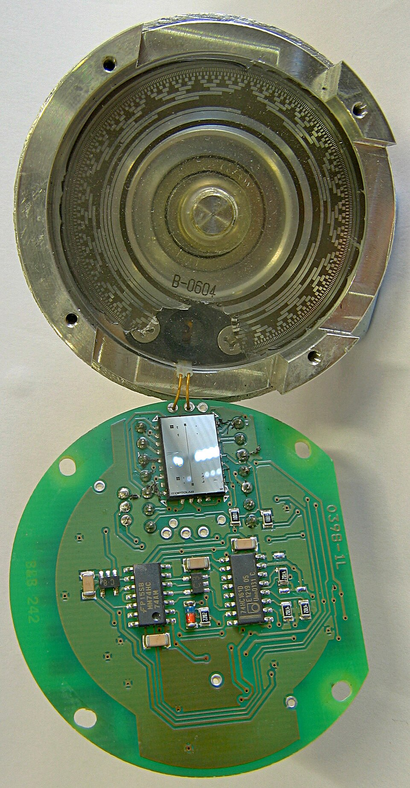

# Day 3: Pushbutton State Toggle (Debouncing Logic)

Welcome to Day 3 of the 100-Day Arduino Masterclass! Today, we move from purely outputting data to accepting user input. We will learn how to interface a tactile pushbutton with an Arduino to toggle an LED state. 

Interfacing a button seems simple, but in physical computing, mechanical buttons introduce electrical noise called **switch bounce**. Today, you will learn the physics behind this bounce and how to write professional, non-blocking software to filter it out using a technique called **debouncing**.

---


## 📸 Component Visuals

<p align="center">
  
  
  
  
  
  
  
</p>

## 🎯 Today's Learning Goals
1. Understand how mechanical switches work and why they "bounce" electrically.
2. Master the difference between pull-up and pull-down resistor configurations.
3. Use the Arduino's internal `INPUT_PULLUP` resistor to simplify wiring.
4. Implement a robust, non-blocking software debounce filter using `millis()`.
5. Learn how to verify, test, and debug digital inputs.

---

## 🧠 The "Why" and "What": Pushbuttons in Robotics

### What is a Pushbutton?
A pushbutton (specifically a tactile switch) is a simple, mechanical switch that opens or closes an electrical circuit when pressed. Tactile buttons are temporary switches—they are normally open (NO), meaning they only complete the circuit while your finger is physically pressing the button down, and return to their open state when released.

### Why is it Used in Robotics?
In robotics and mechatronics, tactile pushbuttons and similar mechanical contacts are essential for several critical functions:
- **User Interface (UI):** Selecting menu options, starting/stopping operations, or changing system modes.
- **Limit Switches / Endstops:** In 3D printers, CNC machines, and robotic arms, a miniature lever switch (which functions exactly like a pushbutton) acts as a physical boundary detector. When the carriage hits the switch, the circuit closes, telling the microcontroller to stop the motor before it crashes and causes mechanical damage.
- **Bump Sensors:** Autonomous mobile robots use bumper switches to detect when they run into obstacles, triggering obstacle-avoidance maneuvers.
- **Homing and Calibration:** Defining the "home" or "zero" coordinate of an actuator by driving it until it hits a limit switch.

---

## ⚡ The Physics & Hardware Theory

To understand how to read a button, we must look at the electronics and the mechanical reality of physical switches.

### 1. Mechanical Contact Bounce (Switch Bounce)
When you press a tactile button, you are pushing two metal contacts together. On a microscopic scale, these metal contacts do not make clean, instantaneous contact. Instead, because of the elasticity of the metal and the spring mechanism, the contacts collide and rebound (bounce) several times before settling into a solid connection.

This bouncing lasts anywhere from **1 to 10 milliseconds**. 

```
Button Pressed
   |
   v
   +---+   +---+       +---+
   |   |   |   |       |   |
---+   +---+   +-------+   +===================== (Pressed / LOW)
   <-------- Bouncing Period -------->
   <------- (approx. 5 - 10ms) ------->
```

Because an Arduino operates at 16 MHz (executing 16 million instructions per second), it can read the pin state thousands of times during those few milliseconds. To the Arduino, a single press looks like the button is being pressed and released 10 to 50 times! If you try to write a simple program to toggle an LED every time a press is detected, the LED will flicker randomly and often end up in the wrong state.

### 2. Floating Pins and Pull-Up/Pull-Down Resistors
Microcontrollers measure digital inputs by reading voltage. A high voltage (close to 5V) is read as `HIGH` (binary 1), and a low voltage (close to 0V) is read as `LOW` (binary 0).

If you connect one pin of a button to Pin 2 and the other pin to 5V, what happens when the button is **not** pressed? The pin is connected to absolutely nothing. It is "floating" in mid-air. 

In this state, the pin acts as a tiny antenna, picking up electromagnetic noise from the environment, static electricity, and nearby components. The voltage on a floating pin will fluctuate randomly between 0V and 5V. If you read a floating pin, the Arduino will report random `HIGH` and `LOW` values.

To solve this, we must use a resistor to "pull" the pin's voltage to a known state when the button is open:
- **Pull-Down Resistor:** Connects the input pin to GND through a resistor (typically 10kΩ). This keeps the pin at 0V (`LOW`) when open. When the button is pressed, it connects the pin directly to 5V, overriding the resistor and reading `HIGH`.
- **Pull-Up Resistor:** Connects the input pin to 5V through a resistor. This keeps the pin at 5V (`HIGH`) when open. When the button is pressed, it connects the pin to GND, overriding the resistor and reading `LOW` (Active-Low configuration).

```
        External Pull-Up Configuration               Internal Pull-Up (INPUT_PULLUP)
        
                  +5V                                            +5V
                   |                                              |
                 [10k] (Resistor)                               [20k] (Internal Resistor)
                   |                                              |
  Pin 2 <----------+                               Pin 2 <--------+
                   |                                              |
                [Button]                                       [Button]
                   |                                              |
                  GND                                            GND
```

### 3. Arduino's Internal Pull-Up Resistors
To minimize part count, circuit complexity, and breadboard clutter, the Arduino ATmega328P microcontroller has built-in internal pull-up resistors (typically 20kΩ to 50kΩ) connected to every digital I/O pin. 

By using `pinMode(pin, INPUT_PULLUP)`, we enable this internal resistor. This means:
- We do **not** need to use an external resistor on our breadboard.
- The default, idle state of the pin is `HIGH` (5V).
- When the button is pressed, it connects the pin to GND, pulling the signal down to `LOW` (0V).
- Therefore, our code logic must look for a `LOW` signal to detect a button press.

---

## 🔄 Alternatives: How Else Can We Do This?

| Alternative Sensor / Circuit | How It Works | Advantages | Disadvantages | Why We Chose Pushbutton |
| :--- | :--- | :--- | :--- | :--- |
| **Capacitive Touch Sensor** | Measures change in capacitance when a human finger (conductive) alters the electric field. | No moving parts, zero mechanical wear, completely waterproof. | Can be triggered by moisture or proximity without direct physical contact. | We chose tactile buttons because they provide physical, tactile feedback, which is crucial for mechanical interfaces and limit switches. |
| **Rotary Encoder Button** | A rotary encoder that also has a push-down shaft switch. | Combines value adjustment (rotation) and selection (button) in one pin-saving package. | Expensive, complex to program, requires more pins. | Pushbutton is simpler, cheaper, and standard for isolated input actions. |
| **Hardware Debouncer (RC Filter + Schmitt Trigger)** | An analog resistor-capacitor (RC) circuit that smooths out the voltage spikes, followed by an IC like a Schmitt trigger to create a clean square wave. | Filters noise in hardware; completely eliminates the need for software debouncing code. | Requires extra components (resistor, capacitor, logic IC), increasing cost and size. | Software debouncing is free, flexible, and lets us modify debounce delays without changing physical components. |

---

## 🛠️ Components Needed

To build this circuit, you will need:
1. **Arduino Uno or Mega** (or any compatible board).
2. **Tactile Pushbutton** (standard 4-pin breadboard button).
3. **Half-size Breadboard**.
4. **Jumper Wires** (2 male-to-male wires).
5. **USB Cable** (to connect Arduino to PC).
6. *Optional:* An external LED and a 220Ω resistor (though we use the built-in LED on Pin 13 in the code).

---

## 🔌 Pin-to-Pin Wiring Instructions

Since we are utilizing the internal pull-up resistor of the ATmega328P chip, our wiring is incredibly simple. We only need to connect the button between the input pin and Ground (GND).

| Button Terminal | Arduino Pin | Wire Color (Recommended) | Description |
| :--- | :--- | :--- | :--- |
| **Pin A** (Left side of switch) | **Pin 2** | Green / Yellow | Digital Input Pin (configured as `INPUT_PULLUP`) |
| **Pin B** (Right side of switch) | **GND** | Black | System ground reference |

### Wiring steps:
1. Place the tactile pushbutton across the center divider channel of the breadboard.
2. Connect a jumper wire from **Pin 2** of the Arduino to one of the active legs on the button.
3. Connect another jumper wire from the opposite diagonally-paired leg of the button to one of the **GND** pins on the Arduino.
4. Keep the USB cable connected to power the board.

> [!NOTE]
> Tactile pushbuttons typically have 4 legs. Inside, the legs are connected in pairs. Leg 1 is connected to Leg 2 (on the same side), and Leg 3 is connected to Leg 4. Pressing the button connects Leg 1/2 to Leg 3/4. Connecting your wires diagonally ensures you are connecting across the switch contact, preventing a short-circuit configuration.

---

## 🧪 How to Test and Validate

Once you have wired the circuit and uploaded the code from `Day_03_Pushbutton_Toggle.ino`, follow these steps to test your system:

### 1. Verification of Basic Operation
- Look at the onboard LED on the Arduino board (marked with an 'L' next to Pin 13).
- **Press the button once and release it.**
  - The LED should instantly turn **ON** and stay on.
- **Press the button a second time and release it.**
  - The LED should instantly turn **OFF** and stay off.
- If the LED turns on and off randomly or doesn't react, check your wiring diagonal connection.

### 2. Using the Serial Monitor for Validation
- Open the Arduino IDE.
- Go to **Tools > Serial Monitor** (or press `Ctrl+Shift+M`).
- Set the baud rate in the bottom right corner to **9600**.
- You should see the boot message: `System Initialized. Press the button to toggle the LED.`
- Press the button. The monitor should log:
  ```text
  [DEBOUNCED] Button Pressed! LED is now: ON
  ```
- Release and press again. It should log:
  ```text
  [DEBOUNCED] Button Pressed! LED is now: OFF
  ```
- **Crucial check:** There should be exactly **one** log message per physical button press. If you press the button once and see multiple lines printed rapidly, your debounce delay in code (`debounceDelay = 50`) is too low or your hardware connection is loose.

### 🔍 Troubleshooting Tips
* **LED is always ON or flickers rapidly:**
  - Double check your `pinMode` setting. It must be set to `INPUT_PULLUP`. If set to `INPUT`, the pin is floating and will read noise.
* **Nothing happens when the button is pressed:**
  - Verify that the button is wired to **Pin 2** (not Pin 3 or analog pins).
  - Ensure the Ground wire is connected to a pin labeled **GND** on the Arduino.
  - Rotate the button 90 degrees on the breadboard. Tactile buttons can be oriented incorrectly, causing the connection to be permanently closed or permanently open.
* **The button feels sluggish or requires a long press:**
  - In your code, check if you added any `delay()` calls in the loop. The loop must remain non-blocking. If other parts of your code block execution, the debouncing logic will not sample the pin fast enough.

## 🧠 Code Explanation

Let's break down how we clean up the messy, bouncing signals from the pushbutton:

### 1. INPUT_PULLUP
```cpp
pinMode(BUTTON_PIN, INPUT_PULLUP);
```
- Normally, an unpressed button leaves the pin "floating" (picking up random static electricity). `INPUT_PULLUP` turns on a tiny resistor inside the Arduino that connects the pin to 5V. 
- Because of this, an UNPRESSED button reads as `HIGH`.
- When you press the button, it connects directly to Ground, overriding the weak resistor, causing it to read `LOW`.

### 2. Detecting a Change
```cpp
int reading = digitalRead(BUTTON_PIN);

if (reading != lastButtonState) {
    lastDebounceTime = millis();
}
```
- If the button physically bounces, the reading fluctuates wildly between HIGH and LOW.
- Every single time it fluctuates, it is "different" than the last state, so we reset our `lastDebounceTime` stopwatch back to 0.

### 3. Confirming a Stable State
```cpp
if ((millis() - lastDebounceTime) > debounceDelay) {
    if (reading != buttonState) {
        buttonState = reading;
        if (buttonState == LOW) {
            ledState = !ledState;
            digitalWrite(LED_PIN, ledState);
        }
    }
}
```
- The code only reaches inside this `if` statement when the button has stopped bouncing for 50 uninterrupted milliseconds.
- Once stable, we check if it transitioned to `LOW` (pressed!). If so, we toggle the `ledState` and write it to the LED pin.
