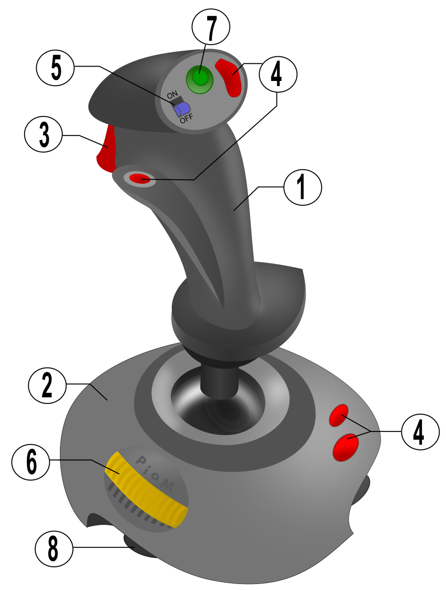

# Day 4: Potentiometer to LED Fade (Analog In / Out)

Welcome to Day 4 of the 100-Day Arduino Masterclass! Today, we bridge the gap between the continuous, analog real-world and the discrete, digital microcontroller. 

You will learn how to interface a rotary potentiometer to read variable analog voltages and map that input to control the brightness of an LED using Pulse Width Modulation (PWM).

---


## 📸 Component Visuals

<p align="center">
  
  
  
  
  
  
  
  
  
</p>

## 🎯 Today's Learning Goals
1. Understand how potentiometers act as mechanical voltage dividers.
2. Learn how the Arduino's 10-bit Analog-to-Digital Converter (ADC) works.
3. Master Pulse Width Modulation (PWM) duty cycles for power regulation.
4. Use the `map()` function to calibrate and scale inputs.
5. Implement non-blocking telemetry logging to trace input-output relationships.

---

## 🧠 The "Why" and "What": Potentiometers in Robotics

### What is a Potentiometer?
A potentiometer (often called a "pot") is a three-terminal rotary or linear variable resistor. By turning its shaft, you manually slide an internal contact (wiper) along a resistive track, changing the electrical resistance between the middle wiper pin and the two outer pins.

### Why is it Used in Robotics?
In robotics and control engineering, potentiometers are widely used for human-machine interfaces (HMIs) and positional feedback:
- **Joint Angle Sensors:** Basic robotic arm joints use potentiometers geared directly to the shafts to measure rotation angles. The feedback voltage tells the controller the exact physical angle of the joint.
- **Control Joysticks:** Dual-axis joysticks (like those on gamepad controllers) contain two micro-potentiometers mounted orthogonally to measure the X and Y movement of the stick.
- **Setpoints & Tuning:** Setting control parameters (such as the threshold speed of a motor, the target temperature of a chamber, or the sensitivity of a sensor) on the fly without rewriting the code.

---

## ⚡ The Physics & Hardware Theory

### 1. The Voltage Divider Circuit
The potentiometer works on the principle of the **voltage divider**. If you connect the outer terminals of a potentiometer to 5V and GND, a steady current flows through the resistive strip.

```
       VCC (+5V)
         |
       [ R1 ] (Resistance from terminal 1 to wiper)
         |
         +---- Wiper Output (Vout to Pin A0)
         |
       [ R2 ] (Resistance from wiper to terminal 3)
         |
        GND (0V)
```

The voltage at the middle wiper pin ($V_{out}$) is determined by the ratio of the resistances on either side of the wiper contact ($R_1$ and $R_2$):

$$V_{out} = V_{in} \times \left( \frac{R_2}{R_1 + R_2} \right)$$

When the wiper is turned all the way to the GND side, $R_2$ becomes 0Ω, and $V_{out}$ drops to **0V**. When turned all the way to the 5V side, $R_1$ becomes 0Ω, and $V_{out}$ rises to **5V**. In between, the voltage scales linearly with the shaft rotation.

### 2. Analog-to-Digital Conversion (ADC)
The ATmega328P microcontroller cannot understand a continuous voltage directly. It must convert it into a digital number. It does this using a 10-bit **Successive Approximation ADC**.

* **Resolution:** 10 bits ($2^{10} = 1024$ steps).
* **Reference Voltage ($V_{ref}$):** Default is 5.0V.
* **Calculation:** The ADC converts the voltage on A0 to an integer using this formula:

$$ADC\text{ Value} = \text{round}\left( \frac{V_{in}}{V_{ref}} \times 1023 \right)$$

| Physical Input Voltage | digital ADC Reading |
| :---: | :---: |
| 0.0V | 0 |
| 1.25V | 256 |
| 2.5V | 512 |
| 3.75V | 768 |
| 5.0V | 1023 |

### 3. Pulse Width Modulation (PWM)
An Arduino digital pin can only output 0V or 5V. To generate "analog" brightness, we use **PWM**. By pulsing the pin ON and OFF thousands of times a second, we create an average voltage. 

The percentage of time the signal is HIGH during one full cycle is called the **Duty Cycle**:

* **0% Duty Cycle:** 0V average (always OFF). Mapped to PWM value **0**.
* **50% Duty Cycle:** 2.5V average (ON half the time). Mapped to PWM value **127**.
* **100% Duty Cycle:** 5.0V average (always ON). Mapped to PWM value **255**.

```
PWM Duty Cycles (analogWrite):

 0% (Value 0):    ________________________________________

25% (Value 64):   |---|_|---|_|---|_|---|_|---|_|---|_|---|_|

50% (Value 127):  |-----|_____|-----|_____|-----|_____|-----|

100% (Value 255): |========================================
```

On Arduino Uno, pins 3, 5, 6, 9, 10, and 11 support PWM.

---

## 🔄 Alternatives: Analog Inputs vs. Rotary Encoders

| Device | Type | Resolution | Range of Motion | Noise Sensitivity | Best Use Case |
| :--- | :--- | :--- | :--- | :--- | :--- |
| **Potentiometer** | Analog | Infinite physical resolution (limited by 10-bit ADC to 1024 steps) | Limited (usually 270° or 300°) | High (electrical noise can cause jitter in values) | **Chosen** for joystick control, absolute joint tracking, and analog tuning. |
| **Rotary Encoder** | Digital | Discrete pulses per rotation (usually 20-30 PPR) | Infinite (turns forever in both directions) | Zero (digital pulses are noise-immune) | Menu navigation, scrolling parameters, motor speed measurement. |
| **Digital Potentiometer (MCP4131)** | Integrated Circuit | Set steps (e.g. 128 or 256 steps) via SPI or I2C | None (Solid state, controlled digitally) | Zero (digital communication) | Controlling analog amplifier gains or filtering coefficients programmatically. |

---

## 🛠️ Components Needed

To build this circuit, you will need:
1. **Arduino Uno or Mega**.
2. **10kΩ Rotary Potentiometer** (linear taper).
3. **LED** (any standard color).
4. **220Ω Resistor** (for the LED).
5. **Breadboard**.
6. **Jumper Wires** (5 male-to-male wires).
7. **USB Cable**.

---

## 🔌 Pin-to-Pin Wiring Instructions

Ensure your potentiometer's three pins are placed in separate, vertical rows of the breadboard.

| Component | Pin Number/Label | Arduino Pin | Wire Color (Recommended) | Description |
| :--- | :--- | :--- | :--- | :--- |
| **Potentiometer** | Pin 1 (Left Terminal) | **5V** | Red | Power rail connection |
| **Potentiometer** | Pin 2 (Middle Wiper) | **A0** | Yellow | Analog signal output |
| **Potentiometer** | Pin 3 (Right Terminal) | **GND** | Black | Ground connection |
| **LED** | Anode (+) / Long Leg | **Pin 9** | Blue | PWM channel (through resistor) |
| **Resistor** | Inline with LED cathode | **GND** | Black | Return path to ground |

---

## 🧪 How to Test and Validate

Follow these steps to upload, run, and verify the analog-to-PWM translation:

### 1. Visual Verification of Fading
- Connect the Arduino to your computer and upload the code.
- **Test the Range:** Slowly turn the potentiometer shaft all the way counterclockwise.
  - The LED should completely turn **OFF**.
- Slowly rotate the shaft clockwise.
  - The LED should gradually get brighter, reaching maximum brightness at the clockwise limit.
- **Check for Jitter:** Hold the shaft steady. The LED brightness should remain perfectly stable, indicating no massive voltage fluctuations.

### 2. Telemetry Verification using the Serial Monitor
- Open the Serial Monitor (**Tools > Serial Monitor**) at **9600 Baud**.
- Rotate the potentiometer. The logs will update every 100ms:
  ```text
  Raw ADC: 512 | Voltage: 2.50 V | PWM Duty: 127 (49.8%)
  ```
- **Verify Calibration Boundaries:**
  - Turn completely counterclockwise: It must read `Raw ADC: 0 | Voltage: 0.00 V | PWM Duty: 0 (0.0%)`.
  - Turn completely clockwise: It must read `Raw ADC: 1023 | Voltage: 5.00 V | PWM Duty: 255 (100.0%)`.

### 🔍 Troubleshooting Tips
* **The LED turns OFF suddenly or turns on in step-like jumps:**
  - Check if the LED is wired to Pin 9. Fading only works on **PWM pins** (marked with a tilde `~` like `~9`). If wired to a standard digital pin (e.g. Pin 8), `analogWrite()` behaves like `digitalWrite()`, turning the LED off below 128 and on above 128.
* **The values jump erratically even when the button/shaft isn't touched:**
  - Ensure the potentiometer is pushed firmly into the breadboard. Loose wiper pins cause electrical noise.
  - Make sure you are using a 10kΩ potentiometer. Higher resistance (like 1MΩ) can cause unstable readings on AVR microcontrollers due to impedance matching issues.
* **The direction is backward (brightest is CCW, darkest is CW):**
  - Swap the two outer wires on the potentiometer (swap Pin 1 and Pin 3 connections). This reverses the voltage divider sweep.

## 🧠 Code Explanation

Let's look at how we translate analog voltages into LED brightness:

### 1. Reading the Potentiometer
```cpp
int adcValue = analogRead(POT_PIN);
```
- `analogRead()` asks the Arduino's built-in Analog-to-Digital Converter (ADC) to read the voltage on Pin A0.
- It converts 0V to 5V into a number between `0` and `1023`.

### 2. The Map Function
```cpp
int pwmValue = map(adcValue, 0, 1023, 0, 255);
```
- We cannot send `1023` to the LED because the LED pin only accepts 8-bit values (from `0` to `255`).
- `map()` is a brilliant math function that scales ranges. It takes our `adcValue` and mathematically shrinks the `0-1023` range down to a perfect `0-255` range for the LED!

### 3. PWM Output
```cpp
analogWrite(LED_PIN, pwmValue);
```
- Despite the name, `analogWrite()` does not output a true analog voltage. It outputs **PWM** (Pulse Width Modulation).
- It turns the LED fully ON and fully OFF almost 500 times a second. 
- A value of `127` means the LED is ON 50% of the time, making it appear half as bright to our eyes!

### 4. Telemetry Logging
```cpp
float voltage = adcValue * (5.0 / 1023.0);
```
- We do a bit of math to convert the raw `1023` back into real-world Volts so we can print it nicely to the Serial Monitor!
