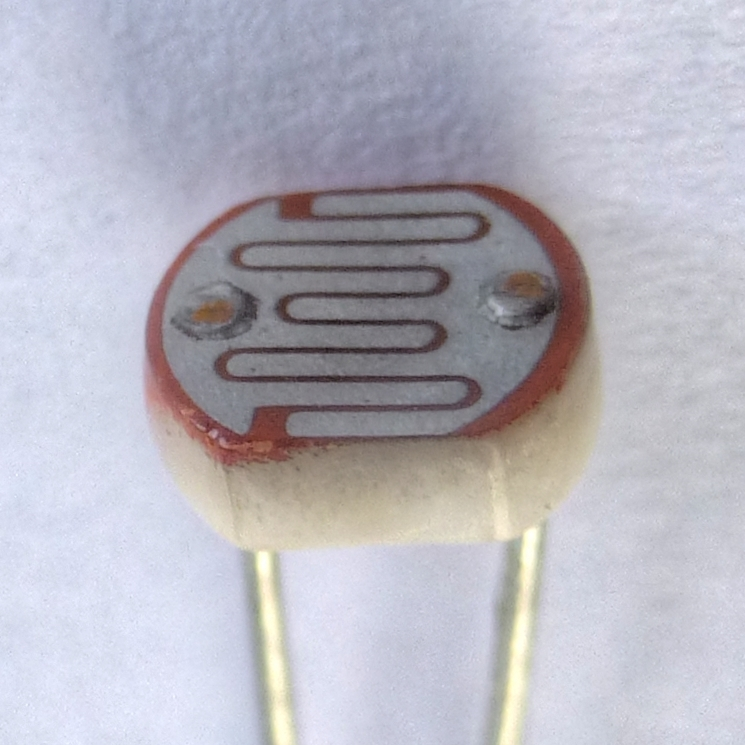
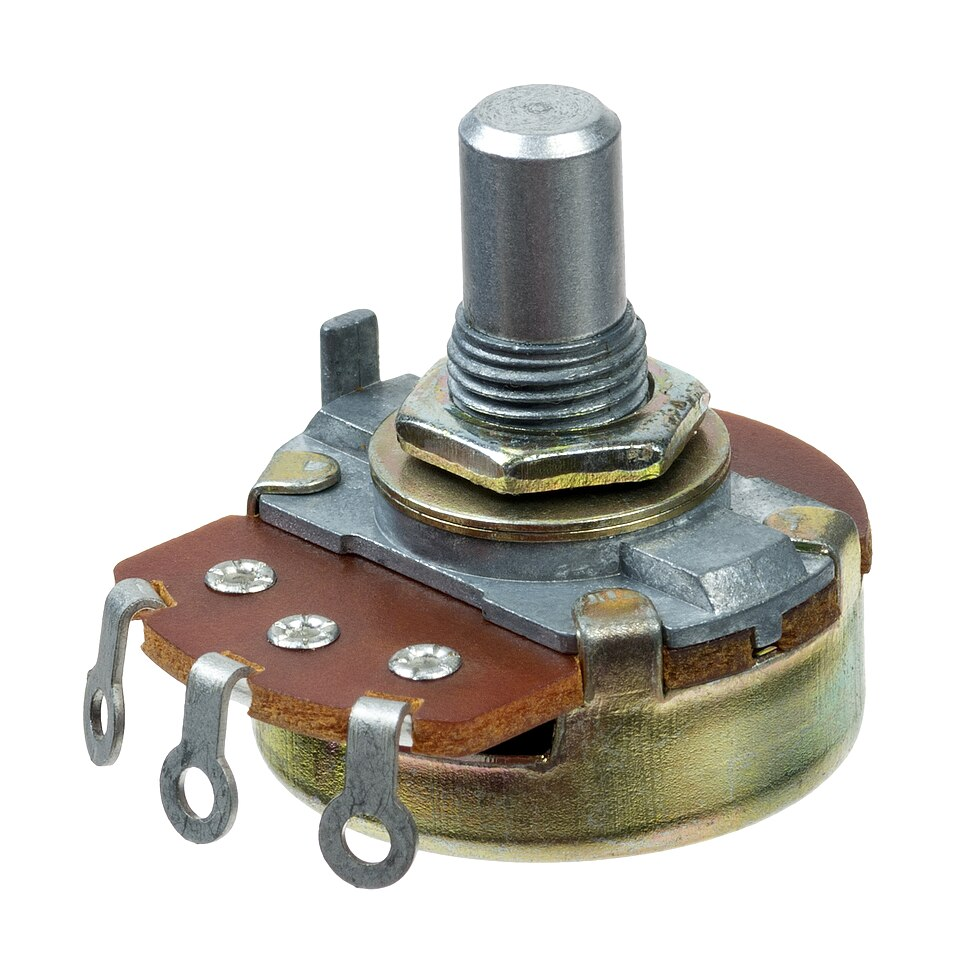
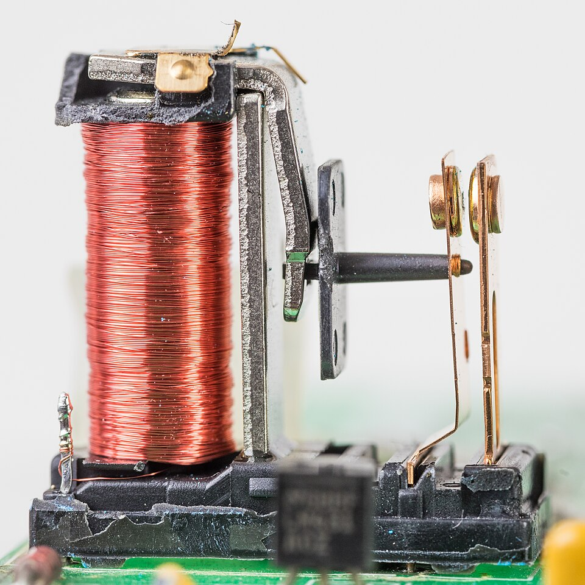

# Day 6: Photoresistor (LDR) Automatic Night Light

Welcome to Day 6 of the 100-Day Arduino Masterclass! Today, we explore optical sensing. We will learn how to interface a Light Dependent Resistor (LDR) to detect ambient light levels and automatically trigger a night light.

To prepare you for professional engineering, we will also implement **hysteresis** in our logic—a critical software design pattern used to eliminate digital chatter and noise in control systems.

---


## 📸 Component Visuals

<p align="center">
  
  
  
  
  
  
  
  
</p>

## 🎯 Today's Learning Goals
1. Understand the physics of photoresistive materials and electron mobility.
2. Design and wire an LDR voltage divider circuit.
3. Master the concept of hysteresis and understand why single-threshold comparisons fail.
4. Implement a dual-threshold control loop.
5. Log ambient light telemetry for system calibration.

---

## 🧠 The "Why" and "What": LDRs in Robotics

### What is an LDR?
A Light Dependent Resistor (LDR), or photoresistor, is a passive electronic component whose electrical resistance varies depending on the intensity of light falling on its surface. LDRs are made from high-resistance semiconductor materials, most commonly cadmium sulfide (CdS).

### Why is it Used in Robotics?
In robotics and smart environments, light sensing is key for reacting to ambient surroundings:
- **Solar Tracking Panels:** Robots designed to maximize solar power absorption use multiple LDRs separated by cardboard dividers to detect which direction has the brightest light source, rotating the panels to face it.
- **Ambient Light Sensing (LDR Night Lights):** Smart lighting systems that turn on streetlights, house lamps, or robot headlights automatically when night falls.
- **Obstacle/Edge Detection:** Simple mobile robots can use an LDR pointing downward next to an LED to detect changes in surface reflectivity (like the edge of a table or a dark line).
- **Light-seeking Robots (Phototaxis):** Small vehicles that navigate toward light sources or escape into the shadows (photophobia).

---

## ⚡ The Physics & Hardware Theory

### 1. Photoresistive Physics (How the LDR Works)
An LDR is made of a high-resistance semiconductor. When the LDR is in darkness, very few free charge carriers (electrons and holes) exist in the material. The valence electrons are bound within the crystal lattice, resulting in an extremely high resistance (often $> 1\text{ M}\Omega$).

```
        Darkness (High Resistance)                  Light (Low Resistance)
        
         [Valence Band]  (Bound)                    [Valence Band]
             O   O   O   O                             O       O
          -------------------                       -------o------- (Photons free electrons)
             |   |   |   | (Bandgap)                       |       |
          -------------------                       -------o-------
             o   o   o   o                             o   o   o   o
        [Conduction Band] (Empty)                   [Conduction Band] (Conducting!)
```

When light (photons) strikes the semiconductor material, the photons transfer their energy to the bound valence electrons. If the energy of the incident photons is greater than the **bandgap energy** of the material, the electrons absorb the energy and break free from their bonds, jumping into the **conduction band**. 

These newly freed electrons are now capable of carrying an electric current. As light intensity increases, more electrons jump to the conduction band, and the electrical resistance of the LDR drops dramatically (down to a few hundred ohms in bright sunlight).

### 2. The LDR Voltage Divider
Just like the potentiometer on Day 4, the Arduino cannot read resistance directly; it can only measure voltage. To convert the variable resistance of the LDR into a variable voltage, we place it in a voltage divider circuit with a fixed $10\text{k}\Omega$ resistor.

```
                  +5V
                   |
                [ LDR ]  (Variable Resistance, R_LDR)
                   |
  Pin A0 <---------+---- (Junction Pin)
                   |
                [ 10k ]  (Fixed Resistance, R_fixed)
                   |
                  GND
```

The output voltage at the junction ($V_{out}$, connected to Pin A0) is calculated as:

$$V_{out} = V_{in} \times \left( \frac{R_{fixed}}{R_{LDR} + R_{fixed}} \right)$$

* **In Bright Light:** $R_{LDR}$ is very low (e.g., $500\Omega$).
  $$V_{out} = 5\text{V} \times \left( \frac{10\text{k}\Omega}{500\Omega + 10\text{k}\Omega} \right) \approx 4.76\text{V} \implies \text{High ADC value (approx. 975)}$$
* **In Complete Darkness:** $R_{LDR}$ is very high (e.g., $500\text{k}\Omega$).
  $$V_{out} = 5\text{V} \times \left( \frac{10\text{k}\Omega}{500\text{k}\Omega + 10\text{k}\Omega} \right) \approx 0.098\text{V} \implies \text{Low ADC value (approx. 20)}$$

### 3. What is Hysteresis and Why is it Essential?
If we write a simple comparison loop:
`if (light < 400) digitalWrite(LED, HIGH); else digitalWrite(LED, LOW);`
We run into a major problem when the ambient light sits exactly at **400**. Because of tiny thermal fluctuations in the ADC, electrical noise, or the light from the LED itself bleeding back into the LDR, the reading will bounce between 399 and 401.

This causes the LED to flicker on and off hundreds of times a second. In high-power systems, this causes rapid "chattering" of relays and switches, which quickly burns out contacts and damages motors.

**Hysteresis** solves this by establishing two distinct thresholds:
1. **Dark Threshold (e.g., 350):** The level below which we turn the LED **ON**.
2. **Light Threshold (e.g., 450):** The level above which we turn the LED **OFF**.

```
Light Level
 (ADC Value)
     |
 500 |============================================ LED is OFF
     |            \
 450 |-------------\----------------------------- OFF Threshold
     |              \   [Hysteresis Zone]
 350 |---------------\---------------------------- ON Threshold
     |                \__________________________
 300 |                                            LED turns ON
     +--------------------------------------------
```

Once the LED turns ON, the light level must cross all the way back up over **450** to turn it off. This creates a "dead band" that filters out noise and stabilizes the system.

---

## 🔄 Alternatives: LDRs vs. Active Sensors

| Sensor Type | How It Works | Spectral Response | Response Time | Noise Immunity | Best Use Case |
| :--- | :--- | :--- | :--- | :--- | :--- |
| **LDR (Photoresistor)** | CdS semiconductor resistance change. | Broad (similar to human eye, peak green/yellow). | Slow ($\approx 10\text{ to }50\text{ ms}$). | High (slow response naturally filters high-frequency light noise). | **Chosen** for night lights, solar tracking, and general light-dark sensing. |
| **Photodiode** | A P-N junction that generates a small current when photons hit it (photovoltaic). | Narrow (often infrared optimized). | Extremely Fast (nanoseconds). | Low (requires amplification). | Optical communication, remote controls, laser tripwires. |
| **Digital Ambient Light Sensor (BH1750)** | Integrated silicon photodiode and ADC. Communicates via I2C. | Human eye response. Outputs directly in Lux. | Fast. | High (digital transmission). | Smartphone screen brightness control, professional lux meters. |

---

## 🛠️ Components Needed

To build this project, you will need:
1. **Arduino Uno or Mega**.
2. **Photoresistor (LDR)** (standard GL55 series).
3. **10kΩ Resistor** (for the voltage divider).
4. **LED** (any color).
5. **220Ω Resistor** (for the LED).
6. **Breadboard & Jumper Wires**.
7. **USB Cable**.

---

## 🔌 Pin-to-Pin Wiring Instructions

| Component | Pin / Terminal | Arduino Pin | Wire Color | Description |
| :--- | :--- | :--- | :--- | :--- |
| **LDR** | Terminal A | **5V** | Red | Divider supply voltage |
| **LDR** | Terminal B | **A0** (Junction) | Yellow | Divider voltage output |
| **10kΩ Resistor** | Terminal A | **A0** (Junction) | Yellow | Ground reference path |
| **10kΩ Resistor** | Terminal B | **GND** | Black | Ground reference path |
| **LED** | Anode (+) | **220Ω Resistor** ➡️ **Pin 9** | Blue | PWM/Digital control line |
| **LED** | Cathode (-) | **GND** | Black | LED ground return |

---

## 🧪 How to Test and Validate

Follow these steps to run and calibrate your night light:

### 1. Calibration and Baseline Reading
- Connect the Arduino and upload the sketch.
- Open the Serial Monitor at **9600 Baud**.
- Observe the ambient light reading under your room's normal lighting:
  ```text
  Ambient Light ADC: 680 | State: INACTIVE (OFF) ...
  ```
- Write down this baseline number.

### 2. Testing the Night Light Trigger
- **Simulate Night:** Cover the LDR completely with your finger or a dark object.
- The ADC reading should drop rapidly.
- Once the reading falls below **350**, the LED should snap **ON**.
- The Serial Monitor will log:
  ```text
  >> Night Light Activated [ON] <<
  Ambient Light ADC: 120 | State: ACTIVE (ON) ...
  ```

### 3. Testing Hysteresis Stability
- **Simulate Dawn:** Slowly uncover the LDR.
- As the ADC reading rises, note that when it passes 350, 380, and 420, the LED **stays ON**.
- Once the reading crosses **450**, the LED should instantly snap **OFF**.
- The Serial Monitor will log:
  ```text
  >> Night Light Deactivated [OFF] <<
  Ambient Light ADC: 480 | State: INACTIVE (OFF) ...
  ```
- This confirms that the LED does not flicker in the 350-450 zone!

### 🔍 Troubleshooting Tips
* **The LED is always ON:**
  - Make sure you haven't swapped the LDR and the 10kΩ resistor positions in the divider. If swapped, darkness yields a high voltage, meaning the logic is inverted.
  - The room might already be darker than your trigger threshold. Check the ADC value in the Serial Monitor and adjust `DARK_THRESHOLD` in the code accordingly.
* **The LED flickers rapidly when starting to turn on:**
  - Increase the gap between `DARK_THRESHOLD` and `LIGHT_THRESHOLD` (increase the hysteresis dead band). For example, set `DARK_THRESHOLD = 300` and `LIGHT_THRESHOLD = 500`.
  - Ensure the LED light is not shining directly into the LDR. If the LED shines on the LDR, as soon as the LED turns on, it "thinks" it's daytime and turns off, creating a feedback flicker loop. Shield the LDR physically from the LED.

## 🧠 Code Explanation

Let's look at how we implemented professional Hysteresis:

### 1. The Thresholds
```cpp
const int DARK_THRESHOLD = 350;
const int LIGHT_THRESHOLD = 450;
```
- If we only used one threshold (e.g., `400`), what happens when the room light fluctuates between `399` and `401` really fast? The LED would strobe rapidly! 
- By using two thresholds, we create a "dead band". The light must cross a solid 100-point margin to trigger a state change, making it extremely stable.

### 2. The Hysteresis Logic
```cpp
if (!nightLightActive && lightLevel < DARK_THRESHOLD) {
    nightLightActive = true;
    digitalWrite(LED_PIN, HIGH);
} 
else if (nightLightActive && lightLevel > LIGHT_THRESHOLD) {
    nightLightActive = false;
    digitalWrite(LED_PIN, LOW);
}
```
- `!nightLightActive`: If the light is currently OFF...
- `&& lightLevel < DARK_THRESHOLD`: AND the room drops below `350`...
- Then we turn the LED ON and update our memory (`nightLightActive = true`).
- The reverse happens when the sun comes up and the value rises past `450`!
