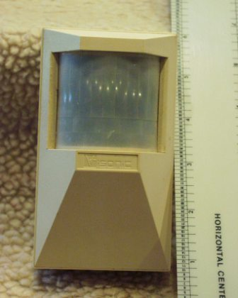

# Day 8: PIR Motion Sensor Alarm System

Welcome to Day 8 of the 100-Day Arduino Masterclass! Today, we explore motion detection. We will interface a Passive Infrared (PIR) sensor with the Arduino to build an intrusion alarm that activates an LED and a piezo buzzer when motion is detected.

You will learn the physics of thermal radiation, how pyroelectric crystals sense motion, how to calibrate these sensors, and how to write edge-triggered code for clean alert logging.

---


## 📸 Component Visuals

<p align="center">
  
  
  
  
  
  
  
  
</p>

## 🎯 Today's Learning Goals
1. Understand how pyroelectric sensors detect infrared radiation (thermal energy).
2. Learn how a Fresnel lens divides physical space into passive detection zones.
3. Configure the hardware settings (Sensitivity, Time Delay, Trigger Mode) on the PIR module.
4. Program a startup calibration loop to warm up the sensor.
5. Implement edge-triggered state logging.

---

## 🧠 The "Why" and "What": PIR Sensors in Robotics

### What is a PIR Sensor?
A Passive Infrared (PIR) sensor is an electronic device that measures infrared (IR) light radiating from objects in its field of view. The term **passive** refers to the fact that the sensor does not emit any energy or beams itself; instead, it purely detects the infrared energy emitted by other objects (specifically warm bodies like humans and animals).

### Why is it Used in Robotics & Smart Environments?
Motion detection is a primary sensor input for power saving, safety, and security:
- **Intrusion Alarm Systems:** Detecting intruders in a room and triggering sirens, alerts, or cameras.
- **Power Management:** Automatically waking up a robot from deep sleep mode or turning on a smart display only when a human approaches.
- **Human-Robot Interaction:** Enabling a stationary robot to turn its head (servo) toward a person when they walk into the room.
- **Safety Interlocks:** Disabling robotic arms or machinery if a human breaks the safety perimeter.

---

## ⚡ The Physics & Hardware Theory

### 1. The Physics of Pyroelectricity
All objects with a temperature above absolute zero (0 Kelvin or -273.15°C) emit thermal energy in the form of electromagnetic radiation. At room temperatures, this radiation falls in the **infrared spectrum** (wavelengths of $8\text{ to }14\text{ µm}$). Humans, with a body temperature of around 37°C, emit peak infrared light at roughly $9.4\text{ µm}$.

Inside the metal casing of the PIR sensor (the window) is a **pyroelectric sensor**. This sensor is made of crystalline materials (such as lithium tantalate) that generate a temporary electrical charge when heated or cooled.

```
       Dual-Slot Pyroelectric Crystal                    Walking Past the Sensor
       
               Slot 1      Slot 2                            Slot 1    Slot 2
             +---------+ +---------+                        +-------+ +-------+
  IR Light ➡️ | Crystal | | Crystal |             Warm Body  | (Hot) | |(Cold) | ➡️ Differential Voltage
             +---------+ +---------+              ---->     +-------+ +-------+
                  \           /
                   V_1 - V_2 (Differential Amplifier)
```

The crystal is split into **two slots** wired in series-opposition (one positive, one negative). 
* **Static Environment:** Both slots receive the same amount of background infrared light, canceling each other out ($V_1 - V_2 = 0\text{V}$).
* **Dynamic Environment (Motion):** When a warm body walks past, it crosses Slot 1 first, raising its temperature and generating a positive charge. A moment later, the body crosses Slot 2, generating a negative charge. The sensor detects this differential voltage spike ($V_1 - V_2 \neq 0\text{V}$) and triggers the output pin.

### 2. The Fresnel Lens
The white dome cover on the PIR sensor is a **Fresnel Lens**. A standard lens would make the sensor too bulky and expensive. A Fresnel lens consists of a series of concentric grooves that act as individual refracting surfaces, flattening the lens profile.

```
           Flat Fresnel Lens                       Multi-Zone Detection
             _   _   _   _
            / \ / \ / \ / \                         \   |   /
           /   v   v   v   \                         \  |  /  Active Beams
          /_________________\                         \ | /
                   |                                   \|/
                 Sensor                              Sensor
```

The dome has dozens of small lenses molded into it. Each lens focuses the room's IR radiation onto the central sensor chip. This divides the room into multiple "active" and "inactive" wedge-shaped zones. As a person walks across these wedges, they repeatedly move between active and inactive zones, creating the rapid thermal fluctuations the pyroelectric chip needs to trigger.

### 3. PIR Hardware Controls (Potentiometers & Jumpers)
On the back of the HC-SR501 PIR module, you will find three hardware adjustment points:

```
        ===================================
        |  [X] Jumper (L/H)               |
        |                                 |
        |  (O) Delay Time Potentiometer   |
        |  (O) Sensitivity Potentiometer  |
        |                                 |
        |    [VCC]  [OUT]  [GND]          |
        ===================================
```

* **Sensitivity Potentiometer:** Adjusts the detection range (typically $3\text{ to }7\text{ meters}$). Turning clockwise increases range.
* **Delay Time Potentiometer:** Adjusts how long the output pin stays `HIGH` after motion is detected (typically $3\text{ seconds to }5\text{ minutes}$). Turning clockwise increases duration.
* **Trigger Mode Jumper:**
  - **Single Trigger ('L'):** When motion is detected, the output goes `HIGH` for the set delay time. Even if the person keeps moving, the output drops back `LOW` when the timer expires, then retriggers.
  - **Repeat Trigger ('H' - Recommended & Default):** The output remains `HIGH` continuously as long as movement is detected within the zone. The delay timer resets with every movement.

---

## 🔄 Alternatives: PIR vs. Radar vs. Active IR

| Sensor Type | Technology | Detection Range | Angle of View | Detection Type | Cost | Best Use Case |
| :--- | :--- | :--- | :--- | :--- | :--- | :--- |
| **PIR Sensor (HC-SR501)** | Passive Pyroelectric (infrared). | $3\text{ to }7\text{ m}$ | $\approx 110^{\circ}$ | Detects movement of warm bodies relative to background. | Low | **Chosen** for smart home lighting, security alarms, and human presence detection. |
| **Microwave Radar (RCWL-0516)** | Doppler Effect (electromagnetic waves). | $5\text{ to }9\text{ m}$ | $360^{\circ}$ (Omni) | Detects movement of any physical mass. Can see through walls/wood. | Low | Hidden sensors inside enclosures, tracking motion through physical barriers. |
| **Active IR Sensor / Beam** | Emits IR light from a transmitter to a receiver. | Line-of-sight | Narrow Beam | Detects interruption of the light beam. | Moderate | Conveyor belt product counters, safety tripwires on garage doors. |

---

## 🛠️ Components Needed

To build this project, you will need:
1. **Arduino Uno or Mega**.
2. **PIR Motion Sensor Module** (HC-SR501 or similar).
3. **Active Piezo Buzzer** (5V).
4. **LED & 220Ω Resistor**.
5. **Breadboard & Jumper Wires**.
6. **USB Cable**.

---

## 🔌 Pin-to-Pin Wiring Instructions

Remove the white dome cover of the PIR module temporarily to check the label under the pins. Typically, looking at the board with the pins at the bottom: **VCC (Left), OUT (Middle), GND (Right)**.

| Sensor Pin | Arduino Pin | Wire Color | Description |
| :--- | :--- | :--- | :--- |
| **VCC** (PIR) | **5V** | Red | Sensor power supply (5V) |
| **OUT** (PIR) | **Pin 2** | Green / Yellow | Digital output (Trigger line) |
| **GND** (PIR) | **GND** | Black | System ground |
| **Buzzer (+)** | **Pin 8** | Orange | Alarm sounder output pin |
| **Buzzer (-)** | **GND** | Black | System ground |
| **LED Anode** | **220Ω Resistor** ➡️ **Pin 13** | Blue | Alarm light output pin |
| **LED Cathode** | **GND** | Black | System ground |

---

## 🧪 How to Test and Validate

Follow these steps to upload, calibrate, and verify the alarm:

### 1. Hardware Calibration Settings
- Locate the pots on the back of the PIR module.
- **Time Delay:** Turn the time delay pot **all the way counterclockwise** to set it to the minimum delay ($\approx 3\text{ seconds}$). This prevents you from waiting minutes between test triggers.
- **Sensitivity:** Turn the sensitivity pot to the **middle position**.
- **Jumper:** Make sure the jumper is set to **H** (Repeat Trigger).

### 2. Startup Warm-up Phase
- Upload `Day_08_PIR_Alarm.ino`.
- Open the Serial Monitor at **9600 Baud**.
- **Crucial step:** Leave the room or stay completely still for 15 seconds. The PIR sensor's crystal is stabilizing. The onboard LED will blink as a countdown timer.
- You should see the boot logs:
  ```text
  PIR Sensor Warming Up & Calibrating (approx 15s)...
  15... 14... 13... 
  SYSTEM ARMED. PIR Sensor active!
  ```

### 3. Motion Testing
- **Trigger Alarm:** Wave your hand in front of the sensor.
  - The LED and active buzzer should instantly turn **ON** and beep.
  - The Serial Monitor should log:
    ```text
    [ALERT] Motion Detected! Alarm Triggered.
    ```
- **Clear Alarm:** Sit completely still or step away from the sensor.
  - After 3-5 seconds (the minimum delay), the LED and buzzer should turn **OFF**.
  - The Serial Monitor should log:
    ```text
    [INFO] Area Secure. Alarm cleared.
    ```

### 🔍 Troubleshooting Tips
* **The alarm triggers constantly or never turns off:**
  - The PIR delay time potentiometer might be turned too far clockwise. Turn it all the way counterclockwise.
  - Check if you are within the sensor's field of view. The sensor is very sensitive to tiny body movements.
  - PIR sensors are sensitive to hot air currents. Do not place the sensor near heaters, air conditioning vents, or direct sunlight.
* **The alarm turns on randomly when no one is in the room:**
  - Make sure the sensor has completed the 15-second warm-up phase.
  - Ensure the PIR output pin is connected to **Pin 2** and the ground is solid. A floating input will cause random triggers.

## 🧠 Code Explanation

Let's see how we handled the PIR sensor's unique quirks:

### 1. Calibration Warm-up
```cpp
for (int i = 0; i < CALIBRATION_TIME; i++) {
    // ... blink the LED and wait
}
```
- A PIR sensor takes 30-60 seconds to "learn" the background infrared heat signature of the room. If you check it too early, it will trigger false alarms. This `for` loop forces the Arduino to wait before arming the system.

### 2. Edge Triggering
```cpp
int currentPirState = digitalRead(PIR_PIN);

if (currentPirState != lastPirState) {
    if (currentPirState == HIGH) {
        // Motion Started!
    } else {
        // Motion Stopped!
    }
    lastPirState = currentPirState;
}
```
- Just like the pushbutton debounce from Day 3, we only want to act when the state **changes**. 
- If someone is dancing in front of the sensor, we don't want the Serial Monitor to print "Motion Detected!" 1,000 times a second. 
- By checking `if (current != last)`, we only print the message exactly once when motion *starts*, and once when it *stops*.
