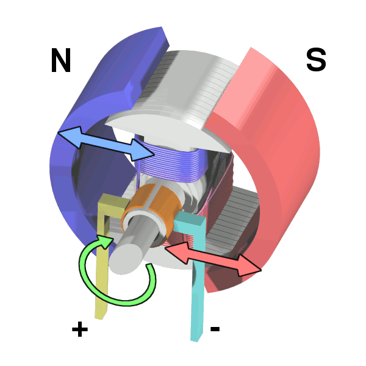
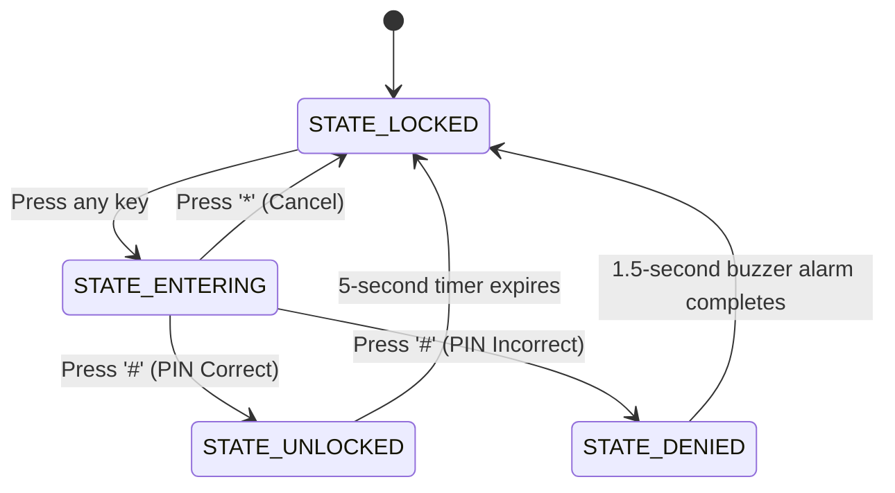

# Day 15: Password-Protected Door Lock (FSM Control)

Welcome to Day 15 of the 100-Day Arduino Masterclass! Today, we combine inputs and outputs to build a complete project: a **Password-Protected Door Lock**. We will interface our 4x4 keypad (Day 14) and a servo motor (Day 11) to act as a lock latch.

Most importantly, you will master **Finite State Machine (FSM)** architecture—the standard design pattern for building reliable, bug-free, and complex event-driven logic in robotics and aerospace systems.

---


## 📸 Component Visuals

<p align="center">
  
  
  
  
  
  
  
  
</p>

## 🎯 Today's Learning Goals
1. Understand Finite State Machine (FSM) architecture and state transitions.
2. Master string buffer manipulation (`strcmp`, `memset`, null terminators `\0`).
3. Coordinate multiple outputs (servo latch, green/red status LEDs, buzzer tones).
4. Implement an automatic timeout window for unlocking.
5. Apply security programming standards (passcode masking and denial alarms).

---

## 🧠 The "Why" and "What": Door Locks in Mechatronics

### What is an FSM Access Control System?
An access control system regulates who can enter a physical zone. In software, this is best governed by a **Finite State Machine (FSM)**. An FSM is a programming model where the system can only exist in one of a limited number of defined "states" at any given time. It transitions from one state to another based on inputs (e.g., button presses, sensor readings, or timers).

### Why is it Used in Robotics?
FSM architecture is the foundation of robotic autonomy:
- **Rover Autonomous Behaviors:** States include: `STATE_FORWARD`, `STATE_OBSTACLE_AVOID`, `STATE_RECOVERY_REVERSE`. A bumper hit transitions the state from forward to avoid.
- **Factory Automation:** A pick-and-place gantry operates on states: `STATE_HOME`, `STATE_PICK`, `STATE_MOVE`, `STATE_PLACE`.
- **Security Access Terminals:** Standard hotel keycard locks, vaults, and numeric safes.

---

## ⚡ The Physics & Hardware Theory

### 1. Finite State Machine (FSM) Architecture
If you try to write a complex project like a passcode lock using standard, linear `if/else` statements, you will create bugs. For example, the user might press a button while the door is unlocked, or the door might get stuck open. 

An FSM defines clean boundaries. We define four states for our lock:



* **Transition Conditions:** A state change occurs only when a specific event is triggered (e.g., timer expires or correct key entered). Inside each state, only relevant actions are processed.

### 2. C-String Buffer Manipulation
Because the passcode is entered digit-by-digit, we must store the inputs in a **character buffer** (an array of characters) and compare it to our secret passcode:

```
           C-Style String Buffer in Memory (PIN "1234")
           
             index 0     index 1     index 2     index 3     index 4
           +---------+ +---------+ +---------+ +---------+ +---------+
   Memory  |   '1'   | |   '2'   | |   '3'   | |   '4'   | |  '\0'   |
           +---------+ +---------+ +---------+ +---------+ +---------+
                                                               ^
                                                        Null Terminator
```

* **Null Termination (`\0`):** In C/C++, strings are character arrays. To compare strings, the compiler must know where the string ends. We insert a special character called a null terminator (`\0`, binary zero) at the end of the input buffer.
* **String Comparison (`strcmp`):** We use the standard library function `strcmp(str1, str2)`. It compares characters index-by-index. It returns `0` if the strings are identical, and non-zero if they differ.
* **Memory Reset (`memset`):** When the user clears input or after a validation check, we erase the buffer. `memset(inputBuffer, 0, sizeof(inputBuffer))` fills the entire array with zeros (clearing out all old characters).

---

## 🔄 Alternatives: Servo Latches vs. Solenoids vs. Mag Locks

| Lock Mechanism | Operating Physics | Current / Power Draw | Driving Circuitry | Failure Mode (No Power) | Best Use Case |
| :--- | :--- | :--- | :--- | :--- | :--- |
| **Servo Latch** | DC motor driving a mechanical locking pin or deadbolt via gears. | Low ($100\text{ to }250\text{ mA}$). | Direct Arduino Pin (low-load). | **Fail-Secure** (stays in last position). | **Chosen** for educational prototypes, light-duty lockboxes, and robotic joints. |
| **Solenoid Deadbolt** | Electromagnet pulling a spring-loaded metal plunger. | Very High ($800\text{ to }1500\text{ mA}$ at 12V). | Requires relay/transistor switch + flyback diode. | **Fail-Safe** (spring pushes plunger open, or vice versa). | Commercial door release latches, vending machine lock doors. |
| **Magnetic Lock** | Large electromagnet holding onto a steel strike plate. | High ($500\text{ to }800\text{ mA}$ at 12V continuously). | Requires relay/transistor switch + high power supply. | **Fail-Safe** (immediately releases when power is lost). | High-traffic double doors, emergency exit firescapes. |

---

## 🛠️ Components Needed

To build this project, you will need:
1. **Arduino Uno or Mega**.
2. **4x4 Membrane Keypad**.
3. **SG90 Micro Servo Motor**.
4. **One Red LED & One Green LED**.
5. **Two 220Ω Resistors** (for LEDs).
6. **Passive Piezo Buzzer** (and one 100Ω resistor).
7. **Breadboard & Jumper Wires**.
8. **USB Cable**.

---

## 🔌 Pin-to-Pin Wiring Instructions

| Component | Pin Label | Arduino Pin | Wire Color | Description |
| :--- | :--- | :--- | :--- | :--- |
| **Keypad** | Pins 1-8 | **Pins 9, 8, 7, 6, 5, 4, 3, 2** | Rainbow | Rows 1-4 then Columns 1-4 |
| **Servo** | Signal (Orange/Yellow) | **Pin 10** | Orange | PPM lock control |
| **Servo** | VCC / GND | **5V / GND** | Red / Black | Power supply |
| **Red LED** | Anode (+) | **220Ω Resistor** ➡️ **Pin 11** | Red | Locked indicator |
| **Green LED** | Anode (+) | **220Ω Resistor** ➡️ **Pin 12** | Green | Unlocked indicator |
| **Buzzer** | Positive (+) | **100Ω Resistor** ➡️ **Pin A0** | Blue | Key clicks & sound alarms |
| **All GNDs** | Cathodes (-) / GND | **GND** | Black | Shared system ground |

---

## 🧪 How to Test and Validate

Follow these steps to run, calibrate, and verify your lock system:

### 1. Verification of LOCKED State (Idle)
- Upload `Day_15_Password_Door_Lock.ino`.
- Open the Serial Monitor at **9600 Baud**.
- Verify default status:
  - The servo horn should turn to **$0^{\circ}$** (latch closed).
  - The **Red LED** should be solid ON.
  - The **Green LED** should be OFF.
  - The monitor should print: `System Locked. Enter PIN followed by '#'.`

### 2. PIN Entry Testing
- Press the key **'1'**.
  - The buzzer should beep briefly for confirmation.
  - The Red LED stays ON.
  - The Serial Monitor should mask the entry: `PIN: *`
- Press **'2'**, **'3'**, **'4'** in order.
  - The monitor should print: `PIN: ****`

### 3. Access Granted Validation (Correct PIN)
- Press the **'#'** key to submit.
  - The Red LED turns OFF.
  - The **Green LED** turns ON.
  - The buzzer plays a high-pitched double beep (success chime).
  - The **servo horn rotates to $90^{\circ}$** (unlocked position).
  - The Serial Monitor logs: `[SUCCESS] Access Granted. Door Unlocked.`
- **Test Auto-Lock:** Wait 5 seconds. Do not touch anything.
  - After 5 seconds, the Green LED turns OFF, Red LED turns ON, and the servo rotates back to $0^{\circ}$.
  - The monitor logs: `[TIMER] Unlock window expired. Re-locking...`

### 4. Access Denied Validation (Incorrect PIN)
- Type an incorrect passcode, e.g., **'1'**, **'1'**, **'1'**, **'1'** and press **'#'**.
  - The Green LED remains OFF.
  - The **Red LED flashes rapidly three times**.
  - The buzzer plays three low-frequency raspy buzzes.
  - The servo horn does not budge ($0^{\circ}$).
  - The monitor logs: `[FAILURE] Access Denied. Wrong PIN.`
  - The buffer resets. The system returns to LOCKED immediately after the alarm.

### 5. Input Cancel Test (Cancel key)
- Type **'1'**, **'2'**.
- Press **'*'** (the cancel key).
  - The buzzer click sounds, the buffer clears, and the monitor logs: `[CANCEL] Input cleared.`

### 🔍 Troubleshooting Tips
* **The servo does not move, or the board resets when the lock opens:**
  - Standard SG90 servos can load the 5V line. Ensure your servo wiring is solid. If resets continue, add a $100\text{µF}$ decoupling capacitor across the power rails.
* **The keypad enters wrong characters or double registers:**
  - Verify that the Keypad library has been fully installed.
  - Check the row-column pin numbers in the code. If pins 2-9 are offset, the scan mapping will be scrambled.
* **The buzzer doesn't sound or is too quiet:**
  - Verify you connected the buzzer positive to Pin **A0** (analog pin). Analog pins are fully capable of acting as digital output pins in Arduino.

## 🧠 Code Explanation

Let's break down the professional **Finite State Machine (FSM)** pattern used for this door lock:

### 1. Defining the States
```cpp
enum LockState {
  STATE_LOCKED,
  STATE_ENTERING,
  STATE_UNLOCKED,
  STATE_DENIED
};
LockState currentLockState = STATE_LOCKED;
```
- An `enum` (enumeration) creates custom named variables. Instead of remembering that "1 means locked" and "3 means denied", we give them clear human-readable names.

### 2. The Switch-Case Core
```cpp
switch (currentLockState) {
    case STATE_LOCKED:
        // Wait for a keypress...
        break;
    case STATE_UNLOCKED:
        if (millis() - stateTransitionTime >= 5000) {
            transitionToState(STATE_LOCKED);
        }
        break;
}
```
- A `switch` statement is like a giant `if/else` block. Every time the `loop()` runs, it checks our current state and *only* executes the code for that specific state. 
- When we are `STATE_UNLOCKED`, it just watches the `millis()` timer. Once 5 seconds pass, it switches the state back to `STATE_LOCKED`, locking the door automatically.

### 3. Password Buffer & Verification
```cpp
char inputBuffer[5]; // Stores "1234" + null terminator

if (strcmp(inputBuffer, CORRECT_PIN) == 0) {
    transitionToState(STATE_UNLOCKED);
} else {
    transitionToState(STATE_DENIED);
}
```
- As you type, the characters are added to `inputBuffer`. 
- When you press `#`, we use the C++ `strcmp()` (string compare) function. If it returns `0`, the strings are a perfect match, and we unlock the door!
