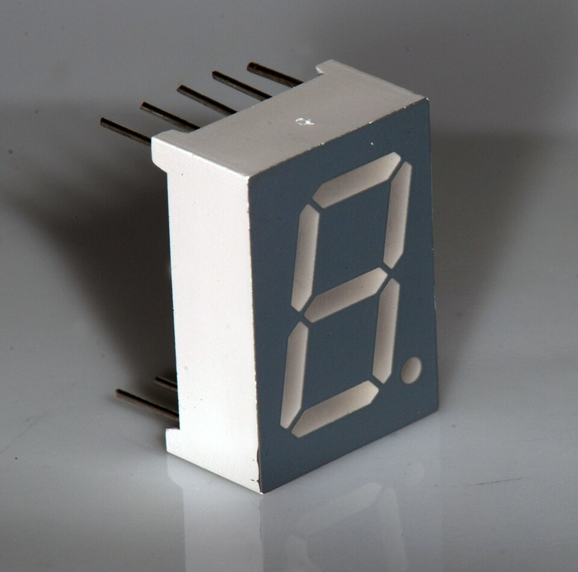

# Day 21: 16x2 LCD Hello World (I2C)

Welcome to Day 21 of the 100-Day Arduino Masterclass! Today, we start **Phase 2: Displays & Interfaces**. We will learn how to interface a standard 16x2 character LCD display using an I2C serial interface backpack.

You will master the physical mechanics of liquid crystal polarization, study the I2C bus serial protocol, learn how to configure expander addresses, and write code to update displays non-blockingly.

---


## 📸 Component Visuals

<p align="center">
  
  
  
  
  
  
  
</p>

## 🎯 Today's Learning Goals
1. Understand the optical physics of liquid crystals and polarizers.
2. Master the I2C bus serial communication protocol (SDA, SCL lines).
3. Study the role of the PCF8574 chip in converting serial I2C data to parallel LCD lines.
4. Calculate I2C addresses using the A0, A1, and A2 hardware pads.
5. Program non-blocking character positioning and screen clearing.

---

## 🧠 The "Why" and "What": Displays in Robotics

### What is a 16x2 Character LCD?
A character LCD (Liquid Crystal Display) is a visual screen capable of displaying alphanumeric text. A "16x2" screen has two horizontal rows, each capable of displaying 16 characters. Standard modules use the Hitachi HD44780 parallel driver chip.

### Why is it Used in Robotics & Mechatronics?
Robots need to display real-time sensor values and status updates without being plugged into a computer:
- **Onboard Debugging Telemetry:** Printing sensor readings (like temperature, distance, battery voltage) while running autonomously on the floor.
- **Boot Diagnostics:** Displaying system self-check statuses: `GPS: OK | IMU: OK | BATT: 12.4V`.
- **User Interface (Menus):** Displaying adjustable parameter menus (such as motor speed limits or PID gains) that can be selected using keypads or encoders.
- **Error Warning Screens:** Printing direct warnings during system faults: `OVERHEAT ERROR!`, `ESTOP ENGAGED`.

---

## ⚡ The Physics & Hardware Theory

### 1. The Physics of Liquid Crystals (LCD Operation)
At the core of an LCD is a layer of liquid crystal molecules sandwiched between two transparent electrodes and two perpendicular polarizing filters.

```
       Liquid Crystal Polarization Light Gate
       
    Backlight  ➡️ [ Polarizer 1 ]  ➡️ [ Twisted Liquid Crystal ]  ➡️ [ Polarizer 2 ]  ➡️ Display (Light)
                    (Vertical)             (Rotates Light 90°)          (Horizontal)
                    
    Backlight  ➡️ [ Polarizer 1 ]  ➡️ [ Untwisted LC (Charged) ] ➡️ [ Polarizer 2 ]  ➡️ Dark Spot (Blocked)
                    (Vertical)             (No Light Rotation)          (Horizontal)
```

* **Polarization:** Light from the backlight passes through Polarizer 1, which aligns the light waves vertically.
* **The Liquid Crystals (Resting):** Liquid crystal molecules are physically twisted by $90^{\circ}$. As the polarized light passes through the crystal layer, the twisted structure acts as a waveguide, rotating the light waves' polarization axis by $90^{\circ}$. The light is now aligned horizontally and passes cleanly through Polarizer 2 (horizontal), lighting up the screen.
* **Applying Voltage (Charged):** When the HD44780 chip applies a small AC voltage to a specific pixel grid segment, the electric field forces the liquid crystal molecules to untwist. The vertical polarized light passes straight through without rotating. When it hits Polarizer 2 (horizontal), it is **completely blocked**, creating a dark spot on the screen that we see as a text character.

### 2. The PCF8574 I2C Backpack (Pin Saving)
Driving a standard HD44780 LCD requires at least 6 digital I/O pins (RS, EN, D4, D5, D6, D7) in 4-bit mode, plus VCC, GND, and contrast lines. This consumes too many pins.

To save pins, we use an I2C backpack board soldered to the LCD. This board contains a **PCF8574 8-bit I/O Expander chip**.
* The PCF8574 acts as a bridge. It listens to the Arduino's Inter-Integrated Circuit (I2C) serial bus over just **2 wires (SDA and SCL)**.
* It parses the serial data packets and outputs the corresponding parallel signals to the LCD's 8 pins, reducing pin usage from 6 digital pins down to 2 shared I2C bus pins.

```
           I2C Serial Communication Bus Layout
           
                       +-------+  SDA (Serial Data)  +-------------+
        Arduino Uno    |       |--------------------➡️ | I2C Backpack | ➡️ Parallel LCD Pins
          (Master)     |       |  SCL (Serial Clock) | (PCF8574)   |
                       |       |--------------------➡️ |   (Slave)   |
                       +-------+                     +-------------+
```

### 3. PCF8574 Hardware Address Selection
Because multiple devices share the same I2C bus wires, each device must have a unique address.
The PCF8574 chip has three address pins (A0, A1, A2). On the back of the backpack module, you will see three open solder pads: A0, A1, and A2.
* By default (unbridged/open), these pins are pulled `HIGH`.
* The address formula for the standard PCF8574 (Texas Instruments) is:
  $$\text{Address} = 0100 \ [\text{A2}] \ [\text{A1}] \ [\text{A0}] \ \text{in binary}$$
* With A0-A2 open (HIGH = 1): `0100111` in binary, which is **`0x27`** in hex.
* If you solder a bridge across A0 (pulling it LOW = 0): `0100110`, which is **`0x26`**.
* The alternative PCF8574A chip (NXP) uses base address `0111`, yielding **`0x3F`** when all pins are open.

---

## 🔄 Alternatives: LCDs vs. OLEDs vs. 7-Segments

| Display Type | Technology | Communication | Text Resolution | Graphical Support | Current Draw | Best Use Case |
| :--- | :--- | :--- | :--- | :--- | :--- | :--- |
| **Character LCD (16x2)** | Liquid crystal light gate + LED backlight. | I2C (2 pins). | 16 chars $\times$ 2 lines. | Custom characters only. | Low ($\approx 20\text{ mA}$). | **Chosen** for general telemetry, diagnostics, and parameters menus. |
| **OLED (SSD1306)** | Organic Light Emitting Diode (self-lit pixels). | I2C or SPI. | Variable (e.g. 128 $\times$ 64 pixel grid). | Full graphical rendering. | Very Low ($\approx 10\text{ mA}$). | Detailed graphs, clean micro-fonts, and high-end animations. |
| **7-Segment Display** | Discrete LED segments. | Parallel or Shift Register | Numeric only. | None. | High (up to $80\text{ mA}$). | Outdoor clocks, digital scales, high-visibility distance displays. |

---

## 🛠️ Components Needed

To build this project, you will need:
1. **Arduino Uno or Mega**.
2. **16x2 LCD Screen with I2C Backpack soldered** (usually blue/green screen).
3. **Breadboard & Jumper Wires**.
4. **USB Cable**.

---

## 🔌 Pin-to-Pin Wiring Instructions

Verify your Arduino model's I2C pinout. On the Uno, SDA is Pin A4 and SCL is Pin A5. On Mega, SDA is 20 and SCL is 21.

| LCD Backpack Pin | Arduino Pin (Uno/Nano) | Arduino Pin (Mega) | Wire Color | Description |
| :---: | :---: | :---: | :--- | :--- |
| **VCC** | **5V** | **5V** | Red | Power supply (+5V) |
| **GND** | **GND** | **GND** | Black | Ground reference |
| **SDA** | **A4** | **20** | Yellow | Serial Data Line |
| **SCL** | **A5** | **21** | Green | Serial Clock Line |

---

## 🧪 How to Test and Validate

Follow these steps to install the drivers, adjust contrast, and run the HelloWorld counter:

### 1. Library Installation
- In the Arduino IDE, open **Tools > Manage Libraries** (or `Ctrl+Shift+I`).
- Search for **"LiquidCrystal I2C"** by Frank de Brabander.
- Click **Install** to add the library.

### 2. Verify Output and Telemetry
- Upload `Day_21_LCD_HelloWorld.ino`.
- The LCD backlight should turn ON immediately.
- **Text Verification:**
  - Row 1 should display: `Arduino Master!`
  - Row 2 should show the counting uptime: `Uptime: 1s`, `Uptime: 2s`... updating exactly every 1 second.
- **Adjust Contrast:** If you see the backlight on but no letters, locate the small blue square potentiometer on the back of the I2C backpack. Use a screwdriver to rotate it slowly until the characters stand out clearly against the blue background.

### 🔍 Troubleshooting Tips
* **The display glows but does not print any characters (or displays solid boxes):**
  - Adjust the blue contrast potentiometer on the back of the backpack. The default contrast is often set too low.
  - The I2C address might be incorrect. If `0x27` fails to print, change the address in the code to **`0x3F`** (common for alternative expander chips).
  - Use an "I2C Scanner" sketch to scan the bus and locate the exact hex address of your board.
* **The monitor prints updates, but the LCD is completely dead (no backlight):**
  - Check your VCC and GND connections. Verify the jumper wires are solid.
  - Check the I2C SCL/SDA pins. If you swapped SCL and SDA, the backpack cannot receive data.

## 🧠 Code Explanation

Let's break down how to interface an LCD using only 2 wires (I2C):

### 1. The I2C Backpack
```cpp
#include <LiquidCrystal_I2C.h>
LiquidCrystal_I2C lcd(0x27, 16, 2);
```
- A standard LCD screen has 16 pins. Wiring all of those up manually takes 6 digital pins from the Arduino and creates a massive nest of wires.
- The I2C Backpack has a microchip (PCF8574) soldered to the back of the LCD. This chip acts as a translator. It takes serial data from the Arduino over just 2 wires (`SDA` and `SCL`) and internally converts it to the 16 parallel pins needed to drive the screen.
- `0x27` is the physical hex address of this specific chip on the I2C bus.

### 2. Formatting the Screen
```cpp
lcd.setCursor(0, 1);
lcd.print("Uptime: ");
lcd.print(uptimeSeconds);
lcd.print("s    ");
```
- The LCD is a grid of 16 columns and 2 rows. `setCursor(Column, Row)` moves the invisible typing cursor. Note that it is 0-indexed! (Row 1 is actually index `0`, Row 2 is index `1`).
- Because the screen doesn't automatically erase old text, printing `10s` over `9s` would look like `10s`. But if the time goes backward (or clears), you get leftover garbage characters. Printing `s    ` (with trailing spaces) perfectly erases any leftover digits from the previous update!
