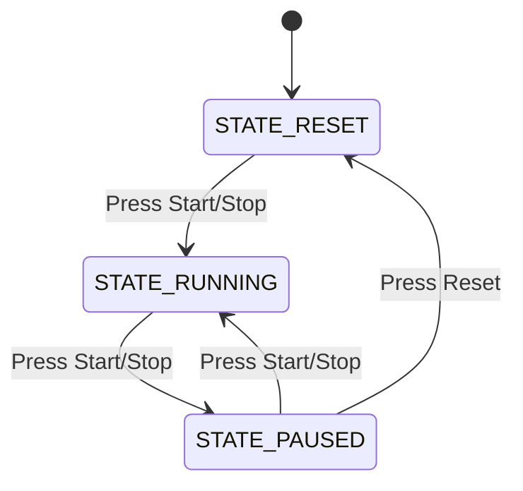

# Day 22: LCD Stopwatch (FSM & I2C Performance Tuning)

Welcome to Day 22 of the 100-Day Arduino Masterclass! Today, we progress in UI development. We will build a high-precision digital stopwatch with centisecond resolution ($1/100^{\text{th}}$ of a second) using an I2C 16x2 LCD and two tactile buttons.

You will master FSM user interfaces, study the electrical bandwidth limits of I2C buses, calculate transmission delays to prevent screen flickering, and write formatted centisecond time conversions.

---

## 🎯 Today's Learning Goals
1. Design an FSM UI with three states: Reset, Running, and Paused.
2. Master the transmission speed math of the $100\text{ kHz}$ I2C clock.
3. Program a display refresh limiter ($20\text{ Hz}$) to prevent I2C bus congestion.
4. Convert absolute `millis()` variables into minutes, seconds, and centiseconds.
5. Coordinate multiple asynchronous debounced button triggers.

---

## 🧠 The "Why" and "What": Stopwatches in Mechatronics

### What is a Digital Stopwatch UI?
A stopwatch measures the elapsed time between its activation and deactivation. In embedded interfaces, this requires coordinating physical buttons, maintaining a clock accumulator, and displaying the time on a screen.

### Why is it Used in Robotics & Embedded Control?
Stopwatches and elapsed time calculations are core tools for performance logging and time-critical tasks:
- **Velocity / Speed Calculation:** Mobile robots measure the time elapsed between passing two light gates (Day 6 LDRs) to calculate their physical velocity:
  $$\text{Velocity} = \frac{\text{Distance}}{\text{Elapsed Time}}$$
- **Process Profiling:** Measuring how many milliseconds a sensor scanning or pathfinding algorithm takes to run, helping engineers optimize code.
- **Fail-Safe Timers:** Disabling an actuator if it does not reach its limit switch within a set timeout limit.
- **Lap Timers:** Automatic timers for line-following racers.

---

## ⚡ The Physics & Hardware Theory

### 1. The FSM Stopwatch States
To coordinate buttons, we use a Finite State Machine (FSM):



Inside `loop()`, the code accumulates time based on whether we are in the `STATE_RUNNING` phase or not, keeping the buttons responsive.

### 2. I2C Bus Bandwidth & LCD Refresh Bottlenecks
Why do we need a display refresh limiter?
Standard I2C communication on the Arduino Uno runs at a clock frequency of **$100\text{ kHz}$** ($100,000\text{ bits per second}$). 

Let's calculate the transmission time for a single character on the I2C LCD backpack:
1. To write one character, the PCF8574 expander must receive an address byte, a command control byte, and the ASCII data byte.
2. Including START/STOP bits and ACKs, this requires sending roughly **27 bits** of data over the bus.
3. At $100\text{ kHz}$, transmitting 27 bits takes:
   $$t_{char} = \frac{27\text{ bits}}{100,000\text{ bps}} = 270\text{ µs} \ (0.27\text{ ms})$$
4. To update our 8-character time string (`00:00.00`) and position the cursor, we must transmit 9 characters:
   $$t_{update} = 9 \times 0.27\text{ ms} \approx 2.43\text{ ms}$$

If we do not limit updates and write to the LCD on every single loop iteration (thousands of times a second):
* The I2C bus will saturate.
* The loop duration will spike from $50\text{ µs}$ to **$2.43\text{ ms}$**, causing severe clock skew and lags in button debouncing.
* The LCD pixels will not have time to settle, creating a faded, blurry, and flickering screen.

**The Solution:** We restrict display updates to **20 Hz (every 50ms)**. Centiseconds only change every 10ms, and human eyes cannot read changes faster than 20 Hz anyway. The loop runs at full speed, and we write to the LCD only when needed.

### 3. Centisecond Mathematics
To display centiseconds (hundredths of a second), we extract values from the raw millisecond time ($msTime$):
- **Minutes:** `(msTime / 60000) % 60`
- **Seconds:** `(msTime / 1000) % 60`
- **Centiseconds:** `(msTime % 1000) / 10`
- **Padding:** We pad single digits (values $< 10$) with a leading `'0'` character to maintain a fixed alignment on the screen.

---

## 🔄 Alternatives: Character LCDs vs. 7-Segments vs. OLEDs

| Display Interface | Resolution | Display Brightness | Refresh Speed | I2C Bus Overhead | Best Use Case |
| :--- | :--- | :--- | :--- | :--- | :--- |
| **I2C 16x2 LCD** | 32 characters. | Moderate (LED backlight). | Slow ($\approx 10\text{ ms}$ update). | Moderate | **Chosen** for stopwatches, diagnostic panels, and menus. |
| **7-Segment Display (MAX7219)** | 8 numeric digits. | Very High (LEDs). | Fast (SPI bus runs at $4\text{ MHz}$). | Very Low | Outdoor sports lap timers, industrial clocks. |
| **OLED (SSD1306)** | $128 \times 64$ pixels. | High contrast (self-lit). | Moderate | High (requires updating $1024$ bytes of page memory). | Small smartwatches, detailed graphical graphs. |

---

## 🛠️ Components Needed

To build this project, you will need:
1. **Arduino Uno or Mega**.
2. **16x2 LCD with I2C Backpack**.
3. **Two Tactile Pushbuttons**.
4. **Breadboard & Jumper Wires**.
5. **USB Cable**.

---

## 🔌 Pin-to-Pin Wiring Instructions

Ensure both buttons are connected to Ground. We configure digital pins 2 and 3 as `INPUT_PULLUP` to eliminate external resistors.

| Component | Pin Label | Arduino Pin | Wire Color | Description |
| :--- | :--- | :--- | :--- | :--- |
| **LCD** | VCC | **5V** | Red | Screen power supply |
| **LCD** | GND | **GND** | Black | Ground reference |
| **LCD** | SDA | **A4** | Yellow | Serial Data Line |
| **LCD** | SCL | **A5** | Green | Serial Clock Line |
| **Start/Stop Button** | Pin A | **Pin 2** | Blue | Debounced start/stop input |
| **Start/Stop Button** | Pin B | **GND** | Black | Ground return |
| **Reset Button** | Pin A | **Pin 3** | White | Debounced reset input |
| **Reset Button** | Pin B | **GND** | Black | Ground return |

---

## 🧪 How to Test and Validate

Follow these steps to upload, run, and verify your stopwatch:

### 1. Verification of RESET State
- Upload `Day_22_LCD_Stopwatch.ino`.
- Open the Serial Monitor at **9600 Baud**.
- Verify the LCD displays:
  - Row 1: `STATUS: RESET`
  - Row 2: `TIME:   00:00.00`
- Confirm that pressing the **Reset Button** (Pin 3) does nothing in this state.

### 2. Verify RUNNING State
- Press the **Start/Stop Button** (Pin 2) once.
  - The LCD Row 1 should immediately change to: `STATUS: RUNNING`.
  - Row 2 time digits should start counting up rapidly: `00:01.25`, `00:02.80`...
  - The Serial Monitor logs: `[STOPWATCH] State: RUNNING`.

### 3. Verify PAUSED and RESET States
- While running, press the **Start/Stop Button** again.
  - The timer digits should freeze instantly.
  - Row 1 should display: `STATUS: PAUSED`.
- **Resetting:** Press the **Reset Button** (Pin 3).
  - The timer should snap back to `00:00.00`.
  - Row 1 should return to `STATUS: RESET`.
  - *Note:* The reset button only works when the stopwatch is paused, preventing accidental resets while running.

### 🔍 Troubleshooting Tips
* **The stopwatch time stops or lags when I press buttons:**
  - Verify that there are no `delay()` statements inside your main loop. If other blocks of code are blocking the execution, the millisecond accumulator will lag, and buttons will feel unresponsive.
* **The centiseconds numbers look blurry or smear on the screen:**
  - Character LCDs have slow liquid crystal response times ($\approx 100\text{ms}$). Rapidly changing centiseconds will naturally look slightly soft. If they look completely garbled, check that the `DISPLAY_REFRESH_INTERVAL` is set to at least `50`. Lower values will overload the display.
* **The buttons don't react, or trigger multiple start/stop events per single press:**
  - Check that the buttons are wired to the correct pins (Pin 2 and Pin 3).
  - Ensure the button pins are configured as `INPUT_PULLUP`.

## 🧠 Code Explanation

Let's break down how we built a responsive Stopwatch UI:

### 1. Display Refresh Rate Limiter
```cpp
const unsigned long DISPLAY_REFRESH_INTERVAL = 50; 
if (currentTime - lastDisplayRefreshTime >= DISPLAY_REFRESH_INTERVAL) {
    updateTimeDisplay(activeTime);
}
```
- Sending text over the I2C bus takes real CPU time (about 1-2 milliseconds per update). If we let the `loop()` update the screen at maximum speed, the I2C bus bottlenecks, the screen flickers violently, and our button presses get ignored.
- We limit the LCD update to exactly 20 Hz (every 50ms). This is fast enough to look perfectly smooth to the human eye, but slow enough to leave 99% of the CPU free to calculate time and read buttons!

### 2. Centisecond Math
```cpp
unsigned long centiseconds = (msTime % 1000) / 10;
```
- We want to display hundredths of a second (like a real sports stopwatch). 
- `msTime % 1000` grabs only the remainder milliseconds (e.g., if total time is `1234ms`, it grabs `234ms`).
- We then divide by `10` to convert milliseconds to centiseconds (`234 / 10 = 23`).
