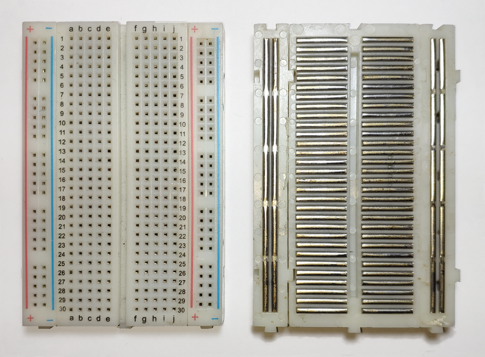
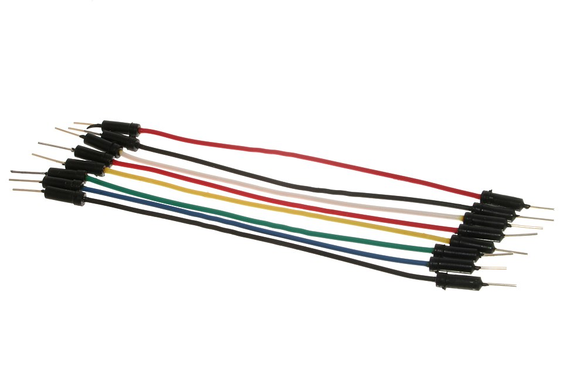
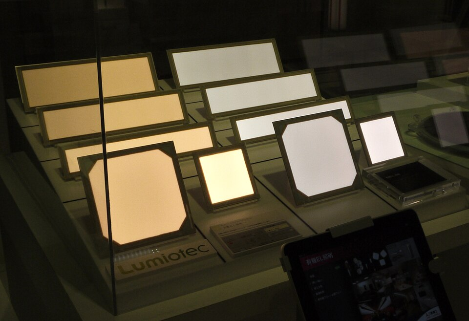
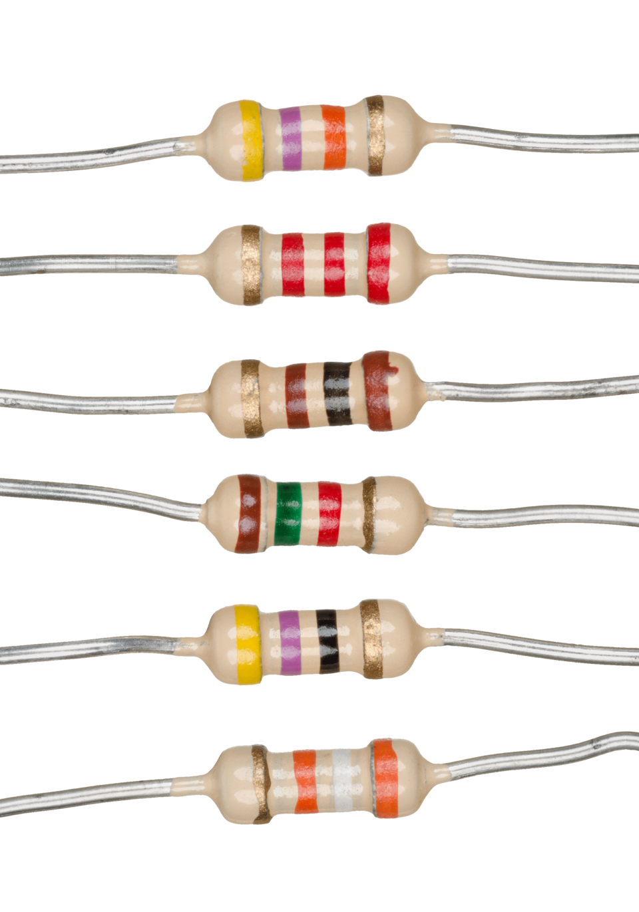

# Day 26: OLED Display (SSD1306) Graphics

Welcome to Day 26 of the 100-Day Arduino Masterclass! Today, we explore graphical interfaces. We will learn how to interface a 0.96" SSD1306 OLED display using I2C and program a dynamic graphics engine that draws text borders, geometric shapes, and coordinate systems.

You will master organic self-luminous semiconductor physics, study the geometry of pixel-mapped coordinate spaces, and optimize serial bus operations using local SRAM framebuffers.

---


## 📸 Component Visuals

<p align="center">
  
  
  
  
  
  
</p>

## 🎯 Today's Learning Goals
1. Understand the working physics of Organic Light Emitting Diodes (OLEDs).
2. Master the coordinate system geometry of $128 \times 64$ pixel screens.
3. Understand local SRAM framebuffer allocation and I2C write cycles.
4. Program line, circle, rectangle, and triangle vector drawing functions.
5. Cycle multiple graphic scenes at non-blocking intervals.

---

## 🧠 The "Why" and "What": OLEDs in Robotics

### What is an SSD1306 OLED?
An SSD1306 is a monochrome, graphical organic LED (OLED) display module. With a resolution of $128 \times 64$ individual pixels, it is extremely compact, sharp, and easy to interface using I2C serial communications.

### Why is it Used in Robotics & Instrumentation?
Unlike character LCDs (Day 21) which are locked to rigid grids of letters, graphical OLEDs let you draw anything:
- **Real-Time Data Plotting:** Plotting sensor output graphs (like temperature curves or vibration sweeps) directly on the screen in real-time.
- **Graphical Symbols (Icons):** Drawing status battery symbols, warning yield signs, arrows showing joint movement directions, or radar scanning arcs.
- **Custom Fonts:** Rendering tiny micro-fonts to pack lots of telemetry onto a small screen, or giant fonts for high-visibility distance readouts.
- **Visual Animations:** Bouncing balls, progress loading wheels, or robotic eyes that move and blink.

---

## ⚡ The Physics & Hardware Theory

### 1. Organic Light Emitting Diode Physics
Unlike standard liquid crystal displays (LCDs) which require an LED backlight to shine through liquid crystal polarization gates (Day 21), an OLED has no backlight. 

Each individual pixel is a sub-millimeter organic light-emitting diode. It consists of thin organic carbon-based semiconductor films sandwiched between two conductive electrodes:

```
            OLED Pixel Cross-Section
            
         [ Cathode ] (Metal layer, injects electrons)
       --------------------------------------------------
         Emissive Layer (Organic polymer, e.g. Alq3)  ⬅️ Recombination creates photons
       --------------------------------------------------
         Conductive Layer (Organic hole transport)
       --------------------------------------------------
         [ Anode ] (Indium Tin Oxide, injects holes)
```

* **How It Works:** When a voltage is applied, the cathode injects electrons, and the anode injects holes (positive charges) into the organic layers. The charges travel toward each other. When an electron and a hole recombine inside the **emissive layer**, the electron drops to a lower energy state, releasing its excess energy as a photon (light).
* **Self-Emission Advantages:** Because black pixels are completely powered OFF, they emit no light. This yields a theoretical contrast ratio of infinity (perfect blacks), wide viewing angles ($> 160^{\circ}$), and extremely high power efficiency compared to backlit LCDs.

### 2. The 128x64 Coordinate Space
The OLED screen contains an array of 8,192 pixels. The coordinates are mapped to a Cartesian grid, but with the **origin (0,0) located at the top-left corner**:

```
        OLED Coordinate Mapping System
        
       (0,0)  ================================= (127,0)
         |                                         |
         |         X -> (Horizontal Axis)          |
         |                                         |
         |         Y | (Vertical Axis)             |
         |           v                             |
       (0,63) ================================= (127,63)
```

* X-axis extends horizontally from **0 to 127** (columns).
* Y-axis extends vertically downward from **0 to 63** (rows).
* Drawing operations (e.g. `drawLine(0, 0, 127, 63)`) require converting geometric equations into active pixel coordinate arrays.

### 3. The 1024-Byte Local Framebuffer
Because the Arduino cannot read pixels from the SSD1306's internal memory easily, the Adafruit library allocates a local copy of the display memory—a **framebuffer**—inside the Arduino's SRAM:

$$\text{Buffer Size} = \frac{128 \times 64\text{ pixels}}{8\text{ bits per byte}} = 1024\text{ bytes (1 Kilobyte)}$$

When you call `drawCircle(32, 32, 20)`, the code does not send commands over I2C immediately. It simply flips bits inside the Arduino's local 1kB RAM array.
* **The `display.display()` Command:** When you call `display()`, the Arduino initiates an I2C transaction and transmits the entire 1kB buffer to the SSD1306. 
* At $400\text{ kHz}$ Fast-Mode I2C: transmitting 1kB takes about **$25\text{ milliseconds}$**. Therefore, you must call `display.display()` only after you have finished drawing the entire scene to prevent excessive frame-rate drop.

---

## 🔄 Alternatives: OLEDs vs. TFTs vs. E-Paper

| Display Type | Technology | Colors | Refresh Speed | Power Draw | Sunlight Readability | Best Use Case |
| :--- | :--- | :--- | :--- | :--- | :--- | :--- |
| **SSD1306 OLED** | Organic light-emitting pixels. | Monochrome (Blue/White/Yellow). | Fast ($\approx 30\text{ fps}$). | Very Low | Moderate | **Chosen** for onboard telemetry, menus, and low-power robot nodes. |
| **TFT LCD (ST7735)** | Color LCD with active transistor backlight. | 16-bit Color ($65\text{k}$ colors). | Fast | High (due to backlight). | Poor | Rich graphical user interfaces, video playback. |
| **E-Paper Display** | Electrophoretic microcapsules (physical ink particles). | B/W/Red | Extremely Slow ($\approx 2\text{ to }15\text{ seconds}$). | Zero (only draws power during changes). | Excellent (reflective). | E-readers, static price tags, low-power weather stations. |

---

## 🛠️ Components Needed

To build this project, you will need:
1. **Arduino Uno or Mega**.
2. **0.96" I2C SSD1306 OLED Display Module** (4-pin version).
3. **Breadboard & Jumper Wires**.
4. **USB Cable**.

---

## 🔌 Pin-to-Pin Wiring Instructions

Verify your OLED operating voltage. Most modules run safely on 5V, but some are strictly 3.3V. The connections are identical to the I2C LCD on Day 21.

| OLED Module Pin | Arduino Pin (Uno/Nano) | Arduino Pin (Mega) | Wire Color | Description |
| :---: | :---: | :---: | :--- | :--- |
| **VCC** | **5V** (or 3.3V) | **5V** (or 3.3V) | Red | Power supply |
| **GND** | **GND** | **GND** | Black | Ground reference |
| **SDA** | **A4** | **20** | Yellow | Serial Data Line |
| **SCL** | **A5** | **21** | Green | Serial Clock Line |

---

## 🧪 How to Test and Validate

Follow these steps to install libraries and verify the graphics scenes:

### 1. Library Installation
- Open **Tools > Manage Libraries** in the Arduino IDE.
- Search for **"Adafruit SSD1306"** and click **Install**.
- Search for **"Adafruit GFX Library"** and click **Install**.
- (If prompted to install other dependencies, click "Install All").

### 2. Verify Output and Telemetry
- Upload `Day_26_OLED_Graphics.ino`.
- The screen should clear and start displaying the first scene:
  - **Scene 0 (Text & Frame):** Renders nested border rectangles surrounding the text `SSD1306 OLED DRV`.
  - **Scene 1 (Geometry Vectors):** Every 3 seconds, the screen switches to show concentric circles, a triangle, and cross diagonal lines.
  - **Scene 2 (Coordinate Grid):** After another 3 seconds, a central grid axis displays with tick marks and axis labels (+X, -X, etc.).
- Open the Serial Monitor at **9600 Baud** to verify scene change timestamps:
  ```text
  [OLED] Transitioned to Scene: 1
  [OLED] Transitioned to Scene: 2
  ```

### 🔍 Troubleshooting Tips
* **The display is completely black (nothing shows):**
  - Check the I2C address. Most cheap OLEDs default to `0x3C`. A few use `0x3D`. Change the `#define SCREEN_ADDRESS` value in code to `0x3D` if the default fails.
  - Run the I2C Scanner sketch to locate the device address.
* **The display freezes or shows scrambled pixel noise:**
  - This occurs if the Arduino runs out of memory. The Adafruit library allocates 1024 bytes of SRAM. On the Uno (which only has 2048 bytes of SRAM), this leaves only 1kB for the rest of your variables. Avoid using large arrays or strings in your code to prevent memory collisions.
* **The screen contrast is low or parts are dim:**
  - The SSD1306 relies on a stable power supply. Make sure it is connected to the 5V or 3.3V pins directly, not through a resistor.

## 🧠 Code Explanation

Let's break down how to draw vector graphics on an OLED screen:

### 1. The Local Framebuffer
```cpp
display.clearDisplay();
display.drawCircle(32, 32, 20, SSD1306_WHITE);
display.drawLine(0, 0, 128, 64, SSD1306_WHITE);
display.display();
```
- An I2C bus is too slow to send instructions pixel by pixel in real time.
- The Adafruit library creates a "Framebuffer" - a 1024-byte chunk of memory right on the Arduino's RAM representing the 128x64 screen.
- When you call `drawCircle()`, the Arduino mathematically changes the bits inside its own memory instantly.
- When you are completely done drawing your scene, you call `display.display()`. This blasts the entire 1KB memory chunk over the I2C bus in one swift transmission, updating the physical screen flawlessly without tearing!
