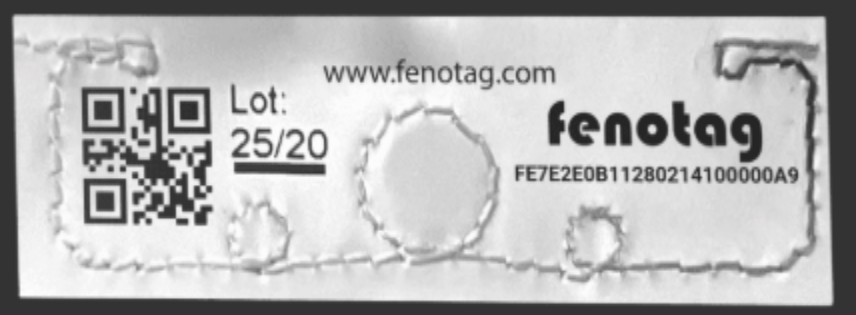

# Day 31: MFRC522 RFID Card Reader (SPI Access Control)

Welcome to Day 31 of the 100-Day Arduino Masterclass! Today, we introduce wireless RFID (Radio Frequency Identification) tracking and the high-speed **SPI (Serial Peripheral Interface)** communication protocol. We will interface the standard **MFRC522 RFID Reader** to read passive card UIDs and build an access control verification system.

---


## 📸 Component Visuals

<p align="center">
  
  
  
  
  
</p>

## 🎯 The "Why" and "What"

RFID is a fundamental technology in tracking, inventory, logistics, and security systems. In robotics and automation, RFID is used for:
1. **Tool Identification:** Robotic cells automatically verifying which gripper or end-effector is attached before executing tasks.
2. **AGV Path Landmarks:** Automated Guided Vehicles (AGVs) reading RFID tags embedded in warehouse floors to identify locations and execute path changes.
3. **Security Access Control:** Locking and unlocking mechanical mechanisms (doors, robot cabinets) using RFID key fobs.

We will write a non-blocking program that polls the MFRC522 chip over the SPI bus, parses card UIDs, and cross-references them against an authorized credential list.

---

## 🔬 Physics & Hardware Theory

### 1. Near-Field Inductive Coupling (Passive RFID)
The MFRC522 reader operates at a high frequency of **$13.56\text{ MHz}$**. 
* **Energy Harvesting:** The reader's PCB antenna emits an alternating electromagnetic field. When a passive RFID tag is brought near ($<5\text{cm}$), its internal loop antenna crosses these magnetic field lines. This induces an alternating current (AC) in the tag's coil via **magnetic induction (Faraday's Law of Induction)**.
* **Bootup & Modulation:** The induced current is rectified to DC to power the tag's integrated circuit (IC). Once powered, the IC transmits its data (including its unique 4-byte or 7-byte serial number) back by varying the electrical load on its coil (a technique known as **Load Modulation**). The reader detects these tiny load drops and demodulates them.

---

### 2. SPI (Serial Peripheral Interface) Bus
Unlike I2C, which uses device addresses and a shared two-wire line, SPI is a **synchronous, full-duplex, master-slave** interface that uses four main signals:
* **MOSI (Master Out Slave In):** The line carrying data from the Arduino (Master) to the MFRC522 (Slave).
* **MISO (Master In Slave Out):** The line carrying data from the MFRC522 back to the Arduino.
* **SCK (Serial Clock):** Clock pulses generated by the Master to synchronize bit transfers.
* **SDA / SS (Slave Select / Chip Select):** A dedicated line pulled **LOW** by the Master to notify a specific slave chip to listen to the bus.

SPI is much faster than I2C, running at clock frequencies of $4\text{ MHz}$ to $10\text{ MHz}+$ on standard microcontrollers, making it ideal for rapid sensor readings and display frames.

```
       Arduino (Master)                  MFRC522 (Slave)
    +--------------------+            +-------------------+
    |             MOSI 11|----------->|MOSI               |
    |             MISO 12|<-----------|MISO               |
    |              SCK 13|----------->|SCK                |
    |               SS 10|----------->|SDA (Slave Select) |
    +--------------------+            +-------------------+
```

---

## 🔄 Alternatives Comparison

When selecting authentication systems for mechatronic setups:

| System Type | Range | Data Rate | Security Level | Hardware Cost | Best Used For |
| :--- | :--- | :--- | :--- | :--- | :--- |
| **RFID (MFRC522)** | **$< 5\text{cm}$** | **Medium** | **Medium (Clonable without encryption)** | **Low ($\approx \$2$)** | **Industrial tools, keycards, path markers (Our choice)** |
| **QR Code / Barcode** | **$10\text{cm} - 2\text{m}$** | **None (Static)** | **Very Low (Photocopyable)** | **None (Paper print)** | **Package tracking, inventory systems** |
| **BLE (Bluetooth)** | **$10\text{m} - 50\text{m}$** | **High** | **High (Encrypted)** | **Medium ($\approx \$5$)** | **User localization, smartphone pairing** |
| **Biometric (Fingerprint)** | **Touch** | **Low** | **Very High** | **High ($\approx \$15$)** | **High-security gates, user verification** |

---

## 🛠️ Components Needed

* 1x Arduino Uno
* 1x MFRC522 RFID Reader Module (13.56 MHz)
* 1x Passive RFID Card (13.56 MHz MIFARE format)
* 1x Passive RFID Key Fob (13.56 MHz MIFARE format)
* 1x Red LED & 1x Green LED
* 2x 220 Ohm current-limiting resistors
* Jumper wires

---

## 🔌 Pin-to-Pin Wiring

> [!CAUTION]
> The MFRC522 chip is powered strictly by **3.3V**. Connecting the module's 3.3V pin to the Arduino's 5V pin will destroy the chip's RF stage. Double check your power connection before turning on the board!

| MFRC522 Pin | Arduino Uno Pin | Wire Color | Description |
| :--- | :--- | :--- | :--- |
| **3.3V** | **3.3V** | Red | Power Input ($3.3\text{V}$ only!) |
| **RST** | **D9** | Brown | Reset Line |
| **GND** | **GND** | Black | Ground Reference |
| **MISO** | **D12** | Yellow | SPI Master In Slave Out |
| **MOSI** | **D11** | Green | SPI Master Out Slave In |
| **SCK** | **D13** | Blue | SPI Clock |
| **SDA (SS)** | **D10** | Orange | SPI Chip Select (Slave Select) |

| LED Indicator | Arduino Pin | Resistor | Description |
| :--- | :--- | :--- | :--- |
| **Green LED Anode** | **D5** | 220 Ohm to GND | Access Granted indicator |
| **Red LED Anode** | **D6** | 220 Ohm to GND | Access Denied indicator |
| **LED Cathodes** | **GND** | Direct | Common Ground |

---

## 💻 How to Test & Validate

1. Wire up the MFRC522 module to the Arduino Uno exactly as listed in the wiring diagram. **Ensure you use the 3.3V rail!**
2. Install the **MFRC522** library by Miguel Balboa via the Library Manager.
3. Open `Day_31_RFID_Reader.ino` and upload it.
4. Open the **Serial Monitor** at **9600 Baud**.
5. Take your RFID Card or Key Fob and place it close to the MFRC522 PCB antenna:
   * The Serial Monitor will print: `[RFID] Scanned Tag UID: XX XX XX XX`.
   * Since this UID won't match the placeholder authorized key (`DE AD BE EF`), you will see:
     `[ACCESS CONTROL] -> WARNING: UNAUTHORIZED KEY SCANNED. Access Denied!`
   * The Red LED will flash 3 times.
6. **Program your Authorized Key:**
   * Read the printed hex bytes from the Serial Monitor (e.g. `4A D2 F3 8B`).
   * Modify the byte array constant in the code:
     `const byte AUTHORIZED_UID[] = {0x4A, 0xD2, 0xF3, 0x8B};`
   * Upload the modified code to the Arduino.
7. Scan the authorized card again:
   * The Green LED will light up for 2 seconds.
   * The Serial Monitor will print: `[ACCESS CONTROL] -> AUTHORIZED MASTER KEY SCANNED. Access Granted!`.

---

## 🛠️ Troubleshooting Guide

### Common Issues
* **The card is scanned, but the red/green LEDs do not light up:**
  * Ensure the LEDs are connected with correct polarity (longer leg is the anode, which goes to pins 5 or 6).
* **The Serial Monitor prints `MFRC522 Reader initialized...` but scanning cards does nothing:**
  * Double check the SPI lines: MOSI must go to Pin 11, MISO to Pin 12, SCK to Pin 13, and SDA/SS to Pin 10.
  * Verify that you are using 13.56 MHz RFID tags. 125 kHz tags (commonly used in legacy building entry cards) are electromagnetically incompatible and will not be detected.
* **The MFRC522 module feels extremely hot to the touch:**
  * Immediately unplug the USB cable. You have wired the module's power input to 5V instead of 3.3V. Re-verify wiring. The chip may have sustained permanent damage.

## 🧠 Code Explanation

Let's break down how we read an RFID card securely:

### 1. Polling for Cards Non-Blockingly
```cpp
if (!mfrc522.PICC_IsNewCardPresent()) {
    return; // Fast escape if no card is present
}
if (!mfrc522.PICC_ReadCardSerial()) {
    return; // Exit if read failed
}
```
- We don't want the Arduino to freeze and wait forever for a card.
- `PICC_IsNewCardPresent()` quickly checks if a magnetic tag has entered the 13.56 MHz field. If not, the `return` statement instantly kicks us back to the top of `loop()`, allowing other robot tasks to run smoothly.
- If a card *is* there, `PICC_ReadCardSerial()` attempts to download its Unique ID.

### 2. Matching the Master Key
```cpp
if (mfrc522.uid.uidByte[i] != AUTHORIZED_UID[i]) {
    isAuthorized = false;
    break; 
}
```
- We loop through the 4 bytes of the scanned card's UID array.
- We compare each byte to our hardcoded `AUTHORIZED_UID` array.
- The `break` command is an optimization: if even the very first byte doesn't match, we instantly exit the `for` loop and deny access, rather than wasting CPU cycles checking the rest!
