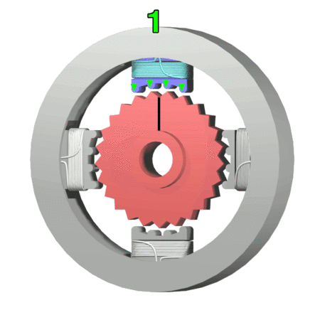

# Day 34: Stepper Motor Control (ULN2003 / 28BYJ-48)

Welcome to Day 34 of the 100-Day Arduino Masterclass! Today, we study open-loop positioning actuators by interfacing a unipolar **28BYJ-48 Stepper Motor** with a **ULN2003 Darlington Transistor Array driver**. Instead of using standard libraries, we will write our own step scheduler from scratch to understand step sequences (Half-Step), gear reduction math, and power conservation coil gating.

---


## 📸 Component Visuals

<p align="center">
  
  
  
  
  
  
  
</p>

## 🎯 The "Why" and "What"

Unlike DC motors which rotate continuously when powered (Day 33), stepper motors move in discrete, precise angular increments called **steps**. This makes them essential in robotics and automation for:
1. **3D Printers & CNC Machines:** Drawing precise coordinates on X, Y, and Z axes.
2. **Robotic Grippers/Arms:** Moving joints to specific, repeatable angles without encoders.
3. **Camera Gimbals:** Smoothly panning and tilting sensor payloads.

The 28BYJ-48 unipolar stepper is a low-cost, high-torque geared motor ideal for learning stepper kinematics.

---

## 🔬 Physics & Hardware Theory

### 1. Motor Coil Configuration (Unipolar)
A unipolar stepper motor contains a permanent magnet rotor surrounded by electromagnets (coils) on the stator. 
* Unipolar motors have two center-tapped coils. This splits them electrically into **four phases (A, B, C, D)**.
* The center taps are connected to VCC ($5\text{V} - 12\text{V}$), and the microcontroller rotates the shaft by grounding the four phases in a specific sequence to pull the magnet rotor toward the active coil.

---

### 2. Step Sequencing Modes
By controlling which phases are grounded at any instant, we alter step step configurations:

```
Wave Drive (1-Phase):   [Coil A] -> [Coil B] -> [Coil C] -> [Coil D]
Full-Step (2-Phase):    [A+B]    -> [B+C]    -> [C+D]    -> [D+A]
Half-Step (1&2-Phase):  [A] -> [A+B] -> [B] -> [B+C] -> [C] -> [C+D] -> [D] -> [D+A]
```

* **Wave Drive:** Lowest power, lowest torque. Only one phase is active at a time.
* **Full-Step:** High torque, but coarse resolution. Two phases are active at a time.
* **Half-Step:** Alternates between energizing one and two phases. This **doubles the angular resolution** (halving step size) and creates significantly smoother motion with less vibration.

Our sketch implements an 8-state Half-Step sequence to achieve maximum resolution and smooth motion:
```cpp
const byte halfStepSequence[8] = {
  0b1000, 0b1100, 0b0100, 0b0110, 0b0010, 0b0011, 0b0001, 0b1001
};
```

---

### 3. Gear Reduction Math
The 28BYJ-48's internal rotor has 32 magnetic poles. In Half-Step mode (8 states), one rotor revolution requires:
$$\text{Rotor Steps} = 32 \text{ poles} \times 2 = 64 \text{ half-steps per rotor revolution}$$

To increase torque, the motor incorporates an internal reduction gearbox with a ratio of **$64:1$** (specifically, $63.6839:1$). 
Thus, to calculate the number of steps required to rotate the output shaft by a full $360^{\circ}$:
$$\text{Steps per Revolution} = 64 \text{ (rotor steps)} \times 64 \text{ (gear ratio)} = 4096 \text{ steps}$$

---

### 4. ULN2003 Darlington Transistor Array
Because the motor coils require hundreds of milliamps, the Arduino pins cannot drive them directly. The **ULN2003 driver** houses 7 Darlington transistor pairs acting as low-side switches:
* Pulling an input pin (e.g. IN1) **HIGH** on the Arduino saturates the Darlington transistor.
* This connects the corresponding motor lead to **Ground**, completing the circuit and energizing the coil.

---

## 🔄 Alternatives Comparison

When selecting rotary actuators:

| Motor Class | Control Type | Feedback Required? | Cost | Precision / Resolution | Best Used For |
| :--- | :--- | :--- | :--- | :--- | :--- |
| **Stepper Motor** | **Open-Loop Positioning** | **No** | **Low** | **High ($<1.8^{\circ}$ steps)** | **Precision positioning, CNCs, 3D printers (Our choice)** |
| **DC Gearmotor** | **Open-Loop Speed** | **Yes (Encoder needed)** | **Very Low** | **None (Without feedback)** | **Mobile robot drive wheels** |
| **RC Servo** | **Closed-Loop Position** | **Internal Potentiometer** | **Medium** | **Medium (Jittery at bounds)**| **Robotic arm joints, steering linkages** |

---

## 🛠️ Components Needed

* 1x Arduino Uno
* 1x 28BYJ-48 Unipolar Stepper Motor (5-wire)
* 1x ULN2003 Driver Board
* 1x External 5V DC Power Source (e.g., 4x AA battery holder or DC bench supply)
* Jumper wires

---

## 🔌 Pin-to-Pin Wiring

> [!CAUTION]
> Do not attempt to run the stepper motor using the Arduino's 5V pin. The high current switching will inject electrical noise into the Arduino's supply lines, causing board resets or thermal damage. Always power the ULN2003 board via an external 5V supply and tie the Ground terminals together.

| ULN2003 Driver Input | Arduino Uno Pin | Wire Color | Description |
| :--- | :--- | :--- | :--- |
| **IN1** | **D4** | Orange | Phase A Trigger |
| **IN2** | **D5** | Yellow | Phase B Trigger |
| **IN3** | **D6** | Green | Phase C Trigger |
| **IN4** | **D7** | Blue | Phase D Trigger |
| **GND** (white screw terminal) | **GND** | Black | Common Ground reference |
| **+** (VCC screw terminal) | **Ext. Power (+5V)** | Red | External positive supply |
| **-** (GND screw terminal) | **Ext. Power (GND)** | Black | External power return ground |

---

## 💻 How to Test & Validate

1. Connect the components as detailed in the wiring table. Leave the external 5V power disconnected initially.
2. Upload `Day_34_Stepper_ULN2003.ino` to the Arduino.
3. Open the **Serial Monitor** at **9600 Baud**.
4. Turn on the external 5V motor power source.
5. Inspect the output shaft:
   * The motor will spin Clockwise. The Serial Monitor will output progress:
     `[MOTION] CW Sweep: 90 degrees completed.`
   * After exactly 4096 steps ($360^{\circ}$ rotation), the motor will stop.
   * The coils will de-energize (the red LEDs on the ULN2003 board will turn off), preventing overheating.
   * After a 2-second pause, the motor will execute a full 360-degree sweep Counter-Clockwise.
6. Verify coil temperature: The motor should remain cool to the touch during the pause state.

---

## 🛠️ Troubleshooting Guide

### Common Issues
* **The motor vibrates, hums, or clicks but does not rotate:**
  * The phase pins are wired out of sequence. Re-verify the connection order from IN1-IN4 to Arduino pins 4-7.
  * The external power supply voltage is too low or cannot supply enough current ($>300\text{ mA}$). Use fresh batteries.
* **The motor gets extremely hot when not rotating:**
  * Verify that the `releaseCoils()` function is executing when the motor enters the pause state. If any coil remains continuously energized, it will draw current and heat up.
* **The motor skips steps or stalls at higher speeds:**
  * Stepper motors lose torque at higher speeds because the coils cannot charge/discharge fast enough. Try increasing the `stepInterval` variable in the code (e.g., from `1200` to `2000` microseconds) to reduce the maximum speed.

## 🧠 Code Explanation

Let's break down how we built a custom stepper driver from scratch using Bit-Masking:

### 1. The Half-Step Sequence Table
```cpp
const byte halfStepSequence[8] = {
  0b1000, // Coil A
  0b1100, // Coil A + B
  0b0100, // Coil B
  // ...
};
```
- A unipolar stepper motor has 4 electromagnets. To turn the shaft, we have to magnetize them in a very specific order to pull the internal magnets around in a circle.
- We use a "Half-Step" sequence. By alternating between turning 1 coil on and 2 coils on simultaneously, we double the motor's resolution (64 steps per revolution instead of 32) making it incredibly smooth!

### 2. Bit-Mask Execution
```cpp
void writeCoils(byte pinMask) {
  digitalWrite(IN1_PIN, (pinMask & 0b1000) ? HIGH : LOW);
  digitalWrite(IN2_PIN, (pinMask & 0b0100) ? HIGH : LOW);
  // ...
}
```
- Instead of messy `if` statements, we pass our 4-bit binary sequence directly into `writeCoils()`.
- We use the Bitwise AND operator (`&`). `pinMask & 0b1000` checks if the 4th bit (Coil A) is a `1` or a `0`. We use the ternary operator `? HIGH : LOW` to instantly convert that bit into a physical output voltage on the pin!
