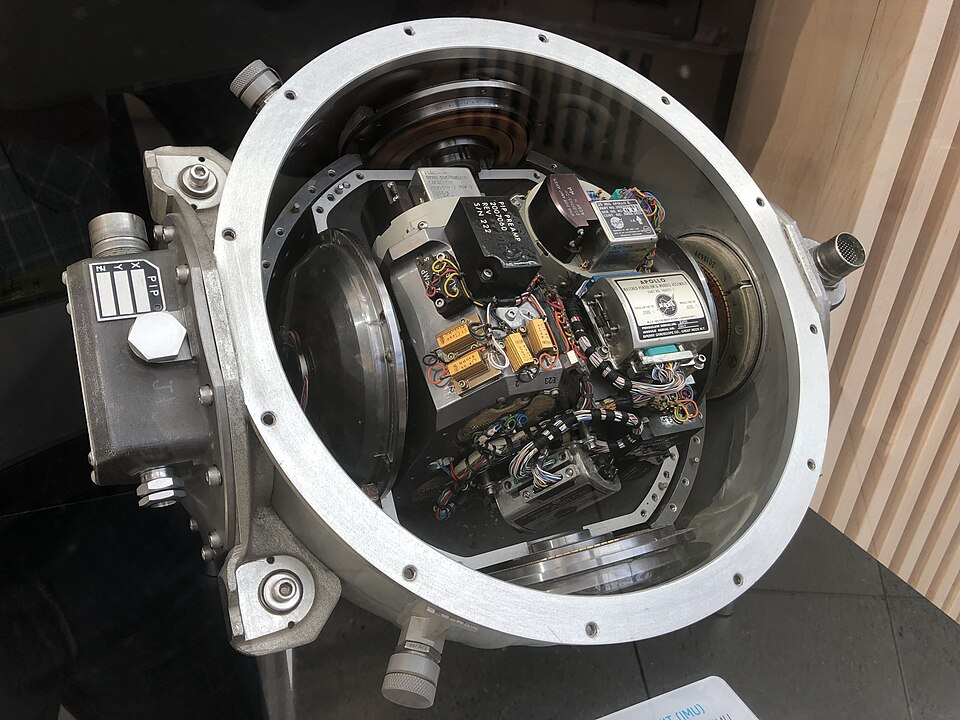

# Day 42: IMU Sensor Fusion via Complementary Filter

Welcome to Day 42 of the 100-Day Arduino Masterclass! Today, we study **Sensor Fusion**, one of the most critical topics in robotics control systems. We will learn how to write a **Complementary Filter** from scratch using raw I2C data from the MPU6050. This algorithm blends gyroscope integrations and accelerometer gravity vectors to compute noise-free, drift-free Pitch and Roll angles in real-time, preparing us to build self-balancing systems.

---


## 📸 Component Visuals

<p align="center">
  
  
  
  
  
</p>

## 🎯 The "Why" and "What"

Measuring absolute angles (like pitch and roll) is crucial for quadcopters, self-balancing personal transporters (Segways), and walking robots.
* **The Accelerometer Problem:** Accelerometers measure gravity vectors to determine absolute tilt. However, they are highly sensitive to linear motion and vibration. If a robot drives over a bump, the accelerometer outputs spike wildly, making raw angle readings extremely noisy.
* **The Gyroscope Problem:** Gyroscopes measure the speed of rotation (angular rate). We can integrate this speed over time to track angles. However, gyroscopes have small bias errors. Integrating these errors continuously causes the calculated angle to **drift** over time, wandering away from the real angle even when stationary.
* **The Sensor Fusion Solution:** A **Complementary Filter** mathematically blends both sensors:
  * Applies a **Low-Pass Filter** to the accelerometer to trust its long-term stability (gravity alignment) while filtering out high-frequency vibrations.
  * Applies a **High-Pass Filter** to the gyroscope to trust its short-term changes (rotation speed) while filtering out low-frequency drift.

---

## 🔬 Physics & Sensor Fusion Mathematics

### 1. Gyroscope Angle Integration (Short-Term Tracking)
The gyroscope outputs the angular velocity $\omega$ in degrees per second ($^{\circ}/\text{s}$). To find the angle $\theta_{\text{gyro}}$, we integrate velocity over the time step $dt$:
$$\theta_{\text{gyro}}(k) = \theta_{\text{fused}}(k-1) + \omega \cdot dt$$

Because the sensor contains tiny biases, integrating over thousands of loops results in drift:
$$\text{Drift Error} = \text{Bias} \times \text{Total Time}$$

---

### 2. Accelerometer Tilt Calculation (Long-Term Reference)
Using the gravity vector ($1g = 9.81\text{ m/s}^2$), we calculate absolute pitch and roll using trigonometry:
$$\theta_{\text{accel, roll}} = \text{atan2}(a_y, a_z) \times \frac{180}{\pi}$$
$$\theta_{\text{accel, pitch}} = \text{atan2}(-a_x, \sqrt{a_y^2 + a_z^2}) \times \frac{180}{\pi}$$

---

### 3. The Complementary Filter Blend
The filter blends these estimates using a scaling coefficient $\alpha$ (typically $\alpha \in [0.95, 0.99]$):
$$\theta_{\text{fused}}(k) = \alpha \cdot (\theta_{\text{fused}}(k-1) + \omega_{\text{gyro}} \cdot dt) + (1 - \alpha) \cdot \theta_{\text{accel}}$$

If we set **$\alpha = 0.98$**:
* **$98\%$ of the angle update** is taken from the integrated gyroscope (maintaining fast, vibration-free response).
* **$2\%$ of the angle update** is taken from the accelerometer (slowly pulling the gyro integration back to gravity, completely correcting long-term drift).

---

## 🔄 Alternatives Comparison

When selecting sensor fusion algorithms for mechatronic navigation:

| Fusion Algorithm | Math Complexity | CPU Overhead | Noise Rejection | Dynamic Drift Correction | Best Used For |
| :--- | :--- | :--- | :--- | :--- | :--- |
| **Complementary Filter**| **Very Low** | **Minimal ($<1\text{ms}$)** | **High** | **Excellent** | **Arduino Uno balancing bots, camera stabilization (Our choice)** |
| **Kalman Filter (Linear)** | **High** | **Medium** | **Very High** | **Excellent (Optimal)** | **Linear systems with Gaussian noise characteristics** |
| **Extended Kalman (EKF)**| **Extremely High** | **Very High** | **Outstanding** | **Outstanding** | **High-power drone flight controllers, self-driving cars (ROS)** |
| **Madgwick Filter** | **High (Quaternions)** | **High** | **Very High** | **Outstanding** | **9-axis IMUs, tracking absolute orientations without gimbal lock** |

---

## 🛠️ Components Needed

* 1x Arduino Uno
* 1x MPU6050 Breakout Board (GY-521)
* 1x Breadboard
* Jumper wires

---

## 🔌 Pin-to-Pin Wiring

| MPU6050 Pin | Arduino Uno Pin | Wire Color | Description |
| :--- | :--- | :--- | :--- |
| **VCC** | **5V** | Red | Power input |
| **GND** | **GND** | Black | Ground reference |
| **SCL** | **A5** | Yellow | I2C Clock |
| **SDA** | **A4** | Green | I2C Data |

---

## 💻 How to Test & Validate

1. Connect the MPU6050 module to the Arduino. Place the sensor flat and completely still on your desk.
2. Upload `Day_42_Complementary_Filter.ino` to your Arduino.
3. **Open the Serial Plotter:**
   * Go to **Tools -> Serial Plotter** (or press `Ctrl+Shift+L` in Arduino IDE).
   * Ensure the baud rate is set to **9600 Baud**.
4. Observe the plot lines:
   * **Blue Line (`Roll_Accel`):** Raw accelerometer calculated roll.
   * **Red Line (`Roll_Gyro_Drift`):** Raw gyroscope integrated roll showing drift.
   * **Green Line (`Roll_Fused_Filter`):** Fused complementary filter angle estimate.
5. **Observe the Drift:**
   * Leave the sensor completely flat and still on the desk.
   * Watch the Red line (`Roll_Gyro_Drift`): It will slowly but steadily drift up or down away from 0, showing how small bias integrates into large errors.
   * Watch the Green line (`Roll_Fused_Filter`): It will remain locked at exactly 0.0, completely immune to gyro drift.
6. **Observe the Noise Rejection:**
   * Tap or shake the desk (inducing high-frequency vibration).
   * Watch the Blue line (`Roll_Accel`): It will spike up and down wildly due to vibration noise.
   * Watch the Green line (`Roll_Fused_Filter`): It will remain completely flat and smooth, filtering out the vibrations.
7. **Observe Dynamic Response:**
   * Pick up the sensor and tilt it back and forth. The Green line will track the absolute angle instantly, with zero lag and zero noise.

---

## 🛠️ Troubleshooting Guide

### Common Issues
* **The Serial Plotter displays a flat line at 0 or doesn't open:**
  * Ensure the Serial Monitor is closed (Arduino IDE only allows one console to access the COM port at a time).
  * Double check that the Serial Plotter baud rate is set to **9600 Baud**.
* **The Fused Roll angle slowly moves in the opposite direction of the actual tilt:**
  * Gyroscope axes directions might be inverted relative to accelerometer trig mapping. Swap the sign of the gyroscope input in the loop:
    Change `fusedRoll = ALPHA * (fusedRoll + gx * dt) ...` to `fusedRoll = ALPHA * (fusedRoll - gx * dt) ...`
* **The system is sluggish when responding to fast tilts:**
  * Try lowering the value of `ALPHA` (e.g. from `0.98` to `0.95` or `0.90`). This tells the filter to place more trust in the accelerometer's absolute reading, speeding up recovery at the cost of allowing slightly more vibration noise to pass.

## 🧠 Code Explanation

Let's break down the magic of Sensor Fusion math:

### 1. Gyroscope Integration (Short-Term Accuracy)
```cpp
gyroIntegratedRoll += gx * dt;
```
- A gyroscope measures *speed* of rotation (Degrees per Second), not angle.
- To find the angle, we have to integrate (multiply speed by time). If we are spinning at 10 deg/sec for 0.02 seconds (`dt`), we have moved 0.2 degrees. We add this to our total angle.
- **The Problem:** Gyroscopes have microscopic static biases. Over time, that 0.02 degree error adds up into a massive, unstoppable drift.

### 2. The Complementary Filter (Sensor Fusion)
```cpp
fusedRoll = ALPHA * (fusedRoll + gx * dt) + (1.0 - ALPHA) * rollAccel;
```
- We calculate the absolute tilt angle using Accelerometer gravity vectors (`rollAccel`). Accelerometers never drift, but they are incredibly noisy when the robot moves or vibrates.
- **The Filter:** We take 98% (`ALPHA = 0.98`) of our smooth, fast Gyroscope angle, and mix in just 2% (`1.0 - ALPHA`) of our noisy, but absolutely-anchored Accelerometer gravity angle!
- This completely cancels out the gyro drift, while perfectly smoothing out the accelerometer vibrations!
