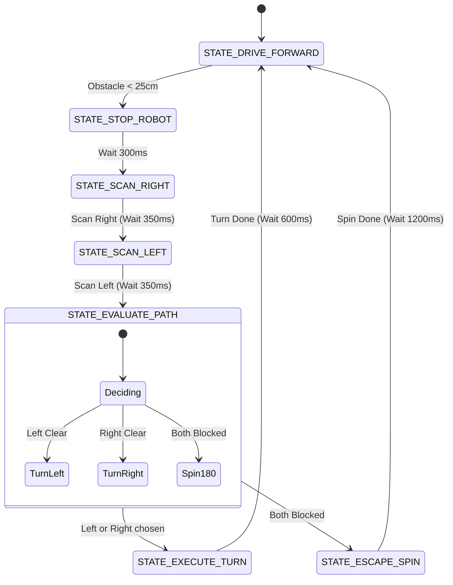

# Day 43: Autonomous Obstacle-Avoidance Robot

Welcome to Day 43 of the 100-Day Arduino Masterclass! Today, we combine our motor driver (Day 33), ultrasonic range finder (Day 38), and servo sweeps (Day 38) to construct a fully autonomous **Mobile Obstacle-Avoidance Robot**. We will design a **non-blocking state machine** navigation router, study differential drive steering kinematics, and analyze spatial clearance mapping.

---

## 🎯 The "Why" and "What"

Autonomous mobile robots (like warehouse AMRs, vacuum cleaners, and planetary rovers) must navigate unknown, dynamic environments without getting stuck.
* **The Problem:** A simple forward-facing distance sensor can only tell if an obstacle is directly in front. It cannot tell which side (left or right) is clear to turn toward. Stopping and blindly turning in a hardcoded direction can lead the robot into corners or traps.
* **The Solution:** We mount the ultrasonic sensor onto a servo. When the robot detects an obstacle blocking its path:
  1. It halts both wheels.
  2. It rotates the servo to scan left and right, measuring the distance to surrounding walls.
  3. It evaluates both paths, choosing the direction with the maximum clearance.
  4. It rotates in place to align with the clear path and resumes driving.

We implement this sequence using a **non-blocking state machine** to ensure that sensor pulses and servo settling delays are managed without halting the processor.

---

## 🔬 Physics & Robotics Kinematics

### 1. Differential Drive Kinematics (Zero-Radius Spins)
A differential drive robot consists of two independent drive wheels located on a shared axis, alongside passive caster wheels for balance.
* **Forward Motion:** Rotate both motors forward at the same speed ($V_{\text{left}} = V_{\text{right}}$).
* **Clockwise Spin (Right Turn):** Rotate the left wheel forward and the right wheel backward ($V_{\text{left}} = -V_{\text{right}}$). This forces the robot to spin in-place around its center point, minimizing the spatial footprint required to steer away from obstacles.
* **Counter-Clockwise Spin (Left Turn):** Rotate the left wheel backward and the right wheel forward.

```
       Spin LEFT In-Place                   Spin RIGHT In-Place
          ▲          │                          │          ▲
          │ (Forward)│ (Backward)               │ (Backward)│ (Forward)
        [Left]     [Right]                    [Left]     [Right]
        Wheel       Wheel                     Wheel       Wheel
```

---

### 2. Servo Settling and Sonar Gating
Mechanical servo motors cannot jump to an angle instantly.
* When the code executes `sensorServo.write(angle)`, it takes roughly **$200\text{ ms} - 300\text{ ms}$** for the servo gear train to physically rotate the sensor to that position.
* If we trigger a sonar ping immediately after writing the angle, we will take a reading while the sensor is still swinging. This smears the acoustic beam, yielding incorrect distance measurements.
* We implement a **settling delay window ($350\text{ ms}$)** using non-blocking timestamps to ensure the sensor has completely stopped moving before taking a distance ping.

---

### 3. State Machine Navigation Architecture
The robot operates under a State Machine containing seven discrete driving states:



---

## 🔄 Alternatives Comparison

When selecting obstacle avoidance architectures for mobile robots:

| Navigation Architecture | Sensor Overhead | Processing Cost | Corner Recovery | Cost | Best Used For |
| :--- | :--- | :--- | :--- | :--- | :--- |
| **Servo-Swept Sonar** | **1 Servo + 1 Sonar** | **Low (State machine)** | **High (Selects max clearance) (Our choice)** | **Low ($\approx \$4$)** | **Compact 2WD/4WD wheeled educational robots** |
| **Fixed Multi-Sonar** | **3 Sonars (Left, Front, Right)**| **Low (GPIO pooling)** | **Medium (Coarse directional resolution)** | **Medium ($\approx \$6$)** | **Wide industrial AGV bases with fixed fields of view** |
| **Bumper Microswitches** | **2-4 Tactile bump switches**| **Extremely Low** | **Low (Must collide to detect)** | **Very Low ($\approx \$1$)**| **Low-cost vacuum robots, backup mechanical safeties** |
| **LiDAR SLAM** | **1 Spinning Laser Scanner** | **Very High (Requires ROS / Pi)** | **Outstanding (360° point cloud)** | **Very High ($>\$100$)**| **Autonomous warehouse robots, indoor navigation mapping** |

---

## 🛠️ Components Needed

* 1x Arduino Uno
* 1x 2WD Robot Chassis (containing 2 DC gearmotors, wheels, and a caster wheel)
* 1x L298N Dual H-Bridge Driver Module
* 1x SG90 Micro Servo Motor
* 1x HC-SR04 Ultrasonic Sensor Module
* 1x External Battery Pack (e.g. 2s LiPo or 6x AA battery holder to power motors)
* 1x Breadboard
* Jumper wires

---

## 🔌 Pin-to-Pin Wiring

> [!IMPORTANT]
> **Common Ground:** The negative (-) terminal of your external motor battery MUST connect to both the L298N GND screw terminal and the Arduino's **GND** pin. Without this connection, the H-bridge control signals will fail to toggle.

| Component Pin | Arduino Uno Pin | Wire Color | Description |
| :--- | :--- | :--- | :--- |
| **L298N ENA** | **D5** (PWM) | Green | Left Motor Speed PWM |
| **L298N IN1** | **D4** | Orange | Left Motor Direction 1 |
| **L298N IN2** | **D3** | Yellow | Left Motor Direction 2 |
| **L298N ENB** | **D6** (PWM) | Violet | Right Motor Speed PWM |
| **L298N IN3** | **D7** | Grey | Right Motor Direction 1 |
| **L298N IN4** | **D8** | White | Right Motor Direction 2 |
| **Servo Signal** | **D9** | Blue | Sonar sweep servo PWM |
| **HC-SR04 TRIG** | **D11** | Green | Ultrasonic trigger output |
| **HC-SR04 ECHO** | **D12** | Yellow | Ultrasonic echo input |
| **System VCC (Logic)**| **5V** | Red | Logic power to sensor & servo |
| **System GND** | **GND** | Black | Shared logic and power Ground |

---

## 💻 How to Test & Validate

1. Assemble the 2WD robot chassis. Mount the servo at the front of the chassis, facing forward. Secure the HC-SR04 sensor to the top of the servo horn.
2. Wire up the electronics according to the wiring table. Keep the motor power battery disconnected.
3. Upload `Day_43_Obstacle_Avoidance_Robot.ino` to the Arduino.
4. **Bench Testing (Wheels Off Ground):**
   * Keep the robot raised on a stand (so wheels do not touch the desk).
   * Connect the motor battery. Open the **Serial Monitor** at **9600 Baud**.
   * The wheels will spin forward (`STATE_DRIVE_FORWARD`).
   * Hold your hand $10\text{ cm}$ in front of the ultrasonic sensor:
     * The motors will stop instantly (`STATE_STOP_ROBOT`).
     * The servo will rotate right and pause, then rotate left and pause to scan.
     * The console displays: `[SCAN] Right clearance: 15.2 cm` and `Left clearance: 48.1 cm`.
     * The robot decides to turn Left. The left wheel rotates backward, and the right wheel rotates forward for $600\text{ ms}$ (`STATE_EXECUTE_TURN`).
     * Once the turn completes, the servo centers, and the wheels resume spinning forward.
5. **Floor Testing:**
   * Place the robot on the floor. It will cruise forward. When it approaches a wall, it will stop, look both ways, steer toward open space, and continue its path!

---

## 🛠️ Troubleshooting Guide

### Common Issues
* **The robot constantly stops and scans even when no obstacles are present:**
  * The HC-SR04 is angled downwards, registering the floor as a close obstacle. Tilt the sensor mount slightly upward so the beam shoots parallel to the floor.
  * Check for loose connections on the trigger and echo pins.
* **The robot scans, chooses to turn left, but the wheels spin in a way that turns it right:**
  * The motor leads on OUT1/OUT2 or OUT3/OUT4 are wired with reversed polarity. Swap the wires of the incorrect motor at the L298N screw terminals.
* **The robot stops to scan, but the Arduino resets as soon as the servo starts to rotate:**
  * Servos draw a high initial current spike, creating voltage drops on the Arduino's 5V line. Place a $100\ \mu\text{F}$ capacitor across the breadboard's 5V and GND pins, or use a separate $5\text{V}$ regulator to power the servo.

## 🧠 Code Explanation

Let's break down how we built a Non-Blocking Robotic State Machine:

### 1. The Switch-Case State Router
```cpp
enum DriveState { STATE_DRIVE_FORWARD, STATE_STOP_ROBOT, STATE_SCAN_RIGHT ... };

switch (currentDriveState) {
    case STATE_DRIVE_FORWARD:
        driveForward(180);
        if (frontDist < CRITICAL_DIST_CM) currentDriveState = STATE_STOP_ROBOT;
        break;
}
```
- Beginners often use `delay()` to run sequences. E.g., `Scan Right -> Delay(500) -> Ping -> Scan Left`. But `delay()` freezes the Arduino, meaning you can't read a stop button or update a screen while waiting!
- We use a State Machine. The code instantly checks the current "State", executes a tiny piece of logic, and loops back around thousands of times a second.
- When an obstacle is detected, we simply change the `currentDriveState` variable, and the next time the loop comes around, it instantly begins executing the next behavior!

### 2. Servo Settle Timing
```cpp
if (currentMillis - stateTimerStart >= 300) {
    sensorServo.write(SERVO_RIGHT);
    // ...
}
```
- Because we aren't using `delay()`, we use `millis()` math. We record the time we commanded the servo to move, and keep bypassing the `if` statement until 300ms have passed. This gives the physical servo motor time to physically rotate and stop vibrating before we trigger the acoustic sonar ping!
