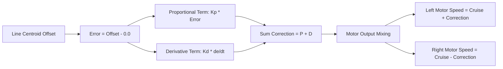

# Day 46: PD-Controlled Line Follower (Proportional-Derivative Feedback Steering)

Welcome to Day 46 of the 100-Day Arduino Masterclass! Today, we transition from open-loop and simple proportional control to a classic closed-loop control system: a **Proportional-Derivative (PD) Controller**. By applying mathematical feedback to our differential-drive robot, we will achieve smooth, high-speed line tracking, eliminating the classic "wobble" associated with basic line-following systems.

---

## 🎯 The "Why" and "What"

Simple line followers make steering adjustments based solely on whether they are left or right of the line (bang-bang control) or how far they are from the line (proportional-only control). 
* **The Problem:** A proportional controller ($P$) responds to current error. If the robot drifts far to the left, it applies maximum right steer. By the time the robot returns to the center line, its angular momentum causes it to overshoot to the right. This creates a continuous, unstable snake-like wobble (oscillation) that gets worse at higher speeds.
* **The Solution:** We add a **Derivative ($D$)** term. The derivative term measures the *rate of change* of the error (how fast the robot is heading towards or away from the line). It acts as an **active software damper**. If the robot is rapidly returning to the center line, the $D$ term recognizes the fast-changing error and applies a braking force to the steering, slowing down the angular rotation *before* the robot overshoots. 

---

## 🔬 Physics & Mathematics

The control loop is executed at a strict, deterministic frequency of **50 Hz** (every $20\,\text{ms}$) to ensure that calculations map reliably to the physical dynamics of the motors and wheels.



### 1. The PD Control Equation
The mathematical feedback correction $u(t)$ is calculated as:
$$u(t) = K_p \cdot e(t) + K_d \cdot \frac{de(t)}{dt}$$

Where:
* $e(t)$ is the current error: $e(t) = \text{Current Offset} - \text{Target Offset} = \text{Current Centroid}$ (scale $-2.0$ to $+2.0$).
* $\frac{de(t)}{dt}$ is the rate of change of error over the time step $dt$. In our code:
  $$\frac{de(t)}{dt} = \frac{e(t) - e(t - dt)}{dt}$$
* $K_p$ (Proportional Gain) determines the magnitude of the steering response to a given offset.
* $K_d$ (Derivative Gain) determines the amount of damping applied to counteract quick changes in error.

### 2. Actuator Mixing (Differential Drive)
The correction $u(t)$ is then mixed into the base cruise speed ($V_{\text{cruise}}$) for the left and right wheels:
$$V_{\text{left}} = V_{\text{cruise}} + u(t)$$
$$V_{\text{right}} = V_{\text{cruise}} - u(t)$$

* **If the robot drifts Left (Centroid Offset $< 0$):**
  * Error is negative, which makes $u(t)$ negative.
  * $V_{\text{left}}$ decreases, and $V_{\text{right}}$ increases, causing the robot to turn to the Right.
* **If the robot drifts Right (Centroid Offset $> 0$):**
  * Error is positive, making $u(t)$ positive.
  * $V_{\text{left}}$ increases, and $V_{\text{right}}$ decreases, causing the robot to turn to the Left.

---

## 🔄 Alternatives Comparison

| Control Algorithm | Steering Action | Overshoot / Oscillation | Max Speed Capability | Tuning Complexity |
| :--- | :--- | :--- | :--- | :--- |
| **PD Control (Our choice)** | **Smooth, predictive damping** | **Very low (damped by D-term)** | **High ($> 1\,\text{m/s}$)** | **Medium (Must tune $K_p$ and $K_d$)** |
| **Bang-Bang Control (2-sensor)** | Sudden on/off switching | Extremely high | Low ($< 0.3\,\text{m/s}$) | None |
| **Proportional (P) Control** | Gradual steering | High (continuous wobble) | Medium ($< 0.5\,\text{m/s}$) | Low (Tune $K_p$) |
| **Full PID Control** | Smooth with steady-state correction | Low to medium | High ($> 1\,\text{m/s}$) | High (Tune $K_p$, $K_i$, and $K_d$) |

> [!NOTE]
> We omit the Integral ($I$) term in standard line following because steady-state offset error is negligible on a moving track, and integrating historic line errors leads to overshoot and windup issues around sharp curves.

---

## 🛠️ Components Needed

* 1x Arduino Uno
* 1x 2WD Robot Chassis (2 DC motors + wheels + caster)
* 1x L298N Dual H-Bridge Driver Module
* 1x 5-Channel TCRT5000 IR Sensor Array Module (analog outputs)
* 1x External Battery Pack (e.g. 2s LiPo or 6x AA battery holder to power motors)
* 1x Breadboard & Jumper wires
* Black electrical tape (to build a track)

---

## 🔌 Pin-to-Pin Wiring

### 1. Sensor Array to Arduino Uno
| Sensor Pin | Arduino Pin | Wire Color | Description |
| :--- | :--- | :--- | :--- |
| **OUT1 (Far Left)** | **A0** | Grey | Sensor 0 analog voltage |
| **OUT2 (Mid Left)** | **A1** | Blue | Sensor 1 analog voltage |
| **OUT3 (Center)** | **A2** | Purple | Sensor 2 analog voltage |
| **OUT4 (Mid Right)**| **A3** | Yellow | Sensor 3 analog voltage |
| **OUT5 (Far Right)**| **A4** | Orange | Sensor 4 analog voltage |
| **VCC** | **5V** | Red | Sensor logic power |
| **GND** | **GND** | Black | Sensor logic ground |

### 2. L298N Driver to Arduino Uno & Power
| L298N Driver Pin | Arduino Pin / Battery | Description |
| :--- | :--- | :--- |
| **ENA** | **D5** (PWM) | Left Motor Speed |
| **IN1 / IN2** | **D4 / D3** | Left Motor Direction |
| **ENB** | **D6** (PWM) | Right Motor Speed |
| **IN3 / IN4** | **D7 / D8** | Right Motor Direction |
| **12V (or VMS)** | **Battery positive (+)** | High-voltage motor power |
| **GND** | **GND (Arduino & Battery -)** | Shared logic and power Ground |
| **5V Output** | **Arduino Vin** (Optional) | Power Arduino from driver's regulator |

---

## 💻 How to Test & Validate

1. **Upload & Calibrate**:
   * Mount the 5-sensor array $5\,\text{mm} - 8\,\text{mm}$ above the surface, centering it on your robot's chassis.
   * Place the robot directly on the black line of your track.
   * Upload [Day_46_PD_Line_Follower.ino](file:///d:/Downloads/100%20days%20of%20Arduino/Day_46_PD_Line_Follower/Day_46_PD_Line_Follower.ino) to the board.
   * During the first 5 seconds, the robot will automatically pivot back and forth in place to calibrate the white/black reflectivity limits.

2. **Open Arduino Serial Plotter**:
   * Set the baud rate to **9600**.
   * The program outputs three comma-separated columns: `Target_Line`, `Actual_Offset`, and `PWM_Correction` (scaled down by 100).
   * In the Plotter window, you will see a real-time graph of the robot's track tracking:
     - **Blue line (Target_Line)**: A flatline at `0.0`.
     - **Orange line (Actual_Offset)**: Moves between `-2.0` and `2.0` as the robot negotiates turns.
     - **Green line (PWM_Correction)**: Shows the control efforts calculated by the PD algorithm.

3. **Tune the Gains ($K_p$ and $K_d$)**:
   * **If the robot is too sluggish and drifts off curves**: Increase $K_p$ in steps of 10.
   * **If the robot is oscillating or vibrating violently**: Decrease $K_p$ or increase $K_d$ in steps of 0.5.
   * **Ideal response**: The robot should align with the line quickly after a turn and settle into a straight line without continuous wobbling.

---

## 🛠️ Troubleshooting Guide

### Common Issues
* **The robot oscillates wildly even with high $K_d$**:
  * Your loop timing might be delayed. Ensure there are no `delay()` functions in the loop. The code relies on a strict non-blocking `micros()` scheduler.
  * The physical motors may have a high deadband or backlash. Try decreasing $BASE\_CRUISE\_SPEED$ or reducing $K_p$.
* **The robot steers away from the line instead of towards it**:
  * Check the direction of your motors. If the left motor spins backward when commanded forward, swap its IN1 and IN2 pins.
  * If the motors are correct, your sensor signals may be reversed. Swap the array connections to A0-A4, or change the coordinates:
    `const float SENSOR_COORDINATES[5] = {2.0, 1.0, 0.0, -1.0, -2.0};`
* **The robot stops on curves**:
  * If the line is lost completely, the safety fail-safe triggers, halting the motors. Increase the track width or reduce the speed so the sensor array doesn't fly off the track before correcting.

## 🧠 Code Explanation

Let's break down the steering math of our high-speed PD Controller:

### 1. The Proportional Term (P)
```cpp
double pTerm = Kp * error;
```
- `error` is our Line Centroid (how far off center we are, from -2.0 to +2.0).
- If we multiply that error by a huge number (`Kp`), we get an aggressive steering correction. If the error is small, the correction is small. This smoothly proportionally steers the robot back to the center!

### 2. The Derivative Term (D)
```cpp
double dTerm = Kd * ((error - lastError) / dt);
lastError = error;
```
- If we only use `P`, the robot will steer back toward the line so fast that it overshoots the center, wobbling back and forth violently!
- `(error - lastError) / dt` calculates the *slope* of our movement. It answers the question: "How fast are we approaching the line?"
- If we are approaching the line extremely fast, the Derivative term becomes a massive negative number. It fights against the Proportional term, actively pulling the brakes before we cross the center, eliminating all wobbles!
