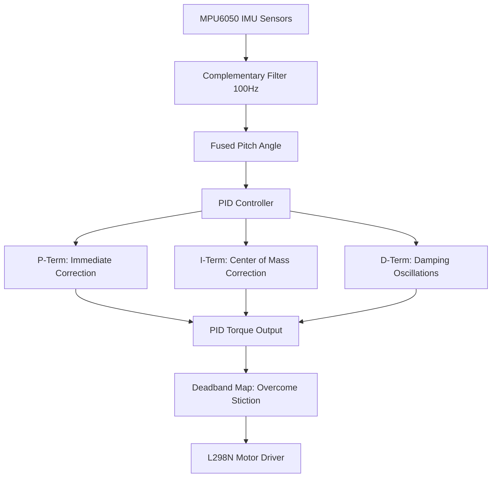

# Day 47: Self-Balancing Robot Controller (Stabilization Loop)

Welcome to Day 47 of the 100-Day Arduino Masterclass! Today, we combine all the advanced systems we have built so far—**direct I2C register communication**, **Complementary Filter sensor fusion**, and **closed-loop feedback systems**—to create the core control software for a **Two-Wheeled Self-Balancing Robot**. 

---

## 🎯 The "Why" and "What"

A self-balancing robot is a classic mechatronics demonstration of an **inverted pendulum**. 
* **The Problem:** Inverted pendulums are inherently unstable. Gravity acts as a positive feedback force: if the robot tilts forward by even a fraction of a degree, gravity pulls it further down, causing it to fall.
* **The Solution:** We must drive the wheels in the direction of the fall to keep the wheels directly underneath the robot's center of mass.
  1. We read the MPU6050 IMU to measure the tilt angle (Pitch) at a high-speed **100 Hz** rate.
  2. We apply a **PID (Proportional-Integral-Derivative) controller** to calculate the restoring motor torque needed.
  3. We drive the H-Bridge motors to active positions, correcting the center of gravity dynamically.

---

## 🔬 Physics & Mathematics

### 1. Inverted Pendulum Dynamics
The robot is modeled as a mass ($m$) on a stick of length ($L$) rotating about the wheel axis. The torque due to gravity pulling the robot down is:
$$\tau_{\text{gravity}} = m \cdot g \cdot L \cdot \sin(\theta)$$

To prevent the robot from falling, the wheels must accelerate, creating a counteracting inertial torque:
$$\tau_{\text{inertial}} = m \cdot a \cdot L \cdot \cos(\theta)$$

To balance, we must dynamically adjust the acceleration ($a$) of the wheels via motor voltage such that $\tau_{\text{inertial}} \approx \tau_{\text{gravity}}$.



---

### 2. The PID Control Terms
The PID loop runs every $10\,\text{ms}$ ($dt = 0.01\,\text{s}$).

1. **Proportional ($K_p \cdot e$):** Creates a restoring torque proportional to the angle offset. If the robot leans forward, it drives forward.
2. **Integral ($K_i \cdot \int e \, dt$):** Corrects for physical asymmetries in the robot (e.g. if the battery makes one side heavier or the structural center of gravity is not perfectly aligned with the sensor). It ramps up voltage to force the robot to upright center. To prevent **integral windup** (where the robot over-corrects after falling), the error sum is constrained:
   $$\text{errorSum} = \text{constrain}(\text{errorSum}, -150, 150)$$
3. **Derivative ($K_d \cdot \frac{de}{dt}$):** Predicts future behavior by measuring the speed of the tilt. It dampens the restoring force when the robot is moving back towards vertical, preventing overshoot.

---

### 3. Motor Deadband Compensation
Small DC motors cannot spin below a certain voltage threshold due to static friction (stiction). If the PID output is small (e.g., $10$ out of $255$), the motors hum but do not spin, causing the robot to fall.
We implement **Deadband Mapping** to shift the PID outputs above the minimum physical motor threshold ($MIN\_MOTOR\_PWM$):
$$\text{Output PWM} = \text{map}(\text{PID Output}, \; 0, \; 255, \; MIN\_MOTOR\_PWM, \; 255)$$

This ensures that any non-zero control effort immediately translates to wheel movement.

---

## 🔄 Control Strategy Comparison

| Control Method | Implementation Complexity | Stabilization Quality | Robustness to Disturbance | Sensor Requirements |
| :--- | :--- | :--- | :--- | :--- |
| **PID Control (Our choice)** | **Medium (Self-written algorithms)** | **High (With correct tuning)** | **Medium** | **IMU (6-Axis)** |
| **PD Control** | Low (No integral term) | Medium (Prone to static leaning) | Low | IMU (6-Axis) |
| **State-Space (LQR)** | High (Requires physical system matrices) | Extremely High | High | IMU + Wheel Encoders |
| **Neural Network / RL** | Very High (Edge computing required) | High | Medium to High | IMU + Encoders + Camera |

---

## 🛠️ Components Needed

* 1x Arduino Uno
* 1x Self-Balancing Robot Chassis (vertical frame, 2 DC motors, brackets)
* 1x L298N Dual H-Bridge Motor Driver Module
* 1x MPU6050 6-Axis IMU Module
* 1x High-discharge Battery Pack (e.g. 2S 7.4V LiPo battery for high torque responsiveness)
* 1x Breadboard & Jumper wires

---

## 🔌 Pin-to-Pin Wiring

### 1. MPU6050 IMU to Arduino Uno
| MPU6050 Pin | Arduino Pin | Wire Color | Description |
| :--- | :--- | :--- | :--- |
| **VCC** | **5V** | Red | Logic power |
| **GND** | **GND** | Black | Shared ground |
| **SDA** | **A4** | Blue | I2C Data line |
| **SCL** | **A5** | Yellow | I2C Clock line |

### 2. L298N Driver to Arduino Uno & Power
| L298N Driver Pin | Arduino Pin / Battery | Description |
| :--- | :--- | :--- |
| **ENA** | **D5** (PWM) | Left Motor Speed |
| **IN1 / IN2** | **D4 / D3** | Left Motor Direction |
| **ENB** | **D6** (PWM) | Right Motor Speed |
| **IN3 / IN4** | **D7 / D8** | Right Motor Direction |
| **12V / VMS** | **Battery positive (+)** | High-voltage motor power |
| **GND** | **GND (Arduino & Battery -)** | Shared logic/power Ground |

---

## 💻 How to Tune & Validate

Tuning a self-balancing robot requires patience. Follow this structured process:

1. **Hardware Assembly**:
   * Mount the MPU6050 IMU as close as possible to the axis of wheel rotation. Ensure it is fixed firmly (vibrations will corrupt the sensor readings).
   * Ensure your battery is securely fastened so it does not shift during acceleration.

2. **Calibrate Gyroscope**:
   * Hold the robot completely still and upright.
   * Upload [Day_47_Self_Balancing_Robot.ino](file:///d:/Downloads/100%20days%20of%20Arduino/Day_47_Self_Balancing_Robot/Day_47_Self_Balancing_Robot.ino).
   * The onboard Pin 13 LED will light up during the 2-second gyroscope bias calibration.

3. **Step-by-Step PID Tuning**:
   * Set $K_i = 0$ and $K_d = 0$ in the code.
   * **Tune $K_p$**: Hold the robot vertically and release it. Increase $Kp$ until the robot starts oscillating back and forth rapidly (trying to stand up but overshooting).
   * **Tune $K_d$**: Increase $Kd$ to dampen the oscillations. You will see the robot start to stand up, moving smoothly. Adjust $Kd$ until the oscillations are mostly eliminated.
   * **Tune $K_i$**: If the robot balances but slowly drifts in one direction, or leans at an angle, increase $Ki$. The integral term will accumulate the static lean error and drive the wheels to pull the robot directly upright.
   * **Find Target Pitch**: If the robot stands up but steadily drives forward/backward, adjust `targetPitch` in small steps (e.g. from `-1.2` to `-1.5` or `-0.9`) to find the exact mechanical center of gravity.

4. **Verify Safety Fail-Safe**:
   * Pick up the robot or let it fall.
   * As soon as the angle exceeds $\pm 40^\circ$, the motors should stop spinning instantly. This prevents runaway wheels from damaging the robot or environment.

---

## 🛠️ Troubleshooting Guide

### Common Issues
* **The robot falls forward, and the motors spin backward at full speed**:
  * The motor directions are reversed. Swap the IN1 and IN2 pins (or IN3 and IN4 pins) on the motor driver, or invert the motor outputs in your `driveMotors` function.
* **The motors hum but do not spin when the tilt angle is small**:
  * Increase `MIN_MOTOR_PWM` in the code. Geared DC motors need a higher initial PWM threshold to break static friction under load.
* **The robot is twitching or vibrating violently**:
  * Reduce $K_p$ or $K_d$. Check if the IMU is loose. If the IMU is vibrating independently of the chassis, it creates a feedback resonance loop that causes violent motor jitter.

## 🧠 Code Explanation

Let's break down how we keep an inverted pendulum from falling over:

### 1. PID Angle Correction
```cpp
double error = fusedPitch - targetPitch;
double pTerm = Kp * error;
errorSum += error * dt;
double iTerm = Ki * errorSum;
double dTerm = Kd * ((error - lastError) / dt);
double pidOutput = pTerm + iTerm + dTerm;
```
- Our Complementary Filter (Day 42) gives us a lightning-fast `fusedPitch` angle.
- We feed this into a PID controller. If the robot falls forward (positive error), the PID output becomes a large positive number.
- We map this output directly to Motor PWM, causing the wheels to drive forward underneath the falling chassis, catching the center of gravity!

### 2. The Motor Deadband
```cpp
motorPWM = map(motorPWM, 0, 255, MIN_MOTOR_PWM, 255);
```
- DC motors have static friction. If you give a motor a PWM of 20, it just whines and doesn't move. It might need a minimum PWM of 45 just to start spinning.
- If we don't account for this, the PID will output tiny corrections (e.g., PWM 15) when the robot is nearly perfectly balanced, but the motors won't move! The robot will fall over before the PID ramps up high enough to overcome friction.
- We use `map()` to instantly bump any output greater than 0 up past the friction threshold (`MIN_MOTOR_PWM`), making the robot incredibly responsive to micro-balance adjustments!
