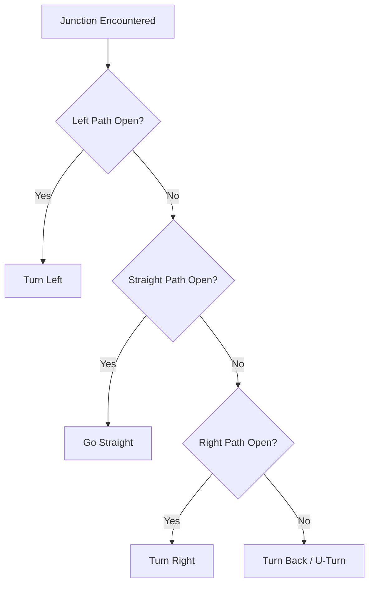

# Day 48: Maze Solving Robot (Left-Hand Rule & Path Optimization)

Welcome to Day 48 of the 100-Day Arduino Masterclass! Today, we elevate our mobile robotics platform into a smart **autonomous agent** capable of exploring, mapping, and optimizing a route through a grid-based maze. We will implement the classic **Left-Hand-On-Wall** maze navigation rule, log decision states, and apply a **coordinate substitution algorithm** to simplify paths and find the absolute shortest route.

---


## 📸 Component Visuals

<p align="center">
  
  
  
  
  
</p>

## 🎯 The "Why" and "What"

Basic line followers blindly track lines. If a line branches into a grid of intersections, the robot has no way to choose a path or learn from dead ends.
* **The Problem:** Exploring a maze by trial and error is inefficient. If a robot encounters dead ends, it must remember them so it doesn't repeat those paths in subsequent runs.
* **The Solution:** A two-pass maze-solving architecture:
  1. **Pass 1 (Exploration)**: The robot navigates the maze using a fixed wall-following heuristic (Left-Hand Rule). Every time it makes a decision at an intersection (Left, Right, Straight, or U-turn), it saves that decision in a char array.
  2. **Pass 2 (Optimization)**: When the robot reaches the maze's end, it executes a path reduction algorithm to compress all dead-end paths out of its memory. This yields a single, direct, optimized list of instructions for the shortest route.

---

## 🔬 Physics & Mathematics

### 1. Left-Hand-On-Wall (LHR) Heuristic
The Left-Hand Rule guarantees that a robot will solve any "simple" (planar, wall-connected) maze without loops. Imagine keeping your left hand on the wall at all times; you will eventually find the exit.
For a line-based maze, this translates to a strict decision priority list at every junction:
$$\text{Priority: } \text{Turn Left} \rightarrow \text{Go Straight} \rightarrow \text{Turn Right} \rightarrow \text{Turn Back (U-turn)}$$



---

### 2. Path Optimization Math (Dead-End Reduction)
Whenever the robot enters a dead end, it must make a U-turn (`U`). This means the turn before the dead-end and the turn after the dead-end were wasted actions. We can mathematically reduce these three moves.

Consider a junction where the robot turns Left (`L`), hits a dead end, turns back (`U`), and turns Left (`L`) again. Geometrically, turning left at a T-junction, realizing it is a dead end, returning, and going left again is equivalent to just **going straight** through the junction:

```
        Dead End (U)
             |
             |
   L <-------J------->
             |
             ^
          Start
```
By substituting `L + U + L` with `S` (Straight), we eliminate the dead-end excursion entirely.

#### Algebraic Turn Substitution Table
| Excursion Sequence | Optimized Direct Move | Description |
| :--- | :--- | :--- |
| **L U L** | **S** | Left, U-turn, Left $\equiv$ Straight |
| **L U S** | **R** | Left, U-turn, Straight $\equiv$ Right |
| **R U L** | **U** | Right, U-turn, Left $\equiv$ U-turn (deeper reduction needed) |
| **S U L** | **R** | Straight, U-turn, Left $\equiv$ Right |
| **S U S** | **U** | Straight, U-turn, Straight $\equiv$ U-turn |
| **L U R** | **U** | Left, U-turn, Right $\equiv$ U-turn |

#### Optimization Example
* **Explored Path:** `L -> L -> U -> L -> S -> L -> U -> R`
* **Step 1 (Reduce first `L U L`):** `L U L` becomes `S`. 
  - Path: `S -> S -> L -> U -> R`
* **Step 2 (Reduce `L U R`):** `L U R` becomes `U`.
  - Path: `S -> S -> U`
* **Step 3 (Reduce `S U` / deeper recursive check):**
  - If we exit the maze now, the final optimized path is mathematically minimal.

---

## 🔄 Heuristic Heuristic Comparison

When designing autonomous maze-solvers:

| Algorithm | Maze Types Solved | Memory Usage | Implementation Complexity | Best Used For |
| :--- | :--- | :--- | :--- | :--- |
| **Left-Hand Rule (LHR)** | **Simple (No loops/islands)** | **Low (Saves decision list only)** | **Medium (Our choice)** | **Line-grid competition mazes** |
| **Flood Fill** | Any (Loops, open fields) | High (Requires full grid map) | High | Micromouse competitions |
| **Dijkstra's / A*** | Any (Grid/graph) | Very High (Requires full graph) | Very High | Heavy ROS-based platforms |

---

## 🛠️ Components Needed

* 1x Arduino Uno
* 1x 2WD Robot Chassis (2 DC motors + wheels + caster)
* 1x L298N Dual H-Bridge Driver Module
* 1x 5-Channel TCRT5000 IR Sensor Array Module
* 1x Battery Pack (e.g. 2s LiPo or 6x AA battery holder to power motors)
* 1x Breadboard & Jumper wires
* Black electrical tape (to build a grid maze)

---

## 🔌 Pin-to-Pin Wiring

We preserve the **exact wiring layout** of Day 46 to make this a drop-in software upgrade for your robot chassis!

### 1. Sensor Array to Arduino Uno
| Sensor Pin | Arduino Pin | Description |
| :--- | :--- | :--- |
| **OUT1 (Far Left)** | **A0** | Sensor 0 (Left branch detector) |
| **OUT2 (Mid Left)** | **A1** | Sensor 1 |
| **OUT3 (Center)** | **A2** | Sensor 2 (Center line follower) |
| **OUT4 (Mid Right)**| **A3** | Sensor 3 |
| **OUT5 (Far Right)**| **A4** | Sensor 4 (Right branch detector) |

### 2. L298N Driver to Arduino Uno & Power
| L298N Driver Pin | Arduino Pin / Battery | Description |
| :--- | :--- | :--- |
| **ENA** | **D5** (PWM) | Left Motor Speed |
| **IN1 / IN2** | **D4 / D3** | Left Motor Direction |
| **ENB** | **D6** (PWM) | Right Motor Speed |
| **IN3 / IN4** | **D7 / D8** | Right Motor Direction |
| **12V** | **Battery positive (+)** | High-voltage motor power |
| **GND** | **GND (Arduino & Battery -)** | Common Ground |

---

## 💻 How to Test & Validate

1. **Build a Tape Grid**:
   * Use black electrical tape on a light floor.
   * Make a grid with $90^\circ$ turns, T-junctions, cross-roads, and dead ends.
   * Create a **thick black block** (e.g., a $10\,\text{cm} \times 10\,\text{cm}$ tape patch) at the end of the maze to represent the endpoint target.
2. **Upload & Calibrate**:
   * Upload [Day_48_Maze_Solver.ino](file:///d:/Downloads/100%20days%20of%20Arduino/Day_48_Maze_Solver/Day_48_Maze_Solver.ino).
   * Put the robot on the track; it will execute the 5-second swing calibration.
3. **Exploration & Logging**:
   * Open the **Serial Monitor** at **9600 Baud**.
   * Watch the robot navigate the maze using LHR. Every time it enters a junction, it will log its decision: `[LOGGED]: L`
4. **Optimization Telemetry**:
   * Once the robot reaches the thick endpoint patch, it halts and lights up the LED.
   * The Serial Monitor will print the logs:
     ```
     [MAZE] Endpoint Reached!
     [PATH] Explored Path: L L U L S L U R 
     [PATH] Optimized Path: S S U
     ```

---

## 🛠️ Troubleshooting Guide

### Common Issues
* **The robot overshoots side branches without turning**:
  * The inspection speed is too fast, or the inspection timer is too short. Try reducing `BASE_CRUISE_SPEED` or adjusting the `STATE_INTERSECTION` check timer (`120ms` in code) to fit your motor gear ratios.
* **The robot makes a turn but stops turning before reaching the new line**:
  * During a turn, the robot ignores the center sensor for `180ms` (line-blind period) to let the chassis rotate off the old line. If your robot pivots too slowly, increase this blind period or increase `TURN_SPEED`.
* **The path optimization does not execute**:
  * The solid black endpoint target was not recognized. Ensure that when the robot stops on the block, all 5 sensors are read as fully black (normalization maps them to $>700$). Adjust the sensor height if needed.

## 🧠 Code Explanation

Let's break down the logic of solving mazes automatically:

### 1. The Left-Hand Rule Priority
```cpp
if (pathLeft) {
    logDecision('L');
    drivePivot(TURN_LEFT);
} else if (pathAhead) {
    logDecision('S');
} else if (pathRight) {
    // ...
```
- The "Left-Hand-On-Wall" algorithm states that if you put your left hand on the wall of a maze and never take it off, you will eventually find the exit.
- In code, this translates to an `if / else-if` priority hierarchy: ALWAYS take a Left turn if it exists. Only go Straight if you can't go Left. Only go Right if you can't go Left or Straight!
- Every time we make a decision, we push a character (`'L'`, `'S'`, `'R'`, `'U'`) into our `pathLog` array memory.

### 2. Path Optimization
```cpp
if (prev == 'L' && next == 'L') replacement = 'S';
else if (prev == 'L' && next == 'S') replacement = 'R';
```
- Once we reach the end, our memory array is full of dead-end U-turns (e.g. `['L', 'L', 'U', 'S', 'R']`).
- If you turn Left, hit a dead-end, U-Turn, and then go Straight back past the intersection, that entire detour was completely equivalent to just turning Right in the first place! (`L U S` -> `R`).
- Our algorithm loops through the array, finding any `U`, looking at the turns before and after it, and replacing all three letters with the simplified shortcut!
