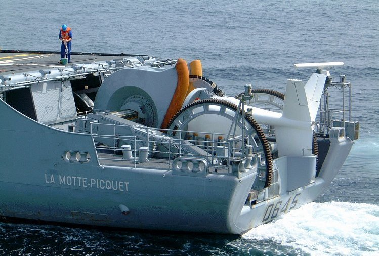

# Day 56: Ultrasonic 2D Spatial Positioning Scanner

Welcome to Day 56 of the 100-Day Arduino Masterclass! Today, we dive into **local spatial navigation** and **triangulation geometry** by building a **2D Spatial Positioning Scanner** using two **HC-SR04 Ultrasonic Sensors**. By resolving analytical intersection equations, we will calculate the exact coordinate position $(x, y)$ of an object in a 2D plane in real-time, completely from scratch.

---


## 📸 Component Visuals

<p align="center">
  
  
  
  
  
</p>

## 🎯 The "Why" and "What"

Single distance sensors only tell you how far away an object is along a straight line of sight.
* **The Problem:** A single sensor does not provide angular information. You cannot know if the object is directly in front, to the left, or to the right. 
* **The Solution:** We mount two ultrasonic sensors along a fixed baseline distance ($d$). Both sensors measure their respective distance ($r_1$ and $r_2$) to a single target. By treating the sensors as the centers of two intersecting circles, we solve the algebraic equations representing the intersection points. This allows the system to determine the exact coordinates $(x,y)$ of the object.

---

## 🔬 Physics & Mathematics

### 1. Sound Wave Propagation
The HC-SR04 transmits high-frequency sound pulses ($40\,\text{kHz}$) that travel through the air at the speed of sound ($v_{\text{sound}} \approx 343\,\text{m/s}$ or $0.0343\,\text{cm/\mu s}$ at room temperature). The distance ($r$) is calculated from the echo round-trip travel time ($t$):
$$r = \frac{t \cdot v_{\text{sound}}}{2}$$

---

### 2. 2D Trilateration Mathematics
We place the Left Sensor (Sensor 1) at origin coordinates $(0, 0)$ and the Right Sensor (Sensor 2) at coordinates $(d, 0)$, where $d$ is the baseline distance.
The target object lies at the intersection coordinate $(x, y)$.

```
                     Target (x, y)
                         *
                        / \
                   r1  /   \ r2
                      /     \
                     /       \
         (0,0) S1 +-----------+ S2 (d,0)
                  |<--- d --->|
```

This setup yields two circle equations:
1. $x^2 + y^2 = r_1^2$
2. $(x - d)^2 + y^2 = r_2^2$

To solve for $x$, we expand equation (2):
$$x^2 - 2xd + d^2 + y^2 = r_2^2$$

Substitute $x^2 + y^2 = r_1^2$ into the equation:
$$r_1^2 - 2xd + d^2 = r_2^2$$
$$2xd = d^2 + r_1^2 - r_2^2$$

$$x = \frac{d^2 + r_1^2 - r_2^2}{2d}$$

Now, substitute $x$ back into equation (1) to solve for $y$:
$$y = \sqrt{r_1^2 - x^2}$$
*(We assume $y \ge 0$, representing the space in front of the sensor bar).*

---

### 3. Radical Bounds Gate (NaN Protection)
In real-world tracking, sensor noise or reflections can report distances where the circles do not physically intersect (e.g. if the object is too close to the baseline such that $r_1 + r_2 < d$, or if $r_1^2 - x^2 < 0$).
If we pass a negative number to the square root function `sqrt()`, the processor crashes the calculation and outputs `NaN` (Not a Number).
We implement a **Radical Bounds Gate** to check the radicand before computing:
```cpp
float yRadicand = r1Sq - (x * x);
if (yRadicand >= 0.0) {
  // Safe to calculate sqrt
}
```

---

### 4. Cross-Talk Prevention (Sequential Timings)
If both HC-SR04 sensors are triggered simultaneously, the ultrasonic pulse from Sensor 1 can reflect off the target and trigger the Echo pin of Sensor 2, causing massive distance errors.
We prevent this by triggering the sensors **sequentially**, inserting a **$30\,\text{ms}$ guard delay** between readings to allow residual sound echoes to fully decay before triggering the next sensor.

---

## 🔄 Tracking Technologies Comparison

| Navigation Sensor | Tracking Dimensions | Precision | Max Range | System Cost |
| :--- | :--- | :--- | :--- | :--- |
| **Dual Ultrasonic Scanner** | **2D Plane $(x,y)$** | **$\approx 1\,\text{cm}$** | **$\approx 2.5\,\text{m}$ (Our choice)** | **Very Low** |
| **LiDAR Sweep Scanner** | 2D Map (Degrees & Range) | $\approx 2\,\text{mm}$ | $\approx 10\,\text{m} - 40\,\text{m}$ | High |
| **Stereo Camera (Visual)** | 3D Space $(x,y,z)$ | Sub-millimeter | Depends on optics | Very High (Requires PC) |
| **Single Sonar** | 1D Vector (Range only) | $\approx 3\,\text{mm}$ | $\approx 4\,\text{m}$ | Very Low |

---

## 🛠️ Components Needed

* 1x Arduino Uno
* 2x HC-SR04 Ultrasonic Sensor Modules
* 1x Breadboard & Jumper wires
* 1x Rigid mounting bracket (e.g., a strip of cardboard, wood, or plastic to keep the sensors exactly $25\,\text{cm}$ apart).

---

## 🔌 Pin-to-Pin Wiring

Ensure the sensors are wired to separate digital pins to enable sequential control.

```
       S1 (Left Origin)                 S2 (Right Baseline)
         +----------+                      +----------+
         | HC-SR04  |                      | HC-SR04  |
         +----------+                      +----------+
          |  |  |  |                        |  |  |  |
         VCC T  E GND                      VCC T  E GND
          |  |  |  |                        |  |  |  |
 Arduino 5V D2 D3 GND              Arduino 5V D4 D5 GND
```

### Wiring Table
| Sensor Pin | Arduino Pin | Wire Color | Description |
| :--- | :--- | :--- | :--- |
| **S1 Trig** | **D2** | Blue | Left sensor trigger pulse |
| **S1 Echo** | **D3** | Green | Left sensor pulse return |
| **S2 Trig** | **D4** | Yellow | Right sensor trigger pulse |
| **S2 Echo** | **D5** | Orange | Right sensor pulse return |
| **VCC (S1 & S2)**| **5V** | Red | Power rails |
| **GND (S1 & S2)**| **GND** | Black | Shared Ground |

---

## 💻 How to Test & Validate

1. **Mount the Sensors**:
   * Align both sensors parallel to each other on a flat baseline strip.
   * Measure the distance from the center of Sensor 1's lens to the center of Sensor 2's lens. Update `BASELINE_D` in [Day_56_Spatial_Positioner.ino](file:///d:/Downloads/100%20days%20of%20Arduino/Day_56_Spatial_Positioner/Day_56_Spatial_Positioner.ino) if it differs from $25.0\,\text{cm}$.
2. **Observe Telemetry Output**:
   * Upload the code and open the **Serial Monitor** at **9600 Baud**.
   * Place an object (like a flat piece of cardboard) directly in front of the sensors.
   * The terminal will output the raw distances and computed coordinates:
     `R1_Dist:30.0,R2_Dist:30.0,Coord_X:12.50,Coord_Y:27.27`
     *(Since the baseline is $25\,\text{cm}$, the center line is $X = 12.5\,\text{cm}$).*
3. **Trace Coordinates**:
   * Move the target object to the **Left** (closer to S1). $Coord\_X$ should decrease towards $0.0$.
   * Move the target object to the **Right** (closer to S2). $Coord\_X$ should increase towards $25.0$.
   * Move the target **closer** or **further**. $Coord\_Y$ should change accordingly.

---

## 🛠️ Troubleshooting Guide

### Common Issues
* **The serial monitor prints "Lock lost" continuously**:
  * The target is outside the sensors' field of view ($15^\circ$ cone) or too far away ($>2\,\text{meters}$).
  * Verify your Trig and Echo pins are not swapped for either sensor.
* **The coordinates jump erratically even when the target is stationary**:
  * Sound wave reflection noise. Ensure the target has a flat surface facing the sensors. Hard, angled surfaces can bounce the sound pulses away from the receivers, causing timeout failures.
  * Reduce the scanning frequency by increasing `scanIntervalMs` if testing in a small room with hard walls (sound reflections bounce off walls and trigger false echo signals).
* **The serial monitor outputs "WARNING: Intersection error"**:
  * The target is too close to the sensors, or the sensors are misaligned. If the calculated coordinates exceed physical bounds, `yRadicand` becomes negative. Ensure your sensors are aimed parallel to each other.

## 🧠 Code Explanation

Let's break down the math behind 2D Ultrasonic Trilateration:

### 1. Sequential Gating to Prevent Cross-Talk
```cpp
float r1 = readDistance(S1_TRIG_PIN, S1_ECHO_PIN);
delay(30); 
float r2 = readDistance(S2_TRIG_PIN, S2_ECHO_PIN);
```
- If we trigger both sonars at the same time, the acoustic pings will collide in the air. Sensor 1 might hear Sensor 2's echo, resulting in completely corrupted coordinate data!
- We enforce a strict 30-millisecond delay between reads. Since sound travels 10 meters in 30ms, this ensures all bouncing echoes from the first ping have faded away before we fire the second.

### 2. Trilateration Geometry
```cpp
float x = (dSq + r1Sq - r2Sq) / (2.0 * BASELINE_D);
float y = sqrt(r1Sq - (x * x));
```
- We treat the two sensors as the centers of two intersecting circles. The radius of Circle 1 is `r1` and the radius of Circle 2 is `r2`.
- By placing Sensor 1 at coordinate `(0,0)` and Sensor 2 at coordinate `(d, 0)`, we can use algebra to find the exact intersection point `(x, y)` of the two circles.
- This gives us the absolute Cartesian coordinates of the target object relative to our sensor baseline!
