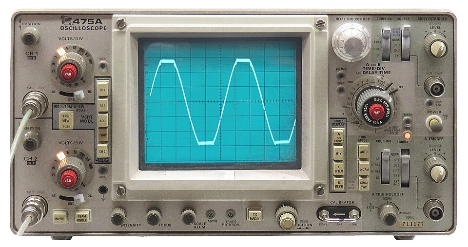

# Day 60: OLED Oscilloscope (Real-Time Waveform on SSD1306 128×64)

Welcome to Day 60! Today we turn our Arduino and a tiny OLED display into a **real-time oscilloscope**. We read the analog input on A0, build a 128-column pixel framebuffer in RAM, and render a live scrolling waveform on the SSD1306 128×64 OLED — completely without external display libraries, by writing directly to the SSD1306 I2C registers.

---


## 📸 Component Visuals

<p align="center">
  
  
  
  
  
  
</p>

## 🎯 The "Why" and "What"

* **No library needed:** Understanding the SSD1306 register interface teaches you how every display driver works under the hood.
* **Practical tool:** You can now debug sensor signals, audio waveforms, PWM outputs, and any analog signal up to ~1 kHz with just an Arduino and an $3 OLED.
* **Framebuffer technique:** Building a local RAM framebuffer before pushing to the display is the standard technique used in embedded graphics from microcontrollers to game consoles.

---

## 🔬 Physics & Mathematics

### 1. SSD1306 Page Addressing Architecture
The 128×64 display is divided into **8 horizontal pages**, each **8 pixels tall**:
```
Page 0: rows 0–7  (top)
Page 1: rows 8–15
...
Page 7: rows 56–63 (bottom)
```

Each page row is 128 bytes wide. Each **byte controls 8 vertical pixels** (bit 0 = top pixel of the page, bit 7 = bottom pixel of the page).

To light pixel at `(x=10, y=19)`:
```
page = 19 / 8 = 2
bit  = 19 % 8 = 3
framebuffer[10][2] |= (1 << 3)
```

### 2. Amplitude Mapping (ADC → Pixel Y)
The 10-bit ADC gives values from 0 (0V) to 1023 (5V). We map this to the 48 waveform rows:
$$y_{pixel} = (WAVE\_ROWS - 1) - \left\lfloor \frac{ADC_{value} \times (WAVE\_ROWS - 1)}{1023} \right\rfloor$$

* $ADC = 0\,\text{(0V)}$ → pixel row **47** (bottom)
* $ADC = 1023\,\text{(5V)}$ → pixel row **0** (top)
* $ADC = 512\,\text{(2.5V)}$ → pixel row **24** (middle)

### 3. Time Base (Horizontal Axis)
Each column represents one ADC sample. With a `sampleDelayUs` delay between samples:
$$T_{frame} = 128 \times \text{sampleDelayUs} \;\mu\text{s}$$
$$f_{sample} = \frac{10^6}{\text{sampleDelayUs}} \;\text{Hz}$$

| `sampleDelayUs` | Sample Rate | Max Displayable Freq (Nyquist / 2) |
| :--- | :--- | :--- |
| 500 µs | 2 kHz | ~1 kHz |
| 100 µs | 10 kHz | ~5 kHz |
| 50 µs | 20 kHz | ~10 kHz |
| 10 µs | 100 kHz | ~50 kHz (limited by ADC settling time) |

### 4. Rising Edge Trigger
Before each frame, we wait for the signal to cross the `TRIGGER_LEVEL` threshold (default: 512 = 2.5V) on a **rising edge**. This synchronizes the waveform to a consistent starting phase and prevents it from "scrolling" horizontally:

```
1. Wait for ADC to go below trigger
2. Wait for ADC to go above trigger  ← Rising edge detected
3. Start sampling 128 columns        ← Stable display frame
```

---

## 🔩 Components Needed

| Component | Quantity | Purpose |
| :--- | :--- | :--- |
| Arduino Uno | 1 | Controller + ADC |
| SSD1306 I2C OLED (128×64) | 1 | Display |
| Signal source (potentiometer, audio, sensor) | 1 | A0 input |
| 4.7 kΩ Resistors | 2 | I2C pull-ups (if not on breakout board) |

### SSD1306 Alternatives

| Display | Interface | Resolution | Notes |
| :--- | :--- | :--- | :--- |
| **SSD1306 0.96" OLED** | I2C | 128×64 | Our choice, abundant |
| SH1106 1.3" OLED | I2C | 128×64 | Compatible with small register changes |
| SSD1351 1.5" OLED | SPI | 128×128 | 16-bit color, faster |
| ILI9341 TFT | SPI | 320×240 | Much faster, more complex |

---

## 🔌 Pin-to-Pin Wiring

| SSD1306 Pin | Arduino Pin | Description |
| :--- | :--- | :--- |
| **VCC** | **3.3V** | Power (some modules support 5V) |
| **GND** | **GND** | Ground |
| **SDA** | **A4** | I2C Data |
| **SCL** | **A5** | I2C Clock |

| Signal Source | Arduino Pin | Description |
| :--- | :--- | :--- |
| **Pot Wiper / Audio / Sensor OUT** | **A0** | Analog signal input |

---

## 💻 How to Test & Validate

1. Upload [Day_60_OLED_Oscilloscope.ino](file:///d:/Downloads/100%20days%20of%20Arduino/Day_60_OLED_Oscilloscope/Day_60_OLED_Oscilloscope.ino).
2. Connect a potentiometer wiper to A0. Rotate it slowly — observe the waveform rise and fall on the OLED.
3. Connect an audio line output (with a voltage divider to clamp to 0–5V) to A0. You should see audio waveforms live.
4. Reduce `sampleDelayUs` from 500 to 100 to observe higher-frequency signals.
5. Toggle `TRIGGER_ENABLE = false` to see the waveform scroll vs. stable with trigger.

---

## 🛠️ Troubleshooting Guide

| Symptom | Likely Cause | Fix |
| :--- | :--- | :--- |
| Blank display | I2C address wrong | Change `OLED_ADDR` to `0x3D` |
| Display garbled / flickering | I2C too fast | Remove `Wire.setClock(400000)` line (reverts to 100kHz) |
| Waveform scrolls horizontally | No trigger lock | Ensure `TRIGGER_ENABLE = true` |
| Signal too small / flat | ADC input too close to 2.5V ground | Add DC bias or adjust signal amplitude |
| Only top portion of display used | `WAVE_ROWS` constant mismatch | Ensure `WAVE_ROWS = 48` and ADC mapping is `(WAVE_ROWS - 1)` |

## 🧠 Code Explanation

Let's break down how we built a real-time OLED Oscilloscope:

### 1. Mapping ADC Amplitude to Pixel Rows
```cpp
uint8_t pixelY = WAVE_ROWS - 1 - (uint8_t)((uint32_t)samples[col] * (WAVE_ROWS - 1) / 1023);
setPixel(col, pixelY);
```
- Our ADC reads analog voltage as a number between 0 and 1023.
- Our OLED screen has 64 vertical pixels, but we reserve the bottom 16 for text, giving us 48 pixels (`WAVE_ROWS`) for the waveform.
- We scale the 0-1023 reading down to 0-47. 
- Because pixel `Y=0` is at the *top* of the screen, we subtract our value from `47` to invert it, ensuring that 5V (1023) plots at the top, and 0V (0) plots at the bottom!

### 2. High-Speed I2C Framebuffer Flushing
```cpp
Wire.write(0x40); // Data continuation byte
for (uint8_t col = 0; col < SCREEN_W; col++) {
    Wire.write(framebuffer[col][page]);
}
```
- We don't use slow commands like `display.drawPixel()`. We maintain a 1024-byte `framebuffer` array in the Arduino's RAM.
- We draw our entire waveform into this invisible RAM array first.
- Once complete, we use a rapid I2C loop to dump the entire array sequentially to the OLED's Graphics RAM in one giant blast. This allows us to achieve incredibly high frame rates required for a responsive oscilloscope!
