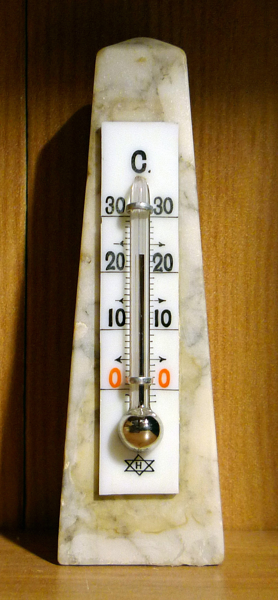

# Day 63: DS18B20 1-Wire Temperature Sensor (1-Wire Protocol from Scratch)

Welcome to Day 63! Today we implement the complete **Dallas/Maxim 1-Wire protocol** in pure software — no library, just direct bit-banging with microsecond-precision timing. The DS18B20 is a digital temperature sensor that communicates over a **single data wire** (plus ground), giving us a 12-bit temperature reading accurate to ±0.5°C, complete with **CRC-8 checksum** verification to detect any data corruption.

---


## 📸 Component Visuals

<p align="center">
  
  
  
  
</p>

## 🎯 The "Why" and "What"

* **1-Wire Protocol** was invented by Dallas Semiconductor (now Maxim/Analog Devices) to allow multiple sensors to share a single wire — every DS18B20 has a unique 64-bit ROM address burned at the factory.
* Unlike I2C (needs 2 wires + pull-ups) or SPI (needs 4 wires), 1-Wire needs only **1 data wire** — useful for long-distance temperature sensing in buildings or pipelines.
* The sensor delivers a **digital result** — no ADC calibration drift, no reference voltage errors, no op-amp needed.

---

## 🔬 Physics & Mathematics

### 1. Temperature Conversion (Scratchpad Register)
The DS18B20 converts temperature to a **12-bit signed integer** stored in two scratchpad bytes:
$$T_{°C} = \frac{raw_{signed16}}{16}$$

| Bit weight | Bit 3 | Bit 2 | Bit 1 | Bit 0 | Bit -1 | Bit -2 | Bit -3 | Bit -4 |
| :--- | :--- | :--- | :--- | :--- | :--- | :--- | :--- | :--- |
| Value | 8 | 4 | 2 | 1 | 0.5 | 0.25 | 0.125 | **0.0625** |

Resolution = **0.0625°C per LSB** (1/16).

**Example:** Raw = `0x00D0` = 208 decimal → 208 / 16 = **13.0°C**  
**Example:** Raw = `0xFF5E` = -162 signed → -162 / 16 = **-10.125°C**

### 2. 1-Wire Protocol Timing (Standard Speed)

| Operation | Description | Timing |
| :--- | :--- | :--- |
| **Reset Pulse** | Master pulls LOW | ≥ 480 µs |
| **Presence Pulse** | DS18B20 pulls LOW | 60–240 µs after reset released |
| **Write 1** | Pull LOW < 15 µs, release | Total slot ≥ 60 µs |
| **Write 0** | Pull LOW ≥ 60 µs | Total slot ≥ 60 µs |
| **Read** | Pull LOW 1–15 µs, sample within 15 µs | Total slot ≥ 60 µs |

All bits are sent and received **LSB first**.

### 3. Command Sequence
```
RESET → Presence detected?
  → Write 0xCC (Skip ROM — address all devices)
  → Write 0x44 (Convert T — start 12-bit ADC conversion)
  → Wait 750 ms (12-bit conversion time)
RESET
  → Write 0xCC (Skip ROM)
  → Write 0xBE (Read Scratchpad — 9 bytes)
  → Read 9 bytes: [TempLSB][TempMSB][TH][TL][Config][Reserved x3][CRC]
  → Verify CRC
  → Parse temperature
```

### 4. CRC-8 (Dallas/Maxim — Polynomial `0x31`)
The last byte of the 9-byte scratchpad is a CRC-8 over the first 8 bytes:
$$G(x) = x^8 + x^5 + x^4 + 1 \quad (\text{Polynomial } = 0x31)$$

If `crc8(scratchpad[0..7]) ≠ scratchpad[8]` → data was corrupted → discard reading.

---

## 🔩 Components Needed

| Component | Quantity | Purpose |
| :--- | :--- | :--- |
| Arduino Uno | 1 | Master controller |
| DS18B20 TO-92 (or waterproof probe) | 1+ | Temperature sensing |
| 4.7 kΩ Resistor | 1 | Pull-up on DQ line (mandatory) |
| Breadboard + Jumpers | 1 | Wiring |

### DS18B20 Alternatives

| Sensor | Interface | Range | Accuracy | Notes |
| :--- | :--- | :--- | :--- | :--- |
| **DS18B20** | 1-Wire | −55 to +125°C | ±0.5°C | Our choice, digital |
| DS18S20 | 1-Wire | Same | ±0.5°C | 9-bit only, legacy |
| DHT22 | Single-wire (own protocol) | −40 to 80°C | ±0.5°C | Humidity too |
| LM35 | Analog | −55 to 150°C | ±0.5°C | No protocol, needs ADC |
| MAX31855 | SPI | −200 to 1350°C | ±2°C | For thermocouples |

---

## 🔌 Pin-to-Pin Wiring

```
Arduino 5V ─── 4.7kΩ ─┬─── DS18B20 Pin 2 (DQ)
                       │
Arduino D2 ────────────┘
Arduino GND ────────────── DS18B20 Pin 1 (GND)
Arduino 5V  ────────────── DS18B20 Pin 3 (VDD)
```

> ⚠️ **The 4.7 kΩ pull-up resistor between DQ and 5V is MANDATORY.** Without it, the open-drain 1-Wire bus cannot communicate.

### DS18B20 Pinout (Flat Face Toward You)
```
Pin 1 (Left)  = GND
Pin 2 (Middle)= DQ (Data)
Pin 3 (Right) = VDD (3.0–5.5V)
```

### Parasitic Power Mode (2-wire)
Connect Pin 1 and Pin 3 both to GND. The DS18B20 draws power from the DQ line during HIGH periods. Requires a **strong pull-up** (MOSFET or 470Ω) during the 750ms conversion window — our code uses normal mode (3-wire, simpler).

---

## 💻 How to Test & Validate

1. Wire up per the diagram above. The 4.7kΩ pull-up is critical.
2. Upload [Day_63_DS18B20_1Wire.ino](file:///d:/Downloads/100%20days%20of%20Arduino/Day_63_DS18B20_1Wire/Day_63_DS18B20_1Wire.ino).
3. Open **Serial Monitor** at **9600 Baud**.
4. You should see temperature readings every second: `[Temp] 25.0625 °C  |  77.11 °F`
5. Pinch the sensor body between your fingers — temperature should rise by several degrees within 30 seconds.
6. Touch the sensor to an ice cube — temperature should drop toward 0°C.
7. If you see `[ERROR] No device found or CRC mismatch!` — check the pull-up resistor and wiring.

---

## 🛠️ Troubleshooting Guide

| Symptom | Likely Cause | Fix |
| :--- | :--- | :--- |
| `No device found` every reading | Missing pull-up resistor | Add 4.7kΩ between DQ and 5V |
| `CRC mismatch` occasionally | Long wire causing signal degradation | Shorten wire or add 100nF capacitor on DQ |
| Temperature stuck at 85°C | Sensor powers up but conversion never completes | Ensure DQ pull-up is strong enough; check 750ms delay |
| Temperature reads −127°C | Sensor not recognized | Check DS18B20 pinout (flat face forward: GND, DQ, VDD) |

## 🧠 Code Explanation

Let's break down how we bit-banged the Dallas 1-Wire Protocol:

### 1. Microsecond Timing Slots
```cpp
void ow_write_bit(uint8_t bit) {
  ow_low();
  if (bit) {
    delayMicroseconds(6);   // Short pull for '1'
    ow_release();
    delayMicroseconds(64);
  } else {
    delayMicroseconds(70);  // Long pull for '0'
    ow_release();
  }
}
```
- The DS18B20 only has one data wire. To communicate, both devices must agree on strict timing windows (Time Slots).
- A Time Slot is about 70 microseconds long. The Master (Arduino) starts every slot by pulling the line LOW.
- If we want to send a `1`, we quickly release the line after 6µs. The sensor looks at the line 15µs in, sees it is HIGH, and records a `1`.
- If we want to send a `0`, we hold the line LOW for the entire 70µs. The sensor looks at 15µs, sees it is LOW, and records a `0`.

### 2. CRC-8 Integrity Checking
```cpp
uint8_t mix = (crc ^ byte) & 0x01;
crc >>= 1;
if (mix) crc ^= 0x8C; // Reflected polynomial 0x31
```
- Because 1-Wire is susceptible to electrical noise over long cables, the DS18B20 computes a mathematical hash (Cyclic Redundancy Check) of its temperature data and sends it as the 9th byte.
- We run the exact same polynomial division algorithm (`x^8 + x^5 + x^4 + 1`) on the first 8 bytes we receive.
- If our calculated hash matches the 9th byte sent by the sensor, we are 100% mathematically certain that the temperature reading is flawless and uncorrupted!
