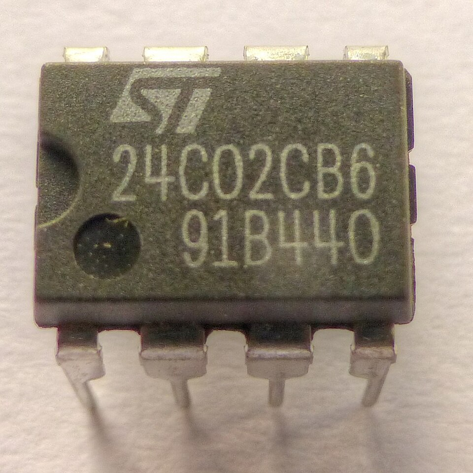

# Day 65: EEPROM Servo Motion Recorder & Playback (Non-Volatile Motion Capture)

Welcome to Day 65! Today we build a **servo motion recorder** that saves a sequence of servo positions to the Arduino's internal EEPROM and replays them on demand — even after powering off and back on. Move the servo manually with a potentiometer, hold the Record button, release, then press Play at any time (days later if you like) and the servo exactly reproduces your motion. This is the fundamental concept behind **teach-and-play** industrial robots.

---


## 📸 Component Visuals

<p align="center">
  
  
  
  
  
  
</p>

## 🎯 The "Why" and "What"

* **Non-volatile storage:** EEPROM retains data when power is removed — unlike RAM which is wiped every reset.
* **Motion automation:** "Teaching" a robot arm by hand, then having it repeat that motion precisely, is one of the oldest and most practical robotics paradigms.
* **Cost zero:** The ATmega328P has 1024 bytes of built-in EEPROM — no external memory chip needed for small motion sequences.

---

## 🔬 Physics & Technology Deep Dive

### 1. ATmega328P EEPROM Facts

| Parameter | Value |
| :--- | :--- |
| **Capacity** | 1024 bytes |
| **Write endurance** | 100,000 cycles per cell (rated) |
| **Data retention** | 20+ years at 25°C |
| **Write time** | ~3.3 ms per byte (blocking) |
| **Read time** | <1 µs (direct NVM read) |
| **Voltage range** | 1.8V–5.5V |

### 2. EEPROM Memory Map

| Address | Content | Notes |
| :--- | :--- | :--- |
| **0** | Frame count (uint8) | Number of recorded positions |
| **1–253** | Servo angles (uint8, 0–180°) | One byte per frame |
| **254** | Magic sentinel = `0xA5` | Confirms valid recording exists |
| **255–1023** | Unused | Available for future expansion |

### 3. Sampling Rate & Duration Math
With `RECORD_INTERVAL_MS = 50` ms (20 Hz):
$$\text{Max Recording Duration} = 253 \text{ frames} \times 50\,\text{ms} = 12.65\,\text{seconds}$$
$$\text{Resolution} = 180° / 253 \approx 0.71°\text{ per byte}$$

Each servo angle (0–180°) fits in one byte — a perfect match for EEPROM's byte-addressable nature.

### 4. EEPROM Wear Calculation
Each recording overwrites 254 bytes. The EEPROM is rated for 100,000 write cycles per cell:
$$\text{Recordings before wear-out} = 100{,}000 \text{ writes per byte}$$
$$\text{At 10 recordings/day} \rightarrow \frac{100{,}000}{10} = 10{,}000\,\text{days} \approx 27\,\text{years}$$

> For higher-frequency write applications, implement a **wear-leveling page pointer** that rotates write addresses across unused EEPROM space.

### 5. Magic Sentinel Pattern
Byte 254 stores `0xA5`. On startup, we check this byte. If it equals `0xA5`, a valid recording exists. If not (e.g., fresh chip or corrupted write), we refuse to play garbage data. This is the same pattern used by bootloaders and embedded filesystems.

---

## 🔩 Components Needed

| Component | Quantity | Purpose |
| :--- | :--- | :--- |
| Arduino Uno | 1 | Controller + EEPROM |
| SG90 or MG90S Servo | 1 | Motion output |
| 10 kΩ Potentiometer | 1 | Manual servo control input |
| Push Button × 2 | 2 | Record / Playback |
| LED × 2 | 2 | Record (D12) / Playback (D11) status |
| 220 Ω Resistors | 2 | LED current limiting |

---

## 🔌 Pin-to-Pin Wiring

| Component | Arduino Pin | Description |
| :--- | :--- | :--- |
| **Pot Wiper** | **A0** | Servo position control |
| **Servo Signal** | **D9** | PWM servo drive |
| **RECORD Button** | **D2** | Hold to record (INPUT_PULLUP) |
| **PLAY Button** | **D3** | Press to replay (INPUT_PULLUP) |
| **Record LED** | **D12** | Lights during recording |
| **Play LED** | **D11** | Lights during playback |

Buttons: one leg to the pin, other leg to GND. `INPUT_PULLUP` handles the pull-up resistor internally.

---

## 💻 How to Test & Validate

1. Wire the circuit and upload [Day_65_EEPROM_Motion_Recorder.ino](file:///d:/Downloads/100%20days%20of%20Arduino/Day_65_EEPROM_Motion_Recorder/Day_65_EEPROM_Motion_Recorder.ino).
2. Open **Serial Monitor** at **9600 Baud**.
3. **Record a motion:**
   - Rotate the potentiometer to control the servo.
   - Hold the **RECORD button** — the Record LED lights up and `[REC] Recording started...` appears.
   - Slowly sweep the servo through any position sequence.
   - Release the button — serial shows total frames and seconds recorded.
4. **Replay the motion:**
   - Press the **PLAY button** — the Play LED lights up.
   - The servo replicates your exact motion at the exact same speed.
   - Even after powering off and back on, pressing PLAY replays the motion!

---

## 🛠️ Troubleshooting Guide

| Symptom | Likely Cause | Fix |
| :--- | :--- | :--- |
| `No valid recording found` on first run | EEPROM_MAGIC not written yet | Record a motion first |
| Playback speed is wrong | `RECORD_INTERVAL_MS` mismatch | Ensure the same constant value for both record and play |
| Servo jitters during recording | Power supply too weak | Use external 5V 1A+ for servo |
| Only 0 frames recorded | Button bounce detected as no-press | Hold button for at least 200ms before releasing |
| Motion replayed in reverse | Recording or playback loop direction | Code replays forward by default; swap loop direction if needed |

## 🧠 Code Explanation

Let's break down how we record physical motion to Non-Volatile Memory:

### 1. Real-Time EEPROM Streaming
```cpp
if (millis() - lastRecordTime >= RECORD_INTERVAL_MS) {
  EEPROM.write(EEPROM_DATA_ADDR + frameCount, angle);
  frameCount++;
}
```
- Standard Arduino variables are erased the moment power is lost. EEPROM is special flash memory that survives power-cycles.
- While the record button is held, we take a snapshot of the servo angle every 50 milliseconds (20 frames per second).
- We write this single byte directly to EEPROM. Since the ATmega328P has 1024 bytes of EEPROM, we can record about 50 seconds of motion before running out of tape!

### 2. The Magic Sentinel Byte
```cpp
const uint8_t EEPROM_MAGIC = 0xA5;
// ...
if (EEPROM.read(EEPROM_MAGIC_ADDR) == EEPROM_MAGIC) {
  // Valid recording found!
}
```
- How does the Arduino know if it has a valid recording saved after you unplug it and plug it back in months later?
- When we stop recording, we write a specific "Magic Number" (`0xA5`) to address 254. 
- On boot, the very first thing `setup()` does is check address 254. If it sees `0xA5`, it knows a human intentionally saved a sequence, and it is safe to play it back!
