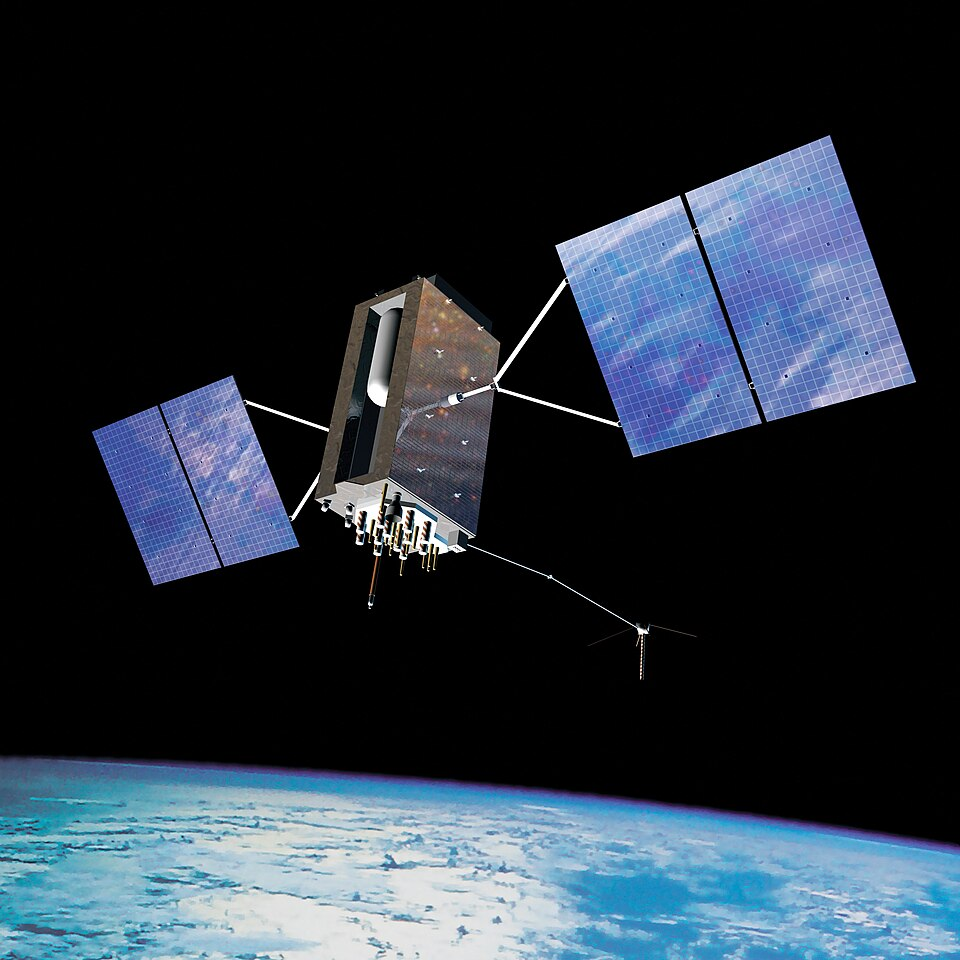

# Day 79: Calculating Distance between GPS coordinates (Haversine Formula)

Welcome to Day 79! Today we tackle **geographical vector navigation**. Using spherical trigonometry, we will write the **Haversine Formula** and the **True-North Bearing Solver** from scratch on the Arduino Uno. We will study the mathematics of great-circle paths, explore the floating-point limits of 8-bit AVR microcontrollers, and build a console tool to simulate geographic coordinate movements.

---


## 📸 Component Visuals

<p align="center">
  
  
  
  
  
</p>

## 🎯 The "Why" and "What"

GPS coordinates (Latitude and Longitude) represent angular coordinates on a sphere. They cannot be treated as standard Cartesian $(x,y)$ values on a flat grid because:
- The distance between lines of longitude shrinks as you move from the equator to the poles.
- The Earth is curved.

In autonomous robotics and path planning:
1. **Waypoint Navigation**: To guide an autonomous tractor or delivery drone to a target coordinate, the robot must continuously calculate the straight-line **distance** and the target **bearing (heading)** from its current position to the destination.
2. **Geofencing**: Drawing virtual boundaries (circular geofences) and triggering events when the distance from a home base exceeds a certain range.

---

## 🔬 Physics & Hardware Theory

### 1. The Haversine Formula (Great-Circle Distance)
The Haversine formula calculates the shortest distance between two points on the surface of a sphere (known as the **Great-Circle Distance**):

$$\Delta\phi = \text{lat}_2 - \text{lat}_1, \quad \Delta\lambda = \text{lon}_2 - \text{lon}_1$$
$$a = \sin^2\!\left(\frac{\Delta\phi}{2}\right) + \cos(\text{lat}_1) \cdot \cos(\text{lat}_2) \cdot \sin^2\!\left(\frac{\Delta\lambda}{2}\right)$$
$$c = 2 \cdot \text{atan2}\!\left(\sqrt{a}, \sqrt{1-a}\right)$$
$$d = R \cdot c$$

- **$R$ (Earth Radius)**: Mean radius of the Earth $\approx 6,371,000\,\text{meters}$ (or $6371\,\text{km}$).
- *Note: All angles (latitudes, longitudes, differences) must be converted from degrees to radians before inputting to trigonometric functions ($rad = deg \cdot \frac{\pi}{180}$).*

### 2. True-North Bearing (Target Heading)
To steer a robot towards a waypoint, we calculate the initial bearing ($\theta$, compass angle relative to true North):

$$\theta = \text{atan2}\!\left(\sin(\Delta\lambda)\cos(\text{lat}_2), \ \cos(\text{lat}_1)\sin(\text{lat}_2) - \sin(\text{lat}_1)\cos(\text{lat}_2)\cos(\Delta\lambda)\right)$$

- Convert the output from radians back to degrees.
- Normalize the bearing to the range $0^\circ \le \theta < 360^\circ$ (where $0^\circ$ is North, $90^\circ$ is East, $180^\circ$ is South, and $270^\circ$ is West).

```
                      North (0°)
                          ▲
                          │
       West (270°) ◄──────┼──────► East (90°)
                          │   / Target bearing (e.g. 45°)
                          │  /
                          │ /
                          │▼
                      South (180°)
```

### 3. Floating-Point Limits on 8-bit AVR
On standard 8-bit AVR microcontrollers (like the ATmega328P on the Arduino Uno):
- The `double` data type is treated exactly the same as a `float` (both are single-precision 32-bit floating-point numbers complying with IEEE 754).
- 32-bit floats provide only **6 to 7 decimal digits of precision**.
- At the equator, $1^\circ$ of latitude $\approx 111.32\,\text{km}$. Therefore, a resolution of $0.000001^\circ$ (6 decimal places) corresponds to approximately $11.1\,\text{cm}$.
- Floating-point arithmetic errors will accumulate slightly during complex trigonometric calculations, resulting in a distance resolution of $\pm 1\,\text{meter}$. For standard waypoint navigation, this is well within acceptable limits.

---

## 🔩 Components Needed

| Component | Quantity | Purpose |
| :--- | :--- | :--- |
| Arduino Uno | 1 | Navigation Processor |
| NEO-6M GPS Module | 1 | GPS Receiver |
| 4.7 kΩ and 10 kΩ Resistors | 1 | Voltage divider for GPS RX pin |
| Breadboard & Jumper Wires | 1 | Connections |

---

## 🔌 Pin-to-Pin Wiring

Refer to the wiring mapping from Day 78. If no physical GPS module is connected, the simulation shell allows complete testing directly via the serial terminal.

| NEO-6M Pin | Arduino Uno Pin | Description |
| :--- | :--- | :--- |
| **VCC** | **5V** | Power supply |
| **GND** | **GND** | Ground |
| **TX** | **D2** | Software RX (direct connection) |
| **RX** | **D3** (via divider) | Software TX (D3 -> 4.7kΩ -> GPS RX -> 10kΩ -> GND) |

---

## 💾 Alternatives to spherical calculations

| Method | Accuracy | Range Limit | CPU Cost | Notes |
| :--- | :--- | :--- | :--- | :--- |
| **Haversine (Our Choice)** | High | Global | Moderate | Assumes spherical Earth. Ideal balance of speed and precision. |
| **Pythagorean (Flat Earth)** | Very High | Local ($< 10\,\text{km}$) | Low | Fast. Assumes flat grid: $d = \sqrt{\Delta x^2 + \Delta y^2}$. |
| **Vincenty's Formulae** | Extremely High | Global | Extremely High | Assumes oblate spheroid Earth. Too heavy for 8-bit MCU. |

---

## 💻 How to Test & Validate

1. Upload [Day_79_GPS_Distance.ino](file:///d:/Downloads/100%20days%20of%20Arduino/Day_79_GPS_Distance/Day_79_GPS_Distance.ino) to the Arduino Uno.
2. Open the **Serial Monitor** at **9600 Baud**.
3. **Navigational Simulation Mode**:
   - Set the Home Base (e.g. Bangalore, India): Type `h 12.9716 77.5946`.
   - Set the Current Location (e.g. MG Road, Bangalore): Type `c 12.9748 77.6083`.
   - The console will instantly output:
     ```text
     ====== NAVIGATIONAL VECTOR CALCULATED ======
      Origin (Home) : 12.971600, 77.594600
      Target        : 12.974800, 77.608300
      Distance      : 1.523 km
      Bearing       : 76.5° (East-North-East)
     ============================================
     ```
   - Test a short walk: Type `c 12.9718 77.5948`. The output displays:
     `Distance: 31.0 meters | Bearing: 44.8° (North-East)`.

---

## 🛠️ Troubleshooting Guide

| Symptom | Likely Cause | Fix |
| :--- | :--- | :--- |
| Distance output prints `0.0 meters` | Identical coordinates entered | Ensure the lat/lon values for Home and Current differ. |
| Navigational coordinates show `NaN` | Division by zero or domain error in `asin`/`acos` | Check that lat/lon inputs are within valid ranges: Latitude $\pm 90^\circ$, Longitude $\pm 180^\circ$. |
| Distance values differ from online map tools | Spherical vs Oblate Spheroid models | Haversine assumes a perfect sphere. Online tools use the WGS-84 oblate spheroid model (Vincenty's formula), resulting in minor deviations of up to $0.5\%$. |
| Serial parses floats incorrectly | String formatting symbols | Enter coordinates with clear space dividers and no commas (e.g., `c 12.34 56.78`). |

## 🧠 Code Explanation

Let's break down how we navigate the globe using spherical geometry:

### 1. The Haversine Formula (Great-Circle Distance)
```cpp
float a = sin(dLat/2)*sin(dLat/2) + cos(lat1)*cos(lat2) * sin(dLon/2)*sin(dLon/2);
float c = 2.0 * atan2(sqrt(a), sqrt(1.0 - a));
float distance = EARTH_RADIUS_M * c;
```
- You cannot use standard algebra (Pythagorean theorem) to measure distance on a global scale because the Earth is a sphere, not flat!
- We implemented the Haversine Formula, a robust spherical trigonometry algorithm used by aircraft and ships. It calculates the shortest path over the curved surface of the Earth between two points.
- By multiplying the resulting angle by the radius of the Earth ($6,371,000$ meters), we get an incredibly accurate distance measurement in meters!

### 2. Forward Bearing (Compass Heading)
```cpp
float y = sin(dLon) * cos(lat2);
float x = cos(lat1) * sin(lat2) - sin(lat1) * cos(lat2) * cos(dLon);
float bearing = atan2(y, x) * RAD_TO_DEG;
```
- Distance alone isn't enough; an autonomous robot needs to know *which direction* to drive to get Home.
- This formula computes the initial bearing angle. We use `atan2()`, which intelligently handles all four quadrants of the coordinate plane.
- The result is an angle from 0° to 360°, pointing directly True North (0°), East (90°), South (180°), or West (270°)!
