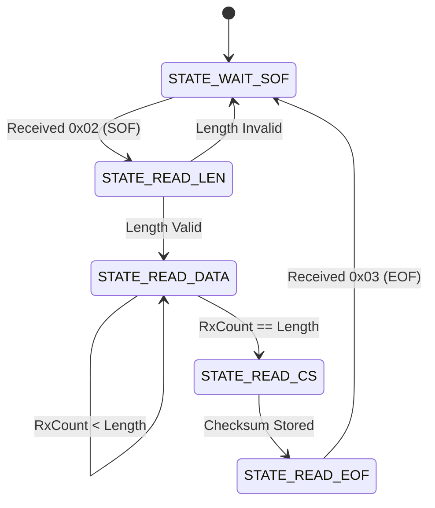

# Day 94: Parsing Serial Telemetry from a PC (FSM Packet Framing & Checksum Validation)

Welcome to Day 94! Today we master the art of **Robotic Serial Communication** by implementing a non-blocking **Finite State Machine (FSM) Telemetry Parser**. We will study why standard ASCII-based text parsing (like `Serial.parseInt()`) is unacceptable for high-performance control systems, design a structured binary packet framing protocol, and implement **XOR Checksum validation** to verify data integrity.

---


## 📸 Component Visuals

<p align="center">
  
  
  
</p>

## 🎯 The "Why" and "What"

When a PC (e.g. running ROS, Python, or MATLAB) communicates with an Arduino to control motors or read sensors:
- Sending commands as strings (like `"SPEED=255\n"`) is highly inefficient: it uses 10 bytes of bandwidth to send what could fit in 2 bytes.
- String parsing functions like `Serial.parseInt()` are **blocking**: they pause CPU execution while waiting for a timeout, which ruins timing critical loops (like PID controllers or step generators).
- If serial noise drops a byte mid-transmission, strings get garbled and the parser breaks.

### What is Packet Framing & FSM Parsing?
To solve this, we transmit commands as **Binary Packets** wrapped in a physical envelope:
- We define a **Start of Frame (SOF)** byte to signal the arrival of a packet.
- We declare the exact **Length** of the data payload so the receiver knows when to stop reading.
- We calculate a **Checksum** to verify that none of the bytes were corrupted in transit.
- We define an **End of Frame (EOF)** byte to verify packet boundaries.

To read this packet without stalling the processor, the Arduino processes characters **one-by-one as they arrive** using a **Finite State Machine (FSM)**. The parser transitions from state to state dynamically and executes the command instantly when the packet is validated.

---

## 🔬 Physics & Hardware Theory

### 1. Packet Structure
Our serial frame is structured as follows:
```
┌────────────┬──────────┬────────────┬───────────┬──────────┬────────────┐
│ SOF (0x02) │   Length │ Command ID │  Payload  │ Checksum │ EOF (0x03) │
└────────────┴──────────┴────────────┴───────────┴──────────┴────────────┘
   1 byte      1 byte      1 byte      N bytes     1 byte      1 byte
```

- **SOF (0x02 - Start of Text)**: Tells the parser to reset its buffer and start collecting.
- **Length**: Declares the total number of bytes in the data payload (including the Command ID).
- **Command ID**: Specifies what action to execute.
- **Payload**: Arguments for the command (e.g. Left/Right speed bytes).
- **Checksum**: A mathematical check byte.
- **EOF (0x03 - End of Text)**: Confirms the end of the packet frame.

### 2. XOR Checksum Physics
Noise in serial lines (electromagnetic interference from motors) can flip bits. A **Checksum** acts as a validation code.
We use an **XOR (Exclusive OR) Checksum** because it is extremely fast to calculate in 8-bit registers:
$$\text{Checksum} = \text{Byte}_1 \oplus \text{Byte}_2 \oplus \dots \oplus \text{Byte}_N$$

XOR properties:
- If a single byte is corrupted, the calculated checksum will not match the transmitted checksum, and the packet is safely discarded.
- It requires no divisions or float math, taking only a single instruction cycle per byte.

### 3. FSM State Transition
The FSM handles incoming bytes sequentially. It has 5 states:



---

## 🔩 Components Needed

No external hardware is needed! Connect your Arduino Uno to your PC using a standard USB cable. The project contains a built-in loopback test generator that simulates incoming binary telemetry streams.

---

## 🔌 Pin-to-Pin Wiring

- **No wiring required**. Connect the Arduino Uno to your PC's USB port.

---

## 💾 Alternatives to Binary FSM Parsers

| Method | Bandwidth Usage | CPU Overhead | Parsing Jitter | Corruption Immunity | Notes |
| :--- | :--- | :--- | :--- | :--- | :--- |
| **FSM Binary Parser** | **Very Low** | **Very Low** | **Zero (Non-blocking)** | **High (Checksum)** | Standard for ROS, drones, and industrial controls. |
| **Serial.readStringUntil()** | High | Low | High (Blocking) | Low | Good for quick prototyping, unacceptable for real-time loops. |
| **JSON Parser** | Very High | High | High | Moderate | E.g. ArduinoJson. Easy to read, but memory footprint is too large for Uno. |
| **Protobuf / NanoPB** | Low | Medium | Low | High | Excellent serialization, requires PC-side compilation. |

---

## 💻 How to Test & Validate

1. Open the Arduino IDE, load [Day_94_Serial_Parser.ino](file:///d:/Downloads/100%20days%20of%20Arduino/Day_94_Serial_Parser/Day_94_Serial_Parser.ino), and upload it to your board.
2. Open the **Serial Monitor** at **9600 Baud**. (Ensure "No line ending" is selected in the bottom dropdown of the Serial Monitor).
3. The interface displays the CLI options.
4. **Test Case 1: Send LED ON Packet**:
   - Send `l` (lowercase L) in the Serial Monitor.
   - The simulator generates a structured packet: `02 02 10 01 11 03`.
   - The FSM logs each state transition:
     `SOF Detected -> Length: 2 bytes -> Reading Data -> Checksum Received: 0x11, Calculated: 0x11 -> Valid packet verified!`
   - The onboard Pin 13 LED will turn ON!
5. **Test Case 2: Send LED OFF Packet**:
   - Send `m`.
   - The simulator generates packet: `02 02 10 00 10 03`.
   - The FSM validates the checksum and turns the LED OFF.
6. **Test Case 3: Send Motor Speeds**:
   - Send `e`.
   - The simulator sends a motor command packet containing left and right speeds: `02 03 20 50 CE 9E 03`.
   - Observe how the values `50` (decimal 80) and `CE` (decimal -50 in two's complement) are parsed and displayed.
7. **Test Case 4: Checksum Error Rejection**:
   - Send `r`.
   - The simulator generates a packet with an intentional checksum error (`wrongCs = 0xFF`).
   - The parser logs: `CHECKSUM ERROR: Discarding packet.` (LED state does not change, proving system safety!).

---

## 🛠️ Troubleshooting Guide

| Symptom | Likely Cause | Fix |
| :--- | :--- | :--- |
| Sending `l` or `m` does nothing | Serial Monitor line endings enabled | Ensure the dropdown in the Serial Monitor is set to **No Line Ending**. Carriage returns (`\r`) or line feeds (`\n`) can interfere with command parsing if sent at the wrong time. |
| Parser gets stuck in `STATE_READ_DATA` | Packet length mismatch | If the length byte is larger than the actual bytes sent, the FSM will wait indefinitely. Always make sure your packet generation code on the PC writes the exact number of bytes declared in the length field. |
| Noise corruption causes frequent discarded packets | Poor electrical grounding | Ensure the PC and Arduino share a common ground. Add a shielding sheath around the serial cables when running near high-power DC motors. |

## 🧠 Code Explanation

Let's break down how a Finite State Machine guarantees perfect data transmission:

### 1. The Problem with String Parsing
- Using `Serial.parseInt()` or `Serial.readStringUntil('\n')` is incredibly slow and CPU intensive. Worse, if a single byte is lost due to electrical noise, the entire string shifts, causing catastrophic robotic failure.

### 2. Binary Framing Protocol
- We construct a highly rigid data packet:
  `[Start Byte (0x02)] [Length] [Command ID] [Payload Data] [Checksum] [End Byte (0x03)]`
- The `0x02` tells the Arduino to wake up and expect a packet. The `Length` tells it exactly how many payload bytes to read.

### 3. The Finite State Machine (FSM)
```cpp
switch (currentState) {
  case STATE_WAIT_SOF:
    if (val == 0x02) currentState = STATE_READ_LEN;
    break;
```
- The FSM evaluates one single byte at a time in a completely non-blocking loop. 
- If the Arduino is in the `STATE_WAIT_SOF` state, it ignores all incoming bytes until it sees `0x02`. Then it cleanly transitions to the next state.

### 4. Checksum Data Validation
```cpp
calculatedChecksum ^= val; // Cumulative XOR
```
- To ensure no payload bytes were corrupted over the wire, the sender XORs all the data bytes together and attaches the result as a "Checksum" byte at the end of the packet.
- The Arduino recalculates the XOR sum as it receives the bytes. If the Arduino's sum does not perfectly match the sender's Checksum byte, it means electrical noise flipped a bit in transit. The packet is instantly discarded to prevent the robot from executing a corrupted, dangerous command!
