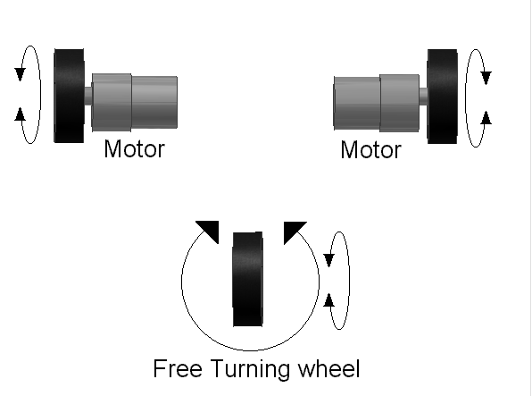

# Day 96: Differential Drive Robot Odometry (Forward Kinematics from Wheel Encoders)

Welcome to Day 96! Today we build the mathematical engine for mobile robot navigation: **Wheel Odometry (Dead Reckoning)**. We will write the forward kinematics solver for a two-wheeled differential drive robot, convert raw wheel encoder ticks into physical displacement, and implement **Runge-Kutta Midpoint Integration** to track the robot's coordinates $(X, Y)$ and heading ($\theta$) in real-time.

---


## 📸 Component Visuals

<p align="center">
  
  
  
  
  
  
</p>

## 🎯 The "Why" and "What"

If you want an autonomous robot to navigate a room, it must know: **"Where am I?"**
While outdoor robots use GPS, GPS does not work indoors and has an accuracy error of several meters. 

For indoor mobile robots (like vacuum cleaners or warehouse AGVs), we use **Odometry**. 
By mounting rotary encoders on the wheels, we measure how far each wheel rotates.
- **Why Wheel Encoders?** They are the direct link between the robot's motors and the physical floor.
- **Why this Math?** By combining the left and right wheel speeds, we can calculate the robot's change in heading and position, allowing us to estimate its path and publish coordinates to higher-level frameworks like ROS (Robot Operating System).

---

## 🔬 Physics & Mathematics of Odometry

A differential drive robot has two independently driven wheels on a common axis. We define:
- $D_{\text{wheel}}$: Diameter of the wheels.
- $N_{\text{ticks}}$: Total encoder ticks per full wheel revolution.
- $W$: Track width (the distance between the two wheels' contact points on the floor).

### 1. Distance per Encoder Tick
The physical distance the robot travels during a single encoder transition is:
$$\text{DistancePerTick} = \frac{\pi \cdot D_{\text{wheel}}}{N_{\text{ticks}}}$$

For our simulation yellow wheels ($D_{\text{wheel}} = 6.6\,\text{cm}$, $N_{\text{ticks}} = 20$):
$$\text{DistancePerTick} = \frac{\pi \cdot 6.6}{20} \approx 1.0367\,\text{cm/tick}$$

### 2. Kinematic Integration (Runge-Kutta Midpoint)
In every update cycle, we read the change in encoder ticks ($\Delta \text{ticks}_L, \Delta \text{ticks}_R$) and calculate the physical wheel displacements:
$$d_L = \Delta \text{ticks}_L \cdot \text{DistancePerTick}$$
$$d_R = \Delta \text{ticks}_R \cdot \text{DistancePerTick}$$

- **Linear center displacement ($d_C$)**: How far the center of the robot moved forward.
  $$d_C = \frac{d_L + d_R}{2}$$
- **Angular yaw displacement ($d\theta$)**: How much the heading angle changed (in radians).
  $$d\theta = \frac{d_R - d_L}{W}$$

To calculate the new position, instead of simple Euler integration (which assumes the robot was at its old heading for the entire step, leading to high truncation error), we use **Runge-Kutta 2nd Order Midpoint Integration**. We assume the robot rotated by half of $d\theta$ mid-step:
$$\theta_k = \theta_{k-1} + d\theta$$
$$X_k = X_{k-1} + d_C \cdot \cos\left(\theta_{k-1} + \frac{d\theta}{2}\right)$$
$$Y_k = Y_{k-1} + d_C \cdot \sin\left(\theta_{k-1} + \frac{d\theta}{2}\right)$$

```
                           Y
                           ▲
                           │          Position (X_k, Y_k)
                           │                o
                           │               / \ 
                           │              /   \
                           │    d_C      /     \  Theta_k
                           │            /       \
                           │  o────────┘         \
                           │ (X_k-1, Y_k-1)
                           │
                           └────────────────────────► X
```

---

## 🔩 Components Needed

| Component | Quantity | Purpose |
| :--- | :--- | :--- |
| Arduino Uno | 1 | Microcontroller |
| Photo-Interrupter Encoders | 2 | Counts slots in the encoder discs |
| Slotted Encoder Discs (20 Slots) | 2 | Mounted on the motor shafts |
| Differential Robot Chassis | 1 | Acrylic base, motors, and wheels |
| Breadboard & Jumper Wires | 1 | Wiring |

---

## 🔌 Pin-to-Pin Wiring

| Encoder Pin | Arduino Uno Pin | Description |
| :--- | :--- | :--- |
| **Left Encoder Signal** | **D2 (INT0)** | Left ticks interrupt |
| **Right Encoder Signal** | **D3 (INT1)** | Right ticks interrupt |
| **Encoders VCC** | **5V** | 5V Power Supply |
| **Encoders GND** | **GND** | Ground |

---

## 💾 Alternatives to Odometry Position Tracking

| Method | Drift Rate | Indoor Capability | CPU Overhead | Cost | Notes |
| :--- | :--- | :--- | :--- | :--- | :--- |
| **Wheel Encoders (Odometry)** | **Low to Medium** | **Yes** | **Very Low** | **Very Low** | Standard baseline. Fails on slippery surfaces (wheel slip). |
| **IMU Dead Reckoning** | Extremely High | Yes | Moderate | Low | Accelerometer double integration drifts in seconds. |
| **Optical Flow Sensor** | Low | Yes | High | Moderate | Uses a downward-pointing mouse camera sensor to track absolute ground movement. |
| **LiDAR SLAM** | Zero (Corrected) | Yes | Very High | High | Requires a ROS SBC (Raspberry Pi/Jetson) to match lasers to map walls. |

---

## 💻 How to Test & Validate

1. Open the Arduino IDE, load [Day_96_Differential_Drive_Odometry.ino](file:///d:/Downloads/100%20days%20of%20Arduino/Day_96_Differential_Drive_Odometry/Day_96_Differential_Drive_Odometry.ino), and upload it to your board.
2. Open the **Serial Monitor** at **9600 Baud**.
3. **Straight Forward Test**:
   - Send `f`. The automatic simulator starts adding ticks to both wheels at 10 Hz.
   - You should see the coordinates update. The heading stays at `0.0` degrees, and $X$ increases, while $Y$ stays near `0.0`.
4. **Circular Curve Test**:
   - Send `c`. The simulator sets the left wheel faster than the right.
   - Open **Tools > Serial Plotter**. You will see the coordinates $X$ and $Y$ trace out sine and cosine curves, showing the robot driving in a circular circle!
5. **Pivot Turn Test**:
   - Send `t`. The robot spins in place.
   - Observe how $X$ and $Y$ stay constant, while `Heading` sweeps from $-180^\circ$ to $+180^\circ$ repeatedly.
6. **Resetting Coordinates**:
   - Send `o` to reset the tracking frame to origin `(0, 0, 0)`.

---

## 🛠️ Troubleshooting Guide

| Symptom | Likely Cause | Fix |
| :--- | :--- | :--- |
| Coordinates drift and show large errors in physical runs | Wheel slip or incorrect constants | If wheels slip on carpet, odometry will report movement that did not happen. Measure the wheel diameter precisely with calipers and update `WHEEL_DIAMETER` and `WHEEL_TRACK`. |
| Ticks are not counting on physical robot | Missing pullup or wrong interrupt pins | Ensure encoder signal outputs are wired strictly to **Pin 2** (left) and **Pin 3** (right). Ensure you use `INPUT_PULLUP` if the encoders use open-collector outputs. |
| Robot moves forward, but $X$ decreases in code | Swapped encoder wiring | Swap the encoder interrupts in the code or swap the physical pins. |
| Float math slows execution | Trigonometric overhead | The odometry calculation runs at 20 Hz (every 50ms) which takes less than 1ms. If you need higher speeds, you can look up fast lookup tables or approximate equations. |

## 🧠 Code Explanation

Let's break down how a robot tracks its exact coordinates without GPS:

### 1. Reading Quadrature Ticks
```cpp
float dL = (float)deltaL * DISTANCE_PER_TICK;
float dR = (float)deltaR * DISTANCE_PER_TICK;
```
- As the wheels spin, hardware interrupts count encoder ticks. We multiply those ticks by the physical circumference of the wheel. 
- If the left wheel rolled 5.2 cm (`dL`) and the right wheel rolled 5.8 cm (`dR`), the robot has moved in an arc.

### 2. Linear and Angular Displacement
```cpp
float dC = (dL + dR) / 2.0f;
float dTheta = (dR - dL) / WHEEL_TRACK;
```
- The robot's center point moved the exact average of both wheels (`dC`).
- The robot's heading (rotation) changed based on the difference between the wheels divided by the physical width of the robot (`WHEEL_TRACK`). If the right wheel moves more than the left, the robot is curving left!

### 3. Runge-Kutta Midpoint Integration
```cpp
float midTheta = robotTheta + (dTheta / 2.0f);
robotX += dC * cos(midTheta);
robotY += dC * sin(midTheta);
```
- To update our 2D global coordinates (X, Y), we use basic trigonometry (SOH CAH TOA).
- We use the **Midpoint Method**: instead of projecting our movement using our old heading, or our new heading, we calculate the exact middle heading of the arc. This massively reduces integration errors and keeps our X, Y coordinates highly accurate over long distances!
