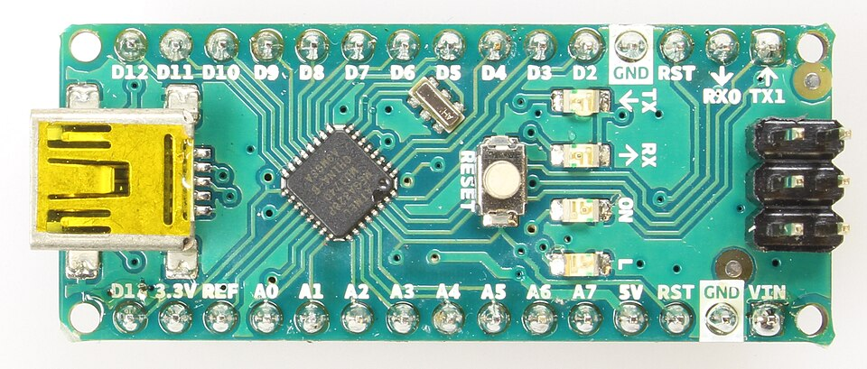

# Chapter 2: The Arduino Family

While the Arduino Uno is the most famous board, it is far from the only one. Depending on your project's size, power requirements, and necessary features, you might need a different flavor of Arduino.

Here is a breakdown of the most common boards in the Arduino ecosystem.

## 1. Arduino Uno (The Classic)
**Best for:** Beginners, prototyping, general learning.

The Uno is the board you will use for 90% of your initial learning. Almost all tutorials and libraries are written with the Uno in mind. It has female headers that make it extremely easy to plug in jumper wires for a breadboard.

- **Microcontroller:** ATmega328P
- **Operating Voltage:** 5V
- **Digital I/O Pins:** 14 (6 PWM)
- **Analog Input Pins:** 6

## 2. Arduino Nano (The Small Fry)
**Best for:** Permanent installations, putting inside small enclosures, breadboard-friendly prototyping.

The Nano is essentially an Arduino Uno shrunk down to the size of your thumb. It has almost the exact same specifications as the Uno, but instead of female headers, it usually comes with male pins so you can plug it directly into a breadboard or solder it to a custom PCB.

- **Microcontroller:** ATmega328P
- **Operating Voltage:** 5V
- **Digital I/O Pins:** 14 (6 PWM)
- **Analog Input Pins:** 8 (2 more than the Uno!)

## 3. Arduino Mega 2560 (The Heavy Lifter)
**Best for:** 3D Printers, robotics, projects requiring lots of sensors and outputs.

If you run out of pins on your Uno, you upgrade to the Mega. It is significantly larger and is packed with I/O pins and memory. It is heavily used in complex DIY robotics and custom CNC machines.

- **Microcontroller:** ATmega2560
- **Operating Voltage:** 5V
- **Digital I/O Pins:** 54 (15 PWM)
- **Analog Input Pins:** 16

## 4. Arduino Micro / Leonardo (The Keyboard Mimic)
**Best for:** Custom game controllers, macro pads, simulating a mouse or keyboard.

These boards use a different chip (the ATmega32U4). The special feature of this chip is that it has built-in USB communication. This means your computer can recognize it as a standard USB Keyboard or Mouse! We use the Leonardo in Day 90-92 of the 100 Days of Arduino to build custom HID devices.

- **Microcontroller:** ATmega32U4
- **Operating Voltage:** 5V

## 5. The Advanced Alternatives: ESP8266 & ESP32
**Best for:** IoT (Internet of Things), Wi-Fi and Bluetooth projects, processing-heavy tasks.

While technically not official "Arduino" boards, these microcontrollers by Espressif can be programmed using the Arduino IDE. They are incredibly cheap, massively more powerful than an Arduino Uno, and feature built-in Wi-Fi (and Bluetooth for the ESP32). Once you master the basics on an Uno, the ESP32 is usually the next logical step for a modern maker.

- **Microcontroller:** Xtensa Dual-Core 32-bit (ESP32)
- **Operating Voltage:** 3.3V (Warning: applying 5V to an ESP32 pin will kill it!)
- **Features:** Built-in Wi-Fi & Bluetooth

---

## Which one should you use right now?

For learning the basics and progressing through the 100 Days of Arduino challenge, **you should use the Arduino Uno.**

Its layout is the easiest to work with, it's robust (it takes a lot of abuse before dying), and every single component in a standard starter kit is designed to plug right into it.

Once your projects outgrow the Uno, you'll know exactly which board to grab next.

**[Next Chapter: Setting Up Your Environment ->](./Chapter_03_Setting_Up_Your_Environment.md)**
