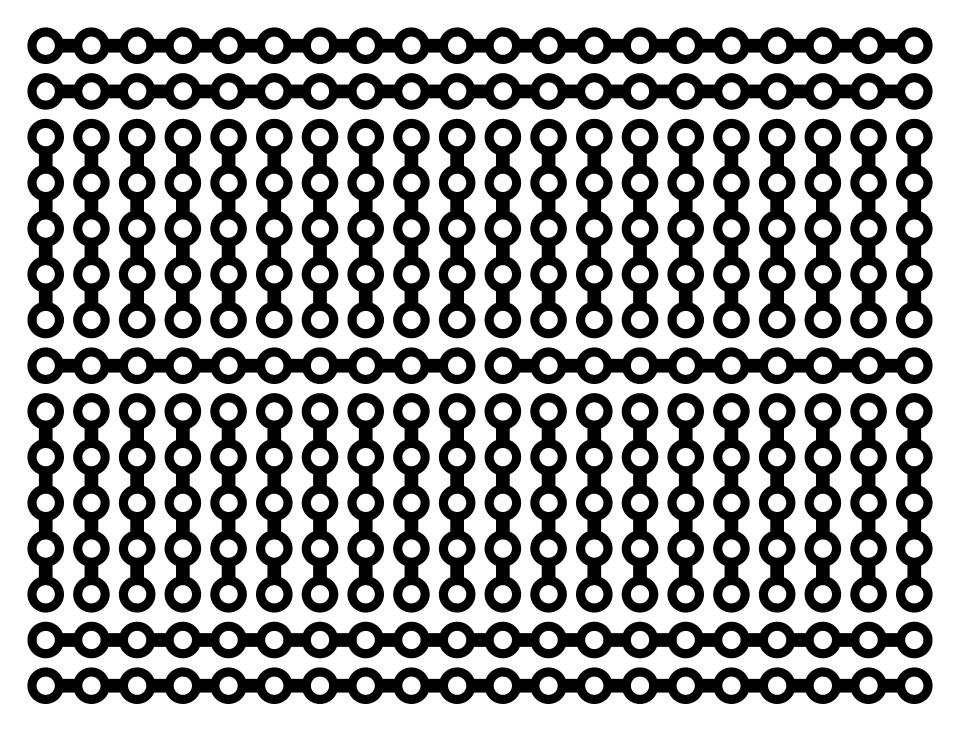
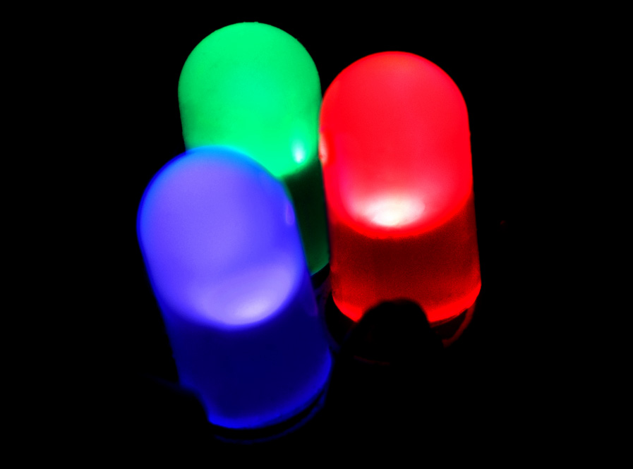

# Chapter 4: Basic Electronics Crash Course

Before we start plugging wires into the Arduino, we need to understand the fundamental laws of electricity. Don't worry, we're not getting a degree in electrical engineering today—just the absolute basics to keep our Arduino from letting out the "magic smoke" (burning up).

## The Big Three: Voltage, Current, and Resistance

Electricity is often compared to water flowing through pipes.

1. **Voltage (V) - Measured in Volts:** This is the water pressure. It is the force pushing the electricity through the wire. Your Arduino Uno operates at **5 Volts (5V)**.
2. **Current (I) - Measured in Amperes (Amps/mA):** This is the flow rate of the water. How much electricity is actually moving through the wire. Microcontrollers deal in very small amounts of current, usually measured in milliamperes (mA) (1/1000th of an Amp).
3. **Resistance (R) - Measured in Ohms (Ω):** This is a kink in the pipe. It restricts the flow of current.

### Ohm's Law
These three properties are mathematically linked by Ohm's Law: **V = I × R** (Voltage = Current × Resistance). 
If you have a 5V supply, and you want to lower the current (I), you must increase the resistance (R).

> [!CAUTION]  
> **The Golden Rule of Electronics:**
> Electricity MUST have a complete path from a power source (Voltage) back to the ground (GND) to flow. If there is no complete path, nothing happens.
> **BUT**, if that path has **ZERO resistance**, infinite current will try to flow instantly, causing a **Short Circuit**. This will fry your Arduino or start a fire. Never connect 5V directly to GND with just a wire!

---

## How to use a Breadboard

When we build circuits, we don't want to permanently solder everything together right away. We use a **Breadboard** to quickly plug and unplug components.

*(Image Credit: Wikimedia Commons)*

Look at the image above. The holes in a breadboard are connected underneath by metal strips:
1. **Power Rails (The sides):** The long red and blue lines running vertically down the sides. All the holes next to the red line are connected together, and all the holes next to the blue line are connected together. We usually connect the Arduino's `5V` pin to the red rail, and the `GND` pin to the blue rail.
2. **Terminal Strips (The middle):** The rows in the middle are connected **horizontally** (usually in sets of 5 holes). If you plug a wire into hole A1, it is electrically connected to holes B1, C1, D1, and E1.
3. **The Center Divider:** The trench in the middle separates the left half from the right half.

---

## Basic Components

### 1. Jumper Wires
These are just wires with pins on the end. The color doesn't matter electrically, but for your own sanity, try to establish a color code!
- Red = Power (5V)
- Black/Brown = Ground (GND)
- Yellow/Green/Blue = Signal wires

### 2. Resistors

Resistors restrict the flow of current. They are not polarized, meaning you can plug them in backwards and they work the same.
You can tell the value of a resistor by looking at the colored bands painted on it. For beginners, a simple multimeter is much easier than memorizing the color codes!

### 3. LEDs (Light Emitting Diodes)

LEDs turn electricity into light. 
- **They are Polarized!** Electricity can only flow through an LED in one direction. 
- The long leg is the **Anode (+)**.
- The short leg is the **Cathode (-)** (often next to a flat edge on the plastic bulb).

> [!WARNING]  
> **Never connect an LED directly to 5V and GND!** 
> An LED has almost no internal resistance. If you connect it directly to 5V, it will draw too much current and instantly explode/burn out.
> **Always put a resistor in series with an LED.** For a 5V Arduino, a 220Ω or 330Ω resistor is perfect.

---

## Your First Real Circuit

Take your Arduino, a breadboard, an LED, a 220 Ohm resistor, and two jumper wires.

1. Connect a wire from the Arduino's `GND` pin to the blue rail on the breadboard.
2. Connect a wire from the Arduino's `5V` pin to the red rail on the breadboard.
3. Plug the resistor into the breadboard so one leg is in the red rail (5V), and the other leg is in a random row in the middle (e.g., row 10).
4. Plug the LED into the breadboard. The **Long Leg (+)** goes into the same row as the resistor (row 10).
5. Plug the **Short Leg (-)** of the LED into the blue rail (GND).

The LED should instantly light up! 
You just completed a circuit: `5V -> Resistor -> LED -> GND`.

Now that we understand how to safely power components, let's learn how to control them with code.

**[Next Chapter: Arduino Programming Basics ->](./Chapter_05_Arduino_Programming_Basics.md)**
