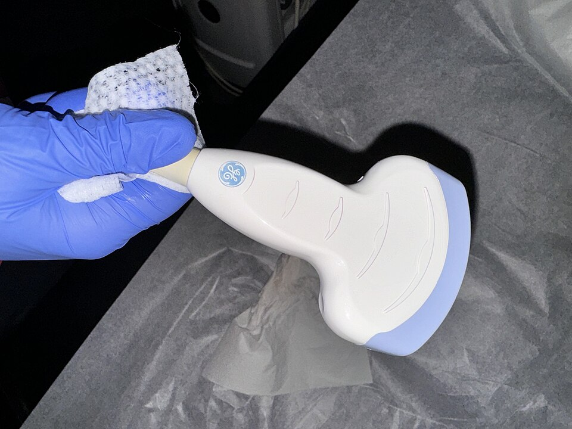

# Chapter 11: Component Visual Glossary

The 100 Days of Arduino challenge uses dozens of different sensors, modules, and actuators. 
Before you start the challenge, familiarize yourself with these components so that when you read "Day 14: Membrane Keypad", you have an exact picture in your mind of what you are working with!

## Sensors (Inputs)

### 1. PIR Motion Sensor

Detects motion by measuring changes in the infrared levels emitted by surrounding objects (like humans). Used in burglar alarms and automated lighting.

### 2. IR Receiver (Infrared)

Receives infrared signals from standard TV remotes. Used to decode remote control button presses.

### 3. Rotary Encoder

A knob that you can spin endlessly in either direction. It outputs pulses that tell the Arduino which way it is turning. Often has a built-in push button.

### 4. Joystick Module

Similar to a PlayStation or Xbox controller thumbstick. It contains two potentiometers (for X and Y axis) and a push button.

### 5. Ultrasonic Sensor (HC-SR04)

Measures distance by sending out a burst of ultrasonic sound and timing how long the echo takes to return. Looks like two little silver "eyes".

### 6. MPU6050 (IMU)

An Inertial Measurement Unit. It contains a 3-axis accelerometer and a 3-axis gyroscope. Used to measure tilt, rotation, and balance for drones and self-balancing robots.

### 7. GPS Module (NEO-6M)

Receives signals from satellites to determine exact latitude, longitude, and global time.

## Actuators (Outputs)

### 8. Servo Motor

A specialized motor that can accurately rotate to a specific angle (usually between 0 and 180 degrees). Used for robotic arms and steering.

### 9. DC Motor

A standard motor that spins continuously when power is applied. Reversing the polarity reverses the direction.

### 10. Stepper Motor

A motor that moves in discrete, precise "steps" rather than spinning continuously. Excellent for 3D printers and precise machinery.

### 11. Piezo Buzzer

Converts electrical signals into sound. Active buzzers beep when power is applied, while Passive buzzers require the Arduino to send specific frequencies to play melodies.

### 12. Relay Module

An electrically operated switch. It allows your 5V Arduino to safely turn on and off high-voltage appliances (like a 120V/240V lamp or a heavy pump).

## Displays

### 13. 16x2 LCD Display

A simple, classic screen that can display 2 rows of 16 text characters.

### 14. OLED Display (SSD1306)

A tiny, high-contrast, pixel-perfect screen capable of rendering smooth graphics, animations, and custom fonts.

### 15. Seven-Segment Display

Used for digital clocks and counters. It consists of 7 LEDs arranged in a figure-8 pattern to display numbers.

## Modules & Communication

### 16. Membrane Keypad (4x4)

A flat 16-button matrix used for password locks and calculator interfaces.

### 17. L298N Motor Driver

An H-Bridge module that sits between the Arduino and DC motors, providing them with the heavy power they need to move.

### 18. Bluetooth Module (HC-05)

Allows your Arduino to communicate wirelessly with a smartphone or laptop.

### 19. RFID Reader (MFRC522)

Reads wireless ID cards and keyfobs, like the ones used to unlock office doors or hotel rooms.

### 20. MicroSD Card Module

Allows the Arduino to save vast amounts of data (like temperature logs or GPS paths) to a standard SD card.

---

[<-- Back to Main Guide](./README.md)
